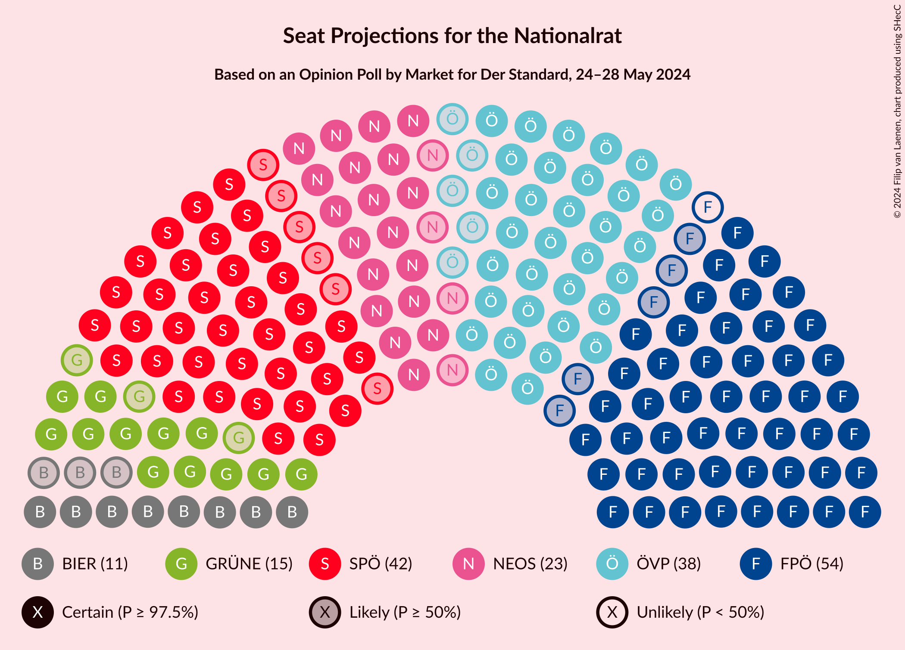

# Opinion Poll by Market for Der Standard, 24–28 May 2024

<a href="#voting-intentions">Voting Intentions</a> | <a href="#seats">Seats</a> | <a href="#coalitions">Coalitions</a> | <a href="#technical-information">Technical Information</a>

## Voting Intentions

### Confidence Intervals

| Party | Last Result | Poll Result | 80% Confidence Interval | 90% Confidence Interval | 95% Confidence Interval | 99% Confidence Interval |
|:-----:|:-----------:|:-----------:|:-----------------------:|:-----------------------:|:-----------------------:|:-----------------------:|
| Freiheitliche Partei Österreichs | 16.2% | 28.0% | 26.0–30.1% |25.5–30.7% |25.0–31.2% |24.1–32.2% |
| Sozialdemokratische Partei Österreichs | 21.2% | 22.0% | 20.2–23.9% |19.7–24.5% |19.3–25.0% |18.4–25.9% |
| Österreichische Volkspartei | 37.5% | 20.0% | 18.3–21.9% |17.8–22.5% |17.4–22.9% |16.6–23.9% |
| NEOS–Das Neue Österreich und Liberales Forum | 8.1% | 12.0% | 10.7–13.6% |10.3–14.1% |10.0–14.5% |9.4–15.3% |
| Die Grünen–Die Grüne Alternative | 13.9% | 8.0% | 6.9–9.3% |6.6–9.7% |6.3–10.1% |5.8–10.7% |
| Bierpartei | 0.0% | 6.0% | 5.1–7.2% |4.8–7.6% |4.6–7.9% |4.2–8.5% |
| Kommunistische Partei Österreichs | N/A | 2.9% | 2.3–3.9% |2.1–4.1% |2.0–4.4% |1.7–4.8% |

*Note:* The poll result column reflects the actual value used in the calculations. Published results may vary slightly, and in addition be rounded to fewer digits.

## Seats

### Confidence Intervals

| Party | Last Result | Median | 80% Confidence Interval | 90% Confidence Interval | 95% Confidence Interval | 99% Confidence Interval |
|:-----:|:-----------:|:------:|:-----------------------:|:-----------------------:|:-----------------------:|:-----------------------:|
| <a href="#freiheitliche-partei-österreichs">Freiheitliche Partei Österreichs</a> | 31 | 53 | 50–57 |49–58 |48–59 |46–61 |
| <a href="#sozialdemokratische-partei-österreichs">Sozialdemokratische Partei Österreichs</a> | 40 | 42 | 38–46 |37–47 |36–48 |35–49 |
| <a href="#österreichische-volkspartei">Österreichische Volkspartei</a> | 71 | 38 | 35–41 |34–43 |33–44 |31–45 |
| <a href="#neos–das-neue-österreich-und-liberales-forum">NEOS–Das Neue Österreich und Liberales Forum</a> | 15 | 23 | 20–26 |19–26 |19–27 |17–29 |
| <a href="#die-grünen–die-grüne-alternative">Die Grünen–Die Grüne Alternative</a> | 26 | 15 | 13–17 |12–18 |12–19 |11–20 |
| <a href="#bierpartei">Bierpartei</a> | 0 | 11 | 9–13 |9–14 |8–15 |7–16 |
| <a href="#kommunistische-partei-österreichs">Kommunistische Partei Österreichs</a> | N/A | 0 | 0 |0–7 |0–8 |0–8 |

