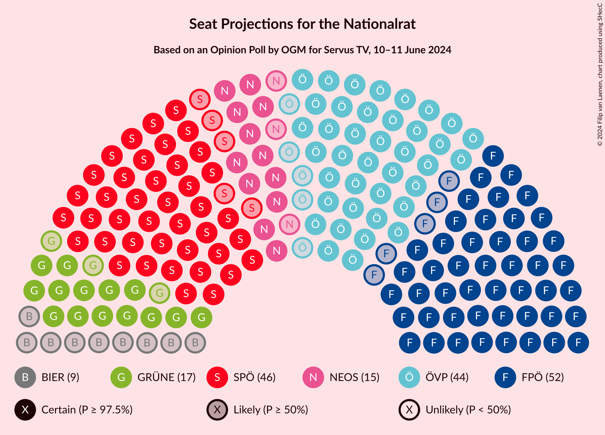

# Opinion Poll by OGM for Servus TV, 10–11 June 2024

<a href="#voting-intentions">Voting Intentions</a> | <a href="#seats">Seats</a> | <a href="#coalitions">Coalitions</a> | <a href="#technical-information">Technical Information</a>

## Voting Intentions

### Confidence Intervals

| Party | Last Result | Poll Result | 80% Confidence Interval | 90% Confidence Interval | 95% Confidence Interval | 99% Confidence Interval |
|:-----:|:-----------:|:-----------:|:-----------------------:|:-----------------------:|:-----------------------:|:-----------------------:|
| Freiheitliche Partei Österreichs | 16.2% | 27.0% | 25.4–28.7% |25.0–29.1% |24.6–29.5% |23.9–30.3% |
| Sozialdemokratische Partei Österreichs | 21.2% | 24.0% | 22.5–25.6% |22.1–26.1% |21.7–26.5% |21.0–27.3% |
| Österreichische Volkspartei | 37.5% | 23.0% | 21.5–24.6% |21.1–25.0% |20.7–25.4% |20.0–26.2% |
| Die Grünen–Die Grüne Alternative | 13.9% | 9.0% | 8.0–10.1% |7.8–10.4% |7.5–10.7% |7.1–11.3% |
| NEOS–Das Neue Österreich und Liberales Forum | 8.1% | 8.0% | 7.1–9.1% |6.9–9.4% |6.6–9.7% |6.2–10.2% |
| Bierpartei | 0.0% | 5.0% | 4.3–5.9% |4.1–6.1% |3.9–6.3% |3.6–6.8% |
| Kommunistische Partei Österreichs | N/A | 3.0% | 2.4–3.7% |2.3–3.9% |2.2–4.1% |1.9–4.5% |

*Note:* The poll result column reflects the actual value used in the calculations. Published results may vary slightly, and in addition be rounded to fewer digits.

## Seats

### Confidence Intervals

| Party | Last Result | Median | 80% Confidence Interval | 90% Confidence Interval | 95% Confidence Interval | 99% Confidence Interval |
|:-----:|:-----------:|:------:|:-----------------------:|:-----------------------:|:-----------------------:|:-----------------------:|
| <a href="#freiheitliche-partei-österreichs">Freiheitliche Partei Österreichs</a> | 31 | 52 | 49–55 |48–56 |47–57 |46–58 |
| <a href="#sozialdemokratische-partei-österreichs">Sozialdemokratische Partei Österreichs</a> | 40 | 46 | 43–49 |42–50 |41–51 |40–52 |
| <a href="#österreichische-volkspartei">Österreichische Volkspartei</a> | 71 | 44 | 41–47 |40–48 |39–49 |38–50 |
| <a href="#die-grünen–die-grüne-alternative">Die Grünen–Die Grüne Alternative</a> | 26 | 17 | 15–19 |15–20 |14–20 |13–21 |
| <a href="#neos–das-neue-österreich-und-liberales-forum">NEOS–Das Neue Österreich und Liberales Forum</a> | 15 | 15 | 13–17 |13–18 |12–18 |12–19 |
| <a href="#bierpartei">Bierpartei</a> | 0 | 9 | 8–11 |7–11 |0–12 |0–13 |
| <a href="#kommunistische-partei-österreichs">Kommunistische Partei Österreichs</a> | N/A | 0 | 0 |0 |0–7 |0–8 |

