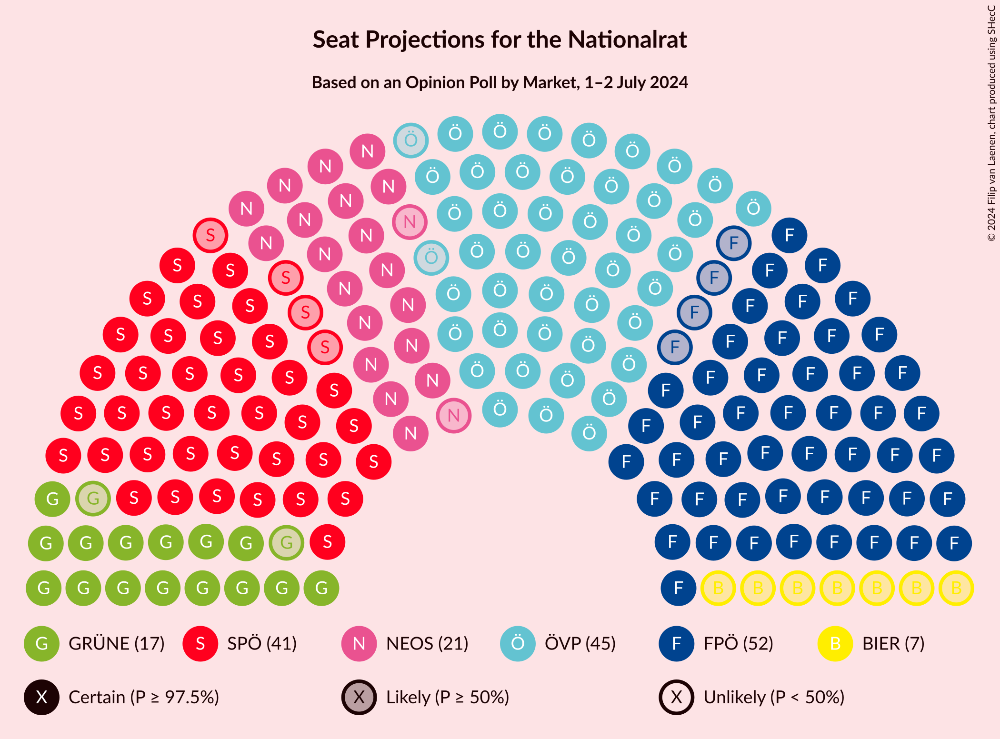
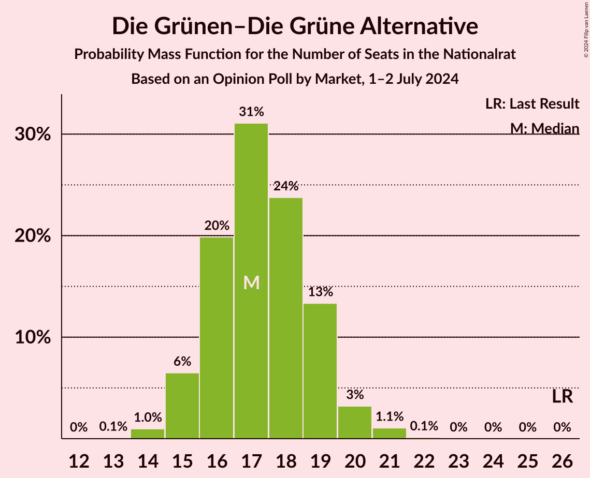

# Opinion Poll by Market, 1–2 July 2024

<a href="#voting-intentions">Voting Intentions</a> | <a href="#seats">Seats</a> | <a href="#coalitions">Coalitions</a> | <a href="#technical-information">Technical Information</a>

## Voting Intentions

### Confidence Intervals

| Party | Last Result | Poll Result | 80% Confidence Interval | 90% Confidence Interval | 95% Confidence Interval | 99% Confidence Interval |
|:-----:|:-----------:|:-----------:|:-----------------------:|:-----------------------:|:-----------------------:|:-----------------------:|
| Freiheitliche Partei Österreichs | 16.2% | 27.0% | 25.7–28.3% |25.4–28.7% |25.1–29.0% |24.5–29.6% |
| Österreichische Volkspartei | 37.5% | 24.0% | 22.8–25.3% |22.5–25.6% |22.2–25.9% |21.6–26.5% |
| Sozialdemokratische Partei Österreichs | 21.2% | 21.0% | 19.9–22.2% |19.5–22.6% |19.3–22.8% |18.7–23.4% |
| NEOS–Das Neue Österreich und Liberales Forum | 8.1% | 11.0% | 10.1–11.9% |9.9–12.2% |9.7–12.5% |9.3–12.9% |
| Die Grünen–Die Grüne Alternative | 13.9% | 9.0% | 8.2–9.9% |8.0–10.1% |7.8–10.3% |7.5–10.8% |
| Bierpartei | 0.0% | 4.0% | 3.5–4.6% |3.3–4.8% |3.2–5.0% |3.0–5.3% |
| Kommunistische Partei Österreichs | 0.7% | 2.0% | 1.6–2.5% |1.6–2.6% |1.5–2.7% |1.3–3.0% |

*Note:* The poll result column reflects the actual value used in the calculations. Published results may vary slightly, and in addition be rounded to fewer digits.

## Seats

### Confidence Intervals

| Party | Last Result | Median | 80% Confidence Interval | 90% Confidence Interval | 95% Confidence Interval | 99% Confidence Interval |
|:-----:|:-----------:|:------:|:-----------------------:|:-----------------------:|:-----------------------:|:-----------------------:|
| <a href="#freiheitliche-partei-österreichs">Freiheitliche Partei Österreichs</a> | 31 | 52 | 50–56 |49–56 |48–57 |47–58 |
| <a href="#österreichische-volkspartei">Österreichische Volkspartei</a> | 71 | 47 | 44–49 |43–50 |43–51 |42–52 |
| <a href="#sozialdemokratische-partei-österreichs">Sozialdemokratische Partei Österreichs</a> | 40 | 41 | 38–43 |38–44 |37–45 |36–46 |
| <a href="#neos–das-neue-österreich-und-liberales-forum">NEOS–Das Neue Österreich und Liberales Forum</a> | 15 | 21 | 19–23 |19–24 |19–24 |18–25 |
| <a href="#die-grünen–die-grüne-alternative">Die Grünen–Die Grüne Alternative</a> | 26 | 17 | 16–19 |15–19 |15–20 |14–21 |
| <a href="#bierpartei">Bierpartei</a> | 0 | 7 | 0–8 |0–9 |0–9 |0–10 |
| <a href="#kommunistische-partei-österreichs">Kommunistische Partei Österreichs</a> | 0 | 0 | 0 |0 |0 |0 |

### Freiheitliche Partei Österreichs

*For a full overview of the results for this party, see the [Freiheitliche Partei Österreichs](party-freiheitlicheparteiösterreichs.html) page.*

| Number of Seats | Probability | Accumulated | Special Marks |
|:---------------:|:-----------:|:-----------:|:-------------:|
| 31 | 0% | 100% | Last Result |
| 32 | 0% | 100% |  |
| 33 | 0% | 100% |  |
| 34 | 0% | 100% |  |
| 35 | 0% | 100% |  |
| 36 | 0% | 100% |  |
| 37 | 0% | 100% |  |
| 38 | 0% | 100% |  |
| 39 | 0% | 100% |  |
| 40 | 0% | 100% |  |
| 41 | 0% | 100% |  |
| 42 | 0% | 100% |  |
| 43 | 0% | 100% |  |
| 44 | 0% | 100% |  |
| 45 | 0% | 100% |  |
| 46 | 0.1% | 100% |  |
| 47 | 0.6% | 99.8% |  |
| 48 | 2% | 99.2% |  |
| 49 | 4% | 97% |  |
| 50 | 10% | 93% |  |
| 51 | 14% | 83% |  |
| 52 | 19% | 69% | Median |
| 53 | 15% | 50% |  |
| 54 | 13% | 35% |  |
| 55 | 11% | 23% |  |
| 56 | 8% | 12% |  |
| 57 | 3% | 4% |  |
| 58 | 0.9% | 1.3% |  |
| 59 | 0.3% | 0.3% |  |
| 60 | 0.1% | 0.1% |  |
| 61 | 0% | 0% |  |

### Österreichische Volkspartei

*For a full overview of the results for this party, see the [Österreichische Volkspartei](party-österreichischevolkspartei.html) page.*

| Number of Seats | Probability | Accumulated | Special Marks |
|:---------------:|:-----------:|:-----------:|:-------------:|
| 40 | 0.1% | 100% |  |
| 41 | 0.3% | 99.9% |  |
| 42 | 2% | 99.7% |  |
| 43 | 4% | 98% |  |
| 44 | 8% | 94% |  |
| 45 | 16% | 87% |  |
| 46 | 19% | 71% |  |
| 47 | 18% | 52% | Median |
| 48 | 17% | 34% |  |
| 49 | 9% | 17% |  |
| 50 | 5% | 9% |  |
| 51 | 3% | 4% |  |
| 52 | 0.9% | 1.2% |  |
| 53 | 0.3% | 0.4% |  |
| 54 | 0.1% | 0.1% |  |
| 55 | 0% | 0% |  |
| 56 | 0% | 0% |  |
| 57 | 0% | 0% |  |
| 58 | 0% | 0% |  |
| 59 | 0% | 0% |  |
| 60 | 0% | 0% |  |
| 61 | 0% | 0% |  |
| 62 | 0% | 0% |  |
| 63 | 0% | 0% |  |
| 64 | 0% | 0% |  |
| 65 | 0% | 0% |  |
| 66 | 0% | 0% |  |
| 67 | 0% | 0% |  |
| 68 | 0% | 0% |  |
| 69 | 0% | 0% |  |
| 70 | 0% | 0% |  |
| 71 | 0% | 0% | Last Result |

### Sozialdemokratische Partei Österreichs

*For a full overview of the results for this party, see the [Sozialdemokratische Partei Österreichs](party-sozialdemokratischeparteiösterreichs.html) page.*

| Number of Seats | Probability | Accumulated | Special Marks |
|:---------------:|:-----------:|:-----------:|:-------------:|
| 35 | 0.2% | 100% |  |
| 36 | 0.8% | 99.8% |  |
| 37 | 3% | 99.0% |  |
| 38 | 8% | 96% |  |
| 39 | 14% | 88% |  |
| 40 | 17% | 74% | Last Result |
| 41 | 22% | 57% | Median |
| 42 | 16% | 35% |  |
| 43 | 10% | 19% |  |
| 44 | 6% | 9% |  |
| 45 | 2% | 3% |  |
| 46 | 0.9% | 1.2% |  |
| 47 | 0.2% | 0.3% |  |
| 48 | 0.1% | 0.1% |  |
| 49 | 0% | 0% |  |

### NEOS–Das Neue Österreich und Liberales Forum

*For a full overview of the results for this party, see the [NEOS–Das Neue Österreich und Liberales Forum](party-neos–dasneueösterreichundliberalesforum.html) page.*

| Number of Seats | Probability | Accumulated | Special Marks |
|:---------------:|:-----------:|:-----------:|:-------------:|
| 15 | 0% | 100% | Last Result |
| 16 | 0% | 100% |  |
| 17 | 0.3% | 100% |  |
| 18 | 2% | 99.7% |  |
| 19 | 10% | 98% |  |
| 20 | 20% | 87% |  |
| 21 | 27% | 67% | Median |
| 22 | 23% | 40% |  |
| 23 | 11% | 17% |  |
| 24 | 4% | 6% |  |
| 25 | 1.1% | 1.4% |  |
| 26 | 0.2% | 0.3% |  |
| 27 | 0% | 0% |  |

### Die Grünen–Die Grüne Alternative

*For a full overview of the results for this party, see the [Die Grünen–Die Grüne Alternative](party-diegrünen–diegrünealternative.html) page.*

| Number of Seats | Probability | Accumulated | Special Marks |
|:---------------:|:-----------:|:-----------:|:-------------:|
| 13 | 0.1% | 100% |  |
| 14 | 1.0% | 99.9% |  |
| 15 | 6% | 98.9% |  |
| 16 | 20% | 92% |  |
| 17 | 31% | 73% | Median |
| 18 | 24% | 42% |  |
| 19 | 13% | 18% |  |
| 20 | 3% | 4% |  |
| 21 | 1.1% | 1.2% |  |
| 22 | 0.1% | 0.1% |  |
| 23 | 0% | 0% |  |
| 24 | 0% | 0% |  |
| 25 | 0% | 0% |  |
| 26 | 0% | 0% | Last Result |

### Bierpartei

*For a full overview of the results for this party, see the [Bierpartei](party-bierpartei.html) page.*

| Number of Seats | Probability | Accumulated | Special Marks |
|:---------------:|:-----------:|:-----------:|:-------------:|
| 0 | 44% | 100% | Last Result |
| 1 | 0% | 56% |  |
| 2 | 0% | 56% |  |
| 3 | 0% | 56% |  |
| 4 | 0% | 56% |  |
| 5 | 0% | 56% |  |
| 6 | 0% | 56% |  |
| 7 | 19% | 56% | Median |
| 8 | 29% | 37% |  |
| 9 | 8% | 9% |  |
| 10 | 0.9% | 0.9% |  |
| 11 | 0% | 0% |  |

### Kommunistische Partei Österreichs

*For a full overview of the results for this party, see the [Kommunistische Partei Österreichs](party-kommunistischeparteiösterreichs.html) page.*

| Number of Seats | Probability | Accumulated | Special Marks |
|:---------------:|:-----------:|:-----------:|:-------------:|
| 0 | 100% | 100% | Last Result, Median |

## Coalitions

### Confidence Intervals

| Coalition | Last Result | Median | Majority? | 80% Confidence Interval | 90% Confidence Interval | 95% Confidence Interval | 99% Confidence Interval |
|:---------:|:-----------:|:------:|:---------:|:-----------------------:|:-----------------------:|:-----------------------:|:-----------------------:|
| Freiheitliche Partei Österreichs – Österreichische Volkspartei | 102 | 99 | 99.9% | 96–103 | 95–104 | 94–105 | 92–107 |
| Freiheitliche Partei Österreichs – Sozialdemokratische Partei Österreichs | 71 | 93 | 73% | 90–98 | 89–98 | 88–99 | 87–101 |
| Österreichische Volkspartei – Sozialdemokratische Partei Österreichs | 111 | 87 | 9% | 84–91 | 83–92 | 82–93 | 81–95 |
| Österreichische Volkspartei – NEOS–Das Neue Österreich und Liberales Forum – Die Grünen–Die Grüne Alternative | 112 | 85 | 1.2% | 82–89 | 81–90 | 80–91 | 79–92 |
| Sozialdemokratische Partei Österreichs – NEOS–Das Neue Österreich und Liberales Forum – Die Grünen–Die Grüne Alternative | 81 | 79 | 0% | 76–83 | 75–84 | 74–85 | 73–86 |
| Österreichische Volkspartei – NEOS–Das Neue Österreich und Liberales Forum | 86 | 68 | 0% | 65–71 | 64–72 | 63–73 | 62–75 |
| Österreichische Volkspartei – Die Grünen–Die Grüne Alternative | 97 | 64 | 0% | 61–67 | 60–68 | 59–69 | 58–70 |
| Sozialdemokratische Partei Österreichs – Die Grünen–Die Grüne Alternative | 66 | 58 | 0% | 55–61 | 54–62 | 54–63 | 53–64 |
| Österreichische Volkspartei | 71 | 47 | 0% | 44–49 | 43–50 | 43–51 | 42–52 |
| Sozialdemokratische Partei Österreichs | 40 | 41 | 0% | 38–43 | 38–44 | 37–45 | 36–46 |

### Freiheitliche Partei Österreichs – Österreichische Volkspartei

| Number of Seats | Probability | Accumulated | Special Marks |
|:---------------:|:-----------:|:-----------:|:-------------:|
| 91 | 0.1% | 100% |  |
| 92 | 0.4% | 99.9% | Majority |
| 93 | 1.5% | 99.5% |  |
| 94 | 3% | 98% |  |
| 95 | 4% | 95% |  |
| 96 | 9% | 91% |  |
| 97 | 12% | 82% |  |
| 98 | 14% | 70% |  |
| 99 | 9% | 56% | Median |
| 100 | 10% | 47% |  |
| 101 | 12% | 37% |  |
| 102 | 8% | 25% | Last Result |
| 103 | 8% | 17% |  |
| 104 | 5% | 9% |  |
| 105 | 3% | 4% |  |
| 106 | 1.1% | 2% |  |
| 107 | 0.4% | 0.6% |  |
| 108 | 0.1% | 0.2% |  |
| 109 | 0% | 0% |  |

### Freiheitliche Partei Österreichs – Sozialdemokratische Partei Österreichs

| Number of Seats | Probability | Accumulated | Special Marks |
|:---------------:|:-----------:|:-----------:|:-------------:|
| 71 | 0% | 100% | Last Result |
| 72 | 0% | 100% |  |
| 73 | 0% | 100% |  |
| 74 | 0% | 100% |  |
| 75 | 0% | 100% |  |
| 76 | 0% | 100% |  |
| 77 | 0% | 100% |  |
| 78 | 0% | 100% |  |
| 79 | 0% | 100% |  |
| 80 | 0% | 100% |  |
| 81 | 0% | 100% |  |
| 82 | 0% | 100% |  |
| 83 | 0% | 100% |  |
| 84 | 0% | 100% |  |
| 85 | 0.1% | 100% |  |
| 86 | 0.3% | 99.9% |  |
| 87 | 0.9% | 99.5% |  |
| 88 | 3% | 98.6% |  |
| 89 | 5% | 96% |  |
| 90 | 7% | 91% |  |
| 91 | 11% | 84% |  |
| 92 | 14% | 73% | Majority |
| 93 | 10% | 59% | Median |
| 94 | 11% | 48% |  |
| 95 | 8% | 37% |  |
| 96 | 12% | 29% |  |
| 97 | 6% | 17% |  |
| 98 | 5% | 10% |  |
| 99 | 3% | 5% |  |
| 100 | 1.1% | 2% |  |
| 101 | 0.4% | 0.5% |  |
| 102 | 0.1% | 0.2% |  |
| 103 | 0% | 0.1% |  |
| 104 | 0% | 0% |  |

### Österreichische Volkspartei – Sozialdemokratische Partei Österreichs

| Number of Seats | Probability | Accumulated | Special Marks |
|:---------------:|:-----------:|:-----------:|:-------------:|
| 79 | 0.1% | 100% |  |
| 80 | 0.3% | 99.9% |  |
| 81 | 0.7% | 99.7% |  |
| 82 | 2% | 99.0% |  |
| 83 | 4% | 97% |  |
| 84 | 8% | 93% |  |
| 85 | 10% | 86% |  |
| 86 | 14% | 76% |  |
| 87 | 14% | 62% |  |
| 88 | 13% | 48% | Median |
| 89 | 13% | 35% |  |
| 90 | 7% | 22% |  |
| 91 | 6% | 15% |  |
| 92 | 5% | 9% | Majority |
| 93 | 2% | 4% |  |
| 94 | 1.4% | 2% |  |
| 95 | 0.4% | 0.6% |  |
| 96 | 0.1% | 0.2% |  |
| 97 | 0% | 0% |  |
| 98 | 0% | 0% |  |
| 99 | 0% | 0% |  |
| 100 | 0% | 0% |  |
| 101 | 0% | 0% |  |
| 102 | 0% | 0% |  |
| 103 | 0% | 0% |  |
| 104 | 0% | 0% |  |
| 105 | 0% | 0% |  |
| 106 | 0% | 0% |  |
| 107 | 0% | 0% |  |
| 108 | 0% | 0% |  |
| 109 | 0% | 0% |  |
| 110 | 0% | 0% |  |
| 111 | 0% | 0% | Last Result |

### Österreichische Volkspartei – NEOS–Das Neue Österreich und Liberales Forum – Die Grünen–Die Grüne Alternative

| Number of Seats | Probability | Accumulated | Special Marks |
|:---------------:|:-----------:|:-----------:|:-------------:|
| 77 | 0.1% | 100% |  |
| 78 | 0.3% | 99.9% |  |
| 79 | 1.2% | 99.6% |  |
| 80 | 2% | 98% |  |
| 81 | 6% | 96% |  |
| 82 | 8% | 91% |  |
| 83 | 10% | 82% |  |
| 84 | 17% | 72% |  |
| 85 | 12% | 56% | Median |
| 86 | 11% | 43% |  |
| 87 | 13% | 32% |  |
| 88 | 8% | 19% |  |
| 89 | 5% | 11% |  |
| 90 | 3% | 6% |  |
| 91 | 2% | 3% |  |
| 92 | 0.8% | 1.2% | Majority |
| 93 | 0.3% | 0.4% |  |
| 94 | 0.1% | 0.1% |  |
| 95 | 0% | 0% |  |
| 96 | 0% | 0% |  |
| 97 | 0% | 0% |  |
| 98 | 0% | 0% |  |
| 99 | 0% | 0% |  |
| 100 | 0% | 0% |  |
| 101 | 0% | 0% |  |
| 102 | 0% | 0% |  |
| 103 | 0% | 0% |  |
| 104 | 0% | 0% |  |
| 105 | 0% | 0% |  |
| 106 | 0% | 0% |  |
| 107 | 0% | 0% |  |
| 108 | 0% | 0% |  |
| 109 | 0% | 0% |  |
| 110 | 0% | 0% |  |
| 111 | 0% | 0% |  |
| 112 | 0% | 0% | Last Result |

### Sozialdemokratische Partei Österreichs – NEOS–Das Neue Österreich und Liberales Forum – Die Grünen–Die Grüne Alternative

| Number of Seats | Probability | Accumulated | Special Marks |
|:---------------:|:-----------:|:-----------:|:-------------:|
| 71 | 0.1% | 100% |  |
| 72 | 0.2% | 99.9% |  |
| 73 | 0.8% | 99.7% |  |
| 74 | 2% | 98.9% |  |
| 75 | 4% | 97% |  |
| 76 | 7% | 92% |  |
| 77 | 11% | 85% |  |
| 78 | 16% | 74% |  |
| 79 | 12% | 58% | Median |
| 80 | 14% | 46% |  |
| 81 | 10% | 32% | Last Result |
| 82 | 11% | 22% |  |
| 83 | 5% | 11% |  |
| 84 | 3% | 6% |  |
| 85 | 2% | 3% |  |
| 86 | 0.7% | 1.1% |  |
| 87 | 0.3% | 0.4% |  |
| 88 | 0.1% | 0.1% |  |
| 89 | 0% | 0% |  |

### Österreichische Volkspartei – NEOS–Das Neue Österreich und Liberales Forum

| Number of Seats | Probability | Accumulated | Special Marks |
|:---------------:|:-----------:|:-----------:|:-------------:|
| 60 | 0% | 100% |  |
| 61 | 0.2% | 99.9% |  |
| 62 | 0.8% | 99.7% |  |
| 63 | 2% | 98.9% |  |
| 64 | 5% | 97% |  |
| 65 | 7% | 91% |  |
| 66 | 13% | 84% |  |
| 67 | 18% | 71% |  |
| 68 | 17% | 52% | Median |
| 69 | 11% | 36% |  |
| 70 | 10% | 24% |  |
| 71 | 7% | 15% |  |
| 72 | 5% | 8% |  |
| 73 | 2% | 3% |  |
| 74 | 0.8% | 1.5% |  |
| 75 | 0.5% | 0.6% |  |
| 76 | 0.2% | 0.2% |  |
| 77 | 0% | 0% |  |
| 78 | 0% | 0% |  |
| 79 | 0% | 0% |  |
| 80 | 0% | 0% |  |
| 81 | 0% | 0% |  |
| 82 | 0% | 0% |  |
| 83 | 0% | 0% |  |
| 84 | 0% | 0% |  |
| 85 | 0% | 0% |  |
| 86 | 0% | 0% | Last Result |

### Österreichische Volkspartei – Die Grünen–Die Grüne Alternative

| Number of Seats | Probability | Accumulated | Special Marks |
|:---------------:|:-----------:|:-----------:|:-------------:|
| 57 | 0.1% | 100% |  |
| 58 | 0.8% | 99.9% |  |
| 59 | 2% | 99.0% |  |
| 60 | 4% | 97% |  |
| 61 | 8% | 93% |  |
| 62 | 15% | 86% |  |
| 63 | 17% | 71% |  |
| 64 | 12% | 54% | Median |
| 65 | 15% | 42% |  |
| 66 | 13% | 27% |  |
| 67 | 8% | 14% |  |
| 68 | 3% | 6% |  |
| 69 | 2% | 4% |  |
| 70 | 1.2% | 2% |  |
| 71 | 0.3% | 0.4% |  |
| 72 | 0.1% | 0.1% |  |
| 73 | 0% | 0% |  |
| 74 | 0% | 0% |  |
| 75 | 0% | 0% |  |
| 76 | 0% | 0% |  |
| 77 | 0% | 0% |  |
| 78 | 0% | 0% |  |
| 79 | 0% | 0% |  |
| 80 | 0% | 0% |  |
| 81 | 0% | 0% |  |
| 82 | 0% | 0% |  |
| 83 | 0% | 0% |  |
| 84 | 0% | 0% |  |
| 85 | 0% | 0% |  |
| 86 | 0% | 0% |  |
| 87 | 0% | 0% |  |
| 88 | 0% | 0% |  |
| 89 | 0% | 0% |  |
| 90 | 0% | 0% |  |
| 91 | 0% | 0% |  |
| 92 | 0% | 0% | Majority |
| 93 | 0% | 0% |  |
| 94 | 0% | 0% |  |
| 95 | 0% | 0% |  |
| 96 | 0% | 0% |  |
| 97 | 0% | 0% | Last Result |

### Sozialdemokratische Partei Österreichs – Die Grünen–Die Grüne Alternative

| Number of Seats | Probability | Accumulated | Special Marks |
|:---------------:|:-----------:|:-----------:|:-------------:|
| 51 | 0.1% | 100% |  |
| 52 | 0.4% | 99.9% |  |
| 53 | 1.5% | 99.5% |  |
| 54 | 4% | 98% |  |
| 55 | 7% | 94% |  |
| 56 | 12% | 87% |  |
| 57 | 16% | 75% |  |
| 58 | 15% | 58% | Median |
| 59 | 15% | 43% |  |
| 60 | 12% | 28% |  |
| 61 | 9% | 16% |  |
| 62 | 5% | 8% |  |
| 63 | 2% | 3% |  |
| 64 | 0.7% | 1.1% |  |
| 65 | 0.3% | 0.4% |  |
| 66 | 0.1% | 0.1% | Last Result |
| 67 | 0% | 0% |  |

### Österreichische Volkspartei

| Number of Seats | Probability | Accumulated | Special Marks |
|:---------------:|:-----------:|:-----------:|:-------------:|
| 40 | 0.1% | 100% |  |
| 41 | 0.3% | 99.9% |  |
| 42 | 2% | 99.7% |  |
| 43 | 4% | 98% |  |
| 44 | 8% | 94% |  |
| 45 | 16% | 87% |  |
| 46 | 19% | 71% |  |
| 47 | 18% | 52% | Median |
| 48 | 17% | 34% |  |
| 49 | 9% | 17% |  |
| 50 | 5% | 9% |  |
| 51 | 3% | 4% |  |
| 52 | 0.9% | 1.2% |  |
| 53 | 0.3% | 0.4% |  |
| 54 | 0.1% | 0.1% |  |
| 55 | 0% | 0% |  |
| 56 | 0% | 0% |  |
| 57 | 0% | 0% |  |
| 58 | 0% | 0% |  |
| 59 | 0% | 0% |  |
| 60 | 0% | 0% |  |
| 61 | 0% | 0% |  |
| 62 | 0% | 0% |  |
| 63 | 0% | 0% |  |
| 64 | 0% | 0% |  |
| 65 | 0% | 0% |  |
| 66 | 0% | 0% |  |
| 67 | 0% | 0% |  |
| 68 | 0% | 0% |  |
| 69 | 0% | 0% |  |
| 70 | 0% | 0% |  |
| 71 | 0% | 0% | Last Result |

### Sozialdemokratische Partei Österreichs

| Number of Seats | Probability | Accumulated | Special Marks |
|:---------------:|:-----------:|:-----------:|:-------------:|
| 35 | 0.2% | 100% |  |
| 36 | 0.8% | 99.8% |  |
| 37 | 3% | 99.0% |  |
| 38 | 8% | 96% |  |
| 39 | 14% | 88% |  |
| 40 | 17% | 74% | Last Result |
| 41 | 22% | 57% | Median |
| 42 | 16% | 35% |  |
| 43 | 10% | 19% |  |
| 44 | 6% | 9% |  |
| 45 | 2% | 3% |  |
| 46 | 0.9% | 1.2% |  |
| 47 | 0.2% | 0.3% |  |
| 48 | 0.1% | 0.1% |  |
| 49 | 0% | 0% |  |

## Technical Information

### Opinion Poll

+ **Polling firm:** Market
+ **Commissioner(s):** —
+ **Fieldwork period:** 1–2 July 2024

### Calculations

+ **Sample size:** 2000
+ **Simulations done:** 1,048,576
+ **Error estimate:** 1.31%

