# Opinion Poll by Market for Der Standard, 8–11 July 2024

<a href="#voting-intentions">Voting Intentions</a> | <a href="#seats">Seats</a> | <a href="#coalitions">Coalitions</a> | <a href="#technical-information">Technical Information</a>

## Voting Intentions

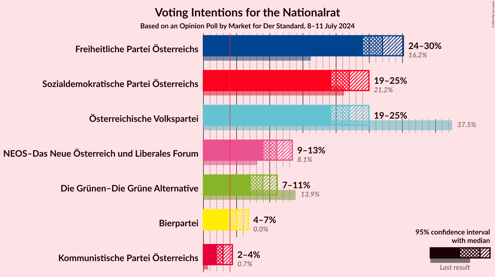

### Confidence Intervals

| Party | Last Result | Poll Result | 80% Confidence Interval | 90% Confidence Interval | 95% Confidence Interval | 99% Confidence Interval |
|:-----:|:-----------:|:-----------:|:-----------------------:|:-----------------------:|:-----------------------:|:-----------------------:|
| Freiheitliche Partei Österreichs | 16.2% | 27.0% | 25.1–29.1% |24.5–29.6% |24.1–30.1% |23.2–31.2% |
| Österreichische Volkspartei | 37.5% | 22.0% | 20.2–23.9% |19.7–24.5% |19.3–25.0% |18.4–25.9% |
| Sozialdemokratische Partei Österreichs | 21.2% | 22.0% | 20.2–23.9% |19.7–24.5% |19.3–25.0% |18.4–25.9% |
| NEOS–Das Neue Österreich und Liberales Forum | 8.1% | 11.0% | 9.7–12.6% |9.4–13.0% |9.1–13.4% |8.5–14.2% |
| Die Grünen–Die Grüne Alternative | 13.9% | 9.0% | 7.8–10.4% |7.5–10.8% |7.2–11.1% |6.7–11.8% |
| Bierpartei | 0.0% | 5.0% | 4.2–6.2% |3.9–6.5% |3.7–6.8% |3.4–7.3% |
| Kommunistische Partei Österreichs | 0.7% | 2.9% | 2.3–3.9% |2.1–4.1% |2.0–4.4% |1.7–4.8% |

*Note:* The poll result column reflects the actual value used in the calculations. Published results may vary slightly, and in addition be rounded to fewer digits.

## Seats

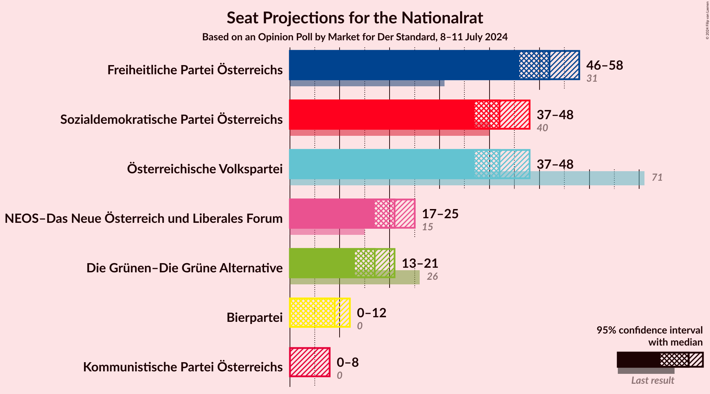

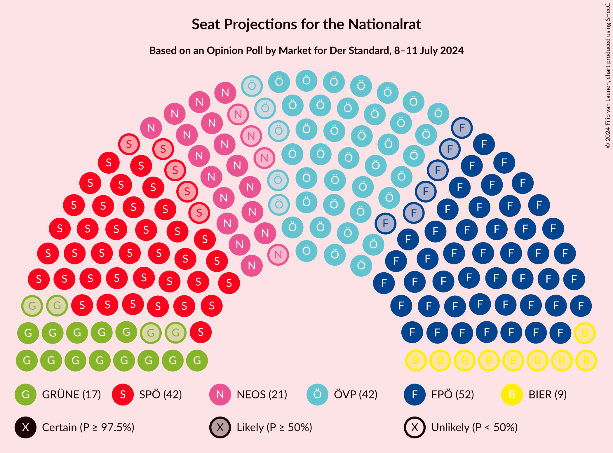

### Confidence Intervals

| Party | Last Result | Median | 80% Confidence Interval | 90% Confidence Interval | 95% Confidence Interval | 99% Confidence Interval |
|:-----:|:-----------:|:------:|:-----------------------:|:-----------------------:|:-----------------------:|:-----------------------:|
| <a href="#freiheitliche-partei-österreichs">Freiheitliche Partei Österreichs</a> | 31 | 52 | 48–56 |47–57 |46–58 |44–60 |
| <a href="#österreichische-volkspartei">Österreichische Volkspartei</a> | 71 | 42 | 38–46 |37–47 |37–48 |35–50 |
| <a href="#sozialdemokratische-partei-österreichs">Sozialdemokratische Partei Österreichs</a> | 40 | 42 | 38–46 |37–47 |37–48 |35–50 |
| <a href="#neos–das-neue-österreich-und-liberales-forum">NEOS–Das Neue Österreich und Liberales Forum</a> | 15 | 21 | 18–24 |18–25 |17–25 |16–27 |
| <a href="#die-grünen–die-grüne-alternative">Die Grünen–Die Grüne Alternative</a> | 26 | 17 | 15–20 |14–20 |13–21 |12–22 |
| <a href="#bierpartei">Bierpartei</a> | 0 | 9 | 8–11 |0–12 |0–12 |0–14 |
| <a href="#kommunistische-partei-österreichs">Kommunistische Partei Österreichs</a> | 0 | 0 | 0 |0–7 |0–8 |0–9 |

### Freiheitliche Partei Österreichs

*For a full overview of the results for this party, see the [Freiheitliche Partei Österreichs](party-freiheitlicheparteiösterreichs.html) page.*

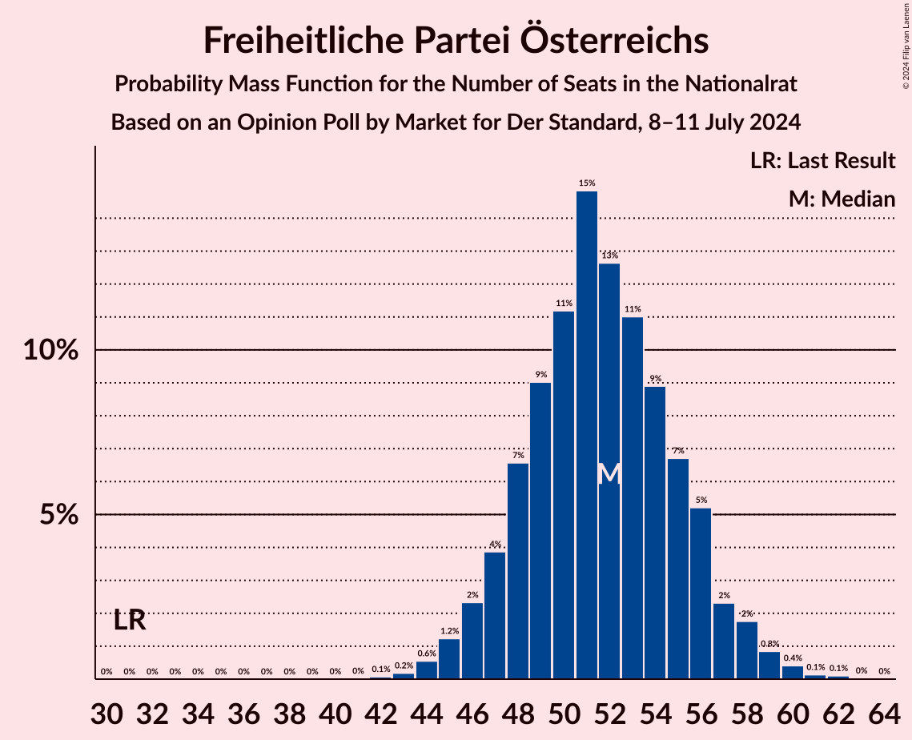

| Number of Seats | Probability | Accumulated | Special Marks |
|:---------------:|:-----------:|:-----------:|:-------------:|
| 31 | 0% | 100% | Last Result |
| 32 | 0% | 100% |  |
| 33 | 0% | 100% |  |
| 34 | 0% | 100% |  |
| 35 | 0% | 100% |  |
| 36 | 0% | 100% |  |
| 37 | 0% | 100% |  |
| 38 | 0% | 100% |  |
| 39 | 0% | 100% |  |
| 40 | 0% | 100% |  |
| 41 | 0% | 100% |  |
| 42 | 0.1% | 100% |  |
| 43 | 0.2% | 99.9% |  |
| 44 | 0.6% | 99.7% |  |
| 45 | 1.2% | 99.2% |  |
| 46 | 2% | 98% |  |
| 47 | 4% | 96% |  |
| 48 | 7% | 92% |  |
| 49 | 9% | 85% |  |
| 50 | 11% | 76% |  |
| 51 | 15% | 65% |  |
| 52 | 13% | 50% | Median |
| 53 | 11% | 37% |  |
| 54 | 9% | 26% |  |
| 55 | 7% | 18% |  |
| 56 | 5% | 11% |  |
| 57 | 2% | 6% |  |
| 58 | 2% | 3% |  |
| 59 | 0.8% | 2% |  |
| 60 | 0.4% | 0.7% |  |
| 61 | 0.1% | 0.3% |  |
| 62 | 0.1% | 0.2% |  |
| 63 | 0% | 0% |  |

### Österreichische Volkspartei

*For a full overview of the results for this party, see the [Österreichische Volkspartei](party-österreichischevolkspartei.html) page.*

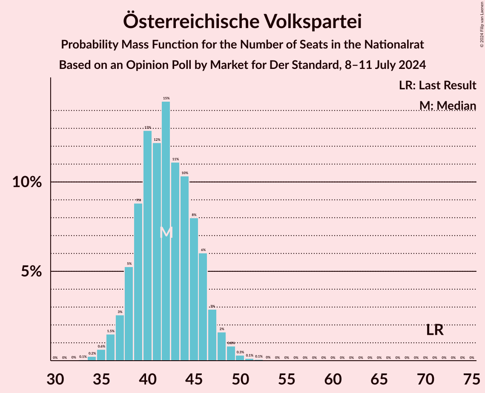

| Number of Seats | Probability | Accumulated | Special Marks |
|:---------------:|:-----------:|:-----------:|:-------------:|
| 33 | 0.1% | 100% |  |
| 34 | 0.2% | 99.9% |  |
| 35 | 0.6% | 99.7% |  |
| 36 | 1.5% | 99.0% |  |
| 37 | 3% | 98% |  |
| 38 | 5% | 95% |  |
| 39 | 9% | 90% |  |
| 40 | 13% | 81% |  |
| 41 | 12% | 68% |  |
| 42 | 15% | 56% | Median |
| 43 | 11% | 41% |  |
| 44 | 10% | 30% |  |
| 45 | 8% | 20% |  |
| 46 | 6% | 12% |  |
| 47 | 3% | 6% |  |
| 48 | 2% | 3% |  |
| 49 | 0.8% | 1.4% |  |
| 50 | 0.3% | 0.5% |  |
| 51 | 0.1% | 0.2% |  |
| 52 | 0.1% | 0.1% |  |
| 53 | 0% | 0% |  |
| 54 | 0% | 0% |  |
| 55 | 0% | 0% |  |
| 56 | 0% | 0% |  |
| 57 | 0% | 0% |  |
| 58 | 0% | 0% |  |
| 59 | 0% | 0% |  |
| 60 | 0% | 0% |  |
| 61 | 0% | 0% |  |
| 62 | 0% | 0% |  |
| 63 | 0% | 0% |  |
| 64 | 0% | 0% |  |
| 65 | 0% | 0% |  |
| 66 | 0% | 0% |  |
| 67 | 0% | 0% |  |
| 68 | 0% | 0% |  |
| 69 | 0% | 0% |  |
| 70 | 0% | 0% |  |
| 71 | 0% | 0% | Last Result |

### Sozialdemokratische Partei Österreichs

*For a full overview of the results for this party, see the [Sozialdemokratische Partei Österreichs](party-sozialdemokratischeparteiösterreichs.html) page.*

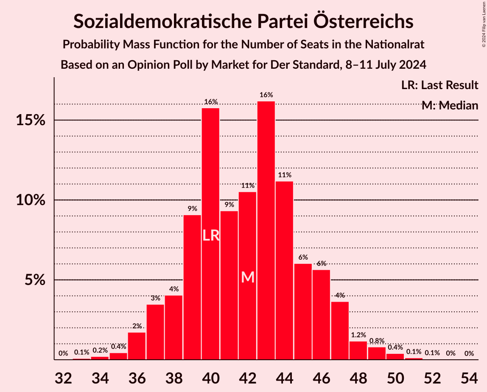

| Number of Seats | Probability | Accumulated | Special Marks |
|:---------------:|:-----------:|:-----------:|:-------------:|
| 33 | 0.1% | 100% |  |
| 34 | 0.2% | 99.9% |  |
| 35 | 0.4% | 99.7% |  |
| 36 | 2% | 99.2% |  |
| 37 | 3% | 98% |  |
| 38 | 4% | 94% |  |
| 39 | 9% | 90% |  |
| 40 | 16% | 81% | Last Result |
| 41 | 9% | 65% |  |
| 42 | 11% | 56% | Median |
| 43 | 16% | 45% |  |
| 44 | 11% | 29% |  |
| 45 | 6% | 18% |  |
| 46 | 6% | 12% |  |
| 47 | 4% | 6% |  |
| 48 | 1.2% | 3% |  |
| 49 | 0.8% | 1.4% |  |
| 50 | 0.4% | 0.6% |  |
| 51 | 0.1% | 0.2% |  |
| 52 | 0.1% | 0.1% |  |
| 53 | 0% | 0% |  |

### NEOS–Das Neue Österreich und Liberales Forum

*For a full overview of the results for this party, see the [NEOS–Das Neue Österreich und Liberales Forum](party-neos–dasneueösterreichundliberalesforum.html) page.*

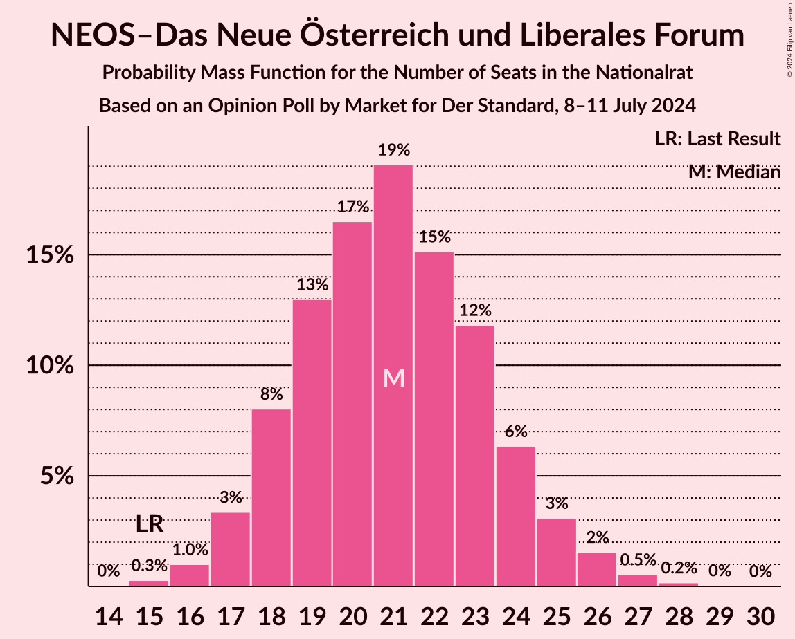

| Number of Seats | Probability | Accumulated | Special Marks |
|:---------------:|:-----------:|:-----------:|:-------------:|
| 15 | 0.3% | 100% | Last Result |
| 16 | 1.0% | 99.7% |  |
| 17 | 3% | 98.7% |  |
| 18 | 8% | 95% |  |
| 19 | 13% | 87% |  |
| 20 | 17% | 74% |  |
| 21 | 19% | 58% | Median |
| 22 | 15% | 39% |  |
| 23 | 12% | 24% |  |
| 24 | 6% | 12% |  |
| 25 | 3% | 5% |  |
| 26 | 2% | 2% |  |
| 27 | 0.5% | 0.8% |  |
| 28 | 0.2% | 0.2% |  |
| 29 | 0% | 0.1% |  |
| 30 | 0% | 0% |  |

### Die Grünen–Die Grüne Alternative

*For a full overview of the results for this party, see the [Die Grünen–Die Grüne Alternative](party-diegrünen–diegrünealternative.html) page.*

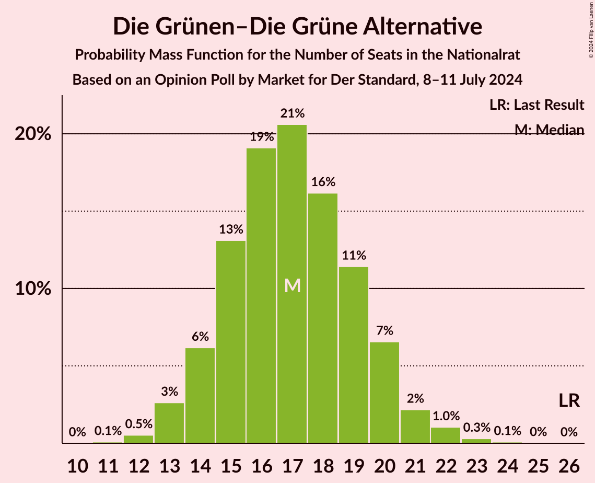

| Number of Seats | Probability | Accumulated | Special Marks |
|:---------------:|:-----------:|:-----------:|:-------------:|
| 11 | 0.1% | 100% |  |
| 12 | 0.5% | 99.9% |  |
| 13 | 3% | 99.4% |  |
| 14 | 6% | 97% |  |
| 15 | 13% | 91% |  |
| 16 | 19% | 77% |  |
| 17 | 21% | 58% | Median |
| 18 | 16% | 38% |  |
| 19 | 11% | 22% |  |
| 20 | 7% | 10% |  |
| 21 | 2% | 4% |  |
| 22 | 1.0% | 1.5% |  |
| 23 | 0.3% | 0.4% |  |
| 24 | 0.1% | 0.1% |  |
| 25 | 0% | 0% |  |
| 26 | 0% | 0% | Last Result |

### Bierpartei

*For a full overview of the results for this party, see the [Bierpartei](party-bierpartei.html) page.*

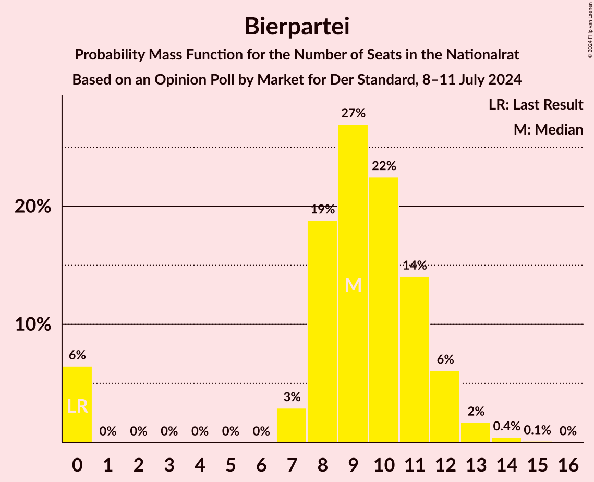

| Number of Seats | Probability | Accumulated | Special Marks |
|:---------------:|:-----------:|:-----------:|:-------------:|
| 0 | 6% | 100% | Last Result |
| 1 | 0% | 94% |  |
| 2 | 0% | 94% |  |
| 3 | 0% | 94% |  |
| 4 | 0% | 94% |  |
| 5 | 0% | 94% |  |
| 6 | 0% | 94% |  |
| 7 | 3% | 94% |  |
| 8 | 19% | 91% |  |
| 9 | 27% | 72% | Median |
| 10 | 22% | 45% |  |
| 11 | 14% | 22% |  |
| 12 | 6% | 8% |  |
| 13 | 2% | 2% |  |
| 14 | 0.4% | 0.6% |  |
| 15 | 0.1% | 0.1% |  |
| 16 | 0% | 0% |  |

### Kommunistische Partei Österreichs

*For a full overview of the results for this party, see the [Kommunistische Partei Österreichs](party-kommunistischeparteiösterreichs.html) page.*

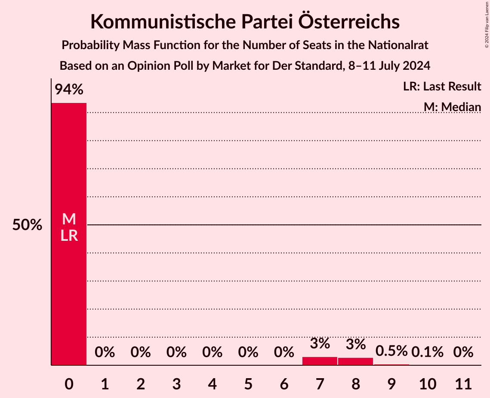

| Number of Seats | Probability | Accumulated | Special Marks |
|:---------------:|:-----------:|:-----------:|:-------------:|
| 0 | 94% | 100% | Last Result, Median |
| 1 | 0% | 6% |  |
| 2 | 0% | 6% |  |
| 3 | 0% | 6% |  |
| 4 | 0% | 6% |  |
| 5 | 0% | 6% |  |
| 6 | 0% | 6% |  |
| 7 | 3% | 6% |  |
| 8 | 3% | 3% |  |
| 9 | 0.5% | 0.5% |  |
| 10 | 0.1% | 0.1% |  |
| 11 | 0% | 0% |  |

## Coalitions

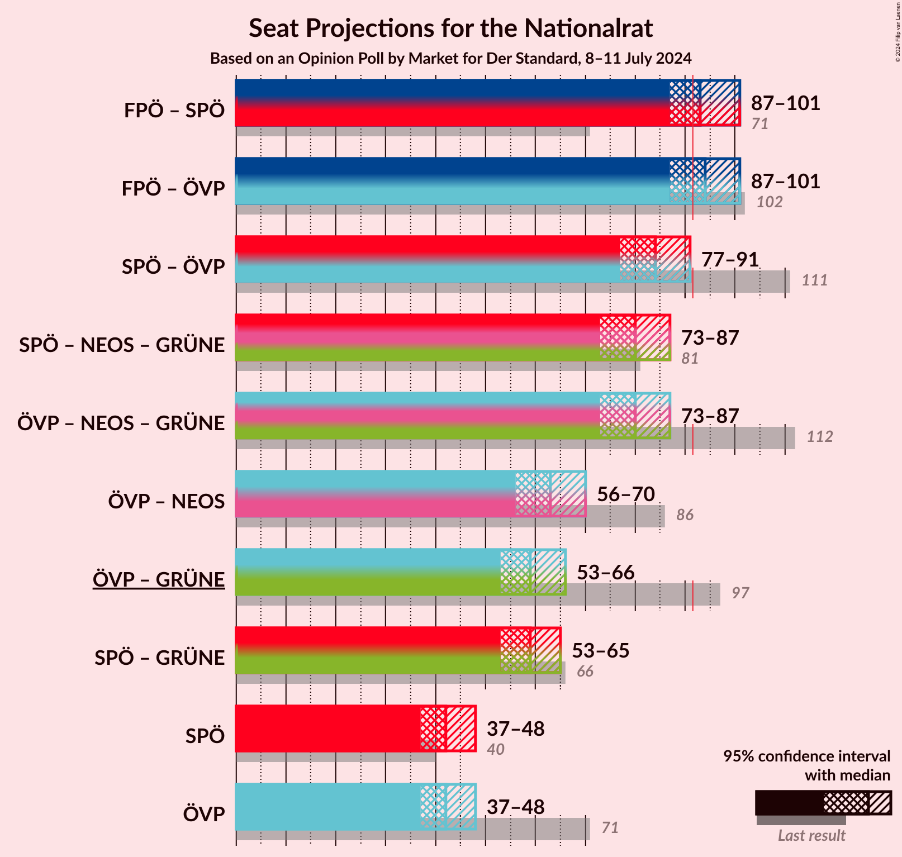

### Confidence Intervals

| Coalition | Last Result | Median | Majority? | 80% Confidence Interval | 90% Confidence Interval | 95% Confidence Interval | 99% Confidence Interval |
|:---------:|:-----------:|:------:|:---------:|:-----------------------:|:-----------------------:|:-----------------------:|:-----------------------:|
| Freiheitliche Partei Österreichs – Sozialdemokratische Partei Österreichs | 71 | 93 | 72% | 89–98 | 88–100 | 87–101 | 85–103 |
| Freiheitliche Partei Österreichs – Österreichische Volkspartei | 102 | 94 | 73% | 89–98 | 88–100 | 87–101 | 84–104 |
| Sozialdemokratische Partei Österreichs – Österreichische Volkspartei | 111 | 84 | 2% | 80–89 | 78–90 | 77–91 | 75–94 |
| Sozialdemokratische Partei Österreichs – NEOS–Das Neue Österreich und Liberales Forum – Die Grünen–Die Grüne Alternative | 81 | 80 | 0.1% | 75–85 | 74–86 | 73–87 | 71–89 |
| Österreichische Volkspartei – NEOS–Das Neue Österreich und Liberales Forum – Die Grünen–Die Grüne Alternative | 112 | 80 | 0.1% | 76–84 | 74–86 | 73–87 | 71–89 |
| Österreichische Volkspartei – NEOS–Das Neue Österreich und Liberales Forum | 86 | 63 | 0% | 59–67 | 58–69 | 56–70 | 54–72 |
| Österreichische Volkspartei – Die Grünen–Die Grüne Alternative | 97 | 59 | 0% | 55–63 | 54–65 | 53–66 | 51–67 |
| Sozialdemokratische Partei Österreichs – Die Grünen–Die Grüne Alternative | 66 | 59 | 0% | 55–63 | 54–64 | 53–65 | 51–68 |
| Sozialdemokratische Partei Österreichs | 40 | 42 | 0% | 38–46 | 37–47 | 37–48 | 35–50 |
| Österreichische Volkspartei | 71 | 42 | 0% | 38–46 | 37–47 | 37–48 | 35–50 |

### Freiheitliche Partei Österreichs – Sozialdemokratische Partei Österreichs

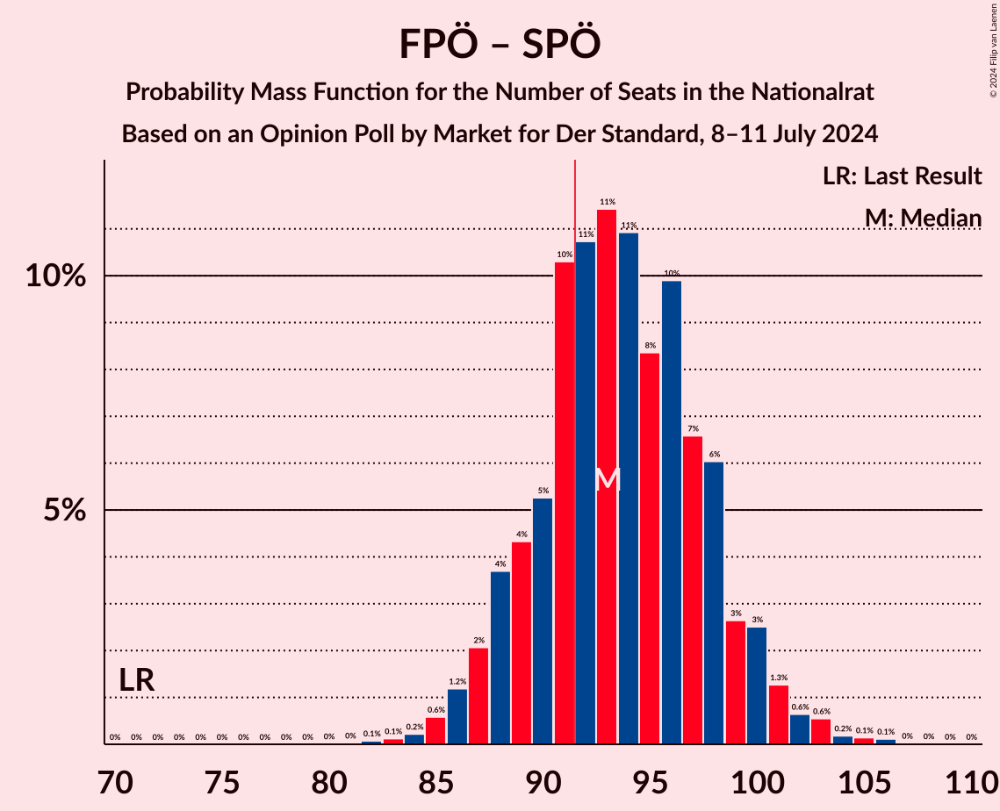

| Number of Seats | Probability | Accumulated | Special Marks |
|:---------------:|:-----------:|:-----------:|:-------------:|
| 71 | 0% | 100% | Last Result |
| 72 | 0% | 100% |  |
| 73 | 0% | 100% |  |
| 74 | 0% | 100% |  |
| 75 | 0% | 100% |  |
| 76 | 0% | 100% |  |
| 77 | 0% | 100% |  |
| 78 | 0% | 100% |  |
| 79 | 0% | 100% |  |
| 80 | 0% | 100% |  |
| 81 | 0% | 100% |  |
| 82 | 0.1% | 100% |  |
| 83 | 0.1% | 99.9% |  |
| 84 | 0.2% | 99.8% |  |
| 85 | 0.6% | 99.5% |  |
| 86 | 1.2% | 98.9% |  |
| 87 | 2% | 98% |  |
| 88 | 4% | 96% |  |
| 89 | 4% | 92% |  |
| 90 | 5% | 88% |  |
| 91 | 10% | 82% |  |
| 92 | 11% | 72% | Majority |
| 93 | 11% | 61% |  |
| 94 | 11% | 50% | Median |
| 95 | 8% | 39% |  |
| 96 | 10% | 31% |  |
| 97 | 7% | 21% |  |
| 98 | 6% | 14% |  |
| 99 | 3% | 8% |  |
| 100 | 3% | 5% |  |
| 101 | 1.3% | 3% |  |
| 102 | 0.6% | 2% |  |
| 103 | 0.6% | 1.0% |  |
| 104 | 0.2% | 0.5% |  |
| 105 | 0.1% | 0.3% |  |
| 106 | 0.1% | 0.2% |  |
| 107 | 0% | 0.1% |  |
| 108 | 0% | 0% |  |

### Freiheitliche Partei Österreichs – Österreichische Volkspartei

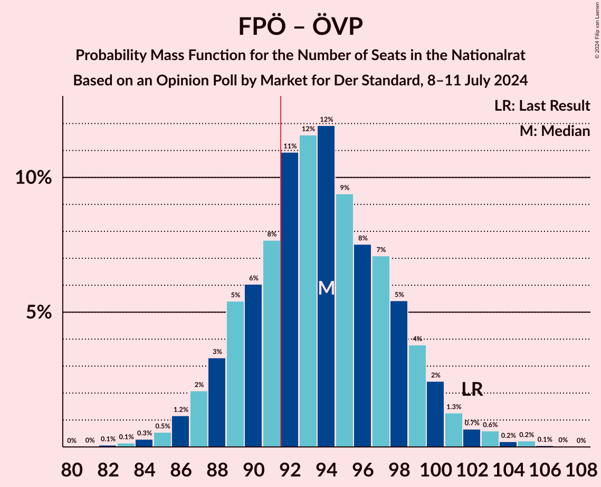

| Number of Seats | Probability | Accumulated | Special Marks |
|:---------------:|:-----------:|:-----------:|:-------------:|
| 82 | 0.1% | 100% |  |
| 83 | 0.1% | 99.9% |  |
| 84 | 0.3% | 99.7% |  |
| 85 | 0.5% | 99.4% |  |
| 86 | 1.2% | 98.9% |  |
| 87 | 2% | 98% |  |
| 88 | 3% | 96% |  |
| 89 | 5% | 92% |  |
| 90 | 6% | 87% |  |
| 91 | 8% | 81% |  |
| 92 | 11% | 73% | Majority |
| 93 | 12% | 62% |  |
| 94 | 12% | 51% | Median |
| 95 | 9% | 39% |  |
| 96 | 8% | 29% |  |
| 97 | 7% | 22% |  |
| 98 | 5% | 15% |  |
| 99 | 4% | 9% |  |
| 100 | 2% | 6% |  |
| 101 | 1.3% | 3% |  |
| 102 | 0.7% | 2% | Last Result |
| 103 | 0.6% | 1.1% |  |
| 104 | 0.2% | 0.6% |  |
| 105 | 0.2% | 0.3% |  |
| 106 | 0.1% | 0.1% |  |
| 107 | 0% | 0.1% |  |
| 108 | 0% | 0% |  |

### Sozialdemokratische Partei Österreichs – Österreichische Volkspartei

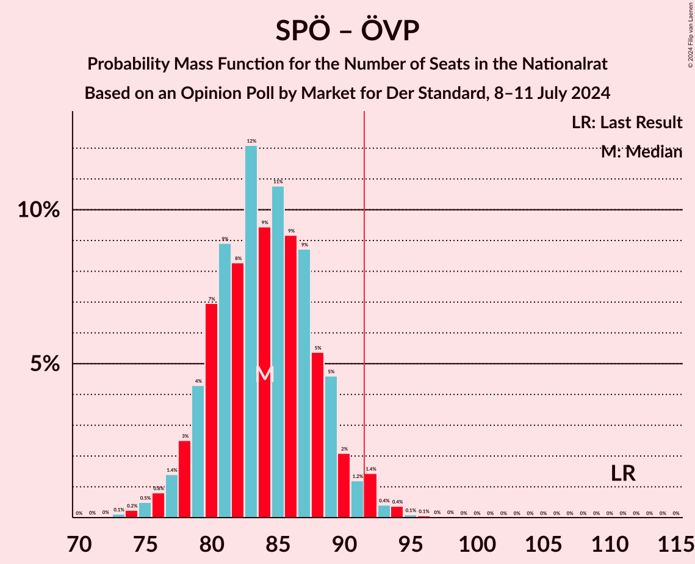

| Number of Seats | Probability | Accumulated | Special Marks |
|:---------------:|:-----------:|:-----------:|:-------------:|
| 72 | 0% | 100% |  |
| 73 | 0.1% | 99.9% |  |
| 74 | 0.2% | 99.8% |  |
| 75 | 0.5% | 99.6% |  |
| 76 | 0.8% | 99.1% |  |
| 77 | 1.4% | 98% |  |
| 78 | 3% | 97% |  |
| 79 | 4% | 94% |  |
| 80 | 7% | 90% |  |
| 81 | 9% | 83% |  |
| 82 | 8% | 74% |  |
| 83 | 12% | 66% |  |
| 84 | 9% | 54% | Median |
| 85 | 11% | 44% |  |
| 86 | 9% | 34% |  |
| 87 | 9% | 24% |  |
| 88 | 5% | 16% |  |
| 89 | 5% | 10% |  |
| 90 | 2% | 6% |  |
| 91 | 1.2% | 4% |  |
| 92 | 1.4% | 2% | Majority |
| 93 | 0.4% | 1.0% |  |
| 94 | 0.4% | 0.6% |  |
| 95 | 0.1% | 0.2% |  |
| 96 | 0.1% | 0.1% |  |
| 97 | 0% | 0.1% |  |
| 98 | 0% | 0% |  |
| 99 | 0% | 0% |  |
| 100 | 0% | 0% |  |
| 101 | 0% | 0% |  |
| 102 | 0% | 0% |  |
| 103 | 0% | 0% |  |
| 104 | 0% | 0% |  |
| 105 | 0% | 0% |  |
| 106 | 0% | 0% |  |
| 107 | 0% | 0% |  |
| 108 | 0% | 0% |  |
| 109 | 0% | 0% |  |
| 110 | 0% | 0% |  |
| 111 | 0% | 0% | Last Result |

### Sozialdemokratische Partei Österreichs – NEOS–Das Neue Österreich und Liberales Forum – Die Grünen–Die Grüne Alternative

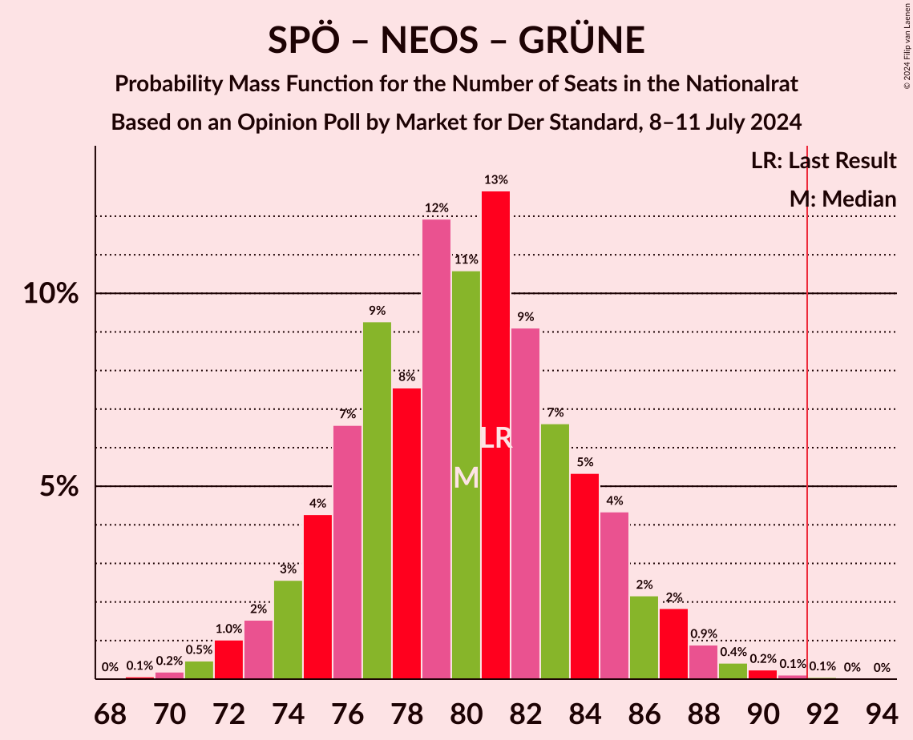

| Number of Seats | Probability | Accumulated | Special Marks |
|:---------------:|:-----------:|:-----------:|:-------------:|
| 69 | 0.1% | 100% |  |
| 70 | 0.2% | 99.9% |  |
| 71 | 0.5% | 99.7% |  |
| 72 | 1.0% | 99.2% |  |
| 73 | 2% | 98% |  |
| 74 | 3% | 97% |  |
| 75 | 4% | 94% |  |
| 76 | 7% | 90% |  |
| 77 | 9% | 83% |  |
| 78 | 8% | 74% |  |
| 79 | 12% | 66% |  |
| 80 | 11% | 54% | Median |
| 81 | 13% | 44% | Last Result |
| 82 | 9% | 31% |  |
| 83 | 7% | 22% |  |
| 84 | 5% | 15% |  |
| 85 | 4% | 10% |  |
| 86 | 2% | 6% |  |
| 87 | 2% | 4% |  |
| 88 | 0.9% | 2% |  |
| 89 | 0.4% | 0.9% |  |
| 90 | 0.2% | 0.5% |  |
| 91 | 0.1% | 0.2% |  |
| 92 | 0.1% | 0.1% | Majority |
| 93 | 0% | 0% |  |

### Österreichische Volkspartei – NEOS–Das Neue Österreich und Liberales Forum – Die Grünen–Die Grüne Alternative

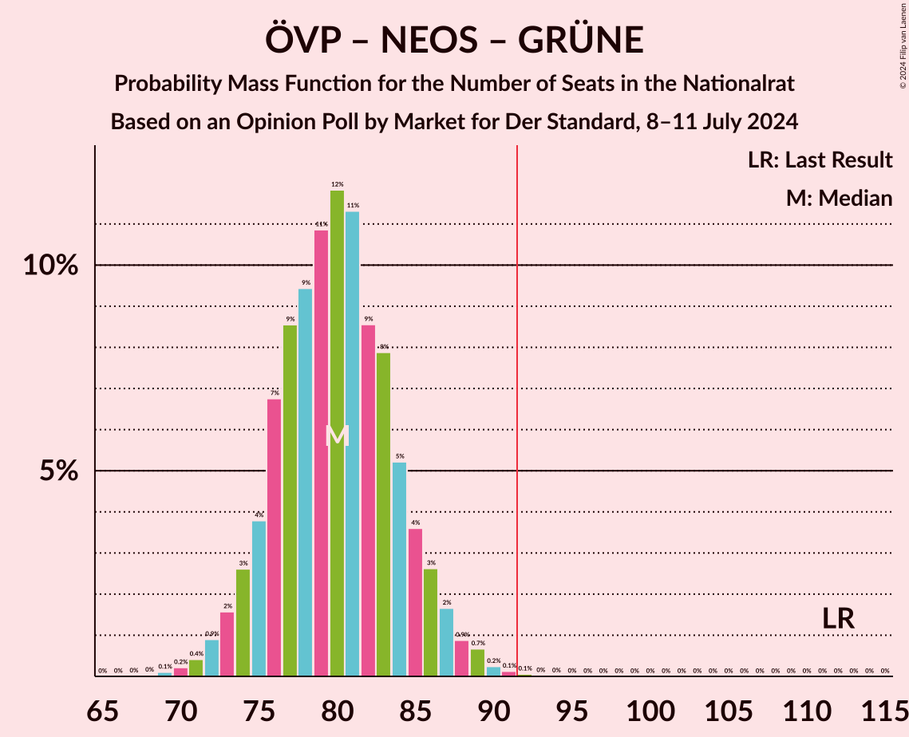

| Number of Seats | Probability | Accumulated | Special Marks |
|:---------------:|:-----------:|:-----------:|:-------------:|
| 69 | 0.1% | 100% |  |
| 70 | 0.2% | 99.8% |  |
| 71 | 0.4% | 99.6% |  |
| 72 | 0.9% | 99.2% |  |
| 73 | 2% | 98% |  |
| 74 | 3% | 97% |  |
| 75 | 4% | 94% |  |
| 76 | 7% | 90% |  |
| 77 | 9% | 84% |  |
| 78 | 9% | 75% |  |
| 79 | 11% | 66% |  |
| 80 | 12% | 55% | Median |
| 81 | 11% | 43% |  |
| 82 | 9% | 32% |  |
| 83 | 8% | 23% |  |
| 84 | 5% | 15% |  |
| 85 | 4% | 10% |  |
| 86 | 3% | 6% |  |
| 87 | 2% | 4% |  |
| 88 | 0.9% | 2% |  |
| 89 | 0.7% | 1.1% |  |
| 90 | 0.2% | 0.5% |  |
| 91 | 0.1% | 0.2% |  |
| 92 | 0.1% | 0.1% | Majority |
| 93 | 0% | 0% |  |
| 94 | 0% | 0% |  |
| 95 | 0% | 0% |  |
| 96 | 0% | 0% |  |
| 97 | 0% | 0% |  |
| 98 | 0% | 0% |  |
| 99 | 0% | 0% |  |
| 100 | 0% | 0% |  |
| 101 | 0% | 0% |  |
| 102 | 0% | 0% |  |
| 103 | 0% | 0% |  |
| 104 | 0% | 0% |  |
| 105 | 0% | 0% |  |
| 106 | 0% | 0% |  |
| 107 | 0% | 0% |  |
| 108 | 0% | 0% |  |
| 109 | 0% | 0% |  |
| 110 | 0% | 0% |  |
| 111 | 0% | 0% |  |
| 112 | 0% | 0% | Last Result |

### Österreichische Volkspartei – NEOS–Das Neue Österreich und Liberales Forum

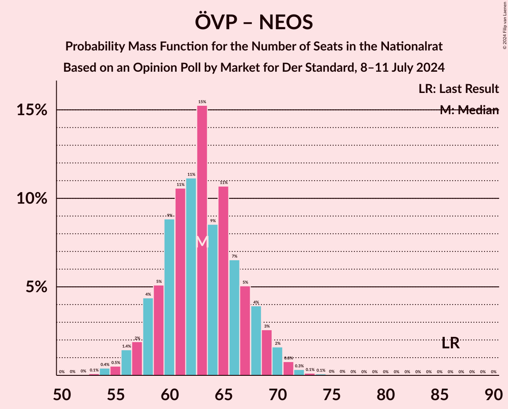

| Number of Seats | Probability | Accumulated | Special Marks |
|:---------------:|:-----------:|:-----------:|:-------------:|
| 52 | 0% | 100% |  |
| 53 | 0.1% | 99.9% |  |
| 54 | 0.4% | 99.8% |  |
| 55 | 0.5% | 99.4% |  |
| 56 | 1.4% | 98.9% |  |
| 57 | 2% | 97% |  |
| 58 | 4% | 96% |  |
| 59 | 5% | 91% |  |
| 60 | 9% | 86% |  |
| 61 | 11% | 77% |  |
| 62 | 11% | 67% |  |
| 63 | 15% | 56% | Median |
| 64 | 9% | 40% |  |
| 65 | 11% | 32% |  |
| 66 | 7% | 21% |  |
| 67 | 5% | 15% |  |
| 68 | 4% | 9% |  |
| 69 | 3% | 6% |  |
| 70 | 2% | 3% |  |
| 71 | 0.8% | 1.4% |  |
| 72 | 0.3% | 0.6% |  |
| 73 | 0.1% | 0.3% |  |
| 74 | 0.1% | 0.1% |  |
| 75 | 0% | 0% |  |
| 76 | 0% | 0% |  |
| 77 | 0% | 0% |  |
| 78 | 0% | 0% |  |
| 79 | 0% | 0% |  |
| 80 | 0% | 0% |  |
| 81 | 0% | 0% |  |
| 82 | 0% | 0% |  |
| 83 | 0% | 0% |  |
| 84 | 0% | 0% |  |
| 85 | 0% | 0% |  |
| 86 | 0% | 0% | Last Result |

### Österreichische Volkspartei – Die Grünen–Die Grüne Alternative

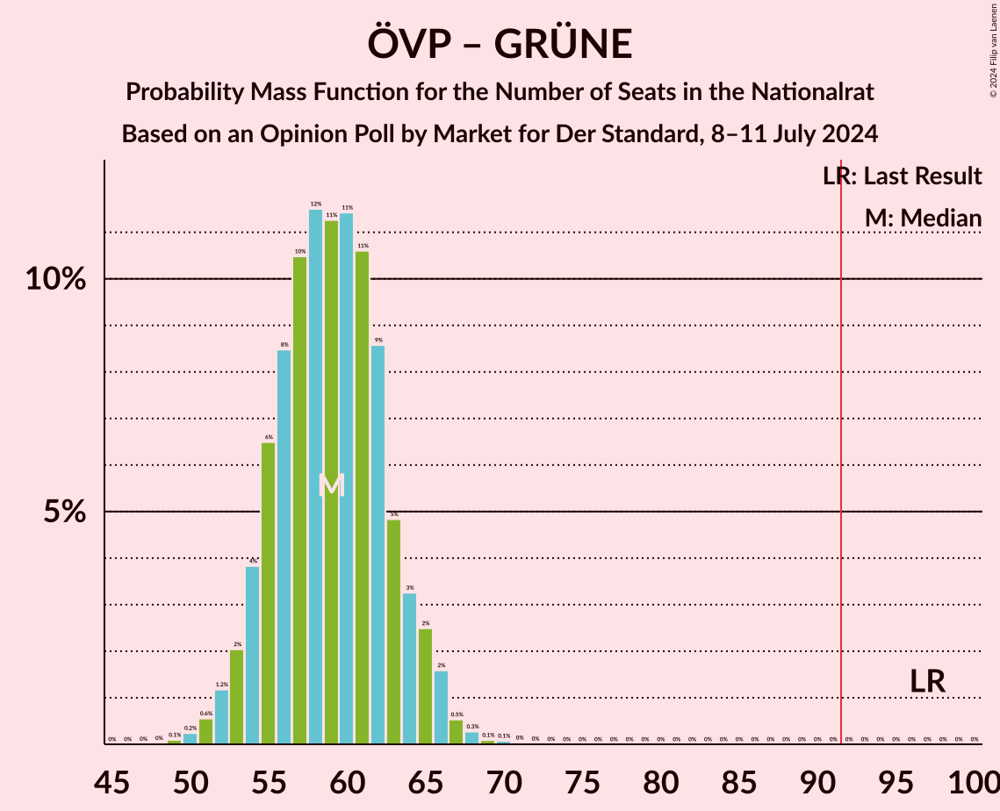

| Number of Seats | Probability | Accumulated | Special Marks |
|:---------------:|:-----------:|:-----------:|:-------------:|
| 49 | 0.1% | 100% |  |
| 50 | 0.2% | 99.9% |  |
| 51 | 0.6% | 99.6% |  |
| 52 | 1.2% | 99.1% |  |
| 53 | 2% | 98% |  |
| 54 | 4% | 96% |  |
| 55 | 6% | 92% |  |
| 56 | 8% | 86% |  |
| 57 | 10% | 77% |  |
| 58 | 12% | 67% |  |
| 59 | 11% | 55% | Median |
| 60 | 11% | 44% |  |
| 61 | 11% | 32% |  |
| 62 | 9% | 22% |  |
| 63 | 5% | 13% |  |
| 64 | 3% | 8% |  |
| 65 | 2% | 5% |  |
| 66 | 2% | 3% |  |
| 67 | 0.5% | 1.0% |  |
| 68 | 0.3% | 0.5% |  |
| 69 | 0.1% | 0.2% |  |
| 70 | 0.1% | 0.1% |  |
| 71 | 0% | 0.1% |  |
| 72 | 0% | 0% |  |
| 73 | 0% | 0% |  |
| 74 | 0% | 0% |  |
| 75 | 0% | 0% |  |
| 76 | 0% | 0% |  |
| 77 | 0% | 0% |  |
| 78 | 0% | 0% |  |
| 79 | 0% | 0% |  |
| 80 | 0% | 0% |  |
| 81 | 0% | 0% |  |
| 82 | 0% | 0% |  |
| 83 | 0% | 0% |  |
| 84 | 0% | 0% |  |
| 85 | 0% | 0% |  |
| 86 | 0% | 0% |  |
| 87 | 0% | 0% |  |
| 88 | 0% | 0% |  |
| 89 | 0% | 0% |  |
| 90 | 0% | 0% |  |
| 91 | 0% | 0% |  |
| 92 | 0% | 0% | Majority |
| 93 | 0% | 0% |  |
| 94 | 0% | 0% |  |
| 95 | 0% | 0% |  |
| 96 | 0% | 0% |  |
| 97 | 0% | 0% | Last Result |

### Sozialdemokratische Partei Österreichs – Die Grünen–Die Grüne Alternative

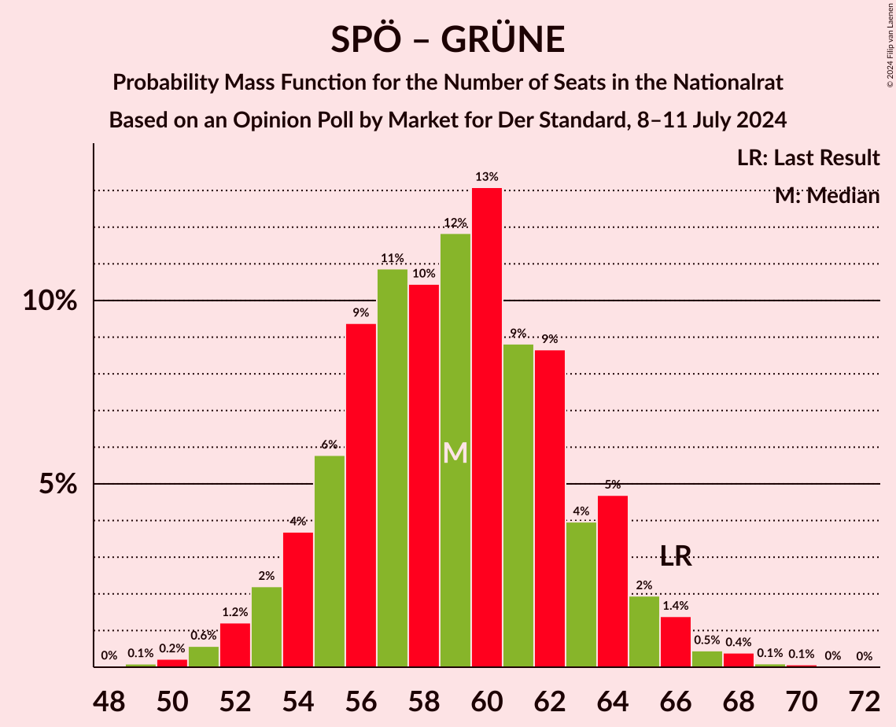

| Number of Seats | Probability | Accumulated | Special Marks |
|:---------------:|:-----------:|:-----------:|:-------------:|
| 49 | 0.1% | 100% |  |
| 50 | 0.2% | 99.9% |  |
| 51 | 0.6% | 99.6% |  |
| 52 | 1.2% | 99.1% |  |
| 53 | 2% | 98% |  |
| 54 | 4% | 96% |  |
| 55 | 6% | 92% |  |
| 56 | 9% | 86% |  |
| 57 | 11% | 77% |  |
| 58 | 10% | 66% |  |
| 59 | 12% | 55% | Median |
| 60 | 13% | 44% |  |
| 61 | 9% | 31% |  |
| 62 | 9% | 22% |  |
| 63 | 4% | 13% |  |
| 64 | 5% | 9% |  |
| 65 | 2% | 4% |  |
| 66 | 1.4% | 2% | Last Result |
| 67 | 0.5% | 1.1% |  |
| 68 | 0.4% | 0.6% |  |
| 69 | 0.1% | 0.2% |  |
| 70 | 0.1% | 0.1% |  |
| 71 | 0% | 0% |  |

### Sozialdemokratische Partei Österreichs

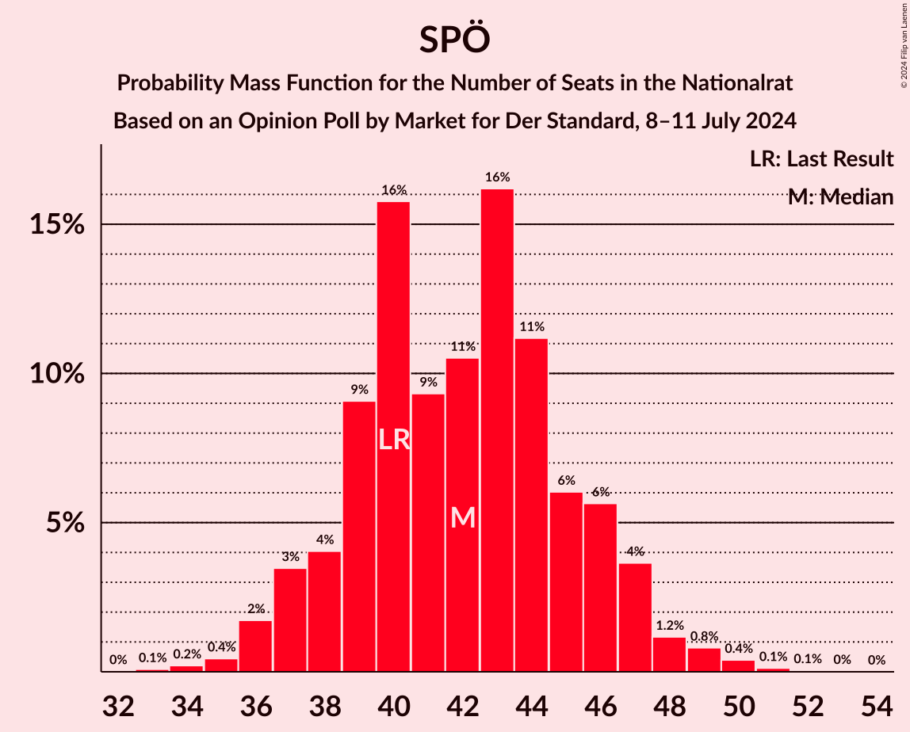

| Number of Seats | Probability | Accumulated | Special Marks |
|:---------------:|:-----------:|:-----------:|:-------------:|
| 33 | 0.1% | 100% |  |
| 34 | 0.2% | 99.9% |  |
| 35 | 0.4% | 99.7% |  |
| 36 | 2% | 99.2% |  |
| 37 | 3% | 98% |  |
| 38 | 4% | 94% |  |
| 39 | 9% | 90% |  |
| 40 | 16% | 81% | Last Result |
| 41 | 9% | 65% |  |
| 42 | 11% | 56% | Median |
| 43 | 16% | 45% |  |
| 44 | 11% | 29% |  |
| 45 | 6% | 18% |  |
| 46 | 6% | 12% |  |
| 47 | 4% | 6% |  |
| 48 | 1.2% | 3% |  |
| 49 | 0.8% | 1.4% |  |
| 50 | 0.4% | 0.6% |  |
| 51 | 0.1% | 0.2% |  |
| 52 | 0.1% | 0.1% |  |
| 53 | 0% | 0% |  |

### Österreichische Volkspartei

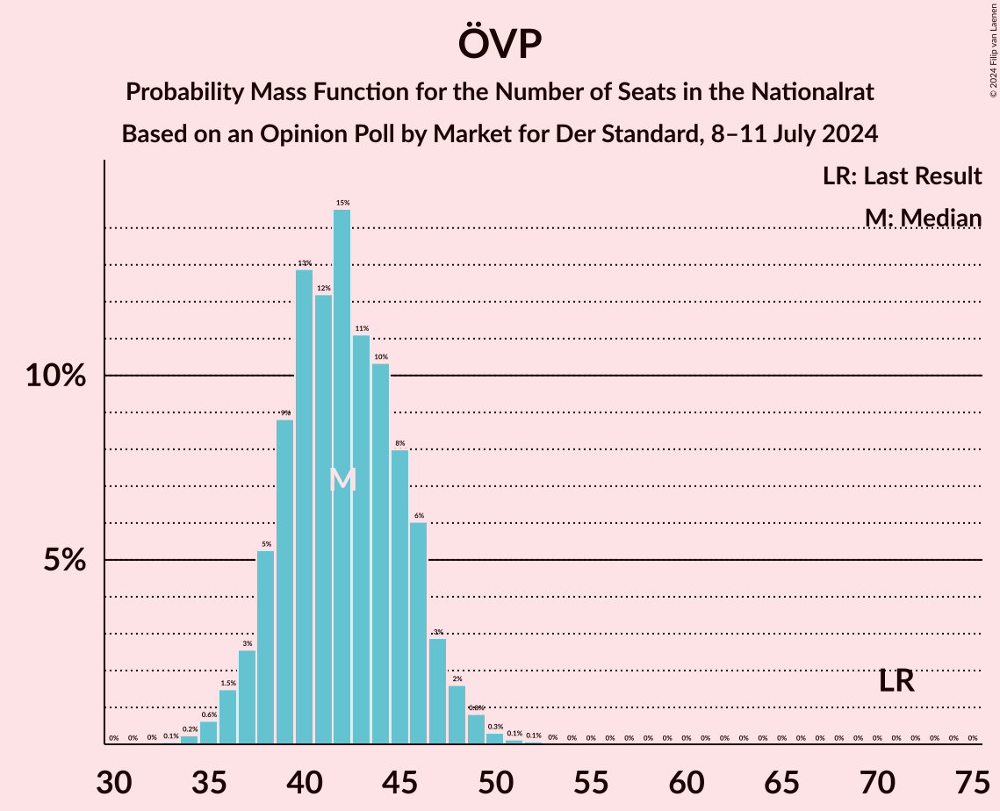

| Number of Seats | Probability | Accumulated | Special Marks |
|:---------------:|:-----------:|:-----------:|:-------------:|
| 33 | 0.1% | 100% |  |
| 34 | 0.2% | 99.9% |  |
| 35 | 0.6% | 99.7% |  |
| 36 | 1.5% | 99.0% |  |
| 37 | 3% | 98% |  |
| 38 | 5% | 95% |  |
| 39 | 9% | 90% |  |
| 40 | 13% | 81% |  |
| 41 | 12% | 68% |  |
| 42 | 15% | 56% | Median |
| 43 | 11% | 41% |  |
| 44 | 10% | 30% |  |
| 45 | 8% | 20% |  |
| 46 | 6% | 12% |  |
| 47 | 3% | 6% |  |
| 48 | 2% | 3% |  |
| 49 | 0.8% | 1.4% |  |
| 50 | 0.3% | 0.5% |  |
| 51 | 0.1% | 0.2% |  |
| 52 | 0.1% | 0.1% |  |
| 53 | 0% | 0% |  |
| 54 | 0% | 0% |  |
| 55 | 0% | 0% |  |
| 56 | 0% | 0% |  |
| 57 | 0% | 0% |  |
| 58 | 0% | 0% |  |
| 59 | 0% | 0% |  |
| 60 | 0% | 0% |  |
| 61 | 0% | 0% |  |
| 62 | 0% | 0% |  |
| 63 | 0% | 0% |  |
| 64 | 0% | 0% |  |
| 65 | 0% | 0% |  |
| 66 | 0% | 0% |  |
| 67 | 0% | 0% |  |
| 68 | 0% | 0% |  |
| 69 | 0% | 0% |  |
| 70 | 0% | 0% |  |
| 71 | 0% | 0% | Last Result |

## Technical Information

### Opinion Poll

+ **Polling firm:** Market
+ **Commissioner(s):** Der Standard
+ **Fieldwork period:** 8–11 July 2024

### Calculations

+ **Sample size:** 815
+ **Simulations done:** 1,048,576
+ **Error estimate:** 1.84%

