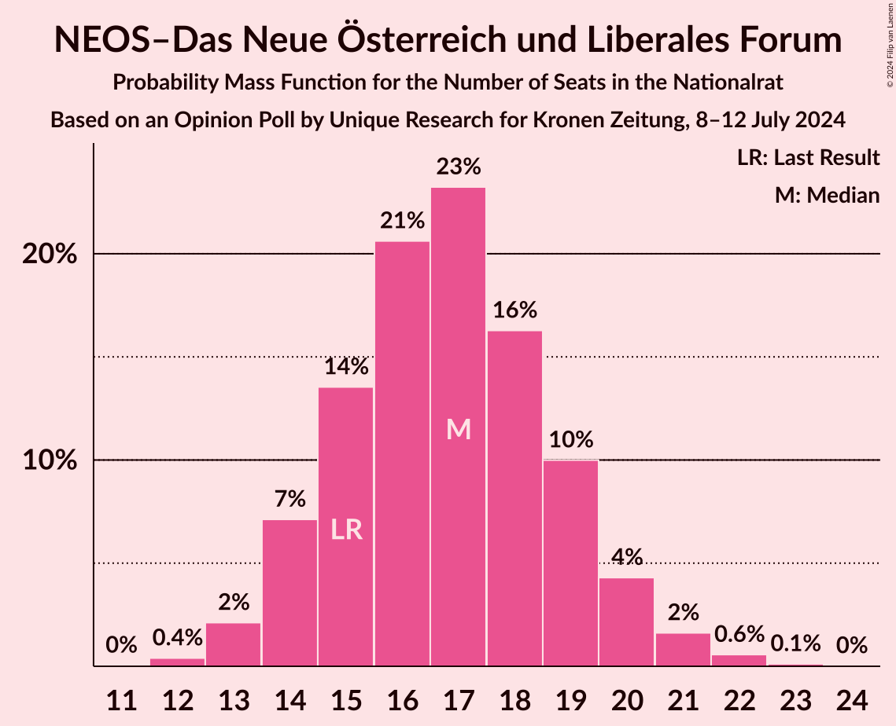
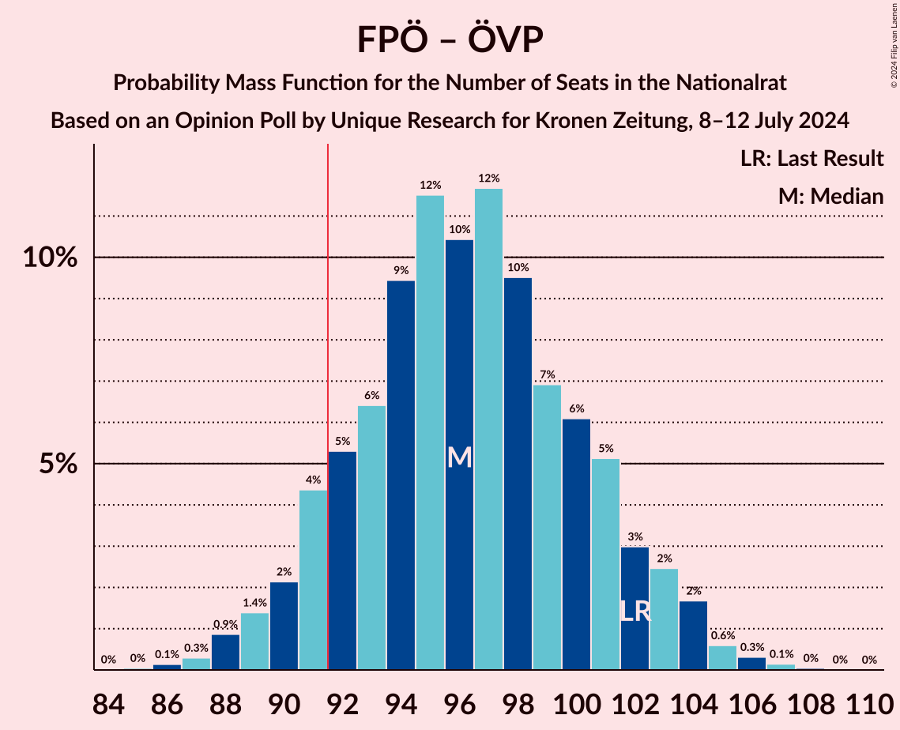
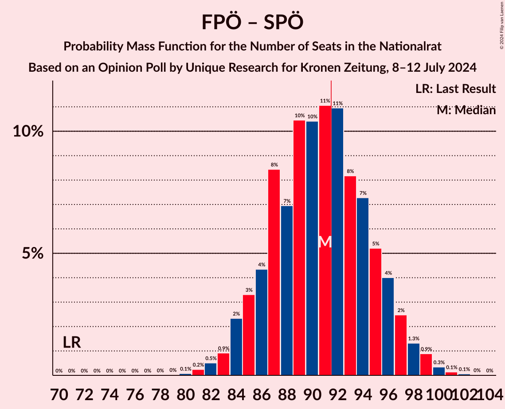
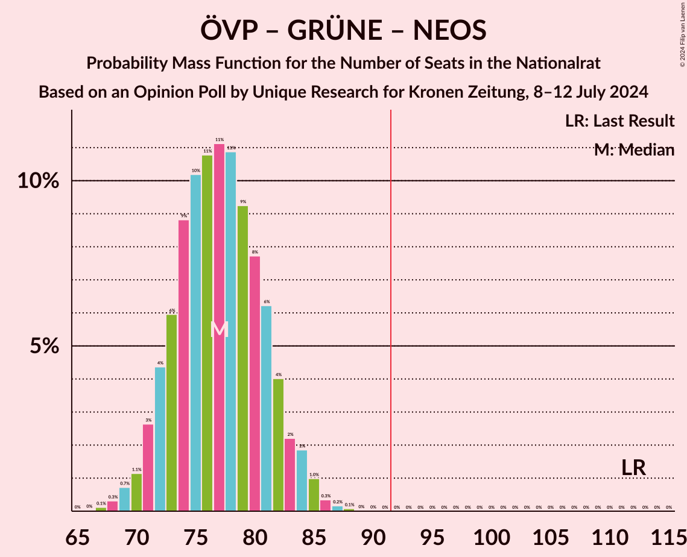
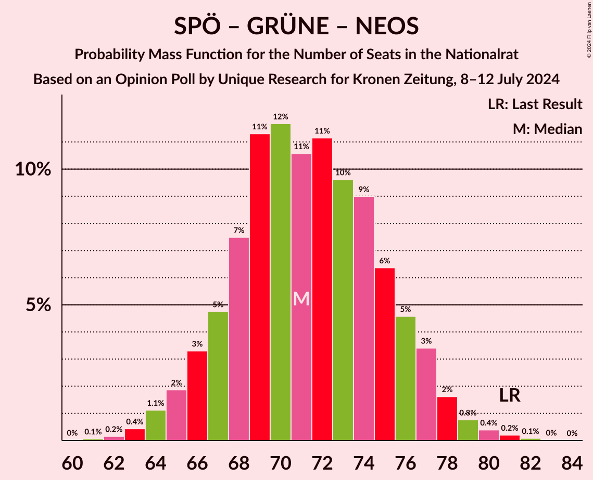

# Opinion Poll by Unique Research for Kronen Zeitung, 8–12 July 2024

<a href="#voting-intentions">Voting Intentions</a> | <a href="#seats">Seats</a> | <a href="#coalitions">Coalitions</a> | <a href="#technical-information">Technical Information</a>

## Voting Intentions

### Confidence Intervals

| Party | Last Result | Poll Result | 80% Confidence Interval | 90% Confidence Interval | 95% Confidence Interval | 99% Confidence Interval |
|:-----:|:-----------:|:-----------:|:-----------------------:|:-----------------------:|:-----------------------:|:-----------------------:|
| Freiheitliche Partei Österreichs | 16.2% | 28.0% | 26.2–29.9% |25.7–30.4% |25.3–30.9% |24.5–31.8% |
| Österreichische Volkspartei | 37.5% | 23.0% | 21.4–24.8% |20.9–25.3% |20.5–25.7% |19.7–26.6% |
| Sozialdemokratische Partei Österreichs | 21.2% | 20.0% | 18.4–21.7% |18.0–22.2% |17.6–22.6% |16.9–23.4% |
| Die Grünen–Die Grüne Alternative | 13.9% | 9.0% | 7.9–10.3% |7.6–10.6% |7.4–10.9% |6.9–11.6% |
| NEOS–Das Neue Österreich und Liberales Forum | 8.1% | 9.0% | 7.9–10.3% |7.6–10.6% |7.4–10.9% |6.9–11.6% |
| Bierpartei | 0.0% | 6.0% | 5.1–7.1% |4.9–7.4% |4.7–7.7% |4.3–8.2% |
| Kommunistische Partei Österreichs | 0.7% | 4.0% | 3.3–4.9% |3.1–5.2% |2.9–5.4% |2.7–5.9% |

*Note:* The poll result column reflects the actual value used in the calculations. Published results may vary slightly, and in addition be rounded to fewer digits.

## Seats

### Confidence Intervals

| Party | Last Result | Median | 80% Confidence Interval | 90% Confidence Interval | 95% Confidence Interval | 99% Confidence Interval |
|:-----:|:-----------:|:------:|:-----------------------:|:-----------------------:|:-----------------------:|:-----------------------:|
| <a href="#freiheitliche-partei-österreichs">Freiheitliche Partei Österreichs</a> | 31 | 53 | 49–57 |48–58 |47–59 |46–60 |
| <a href="#österreichische-volkspartei">Österreichische Volkspartei</a> | 71 | 43 | 40–47 |39–48 |38–49 |37–51 |
| <a href="#sozialdemokratische-partei-österreichs">Sozialdemokratische Partei Österreichs</a> | 40 | 38 | 35–41 |34–42 |33–43 |31–45 |
| <a href="#die-grünen–die-grüne-alternative">Die Grünen–Die Grüne Alternative</a> | 26 | 17 | 15–19 |14–20 |13–21 |13–22 |
| <a href="#neos–das-neue-österreich-und-liberales-forum">NEOS–Das Neue Österreich und Liberales Forum</a> | 15 | 17 | 15–19 |14–20 |13–20 |13–22 |
| <a href="#bierpartei">Bierpartei</a> | 0 | 11 | 9–13 |9–14 |8–14 |8–15 |
| <a href="#kommunistische-partei-österreichs">Kommunistische Partei Österreichs</a> | 0 | 7 | 0–9 |0–9 |0–10 |0–11 |

### Freiheitliche Partei Österreichs

*For a full overview of the results for this party, see the [Freiheitliche Partei Österreichs](party-freiheitlicheparteiösterreichs.html) page.*

| Number of Seats | Probability | Accumulated | Special Marks |
|:---------------:|:-----------:|:-----------:|:-------------:|
| 31 | 0% | 100% | Last Result |
| 32 | 0% | 100% |  |
| 33 | 0% | 100% |  |
| 34 | 0% | 100% |  |
| 35 | 0% | 100% |  |
| 36 | 0% | 100% |  |
| 37 | 0% | 100% |  |
| 38 | 0% | 100% |  |
| 39 | 0% | 100% |  |
| 40 | 0% | 100% |  |
| 41 | 0% | 100% |  |
| 42 | 0% | 100% |  |
| 43 | 0% | 100% |  |
| 44 | 0.1% | 100% |  |
| 45 | 0.3% | 99.9% |  |
| 46 | 0.8% | 99.6% |  |
| 47 | 2% | 98.9% |  |
| 48 | 4% | 97% |  |
| 49 | 5% | 93% |  |
| 50 | 8% | 89% |  |
| 51 | 13% | 81% |  |
| 52 | 14% | 68% |  |
| 53 | 10% | 54% | Median |
| 54 | 14% | 44% |  |
| 55 | 12% | 30% |  |
| 56 | 8% | 18% |  |
| 57 | 5% | 10% |  |
| 58 | 2% | 6% |  |
| 59 | 2% | 3% |  |
| 60 | 0.8% | 1.3% |  |
| 61 | 0.3% | 0.5% |  |
| 62 | 0.1% | 0.2% |  |
| 63 | 0.1% | 0.1% |  |
| 64 | 0% | 0% |  |

### Österreichische Volkspartei

*For a full overview of the results for this party, see the [Österreichische Volkspartei](party-österreichischevolkspartei.html) page.*

| Number of Seats | Probability | Accumulated | Special Marks |
|:---------------:|:-----------:|:-----------:|:-------------:|
| 35 | 0.1% | 100% |  |
| 36 | 0.3% | 99.9% |  |
| 37 | 0.8% | 99.6% |  |
| 38 | 2% | 98.8% |  |
| 39 | 4% | 97% |  |
| 40 | 7% | 93% |  |
| 41 | 11% | 86% |  |
| 42 | 15% | 76% |  |
| 43 | 14% | 61% | Median |
| 44 | 14% | 47% |  |
| 45 | 11% | 33% |  |
| 46 | 9% | 22% |  |
| 47 | 6% | 13% |  |
| 48 | 3% | 7% |  |
| 49 | 2% | 4% |  |
| 50 | 1.3% | 2% |  |
| 51 | 0.3% | 0.5% |  |
| 52 | 0.1% | 0.2% |  |
| 53 | 0% | 0.1% |  |
| 54 | 0% | 0% |  |
| 55 | 0% | 0% |  |
| 56 | 0% | 0% |  |
| 57 | 0% | 0% |  |
| 58 | 0% | 0% |  |
| 59 | 0% | 0% |  |
| 60 | 0% | 0% |  |
| 61 | 0% | 0% |  |
| 62 | 0% | 0% |  |
| 63 | 0% | 0% |  |
| 64 | 0% | 0% |  |
| 65 | 0% | 0% |  |
| 66 | 0% | 0% |  |
| 67 | 0% | 0% |  |
| 68 | 0% | 0% |  |
| 69 | 0% | 0% |  |
| 70 | 0% | 0% |  |
| 71 | 0% | 0% | Last Result |

### Sozialdemokratische Partei Österreichs

*For a full overview of the results for this party, see the [Sozialdemokratische Partei Österreichs](party-sozialdemokratischeparteiösterreichs.html) page.*

| Number of Seats | Probability | Accumulated | Special Marks |
|:---------------:|:-----------:|:-----------:|:-------------:|
| 30 | 0.1% | 100% |  |
| 31 | 0.4% | 99.9% |  |
| 32 | 1.2% | 99.5% |  |
| 33 | 3% | 98% |  |
| 34 | 5% | 95% |  |
| 35 | 10% | 90% |  |
| 36 | 13% | 80% |  |
| 37 | 14% | 68% |  |
| 38 | 17% | 54% | Median |
| 39 | 14% | 37% |  |
| 40 | 10% | 23% | Last Result |
| 41 | 6% | 13% |  |
| 42 | 4% | 8% |  |
| 43 | 2% | 3% |  |
| 44 | 0.9% | 1.5% |  |
| 45 | 0.4% | 0.5% |  |
| 46 | 0.1% | 0.2% |  |
| 47 | 0% | 0% |  |

### Die Grünen–Die Grüne Alternative

*For a full overview of the results for this party, see the [Die Grünen–Die Grüne Alternative](party-diegrünen–diegrünealternative.html) page.*

| Number of Seats | Probability | Accumulated | Special Marks |
|:---------------:|:-----------:|:-----------:|:-------------:|
| 12 | 0.4% | 100% |  |
| 13 | 2% | 99.6% |  |
| 14 | 6% | 97% |  |
| 15 | 15% | 91% |  |
| 16 | 22% | 76% |  |
| 17 | 20% | 55% | Median |
| 18 | 17% | 34% |  |
| 19 | 10% | 18% |  |
| 20 | 5% | 7% |  |
| 21 | 2% | 3% |  |
| 22 | 0.6% | 0.7% |  |
| 23 | 0.1% | 0.1% |  |
| 24 | 0% | 0% |  |
| 25 | 0% | 0% |  |
| 26 | 0% | 0% | Last Result |

### NEOS–Das Neue Österreich und Liberales Forum

*For a full overview of the results for this party, see the [NEOS–Das Neue Österreich und Liberales Forum](party-neos–dasneueösterreichundliberalesforum.html) page.*

| Number of Seats | Probability | Accumulated | Special Marks |
|:---------------:|:-----------:|:-----------:|:-------------:|
| 12 | 0.4% | 100% |  |
| 13 | 2% | 99.6% |  |
| 14 | 7% | 97% |  |
| 15 | 14% | 90% | Last Result |
| 16 | 21% | 77% |  |
| 17 | 23% | 56% | Median |
| 18 | 16% | 33% |  |
| 19 | 10% | 17% |  |
| 20 | 4% | 7% |  |
| 21 | 2% | 2% |  |
| 22 | 0.6% | 0.7% |  |
| 23 | 0.1% | 0.1% |  |
| 24 | 0% | 0% |  |

### Bierpartei

*For a full overview of the results for this party, see the [Bierpartei](party-bierpartei.html) page.*

| Number of Seats | Probability | Accumulated | Special Marks |
|:---------------:|:-----------:|:-----------:|:-------------:|
| 0 | 0.1% | 100% | Last Result |
| 1 | 0% | 99.9% |  |
| 2 | 0% | 99.9% |  |
| 3 | 0% | 99.9% |  |
| 4 | 0% | 99.9% |  |
| 5 | 0% | 99.9% |  |
| 6 | 0% | 99.9% |  |
| 7 | 0.2% | 99.9% |  |
| 8 | 2% | 99.7% |  |
| 9 | 11% | 97% |  |
| 10 | 21% | 87% |  |
| 11 | 27% | 65% | Median |
| 12 | 22% | 39% |  |
| 13 | 11% | 17% |  |
| 14 | 4% | 6% |  |
| 15 | 1.1% | 1.4% |  |
| 16 | 0.2% | 0.3% |  |
| 17 | 0% | 0% |  |

### Kommunistische Partei Österreichs

*For a full overview of the results for this party, see the [Kommunistische Partei Österreichs](party-kommunistischeparteiösterreichs.html) page.*

| Number of Seats | Probability | Accumulated | Special Marks |
|:---------------:|:-----------:|:-----------:|:-------------:|
| 0 | 47% | 100% | Last Result |
| 1 | 0% | 53% |  |
| 2 | 0% | 53% |  |
| 3 | 0% | 53% |  |
| 4 | 0% | 53% |  |
| 5 | 0% | 53% |  |
| 6 | 0% | 53% |  |
| 7 | 15% | 53% | Median |
| 8 | 25% | 37% |  |
| 9 | 9% | 12% |  |
| 10 | 3% | 3% |  |
| 11 | 0.5% | 0.5% |  |
| 12 | 0.1% | 0.1% |  |
| 13 | 0% | 0% |  |

## Coalitions

### Confidence Intervals

| Coalition | Last Result | Median | Majority? | 80% Confidence Interval | 90% Confidence Interval | 95% Confidence Interval | 99% Confidence Interval |
|:---------:|:-----------:|:------:|:---------:|:-----------------------:|:-----------------------:|:-----------------------:|:-----------------------:|
| Freiheitliche Partei Österreichs – Österreichische Volkspartei | 102 | 96 | 91% | 92–101 | 91–103 | 89–104 | 87–106 |
| Freiheitliche Partei Österreichs – Sozialdemokratische Partei Österreichs | 71 | 91 | 41% | 86–95 | 85–97 | 84–98 | 82–100 |
| Österreichische Volkspartei – Sozialdemokratische Partei Österreichs | 111 | 81 | 0.1% | 77–86 | 76–87 | 75–88 | 73–90 |
| Österreichische Volkspartei – Die Grünen–Die Grüne Alternative – NEOS–Das Neue Österreich und Liberales Forum | 112 | 77 | 0% | 73–81 | 72–83 | 71–84 | 69–86 |
| Sozialdemokratische Partei Österreichs – Die Grünen–Die Grüne Alternative – NEOS–Das Neue Österreich und Liberales Forum | 81 | 71 | 0% | 67–76 | 66–77 | 65–78 | 63–80 |
| Österreichische Volkspartei – Die Grünen–Die Grüne Alternative | 97 | 60 | 0% | 56–64 | 55–66 | 54–67 | 52–68 |
| Österreichische Volkspartei – NEOS–Das Neue Österreich und Liberales Forum | 86 | 60 | 0% | 56–64 | 55–66 | 54–66 | 53–68 |
| Sozialdemokratische Partei Österreichs – Die Grünen–Die Grüne Alternative | 66 | 55 | 0% | 51–58 | 50–60 | 49–61 | 47–62 |
| Österreichische Volkspartei | 71 | 43 | 0% | 40–47 | 39–48 | 38–49 | 37–51 |
| Sozialdemokratische Partei Österreichs | 40 | 38 | 0% | 35–41 | 34–42 | 33–43 | 31–45 |

### Freiheitliche Partei Österreichs – Österreichische Volkspartei

| Number of Seats | Probability | Accumulated | Special Marks |
|:---------------:|:-----------:|:-----------:|:-------------:|
| 85 | 0% | 100% |  |
| 86 | 0.1% | 99.9% |  |
| 87 | 0.3% | 99.8% |  |
| 88 | 0.9% | 99.5% |  |
| 89 | 1.4% | 98.6% |  |
| 90 | 2% | 97% |  |
| 91 | 4% | 95% |  |
| 92 | 5% | 91% | Majority |
| 93 | 6% | 85% |  |
| 94 | 9% | 79% |  |
| 95 | 12% | 70% |  |
| 96 | 10% | 58% | Median |
| 97 | 12% | 48% |  |
| 98 | 10% | 36% |  |
| 99 | 7% | 26% |  |
| 100 | 6% | 19% |  |
| 101 | 5% | 13% |  |
| 102 | 3% | 8% | Last Result |
| 103 | 2% | 5% |  |
| 104 | 2% | 3% |  |
| 105 | 0.6% | 1.1% |  |
| 106 | 0.3% | 0.5% |  |
| 107 | 0.1% | 0.2% |  |
| 108 | 0% | 0.1% |  |
| 109 | 0% | 0% |  |

### Freiheitliche Partei Österreichs – Sozialdemokratische Partei Österreichs

| Number of Seats | Probability | Accumulated | Special Marks |
|:---------------:|:-----------:|:-----------:|:-------------:|
| 71 | 0% | 100% | Last Result |
| 72 | 0% | 100% |  |
| 73 | 0% | 100% |  |
| 74 | 0% | 100% |  |
| 75 | 0% | 100% |  |
| 76 | 0% | 100% |  |
| 77 | 0% | 100% |  |
| 78 | 0% | 100% |  |
| 79 | 0% | 100% |  |
| 80 | 0.1% | 100% |  |
| 81 | 0.2% | 99.9% |  |
| 82 | 0.5% | 99.6% |  |
| 83 | 0.9% | 99.1% |  |
| 84 | 2% | 98% |  |
| 85 | 3% | 96% |  |
| 86 | 4% | 93% |  |
| 87 | 8% | 88% |  |
| 88 | 7% | 80% |  |
| 89 | 10% | 73% |  |
| 90 | 10% | 62% |  |
| 91 | 11% | 52% | Median |
| 92 | 11% | 41% | Majority |
| 93 | 8% | 30% |  |
| 94 | 7% | 22% |  |
| 95 | 5% | 14% |  |
| 96 | 4% | 9% |  |
| 97 | 2% | 5% |  |
| 98 | 1.3% | 3% |  |
| 99 | 0.9% | 1.5% |  |
| 100 | 0.3% | 0.6% |  |
| 101 | 0.1% | 0.2% |  |
| 102 | 0.1% | 0.1% |  |
| 103 | 0% | 0% |  |

### Österreichische Volkspartei – Sozialdemokratische Partei Österreichs

| Number of Seats | Probability | Accumulated | Special Marks |
|:---------------:|:-----------:|:-----------:|:-------------:|
| 70 | 0% | 100% |  |
| 71 | 0.1% | 99.9% |  |
| 72 | 0.2% | 99.8% |  |
| 73 | 0.7% | 99.6% |  |
| 74 | 1.4% | 99.0% |  |
| 75 | 2% | 98% |  |
| 76 | 4% | 95% |  |
| 77 | 7% | 91% |  |
| 78 | 7% | 84% |  |
| 79 | 11% | 77% |  |
| 80 | 10% | 66% |  |
| 81 | 12% | 56% | Median |
| 82 | 10% | 45% |  |
| 83 | 10% | 34% |  |
| 84 | 8% | 25% |  |
| 85 | 6% | 16% |  |
| 86 | 4% | 11% |  |
| 87 | 3% | 7% |  |
| 88 | 2% | 4% |  |
| 89 | 1.0% | 2% |  |
| 90 | 0.5% | 0.8% |  |
| 91 | 0.2% | 0.3% |  |
| 92 | 0.1% | 0.1% | Majority |
| 93 | 0% | 0% |  |
| 94 | 0% | 0% |  |
| 95 | 0% | 0% |  |
| 96 | 0% | 0% |  |
| 97 | 0% | 0% |  |
| 98 | 0% | 0% |  |
| 99 | 0% | 0% |  |
| 100 | 0% | 0% |  |
| 101 | 0% | 0% |  |
| 102 | 0% | 0% |  |
| 103 | 0% | 0% |  |
| 104 | 0% | 0% |  |
| 105 | 0% | 0% |  |
| 106 | 0% | 0% |  |
| 107 | 0% | 0% |  |
| 108 | 0% | 0% |  |
| 109 | 0% | 0% |  |
| 110 | 0% | 0% |  |
| 111 | 0% | 0% | Last Result |

### Österreichische Volkspartei – Die Grünen–Die Grüne Alternative – NEOS–Das Neue Österreich und Liberales Forum

| Number of Seats | Probability | Accumulated | Special Marks |
|:---------------:|:-----------:|:-----------:|:-------------:|
| 67 | 0.1% | 100% |  |
| 68 | 0.3% | 99.8% |  |
| 69 | 0.7% | 99.5% |  |
| 70 | 1.1% | 98.8% |  |
| 71 | 3% | 98% |  |
| 72 | 4% | 95% |  |
| 73 | 6% | 91% |  |
| 74 | 9% | 85% |  |
| 75 | 10% | 76% |  |
| 76 | 11% | 66% |  |
| 77 | 11% | 55% | Median |
| 78 | 11% | 44% |  |
| 79 | 9% | 33% |  |
| 80 | 8% | 24% |  |
| 81 | 6% | 16% |  |
| 82 | 4% | 10% |  |
| 83 | 2% | 6% |  |
| 84 | 2% | 3% |  |
| 85 | 1.0% | 2% |  |
| 86 | 0.3% | 0.6% |  |
| 87 | 0.2% | 0.3% |  |
| 88 | 0.1% | 0.1% |  |
| 89 | 0% | 0% |  |
| 90 | 0% | 0% |  |
| 91 | 0% | 0% |  |
| 92 | 0% | 0% | Majority |
| 93 | 0% | 0% |  |
| 94 | 0% | 0% |  |
| 95 | 0% | 0% |  |
| 96 | 0% | 0% |  |
| 97 | 0% | 0% |  |
| 98 | 0% | 0% |  |
| 99 | 0% | 0% |  |
| 100 | 0% | 0% |  |
| 101 | 0% | 0% |  |
| 102 | 0% | 0% |  |
| 103 | 0% | 0% |  |
| 104 | 0% | 0% |  |
| 105 | 0% | 0% |  |
| 106 | 0% | 0% |  |
| 107 | 0% | 0% |  |
| 108 | 0% | 0% |  |
| 109 | 0% | 0% |  |
| 110 | 0% | 0% |  |
| 111 | 0% | 0% |  |
| 112 | 0% | 0% | Last Result |

### Sozialdemokratische Partei Österreichs – Die Grünen–Die Grüne Alternative – NEOS–Das Neue Österreich und Liberales Forum

| Number of Seats | Probability | Accumulated | Special Marks |
|:---------------:|:-----------:|:-----------:|:-------------:|
| 61 | 0.1% | 100% |  |
| 62 | 0.2% | 99.9% |  |
| 63 | 0.4% | 99.8% |  |
| 64 | 1.1% | 99.3% |  |
| 65 | 2% | 98% |  |
| 66 | 3% | 96% |  |
| 67 | 5% | 93% |  |
| 68 | 7% | 88% |  |
| 69 | 11% | 81% |  |
| 70 | 12% | 69% |  |
| 71 | 11% | 58% |  |
| 72 | 11% | 47% | Median |
| 73 | 10% | 36% |  |
| 74 | 9% | 26% |  |
| 75 | 6% | 17% |  |
| 76 | 5% | 11% |  |
| 77 | 3% | 7% |  |
| 78 | 2% | 3% |  |
| 79 | 0.8% | 1.5% |  |
| 80 | 0.4% | 0.7% |  |
| 81 | 0.2% | 0.3% | Last Result |
| 82 | 0.1% | 0.1% |  |
| 83 | 0% | 0% |  |

### Österreichische Volkspartei – Die Grünen–Die Grüne Alternative

| Number of Seats | Probability | Accumulated | Special Marks |
|:---------------:|:-----------:|:-----------:|:-------------:|
| 51 | 0.1% | 100% |  |
| 52 | 0.4% | 99.8% |  |
| 53 | 0.8% | 99.5% |  |
| 54 | 2% | 98.7% |  |
| 55 | 3% | 97% |  |
| 56 | 5% | 94% |  |
| 57 | 8% | 89% |  |
| 58 | 11% | 81% |  |
| 59 | 14% | 70% |  |
| 60 | 11% | 56% | Median |
| 61 | 12% | 45% |  |
| 62 | 10% | 33% |  |
| 63 | 7% | 23% |  |
| 64 | 6% | 15% |  |
| 65 | 4% | 9% |  |
| 66 | 3% | 5% |  |
| 67 | 1.4% | 3% |  |
| 68 | 0.7% | 1.2% |  |
| 69 | 0.3% | 0.5% |  |
| 70 | 0.1% | 0.2% |  |
| 71 | 0% | 0.1% |  |
| 72 | 0% | 0% |  |
| 73 | 0% | 0% |  |
| 74 | 0% | 0% |  |
| 75 | 0% | 0% |  |
| 76 | 0% | 0% |  |
| 77 | 0% | 0% |  |
| 78 | 0% | 0% |  |
| 79 | 0% | 0% |  |
| 80 | 0% | 0% |  |
| 81 | 0% | 0% |  |
| 82 | 0% | 0% |  |
| 83 | 0% | 0% |  |
| 84 | 0% | 0% |  |
| 85 | 0% | 0% |  |
| 86 | 0% | 0% |  |
| 87 | 0% | 0% |  |
| 88 | 0% | 0% |  |
| 89 | 0% | 0% |  |
| 90 | 0% | 0% |  |
| 91 | 0% | 0% |  |
| 92 | 0% | 0% | Majority |
| 93 | 0% | 0% |  |
| 94 | 0% | 0% |  |
| 95 | 0% | 0% |  |
| 96 | 0% | 0% |  |
| 97 | 0% | 0% | Last Result |

### Österreichische Volkspartei – NEOS–Das Neue Österreich und Liberales Forum

| Number of Seats | Probability | Accumulated | Special Marks |
|:---------------:|:-----------:|:-----------:|:-------------:|
| 51 | 0.1% | 100% |  |
| 52 | 0.3% | 99.9% |  |
| 53 | 0.8% | 99.5% |  |
| 54 | 2% | 98.7% |  |
| 55 | 3% | 97% |  |
| 56 | 6% | 94% |  |
| 57 | 8% | 88% |  |
| 58 | 10% | 80% |  |
| 59 | 12% | 70% |  |
| 60 | 13% | 58% | Median |
| 61 | 12% | 45% |  |
| 62 | 11% | 34% |  |
| 63 | 8% | 23% |  |
| 64 | 6% | 14% |  |
| 65 | 4% | 9% |  |
| 66 | 3% | 5% |  |
| 67 | 1.2% | 2% |  |
| 68 | 0.7% | 1.2% |  |
| 69 | 0.3% | 0.5% |  |
| 70 | 0.1% | 0.2% |  |
| 71 | 0% | 0.1% |  |
| 72 | 0% | 0% |  |
| 73 | 0% | 0% |  |
| 74 | 0% | 0% |  |
| 75 | 0% | 0% |  |
| 76 | 0% | 0% |  |
| 77 | 0% | 0% |  |
| 78 | 0% | 0% |  |
| 79 | 0% | 0% |  |
| 80 | 0% | 0% |  |
| 81 | 0% | 0% |  |
| 82 | 0% | 0% |  |
| 83 | 0% | 0% |  |
| 84 | 0% | 0% |  |
| 85 | 0% | 0% |  |
| 86 | 0% | 0% | Last Result |

### Sozialdemokratische Partei Österreichs – Die Grünen–Die Grüne Alternative

| Number of Seats | Probability | Accumulated | Special Marks |
|:---------------:|:-----------:|:-----------:|:-------------:|
| 45 | 0.1% | 100% |  |
| 46 | 0.2% | 99.9% |  |
| 47 | 0.4% | 99.7% |  |
| 48 | 1.2% | 99.3% |  |
| 49 | 2% | 98% |  |
| 50 | 4% | 96% |  |
| 51 | 7% | 91% |  |
| 52 | 10% | 84% |  |
| 53 | 12% | 75% |  |
| 54 | 13% | 63% |  |
| 55 | 13% | 50% | Median |
| 56 | 12% | 37% |  |
| 57 | 9% | 25% |  |
| 58 | 6% | 16% |  |
| 59 | 3% | 9% |  |
| 60 | 3% | 6% |  |
| 61 | 1.3% | 3% |  |
| 62 | 0.8% | 1.2% |  |
| 63 | 0.3% | 0.4% |  |
| 64 | 0.1% | 0.2% |  |
| 65 | 0% | 0.1% |  |
| 66 | 0% | 0% | Last Result |

### Österreichische Volkspartei

| Number of Seats | Probability | Accumulated | Special Marks |
|:---------------:|:-----------:|:-----------:|:-------------:|
| 35 | 0.1% | 100% |  |
| 36 | 0.3% | 99.9% |  |
| 37 | 0.8% | 99.6% |  |
| 38 | 2% | 98.8% |  |
| 39 | 4% | 97% |  |
| 40 | 7% | 93% |  |
| 41 | 11% | 86% |  |
| 42 | 15% | 76% |  |
| 43 | 14% | 61% | Median |
| 44 | 14% | 47% |  |
| 45 | 11% | 33% |  |
| 46 | 9% | 22% |  |
| 47 | 6% | 13% |  |
| 48 | 3% | 7% |  |
| 49 | 2% | 4% |  |
| 50 | 1.3% | 2% |  |
| 51 | 0.3% | 0.5% |  |
| 52 | 0.1% | 0.2% |  |
| 53 | 0% | 0.1% |  |
| 54 | 0% | 0% |  |
| 55 | 0% | 0% |  |
| 56 | 0% | 0% |  |
| 57 | 0% | 0% |  |
| 58 | 0% | 0% |  |
| 59 | 0% | 0% |  |
| 60 | 0% | 0% |  |
| 61 | 0% | 0% |  |
| 62 | 0% | 0% |  |
| 63 | 0% | 0% |  |
| 64 | 0% | 0% |  |
| 65 | 0% | 0% |  |
| 66 | 0% | 0% |  |
| 67 | 0% | 0% |  |
| 68 | 0% | 0% |  |
| 69 | 0% | 0% |  |
| 70 | 0% | 0% |  |
| 71 | 0% | 0% | Last Result |

### Sozialdemokratische Partei Österreichs

| Number of Seats | Probability | Accumulated | Special Marks |
|:---------------:|:-----------:|:-----------:|:-------------:|
| 30 | 0.1% | 100% |  |
| 31 | 0.4% | 99.9% |  |
| 32 | 1.2% | 99.5% |  |
| 33 | 3% | 98% |  |
| 34 | 5% | 95% |  |
| 35 | 10% | 90% |  |
| 36 | 13% | 80% |  |
| 37 | 14% | 68% |  |
| 38 | 17% | 54% | Median |
| 39 | 14% | 37% |  |
| 40 | 10% | 23% | Last Result |
| 41 | 6% | 13% |  |
| 42 | 4% | 8% |  |
| 43 | 2% | 3% |  |
| 44 | 0.9% | 1.5% |  |
| 45 | 0.4% | 0.5% |  |
| 46 | 0.1% | 0.2% |  |
| 47 | 0% | 0% |  |

## Technical Information

### Opinion Poll

+ **Polling firm:** Unique Research
+ **Commissioner(s):** Kronen Zeitung
+ **Fieldwork period:** 8–12 July 2024

### Calculations

+ **Sample size:** 1000
+ **Simulations done:** 2,097,152
+ **Error estimate:** 1.37%

