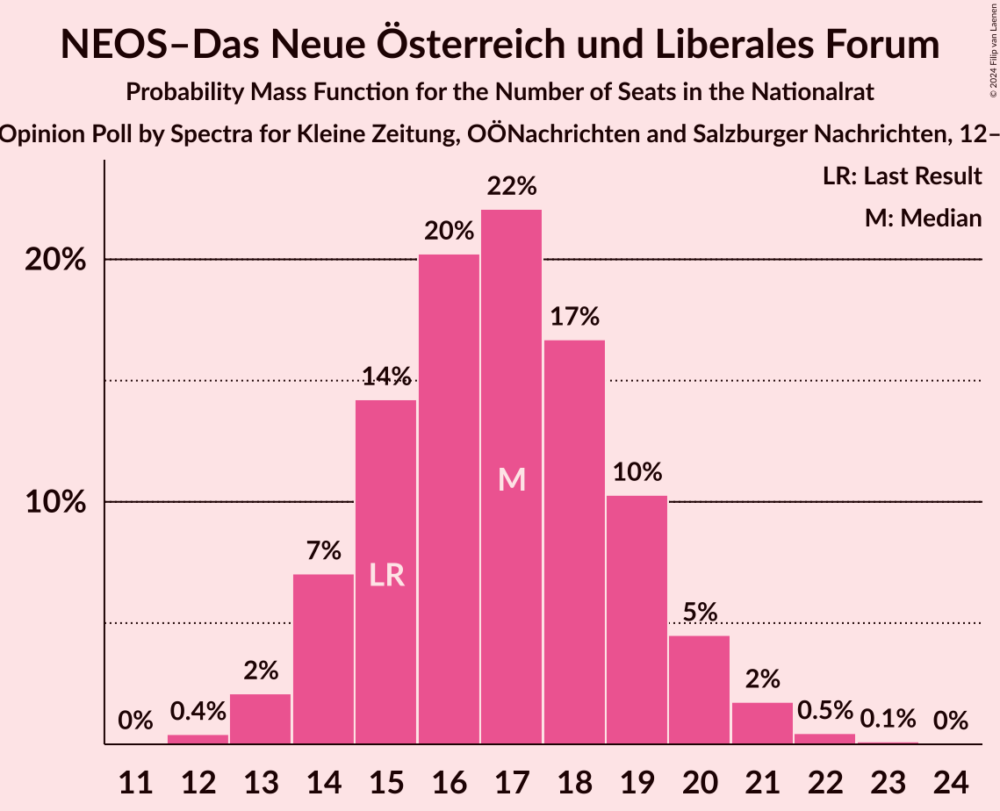
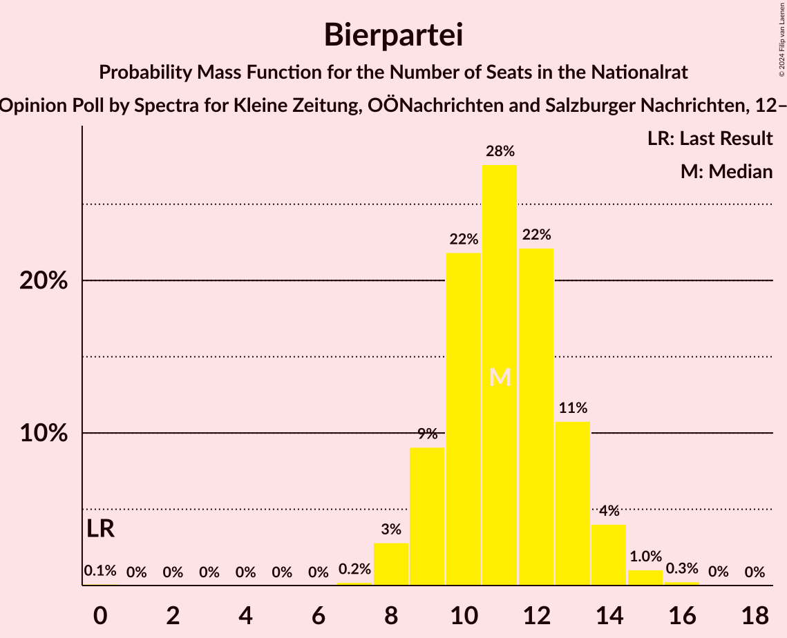
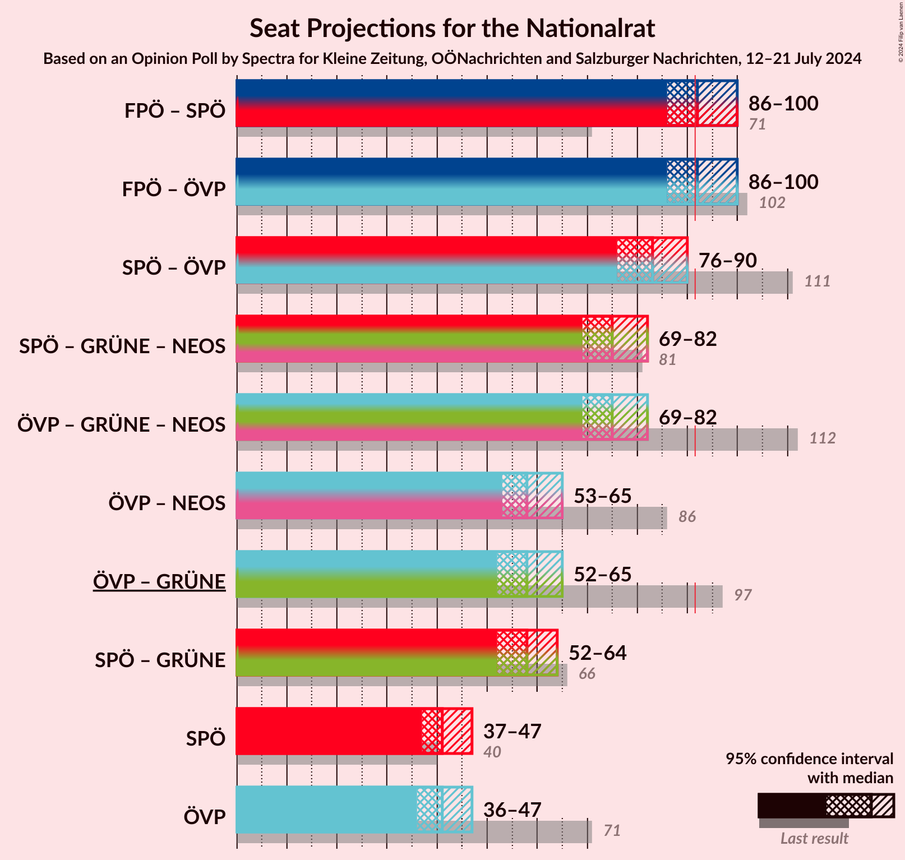
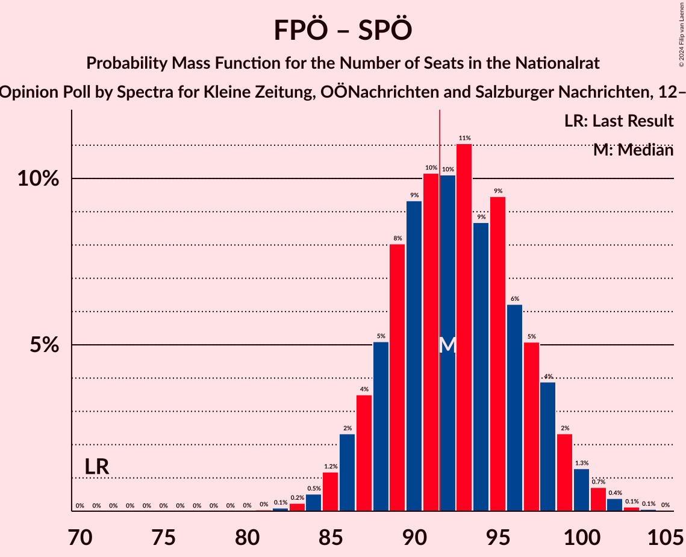
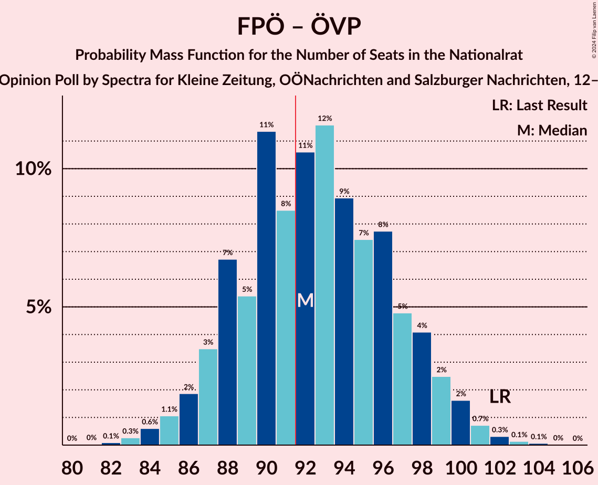
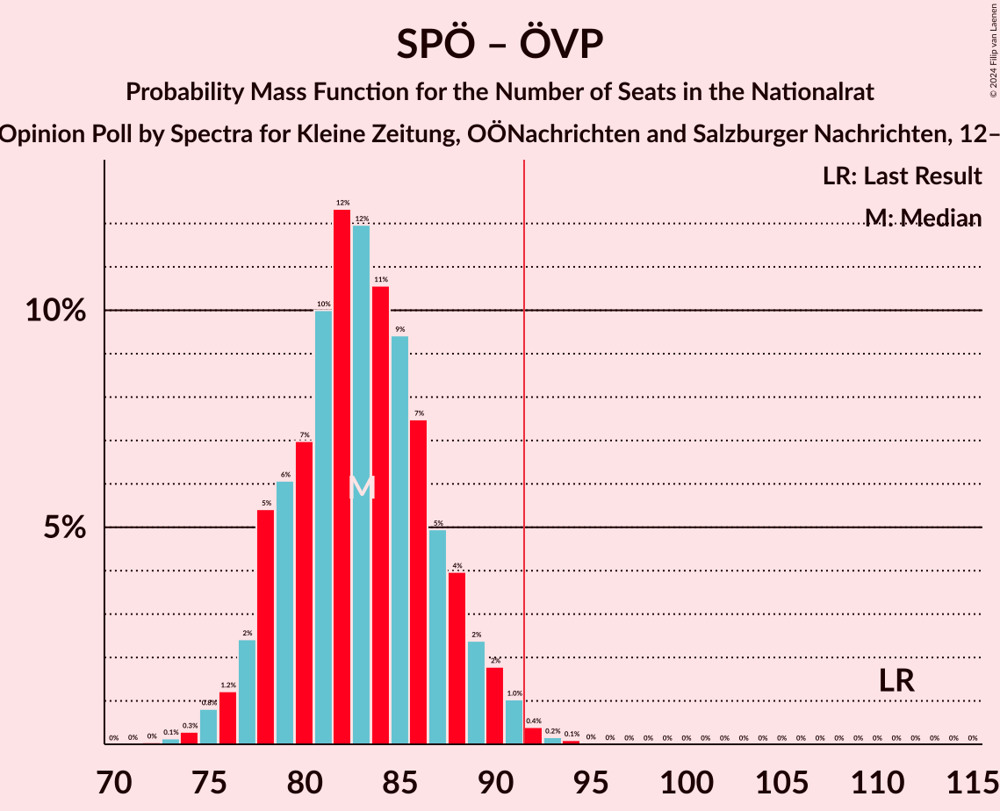
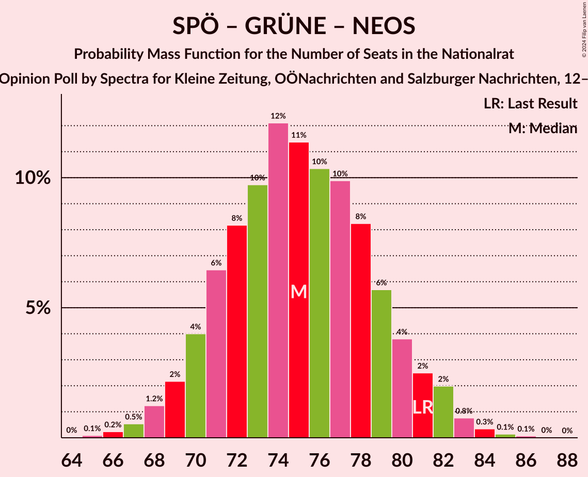
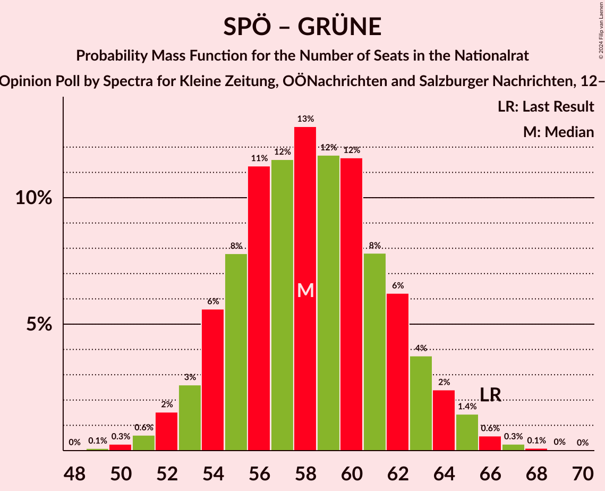

# Opinion Poll by Spectra for Kleine Zeitung, OÖNachrichten and Salzburger Nachrichten, 12–21 July 2024

<a href="#voting-intentions">Voting Intentions</a> | <a href="#seats">Seats</a> | <a href="#coalitions">Coalitions</a> | <a href="#technical-information">Technical Information</a>

## Voting Intentions

### Confidence Intervals

| Party | Last Result | Poll Result | 80% Confidence Interval | 90% Confidence Interval | 95% Confidence Interval | 99% Confidence Interval |
|:-----:|:-----------:|:-----------:|:-----------------------:|:-----------------------:|:-----------------------:|:-----------------------:|
| Freiheitliche Partei Österreichs | 16.2% | 27.0% | 25.3–28.9% |24.8–29.4% |24.3–29.8% |23.5–30.7% |
| Österreichische Volkspartei | 37.5% | 22.0% | 20.4–23.7% |19.9–24.2% |19.5–24.7% |18.8–25.5% |
| Sozialdemokratische Partei Österreichs | 21.2% | 22.0% | 20.4–23.7% |19.9–24.2% |19.5–24.7% |18.8–25.5% |
| NEOS–Das Neue Österreich und Liberales Forum | 8.1% | 9.0% | 7.9–10.3% |7.6–10.6% |7.4–10.9% |6.9–11.6% |
| Die Grünen–Die Grüne Alternative | 13.9% | 9.0% | 7.9–10.3% |7.6–10.6% |7.4–10.9% |6.9–11.6% |
| Bierpartei | 0.0% | 6.0% | 5.1–7.1% |4.9–7.4% |4.7–7.7% |4.3–8.2% |
| Kommunistische Partei Österreichs | 0.7% | 4.0% | 3.3–4.9% |3.1–5.2% |2.9–5.4% |2.7–5.9% |

*Note:* The poll result column reflects the actual value used in the calculations. Published results may vary slightly, and in addition be rounded to fewer digits.

## Seats

### Confidence Intervals

| Party | Last Result | Median | 80% Confidence Interval | 90% Confidence Interval | 95% Confidence Interval | 99% Confidence Interval |
|:-----:|:-----------:|:------:|:-----------------------:|:-----------------------:|:-----------------------:|:-----------------------:|
| <a href="#freiheitliche-partei-österreichs">Freiheitliche Partei Österreichs</a> | 31 | 51 | 47–55 |46–56 |46–57 |44–59 |
| <a href="#österreichische-volkspartei">Österreichische Volkspartei</a> | 71 | 41 | 38–45 |37–46 |36–47 |35–49 |
| <a href="#sozialdemokratische-partei-österreichs">Sozialdemokratische Partei Österreichs</a> | 40 | 41 | 38–45 |37–46 |37–47 |35–49 |
| <a href="#neos–das-neue-österreich-und-liberales-forum">NEOS–Das Neue Österreich und Liberales Forum</a> | 15 | 17 | 14–19 |14–20 |13–20 |13–22 |
| <a href="#die-grünen–die-grüne-alternative">Die Grünen–Die Grüne Alternative</a> | 26 | 17 | 15–19 |14–20 |14–20 |13–22 |
| <a href="#bierpartei">Bierpartei</a> | 0 | 11 | 9–13 |9–14 |8–14 |8–15 |
| <a href="#kommunistische-partei-österreichs">Kommunistische Partei Österreichs</a> | 0 | 7 | 0–9 |0–9 |0–10 |0–10 |

### Freiheitliche Partei Österreichs

*For a full overview of the results for this party, see the [Freiheitliche Partei Österreichs](party-freiheitlicheparteiösterreichs.html) page.*

| Number of Seats | Probability | Accumulated | Special Marks |
|:---------------:|:-----------:|:-----------:|:-------------:|
| 31 | 0% | 100% | Last Result |
| 32 | 0% | 100% |  |
| 33 | 0% | 100% |  |
| 34 | 0% | 100% |  |
| 35 | 0% | 100% |  |
| 36 | 0% | 100% |  |
| 37 | 0% | 100% |  |
| 38 | 0% | 100% |  |
| 39 | 0% | 100% |  |
| 40 | 0% | 100% |  |
| 41 | 0% | 100% |  |
| 42 | 0.1% | 100% |  |
| 43 | 0.2% | 99.9% |  |
| 44 | 0.5% | 99.7% |  |
| 45 | 1.5% | 99.2% |  |
| 46 | 3% | 98% |  |
| 47 | 6% | 95% |  |
| 48 | 8% | 89% |  |
| 49 | 12% | 81% |  |
| 50 | 12% | 69% |  |
| 51 | 13% | 57% | Median |
| 52 | 12% | 44% |  |
| 53 | 12% | 32% |  |
| 54 | 8% | 20% |  |
| 55 | 5% | 12% |  |
| 56 | 3% | 6% |  |
| 57 | 2% | 3% |  |
| 58 | 0.7% | 1.4% |  |
| 59 | 0.4% | 0.6% |  |
| 60 | 0.1% | 0.2% |  |
| 61 | 0.1% | 0.1% |  |
| 62 | 0% | 0% |  |

### Österreichische Volkspartei

*For a full overview of the results for this party, see the [Österreichische Volkspartei](party-österreichischevolkspartei.html) page.*

| Number of Seats | Probability | Accumulated | Special Marks |
|:---------------:|:-----------:|:-----------:|:-------------:|
| 33 | 0% | 100% |  |
| 34 | 0.2% | 99.9% |  |
| 35 | 0.6% | 99.7% |  |
| 36 | 2% | 99.1% |  |
| 37 | 3% | 97% |  |
| 38 | 7% | 94% |  |
| 39 | 10% | 87% |  |
| 40 | 13% | 77% |  |
| 41 | 17% | 64% | Median |
| 42 | 15% | 48% |  |
| 43 | 11% | 33% |  |
| 44 | 8% | 22% |  |
| 45 | 6% | 14% |  |
| 46 | 4% | 7% |  |
| 47 | 2% | 4% |  |
| 48 | 0.9% | 1.4% |  |
| 49 | 0.3% | 0.5% |  |
| 50 | 0.1% | 0.2% |  |
| 51 | 0% | 0.1% |  |
| 52 | 0% | 0% |  |
| 53 | 0% | 0% |  |
| 54 | 0% | 0% |  |
| 55 | 0% | 0% |  |
| 56 | 0% | 0% |  |
| 57 | 0% | 0% |  |
| 58 | 0% | 0% |  |
| 59 | 0% | 0% |  |
| 60 | 0% | 0% |  |
| 61 | 0% | 0% |  |
| 62 | 0% | 0% |  |
| 63 | 0% | 0% |  |
| 64 | 0% | 0% |  |
| 65 | 0% | 0% |  |
| 66 | 0% | 0% |  |
| 67 | 0% | 0% |  |
| 68 | 0% | 0% |  |
| 69 | 0% | 0% |  |
| 70 | 0% | 0% |  |
| 71 | 0% | 0% | Last Result |

### Sozialdemokratische Partei Österreichs

*For a full overview of the results for this party, see the [Sozialdemokratische Partei Österreichs](party-sozialdemokratischeparteiösterreichs.html) page.*

| Number of Seats | Probability | Accumulated | Special Marks |
|:---------------:|:-----------:|:-----------:|:-------------:|
| 33 | 0% | 100% |  |
| 34 | 0.2% | 99.9% |  |
| 35 | 0.7% | 99.7% |  |
| 36 | 1.5% | 99.0% |  |
| 37 | 4% | 98% |  |
| 38 | 6% | 93% |  |
| 39 | 13% | 88% |  |
| 40 | 14% | 75% | Last Result |
| 41 | 13% | 61% | Median |
| 42 | 15% | 48% |  |
| 43 | 13% | 33% |  |
| 44 | 7% | 20% |  |
| 45 | 6% | 13% |  |
| 46 | 4% | 7% |  |
| 47 | 2% | 3% |  |
| 48 | 0.9% | 1.5% |  |
| 49 | 0.4% | 0.6% |  |
| 50 | 0.2% | 0.2% |  |
| 51 | 0% | 0.1% |  |
| 52 | 0% | 0% |  |

### NEOS–Das Neue Österreich und Liberales Forum

*For a full overview of the results for this party, see the [NEOS–Das Neue Österreich und Liberales Forum](party-neos–dasneueösterreichundliberalesforum.html) page.*

| Number of Seats | Probability | Accumulated | Special Marks |
|:---------------:|:-----------:|:-----------:|:-------------:|
| 12 | 0.4% | 100% |  |
| 13 | 2% | 99.6% |  |
| 14 | 8% | 97% |  |
| 15 | 15% | 90% | Last Result |
| 16 | 21% | 75% |  |
| 17 | 20% | 53% | Median |
| 18 | 16% | 33% |  |
| 19 | 10% | 17% |  |
| 20 | 5% | 7% |  |
| 21 | 2% | 2% |  |
| 22 | 0.5% | 0.7% |  |
| 23 | 0.1% | 0.2% |  |
| 24 | 0% | 0% |  |

### Die Grünen–Die Grüne Alternative

*For a full overview of the results for this party, see the [Die Grünen–Die Grüne Alternative](party-diegrünen–diegrünealternative.html) page.*

| Number of Seats | Probability | Accumulated | Special Marks |
|:---------------:|:-----------:|:-----------:|:-------------:|
| 12 | 0.4% | 100% |  |
| 13 | 2% | 99.6% |  |
| 14 | 7% | 98% |  |
| 15 | 13% | 90% |  |
| 16 | 22% | 77% |  |
| 17 | 22% | 56% | Median |
| 18 | 16% | 33% |  |
| 19 | 10% | 17% |  |
| 20 | 5% | 7% |  |
| 21 | 2% | 2% |  |
| 22 | 0.5% | 0.7% |  |
| 23 | 0.1% | 0.1% |  |
| 24 | 0% | 0% |  |
| 25 | 0% | 0% |  |
| 26 | 0% | 0% | Last Result |

### Bierpartei

*For a full overview of the results for this party, see the [Bierpartei](party-bierpartei.html) page.*

| Number of Seats | Probability | Accumulated | Special Marks |
|:---------------:|:-----------:|:-----------:|:-------------:|
| 0 | 0.1% | 100% | Last Result |
| 1 | 0% | 99.9% |  |
| 2 | 0% | 99.9% |  |
| 3 | 0% | 99.9% |  |
| 4 | 0% | 99.9% |  |
| 5 | 0% | 99.9% |  |
| 6 | 0% | 99.9% |  |
| 7 | 0.2% | 99.9% |  |
| 8 | 3% | 99.7% |  |
| 9 | 10% | 97% |  |
| 10 | 21% | 86% |  |
| 11 | 26% | 66% | Median |
| 12 | 23% | 40% |  |
| 13 | 12% | 17% |  |
| 14 | 4% | 5% |  |
| 15 | 1.0% | 1.3% |  |
| 16 | 0.3% | 0.3% |  |
| 17 | 0% | 0.1% |  |
| 18 | 0% | 0% |  |

### Kommunistische Partei Österreichs

*For a full overview of the results for this party, see the [Kommunistische Partei Österreichs](party-kommunistischeparteiösterreichs.html) page.*

| Number of Seats | Probability | Accumulated | Special Marks |
|:---------------:|:-----------:|:-----------:|:-------------:|
| 0 | 46% | 100% | Last Result |
| 1 | 0% | 54% |  |
| 2 | 0% | 54% |  |
| 3 | 0% | 54% |  |
| 4 | 0% | 54% |  |
| 5 | 0% | 54% |  |
| 6 | 0% | 54% |  |
| 7 | 18% | 54% | Median |
| 8 | 24% | 37% |  |
| 9 | 10% | 13% |  |
| 10 | 3% | 3% |  |
| 11 | 0.4% | 0.5% |  |
| 12 | 0.1% | 0.1% |  |
| 13 | 0% | 0% |  |

## Coalitions

### Confidence Intervals

| Coalition | Last Result | Median | Majority? | 80% Confidence Interval | 90% Confidence Interval | 95% Confidence Interval | 99% Confidence Interval |
|:---------:|:-----------:|:------:|:---------:|:-----------------------:|:-----------------------:|:-----------------------:|:-----------------------:|
| Freiheitliche Partei Österreichs – Sozialdemokratische Partei Österreichs | 71 | 92 | 59% | 88–97 | 87–99 | 86–100 | 84–102 |
| Freiheitliche Partei Österreichs – Österreichische Volkspartei | 102 | 93 | 60% | 88–97 | 87–99 | 86–100 | 84–102 |
| Sozialdemokratische Partei Österreichs – Österreichische Volkspartei | 111 | 83 | 0.7% | 78–88 | 78–89 | 76–90 | 74–92 |
| Sozialdemokratische Partei Österreichs – Die Grünen–Die Grüne Alternative – NEOS–Das Neue Österreich und Liberales Forum | 81 | 75 | 0% | 71–79 | 70–81 | 69–82 | 67–84 |
| Österreichische Volkspartei – Die Grünen–Die Grüne Alternative – NEOS–Das Neue Österreich und Liberales Forum | 112 | 75 | 0% | 71–80 | 70–81 | 69–82 | 67–84 |
| Österreichische Volkspartei – Die Grünen–Die Grüne Alternative | 97 | 58 | 0% | 54–62 | 54–64 | 52–65 | 51–66 |
| Sozialdemokratische Partei Österreichs – Die Grünen–Die Grüne Alternative | 66 | 58 | 0% | 54–62 | 53–63 | 52–64 | 51–66 |
| Österreichische Volkspartei – NEOS–Das Neue Österreich und Liberales Forum | 86 | 58 | 0% | 54–62 | 53–63 | 52–64 | 51–66 |
| Sozialdemokratische Partei Österreichs | 40 | 41 | 0% | 38–45 | 37–46 | 37–47 | 35–49 |
| Österreichische Volkspartei | 71 | 41 | 0% | 38–45 | 37–46 | 36–47 | 35–49 |

### Freiheitliche Partei Österreichs – Sozialdemokratische Partei Österreichs

| Number of Seats | Probability | Accumulated | Special Marks |
|:---------------:|:-----------:|:-----------:|:-------------:|
| 71 | 0% | 100% | Last Result |
| 72 | 0% | 100% |  |
| 73 | 0% | 100% |  |
| 74 | 0% | 100% |  |
| 75 | 0% | 100% |  |
| 76 | 0% | 100% |  |
| 77 | 0% | 100% |  |
| 78 | 0% | 100% |  |
| 79 | 0% | 100% |  |
| 80 | 0% | 100% |  |
| 81 | 0% | 100% |  |
| 82 | 0.1% | 99.9% |  |
| 83 | 0.3% | 99.9% |  |
| 84 | 0.5% | 99.6% |  |
| 85 | 1.3% | 99.1% |  |
| 86 | 2% | 98% |  |
| 87 | 4% | 96% |  |
| 88 | 5% | 92% |  |
| 89 | 7% | 86% |  |
| 90 | 10% | 79% |  |
| 91 | 10% | 69% |  |
| 92 | 9% | 59% | Median, Majority |
| 93 | 12% | 50% |  |
| 94 | 8% | 38% |  |
| 95 | 10% | 30% |  |
| 96 | 6% | 21% |  |
| 97 | 6% | 15% |  |
| 98 | 3% | 9% |  |
| 99 | 3% | 5% |  |
| 100 | 1.4% | 3% |  |
| 101 | 0.8% | 1.4% |  |
| 102 | 0.3% | 0.6% |  |
| 103 | 0.1% | 0.2% |  |
| 104 | 0.1% | 0.1% |  |
| 105 | 0% | 0% |  |

### Freiheitliche Partei Österreichs – Österreichische Volkspartei

| Number of Seats | Probability | Accumulated | Special Marks |
|:---------------:|:-----------:|:-----------:|:-------------:|
| 81 | 0% | 100% |  |
| 82 | 0.1% | 99.9% |  |
| 83 | 0.3% | 99.8% |  |
| 84 | 0.6% | 99.6% |  |
| 85 | 1.3% | 99.0% |  |
| 86 | 2% | 98% |  |
| 87 | 4% | 96% |  |
| 88 | 7% | 92% |  |
| 89 | 5% | 86% |  |
| 90 | 12% | 81% |  |
| 91 | 9% | 69% |  |
| 92 | 10% | 60% | Median, Majority |
| 93 | 11% | 50% |  |
| 94 | 10% | 40% |  |
| 95 | 8% | 30% |  |
| 96 | 6% | 21% |  |
| 97 | 6% | 15% |  |
| 98 | 4% | 9% |  |
| 99 | 3% | 5% |  |
| 100 | 2% | 3% |  |
| 101 | 0.7% | 1.3% |  |
| 102 | 0.3% | 0.6% | Last Result |
| 103 | 0.2% | 0.2% |  |
| 104 | 0.1% | 0.1% |  |
| 105 | 0% | 0% |  |

### Sozialdemokratische Partei Österreichs – Österreichische Volkspartei

| Number of Seats | Probability | Accumulated | Special Marks |
|:---------------:|:-----------:|:-----------:|:-------------:|
| 72 | 0% | 100% |  |
| 73 | 0.1% | 99.9% |  |
| 74 | 0.3% | 99.8% |  |
| 75 | 0.9% | 99.5% |  |
| 76 | 1.1% | 98.5% |  |
| 77 | 2% | 97% |  |
| 78 | 6% | 95% |  |
| 79 | 6% | 89% |  |
| 80 | 7% | 83% |  |
| 81 | 11% | 76% |  |
| 82 | 12% | 65% | Median |
| 83 | 12% | 53% |  |
| 84 | 10% | 41% |  |
| 85 | 10% | 31% |  |
| 86 | 5% | 21% |  |
| 87 | 6% | 16% |  |
| 88 | 4% | 10% |  |
| 89 | 3% | 7% |  |
| 90 | 2% | 4% |  |
| 91 | 0.9% | 2% |  |
| 92 | 0.4% | 0.7% | Majority |
| 93 | 0.2% | 0.3% |  |
| 94 | 0.1% | 0.1% |  |
| 95 | 0% | 0% |  |
| 96 | 0% | 0% |  |
| 97 | 0% | 0% |  |
| 98 | 0% | 0% |  |
| 99 | 0% | 0% |  |
| 100 | 0% | 0% |  |
| 101 | 0% | 0% |  |
| 102 | 0% | 0% |  |
| 103 | 0% | 0% |  |
| 104 | 0% | 0% |  |
| 105 | 0% | 0% |  |
| 106 | 0% | 0% |  |
| 107 | 0% | 0% |  |
| 108 | 0% | 0% |  |
| 109 | 0% | 0% |  |
| 110 | 0% | 0% |  |
| 111 | 0% | 0% | Last Result |

### Sozialdemokratische Partei Österreichs – Die Grünen–Die Grüne Alternative – NEOS–Das Neue Österreich und Liberales Forum

| Number of Seats | Probability | Accumulated | Special Marks |
|:---------------:|:-----------:|:-----------:|:-------------:|
| 65 | 0.1% | 100% |  |
| 66 | 0.2% | 99.9% |  |
| 67 | 0.5% | 99.6% |  |
| 68 | 2% | 99.1% |  |
| 69 | 2% | 98% |  |
| 70 | 4% | 96% |  |
| 71 | 7% | 91% |  |
| 72 | 8% | 84% |  |
| 73 | 10% | 76% |  |
| 74 | 12% | 67% |  |
| 75 | 12% | 55% | Median |
| 76 | 11% | 43% |  |
| 77 | 10% | 32% |  |
| 78 | 8% | 22% |  |
| 79 | 5% | 14% |  |
| 80 | 4% | 10% |  |
| 81 | 2% | 6% | Last Result |
| 82 | 2% | 4% |  |
| 83 | 0.7% | 1.3% |  |
| 84 | 0.3% | 0.6% |  |
| 85 | 0.2% | 0.3% |  |
| 86 | 0.1% | 0.1% |  |
| 87 | 0% | 0% |  |

### Österreichische Volkspartei – Die Grünen–Die Grüne Alternative – NEOS–Das Neue Österreich und Liberales Forum

| Number of Seats | Probability | Accumulated | Special Marks |
|:---------------:|:-----------:|:-----------:|:-------------:|
| 65 | 0.1% | 100% |  |
| 66 | 0.2% | 99.9% |  |
| 67 | 0.5% | 99.6% |  |
| 68 | 1.0% | 99.1% |  |
| 69 | 2% | 98% |  |
| 70 | 4% | 96% |  |
| 71 | 7% | 92% |  |
| 72 | 7% | 85% |  |
| 73 | 10% | 77% |  |
| 74 | 13% | 67% |  |
| 75 | 11% | 55% | Median |
| 76 | 13% | 44% |  |
| 77 | 8% | 31% |  |
| 78 | 6% | 23% |  |
| 79 | 6% | 17% |  |
| 80 | 5% | 10% |  |
| 81 | 2% | 6% |  |
| 82 | 2% | 3% |  |
| 83 | 1.1% | 2% |  |
| 84 | 0.5% | 0.8% |  |
| 85 | 0.1% | 0.3% |  |
| 86 | 0.1% | 0.1% |  |
| 87 | 0% | 0% |  |
| 88 | 0% | 0% |  |
| 89 | 0% | 0% |  |
| 90 | 0% | 0% |  |
| 91 | 0% | 0% |  |
| 92 | 0% | 0% | Majority |
| 93 | 0% | 0% |  |
| 94 | 0% | 0% |  |
| 95 | 0% | 0% |  |
| 96 | 0% | 0% |  |
| 97 | 0% | 0% |  |
| 98 | 0% | 0% |  |
| 99 | 0% | 0% |  |
| 100 | 0% | 0% |  |
| 101 | 0% | 0% |  |
| 102 | 0% | 0% |  |
| 103 | 0% | 0% |  |
| 104 | 0% | 0% |  |
| 105 | 0% | 0% |  |
| 106 | 0% | 0% |  |
| 107 | 0% | 0% |  |
| 108 | 0% | 0% |  |
| 109 | 0% | 0% |  |
| 110 | 0% | 0% |  |
| 111 | 0% | 0% |  |
| 112 | 0% | 0% | Last Result |

### Österreichische Volkspartei – Die Grünen–Die Grüne Alternative

| Number of Seats | Probability | Accumulated | Special Marks |
|:---------------:|:-----------:|:-----------:|:-------------:|
| 49 | 0.1% | 100% |  |
| 50 | 0.3% | 99.9% |  |
| 51 | 0.6% | 99.6% |  |
| 52 | 1.4% | 98.9% |  |
| 53 | 2% | 97% |  |
| 54 | 6% | 95% |  |
| 55 | 7% | 90% |  |
| 56 | 10% | 82% |  |
| 57 | 13% | 72% |  |
| 58 | 14% | 59% | Median |
| 59 | 13% | 45% |  |
| 60 | 9% | 32% |  |
| 61 | 8% | 23% |  |
| 62 | 6% | 16% |  |
| 63 | 4% | 9% |  |
| 64 | 2% | 5% |  |
| 65 | 1.5% | 3% |  |
| 66 | 1.1% | 2% |  |
| 67 | 0.3% | 0.5% |  |
| 68 | 0.1% | 0.2% |  |
| 69 | 0% | 0.1% |  |
| 70 | 0% | 0% |  |
| 71 | 0% | 0% |  |
| 72 | 0% | 0% |  |
| 73 | 0% | 0% |  |
| 74 | 0% | 0% |  |
| 75 | 0% | 0% |  |
| 76 | 0% | 0% |  |
| 77 | 0% | 0% |  |
| 78 | 0% | 0% |  |
| 79 | 0% | 0% |  |
| 80 | 0% | 0% |  |
| 81 | 0% | 0% |  |
| 82 | 0% | 0% |  |
| 83 | 0% | 0% |  |
| 84 | 0% | 0% |  |
| 85 | 0% | 0% |  |
| 86 | 0% | 0% |  |
| 87 | 0% | 0% |  |
| 88 | 0% | 0% |  |
| 89 | 0% | 0% |  |
| 90 | 0% | 0% |  |
| 91 | 0% | 0% |  |
| 92 | 0% | 0% | Majority |
| 93 | 0% | 0% |  |
| 94 | 0% | 0% |  |
| 95 | 0% | 0% |  |
| 96 | 0% | 0% |  |
| 97 | 0% | 0% | Last Result |

### Sozialdemokratische Partei Österreichs – Die Grünen–Die Grüne Alternative

| Number of Seats | Probability | Accumulated | Special Marks |
|:---------------:|:-----------:|:-----------:|:-------------:|
| 49 | 0.1% | 100% |  |
| 50 | 0.3% | 99.9% |  |
| 51 | 0.7% | 99.6% |  |
| 52 | 2% | 98.9% |  |
| 53 | 2% | 97% |  |
| 54 | 6% | 95% |  |
| 55 | 8% | 89% |  |
| 56 | 10% | 81% |  |
| 57 | 12% | 70% |  |
| 58 | 13% | 59% | Median |
| 59 | 12% | 45% |  |
| 60 | 11% | 33% |  |
| 61 | 7% | 22% |  |
| 62 | 6% | 15% |  |
| 63 | 4% | 9% |  |
| 64 | 2% | 4% |  |
| 65 | 1.3% | 2% |  |
| 66 | 0.6% | 1.0% | Last Result |
| 67 | 0.3% | 0.4% |  |
| 68 | 0.1% | 0.2% |  |
| 69 | 0% | 0.1% |  |
| 70 | 0% | 0% |  |

### Österreichische Volkspartei – NEOS–Das Neue Österreich und Liberales Forum

| Number of Seats | Probability | Accumulated | Special Marks |
|:---------------:|:-----------:|:-----------:|:-------------:|
| 49 | 0.1% | 100% |  |
| 50 | 0.2% | 99.9% |  |
| 51 | 0.7% | 99.7% |  |
| 52 | 2% | 99.0% |  |
| 53 | 3% | 97% |  |
| 54 | 5% | 94% |  |
| 55 | 9% | 90% |  |
| 56 | 9% | 81% |  |
| 57 | 14% | 72% |  |
| 58 | 14% | 58% | Median |
| 59 | 11% | 44% |  |
| 60 | 9% | 33% |  |
| 61 | 9% | 24% |  |
| 62 | 7% | 16% |  |
| 63 | 4% | 8% |  |
| 64 | 2% | 4% |  |
| 65 | 1.4% | 2% |  |
| 66 | 0.6% | 1.0% |  |
| 67 | 0.3% | 0.4% |  |
| 68 | 0.1% | 0.2% |  |
| 69 | 0.1% | 0.1% |  |
| 70 | 0% | 0% |  |
| 71 | 0% | 0% |  |
| 72 | 0% | 0% |  |
| 73 | 0% | 0% |  |
| 74 | 0% | 0% |  |
| 75 | 0% | 0% |  |
| 76 | 0% | 0% |  |
| 77 | 0% | 0% |  |
| 78 | 0% | 0% |  |
| 79 | 0% | 0% |  |
| 80 | 0% | 0% |  |
| 81 | 0% | 0% |  |
| 82 | 0% | 0% |  |
| 83 | 0% | 0% |  |
| 84 | 0% | 0% |  |
| 85 | 0% | 0% |  |
| 86 | 0% | 0% | Last Result |

### Sozialdemokratische Partei Österreichs

| Number of Seats | Probability | Accumulated | Special Marks |
|:---------------:|:-----------:|:-----------:|:-------------:|
| 33 | 0% | 100% |  |
| 34 | 0.2% | 99.9% |  |
| 35 | 0.7% | 99.7% |  |
| 36 | 1.5% | 99.0% |  |
| 37 | 4% | 98% |  |
| 38 | 6% | 93% |  |
| 39 | 13% | 88% |  |
| 40 | 14% | 75% | Last Result |
| 41 | 13% | 61% | Median |
| 42 | 15% | 48% |  |
| 43 | 13% | 33% |  |
| 44 | 7% | 20% |  |
| 45 | 6% | 13% |  |
| 46 | 4% | 7% |  |
| 47 | 2% | 3% |  |
| 48 | 0.9% | 1.5% |  |
| 49 | 0.4% | 0.6% |  |
| 50 | 0.2% | 0.2% |  |
| 51 | 0% | 0.1% |  |
| 52 | 0% | 0% |  |

### Österreichische Volkspartei

| Number of Seats | Probability | Accumulated | Special Marks |
|:---------------:|:-----------:|:-----------:|:-------------:|
| 33 | 0% | 100% |  |
| 34 | 0.2% | 99.9% |  |
| 35 | 0.6% | 99.7% |  |
| 36 | 2% | 99.1% |  |
| 37 | 3% | 97% |  |
| 38 | 7% | 94% |  |
| 39 | 10% | 87% |  |
| 40 | 13% | 77% |  |
| 41 | 17% | 64% | Median |
| 42 | 15% | 48% |  |
| 43 | 11% | 33% |  |
| 44 | 8% | 22% |  |
| 45 | 6% | 14% |  |
| 46 | 4% | 7% |  |
| 47 | 2% | 4% |  |
| 48 | 0.9% | 1.4% |  |
| 49 | 0.3% | 0.5% |  |
| 50 | 0.1% | 0.2% |  |
| 51 | 0% | 0.1% |  |
| 52 | 0% | 0% |  |
| 53 | 0% | 0% |  |
| 54 | 0% | 0% |  |
| 55 | 0% | 0% |  |
| 56 | 0% | 0% |  |
| 57 | 0% | 0% |  |
| 58 | 0% | 0% |  |
| 59 | 0% | 0% |  |
| 60 | 0% | 0% |  |
| 61 | 0% | 0% |  |
| 62 | 0% | 0% |  |
| 63 | 0% | 0% |  |
| 64 | 0% | 0% |  |
| 65 | 0% | 0% |  |
| 66 | 0% | 0% |  |
| 67 | 0% | 0% |  |
| 68 | 0% | 0% |  |
| 69 | 0% | 0% |  |
| 70 | 0% | 0% |  |
| 71 | 0% | 0% | Last Result |

## Technical Information

### Opinion Poll

+ **Polling firm:** Spectra
+ **Commissioner(s):** Kleine Zeitung, OÖNachrichten and Salzburger Nachrichten
+ **Fieldwork period:** 12–21 July 2024

### Calculations

+ **Sample size:** 1000
+ **Simulations done:** 1,048,576
+ **Error estimate:** 1.10%

