# Opinion Poll by IFDD for Radio Content Austria, 25–26 July 2024

<a href="#voting-intentions">Voting Intentions</a> | <a href="#seats">Seats</a> | <a href="#coalitions">Coalitions</a> | <a href="#technical-information">Technical Information</a>

## Voting Intentions

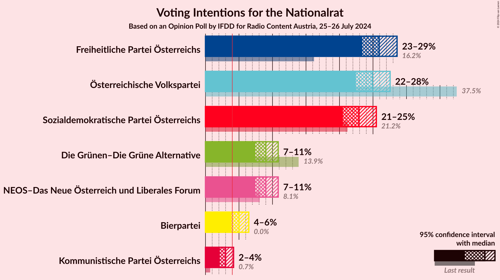

### Confidence Intervals

| Party | Last Result | Poll Result | 80% Confidence Interval | 90% Confidence Interval | 95% Confidence Interval | 99% Confidence Interval |
|:-----:|:-----------:|:-----------:|:-----------------------:|:-----------------------:|:-----------------------:|:-----------------------:|
| Freiheitliche Partei Österreichs | 16.2% | 25.9% | 24.3–27.7% |23.8–28.2% |23.4–28.6% |22.6–29.4% |
| Österreichische Volkspartei | 37.5% | 24.9% | 23.3–26.6% |22.8–27.1% |22.4–27.6% |21.7–28.4% |
| Sozialdemokratische Partei Österreichs | 21.2% | 22.9% | 21.3–24.6% |20.9–25.1% |20.5–25.5% |19.8–26.3% |
| Die Grünen–Die Grüne Alternative | 13.9% | 9.0% | 8.0–10.2% |7.7–10.5% |7.4–10.9% |7.0–11.4% |
| NEOS–Das Neue Österreich und Liberales Forum | 8.1% | 9.0% | 8.0–10.2% |7.7–10.5% |7.4–10.9% |7.0–11.4% |
| Bierpartei | 0.0% | 5.0% | 4.3–6.0% |4.0–6.2% |3.9–6.5% |3.5–7.0% |
| Kommunistische Partei Österreichs | 0.7% | 3.0% | 2.4–3.8% |2.3–4.0% |2.1–4.2% |1.9–4.6% |

*Note:* The poll result column reflects the actual value used in the calculations. Published results may vary slightly, and in addition be rounded to fewer digits.

## Seats

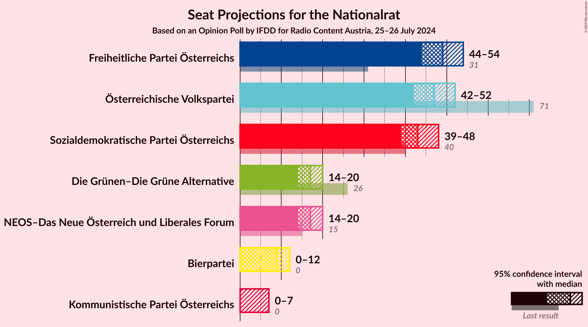

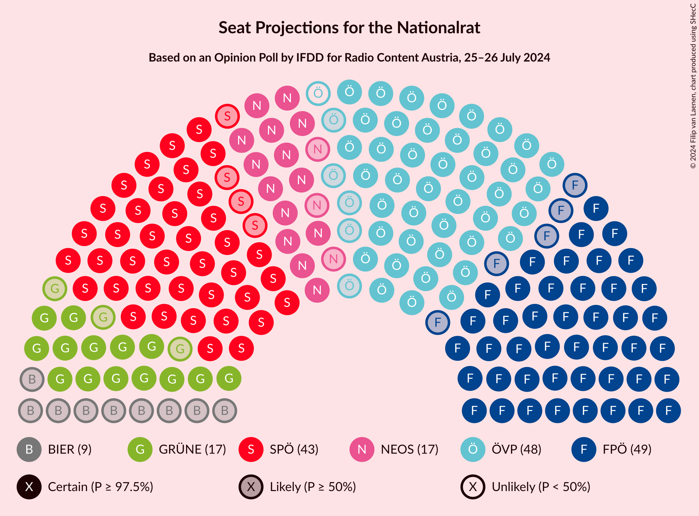

### Confidence Intervals

| Party | Last Result | Median | 80% Confidence Interval | 90% Confidence Interval | 95% Confidence Interval | 99% Confidence Interval |
|:-----:|:-----------:|:------:|:-----------------------:|:-----------------------:|:-----------------------:|:-----------------------:|
| <a href="#freiheitliche-partei-österreichs">Freiheitliche Partei Österreichs</a> | 31 | 49 | 46–53 |45–54 |44–54 |43–56 |
| <a href="#österreichische-volkspartei">Österreichische Volkspartei</a> | 71 | 47 | 44–51 |43–52 |42–52 |41–54 |
| <a href="#sozialdemokratische-partei-österreichs">Sozialdemokratische Partei Österreichs</a> | 40 | 43 | 40–47 |39–48 |39–48 |37–50 |
| <a href="#die-grünen–die-grüne-alternative">Die Grünen–Die Grüne Alternative</a> | 26 | 17 | 15–19 |14–20 |14–20 |13–21 |
| <a href="#neos–das-neue-österreich-und-liberales-forum">NEOS–Das Neue Österreich und Liberales Forum</a> | 15 | 17 | 15–19 |14–20 |14–20 |13–21 |
| <a href="#bierpartei">Bierpartei</a> | 0 | 9 | 8–11 |7–11 |0–12 |0–13 |
| <a href="#kommunistische-partei-österreichs">Kommunistische Partei Österreichs</a> | 0 | 0 | 0 |0 |0–7 |0–8 |

### Freiheitliche Partei Österreichs

*For a full overview of the results for this party, see the [Freiheitliche Partei Österreichs](party-freiheitlicheparteiösterreichs.html) page.*

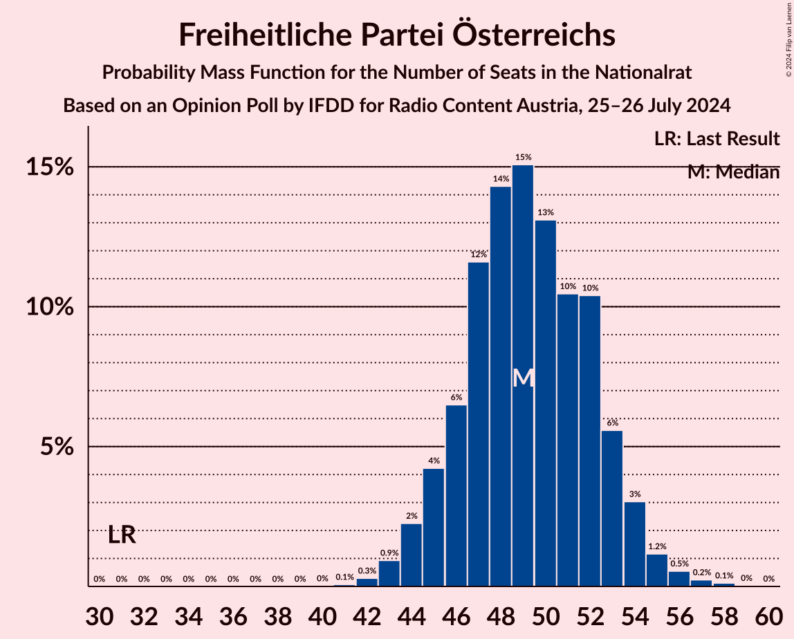

| Number of Seats | Probability | Accumulated | Special Marks |
|:---------------:|:-----------:|:-----------:|:-------------:|
| 31 | 0% | 100% | Last Result |
| 32 | 0% | 100% |  |
| 33 | 0% | 100% |  |
| 34 | 0% | 100% |  |
| 35 | 0% | 100% |  |
| 36 | 0% | 100% |  |
| 37 | 0% | 100% |  |
| 38 | 0% | 100% |  |
| 39 | 0% | 100% |  |
| 40 | 0% | 100% |  |
| 41 | 0.1% | 100% |  |
| 42 | 0.3% | 99.9% |  |
| 43 | 0.9% | 99.6% |  |
| 44 | 2% | 98.7% |  |
| 45 | 4% | 96% |  |
| 46 | 6% | 92% |  |
| 47 | 12% | 86% |  |
| 48 | 14% | 74% |  |
| 49 | 15% | 60% | Median |
| 50 | 13% | 45% |  |
| 51 | 10% | 32% |  |
| 52 | 10% | 21% |  |
| 53 | 6% | 11% |  |
| 54 | 3% | 5% |  |
| 55 | 1.2% | 2% |  |
| 56 | 0.5% | 1.0% |  |
| 57 | 0.2% | 0.4% |  |
| 58 | 0.1% | 0.2% |  |
| 59 | 0% | 0% |  |

### Österreichische Volkspartei

*For a full overview of the results for this party, see the [Österreichische Volkspartei](party-österreichischevolkspartei.html) page.*

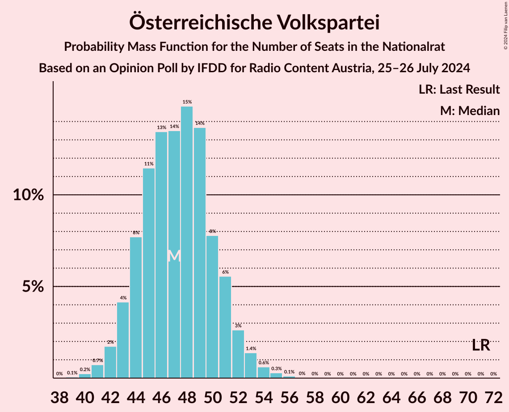

| Number of Seats | Probability | Accumulated | Special Marks |
|:---------------:|:-----------:|:-----------:|:-------------:|
| 39 | 0.1% | 100% |  |
| 40 | 0.2% | 99.9% |  |
| 41 | 0.7% | 99.7% |  |
| 42 | 2% | 98.9% |  |
| 43 | 4% | 97% |  |
| 44 | 8% | 93% |  |
| 45 | 11% | 85% |  |
| 46 | 13% | 74% |  |
| 47 | 14% | 60% | Median |
| 48 | 15% | 47% |  |
| 49 | 14% | 32% |  |
| 50 | 8% | 18% |  |
| 51 | 6% | 11% |  |
| 52 | 3% | 5% |  |
| 53 | 1.4% | 2% |  |
| 54 | 0.6% | 1.1% |  |
| 55 | 0.3% | 0.4% |  |
| 56 | 0.1% | 0.2% |  |
| 57 | 0% | 0% |  |
| 58 | 0% | 0% |  |
| 59 | 0% | 0% |  |
| 60 | 0% | 0% |  |
| 61 | 0% | 0% |  |
| 62 | 0% | 0% |  |
| 63 | 0% | 0% |  |
| 64 | 0% | 0% |  |
| 65 | 0% | 0% |  |
| 66 | 0% | 0% |  |
| 67 | 0% | 0% |  |
| 68 | 0% | 0% |  |
| 69 | 0% | 0% |  |
| 70 | 0% | 0% |  |
| 71 | 0% | 0% | Last Result |

### Sozialdemokratische Partei Österreichs

*For a full overview of the results for this party, see the [Sozialdemokratische Partei Österreichs](party-sozialdemokratischeparteiösterreichs.html) page.*

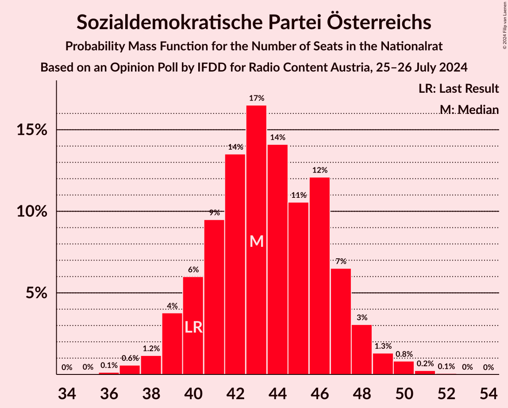

| Number of Seats | Probability | Accumulated | Special Marks |
|:---------------:|:-----------:|:-----------:|:-------------:|
| 36 | 0.1% | 100% |  |
| 37 | 0.6% | 99.8% |  |
| 38 | 1.2% | 99.3% |  |
| 39 | 4% | 98% |  |
| 40 | 6% | 94% | Last Result |
| 41 | 9% | 88% |  |
| 42 | 14% | 79% |  |
| 43 | 17% | 65% | Median |
| 44 | 14% | 49% |  |
| 45 | 11% | 35% |  |
| 46 | 12% | 24% |  |
| 47 | 7% | 12% |  |
| 48 | 3% | 6% |  |
| 49 | 1.3% | 2% |  |
| 50 | 0.8% | 1.2% |  |
| 51 | 0.2% | 0.3% |  |
| 52 | 0.1% | 0.1% |  |
| 53 | 0% | 0% |  |

### Die Grünen–Die Grüne Alternative

*For a full overview of the results for this party, see the [Die Grünen–Die Grüne Alternative](party-diegrünen–diegrünealternative.html) page.*

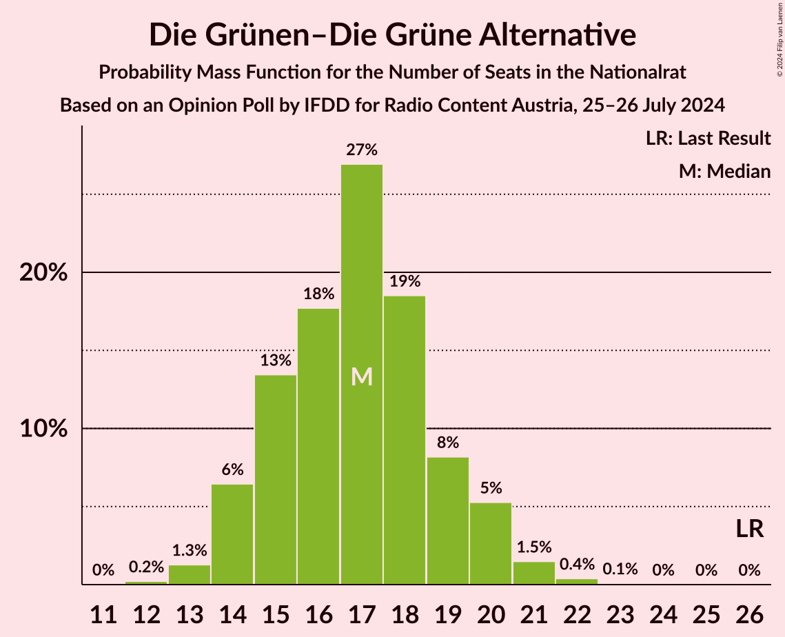

| Number of Seats | Probability | Accumulated | Special Marks |
|:---------------:|:-----------:|:-----------:|:-------------:|
| 12 | 0.2% | 100% |  |
| 13 | 1.3% | 99.8% |  |
| 14 | 6% | 98% |  |
| 15 | 13% | 92% |  |
| 16 | 18% | 79% |  |
| 17 | 27% | 61% | Median |
| 18 | 19% | 34% |  |
| 19 | 8% | 15% |  |
| 20 | 5% | 7% |  |
| 21 | 1.5% | 2% |  |
| 22 | 0.4% | 0.5% |  |
| 23 | 0.1% | 0.1% |  |
| 24 | 0% | 0% |  |
| 25 | 0% | 0% |  |
| 26 | 0% | 0% | Last Result |

### NEOS–Das Neue Österreich und Liberales Forum

*For a full overview of the results for this party, see the [NEOS–Das Neue Österreich und Liberales Forum](party-neos–dasneueösterreichundliberalesforum.html) page.*

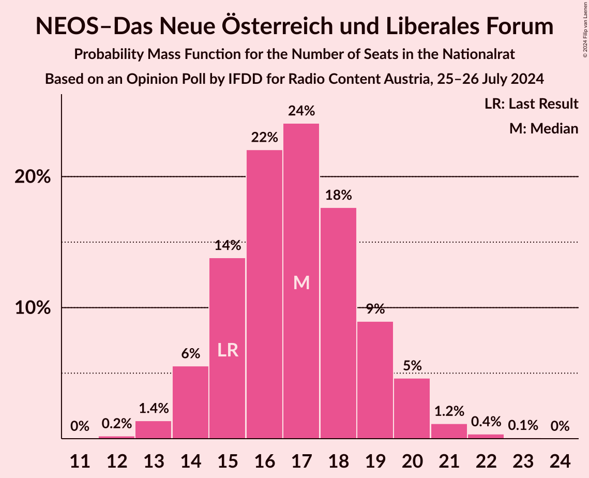

| Number of Seats | Probability | Accumulated | Special Marks |
|:---------------:|:-----------:|:-----------:|:-------------:|
| 12 | 0.2% | 100% |  |
| 13 | 1.4% | 99.8% |  |
| 14 | 6% | 98% |  |
| 15 | 14% | 93% | Last Result |
| 16 | 22% | 79% |  |
| 17 | 24% | 57% | Median |
| 18 | 18% | 33% |  |
| 19 | 9% | 15% |  |
| 20 | 5% | 6% |  |
| 21 | 1.2% | 2% |  |
| 22 | 0.4% | 0.5% |  |
| 23 | 0.1% | 0.1% |  |
| 24 | 0% | 0% |  |

### Bierpartei

*For a full overview of the results for this party, see the [Bierpartei](party-bierpartei.html) page.*

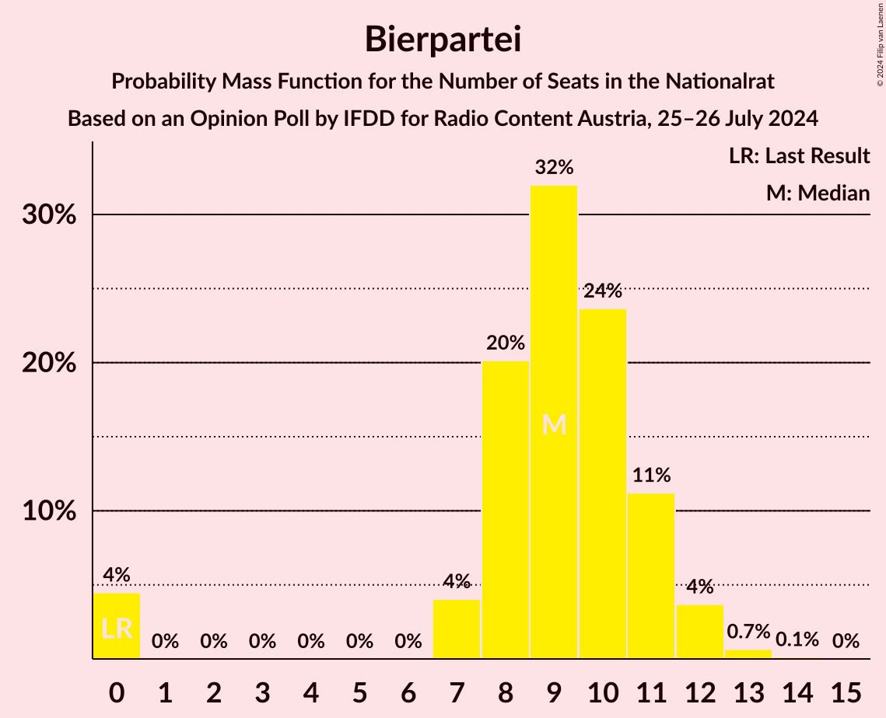

| Number of Seats | Probability | Accumulated | Special Marks |
|:---------------:|:-----------:|:-----------:|:-------------:|
| 0 | 4% | 100% | Last Result |
| 1 | 0% | 96% |  |
| 2 | 0% | 96% |  |
| 3 | 0% | 96% |  |
| 4 | 0% | 96% |  |
| 5 | 0% | 96% |  |
| 6 | 0% | 96% |  |
| 7 | 4% | 96% |  |
| 8 | 20% | 91% |  |
| 9 | 32% | 71% | Median |
| 10 | 24% | 39% |  |
| 11 | 11% | 16% |  |
| 12 | 4% | 4% |  |
| 13 | 0.7% | 0.8% |  |
| 14 | 0.1% | 0.1% |  |
| 15 | 0% | 0% |  |

### Kommunistische Partei Österreichs

*For a full overview of the results for this party, see the [Kommunistische Partei Österreichs](party-kommunistischeparteiösterreichs.html) page.*

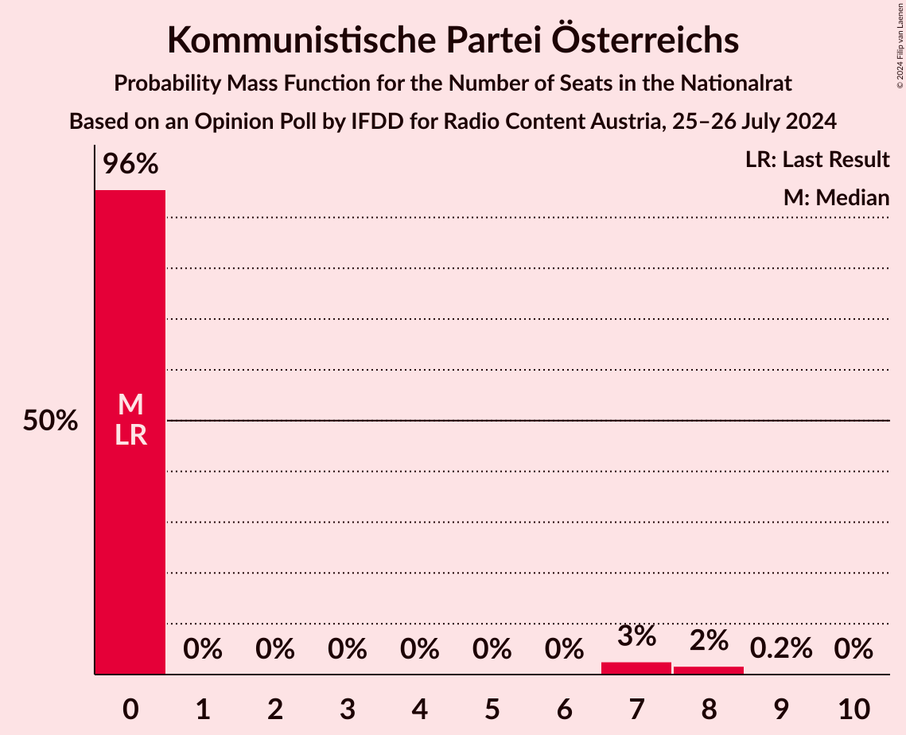

| Number of Seats | Probability | Accumulated | Special Marks |
|:---------------:|:-----------:|:-----------:|:-------------:|
| 0 | 96% | 100% | Last Result, Median |
| 1 | 0% | 4% |  |
| 2 | 0% | 4% |  |
| 3 | 0% | 4% |  |
| 4 | 0% | 4% |  |
| 5 | 0% | 4% |  |
| 6 | 0% | 4% |  |
| 7 | 3% | 4% |  |
| 8 | 2% | 2% |  |
| 9 | 0.2% | 0.2% |  |
| 10 | 0% | 0% |  |

## Coalitions

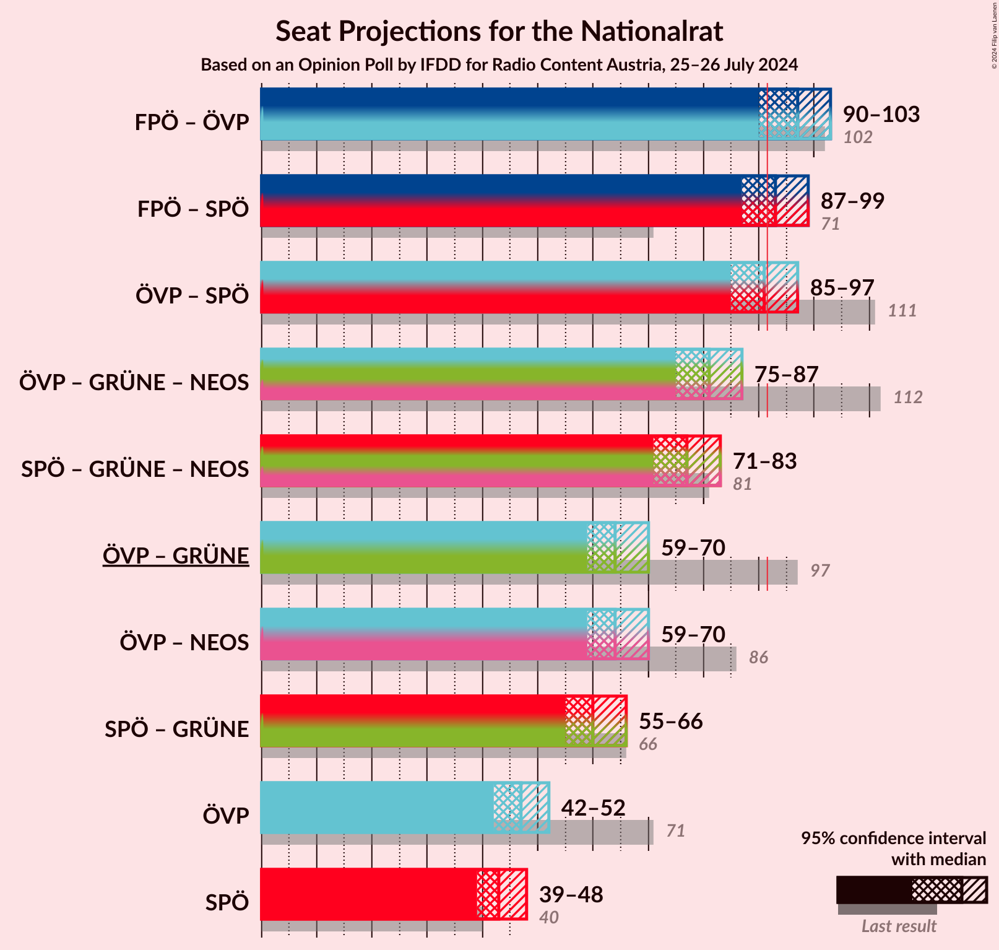

### Confidence Intervals

| Coalition | Last Result | Median | Majority? | 80% Confidence Interval | 90% Confidence Interval | 95% Confidence Interval | 99% Confidence Interval |
|:---------:|:-----------:|:------:|:---------:|:-----------------------:|:-----------------------:|:-----------------------:|:-----------------------:|
| Freiheitliche Partei Österreichs – Österreichische Volkspartei | 102 | 97 | 95% | 93–100 | 92–102 | 90–103 | 88–105 |
| Freiheitliche Partei Österreichs – Sozialdemokratische Partei Österreichs | 71 | 93 | 67% | 89–96 | 88–98 | 87–99 | 85–101 |
| Österreichische Volkspartei – Sozialdemokratische Partei Österreichs | 111 | 91 | 41% | 87–95 | 86–96 | 85–97 | 83–100 |
| Österreichische Volkspartei – Die Grünen–Die Grüne Alternative – NEOS–Das Neue Österreich und Liberales Forum | 112 | 81 | 0.1% | 77–85 | 76–86 | 75–87 | 73–90 |
| Sozialdemokratische Partei Österreichs – Die Grünen–Die Grüne Alternative – NEOS–Das Neue Österreich und Liberales Forum | 81 | 77 | 0% | 73–81 | 72–82 | 71–83 | 70–86 |
| Österreichische Volkspartei – Die Grünen–Die Grüne Alternative | 97 | 64 | 0% | 60–68 | 60–69 | 59–70 | 57–72 |
| Österreichische Volkspartei – NEOS–Das Neue Österreich und Liberales Forum | 86 | 64 | 0% | 61–68 | 60–69 | 59–70 | 57–72 |
| Sozialdemokratische Partei Österreichs – Die Grünen–Die Grüne Alternative | 66 | 60 | 0% | 57–64 | 56–65 | 55–66 | 53–68 |
| Österreichische Volkspartei | 71 | 47 | 0% | 44–51 | 43–52 | 42–52 | 41–54 |
| Sozialdemokratische Partei Österreichs | 40 | 43 | 0% | 40–47 | 39–48 | 39–48 | 37–50 |

### Freiheitliche Partei Österreichs – Österreichische Volkspartei

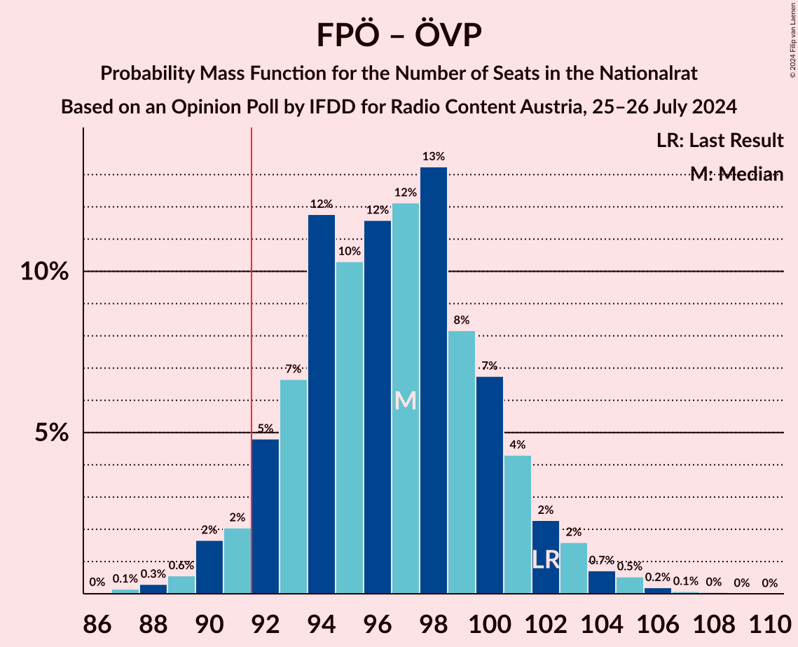

| Number of Seats | Probability | Accumulated | Special Marks |
|:---------------:|:-----------:|:-----------:|:-------------:|
| 86 | 0% | 100% |  |
| 87 | 0.1% | 99.9% |  |
| 88 | 0.3% | 99.8% |  |
| 89 | 0.6% | 99.5% |  |
| 90 | 2% | 98.9% |  |
| 91 | 2% | 97% |  |
| 92 | 5% | 95% | Majority |
| 93 | 7% | 90% |  |
| 94 | 12% | 84% |  |
| 95 | 10% | 72% |  |
| 96 | 12% | 62% | Median |
| 97 | 12% | 50% |  |
| 98 | 13% | 38% |  |
| 99 | 8% | 25% |  |
| 100 | 7% | 17% |  |
| 101 | 4% | 10% |  |
| 102 | 2% | 5% | Last Result |
| 103 | 2% | 3% |  |
| 104 | 0.7% | 2% |  |
| 105 | 0.5% | 0.9% |  |
| 106 | 0.2% | 0.3% |  |
| 107 | 0.1% | 0.2% |  |
| 108 | 0% | 0.1% |  |
| 109 | 0% | 0% |  |

### Freiheitliche Partei Österreichs – Sozialdemokratische Partei Österreichs

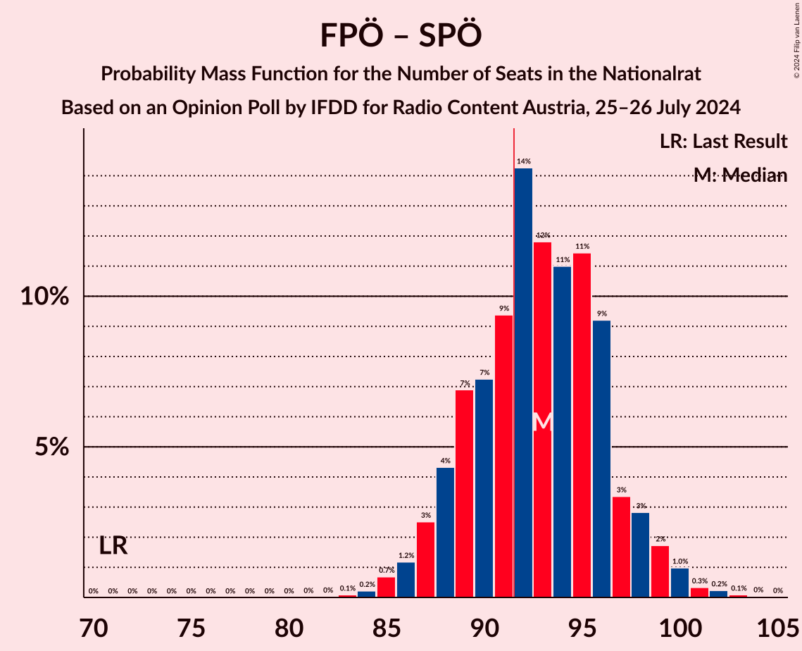

| Number of Seats | Probability | Accumulated | Special Marks |
|:---------------:|:-----------:|:-----------:|:-------------:|
| 71 | 0% | 100% | Last Result |
| 72 | 0% | 100% |  |
| 73 | 0% | 100% |  |
| 74 | 0% | 100% |  |
| 75 | 0% | 100% |  |
| 76 | 0% | 100% |  |
| 77 | 0% | 100% |  |
| 78 | 0% | 100% |  |
| 79 | 0% | 100% |  |
| 80 | 0% | 100% |  |
| 81 | 0% | 100% |  |
| 82 | 0% | 100% |  |
| 83 | 0.1% | 99.9% |  |
| 84 | 0.2% | 99.9% |  |
| 85 | 0.7% | 99.6% |  |
| 86 | 1.2% | 98.9% |  |
| 87 | 3% | 98% |  |
| 88 | 4% | 95% |  |
| 89 | 7% | 91% |  |
| 90 | 7% | 84% |  |
| 91 | 9% | 77% |  |
| 92 | 14% | 67% | Median, Majority |
| 93 | 12% | 53% |  |
| 94 | 11% | 41% |  |
| 95 | 11% | 30% |  |
| 96 | 9% | 19% |  |
| 97 | 3% | 10% |  |
| 98 | 3% | 6% |  |
| 99 | 2% | 3% |  |
| 100 | 1.0% | 2% |  |
| 101 | 0.3% | 0.7% |  |
| 102 | 0.2% | 0.4% |  |
| 103 | 0.1% | 0.2% |  |
| 104 | 0% | 0.1% |  |
| 105 | 0% | 0% |  |

### Österreichische Volkspartei – Sozialdemokratische Partei Österreichs

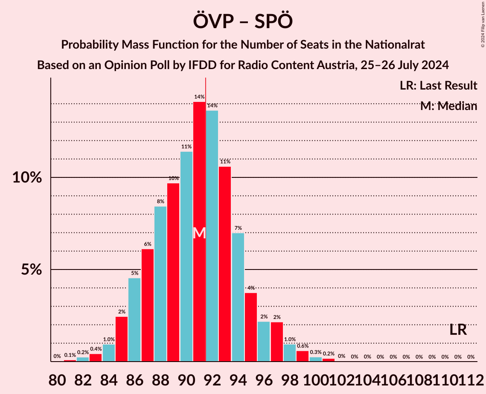

| Number of Seats | Probability | Accumulated | Special Marks |
|:---------------:|:-----------:|:-----------:|:-------------:|
| 80 | 0% | 100% |  |
| 81 | 0.1% | 99.9% |  |
| 82 | 0.2% | 99.8% |  |
| 83 | 0.4% | 99.6% |  |
| 84 | 1.0% | 99.2% |  |
| 85 | 2% | 98% |  |
| 86 | 5% | 96% |  |
| 87 | 6% | 91% |  |
| 88 | 8% | 85% |  |
| 89 | 10% | 77% |  |
| 90 | 11% | 67% | Median |
| 91 | 14% | 56% |  |
| 92 | 14% | 41% | Majority |
| 93 | 11% | 28% |  |
| 94 | 7% | 17% |  |
| 95 | 4% | 10% |  |
| 96 | 2% | 6% |  |
| 97 | 2% | 4% |  |
| 98 | 1.0% | 2% |  |
| 99 | 0.6% | 1.1% |  |
| 100 | 0.3% | 0.5% |  |
| 101 | 0.2% | 0.3% |  |
| 102 | 0% | 0.1% |  |
| 103 | 0% | 0% |  |
| 104 | 0% | 0% |  |
| 105 | 0% | 0% |  |
| 106 | 0% | 0% |  |
| 107 | 0% | 0% |  |
| 108 | 0% | 0% |  |
| 109 | 0% | 0% |  |
| 110 | 0% | 0% |  |
| 111 | 0% | 0% | Last Result |

### Österreichische Volkspartei – Die Grünen–Die Grüne Alternative – NEOS–Das Neue Österreich und Liberales Forum

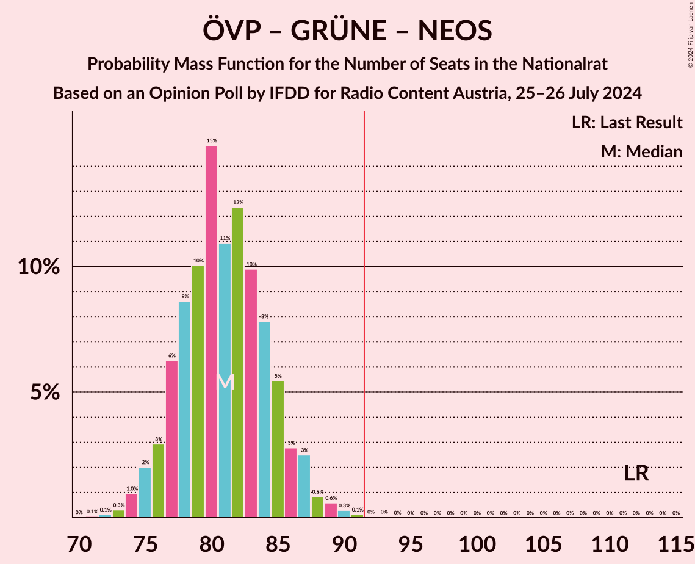

| Number of Seats | Probability | Accumulated | Special Marks |
|:---------------:|:-----------:|:-----------:|:-------------:|
| 71 | 0.1% | 100% |  |
| 72 | 0.1% | 99.9% |  |
| 73 | 0.3% | 99.8% |  |
| 74 | 1.0% | 99.5% |  |
| 75 | 2% | 98.5% |  |
| 76 | 3% | 97% |  |
| 77 | 6% | 94% |  |
| 78 | 9% | 87% |  |
| 79 | 10% | 79% |  |
| 80 | 15% | 69% |  |
| 81 | 11% | 54% | Median |
| 82 | 12% | 43% |  |
| 83 | 10% | 30% |  |
| 84 | 8% | 21% |  |
| 85 | 5% | 13% |  |
| 86 | 3% | 7% |  |
| 87 | 3% | 4% |  |
| 88 | 0.8% | 2% |  |
| 89 | 0.6% | 1.1% |  |
| 90 | 0.3% | 0.5% |  |
| 91 | 0.1% | 0.2% |  |
| 92 | 0% | 0.1% | Majority |
| 93 | 0% | 0.1% |  |
| 94 | 0% | 0% |  |
| 95 | 0% | 0% |  |
| 96 | 0% | 0% |  |
| 97 | 0% | 0% |  |
| 98 | 0% | 0% |  |
| 99 | 0% | 0% |  |
| 100 | 0% | 0% |  |
| 101 | 0% | 0% |  |
| 102 | 0% | 0% |  |
| 103 | 0% | 0% |  |
| 104 | 0% | 0% |  |
| 105 | 0% | 0% |  |
| 106 | 0% | 0% |  |
| 107 | 0% | 0% |  |
| 108 | 0% | 0% |  |
| 109 | 0% | 0% |  |
| 110 | 0% | 0% |  |
| 111 | 0% | 0% |  |
| 112 | 0% | 0% | Last Result |

### Sozialdemokratische Partei Österreichs – Die Grünen–Die Grüne Alternative – NEOS–Das Neue Österreich und Liberales Forum

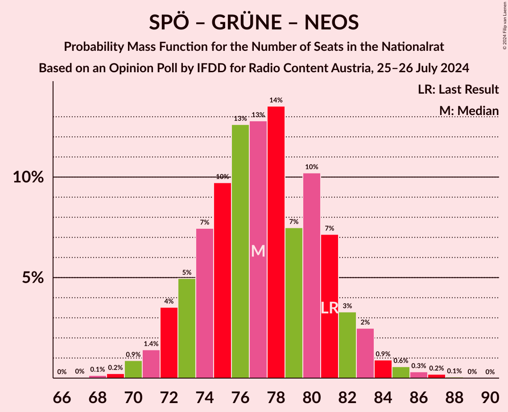

| Number of Seats | Probability | Accumulated | Special Marks |
|:---------------:|:-----------:|:-----------:|:-------------:|
| 67 | 0% | 100% |  |
| 68 | 0.1% | 99.9% |  |
| 69 | 0.2% | 99.8% |  |
| 70 | 0.9% | 99.6% |  |
| 71 | 1.4% | 98.7% |  |
| 72 | 4% | 97% |  |
| 73 | 5% | 94% |  |
| 74 | 7% | 89% |  |
| 75 | 10% | 81% |  |
| 76 | 13% | 72% |  |
| 77 | 13% | 59% | Median |
| 78 | 14% | 46% |  |
| 79 | 7% | 33% |  |
| 80 | 10% | 25% |  |
| 81 | 7% | 15% | Last Result |
| 82 | 3% | 8% |  |
| 83 | 2% | 5% |  |
| 84 | 0.9% | 2% |  |
| 85 | 0.6% | 1.2% |  |
| 86 | 0.3% | 0.6% |  |
| 87 | 0.2% | 0.3% |  |
| 88 | 0.1% | 0.1% |  |
| 89 | 0% | 0% |  |

### Österreichische Volkspartei – Die Grünen–Die Grüne Alternative

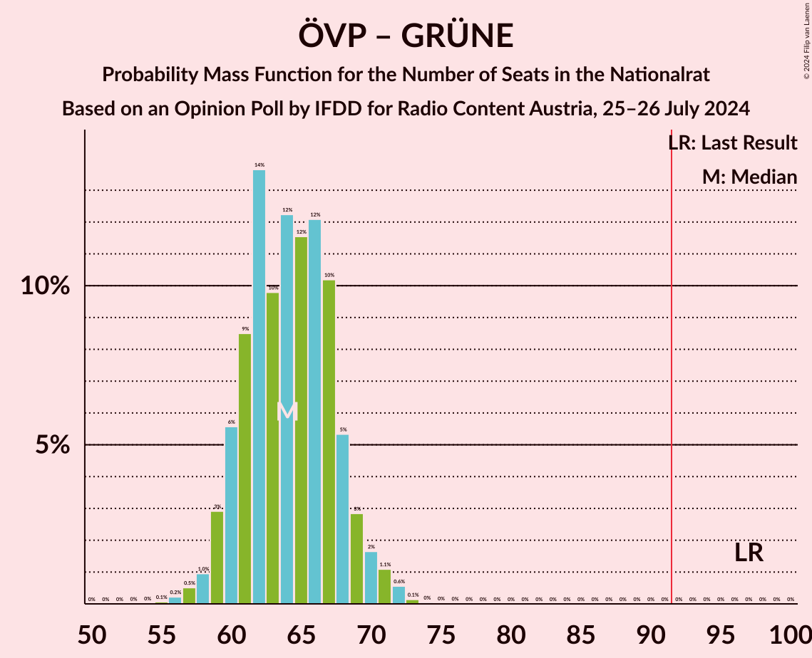

| Number of Seats | Probability | Accumulated | Special Marks |
|:---------------:|:-----------:|:-----------:|:-------------:|
| 55 | 0.1% | 100% |  |
| 56 | 0.2% | 99.9% |  |
| 57 | 0.5% | 99.7% |  |
| 58 | 1.0% | 99.2% |  |
| 59 | 3% | 98% |  |
| 60 | 6% | 95% |  |
| 61 | 9% | 90% |  |
| 62 | 14% | 81% |  |
| 63 | 10% | 68% |  |
| 64 | 12% | 58% | Median |
| 65 | 12% | 46% |  |
| 66 | 12% | 34% |  |
| 67 | 10% | 22% |  |
| 68 | 5% | 12% |  |
| 69 | 3% | 6% |  |
| 70 | 2% | 4% |  |
| 71 | 1.1% | 2% |  |
| 72 | 0.6% | 0.8% |  |
| 73 | 0.1% | 0.2% |  |
| 74 | 0% | 0.1% |  |
| 75 | 0% | 0% |  |
| 76 | 0% | 0% |  |
| 77 | 0% | 0% |  |
| 78 | 0% | 0% |  |
| 79 | 0% | 0% |  |
| 80 | 0% | 0% |  |
| 81 | 0% | 0% |  |
| 82 | 0% | 0% |  |
| 83 | 0% | 0% |  |
| 84 | 0% | 0% |  |
| 85 | 0% | 0% |  |
| 86 | 0% | 0% |  |
| 87 | 0% | 0% |  |
| 88 | 0% | 0% |  |
| 89 | 0% | 0% |  |
| 90 | 0% | 0% |  |
| 91 | 0% | 0% |  |
| 92 | 0% | 0% | Majority |
| 93 | 0% | 0% |  |
| 94 | 0% | 0% |  |
| 95 | 0% | 0% |  |
| 96 | 0% | 0% |  |
| 97 | 0% | 0% | Last Result |

### Österreichische Volkspartei – NEOS–Das Neue Österreich und Liberales Forum

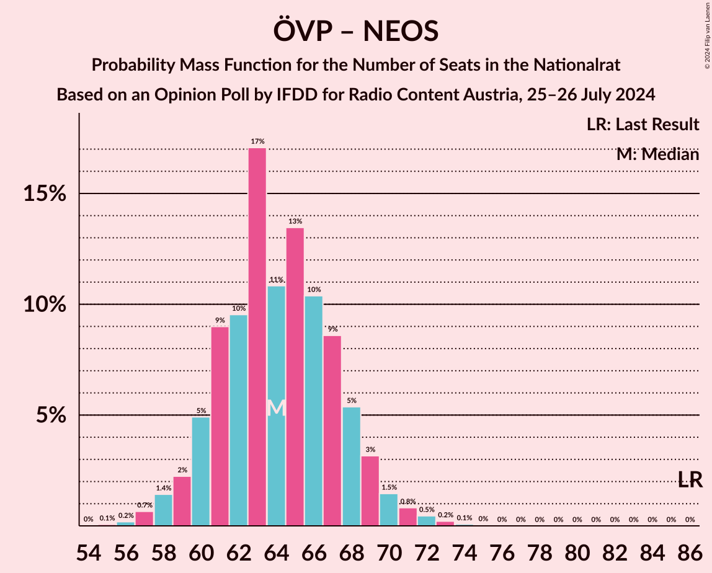

| Number of Seats | Probability | Accumulated | Special Marks |
|:---------------:|:-----------:|:-----------:|:-------------:|
| 55 | 0.1% | 100% |  |
| 56 | 0.2% | 99.9% |  |
| 57 | 0.7% | 99.7% |  |
| 58 | 1.4% | 99.1% |  |
| 59 | 2% | 98% |  |
| 60 | 5% | 95% |  |
| 61 | 9% | 90% |  |
| 62 | 10% | 81% |  |
| 63 | 17% | 72% |  |
| 64 | 11% | 55% | Median |
| 65 | 13% | 44% |  |
| 66 | 10% | 31% |  |
| 67 | 9% | 20% |  |
| 68 | 5% | 12% |  |
| 69 | 3% | 6% |  |
| 70 | 1.5% | 3% |  |
| 71 | 0.8% | 2% |  |
| 72 | 0.5% | 0.8% |  |
| 73 | 0.2% | 0.3% |  |
| 74 | 0.1% | 0.1% |  |
| 75 | 0% | 0.1% |  |
| 76 | 0% | 0% |  |
| 77 | 0% | 0% |  |
| 78 | 0% | 0% |  |
| 79 | 0% | 0% |  |
| 80 | 0% | 0% |  |
| 81 | 0% | 0% |  |
| 82 | 0% | 0% |  |
| 83 | 0% | 0% |  |
| 84 | 0% | 0% |  |
| 85 | 0% | 0% |  |
| 86 | 0% | 0% | Last Result |

### Sozialdemokratische Partei Österreichs – Die Grünen–Die Grüne Alternative

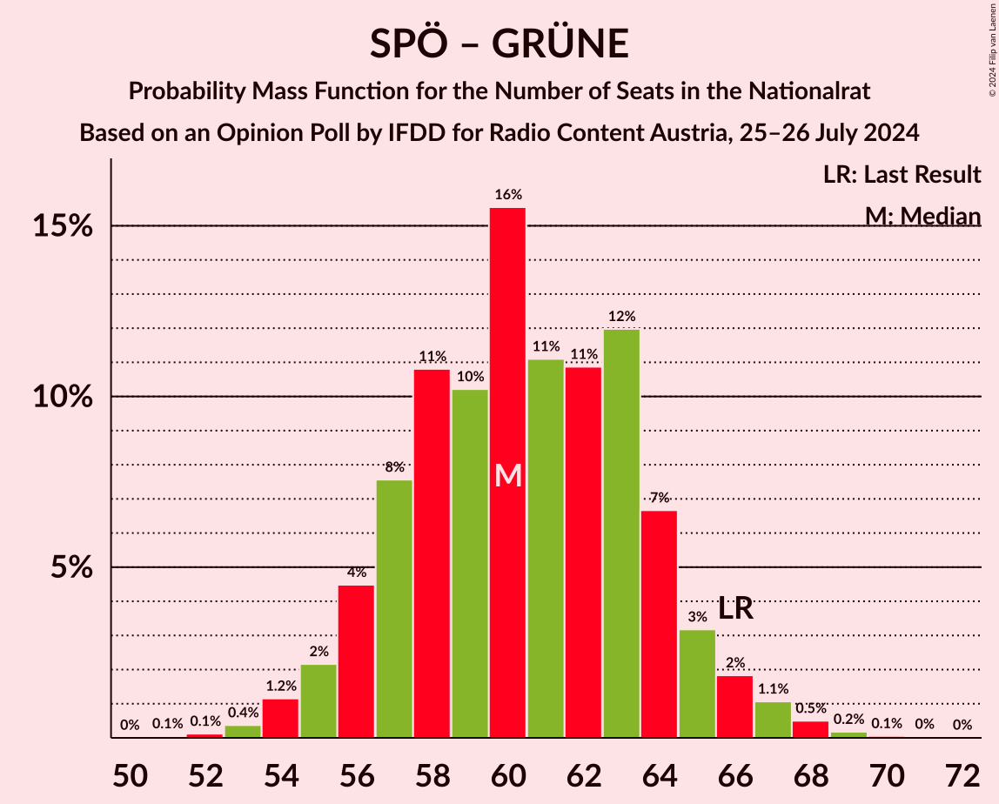

| Number of Seats | Probability | Accumulated | Special Marks |
|:---------------:|:-----------:|:-----------:|:-------------:|
| 51 | 0.1% | 100% |  |
| 52 | 0.1% | 99.9% |  |
| 53 | 0.4% | 99.8% |  |
| 54 | 1.2% | 99.4% |  |
| 55 | 2% | 98% |  |
| 56 | 4% | 96% |  |
| 57 | 8% | 92% |  |
| 58 | 11% | 84% |  |
| 59 | 10% | 73% |  |
| 60 | 16% | 63% | Median |
| 61 | 11% | 47% |  |
| 62 | 11% | 36% |  |
| 63 | 12% | 26% |  |
| 64 | 7% | 14% |  |
| 65 | 3% | 7% |  |
| 66 | 2% | 4% | Last Result |
| 67 | 1.1% | 2% |  |
| 68 | 0.5% | 0.8% |  |
| 69 | 0.2% | 0.3% |  |
| 70 | 0.1% | 0.1% |  |
| 71 | 0% | 0.1% |  |
| 72 | 0% | 0% |  |

### Österreichische Volkspartei

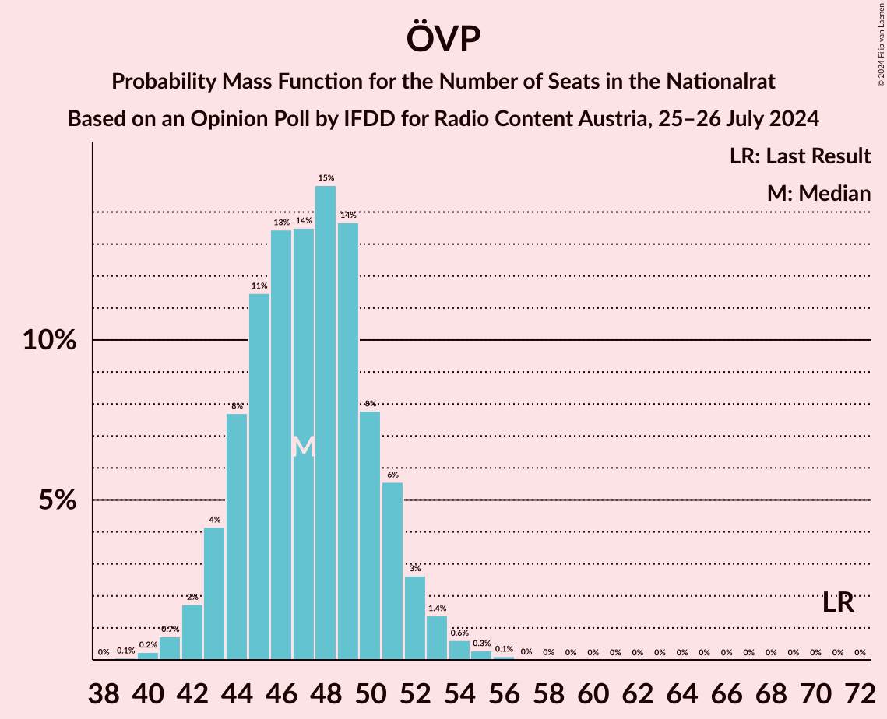

| Number of Seats | Probability | Accumulated | Special Marks |
|:---------------:|:-----------:|:-----------:|:-------------:|
| 39 | 0.1% | 100% |  |
| 40 | 0.2% | 99.9% |  |
| 41 | 0.7% | 99.7% |  |
| 42 | 2% | 98.9% |  |
| 43 | 4% | 97% |  |
| 44 | 8% | 93% |  |
| 45 | 11% | 85% |  |
| 46 | 13% | 74% |  |
| 47 | 14% | 60% | Median |
| 48 | 15% | 47% |  |
| 49 | 14% | 32% |  |
| 50 | 8% | 18% |  |
| 51 | 6% | 11% |  |
| 52 | 3% | 5% |  |
| 53 | 1.4% | 2% |  |
| 54 | 0.6% | 1.1% |  |
| 55 | 0.3% | 0.4% |  |
| 56 | 0.1% | 0.2% |  |
| 57 | 0% | 0% |  |
| 58 | 0% | 0% |  |
| 59 | 0% | 0% |  |
| 60 | 0% | 0% |  |
| 61 | 0% | 0% |  |
| 62 | 0% | 0% |  |
| 63 | 0% | 0% |  |
| 64 | 0% | 0% |  |
| 65 | 0% | 0% |  |
| 66 | 0% | 0% |  |
| 67 | 0% | 0% |  |
| 68 | 0% | 0% |  |
| 69 | 0% | 0% |  |
| 70 | 0% | 0% |  |
| 71 | 0% | 0% | Last Result |

### Sozialdemokratische Partei Österreichs

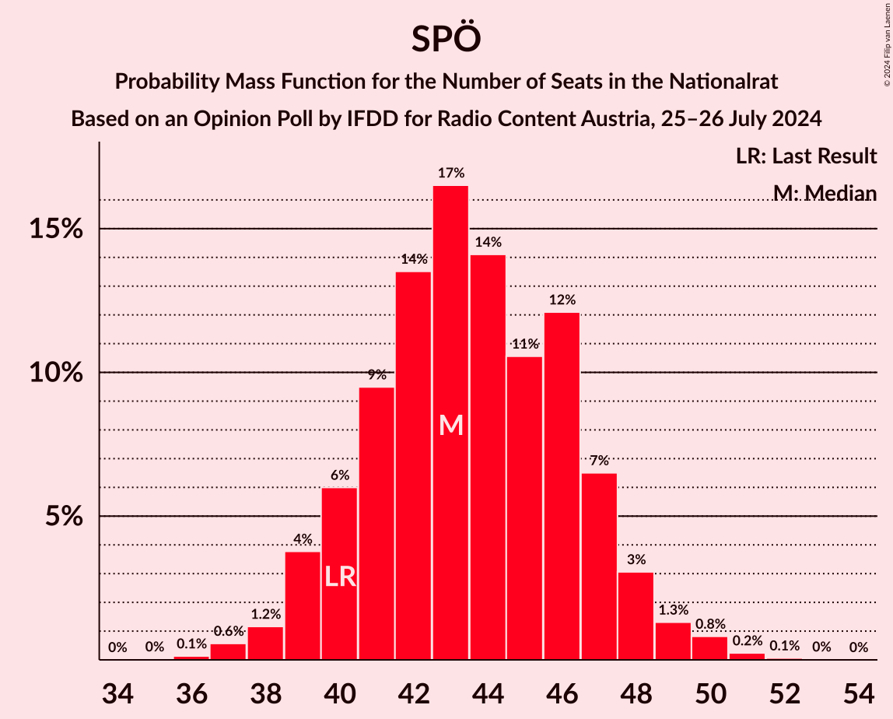

| Number of Seats | Probability | Accumulated | Special Marks |
|:---------------:|:-----------:|:-----------:|:-------------:|
| 36 | 0.1% | 100% |  |
| 37 | 0.6% | 99.8% |  |
| 38 | 1.2% | 99.3% |  |
| 39 | 4% | 98% |  |
| 40 | 6% | 94% | Last Result |
| 41 | 9% | 88% |  |
| 42 | 14% | 79% |  |
| 43 | 17% | 65% | Median |
| 44 | 14% | 49% |  |
| 45 | 11% | 35% |  |
| 46 | 12% | 24% |  |
| 47 | 7% | 12% |  |
| 48 | 3% | 6% |  |
| 49 | 1.3% | 2% |  |
| 50 | 0.8% | 1.2% |  |
| 51 | 0.2% | 0.3% |  |
| 52 | 0.1% | 0.1% |  |
| 53 | 0% | 0% |  |

## Technical Information

### Opinion Poll

+ **Polling firm:** IFDD
+ **Commissioner(s):** Radio Content Austria
+ **Fieldwork period:** 25–26 July 2024

### Calculations

+ **Sample size:** 1100
+ **Simulations done:** 1,048,576
+ **Error estimate:** 1.33%

