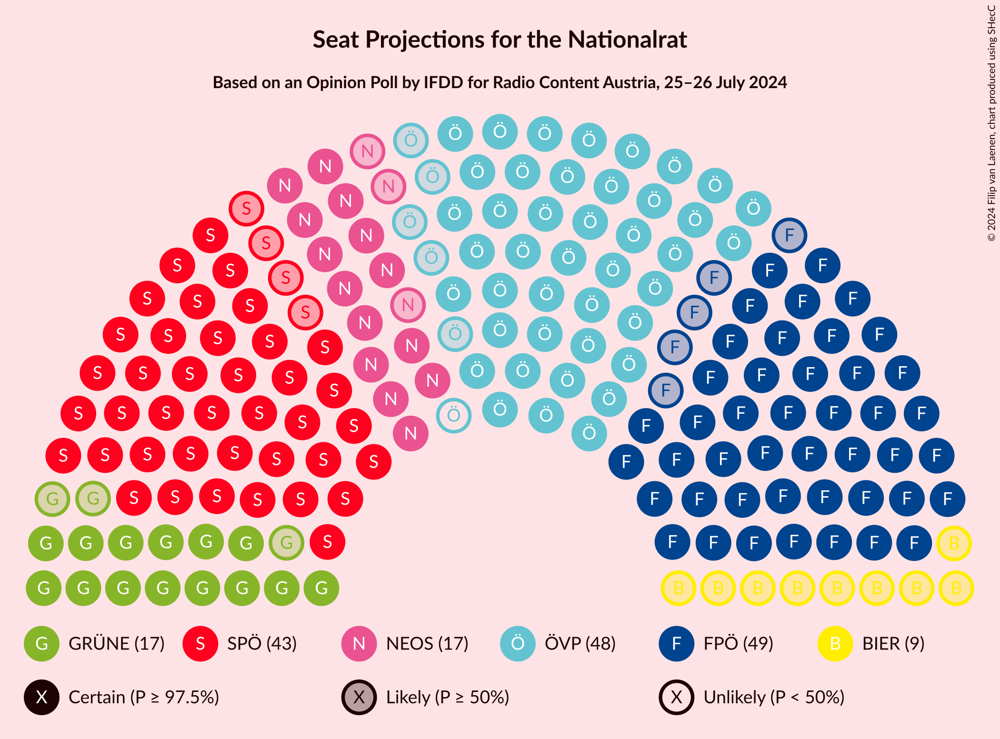

# Opinion Poll by IFDD for Radio Content Austria, 25–26 July 2024

<a href="#voting-intentions">Voting Intentions</a> | <a href="#seats">Seats</a> | <a href="#coalitions">Coalitions</a> | <a href="#technical-information">Technical Information</a>

## Voting Intentions

### Confidence Intervals

| Party | Last Result | Poll Result | 80% Confidence Interval | 90% Confidence Interval | 95% Confidence Interval | 99% Confidence Interval |
|:-----:|:-----------:|:-----------:|:-----------------------:|:-----------------------:|:-----------------------:|:-----------------------:|
| Freiheitliche Partei Österreichs | 16.2% | 25.9% | 24.3–27.7% |23.8–28.2% |23.4–28.6% |22.6–29.4% |
| Österreichische Volkspartei | 37.5% | 24.9% | 23.3–26.6% |22.8–27.1% |22.4–27.6% |21.7–28.4% |
| Sozialdemokratische Partei Österreichs | 21.2% | 22.9% | 21.3–24.6% |20.9–25.1% |20.5–25.5% |19.8–26.3% |
| Die Grünen–Die Grüne Alternative | 13.9% | 9.0% | 8.0–10.2% |7.7–10.5% |7.4–10.9% |7.0–11.4% |
| NEOS–Das Neue Österreich und Liberales Forum | 8.1% | 9.0% | 8.0–10.2% |7.7–10.5% |7.4–10.9% |7.0–11.4% |
| Bierpartei | 0.0% | 5.0% | 4.3–6.0% |4.0–6.2% |3.9–6.5% |3.5–7.0% |
| Kommunistische Partei Österreichs | N/A | 3.0% | 2.4–3.8% |2.3–4.0% |2.1–4.2% |1.9–4.6% |

*Note:* The poll result column reflects the actual value used in the calculations. Published results may vary slightly, and in addition be rounded to fewer digits.

## Seats

### Confidence Intervals

| Party | Last Result | Median | 80% Confidence Interval | 90% Confidence Interval | 95% Confidence Interval | 99% Confidence Interval |
|:-----:|:-----------:|:------:|:-----------------------:|:-----------------------:|:-----------------------:|:-----------------------:|
| <a href="#freiheitliche-partei-österreichs">Freiheitliche Partei Österreichs</a> | 31 | 49 | 46–53 |45–54 |44–54 |43–56 |
| <a href="#österreichische-volkspartei">Österreichische Volkspartei</a> | 71 | 47 | 44–51 |43–52 |42–52 |41–54 |
| <a href="#sozialdemokratische-partei-österreichs">Sozialdemokratische Partei Österreichs</a> | 40 | 43 | 40–47 |39–48 |39–48 |37–50 |
| <a href="#die-grünen–die-grüne-alternative">Die Grünen–Die Grüne Alternative</a> | 26 | 17 | 15–19 |14–20 |14–20 |13–21 |
| <a href="#neos–das-neue-österreich-und-liberales-forum">NEOS–Das Neue Österreich und Liberales Forum</a> | 15 | 17 | 15–19 |14–20 |14–20 |13–21 |
| <a href="#bierpartei">Bierpartei</a> | 0 | 9 | 8–11 |7–11 |0–12 |0–13 |
| <a href="#kommunistische-partei-österreichs">Kommunistische Partei Österreichs</a> | N/A | 0 | 0 |0 |0–7 |0–8 |

