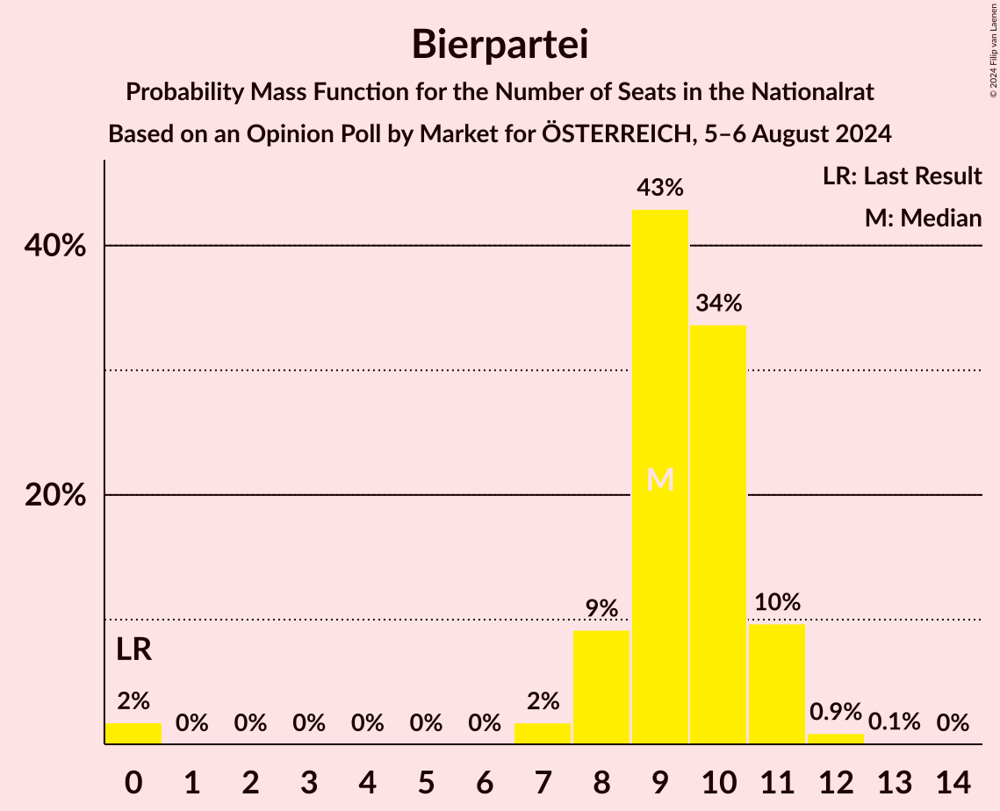
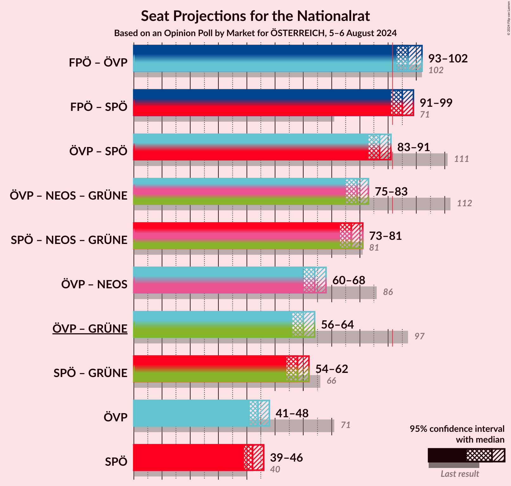
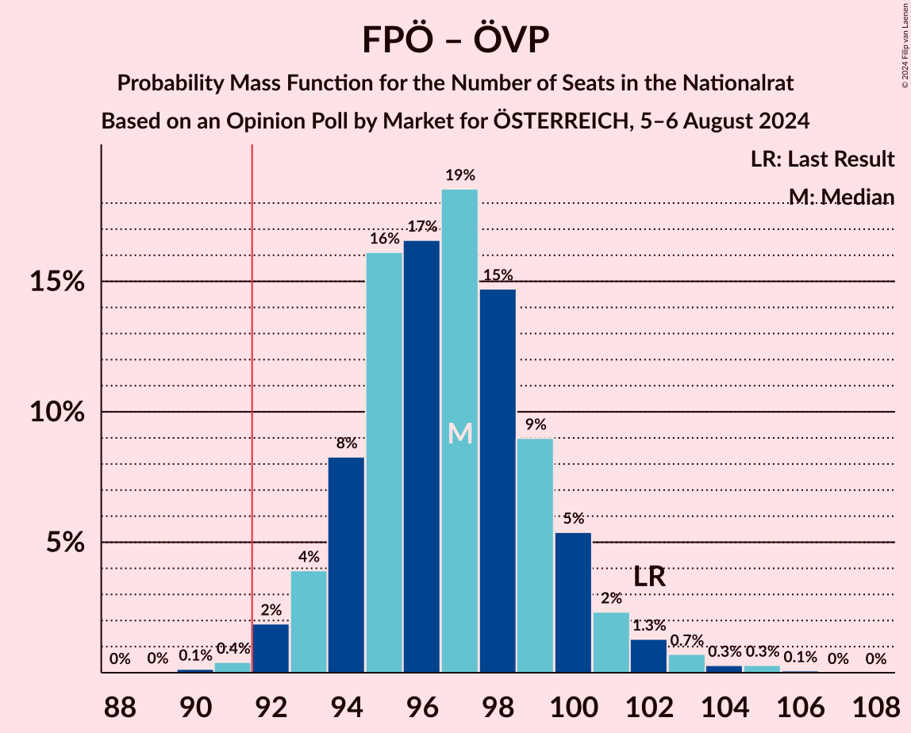
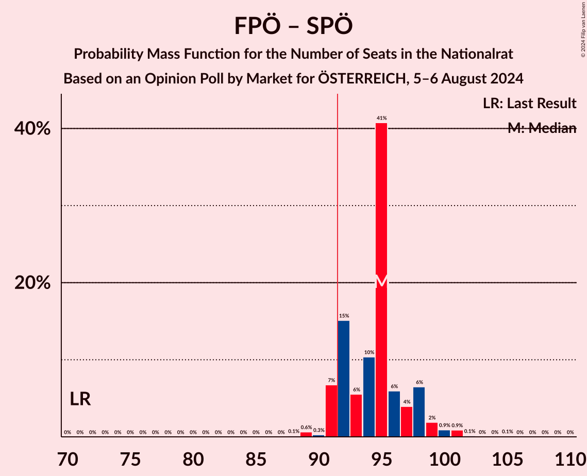
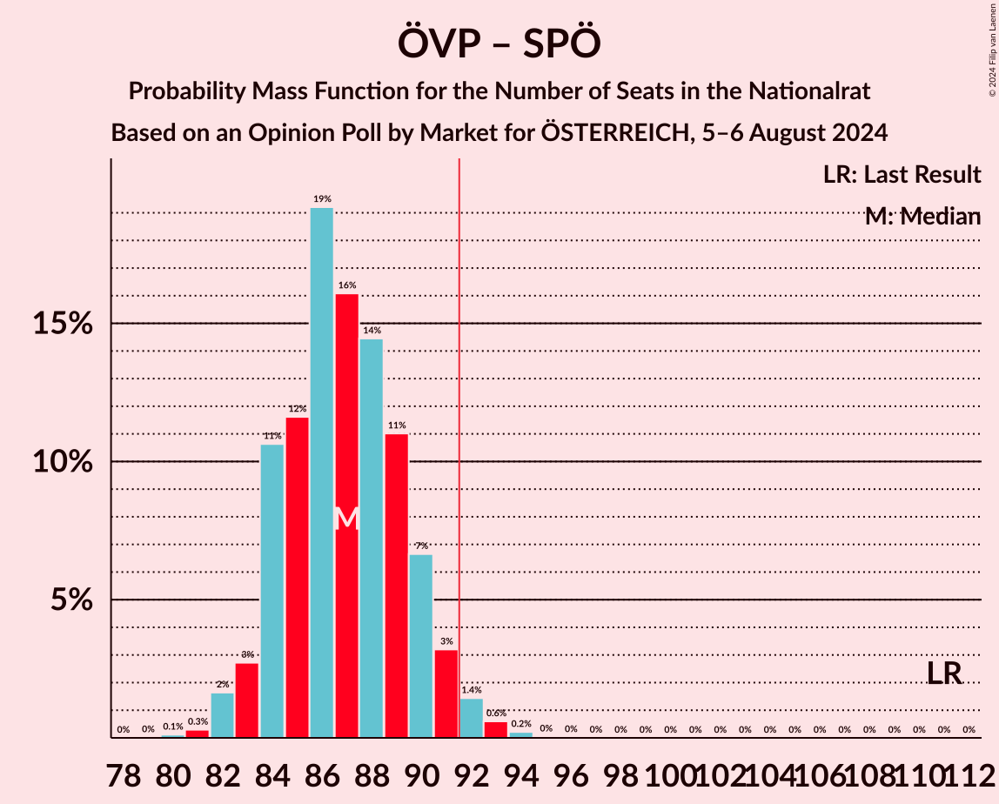
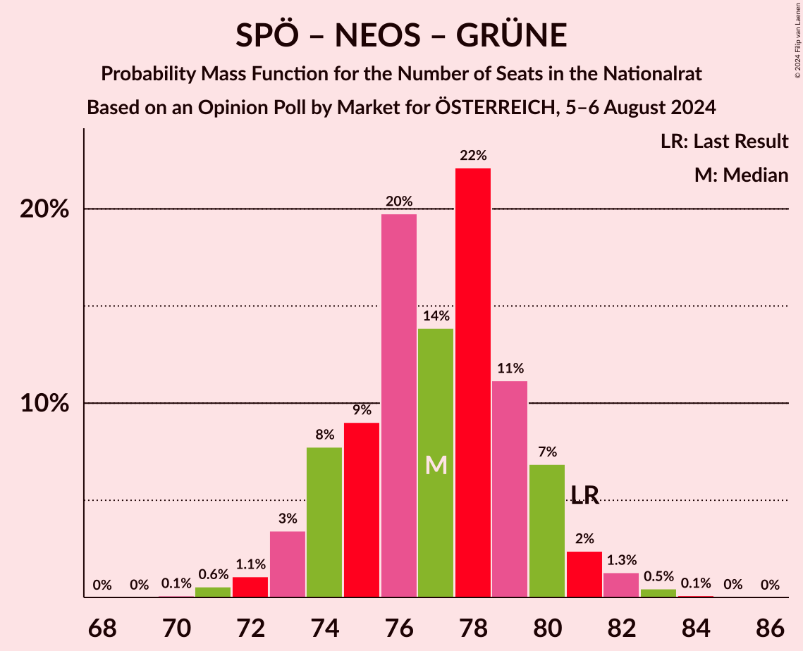

# Opinion Poll by Market for ÖSTERREICH, 5–6 August 2024

<a href="#voting-intentions">Voting Intentions</a> | <a href="#seats">Seats</a> | <a href="#coalitions">Coalitions</a> | <a href="#technical-information">Technical Information</a>

## Voting Intentions

### Confidence Intervals

| Party | Last Result | Poll Result | 80% Confidence Interval | 90% Confidence Interval | 95% Confidence Interval | 99% Confidence Interval |
|:-----:|:-----------:|:-----------:|:-----------------------:|:-----------------------:|:-----------------------:|:-----------------------:|
| Freiheitliche Partei Österreichs | 16.2% | 27.0% | 25.7–28.3% |25.4–28.7% |25.1–29.0% |24.5–29.6% |
| Österreichische Volkspartei | 37.5% | 23.0% | 21.8–24.2% |21.5–24.6% |21.2–24.9% |20.7–25.5% |
| Sozialdemokratische Partei Österreichs | 21.2% | 22.0% | 20.8–23.2% |20.5–23.6% |20.2–23.9% |19.7–24.5% |
| NEOS–Das Neue Österreich und Liberales Forum | 8.1% | 10.0% | 9.2–10.9% |8.9–11.2% |8.7–11.4% |8.4–11.9% |
| Die Grünen–Die Grüne Alternative | 13.9% | 8.0% | 7.3–8.8% |7.1–9.1% |6.9–9.3% |6.6–9.7% |
| Bierpartei | 0.0% | 5.0% | 4.4–5.7% |4.3–5.9% |4.1–6.1% |3.9–6.4% |
| Kommunistische Partei Österreichs | 0.7% | 2.0% | 1.6–2.5% |1.6–2.6% |1.5–2.7% |1.3–3.0% |
| Liste Madeleine Petrovic | 0.0% | 1.0% | 0.8–1.4% |0.7–1.5% |0.6–1.5% |0.5–1.7% |

*Note:* The poll result column reflects the actual value used in the calculations. Published results may vary slightly, and in addition be rounded to fewer digits.

## Seats

### Confidence Intervals

| Party | Last Result | Median | 80% Confidence Interval | 90% Confidence Interval | 95% Confidence Interval | 99% Confidence Interval |
|:-----:|:-----------:|:------:|:-----------------------:|:-----------------------:|:-----------------------:|:-----------------------:|
| <a href="#freiheitliche-partei-österreichs">Freiheitliche Partei Österreichs</a> | 31 | 52 | 50–55 |49–55 |49–56 |47–57 |
| <a href="#österreichische-volkspartei">Österreichische Volkspartei</a> | 71 | 44 | 42–47 |42–48 |41–48 |40–50 |
| <a href="#sozialdemokratische-partei-österreichs">Sozialdemokratische Partei Österreichs</a> | 40 | 42 | 40–45 |39–45 |39–46 |38–47 |
| <a href="#neos–das-neue-österreich-und-liberales-forum">NEOS–Das Neue Österreich und Liberales Forum</a> | 15 | 20 | 18–21 |17–21 |17–22 |16–23 |
| <a href="#die-grünen–die-grüne-alternative">Die Grünen–Die Grüne Alternative</a> | 26 | 15 | 14–17 |13–17 |13–18 |12–18 |
| <a href="#bierpartei">Bierpartei</a> | 0 | 9 | 8–11 |8–11 |7–11 |0–12 |
| <a href="#kommunistische-partei-österreichs">Kommunistische Partei Österreichs</a> | 0 | 0 | 0 |0 |0 |0 |
| <a href="#liste-madeleine-petrovic">Liste Madeleine Petrovic</a> | 0 | 0 | 0 |0 |0 |0 |

### Freiheitliche Partei Österreichs

*For a full overview of the results for this party, see the [Freiheitliche Partei Österreichs](party-freiheitlicheparteiösterreichs.html) page.*

| Number of Seats | Probability | Accumulated | Special Marks |
|:---------------:|:-----------:|:-----------:|:-------------:|
| 31 | 0% | 100% | Last Result |
| 32 | 0% | 100% |  |
| 33 | 0% | 100% |  |
| 34 | 0% | 100% |  |
| 35 | 0% | 100% |  |
| 36 | 0% | 100% |  |
| 37 | 0% | 100% |  |
| 38 | 0% | 100% |  |
| 39 | 0% | 100% |  |
| 40 | 0% | 100% |  |
| 41 | 0% | 100% |  |
| 42 | 0% | 100% |  |
| 43 | 0% | 100% |  |
| 44 | 0% | 100% |  |
| 45 | 0% | 100% |  |
| 46 | 0.1% | 100% |  |
| 47 | 0.6% | 99.8% |  |
| 48 | 2% | 99.3% |  |
| 49 | 7% | 98% |  |
| 50 | 10% | 91% |  |
| 51 | 15% | 81% |  |
| 52 | 19% | 66% | Median |
| 53 | 26% | 47% |  |
| 54 | 10% | 21% |  |
| 55 | 6% | 10% |  |
| 56 | 3% | 5% |  |
| 57 | 1.3% | 2% |  |
| 58 | 0.3% | 0.4% |  |
| 59 | 0.1% | 0.1% |  |
| 60 | 0% | 0% |  |

### Österreichische Volkspartei

*For a full overview of the results for this party, see the [Österreichische Volkspartei](party-österreichischevolkspartei.html) page.*

| Number of Seats | Probability | Accumulated | Special Marks |
|:---------------:|:-----------:|:-----------:|:-------------:|
| 39 | 0.2% | 100% |  |
| 40 | 1.0% | 99.8% |  |
| 41 | 3% | 98.8% |  |
| 42 | 9% | 96% |  |
| 43 | 16% | 87% |  |
| 44 | 22% | 71% | Median |
| 45 | 21% | 49% |  |
| 46 | 12% | 28% |  |
| 47 | 9% | 15% |  |
| 48 | 4% | 6% |  |
| 49 | 2% | 2% |  |
| 50 | 0.4% | 0.6% |  |
| 51 | 0.1% | 0.1% |  |
| 52 | 0% | 0% |  |
| 53 | 0% | 0% |  |
| 54 | 0% | 0% |  |
| 55 | 0% | 0% |  |
| 56 | 0% | 0% |  |
| 57 | 0% | 0% |  |
| 58 | 0% | 0% |  |
| 59 | 0% | 0% |  |
| 60 | 0% | 0% |  |
| 61 | 0% | 0% |  |
| 62 | 0% | 0% |  |
| 63 | 0% | 0% |  |
| 64 | 0% | 0% |  |
| 65 | 0% | 0% |  |
| 66 | 0% | 0% |  |
| 67 | 0% | 0% |  |
| 68 | 0% | 0% |  |
| 69 | 0% | 0% |  |
| 70 | 0% | 0% |  |
| 71 | 0% | 0% | Last Result |

### Sozialdemokratische Partei Österreichs

*For a full overview of the results for this party, see the [Sozialdemokratische Partei Österreichs](party-sozialdemokratischeparteiösterreichs.html) page.*

| Number of Seats | Probability | Accumulated | Special Marks |
|:---------------:|:-----------:|:-----------:|:-------------:|
| 37 | 0.2% | 100% |  |
| 38 | 1.0% | 99.8% |  |
| 39 | 5% | 98.7% |  |
| 40 | 8% | 94% | Last Result |
| 41 | 14% | 86% |  |
| 42 | 29% | 72% | Median |
| 43 | 20% | 43% |  |
| 44 | 12% | 23% |  |
| 45 | 6% | 10% |  |
| 46 | 3% | 5% |  |
| 47 | 1.2% | 2% |  |
| 48 | 0.2% | 0.3% |  |
| 49 | 0.1% | 0.1% |  |
| 50 | 0% | 0% |  |

### NEOS–Das Neue Österreich und Liberales Forum

*For a full overview of the results for this party, see the [NEOS–Das Neue Österreich und Liberales Forum](party-neos–dasneueösterreichundliberalesforum.html) page.*

| Number of Seats | Probability | Accumulated | Special Marks |
|:---------------:|:-----------:|:-----------:|:-------------:|
| 15 | 0.2% | 100% | Last Result |
| 16 | 2% | 99.7% |  |
| 17 | 6% | 98% |  |
| 18 | 13% | 92% |  |
| 19 | 28% | 79% |  |
| 20 | 32% | 51% | Median |
| 21 | 16% | 19% |  |
| 22 | 3% | 3% |  |
| 23 | 0.5% | 0.5% |  |
| 24 | 0% | 0% |  |

### Die Grünen–Die Grüne Alternative

*For a full overview of the results for this party, see the [Die Grünen–Die Grüne Alternative](party-diegrünen–diegrünealternative.html) page.*

| Number of Seats | Probability | Accumulated | Special Marks |
|:---------------:|:-----------:|:-----------:|:-------------:|
| 12 | 0.8% | 100% |  |
| 13 | 6% | 99.1% |  |
| 14 | 20% | 93% |  |
| 15 | 33% | 73% | Median |
| 16 | 27% | 40% |  |
| 17 | 10% | 14% |  |
| 18 | 3% | 3% |  |
| 19 | 0.4% | 0.4% |  |
| 20 | 0% | 0% |  |
| 21 | 0% | 0% |  |
| 22 | 0% | 0% |  |
| 23 | 0% | 0% |  |
| 24 | 0% | 0% |  |
| 25 | 0% | 0% |  |
| 26 | 0% | 0% | Last Result |

### Bierpartei

*For a full overview of the results for this party, see the [Bierpartei](party-bierpartei.html) page.*

| Number of Seats | Probability | Accumulated | Special Marks |
|:---------------:|:-----------:|:-----------:|:-------------:|
| 0 | 2% | 100% | Last Result |
| 1 | 0% | 98% |  |
| 2 | 0% | 98% |  |
| 3 | 0% | 98% |  |
| 4 | 0% | 98% |  |
| 5 | 0% | 98% |  |
| 6 | 0% | 98% |  |
| 7 | 2% | 98% |  |
| 8 | 9% | 96% |  |
| 9 | 43% | 87% | Median |
| 10 | 34% | 44% |  |
| 11 | 10% | 11% |  |
| 12 | 0.9% | 1.0% |  |
| 13 | 0.1% | 0.1% |  |
| 14 | 0% | 0% |  |

### Kommunistische Partei Österreichs

*For a full overview of the results for this party, see the [Kommunistische Partei Österreichs](party-kommunistischeparteiösterreichs.html) page.*

| Number of Seats | Probability | Accumulated | Special Marks |
|:---------------:|:-----------:|:-----------:|:-------------:|
| 0 | 100% | 100% | Last Result, Median |

### Liste Madeleine Petrovic

*For a full overview of the results for this party, see the [Liste Madeleine Petrovic](party-listemadeleinepetrovic.html) page.*

| Number of Seats | Probability | Accumulated | Special Marks |
|:---------------:|:-----------:|:-----------:|:-------------:|
| 0 | 100% | 100% | Last Result, Median |

## Coalitions

### Confidence Intervals

| Coalition | Last Result | Median | Majority? | 80% Confidence Interval | 90% Confidence Interval | 95% Confidence Interval | 99% Confidence Interval |
|:---------:|:-----------:|:------:|:---------:|:-----------------------:|:-----------------------:|:-----------------------:|:-----------------------:|
| Freiheitliche Partei Österreichs – Österreichische Volkspartei | 102 | 97 | 99.4% | 94–100 | 93–101 | 93–102 | 91–104 |
| Freiheitliche Partei Österreichs – Sozialdemokratische Partei Österreichs | 71 | 95 | 92% | 92–98 | 91–98 | 91–99 | 89–101 |
| Österreichische Volkspartei – Sozialdemokratische Partei Österreichs | 111 | 87 | 2% | 84–90 | 84–91 | 83–91 | 82–93 |
| Österreichische Volkspartei – NEOS–Das Neue Österreich und Liberales Forum – Die Grünen–Die Grüne Alternative | 112 | 79 | 0% | 77–82 | 76–83 | 75–83 | 73–84 |
| Sozialdemokratische Partei Österreichs – NEOS–Das Neue Österreich und Liberales Forum – Die Grünen–Die Grüne Alternative | 81 | 77 | 0% | 74–80 | 73–80 | 73–81 | 71–83 |
| Österreichische Volkspartei – NEOS–Das Neue Österreich und Liberales Forum | 86 | 64 | 0% | 62–67 | 61–67 | 60–68 | 58–69 |
| Österreichische Volkspartei – Die Grünen–Die Grüne Alternative | 97 | 60 | 0% | 57–62 | 57–63 | 56–64 | 55–65 |
| Sozialdemokratische Partei Österreichs – Die Grünen–Die Grüne Alternative | 66 | 58 | 0% | 55–60 | 54–61 | 54–62 | 53–63 |
| Österreichische Volkspartei | 71 | 44 | 0% | 42–47 | 42–48 | 41–48 | 40–50 |
| Sozialdemokratische Partei Österreichs | 40 | 42 | 0% | 40–45 | 39–45 | 39–46 | 38–47 |

### Freiheitliche Partei Österreichs – Österreichische Volkspartei

| Number of Seats | Probability | Accumulated | Special Marks |
|:---------------:|:-----------:|:-----------:|:-------------:|
| 90 | 0.1% | 100% |  |
| 91 | 0.4% | 99.8% |  |
| 92 | 2% | 99.4% | Majority |
| 93 | 4% | 98% |  |
| 94 | 8% | 94% |  |
| 95 | 16% | 85% |  |
| 96 | 17% | 69% | Median |
| 97 | 19% | 53% |  |
| 98 | 15% | 34% |  |
| 99 | 9% | 19% |  |
| 100 | 5% | 10% |  |
| 101 | 2% | 5% |  |
| 102 | 1.3% | 3% | Last Result |
| 103 | 0.7% | 1.4% |  |
| 104 | 0.3% | 0.7% |  |
| 105 | 0.3% | 0.4% |  |
| 106 | 0.1% | 0.1% |  |
| 107 | 0% | 0% |  |

### Freiheitliche Partei Österreichs – Sozialdemokratische Partei Österreichs

| Number of Seats | Probability | Accumulated | Special Marks |
|:---------------:|:-----------:|:-----------:|:-------------:|
| 71 | 0% | 100% | Last Result |
| 72 | 0% | 100% |  |
| 73 | 0% | 100% |  |
| 74 | 0% | 100% |  |
| 75 | 0% | 100% |  |
| 76 | 0% | 100% |  |
| 77 | 0% | 100% |  |
| 78 | 0% | 100% |  |
| 79 | 0% | 100% |  |
| 80 | 0% | 100% |  |
| 81 | 0% | 100% |  |
| 82 | 0% | 100% |  |
| 83 | 0% | 100% |  |
| 84 | 0% | 100% |  |
| 85 | 0% | 100% |  |
| 86 | 0% | 100% |  |
| 87 | 0% | 100% |  |
| 88 | 0.1% | 100% |  |
| 89 | 0.6% | 99.8% |  |
| 90 | 0.3% | 99.2% |  |
| 91 | 7% | 98.9% |  |
| 92 | 15% | 92% | Majority |
| 93 | 6% | 77% |  |
| 94 | 10% | 72% | Median |
| 95 | 41% | 61% |  |
| 96 | 6% | 20% |  |
| 97 | 4% | 14% |  |
| 98 | 6% | 10% |  |
| 99 | 2% | 4% |  |
| 100 | 0.9% | 2% |  |
| 101 | 0.9% | 1.2% |  |
| 102 | 0.1% | 0.3% |  |
| 103 | 0% | 0.1% |  |
| 104 | 0% | 0.1% |  |
| 105 | 0.1% | 0.1% |  |
| 106 | 0% | 0% |  |

### Österreichische Volkspartei – Sozialdemokratische Partei Österreichs

| Number of Seats | Probability | Accumulated | Special Marks |
|:---------------:|:-----------:|:-----------:|:-------------:|
| 80 | 0.1% | 100% |  |
| 81 | 0.3% | 99.9% |  |
| 82 | 2% | 99.6% |  |
| 83 | 3% | 98% |  |
| 84 | 11% | 95% |  |
| 85 | 12% | 85% |  |
| 86 | 19% | 73% | Median |
| 87 | 16% | 54% |  |
| 88 | 14% | 38% |  |
| 89 | 11% | 23% |  |
| 90 | 7% | 12% |  |
| 91 | 3% | 6% |  |
| 92 | 1.4% | 2% | Majority |
| 93 | 0.6% | 0.9% |  |
| 94 | 0.2% | 0.3% |  |
| 95 | 0% | 0.1% |  |
| 96 | 0% | 0% |  |
| 97 | 0% | 0% |  |
| 98 | 0% | 0% |  |
| 99 | 0% | 0% |  |
| 100 | 0% | 0% |  |
| 101 | 0% | 0% |  |
| 102 | 0% | 0% |  |
| 103 | 0% | 0% |  |
| 104 | 0% | 0% |  |
| 105 | 0% | 0% |  |
| 106 | 0% | 0% |  |
| 107 | 0% | 0% |  |
| 108 | 0% | 0% |  |
| 109 | 0% | 0% |  |
| 110 | 0% | 0% |  |
| 111 | 0% | 0% | Last Result |

### Österreichische Volkspartei – NEOS–Das Neue Österreich und Liberales Forum – Die Grünen–Die Grüne Alternative

| Number of Seats | Probability | Accumulated | Special Marks |
|:---------------:|:-----------:|:-----------:|:-------------:|
| 72 | 0.2% | 100% |  |
| 73 | 0.5% | 99.7% |  |
| 74 | 1.5% | 99.2% |  |
| 75 | 2% | 98% |  |
| 76 | 5% | 96% |  |
| 77 | 6% | 91% |  |
| 78 | 18% | 84% |  |
| 79 | 27% | 66% | Median |
| 80 | 14% | 39% |  |
| 81 | 11% | 25% |  |
| 82 | 8% | 14% |  |
| 83 | 4% | 6% |  |
| 84 | 2% | 2% |  |
| 85 | 0.3% | 0.5% |  |
| 86 | 0.1% | 0.2% |  |
| 87 | 0.1% | 0.1% |  |
| 88 | 0% | 0% |  |
| 89 | 0% | 0% |  |
| 90 | 0% | 0% |  |
| 91 | 0% | 0% |  |
| 92 | 0% | 0% | Majority |
| 93 | 0% | 0% |  |
| 94 | 0% | 0% |  |
| 95 | 0% | 0% |  |
| 96 | 0% | 0% |  |
| 97 | 0% | 0% |  |
| 98 | 0% | 0% |  |
| 99 | 0% | 0% |  |
| 100 | 0% | 0% |  |
| 101 | 0% | 0% |  |
| 102 | 0% | 0% |  |
| 103 | 0% | 0% |  |
| 104 | 0% | 0% |  |
| 105 | 0% | 0% |  |
| 106 | 0% | 0% |  |
| 107 | 0% | 0% |  |
| 108 | 0% | 0% |  |
| 109 | 0% | 0% |  |
| 110 | 0% | 0% |  |
| 111 | 0% | 0% |  |
| 112 | 0% | 0% | Last Result |

### Sozialdemokratische Partei Österreichs – NEOS–Das Neue Österreich und Liberales Forum – Die Grünen–Die Grüne Alternative

| Number of Seats | Probability | Accumulated | Special Marks |
|:---------------:|:-----------:|:-----------:|:-------------:|
| 70 | 0.1% | 100% |  |
| 71 | 0.6% | 99.9% |  |
| 72 | 1.1% | 99.3% |  |
| 73 | 3% | 98% |  |
| 74 | 8% | 95% |  |
| 75 | 9% | 87% |  |
| 76 | 20% | 78% |  |
| 77 | 14% | 58% | Median |
| 78 | 22% | 44% |  |
| 79 | 11% | 22% |  |
| 80 | 7% | 11% |  |
| 81 | 2% | 4% | Last Result |
| 82 | 1.3% | 2% |  |
| 83 | 0.5% | 0.6% |  |
| 84 | 0.1% | 0.2% |  |
| 85 | 0% | 0.1% |  |
| 86 | 0% | 0% |  |

### Österreichische Volkspartei – NEOS–Das Neue Österreich und Liberales Forum

| Number of Seats | Probability | Accumulated | Special Marks |
|:---------------:|:-----------:|:-----------:|:-------------:|
| 57 | 0.1% | 100% |  |
| 58 | 0.6% | 99.9% |  |
| 59 | 1.3% | 99.2% |  |
| 60 | 3% | 98% |  |
| 61 | 5% | 95% |  |
| 62 | 10% | 91% |  |
| 63 | 19% | 81% |  |
| 64 | 26% | 62% | Median |
| 65 | 16% | 35% |  |
| 66 | 9% | 20% |  |
| 67 | 7% | 11% |  |
| 68 | 3% | 4% |  |
| 69 | 0.7% | 1.0% |  |
| 70 | 0.2% | 0.3% |  |
| 71 | 0.1% | 0.1% |  |
| 72 | 0% | 0% |  |
| 73 | 0% | 0% |  |
| 74 | 0% | 0% |  |
| 75 | 0% | 0% |  |
| 76 | 0% | 0% |  |
| 77 | 0% | 0% |  |
| 78 | 0% | 0% |  |
| 79 | 0% | 0% |  |
| 80 | 0% | 0% |  |
| 81 | 0% | 0% |  |
| 82 | 0% | 0% |  |
| 83 | 0% | 0% |  |
| 84 | 0% | 0% |  |
| 85 | 0% | 0% |  |
| 86 | 0% | 0% | Last Result |

### Österreichische Volkspartei – Die Grünen–Die Grüne Alternative

| Number of Seats | Probability | Accumulated | Special Marks |
|:---------------:|:-----------:|:-----------:|:-------------:|
| 53 | 0.1% | 100% |  |
| 54 | 0.3% | 99.9% |  |
| 55 | 1.1% | 99.6% |  |
| 56 | 3% | 98.5% |  |
| 57 | 8% | 96% |  |
| 58 | 14% | 88% |  |
| 59 | 22% | 74% | Median |
| 60 | 18% | 52% |  |
| 61 | 14% | 34% |  |
| 62 | 10% | 19% |  |
| 63 | 5% | 9% |  |
| 64 | 3% | 4% |  |
| 65 | 0.9% | 1.2% |  |
| 66 | 0.3% | 0.4% |  |
| 67 | 0.1% | 0.1% |  |
| 68 | 0% | 0% |  |
| 69 | 0% | 0% |  |
| 70 | 0% | 0% |  |
| 71 | 0% | 0% |  |
| 72 | 0% | 0% |  |
| 73 | 0% | 0% |  |
| 74 | 0% | 0% |  |
| 75 | 0% | 0% |  |
| 76 | 0% | 0% |  |
| 77 | 0% | 0% |  |
| 78 | 0% | 0% |  |
| 79 | 0% | 0% |  |
| 80 | 0% | 0% |  |
| 81 | 0% | 0% |  |
| 82 | 0% | 0% |  |
| 83 | 0% | 0% |  |
| 84 | 0% | 0% |  |
| 85 | 0% | 0% |  |
| 86 | 0% | 0% |  |
| 87 | 0% | 0% |  |
| 88 | 0% | 0% |  |
| 89 | 0% | 0% |  |
| 90 | 0% | 0% |  |
| 91 | 0% | 0% |  |
| 92 | 0% | 0% | Majority |
| 93 | 0% | 0% |  |
| 94 | 0% | 0% |  |
| 95 | 0% | 0% |  |
| 96 | 0% | 0% |  |
| 97 | 0% | 0% | Last Result |

### Sozialdemokratische Partei Österreichs – Die Grünen–Die Grüne Alternative

| Number of Seats | Probability | Accumulated | Special Marks |
|:---------------:|:-----------:|:-----------:|:-------------:|
| 51 | 0.1% | 100% |  |
| 52 | 0.3% | 99.9% |  |
| 53 | 1.4% | 99.7% |  |
| 54 | 5% | 98% |  |
| 55 | 8% | 94% |  |
| 56 | 15% | 86% |  |
| 57 | 18% | 71% | Median |
| 58 | 22% | 52% |  |
| 59 | 15% | 30% |  |
| 60 | 8% | 15% |  |
| 61 | 4% | 7% |  |
| 62 | 2% | 3% |  |
| 63 | 0.8% | 1.1% |  |
| 64 | 0.2% | 0.3% |  |
| 65 | 0% | 0.1% |  |
| 66 | 0% | 0% | Last Result |

### Österreichische Volkspartei

| Number of Seats | Probability | Accumulated | Special Marks |
|:---------------:|:-----------:|:-----------:|:-------------:|
| 39 | 0.2% | 100% |  |
| 40 | 1.0% | 99.8% |  |
| 41 | 3% | 98.8% |  |
| 42 | 9% | 96% |  |
| 43 | 16% | 87% |  |
| 44 | 22% | 71% | Median |
| 45 | 21% | 49% |  |
| 46 | 12% | 28% |  |
| 47 | 9% | 15% |  |
| 48 | 4% | 6% |  |
| 49 | 2% | 2% |  |
| 50 | 0.4% | 0.6% |  |
| 51 | 0.1% | 0.1% |  |
| 52 | 0% | 0% |  |
| 53 | 0% | 0% |  |
| 54 | 0% | 0% |  |
| 55 | 0% | 0% |  |
| 56 | 0% | 0% |  |
| 57 | 0% | 0% |  |
| 58 | 0% | 0% |  |
| 59 | 0% | 0% |  |
| 60 | 0% | 0% |  |
| 61 | 0% | 0% |  |
| 62 | 0% | 0% |  |
| 63 | 0% | 0% |  |
| 64 | 0% | 0% |  |
| 65 | 0% | 0% |  |
| 66 | 0% | 0% |  |
| 67 | 0% | 0% |  |
| 68 | 0% | 0% |  |
| 69 | 0% | 0% |  |
| 70 | 0% | 0% |  |
| 71 | 0% | 0% | Last Result |

### Sozialdemokratische Partei Österreichs

| Number of Seats | Probability | Accumulated | Special Marks |
|:---------------:|:-----------:|:-----------:|:-------------:|
| 37 | 0.2% | 100% |  |
| 38 | 1.0% | 99.8% |  |
| 39 | 5% | 98.7% |  |
| 40 | 8% | 94% | Last Result |
| 41 | 14% | 86% |  |
| 42 | 29% | 72% | Median |
| 43 | 20% | 43% |  |
| 44 | 12% | 23% |  |
| 45 | 6% | 10% |  |
| 46 | 3% | 5% |  |
| 47 | 1.2% | 2% |  |
| 48 | 0.2% | 0.3% |  |
| 49 | 0.1% | 0.1% |  |
| 50 | 0% | 0% |  |

## Technical Information

### Opinion Poll

+ **Polling firm:** Market
+ **Commissioner(s):** ÖSTERREICH
+ **Fieldwork period:** 5–6 August 2024

### Calculations

+ **Sample size:** 2000
+ **Simulations done:** 1,048,576
+ **Error estimate:** 1.27%

