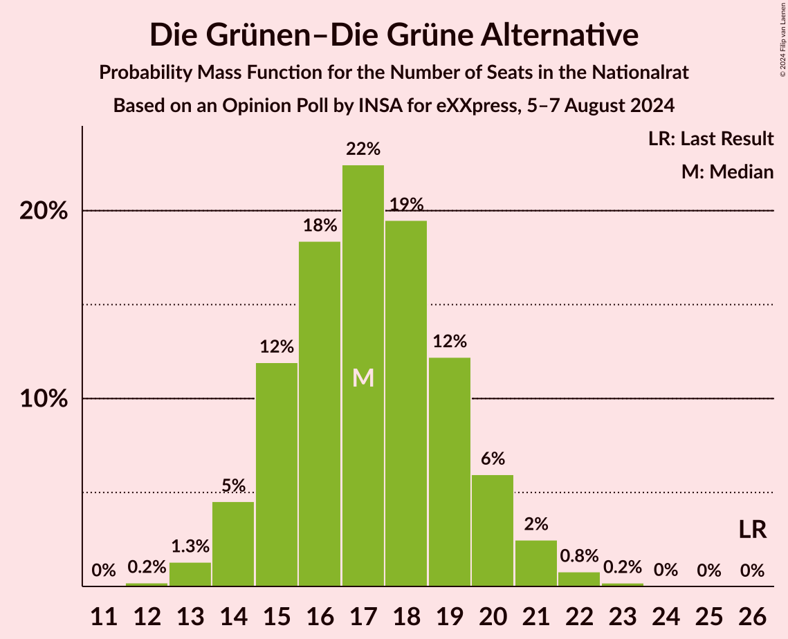
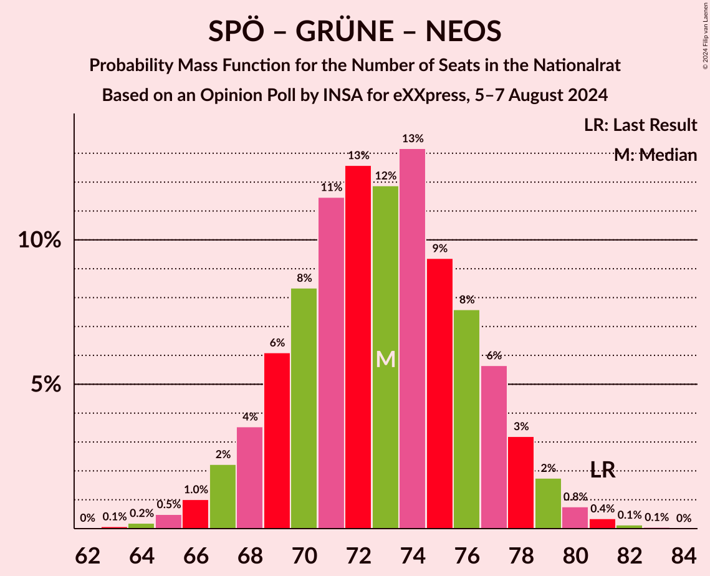
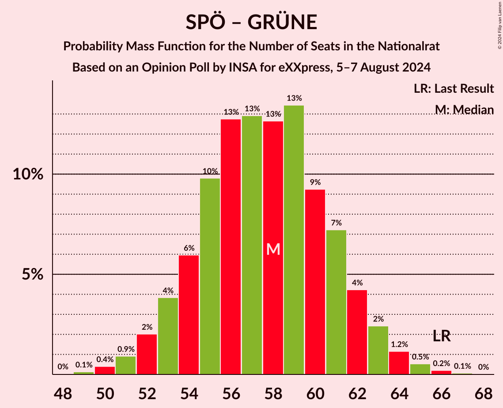

# Opinion Poll by INSA for eXXpress, 5–7 August 2024

<a href="#voting-intentions">Voting Intentions</a> | <a href="#seats">Seats</a> | <a href="#coalitions">Coalitions</a> | <a href="#technical-information">Technical Information</a>

## Voting Intentions

### Confidence Intervals

| Party | Last Result | Poll Result | 80% Confidence Interval | 90% Confidence Interval | 95% Confidence Interval | 99% Confidence Interval |
|:-----:|:-----------:|:-----------:|:-----------------------:|:-----------------------:|:-----------------------:|:-----------------------:|
| Freiheitliche Partei Österreichs | 16.2% | 31.0% | 29.2–32.9% |28.7–33.5% |28.2–33.9% |27.3–34.9% |
| Sozialdemokratische Partei Österreichs | 21.2% | 21.0% | 19.4–22.7% |19.0–23.2% |18.6–23.6% |17.8–24.5% |
| Österreichische Volkspartei | 37.5% | 19.0% | 17.5–20.7% |17.1–21.1% |16.7–21.6% |16.0–22.4% |
| Die Grünen–Die Grüne Alternative | 13.9% | 9.0% | 7.9–10.3% |7.6–10.6% |7.4–10.9% |6.9–11.6% |
| NEOS–Das Neue Österreich und Liberales Forum | 8.1% | 8.0% | 7.0–9.2% |6.7–9.6% |6.5–9.9% |6.0–10.5% |
| Bierpartei | 0.0% | 7.0% | 6.1–8.2% |5.8–8.5% |5.6–8.8% |5.2–9.3% |
| Kommunistische Partei Österreichs | 0.7% | 2.0% | 1.5–2.7% |1.4–2.9% |1.3–3.1% |1.1–3.4% |

*Note:* The poll result column reflects the actual value used in the calculations. Published results may vary slightly, and in addition be rounded to fewer digits.

## Seats

### Confidence Intervals

| Party | Last Result | Median | 80% Confidence Interval | 90% Confidence Interval | 95% Confidence Interval | 99% Confidence Interval |
|:-----:|:-----------:|:------:|:-----------------------:|:-----------------------:|:-----------------------:|:-----------------------:|
| <a href="#freiheitliche-partei-österreichs">Freiheitliche Partei Österreichs</a> | 31 | 60 | 56–64 |55–65 |54–65 |53–67 |
| <a href="#sozialdemokratische-partei-österreichs">Sozialdemokratische Partei Österreichs</a> | 40 | 40 | 37–44 |36–45 |36–45 |34–47 |
| <a href="#österreichische-volkspartei">Österreichische Volkspartei</a> | 71 | 36 | 33–40 |33–41 |32–41 |31–43 |
| <a href="#die-grünen–die-grüne-alternative">Die Grünen–Die Grüne Alternative</a> | 26 | 17 | 15–19 |14–20 |14–21 |13–22 |
| <a href="#neos–das-neue-österreich-und-liberales-forum">NEOS–Das Neue Österreich und Liberales Forum</a> | 15 | 15 | 13–17 |13–18 |12–19 |11–20 |
| <a href="#bierpartei">Bierpartei</a> | 0 | 13 | 11–15 |11–16 |10–17 |9–18 |
| <a href="#kommunistische-partei-österreichs">Kommunistische Partei Österreichs</a> | 0 | 0 | 0 |0 |0 |0 |

### Freiheitliche Partei Österreichs

*For a full overview of the results for this party, see the [Freiheitliche Partei Österreichs](party-freiheitlicheparteiösterreichs.html) page.*

| Number of Seats | Probability | Accumulated | Special Marks |
|:---------------:|:-----------:|:-----------:|:-------------:|
| 31 | 0% | 100% | Last Result |
| 32 | 0% | 100% |  |
| 33 | 0% | 100% |  |
| 34 | 0% | 100% |  |
| 35 | 0% | 100% |  |
| 36 | 0% | 100% |  |
| 37 | 0% | 100% |  |
| 38 | 0% | 100% |  |
| 39 | 0% | 100% |  |
| 40 | 0% | 100% |  |
| 41 | 0% | 100% |  |
| 42 | 0% | 100% |  |
| 43 | 0% | 100% |  |
| 44 | 0% | 100% |  |
| 45 | 0% | 100% |  |
| 46 | 0% | 100% |  |
| 47 | 0% | 100% |  |
| 48 | 0% | 100% |  |
| 49 | 0% | 100% |  |
| 50 | 0% | 100% |  |
| 51 | 0.1% | 99.9% |  |
| 52 | 0.3% | 99.8% |  |
| 53 | 0.8% | 99.5% |  |
| 54 | 2% | 98.7% |  |
| 55 | 4% | 97% |  |
| 56 | 5% | 93% |  |
| 57 | 9% | 88% |  |
| 58 | 11% | 79% |  |
| 59 | 14% | 68% |  |
| 60 | 14% | 53% | Median |
| 61 | 13% | 40% |  |
| 62 | 9% | 27% |  |
| 63 | 8% | 18% |  |
| 64 | 5% | 10% |  |
| 65 | 3% | 6% |  |
| 66 | 1.3% | 2% |  |
| 67 | 0.7% | 1.2% |  |
| 68 | 0.3% | 0.5% |  |
| 69 | 0.1% | 0.2% |  |
| 70 | 0% | 0% |  |

### Sozialdemokratische Partei Österreichs

*For a full overview of the results for this party, see the [Sozialdemokratische Partei Österreichs](party-sozialdemokratischeparteiösterreichs.html) page.*

| Number of Seats | Probability | Accumulated | Special Marks |
|:---------------:|:-----------:|:-----------:|:-------------:|
| 33 | 0.2% | 100% |  |
| 34 | 0.6% | 99.8% |  |
| 35 | 1.4% | 99.2% |  |
| 36 | 3% | 98% |  |
| 37 | 6% | 94% |  |
| 38 | 9% | 88% |  |
| 39 | 13% | 79% |  |
| 40 | 16% | 65% | Last Result, Median |
| 41 | 15% | 49% |  |
| 42 | 13% | 34% |  |
| 43 | 9% | 21% |  |
| 44 | 5% | 12% |  |
| 45 | 4% | 6% |  |
| 46 | 2% | 2% |  |
| 47 | 0.5% | 0.9% |  |
| 48 | 0.3% | 0.4% |  |
| 49 | 0.1% | 0.1% |  |
| 50 | 0% | 0% |  |

### Österreichische Volkspartei

*For a full overview of the results for this party, see the [Österreichische Volkspartei](party-österreichischevolkspartei.html) page.*

| Number of Seats | Probability | Accumulated | Special Marks |
|:---------------:|:-----------:|:-----------:|:-------------:|
| 29 | 0.1% | 100% |  |
| 30 | 0.3% | 99.9% |  |
| 31 | 1.1% | 99.6% |  |
| 32 | 3% | 98% |  |
| 33 | 6% | 96% |  |
| 34 | 10% | 89% |  |
| 35 | 13% | 80% |  |
| 36 | 17% | 67% | Median |
| 37 | 15% | 50% |  |
| 38 | 14% | 34% |  |
| 39 | 9% | 21% |  |
| 40 | 6% | 12% |  |
| 41 | 3% | 5% |  |
| 42 | 1.3% | 2% |  |
| 43 | 0.6% | 0.9% |  |
| 44 | 0.2% | 0.3% |  |
| 45 | 0.1% | 0.1% |  |
| 46 | 0% | 0% |  |
| 47 | 0% | 0% |  |
| 48 | 0% | 0% |  |
| 49 | 0% | 0% |  |
| 50 | 0% | 0% |  |
| 51 | 0% | 0% |  |
| 52 | 0% | 0% |  |
| 53 | 0% | 0% |  |
| 54 | 0% | 0% |  |
| 55 | 0% | 0% |  |
| 56 | 0% | 0% |  |
| 57 | 0% | 0% |  |
| 58 | 0% | 0% |  |
| 59 | 0% | 0% |  |
| 60 | 0% | 0% |  |
| 61 | 0% | 0% |  |
| 62 | 0% | 0% |  |
| 63 | 0% | 0% |  |
| 64 | 0% | 0% |  |
| 65 | 0% | 0% |  |
| 66 | 0% | 0% |  |
| 67 | 0% | 0% |  |
| 68 | 0% | 0% |  |
| 69 | 0% | 0% |  |
| 70 | 0% | 0% |  |
| 71 | 0% | 0% | Last Result |

### Die Grünen–Die Grüne Alternative

*For a full overview of the results for this party, see the [Die Grünen–Die Grüne Alternative](party-diegrünen–diegrünealternative.html) page.*

| Number of Seats | Probability | Accumulated | Special Marks |
|:---------------:|:-----------:|:-----------:|:-------------:|
| 12 | 0.2% | 100% |  |
| 13 | 1.4% | 99.8% |  |
| 14 | 5% | 98% |  |
| 15 | 11% | 94% |  |
| 16 | 19% | 82% |  |
| 17 | 21% | 64% | Median |
| 18 | 21% | 43% |  |
| 19 | 13% | 22% |  |
| 20 | 6% | 9% |  |
| 21 | 3% | 4% |  |
| 22 | 0.8% | 1.1% |  |
| 23 | 0.2% | 0.3% |  |
| 24 | 0% | 0% |  |
| 25 | 0% | 0% |  |
| 26 | 0% | 0% | Last Result |

### NEOS–Das Neue Österreich und Liberales Forum

*For a full overview of the results for this party, see the [NEOS–Das Neue Österreich und Liberales Forum](party-neos–dasneueösterreichundliberalesforum.html) page.*

| Number of Seats | Probability | Accumulated | Special Marks |
|:---------------:|:-----------:|:-----------:|:-------------:|
| 10 | 0.1% | 100% |  |
| 11 | 0.7% | 99.9% |  |
| 12 | 4% | 99.2% |  |
| 13 | 10% | 95% |  |
| 14 | 19% | 85% |  |
| 15 | 25% | 67% | Last Result, Median |
| 16 | 19% | 42% |  |
| 17 | 14% | 23% |  |
| 18 | 6% | 9% |  |
| 19 | 2% | 3% |  |
| 20 | 0.7% | 0.8% |  |
| 21 | 0.1% | 0.2% |  |
| 22 | 0% | 0% |  |

### Bierpartei

*For a full overview of the results for this party, see the [Bierpartei](party-bierpartei.html) page.*

| Number of Seats | Probability | Accumulated | Special Marks |
|:---------------:|:-----------:|:-----------:|:-------------:|
| 0 | 0% | 100% | Last Result |
| 1 | 0% | 100% |  |
| 2 | 0% | 100% |  |
| 3 | 0% | 100% |  |
| 4 | 0% | 100% |  |
| 5 | 0% | 100% |  |
| 6 | 0% | 100% |  |
| 7 | 0% | 100% |  |
| 8 | 0% | 100% |  |
| 9 | 0.5% | 100% |  |
| 10 | 3% | 99.5% |  |
| 11 | 8% | 97% |  |
| 12 | 24% | 89% |  |
| 13 | 20% | 65% | Median |
| 14 | 21% | 45% |  |
| 15 | 16% | 23% |  |
| 16 | 5% | 8% |  |
| 17 | 2% | 3% |  |
| 18 | 0.5% | 0.6% |  |
| 19 | 0.1% | 0.1% |  |
| 20 | 0% | 0% |  |

### Kommunistische Partei Österreichs

*For a full overview of the results for this party, see the [Kommunistische Partei Österreichs](party-kommunistischeparteiösterreichs.html) page.*

| Number of Seats | Probability | Accumulated | Special Marks |
|:---------------:|:-----------:|:-----------:|:-------------:|
| 0 | 100% | 100% | Last Result, Median |

## Coalitions

### Confidence Intervals

| Coalition | Last Result | Median | Majority? | 80% Confidence Interval | 90% Confidence Interval | 95% Confidence Interval | 99% Confidence Interval |
|:---------:|:-----------:|:------:|:---------:|:-----------------------:|:-----------------------:|:-----------------------:|:-----------------------:|
| Freiheitliche Partei Österreichs – Sozialdemokratische Partei Österreichs | 71 | 100 | 99.6% | 96–105 | 95–106 | 94–106 | 92–108 |
| Freiheitliche Partei Österreichs – Österreichische Volkspartei | 102 | 96 | 94% | 92–100 | 91–102 | 90–103 | 88–104 |
| Sozialdemokratische Partei Österreichs – Österreichische Volkspartei | 111 | 77 | 0% | 73–81 | 72–82 | 71–83 | 69–85 |
| Sozialdemokratische Partei Österreichs – Die Grünen–Die Grüne Alternative – NEOS–Das Neue Österreich und Liberales Forum | 81 | 73 | 0% | 69–77 | 68–78 | 67–79 | 65–81 |
| Österreichische Volkspartei – Die Grünen–Die Grüne Alternative – NEOS–Das Neue Österreich und Liberales Forum | 112 | 69 | 0% | 65–73 | 64–74 | 63–75 | 61–77 |
| Sozialdemokratische Partei Österreichs – Die Grünen–Die Grüne Alternative | 66 | 58 | 0% | 54–61 | 53–62 | 52–63 | 50–65 |
| Österreichische Volkspartei – Die Grünen–Die Grüne Alternative | 97 | 54 | 0% | 50–57 | 49–58 | 48–59 | 47–61 |
| Österreichische Volkspartei – NEOS–Das Neue Österreich und Liberales Forum | 86 | 52 | 0% | 48–55 | 47–56 | 47–57 | 45–59 |
| Sozialdemokratische Partei Österreichs | 40 | 40 | 0% | 37–44 | 36–45 | 36–45 | 34–47 |
| Österreichische Volkspartei | 71 | 36 | 0% | 33–40 | 33–41 | 32–41 | 31–43 |

### Freiheitliche Partei Österreichs – Sozialdemokratische Partei Österreichs

| Number of Seats | Probability | Accumulated | Special Marks |
|:---------------:|:-----------:|:-----------:|:-------------:|
| 71 | 0% | 100% | Last Result |
| 72 | 0% | 100% |  |
| 73 | 0% | 100% |  |
| 74 | 0% | 100% |  |
| 75 | 0% | 100% |  |
| 76 | 0% | 100% |  |
| 77 | 0% | 100% |  |
| 78 | 0% | 100% |  |
| 79 | 0% | 100% |  |
| 80 | 0% | 100% |  |
| 81 | 0% | 100% |  |
| 82 | 0% | 100% |  |
| 83 | 0% | 100% |  |
| 84 | 0% | 100% |  |
| 85 | 0% | 100% |  |
| 86 | 0% | 100% |  |
| 87 | 0% | 100% |  |
| 88 | 0% | 100% |  |
| 89 | 0% | 100% |  |
| 90 | 0.1% | 99.9% |  |
| 91 | 0.3% | 99.9% |  |
| 92 | 0.6% | 99.6% | Majority |
| 93 | 0.8% | 99.0% |  |
| 94 | 1.0% | 98% |  |
| 95 | 3% | 97% |  |
| 96 | 7% | 94% |  |
| 97 | 8% | 87% |  |
| 98 | 6% | 79% |  |
| 99 | 6% | 73% |  |
| 100 | 17% | 67% | Median |
| 101 | 19% | 50% |  |
| 102 | 11% | 31% |  |
| 103 | 5% | 20% |  |
| 104 | 4% | 15% |  |
| 105 | 6% | 11% |  |
| 106 | 4% | 6% |  |
| 107 | 1.4% | 2% |  |
| 108 | 0.3% | 0.7% |  |
| 109 | 0.2% | 0.4% |  |
| 110 | 0.1% | 0.2% |  |
| 111 | 0% | 0% |  |

### Freiheitliche Partei Österreichs – Österreichische Volkspartei

| Number of Seats | Probability | Accumulated | Special Marks |
|:---------------:|:-----------:|:-----------:|:-------------:|
| 86 | 0.1% | 100% |  |
| 87 | 0.2% | 99.9% |  |
| 88 | 0.5% | 99.7% |  |
| 89 | 0.8% | 99.2% |  |
| 90 | 2% | 98% |  |
| 91 | 3% | 97% |  |
| 92 | 5% | 94% | Majority |
| 93 | 7% | 89% |  |
| 94 | 10% | 82% |  |
| 95 | 13% | 73% |  |
| 96 | 12% | 60% | Median |
| 97 | 11% | 47% |  |
| 98 | 12% | 37% |  |
| 99 | 9% | 25% |  |
| 100 | 6% | 16% |  |
| 101 | 5% | 10% |  |
| 102 | 3% | 5% | Last Result |
| 103 | 1.5% | 3% |  |
| 104 | 0.7% | 1.1% |  |
| 105 | 0.3% | 0.4% |  |
| 106 | 0.1% | 0.1% |  |
| 107 | 0% | 0% |  |

### Sozialdemokratische Partei Österreichs – Österreichische Volkspartei

| Number of Seats | Probability | Accumulated | Special Marks |
|:---------------:|:-----------:|:-----------:|:-------------:|
| 67 | 0.1% | 100% |  |
| 68 | 0.2% | 99.9% |  |
| 69 | 0.5% | 99.7% |  |
| 70 | 0.9% | 99.2% |  |
| 71 | 2% | 98% |  |
| 72 | 3% | 97% |  |
| 73 | 6% | 93% |  |
| 74 | 7% | 87% |  |
| 75 | 10% | 80% |  |
| 76 | 12% | 70% | Median |
| 77 | 15% | 58% |  |
| 78 | 13% | 43% |  |
| 79 | 10% | 31% |  |
| 80 | 8% | 21% |  |
| 81 | 5% | 13% |  |
| 82 | 4% | 8% |  |
| 83 | 2% | 4% |  |
| 84 | 0.8% | 2% |  |
| 85 | 0.5% | 0.8% |  |
| 86 | 0.2% | 0.3% |  |
| 87 | 0.1% | 0.1% |  |
| 88 | 0% | 0% |  |
| 89 | 0% | 0% |  |
| 90 | 0% | 0% |  |
| 91 | 0% | 0% |  |
| 92 | 0% | 0% | Majority |
| 93 | 0% | 0% |  |
| 94 | 0% | 0% |  |
| 95 | 0% | 0% |  |
| 96 | 0% | 0% |  |
| 97 | 0% | 0% |  |
| 98 | 0% | 0% |  |
| 99 | 0% | 0% |  |
| 100 | 0% | 0% |  |
| 101 | 0% | 0% |  |
| 102 | 0% | 0% |  |
| 103 | 0% | 0% |  |
| 104 | 0% | 0% |  |
| 105 | 0% | 0% |  |
| 106 | 0% | 0% |  |
| 107 | 0% | 0% |  |
| 108 | 0% | 0% |  |
| 109 | 0% | 0% |  |
| 110 | 0% | 0% |  |
| 111 | 0% | 0% | Last Result |

### Sozialdemokratische Partei Österreichs – Die Grünen–Die Grüne Alternative – NEOS–Das Neue Österreich und Liberales Forum

| Number of Seats | Probability | Accumulated | Special Marks |
|:---------------:|:-----------:|:-----------:|:-------------:|
| 63 | 0.1% | 100% |  |
| 64 | 0.2% | 99.9% |  |
| 65 | 0.5% | 99.7% |  |
| 66 | 1.0% | 99.2% |  |
| 67 | 2% | 98% |  |
| 68 | 4% | 96% |  |
| 69 | 7% | 92% |  |
| 70 | 7% | 85% |  |
| 71 | 10% | 78% |  |
| 72 | 11% | 69% | Median |
| 73 | 12% | 57% |  |
| 74 | 16% | 45% |  |
| 75 | 10% | 30% |  |
| 76 | 8% | 20% |  |
| 77 | 6% | 11% |  |
| 78 | 3% | 6% |  |
| 79 | 1.4% | 3% |  |
| 80 | 0.9% | 1.5% |  |
| 81 | 0.4% | 0.6% | Last Result |
| 82 | 0.2% | 0.2% |  |
| 83 | 0.1% | 0.1% |  |
| 84 | 0% | 0% |  |

### Österreichische Volkspartei – Die Grünen–Die Grüne Alternative – NEOS–Das Neue Österreich und Liberales Forum

| Number of Seats | Probability | Accumulated | Special Marks |
|:---------------:|:-----------:|:-----------:|:-------------:|
| 59 | 0.1% | 100% |  |
| 60 | 0.1% | 99.9% |  |
| 61 | 0.4% | 99.8% |  |
| 62 | 1.0% | 99.4% |  |
| 63 | 2% | 98% |  |
| 64 | 4% | 97% |  |
| 65 | 5% | 93% |  |
| 66 | 9% | 87% |  |
| 67 | 9% | 78% |  |
| 68 | 12% | 69% | Median |
| 69 | 14% | 58% |  |
| 70 | 14% | 44% |  |
| 71 | 12% | 30% |  |
| 72 | 7% | 19% |  |
| 73 | 5% | 12% |  |
| 74 | 3% | 6% |  |
| 75 | 2% | 3% |  |
| 76 | 1.0% | 2% |  |
| 77 | 0.5% | 0.7% |  |
| 78 | 0.1% | 0.2% |  |
| 79 | 0.1% | 0.1% |  |
| 80 | 0% | 0% |  |
| 81 | 0% | 0% |  |
| 82 | 0% | 0% |  |
| 83 | 0% | 0% |  |
| 84 | 0% | 0% |  |
| 85 | 0% | 0% |  |
| 86 | 0% | 0% |  |
| 87 | 0% | 0% |  |
| 88 | 0% | 0% |  |
| 89 | 0% | 0% |  |
| 90 | 0% | 0% |  |
| 91 | 0% | 0% |  |
| 92 | 0% | 0% | Majority |
| 93 | 0% | 0% |  |
| 94 | 0% | 0% |  |
| 95 | 0% | 0% |  |
| 96 | 0% | 0% |  |
| 97 | 0% | 0% |  |
| 98 | 0% | 0% |  |
| 99 | 0% | 0% |  |
| 100 | 0% | 0% |  |
| 101 | 0% | 0% |  |
| 102 | 0% | 0% |  |
| 103 | 0% | 0% |  |
| 104 | 0% | 0% |  |
| 105 | 0% | 0% |  |
| 106 | 0% | 0% |  |
| 107 | 0% | 0% |  |
| 108 | 0% | 0% |  |
| 109 | 0% | 0% |  |
| 110 | 0% | 0% |  |
| 111 | 0% | 0% |  |
| 112 | 0% | 0% | Last Result |

### Sozialdemokratische Partei Österreichs – Die Grünen–Die Grüne Alternative

| Number of Seats | Probability | Accumulated | Special Marks |
|:---------------:|:-----------:|:-----------:|:-------------:|
| 48 | 0% | 100% |  |
| 49 | 0.1% | 99.9% |  |
| 50 | 0.4% | 99.8% |  |
| 51 | 0.9% | 99.4% |  |
| 52 | 2% | 98% |  |
| 53 | 4% | 96% |  |
| 54 | 5% | 92% |  |
| 55 | 9% | 87% |  |
| 56 | 12% | 77% |  |
| 57 | 13% | 65% | Median |
| 58 | 13% | 53% |  |
| 59 | 14% | 39% |  |
| 60 | 10% | 26% |  |
| 61 | 7% | 16% |  |
| 62 | 4% | 9% |  |
| 63 | 3% | 5% |  |
| 64 | 1.2% | 2% |  |
| 65 | 0.5% | 0.8% |  |
| 66 | 0.2% | 0.3% | Last Result |
| 67 | 0.1% | 0.1% |  |
| 68 | 0% | 0% |  |

### Österreichische Volkspartei – Die Grünen–Die Grüne Alternative

| Number of Seats | Probability | Accumulated | Special Marks |
|:---------------:|:-----------:|:-----------:|:-------------:|
| 45 | 0.1% | 100% |  |
| 46 | 0.3% | 99.9% |  |
| 47 | 0.8% | 99.6% |  |
| 48 | 2% | 98.8% |  |
| 49 | 3% | 97% |  |
| 50 | 7% | 94% |  |
| 51 | 8% | 87% |  |
| 52 | 12% | 79% |  |
| 53 | 13% | 67% | Median |
| 54 | 15% | 54% |  |
| 55 | 14% | 39% |  |
| 56 | 9% | 25% |  |
| 57 | 8% | 16% |  |
| 58 | 4% | 8% |  |
| 59 | 2% | 4% |  |
| 60 | 1.3% | 2% |  |
| 61 | 0.5% | 0.8% |  |
| 62 | 0.3% | 0.4% |  |
| 63 | 0.1% | 0.1% |  |
| 64 | 0% | 0% |  |
| 65 | 0% | 0% |  |
| 66 | 0% | 0% |  |
| 67 | 0% | 0% |  |
| 68 | 0% | 0% |  |
| 69 | 0% | 0% |  |
| 70 | 0% | 0% |  |
| 71 | 0% | 0% |  |
| 72 | 0% | 0% |  |
| 73 | 0% | 0% |  |
| 74 | 0% | 0% |  |
| 75 | 0% | 0% |  |
| 76 | 0% | 0% |  |
| 77 | 0% | 0% |  |
| 78 | 0% | 0% |  |
| 79 | 0% | 0% |  |
| 80 | 0% | 0% |  |
| 81 | 0% | 0% |  |
| 82 | 0% | 0% |  |
| 83 | 0% | 0% |  |
| 84 | 0% | 0% |  |
| 85 | 0% | 0% |  |
| 86 | 0% | 0% |  |
| 87 | 0% | 0% |  |
| 88 | 0% | 0% |  |
| 89 | 0% | 0% |  |
| 90 | 0% | 0% |  |
| 91 | 0% | 0% |  |
| 92 | 0% | 0% | Majority |
| 93 | 0% | 0% |  |
| 94 | 0% | 0% |  |
| 95 | 0% | 0% |  |
| 96 | 0% | 0% |  |
| 97 | 0% | 0% | Last Result |

### Österreichische Volkspartei – NEOS–Das Neue Österreich und Liberales Forum

| Number of Seats | Probability | Accumulated | Special Marks |
|:---------------:|:-----------:|:-----------:|:-------------:|
| 43 | 0.1% | 100% |  |
| 44 | 0.2% | 99.9% |  |
| 45 | 0.8% | 99.7% |  |
| 46 | 1.4% | 98.9% |  |
| 47 | 3% | 98% |  |
| 48 | 7% | 94% |  |
| 49 | 7% | 87% |  |
| 50 | 13% | 80% |  |
| 51 | 13% | 67% | Median |
| 52 | 12% | 54% |  |
| 53 | 15% | 41% |  |
| 54 | 11% | 27% |  |
| 55 | 6% | 16% |  |
| 56 | 5% | 9% |  |
| 57 | 2% | 4% |  |
| 58 | 1.2% | 2% |  |
| 59 | 0.6% | 1.0% |  |
| 60 | 0.2% | 0.3% |  |
| 61 | 0.1% | 0.1% |  |
| 62 | 0% | 0% |  |
| 63 | 0% | 0% |  |
| 64 | 0% | 0% |  |
| 65 | 0% | 0% |  |
| 66 | 0% | 0% |  |
| 67 | 0% | 0% |  |
| 68 | 0% | 0% |  |
| 69 | 0% | 0% |  |
| 70 | 0% | 0% |  |
| 71 | 0% | 0% |  |
| 72 | 0% | 0% |  |
| 73 | 0% | 0% |  |
| 74 | 0% | 0% |  |
| 75 | 0% | 0% |  |
| 76 | 0% | 0% |  |
| 77 | 0% | 0% |  |
| 78 | 0% | 0% |  |
| 79 | 0% | 0% |  |
| 80 | 0% | 0% |  |
| 81 | 0% | 0% |  |
| 82 | 0% | 0% |  |
| 83 | 0% | 0% |  |
| 84 | 0% | 0% |  |
| 85 | 0% | 0% |  |
| 86 | 0% | 0% | Last Result |

### Sozialdemokratische Partei Österreichs

| Number of Seats | Probability | Accumulated | Special Marks |
|:---------------:|:-----------:|:-----------:|:-------------:|
| 33 | 0.2% | 100% |  |
| 34 | 0.6% | 99.8% |  |
| 35 | 1.4% | 99.2% |  |
| 36 | 3% | 98% |  |
| 37 | 6% | 94% |  |
| 38 | 9% | 88% |  |
| 39 | 13% | 79% |  |
| 40 | 16% | 65% | Last Result, Median |
| 41 | 15% | 49% |  |
| 42 | 13% | 34% |  |
| 43 | 9% | 21% |  |
| 44 | 5% | 12% |  |
| 45 | 4% | 6% |  |
| 46 | 2% | 2% |  |
| 47 | 0.5% | 0.9% |  |
| 48 | 0.3% | 0.4% |  |
| 49 | 0.1% | 0.1% |  |
| 50 | 0% | 0% |  |

### Österreichische Volkspartei

| Number of Seats | Probability | Accumulated | Special Marks |
|:---------------:|:-----------:|:-----------:|:-------------:|
| 29 | 0.1% | 100% |  |
| 30 | 0.3% | 99.9% |  |
| 31 | 1.1% | 99.6% |  |
| 32 | 3% | 98% |  |
| 33 | 6% | 96% |  |
| 34 | 10% | 89% |  |
| 35 | 13% | 80% |  |
| 36 | 17% | 67% | Median |
| 37 | 15% | 50% |  |
| 38 | 14% | 34% |  |
| 39 | 9% | 21% |  |
| 40 | 6% | 12% |  |
| 41 | 3% | 5% |  |
| 42 | 1.3% | 2% |  |
| 43 | 0.6% | 0.9% |  |
| 44 | 0.2% | 0.3% |  |
| 45 | 0.1% | 0.1% |  |
| 46 | 0% | 0% |  |
| 47 | 0% | 0% |  |
| 48 | 0% | 0% |  |
| 49 | 0% | 0% |  |
| 50 | 0% | 0% |  |
| 51 | 0% | 0% |  |
| 52 | 0% | 0% |  |
| 53 | 0% | 0% |  |
| 54 | 0% | 0% |  |
| 55 | 0% | 0% |  |
| 56 | 0% | 0% |  |
| 57 | 0% | 0% |  |
| 58 | 0% | 0% |  |
| 59 | 0% | 0% |  |
| 60 | 0% | 0% |  |
| 61 | 0% | 0% |  |
| 62 | 0% | 0% |  |
| 63 | 0% | 0% |  |
| 64 | 0% | 0% |  |
| 65 | 0% | 0% |  |
| 66 | 0% | 0% |  |
| 67 | 0% | 0% |  |
| 68 | 0% | 0% |  |
| 69 | 0% | 0% |  |
| 70 | 0% | 0% |  |
| 71 | 0% | 0% | Last Result |

## Technical Information

### Opinion Poll

+ **Polling firm:** INSA
+ **Commissioner(s):** eXXpress
+ **Fieldwork period:** 5–7 August 2024

### Calculations

+ **Sample size:** 1000
+ **Simulations done:** 1,048,576
+ **Error estimate:** 0.73%

