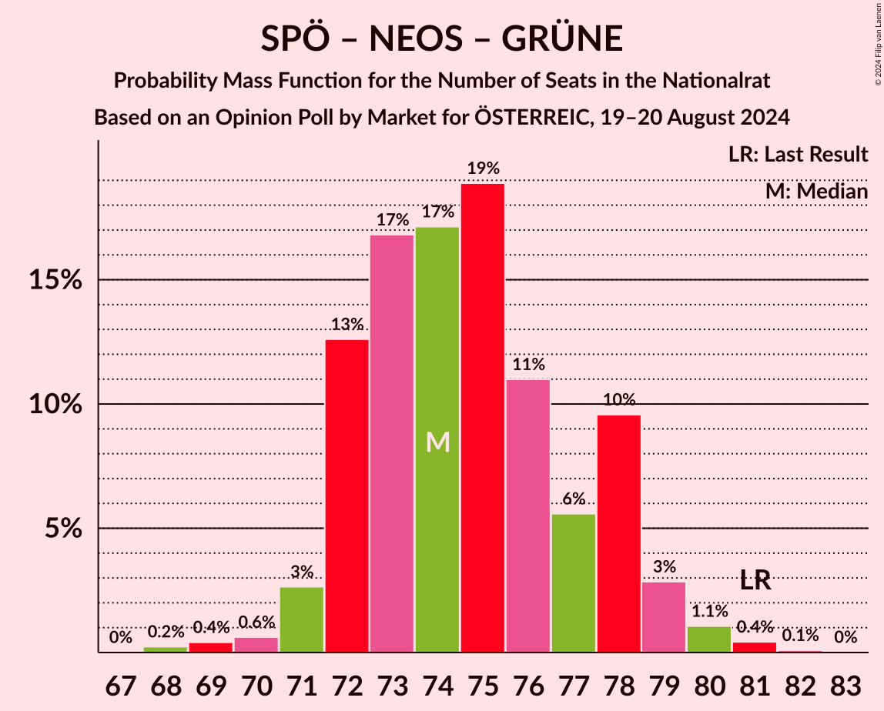

# Opinion Poll by Market for ÖSTERREIC, 19–20 August 2024

<a href="#voting-intentions">Voting Intentions</a> | <a href="#seats">Seats</a> | <a href="#coalitions">Coalitions</a> | <a href="#technical-information">Technical Information</a>

## Voting Intentions

### Confidence Intervals

| Party | Last Result | Poll Result | 80% Confidence Interval | 90% Confidence Interval | 95% Confidence Interval | 99% Confidence Interval |
|:-----:|:-----------:|:-----------:|:-----------------------:|:-----------------------:|:-----------------------:|:-----------------------:|
| Freiheitliche Partei Österreichs | 16.2% | 29.0% | 27.7–30.3% |27.4–30.7% |27.1–31.0% |26.4–31.7% |
| Österreichische Volkspartei | 37.5% | 22.0% | 20.8–23.2% |20.5–23.6% |20.2–23.9% |19.7–24.5% |
| Sozialdemokratische Partei Österreichs | 21.2% | 21.0% | 19.9–22.2% |19.5–22.6% |19.3–22.8% |18.7–23.4% |
| NEOS–Das Neue Österreich und Liberales Forum | 8.1% | 11.0% | 10.1–11.9% |9.9–12.2% |9.7–12.5% |9.3–12.9% |
| Die Grünen–Die Grüne Alternative | 13.9% | 7.0% | 6.3–7.8% |6.1–8.0% |6.0–8.2% |5.6–8.6% |
| Bierpartei | 0.0% | 5.0% | 4.4–5.7% |4.3–5.9% |4.1–6.1% |3.9–6.4% |
| Kommunistische Partei Österreichs | 0.7% | 2.0% | 1.6–2.5% |1.6–2.6% |1.5–2.7% |1.3–3.0% |
| Liste Madeleine Petrovic | 0.0% | 1.0% | 0.8–1.4% |0.7–1.5% |0.6–1.5% |0.5–1.7% |
| Wandel | 0.0% | 1.0% | 0.8–1.4% |0.7–1.5% |0.6–1.5% |0.5–1.7% |

*Note:* The poll result column reflects the actual value used in the calculations. Published results may vary slightly, and in addition be rounded to fewer digits.

## Seats

### Confidence Intervals

| Party | Last Result | Median | 80% Confidence Interval | 90% Confidence Interval | 95% Confidence Interval | 99% Confidence Interval |
|:-----:|:-----------:|:------:|:-----------------------:|:-----------------------:|:-----------------------:|:-----------------------:|
| <a href="#freiheitliche-partei-österreichs">Freiheitliche Partei Österreichs</a> | 31 | 56 | 54–59 |53–60 |53–60 |51–62 |
| <a href="#österreichische-volkspartei">Österreichische Volkspartei</a> | 71 | 42 | 40–45 |39–45 |39–46 |38–47 |
| <a href="#sozialdemokratische-partei-österreichs">Sozialdemokratische Partei Österreichs</a> | 40 | 40 | 38–43 |38–44 |37–44 |36–45 |
| <a href="#neos–das-neue-österreich-und-liberales-forum">NEOS–Das Neue Österreich und Liberales Forum</a> | 15 | 21 | 19–23 |19–23 |18–24 |18–25 |
| <a href="#die-grünen–die-grüne-alternative">Die Grünen–Die Grüne Alternative</a> | 26 | 13 | 12–15 |11–15 |11–15 |11–16 |
| <a href="#bierpartei">Bierpartei</a> | 0 | 9 | 8–11 |8–11 |8–11 |0–12 |
| <a href="#kommunistische-partei-österreichs">Kommunistische Partei Österreichs</a> | 0 | 0 | 0 |0 |0 |0 |
| <a href="#liste-madeleine-petrovic">Liste Madeleine Petrovic</a> | 0 | 0 | 0 |0 |0 |0 |
| <a href="#wandel">Wandel</a> | 0 | 0 | 0 |0 |0 |0 |

### Freiheitliche Partei Österreichs

*For a full overview of the results for this party, see the [Freiheitliche Partei Österreichs](party-freiheitlicheparteiösterreichs.html) page.*

| Number of Seats | Probability | Accumulated | Special Marks |
|:---------------:|:-----------:|:-----------:|:-------------:|
| 31 | 0% | 100% | Last Result |
| 32 | 0% | 100% |  |
| 33 | 0% | 100% |  |
| 34 | 0% | 100% |  |
| 35 | 0% | 100% |  |
| 36 | 0% | 100% |  |
| 37 | 0% | 100% |  |
| 38 | 0% | 100% |  |
| 39 | 0% | 100% |  |
| 40 | 0% | 100% |  |
| 41 | 0% | 100% |  |
| 42 | 0% | 100% |  |
| 43 | 0% | 100% |  |
| 44 | 0% | 100% |  |
| 45 | 0% | 100% |  |
| 46 | 0% | 100% |  |
| 47 | 0% | 100% |  |
| 48 | 0% | 100% |  |
| 49 | 0% | 100% |  |
| 50 | 0.1% | 100% |  |
| 51 | 0.6% | 99.9% |  |
| 52 | 1.1% | 99.3% |  |
| 53 | 4% | 98% |  |
| 54 | 8% | 94% |  |
| 55 | 12% | 86% |  |
| 56 | 26% | 74% | Median |
| 57 | 19% | 48% |  |
| 58 | 15% | 30% |  |
| 59 | 9% | 14% |  |
| 60 | 4% | 5% |  |
| 61 | 1.3% | 2% |  |
| 62 | 0.4% | 0.5% |  |
| 63 | 0.2% | 0.2% |  |
| 64 | 0% | 0% |  |

### Österreichische Volkspartei

*For a full overview of the results for this party, see the [Österreichische Volkspartei](party-österreichischevolkspartei.html) page.*

| Number of Seats | Probability | Accumulated | Special Marks |
|:---------------:|:-----------:|:-----------:|:-------------:|
| 37 | 0.1% | 100% |  |
| 38 | 2% | 99.9% |  |
| 39 | 3% | 98% |  |
| 40 | 6% | 95% |  |
| 41 | 16% | 89% |  |
| 42 | 23% | 73% | Median |
| 43 | 25% | 49% |  |
| 44 | 10% | 24% |  |
| 45 | 10% | 14% |  |
| 46 | 2% | 4% |  |
| 47 | 1.2% | 2% |  |
| 48 | 0.4% | 0.4% |  |
| 49 | 0.1% | 0.1% |  |
| 50 | 0% | 0% |  |
| 51 | 0% | 0% |  |
| 52 | 0% | 0% |  |
| 53 | 0% | 0% |  |
| 54 | 0% | 0% |  |
| 55 | 0% | 0% |  |
| 56 | 0% | 0% |  |
| 57 | 0% | 0% |  |
| 58 | 0% | 0% |  |
| 59 | 0% | 0% |  |
| 60 | 0% | 0% |  |
| 61 | 0% | 0% |  |
| 62 | 0% | 0% |  |
| 63 | 0% | 0% |  |
| 64 | 0% | 0% |  |
| 65 | 0% | 0% |  |
| 66 | 0% | 0% |  |
| 67 | 0% | 0% |  |
| 68 | 0% | 0% |  |
| 69 | 0% | 0% |  |
| 70 | 0% | 0% |  |
| 71 | 0% | 0% | Last Result |

### Sozialdemokratische Partei Österreichs

*For a full overview of the results for this party, see the [Sozialdemokratische Partei Österreichs](party-sozialdemokratischeparteiösterreichs.html) page.*

| Number of Seats | Probability | Accumulated | Special Marks |
|:---------------:|:-----------:|:-----------:|:-------------:|
| 35 | 0.1% | 100% |  |
| 36 | 0.9% | 99.9% |  |
| 37 | 2% | 99.0% |  |
| 38 | 16% | 97% |  |
| 39 | 11% | 81% |  |
| 40 | 25% | 71% | Last Result, Median |
| 41 | 20% | 45% |  |
| 42 | 13% | 25% |  |
| 43 | 6% | 13% |  |
| 44 | 6% | 7% |  |
| 45 | 0.7% | 1.1% |  |
| 46 | 0.3% | 0.4% |  |
| 47 | 0% | 0.1% |  |
| 48 | 0% | 0% |  |

### NEOS–Das Neue Österreich und Liberales Forum

*For a full overview of the results for this party, see the [NEOS–Das Neue Österreich und Liberales Forum](party-neos–dasneueösterreichundliberalesforum.html) page.*

| Number of Seats | Probability | Accumulated | Special Marks |
|:---------------:|:-----------:|:-----------:|:-------------:|
| 15 | 0% | 100% | Last Result |
| 16 | 0% | 100% |  |
| 17 | 0.3% | 100% |  |
| 18 | 3% | 99.7% |  |
| 19 | 8% | 97% |  |
| 20 | 27% | 89% |  |
| 21 | 21% | 62% | Median |
| 22 | 18% | 41% |  |
| 23 | 20% | 23% |  |
| 24 | 2% | 3% |  |
| 25 | 0.7% | 0.8% |  |
| 26 | 0.1% | 0.1% |  |
| 27 | 0% | 0% |  |

### Die Grünen–Die Grüne Alternative

*For a full overview of the results for this party, see the [Die Grünen–Die Grüne Alternative](party-diegrünen–diegrünealternative.html) page.*

| Number of Seats | Probability | Accumulated | Special Marks |
|:---------------:|:-----------:|:-----------:|:-------------:|
| 10 | 0.3% | 100% |  |
| 11 | 7% | 99.6% |  |
| 12 | 22% | 93% |  |
| 13 | 37% | 71% | Median |
| 14 | 23% | 34% |  |
| 15 | 8% | 10% |  |
| 16 | 2% | 2% |  |
| 17 | 0.4% | 0.4% |  |
| 18 | 0% | 0% |  |
| 19 | 0% | 0% |  |
| 20 | 0% | 0% |  |
| 21 | 0% | 0% |  |
| 22 | 0% | 0% |  |
| 23 | 0% | 0% |  |
| 24 | 0% | 0% |  |
| 25 | 0% | 0% |  |
| 26 | 0% | 0% | Last Result |

### Bierpartei

*For a full overview of the results for this party, see the [Bierpartei](party-bierpartei.html) page.*

| Number of Seats | Probability | Accumulated | Special Marks |
|:---------------:|:-----------:|:-----------:|:-------------:|
| 0 | 1.1% | 100% | Last Result |
| 1 | 0% | 98.9% |  |
| 2 | 0% | 98.9% |  |
| 3 | 0% | 98.9% |  |
| 4 | 0% | 98.9% |  |
| 5 | 0% | 98.9% |  |
| 6 | 0% | 98.9% |  |
| 7 | 1.2% | 98.9% |  |
| 8 | 16% | 98% |  |
| 9 | 34% | 82% | Median |
| 10 | 35% | 48% |  |
| 11 | 12% | 13% |  |
| 12 | 2% | 2% |  |
| 13 | 0.2% | 0.2% |  |
| 14 | 0% | 0% |  |

### Kommunistische Partei Österreichs

*For a full overview of the results for this party, see the [Kommunistische Partei Österreichs](party-kommunistischeparteiösterreichs.html) page.*

| Number of Seats | Probability | Accumulated | Special Marks |
|:---------------:|:-----------:|:-----------:|:-------------:|
| 0 | 100% | 100% | Last Result, Median |

### Liste Madeleine Petrovic

*For a full overview of the results for this party, see the [Liste Madeleine Petrovic](party-listemadeleinepetrovic.html) page.*

| Number of Seats | Probability | Accumulated | Special Marks |
|:---------------:|:-----------:|:-----------:|:-------------:|
| 0 | 100% | 100% | Last Result, Median |

### Wandel

*For a full overview of the results for this party, see the [Wandel](party-wandel.html) page.*

| Number of Seats | Probability | Accumulated | Special Marks |
|:---------------:|:-----------:|:-----------:|:-------------:|
| 0 | 100% | 100% | Last Result, Median |

## Coalitions

### Confidence Intervals

| Coalition | Last Result | Median | Majority? | 80% Confidence Interval | 90% Confidence Interval | 95% Confidence Interval | 99% Confidence Interval |
|:---------:|:-----------:|:------:|:---------:|:-----------------------:|:-----------------------:|:-----------------------:|:-----------------------:|
| Freiheitliche Partei Österreichs – Österreichische Volkspartei | 102 | 99 | 100% | 96–102 | 95–102 | 95–103 | 93–105 |
| Freiheitliche Partei Österreichs – Sozialdemokratische Partei Österreichs | 71 | 97 | 99.5% | 94–99 | 93–101 | 93–101 | 92–104 |
| Österreichische Volkspartei – Sozialdemokratische Partei Österreichs | 111 | 83 | 0% | 80–85 | 80–86 | 80–87 | 78–89 |
| Österreichische Volkspartei – NEOS–Das Neue Österreich und Liberales Forum – Die Grünen–Die Grüne Alternative | 112 | 77 | 0% | 74–79 | 73–80 | 73–81 | 71–83 |
| Sozialdemokratische Partei Österreichs – NEOS–Das Neue Österreich und Liberales Forum – Die Grünen–Die Grüne Alternative | 81 | 74 | 0% | 72–78 | 72–78 | 71–79 | 69–81 |
| Österreichische Volkspartei – NEOS–Das Neue Österreich und Liberales Forum | 86 | 64 | 0% | 61–66 | 60–67 | 60–68 | 59–69 |
| Österreichische Volkspartei – Die Grünen–Die Grüne Alternative | 97 | 55 | 0% | 53–58 | 52–59 | 52–60 | 51–61 |
| Sozialdemokratische Partei Österreichs – Die Grünen–Die Grüne Alternative | 66 | 53 | 0% | 51–56 | 51–57 | 50–58 | 49–59 |
| Österreichische Volkspartei | 71 | 42 | 0% | 40–45 | 39–45 | 39–46 | 38–47 |
| Sozialdemokratische Partei Österreichs | 40 | 40 | 0% | 38–43 | 38–44 | 37–44 | 36–45 |

### Freiheitliche Partei Österreichs – Österreichische Volkspartei

| Number of Seats | Probability | Accumulated | Special Marks |
|:---------------:|:-----------:|:-----------:|:-------------:|
| 92 | 0.1% | 100% | Majority |
| 93 | 0.5% | 99.9% |  |
| 94 | 1.3% | 99.4% |  |
| 95 | 6% | 98% |  |
| 96 | 4% | 92% |  |
| 97 | 8% | 87% |  |
| 98 | 17% | 79% | Median |
| 99 | 24% | 62% |  |
| 100 | 14% | 38% |  |
| 101 | 11% | 24% |  |
| 102 | 9% | 13% | Last Result |
| 103 | 2% | 4% |  |
| 104 | 1.0% | 2% |  |
| 105 | 0.4% | 0.6% |  |
| 106 | 0.1% | 0.2% |  |
| 107 | 0% | 0.1% |  |
| 108 | 0.1% | 0.1% |  |
| 109 | 0% | 0% |  |

### Freiheitliche Partei Österreichs – Sozialdemokratische Partei Österreichs

| Number of Seats | Probability | Accumulated | Special Marks |
|:---------------:|:-----------:|:-----------:|:-------------:|
| 71 | 0% | 100% | Last Result |
| 72 | 0% | 100% |  |
| 73 | 0% | 100% |  |
| 74 | 0% | 100% |  |
| 75 | 0% | 100% |  |
| 76 | 0% | 100% |  |
| 77 | 0% | 100% |  |
| 78 | 0% | 100% |  |
| 79 | 0% | 100% |  |
| 80 | 0% | 100% |  |
| 81 | 0% | 100% |  |
| 82 | 0% | 100% |  |
| 83 | 0% | 100% |  |
| 84 | 0% | 100% |  |
| 85 | 0% | 100% |  |
| 86 | 0% | 100% |  |
| 87 | 0% | 100% |  |
| 88 | 0% | 100% |  |
| 89 | 0% | 100% |  |
| 90 | 0.2% | 100% |  |
| 91 | 0.3% | 99.8% |  |
| 92 | 1.2% | 99.5% | Majority |
| 93 | 3% | 98% |  |
| 94 | 10% | 95% |  |
| 95 | 10% | 85% |  |
| 96 | 23% | 75% | Median |
| 97 | 11% | 52% |  |
| 98 | 16% | 41% |  |
| 99 | 16% | 25% |  |
| 100 | 4% | 10% |  |
| 101 | 4% | 6% |  |
| 102 | 1.1% | 2% |  |
| 103 | 0.3% | 0.9% |  |
| 104 | 0.4% | 0.6% |  |
| 105 | 0.2% | 0.2% |  |
| 106 | 0% | 0.1% |  |
| 107 | 0% | 0% |  |

### Österreichische Volkspartei – Sozialdemokratische Partei Österreichs

| Number of Seats | Probability | Accumulated | Special Marks |
|:---------------:|:-----------:|:-----------:|:-------------:|
| 76 | 0% | 100% |  |
| 77 | 0.4% | 99.9% |  |
| 78 | 0.9% | 99.5% |  |
| 79 | 0.4% | 98.7% |  |
| 80 | 17% | 98% |  |
| 81 | 13% | 81% |  |
| 82 | 5% | 69% | Median |
| 83 | 32% | 64% |  |
| 84 | 5% | 32% |  |
| 85 | 18% | 28% |  |
| 86 | 6% | 10% |  |
| 87 | 2% | 4% |  |
| 88 | 1.3% | 2% |  |
| 89 | 0.4% | 0.7% |  |
| 90 | 0.2% | 0.3% |  |
| 91 | 0.1% | 0.1% |  |
| 92 | 0% | 0% | Majority |
| 93 | 0% | 0% |  |
| 94 | 0% | 0% |  |
| 95 | 0% | 0% |  |
| 96 | 0% | 0% |  |
| 97 | 0% | 0% |  |
| 98 | 0% | 0% |  |
| 99 | 0% | 0% |  |
| 100 | 0% | 0% |  |
| 101 | 0% | 0% |  |
| 102 | 0% | 0% |  |
| 103 | 0% | 0% |  |
| 104 | 0% | 0% |  |
| 105 | 0% | 0% |  |
| 106 | 0% | 0% |  |
| 107 | 0% | 0% |  |
| 108 | 0% | 0% |  |
| 109 | 0% | 0% |  |
| 110 | 0% | 0% |  |
| 111 | 0% | 0% | Last Result |

### Österreichische Volkspartei – NEOS–Das Neue Österreich und Liberales Forum – Die Grünen–Die Grüne Alternative

| Number of Seats | Probability | Accumulated | Special Marks |
|:---------------:|:-----------:|:-----------:|:-------------:|
| 70 | 0.1% | 100% |  |
| 71 | 0.6% | 99.8% |  |
| 72 | 2% | 99.3% |  |
| 73 | 3% | 98% |  |
| 74 | 11% | 94% |  |
| 75 | 13% | 83% |  |
| 76 | 16% | 70% | Median |
| 77 | 13% | 54% |  |
| 78 | 20% | 41% |  |
| 79 | 13% | 21% |  |
| 80 | 4% | 8% |  |
| 81 | 2% | 4% |  |
| 82 | 0.8% | 1.4% |  |
| 83 | 0.4% | 0.6% |  |
| 84 | 0.1% | 0.2% |  |
| 85 | 0.1% | 0.1% |  |
| 86 | 0% | 0% |  |
| 87 | 0% | 0% |  |
| 88 | 0% | 0% |  |
| 89 | 0% | 0% |  |
| 90 | 0% | 0% |  |
| 91 | 0% | 0% |  |
| 92 | 0% | 0% | Majority |
| 93 | 0% | 0% |  |
| 94 | 0% | 0% |  |
| 95 | 0% | 0% |  |
| 96 | 0% | 0% |  |
| 97 | 0% | 0% |  |
| 98 | 0% | 0% |  |
| 99 | 0% | 0% |  |
| 100 | 0% | 0% |  |
| 101 | 0% | 0% |  |
| 102 | 0% | 0% |  |
| 103 | 0% | 0% |  |
| 104 | 0% | 0% |  |
| 105 | 0% | 0% |  |
| 106 | 0% | 0% |  |
| 107 | 0% | 0% |  |
| 108 | 0% | 0% |  |
| 109 | 0% | 0% |  |
| 110 | 0% | 0% |  |
| 111 | 0% | 0% |  |
| 112 | 0% | 0% | Last Result |

### Sozialdemokratische Partei Österreichs – NEOS–Das Neue Österreich und Liberales Forum – Die Grünen–Die Grüne Alternative

| Number of Seats | Probability | Accumulated | Special Marks |
|:---------------:|:-----------:|:-----------:|:-------------:|
| 68 | 0.2% | 100% |  |
| 69 | 0.4% | 99.7% |  |
| 70 | 0.6% | 99.3% |  |
| 71 | 3% | 98.7% |  |
| 72 | 13% | 96% |  |
| 73 | 17% | 83% |  |
| 74 | 17% | 67% | Median |
| 75 | 19% | 50% |  |
| 76 | 11% | 31% |  |
| 77 | 6% | 20% |  |
| 78 | 10% | 14% |  |
| 79 | 3% | 4% |  |
| 80 | 1.1% | 2% |  |
| 81 | 0.4% | 0.6% | Last Result |
| 82 | 0.1% | 0.1% |  |
| 83 | 0% | 0% |  |

### Österreichische Volkspartei – NEOS–Das Neue Österreich und Liberales Forum

| Number of Seats | Probability | Accumulated | Special Marks |
|:---------------:|:-----------:|:-----------:|:-------------:|
| 57 | 0.2% | 100% |  |
| 58 | 0.2% | 99.8% |  |
| 59 | 2% | 99.7% |  |
| 60 | 6% | 98% |  |
| 61 | 3% | 91% |  |
| 62 | 17% | 88% |  |
| 63 | 20% | 71% | Median |
| 64 | 11% | 51% |  |
| 65 | 24% | 40% |  |
| 66 | 11% | 16% |  |
| 67 | 2% | 5% |  |
| 68 | 2% | 3% |  |
| 69 | 0.7% | 1.0% |  |
| 70 | 0.2% | 0.3% |  |
| 71 | 0.1% | 0.1% |  |
| 72 | 0% | 0% |  |
| 73 | 0% | 0% |  |
| 74 | 0% | 0% |  |
| 75 | 0% | 0% |  |
| 76 | 0% | 0% |  |
| 77 | 0% | 0% |  |
| 78 | 0% | 0% |  |
| 79 | 0% | 0% |  |
| 80 | 0% | 0% |  |
| 81 | 0% | 0% |  |
| 82 | 0% | 0% |  |
| 83 | 0% | 0% |  |
| 84 | 0% | 0% |  |
| 85 | 0% | 0% |  |
| 86 | 0% | 0% | Last Result |

### Österreichische Volkspartei – Die Grünen–Die Grüne Alternative

| Number of Seats | Probability | Accumulated | Special Marks |
|:---------------:|:-----------:|:-----------:|:-------------:|
| 50 | 0.4% | 100% |  |
| 51 | 0.6% | 99.6% |  |
| 52 | 6% | 98.9% |  |
| 53 | 5% | 93% |  |
| 54 | 18% | 88% |  |
| 55 | 22% | 70% | Median |
| 56 | 18% | 49% |  |
| 57 | 13% | 31% |  |
| 58 | 11% | 18% |  |
| 59 | 4% | 7% |  |
| 60 | 2% | 3% |  |
| 61 | 0.8% | 1.0% |  |
| 62 | 0.2% | 0.2% |  |
| 63 | 0% | 0.1% |  |
| 64 | 0% | 0% |  |
| 65 | 0% | 0% |  |
| 66 | 0% | 0% |  |
| 67 | 0% | 0% |  |
| 68 | 0% | 0% |  |
| 69 | 0% | 0% |  |
| 70 | 0% | 0% |  |
| 71 | 0% | 0% |  |
| 72 | 0% | 0% |  |
| 73 | 0% | 0% |  |
| 74 | 0% | 0% |  |
| 75 | 0% | 0% |  |
| 76 | 0% | 0% |  |
| 77 | 0% | 0% |  |
| 78 | 0% | 0% |  |
| 79 | 0% | 0% |  |
| 80 | 0% | 0% |  |
| 81 | 0% | 0% |  |
| 82 | 0% | 0% |  |
| 83 | 0% | 0% |  |
| 84 | 0% | 0% |  |
| 85 | 0% | 0% |  |
| 86 | 0% | 0% |  |
| 87 | 0% | 0% |  |
| 88 | 0% | 0% |  |
| 89 | 0% | 0% |  |
| 90 | 0% | 0% |  |
| 91 | 0% | 0% |  |
| 92 | 0% | 0% | Majority |
| 93 | 0% | 0% |  |
| 94 | 0% | 0% |  |
| 95 | 0% | 0% |  |
| 96 | 0% | 0% |  |
| 97 | 0% | 0% | Last Result |

### Sozialdemokratische Partei Österreichs – Die Grünen–Die Grüne Alternative

| Number of Seats | Probability | Accumulated | Special Marks |
|:---------------:|:-----------:|:-----------:|:-------------:|
| 47 | 0.1% | 100% |  |
| 48 | 0.3% | 99.9% |  |
| 49 | 0.6% | 99.6% |  |
| 50 | 3% | 99.1% |  |
| 51 | 11% | 96% |  |
| 52 | 22% | 85% |  |
| 53 | 22% | 63% | Median |
| 54 | 10% | 42% |  |
| 55 | 12% | 32% |  |
| 56 | 11% | 20% |  |
| 57 | 7% | 9% |  |
| 58 | 2% | 3% |  |
| 59 | 0.5% | 0.6% |  |
| 60 | 0.1% | 0.2% |  |
| 61 | 0.1% | 0.1% |  |
| 62 | 0% | 0% |  |
| 63 | 0% | 0% |  |
| 64 | 0% | 0% |  |
| 65 | 0% | 0% |  |
| 66 | 0% | 0% | Last Result |

### Österreichische Volkspartei

| Number of Seats | Probability | Accumulated | Special Marks |
|:---------------:|:-----------:|:-----------:|:-------------:|
| 37 | 0.1% | 100% |  |
| 38 | 2% | 99.9% |  |
| 39 | 3% | 98% |  |
| 40 | 6% | 95% |  |
| 41 | 16% | 89% |  |
| 42 | 23% | 73% | Median |
| 43 | 25% | 49% |  |
| 44 | 10% | 24% |  |
| 45 | 10% | 14% |  |
| 46 | 2% | 4% |  |
| 47 | 1.2% | 2% |  |
| 48 | 0.4% | 0.4% |  |
| 49 | 0.1% | 0.1% |  |
| 50 | 0% | 0% |  |
| 51 | 0% | 0% |  |
| 52 | 0% | 0% |  |
| 53 | 0% | 0% |  |
| 54 | 0% | 0% |  |
| 55 | 0% | 0% |  |
| 56 | 0% | 0% |  |
| 57 | 0% | 0% |  |
| 58 | 0% | 0% |  |
| 59 | 0% | 0% |  |
| 60 | 0% | 0% |  |
| 61 | 0% | 0% |  |
| 62 | 0% | 0% |  |
| 63 | 0% | 0% |  |
| 64 | 0% | 0% |  |
| 65 | 0% | 0% |  |
| 66 | 0% | 0% |  |
| 67 | 0% | 0% |  |
| 68 | 0% | 0% |  |
| 69 | 0% | 0% |  |
| 70 | 0% | 0% |  |
| 71 | 0% | 0% | Last Result |

### Sozialdemokratische Partei Österreichs

| Number of Seats | Probability | Accumulated | Special Marks |
|:---------------:|:-----------:|:-----------:|:-------------:|
| 35 | 0.1% | 100% |  |
| 36 | 0.9% | 99.9% |  |
| 37 | 2% | 99.0% |  |
| 38 | 16% | 97% |  |
| 39 | 11% | 81% |  |
| 40 | 25% | 71% | Last Result, Median |
| 41 | 20% | 45% |  |
| 42 | 13% | 25% |  |
| 43 | 6% | 13% |  |
| 44 | 6% | 7% |  |
| 45 | 0.7% | 1.1% |  |
| 46 | 0.3% | 0.4% |  |
| 47 | 0% | 0.1% |  |
| 48 | 0% | 0% |  |

## Technical Information

### Opinion Poll

+ **Polling firm:** Market
+ **Commissioner(s):** ÖSTERREIC
+ **Fieldwork period:** 19–20 August 2024

### Calculations

+ **Sample size:** 2000
+ **Simulations done:** 1,048,576
+ **Error estimate:** 1.27%

