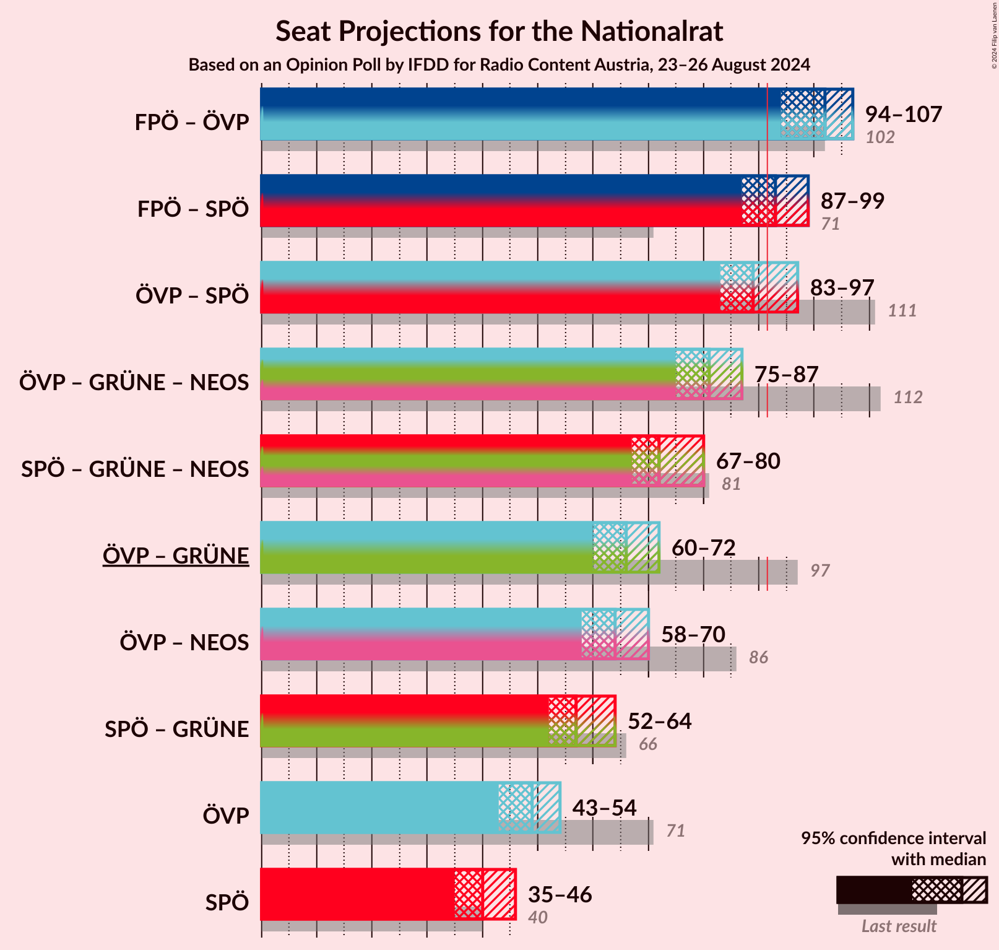
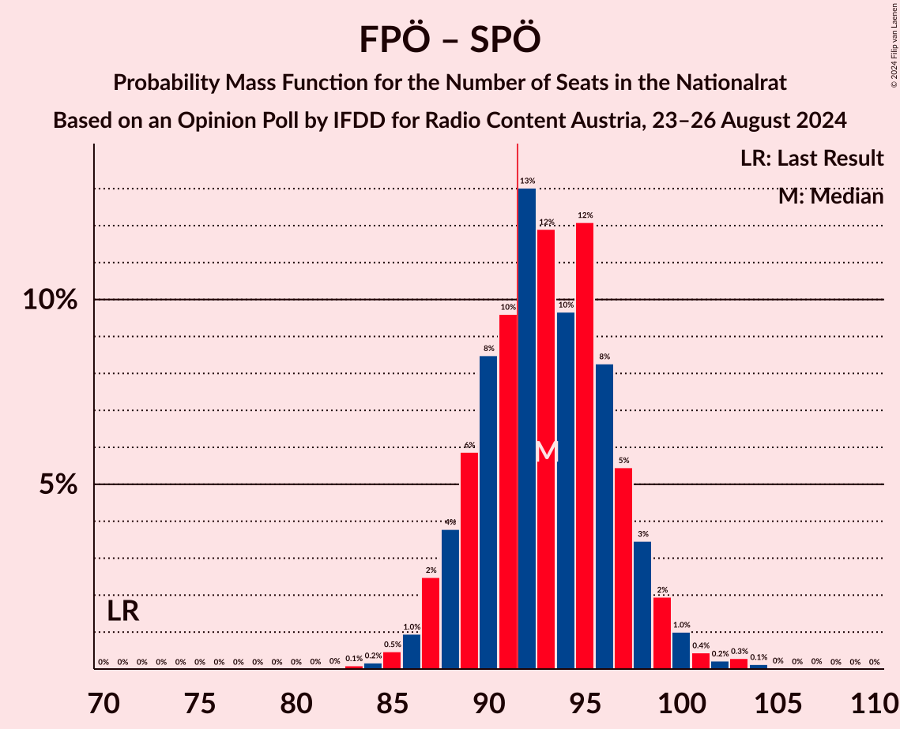
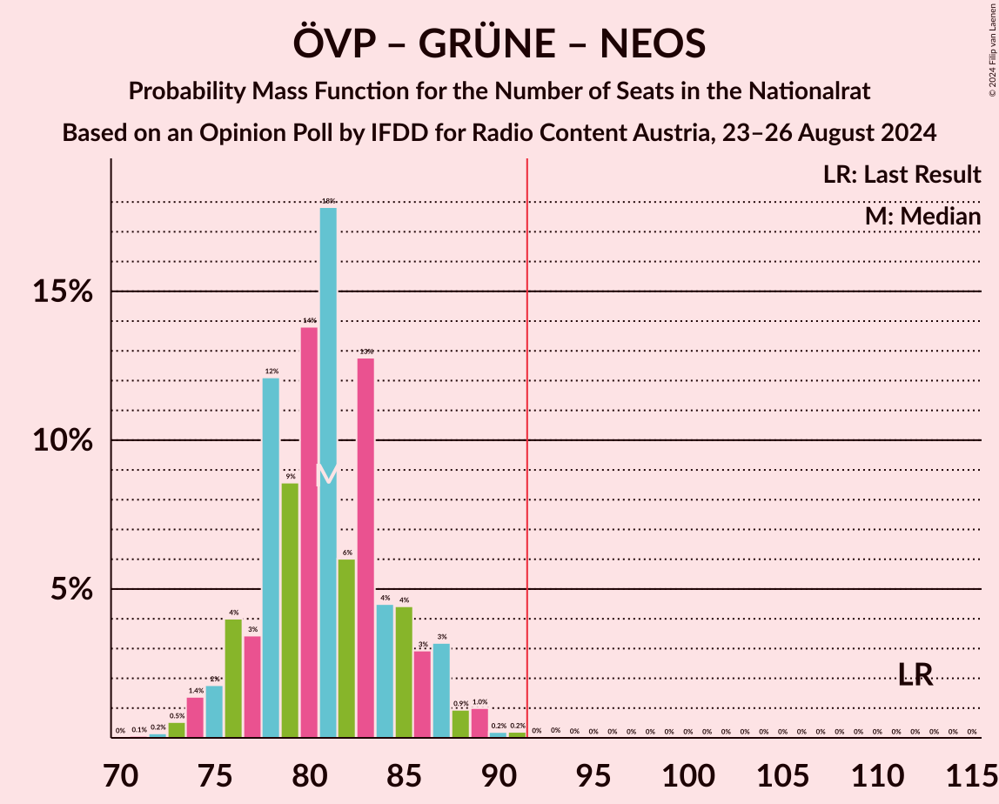

# Opinion Poll by IFDD for Radio Content Austria, 23–26 August 2024

<a href="#voting-intentions">Voting Intentions</a> | <a href="#seats">Seats</a> | <a href="#coalitions">Coalitions</a> | <a href="#technical-information">Technical Information</a>

## Voting Intentions

### Confidence Intervals

| Party | Last Result | Poll Result | 80% Confidence Interval | 90% Confidence Interval | 95% Confidence Interval | 99% Confidence Interval |
|:-----:|:-----------:|:-----------:|:-----------------------:|:-----------------------:|:-----------------------:|:-----------------------:|
| Freiheitliche Partei Österreichs | 16.2% | 27.0% | 25.2–28.8% |24.7–29.4% |24.2–29.8% |23.4–30.8% |
| Österreichische Volkspartei | 37.5% | 25.0% | 23.3–26.9% |22.8–27.4% |22.4–27.8% |21.6–28.7% |
| Sozialdemokratische Partei Österreichs | 21.2% | 21.0% | 19.4–22.7% |18.9–23.2% |18.5–23.7% |17.8–24.5% |
| Die Grünen–Die Grüne Alternative | 13.9% | 9.0% | 7.9–10.2% |7.6–10.6% |7.3–10.9% |6.8–11.6% |
| NEOS–Das Neue Österreich und Liberales Forum | 8.1% | 8.0% | 7.0–9.3% |6.7–9.6% |6.5–9.9% |6.0–10.5% |
| Bierpartei | 0.0% | 5.0% | 4.2–6.1% |4.0–6.4% |3.8–6.6% |3.5–7.1% |
| Kommunistische Partei Österreichs | 0.7% | 2.0% | 1.5–2.7% |1.4–2.9% |1.2–3.0% |1.1–3.4% |
| Liste Madeleine Petrovic | 0.0% | 1.0% | 0.7–1.6% |0.6–1.7% |0.6–1.9% |0.4–2.2% |
| Wandel | 0.0% | 1.0% | 0.7–1.6% |0.6–1.7% |0.6–1.9% |0.4–2.2% |

*Note:* The poll result column reflects the actual value used in the calculations. Published results may vary slightly, and in addition be rounded to fewer digits.

## Seats

### Confidence Intervals

| Party | Last Result | Median | 80% Confidence Interval | 90% Confidence Interval | 95% Confidence Interval | 99% Confidence Interval |
|:-----:|:-----------:|:------:|:-----------------------:|:-----------------------:|:-----------------------:|:-----------------------:|
| <a href="#freiheitliche-partei-österreichs">Freiheitliche Partei Österreichs</a> | 31 | 53 | 49–56 |48–57 |47–58 |45–60 |
| <a href="#österreichische-volkspartei">Österreichische Volkspartei</a> | 71 | 49 | 45–52 |44–53 |43–54 |42–56 |
| <a href="#sozialdemokratische-partei-österreichs">Sozialdemokratische Partei Österreichs</a> | 40 | 40 | 37–44 |36–45 |35–46 |34–48 |
| <a href="#die-grünen–die-grüne-alternative">Die Grünen–Die Grüne Alternative</a> | 26 | 17 | 15–20 |14–20 |14–21 |13–22 |
| <a href="#neos–das-neue-österreich-und-liberales-forum">NEOS–Das Neue Österreich und Liberales Forum</a> | 15 | 15 | 13–18 |12–18 |12–19 |11–20 |
| <a href="#bierpartei">Bierpartei</a> | 0 | 9 | 8–11 |0–12 |0–12 |0–13 |
| <a href="#kommunistische-partei-österreichs">Kommunistische Partei Österreichs</a> | 0 | 0 | 0 |0 |0 |0 |
| <a href="#liste-madeleine-petrovic">Liste Madeleine Petrovic</a> | 0 | 0 | 0 |0 |0 |0 |
| <a href="#wandel">Wandel</a> | 0 | 0 | 0 |0 |0 |0 |

### Freiheitliche Partei Österreichs

*For a full overview of the results for this party, see the [Freiheitliche Partei Österreichs](party-freiheitlicheparteiösterreichs.html) page.*

| Number of Seats | Probability | Accumulated | Special Marks |
|:---------------:|:-----------:|:-----------:|:-------------:|
| 31 | 0% | 100% | Last Result |
| 32 | 0% | 100% |  |
| 33 | 0% | 100% |  |
| 34 | 0% | 100% |  |
| 35 | 0% | 100% |  |
| 36 | 0% | 100% |  |
| 37 | 0% | 100% |  |
| 38 | 0% | 100% |  |
| 39 | 0% | 100% |  |
| 40 | 0% | 100% |  |
| 41 | 0% | 100% |  |
| 42 | 0% | 100% |  |
| 43 | 0.1% | 100% |  |
| 44 | 0.2% | 99.9% |  |
| 45 | 0.6% | 99.7% |  |
| 46 | 1.2% | 99.1% |  |
| 47 | 3% | 98% |  |
| 48 | 4% | 95% |  |
| 49 | 5% | 91% |  |
| 50 | 8% | 86% |  |
| 51 | 11% | 78% |  |
| 52 | 11% | 67% |  |
| 53 | 24% | 56% | Median |
| 54 | 10% | 32% |  |
| 55 | 8% | 22% |  |
| 56 | 8% | 14% |  |
| 57 | 3% | 6% |  |
| 58 | 3% | 4% |  |
| 59 | 0.4% | 1.0% |  |
| 60 | 0.4% | 0.6% |  |
| 61 | 0.1% | 0.2% |  |
| 62 | 0.1% | 0.1% |  |
| 63 | 0% | 0% |  |

### Österreichische Volkspartei

*For a full overview of the results for this party, see the [Österreichische Volkspartei](party-österreichischevolkspartei.html) page.*

| Number of Seats | Probability | Accumulated | Special Marks |
|:---------------:|:-----------:|:-----------:|:-------------:|
| 40 | 0.1% | 100% |  |
| 41 | 0.4% | 99.9% |  |
| 42 | 0.6% | 99.5% |  |
| 43 | 3% | 99.0% |  |
| 44 | 3% | 96% |  |
| 45 | 8% | 93% |  |
| 46 | 10% | 85% |  |
| 47 | 10% | 75% |  |
| 48 | 10% | 65% |  |
| 49 | 21% | 55% | Median |
| 50 | 9% | 34% |  |
| 51 | 9% | 24% |  |
| 52 | 6% | 15% |  |
| 53 | 6% | 9% |  |
| 54 | 2% | 4% |  |
| 55 | 1.5% | 2% |  |
| 56 | 0.3% | 0.6% |  |
| 57 | 0.1% | 0.2% |  |
| 58 | 0.1% | 0.1% |  |
| 59 | 0% | 0% |  |
| 60 | 0% | 0% |  |
| 61 | 0% | 0% |  |
| 62 | 0% | 0% |  |
| 63 | 0% | 0% |  |
| 64 | 0% | 0% |  |
| 65 | 0% | 0% |  |
| 66 | 0% | 0% |  |
| 67 | 0% | 0% |  |
| 68 | 0% | 0% |  |
| 69 | 0% | 0% |  |
| 70 | 0% | 0% |  |
| 71 | 0% | 0% | Last Result |

### Sozialdemokratische Partei Österreichs

*For a full overview of the results for this party, see the [Sozialdemokratische Partei Österreichs](party-sozialdemokratischeparteiösterreichs.html) page.*

| Number of Seats | Probability | Accumulated | Special Marks |
|:---------------:|:-----------:|:-----------:|:-------------:|
| 32 | 0% | 100% |  |
| 33 | 0.2% | 99.9% |  |
| 34 | 0.7% | 99.8% |  |
| 35 | 2% | 99.1% |  |
| 36 | 3% | 97% |  |
| 37 | 5% | 94% |  |
| 38 | 7% | 89% |  |
| 39 | 17% | 82% |  |
| 40 | 16% | 65% | Last Result, Median |
| 41 | 16% | 49% |  |
| 42 | 13% | 33% |  |
| 43 | 7% | 19% |  |
| 44 | 6% | 12% |  |
| 45 | 3% | 6% |  |
| 46 | 1.3% | 3% |  |
| 47 | 0.7% | 1.4% |  |
| 48 | 0.4% | 0.7% |  |
| 49 | 0.2% | 0.3% |  |
| 50 | 0% | 0.1% |  |
| 51 | 0% | 0% |  |

### Die Grünen–Die Grüne Alternative

*For a full overview of the results for this party, see the [Die Grünen–Die Grüne Alternative](party-diegrünen–diegrünealternative.html) page.*

| Number of Seats | Probability | Accumulated | Special Marks |
|:---------------:|:-----------:|:-----------:|:-------------:|
| 12 | 0.2% | 100% |  |
| 13 | 2% | 99.7% |  |
| 14 | 5% | 98% |  |
| 15 | 14% | 93% |  |
| 16 | 18% | 79% |  |
| 17 | 23% | 60% | Median |
| 18 | 15% | 38% |  |
| 19 | 11% | 22% |  |
| 20 | 8% | 11% |  |
| 21 | 3% | 3% |  |
| 22 | 0.6% | 0.9% |  |
| 23 | 0.2% | 0.3% |  |
| 24 | 0.1% | 0.1% |  |
| 25 | 0% | 0% |  |
| 26 | 0% | 0% | Last Result |

### NEOS–Das Neue Österreich und Liberales Forum

*For a full overview of the results for this party, see the [NEOS–Das Neue Österreich und Liberales Forum](party-neos–dasneueösterreichundliberalesforum.html) page.*

| Number of Seats | Probability | Accumulated | Special Marks |
|:---------------:|:-----------:|:-----------:|:-------------:|
| 10 | 0.1% | 100% |  |
| 11 | 0.7% | 99.9% |  |
| 12 | 4% | 99.2% |  |
| 13 | 11% | 95% |  |
| 14 | 16% | 84% |  |
| 15 | 23% | 67% | Last Result, Median |
| 16 | 24% | 44% |  |
| 17 | 10% | 20% |  |
| 18 | 6% | 10% |  |
| 19 | 3% | 4% |  |
| 20 | 0.6% | 0.9% |  |
| 21 | 0.2% | 0.3% |  |
| 22 | 0.1% | 0.1% |  |
| 23 | 0% | 0% |  |

### Bierpartei

*For a full overview of the results for this party, see the [Bierpartei](party-bierpartei.html) page.*

| Number of Seats | Probability | Accumulated | Special Marks |
|:---------------:|:-----------:|:-----------:|:-------------:|
| 0 | 5% | 100% | Last Result |
| 1 | 0% | 95% |  |
| 2 | 0% | 95% |  |
| 3 | 0% | 95% |  |
| 4 | 0% | 95% |  |
| 5 | 0% | 95% |  |
| 6 | 0% | 95% |  |
| 7 | 1.4% | 95% |  |
| 8 | 18% | 93% |  |
| 9 | 31% | 76% | Median |
| 10 | 19% | 45% |  |
| 11 | 18% | 25% |  |
| 12 | 5% | 8% |  |
| 13 | 2% | 2% |  |
| 14 | 0.2% | 0.3% |  |
| 15 | 0.1% | 0.1% |  |
| 16 | 0% | 0% |  |

### Kommunistische Partei Österreichs

*For a full overview of the results for this party, see the [Kommunistische Partei Österreichs](party-kommunistischeparteiösterreichs.html) page.*

| Number of Seats | Probability | Accumulated | Special Marks |
|:---------------:|:-----------:|:-----------:|:-------------:|
| 0 | 100% | 100% | Last Result, Median |

### Liste Madeleine Petrovic

*For a full overview of the results for this party, see the [Liste Madeleine Petrovic](party-listemadeleinepetrovic.html) page.*

| Number of Seats | Probability | Accumulated | Special Marks |
|:---------------:|:-----------:|:-----------:|:-------------:|
| 0 | 100% | 100% | Last Result, Median |

### Wandel

*For a full overview of the results for this party, see the [Wandel](party-wandel.html) page.*

| Number of Seats | Probability | Accumulated | Special Marks |
|:---------------:|:-----------:|:-----------:|:-------------:|
| 0 | 100% | 100% | Last Result, Median |

## Coalitions

### Confidence Intervals

| Coalition | Last Result | Median | Majority? | 80% Confidence Interval | 90% Confidence Interval | 95% Confidence Interval | 99% Confidence Interval |
|:---------:|:-----------:|:------:|:---------:|:-----------------------:|:-----------------------:|:-----------------------:|:-----------------------:|
| Freiheitliche Partei Österreichs – Österreichische Volkspartei | 102 | 102 | 99.9% | 96–104 | 95–105 | 94–107 | 93–110 |
| Freiheitliche Partei Österreichs – Sozialdemokratische Partei Österreichs | 71 | 93 | 68% | 89–97 | 88–98 | 87–99 | 85–102 |
| Österreichische Volkspartei – Sozialdemokratische Partei Österreichs | 111 | 89 | 23% | 85–93 | 84–95 | 83–97 | 81–99 |
| Österreichische Volkspartei – Die Grünen–Die Grüne Alternative – NEOS–Das Neue Österreich und Liberales Forum | 112 | 81 | 0.1% | 77–85 | 76–87 | 75–87 | 73–90 |
| Sozialdemokratische Partei Österreichs – Die Grünen–Die Grüne Alternative – NEOS–Das Neue Österreich und Liberales Forum | 81 | 72 | 0% | 69–77 | 68–79 | 67–80 | 66–81 |
| Österreichische Volkspartei – Die Grünen–Die Grüne Alternative | 97 | 66 | 0% | 62–70 | 61–71 | 60–72 | 58–74 |
| Österreichische Volkspartei – NEOS–Das Neue Österreich und Liberales Forum | 86 | 64 | 0% | 60–68 | 59–69 | 58–70 | 56–72 |
| Sozialdemokratische Partei Österreichs – Die Grünen–Die Grüne Alternative | 66 | 57 | 0% | 54–62 | 53–63 | 52–64 | 51–66 |
| Österreichische Volkspartei | 71 | 49 | 0% | 45–52 | 44–53 | 43–54 | 42–56 |
| Sozialdemokratische Partei Österreichs | 40 | 40 | 0% | 37–44 | 36–45 | 35–46 | 34–48 |

### Freiheitliche Partei Österreichs – Österreichische Volkspartei

| Number of Seats | Probability | Accumulated | Special Marks |
|:---------------:|:-----------:|:-----------:|:-------------:|
| 91 | 0.1% | 100% |  |
| 92 | 0.4% | 99.9% | Majority |
| 93 | 1.2% | 99.5% |  |
| 94 | 3% | 98% |  |
| 95 | 5% | 96% |  |
| 96 | 3% | 91% |  |
| 97 | 2% | 88% |  |
| 98 | 1.4% | 86% |  |
| 99 | 7% | 84% |  |
| 100 | 8% | 78% |  |
| 101 | 16% | 70% |  |
| 102 | 27% | 54% | Last Result, Median |
| 103 | 12% | 27% |  |
| 104 | 7% | 15% |  |
| 105 | 4% | 9% |  |
| 106 | 2% | 5% |  |
| 107 | 1.0% | 3% |  |
| 108 | 0.9% | 2% |  |
| 109 | 0.3% | 0.9% |  |
| 110 | 0.2% | 0.6% |  |
| 111 | 0.1% | 0.4% |  |
| 112 | 0.2% | 0.3% |  |
| 113 | 0.1% | 0.1% |  |
| 114 | 0% | 0% |  |

### Freiheitliche Partei Österreichs – Sozialdemokratische Partei Österreichs

| Number of Seats | Probability | Accumulated | Special Marks |
|:---------------:|:-----------:|:-----------:|:-------------:|
| 71 | 0% | 100% | Last Result |
| 72 | 0% | 100% |  |
| 73 | 0% | 100% |  |
| 74 | 0% | 100% |  |
| 75 | 0% | 100% |  |
| 76 | 0% | 100% |  |
| 77 | 0% | 100% |  |
| 78 | 0% | 100% |  |
| 79 | 0% | 100% |  |
| 80 | 0% | 100% |  |
| 81 | 0% | 100% |  |
| 82 | 0% | 100% |  |
| 83 | 0.1% | 100% |  |
| 84 | 0.2% | 99.9% |  |
| 85 | 0.5% | 99.7% |  |
| 86 | 1.0% | 99.2% |  |
| 87 | 2% | 98% |  |
| 88 | 4% | 96% |  |
| 89 | 6% | 92% |  |
| 90 | 8% | 86% |  |
| 91 | 10% | 78% |  |
| 92 | 13% | 68% | Majority |
| 93 | 12% | 55% | Median |
| 94 | 10% | 43% |  |
| 95 | 12% | 33% |  |
| 96 | 8% | 21% |  |
| 97 | 5% | 13% |  |
| 98 | 3% | 8% |  |
| 99 | 2% | 4% |  |
| 100 | 1.0% | 2% |  |
| 101 | 0.4% | 1.2% |  |
| 102 | 0.2% | 0.7% |  |
| 103 | 0.3% | 0.5% |  |
| 104 | 0.1% | 0.2% |  |
| 105 | 0% | 0.1% |  |
| 106 | 0% | 0% |  |

### Österreichische Volkspartei – Sozialdemokratische Partei Österreichs

| Number of Seats | Probability | Accumulated | Special Marks |
|:---------------:|:-----------:|:-----------:|:-------------:|
| 79 | 0.1% | 100% |  |
| 80 | 0.3% | 99.9% |  |
| 81 | 0.4% | 99.6% |  |
| 82 | 1.3% | 99.3% |  |
| 83 | 3% | 98% |  |
| 84 | 4% | 95% |  |
| 85 | 7% | 91% |  |
| 86 | 7% | 83% |  |
| 87 | 5% | 76% |  |
| 88 | 14% | 71% |  |
| 89 | 12% | 57% | Median |
| 90 | 11% | 45% |  |
| 91 | 10% | 33% |  |
| 92 | 9% | 23% | Majority |
| 93 | 6% | 14% |  |
| 94 | 3% | 8% |  |
| 95 | 2% | 5% |  |
| 96 | 0.7% | 3% |  |
| 97 | 1.4% | 3% |  |
| 98 | 0.4% | 1.2% |  |
| 99 | 0.3% | 0.8% |  |
| 100 | 0.3% | 0.4% |  |
| 101 | 0% | 0.1% |  |
| 102 | 0.1% | 0.1% |  |
| 103 | 0% | 0% |  |
| 104 | 0% | 0% |  |
| 105 | 0% | 0% |  |
| 106 | 0% | 0% |  |
| 107 | 0% | 0% |  |
| 108 | 0% | 0% |  |
| 109 | 0% | 0% |  |
| 110 | 0% | 0% |  |
| 111 | 0% | 0% | Last Result |

### Österreichische Volkspartei – Die Grünen–Die Grüne Alternative – NEOS–Das Neue Österreich und Liberales Forum

| Number of Seats | Probability | Accumulated | Special Marks |
|:---------------:|:-----------:|:-----------:|:-------------:|
| 71 | 0.1% | 100% |  |
| 72 | 0.2% | 99.9% |  |
| 73 | 0.5% | 99.7% |  |
| 74 | 1.4% | 99.2% |  |
| 75 | 2% | 98% |  |
| 76 | 4% | 96% |  |
| 77 | 3% | 92% |  |
| 78 | 12% | 89% |  |
| 79 | 9% | 77% |  |
| 80 | 14% | 68% |  |
| 81 | 18% | 54% | Median |
| 82 | 6% | 36% |  |
| 83 | 13% | 30% |  |
| 84 | 4% | 18% |  |
| 85 | 4% | 13% |  |
| 86 | 3% | 9% |  |
| 87 | 3% | 6% |  |
| 88 | 0.9% | 2% |  |
| 89 | 1.0% | 2% |  |
| 90 | 0.2% | 0.5% |  |
| 91 | 0.2% | 0.3% |  |
| 92 | 0% | 0.1% | Majority |
| 93 | 0% | 0.1% |  |
| 94 | 0% | 0% |  |
| 95 | 0% | 0% |  |
| 96 | 0% | 0% |  |
| 97 | 0% | 0% |  |
| 98 | 0% | 0% |  |
| 99 | 0% | 0% |  |
| 100 | 0% | 0% |  |
| 101 | 0% | 0% |  |
| 102 | 0% | 0% |  |
| 103 | 0% | 0% |  |
| 104 | 0% | 0% |  |
| 105 | 0% | 0% |  |
| 106 | 0% | 0% |  |
| 107 | 0% | 0% |  |
| 108 | 0% | 0% |  |
| 109 | 0% | 0% |  |
| 110 | 0% | 0% |  |
| 111 | 0% | 0% |  |
| 112 | 0% | 0% | Last Result |

### Sozialdemokratische Partei Österreichs – Die Grünen–Die Grüne Alternative – NEOS–Das Neue Österreich und Liberales Forum

| Number of Seats | Probability | Accumulated | Special Marks |
|:---------------:|:-----------:|:-----------:|:-------------:|
| 63 | 0% | 100% |  |
| 64 | 0.1% | 99.9% |  |
| 65 | 0.3% | 99.8% |  |
| 66 | 0.4% | 99.6% |  |
| 67 | 2% | 99.2% |  |
| 68 | 3% | 97% |  |
| 69 | 7% | 94% |  |
| 70 | 12% | 87% |  |
| 71 | 10% | 76% |  |
| 72 | 18% | 66% | Median |
| 73 | 14% | 48% |  |
| 74 | 6% | 34% |  |
| 75 | 11% | 28% |  |
| 76 | 4% | 17% |  |
| 77 | 4% | 13% |  |
| 78 | 4% | 10% |  |
| 79 | 2% | 5% |  |
| 80 | 2% | 3% |  |
| 81 | 1.0% | 1.3% | Last Result |
| 82 | 0.2% | 0.3% |  |
| 83 | 0.1% | 0.2% |  |
| 84 | 0% | 0.1% |  |
| 85 | 0% | 0% |  |

### Österreichische Volkspartei – Die Grünen–Die Grüne Alternative

| Number of Seats | Probability | Accumulated | Special Marks |
|:---------------:|:-----------:|:-----------:|:-------------:|
| 56 | 0.1% | 100% |  |
| 57 | 0.2% | 99.9% |  |
| 58 | 0.4% | 99.8% |  |
| 59 | 1.5% | 99.4% |  |
| 60 | 2% | 98% |  |
| 61 | 4% | 96% |  |
| 62 | 10% | 92% |  |
| 63 | 7% | 82% |  |
| 64 | 10% | 75% |  |
| 65 | 15% | 65% |  |
| 66 | 15% | 50% | Median |
| 67 | 8% | 35% |  |
| 68 | 10% | 28% |  |
| 69 | 7% | 18% |  |
| 70 | 4% | 11% |  |
| 71 | 4% | 7% |  |
| 72 | 2% | 3% |  |
| 73 | 0.8% | 2% |  |
| 74 | 0.5% | 0.7% |  |
| 75 | 0.1% | 0.3% |  |
| 76 | 0.1% | 0.1% |  |
| 77 | 0% | 0.1% |  |
| 78 | 0% | 0% |  |
| 79 | 0% | 0% |  |
| 80 | 0% | 0% |  |
| 81 | 0% | 0% |  |
| 82 | 0% | 0% |  |
| 83 | 0% | 0% |  |
| 84 | 0% | 0% |  |
| 85 | 0% | 0% |  |
| 86 | 0% | 0% |  |
| 87 | 0% | 0% |  |
| 88 | 0% | 0% |  |
| 89 | 0% | 0% |  |
| 90 | 0% | 0% |  |
| 91 | 0% | 0% |  |
| 92 | 0% | 0% | Majority |
| 93 | 0% | 0% |  |
| 94 | 0% | 0% |  |
| 95 | 0% | 0% |  |
| 96 | 0% | 0% |  |
| 97 | 0% | 0% | Last Result |

### Österreichische Volkspartei – NEOS–Das Neue Österreich und Liberales Forum

| Number of Seats | Probability | Accumulated | Special Marks |
|:---------------:|:-----------:|:-----------:|:-------------:|
| 54 | 0.1% | 100% |  |
| 55 | 0.2% | 99.9% |  |
| 56 | 0.6% | 99.7% |  |
| 57 | 0.6% | 99.1% |  |
| 58 | 2% | 98.5% |  |
| 59 | 4% | 97% |  |
| 60 | 6% | 93% |  |
| 61 | 10% | 87% |  |
| 62 | 8% | 77% |  |
| 63 | 13% | 68% |  |
| 64 | 14% | 55% | Median |
| 65 | 17% | 41% |  |
| 66 | 9% | 25% |  |
| 67 | 5% | 15% |  |
| 68 | 3% | 11% |  |
| 69 | 5% | 8% |  |
| 70 | 2% | 4% |  |
| 71 | 1.1% | 2% |  |
| 72 | 0.3% | 0.7% |  |
| 73 | 0.2% | 0.4% |  |
| 74 | 0.1% | 0.2% |  |
| 75 | 0.1% | 0.1% |  |
| 76 | 0% | 0% |  |
| 77 | 0% | 0% |  |
| 78 | 0% | 0% |  |
| 79 | 0% | 0% |  |
| 80 | 0% | 0% |  |
| 81 | 0% | 0% |  |
| 82 | 0% | 0% |  |
| 83 | 0% | 0% |  |
| 84 | 0% | 0% |  |
| 85 | 0% | 0% |  |
| 86 | 0% | 0% | Last Result |

### Sozialdemokratische Partei Österreichs – Die Grünen–Die Grüne Alternative

| Number of Seats | Probability | Accumulated | Special Marks |
|:---------------:|:-----------:|:-----------:|:-------------:|
| 49 | 0.1% | 100% |  |
| 50 | 0.2% | 99.9% |  |
| 51 | 1.2% | 99.7% |  |
| 52 | 2% | 98% |  |
| 53 | 3% | 96% |  |
| 54 | 5% | 93% |  |
| 55 | 7% | 88% |  |
| 56 | 20% | 80% |  |
| 57 | 15% | 61% | Median |
| 58 | 13% | 45% |  |
| 59 | 8% | 33% |  |
| 60 | 9% | 25% |  |
| 61 | 6% | 16% |  |
| 62 | 5% | 10% |  |
| 63 | 3% | 5% |  |
| 64 | 1.4% | 3% |  |
| 65 | 0.7% | 1.3% |  |
| 66 | 0.3% | 0.6% | Last Result |
| 67 | 0.1% | 0.2% |  |
| 68 | 0.1% | 0.1% |  |
| 69 | 0% | 0% |  |

### Österreichische Volkspartei

| Number of Seats | Probability | Accumulated | Special Marks |
|:---------------:|:-----------:|:-----------:|:-------------:|
| 40 | 0.1% | 100% |  |
| 41 | 0.4% | 99.9% |  |
| 42 | 0.6% | 99.5% |  |
| 43 | 3% | 99.0% |  |
| 44 | 3% | 96% |  |
| 45 | 8% | 93% |  |
| 46 | 10% | 85% |  |
| 47 | 10% | 75% |  |
| 48 | 10% | 65% |  |
| 49 | 21% | 55% | Median |
| 50 | 9% | 34% |  |
| 51 | 9% | 24% |  |
| 52 | 6% | 15% |  |
| 53 | 6% | 9% |  |
| 54 | 2% | 4% |  |
| 55 | 1.5% | 2% |  |
| 56 | 0.3% | 0.6% |  |
| 57 | 0.1% | 0.2% |  |
| 58 | 0.1% | 0.1% |  |
| 59 | 0% | 0% |  |
| 60 | 0% | 0% |  |
| 61 | 0% | 0% |  |
| 62 | 0% | 0% |  |
| 63 | 0% | 0% |  |
| 64 | 0% | 0% |  |
| 65 | 0% | 0% |  |
| 66 | 0% | 0% |  |
| 67 | 0% | 0% |  |
| 68 | 0% | 0% |  |
| 69 | 0% | 0% |  |
| 70 | 0% | 0% |  |
| 71 | 0% | 0% | Last Result |

### Sozialdemokratische Partei Österreichs

| Number of Seats | Probability | Accumulated | Special Marks |
|:---------------:|:-----------:|:-----------:|:-------------:|
| 32 | 0% | 100% |  |
| 33 | 0.2% | 99.9% |  |
| 34 | 0.7% | 99.8% |  |
| 35 | 2% | 99.1% |  |
| 36 | 3% | 97% |  |
| 37 | 5% | 94% |  |
| 38 | 7% | 89% |  |
| 39 | 17% | 82% |  |
| 40 | 16% | 65% | Last Result, Median |
| 41 | 16% | 49% |  |
| 42 | 13% | 33% |  |
| 43 | 7% | 19% |  |
| 44 | 6% | 12% |  |
| 45 | 3% | 6% |  |
| 46 | 1.3% | 3% |  |
| 47 | 0.7% | 1.4% |  |
| 48 | 0.4% | 0.7% |  |
| 49 | 0.2% | 0.3% |  |
| 50 | 0% | 0.1% |  |
| 51 | 0% | 0% |  |

## Technical Information

### Opinion Poll

+ **Polling firm:** IFDD
+ **Commissioner(s):** Radio Content Austria
+ **Fieldwork period:** 23–26 August 2024

### Calculations

+ **Sample size:** 972
+ **Simulations done:** 2,097,152
+ **Error estimate:** 1.13%

