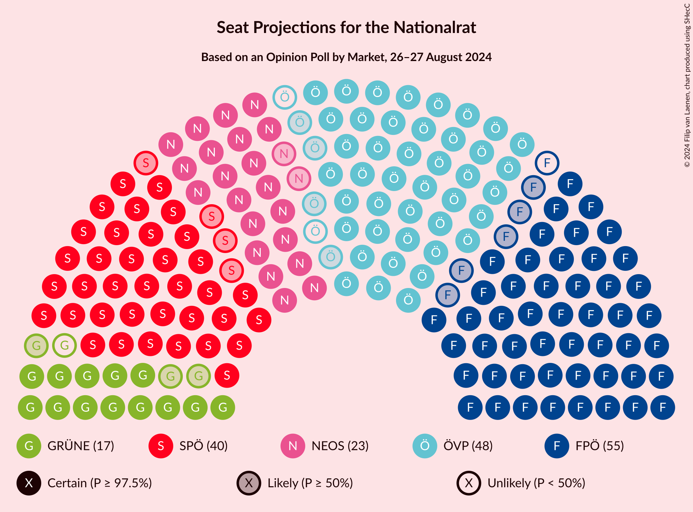
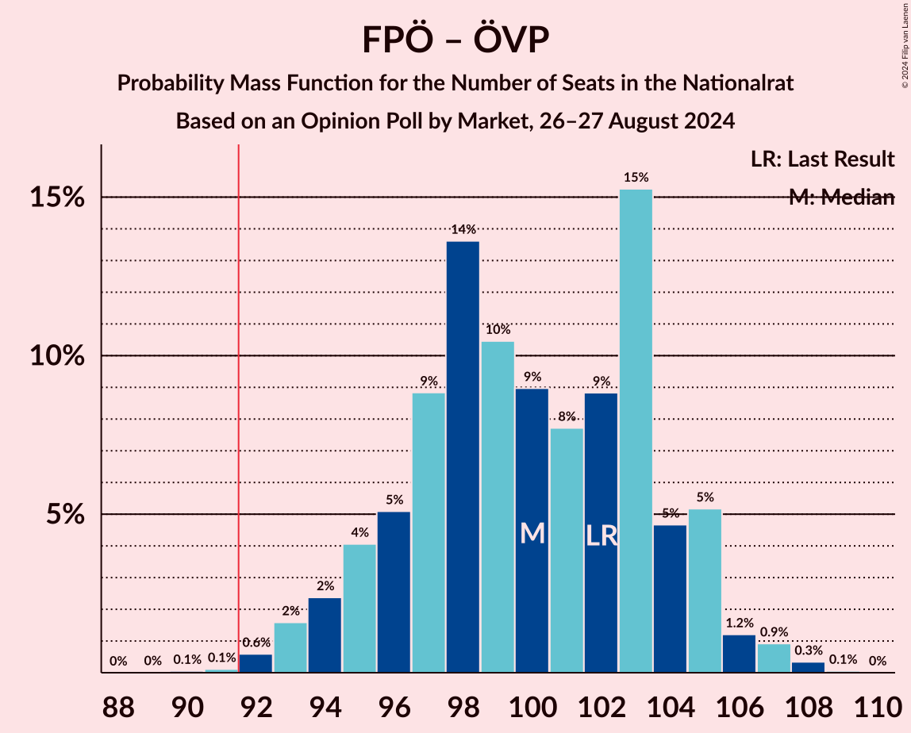
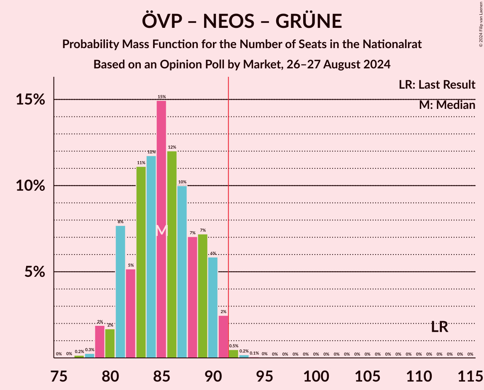
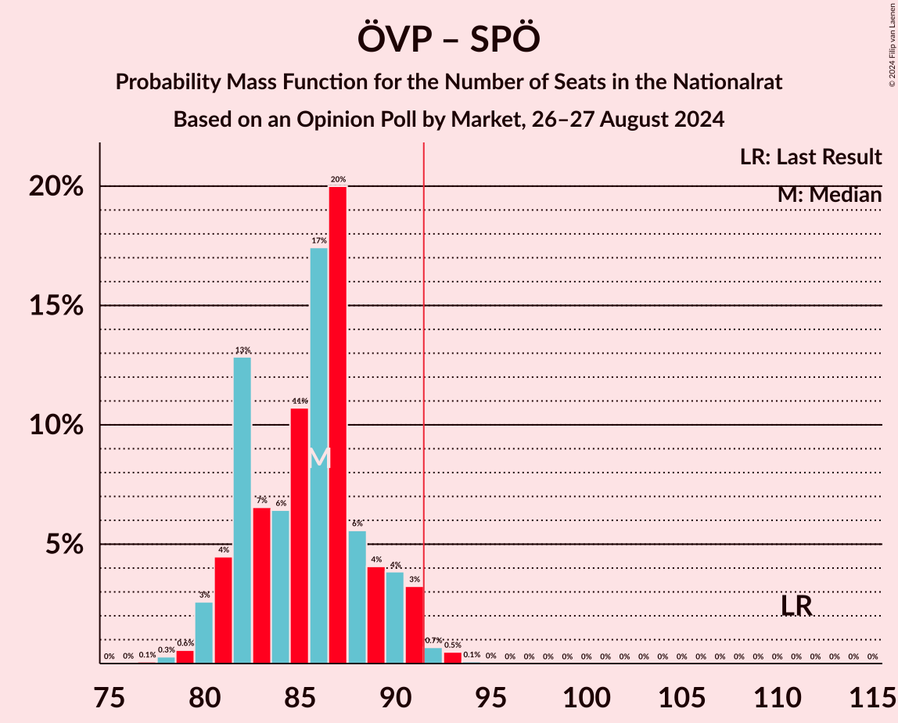
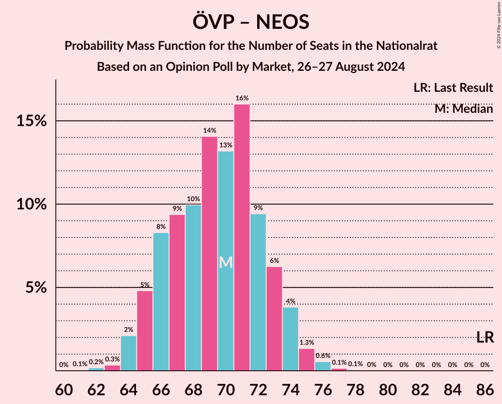

# Opinion Poll by Market, 26–27 August 2024

<a href="#voting-intentions">Voting Intentions</a> | <a href="#seats">Seats</a> | <a href="#coalitions">Coalitions</a> | <a href="#technical-information">Technical Information</a>

## Voting Intentions

### Confidence Intervals

| Party | Last Result | Poll Result | 80% Confidence Interval | 90% Confidence Interval | 95% Confidence Interval | 99% Confidence Interval |
|:-----:|:-----------:|:-----------:|:-----------------------:|:-----------------------:|:-----------------------:|:-----------------------:|
| Freiheitliche Partei Österreichs | 16.2% | 27.0% | 25.7–28.3% |25.4–28.7% |25.1–29.0% |24.5–29.6% |
| Österreichische Volkspartei | 37.5% | 23.0% | 21.8–24.2% |21.5–24.6% |21.2–24.9% |20.7–25.5% |
| Sozialdemokratische Partei Österreichs | 21.2% | 20.0% | 18.9–21.2% |18.6–21.5% |18.3–21.8% |17.8–22.4% |
| NEOS–Das Neue Österreich und Liberales Forum | 8.1% | 12.0% | 11.1–13.0% |10.9–13.3% |10.6–13.5% |10.2–14.0% |
| Die Grünen–Die Grüne Alternative | 13.9% | 8.0% | 7.3–8.8% |7.1–9.1% |6.9–9.3% |6.6–9.7% |
| Bierpartei | 0.0% | 4.0% | 3.5–4.6% |3.3–4.8% |3.2–5.0% |3.0–5.3% |
| Kommunistische Partei Österreichs | 0.7% | 3.0% | 2.6–3.6% |2.4–3.7% |2.3–3.9% |2.1–4.1% |
| Liste Madeleine Petrovic | 0.0% | 1.0% | 0.8–1.4% |0.7–1.5% |0.6–1.5% |0.5–1.7% |
| Wandel | 0.0% | 1.0% | 0.8–1.4% |0.7–1.5% |0.6–1.5% |0.5–1.7% |

*Note:* The poll result column reflects the actual value used in the calculations. Published results may vary slightly, and in addition be rounded to fewer digits.

## Seats

### Confidence Intervals

| Party | Last Result | Median | 80% Confidence Interval | 90% Confidence Interval | 95% Confidence Interval | 99% Confidence Interval |
|:-----:|:-----------:|:------:|:-----------------------:|:-----------------------:|:-----------------------:|:-----------------------:|
| <a href="#freiheitliche-partei-österreichs">Freiheitliche Partei Österreichs</a> | 31 | 54 | 51–58 |50–58 |49–59 |48–60 |
| <a href="#österreichische-volkspartei">Österreichische Volkspartei</a> | 71 | 46 | 43–48 |42–49 |42–50 |41–51 |
| <a href="#sozialdemokratische-partei-österreichs">Sozialdemokratische Partei Österreichs</a> | 40 | 40 | 37–42 |36–43 |36–44 |35–45 |
| <a href="#neos–das-neue-österreich-und-liberales-forum">NEOS–Das Neue Österreich und Liberales Forum</a> | 15 | 23 | 22–25 |21–26 |21–27 |20–28 |
| <a href="#die-grünen–die-grüne-alternative">Die Grünen–Die Grüne Alternative</a> | 26 | 16 | 14–17 |14–18 |13–18 |13–19 |
| <a href="#bierpartei">Bierpartei</a> | 0 | 0 | 0–9 |0–9 |0–9 |0–10 |
| <a href="#kommunistische-partei-österreichs">Kommunistische Partei Österreichs</a> | 0 | 0 | 0 |0 |0 |0–8 |
| <a href="#liste-madeleine-petrovic">Liste Madeleine Petrovic</a> | 0 | 0 | 0 |0 |0 |0 |
| <a href="#wandel">Wandel</a> | 0 | 0 | 0 |0 |0 |0 |

### Freiheitliche Partei Österreichs

*For a full overview of the results for this party, see the [Freiheitliche Partei Österreichs](party-freiheitlicheparteiösterreichs.html) page.*

| Number of Seats | Probability | Accumulated | Special Marks |
|:---------------:|:-----------:|:-----------:|:-------------:|
| 31 | 0% | 100% | Last Result |
| 32 | 0% | 100% |  |
| 33 | 0% | 100% |  |
| 34 | 0% | 100% |  |
| 35 | 0% | 100% |  |
| 36 | 0% | 100% |  |
| 37 | 0% | 100% |  |
| 38 | 0% | 100% |  |
| 39 | 0% | 100% |  |
| 40 | 0% | 100% |  |
| 41 | 0% | 100% |  |
| 42 | 0% | 100% |  |
| 43 | 0% | 100% |  |
| 44 | 0% | 100% |  |
| 45 | 0% | 100% |  |
| 46 | 0% | 100% |  |
| 47 | 0.2% | 100% |  |
| 48 | 1.0% | 99.8% |  |
| 49 | 2% | 98.8% |  |
| 50 | 6% | 97% |  |
| 51 | 8% | 91% |  |
| 52 | 11% | 82% |  |
| 53 | 10% | 72% |  |
| 54 | 14% | 62% | Median |
| 55 | 19% | 48% |  |
| 56 | 11% | 29% |  |
| 57 | 7% | 18% |  |
| 58 | 8% | 10% |  |
| 59 | 2% | 3% |  |
| 60 | 0.6% | 0.8% |  |
| 61 | 0.1% | 0.1% |  |
| 62 | 0% | 0% |  |

### Österreichische Volkspartei

*For a full overview of the results for this party, see the [Österreichische Volkspartei](party-österreichischevolkspartei.html) page.*

| Number of Seats | Probability | Accumulated | Special Marks |
|:---------------:|:-----------:|:-----------:|:-------------:|
| 39 | 0.1% | 100% |  |
| 40 | 0.4% | 99.9% |  |
| 41 | 2% | 99.6% |  |
| 42 | 3% | 98% |  |
| 43 | 8% | 95% |  |
| 44 | 15% | 86% |  |
| 45 | 13% | 72% |  |
| 46 | 19% | 59% | Median |
| 47 | 16% | 40% |  |
| 48 | 16% | 24% |  |
| 49 | 5% | 8% |  |
| 50 | 2% | 3% |  |
| 51 | 1.0% | 1.3% |  |
| 52 | 0.3% | 0.4% |  |
| 53 | 0.1% | 0.1% |  |
| 54 | 0% | 0% |  |
| 55 | 0% | 0% |  |
| 56 | 0% | 0% |  |
| 57 | 0% | 0% |  |
| 58 | 0% | 0% |  |
| 59 | 0% | 0% |  |
| 60 | 0% | 0% |  |
| 61 | 0% | 0% |  |
| 62 | 0% | 0% |  |
| 63 | 0% | 0% |  |
| 64 | 0% | 0% |  |
| 65 | 0% | 0% |  |
| 66 | 0% | 0% |  |
| 67 | 0% | 0% |  |
| 68 | 0% | 0% |  |
| 69 | 0% | 0% |  |
| 70 | 0% | 0% |  |
| 71 | 0% | 0% | Last Result |

### Sozialdemokratische Partei Österreichs

*For a full overview of the results for this party, see the [Sozialdemokratische Partei Österreichs](party-sozialdemokratischeparteiösterreichs.html) page.*

| Number of Seats | Probability | Accumulated | Special Marks |
|:---------------:|:-----------:|:-----------:|:-------------:|
| 34 | 0.2% | 100% |  |
| 35 | 0.9% | 99.7% |  |
| 36 | 5% | 98.9% |  |
| 37 | 8% | 93% |  |
| 38 | 12% | 85% |  |
| 39 | 23% | 73% |  |
| 40 | 23% | 50% | Last Result, Median |
| 41 | 11% | 27% |  |
| 42 | 7% | 16% |  |
| 43 | 6% | 9% |  |
| 44 | 3% | 4% |  |
| 45 | 0.7% | 1.0% |  |
| 46 | 0.2% | 0.3% |  |
| 47 | 0.1% | 0.1% |  |
| 48 | 0% | 0% |  |

### NEOS–Das Neue Österreich und Liberales Forum

*For a full overview of the results for this party, see the [NEOS–Das Neue Österreich und Liberales Forum](party-neos–dasneueösterreichundliberalesforum.html) page.*

| Number of Seats | Probability | Accumulated | Special Marks |
|:---------------:|:-----------:|:-----------:|:-------------:|
| 15 | 0% | 100% | Last Result |
| 16 | 0% | 100% |  |
| 17 | 0% | 100% |  |
| 18 | 0% | 100% |  |
| 19 | 0.1% | 100% |  |
| 20 | 0.9% | 99.8% |  |
| 21 | 5% | 99.0% |  |
| 22 | 18% | 94% |  |
| 23 | 27% | 76% | Median |
| 24 | 22% | 48% |  |
| 25 | 16% | 26% |  |
| 26 | 6% | 10% |  |
| 27 | 3% | 4% |  |
| 28 | 0.7% | 0.9% |  |
| 29 | 0.2% | 0.2% |  |
| 30 | 0% | 0% |  |

### Die Grünen–Die Grüne Alternative

*For a full overview of the results for this party, see the [Die Grünen–Die Grüne Alternative](party-diegrünen–diegrünealternative.html) page.*

| Number of Seats | Probability | Accumulated | Special Marks |
|:---------------:|:-----------:|:-----------:|:-------------:|
| 12 | 0.5% | 100% |  |
| 13 | 3% | 99.5% |  |
| 14 | 12% | 96% |  |
| 15 | 23% | 84% |  |
| 16 | 28% | 61% | Median |
| 17 | 25% | 33% |  |
| 18 | 7% | 8% |  |
| 19 | 0.9% | 1.2% |  |
| 20 | 0.2% | 0.3% |  |
| 21 | 0% | 0% |  |
| 22 | 0% | 0% |  |
| 23 | 0% | 0% |  |
| 24 | 0% | 0% |  |
| 25 | 0% | 0% |  |
| 26 | 0% | 0% | Last Result |

### Bierpartei

*For a full overview of the results for this party, see the [Bierpartei](party-bierpartei.html) page.*

| Number of Seats | Probability | Accumulated | Special Marks |
|:---------------:|:-----------:|:-----------:|:-------------:|
| 0 | 52% | 100% | Last Result, Median |
| 1 | 0% | 48% |  |
| 2 | 0% | 48% |  |
| 3 | 0% | 48% |  |
| 4 | 0% | 48% |  |
| 5 | 0% | 48% |  |
| 6 | 0% | 48% |  |
| 7 | 7% | 48% |  |
| 8 | 27% | 41% |  |
| 9 | 14% | 15% |  |
| 10 | 0.9% | 1.0% |  |
| 11 | 0.1% | 0.1% |  |
| 12 | 0% | 0% |  |

### Kommunistische Partei Österreichs

*For a full overview of the results for this party, see the [Kommunistische Partei Österreichs](party-kommunistischeparteiösterreichs.html) page.*

| Number of Seats | Probability | Accumulated | Special Marks |
|:---------------:|:-----------:|:-----------:|:-------------:|
| 0 | 99.0% | 100% | Last Result, Median |
| 1 | 0% | 1.0% |  |
| 2 | 0% | 1.0% |  |
| 3 | 0% | 1.0% |  |
| 4 | 0% | 1.0% |  |
| 5 | 0% | 1.0% |  |
| 6 | 0% | 1.0% |  |
| 7 | 0.4% | 1.0% |  |
| 8 | 0.6% | 0.6% |  |
| 9 | 0% | 0% |  |

### Liste Madeleine Petrovic

*For a full overview of the results for this party, see the [Liste Madeleine Petrovic](party-listemadeleinepetrovic.html) page.*

| Number of Seats | Probability | Accumulated | Special Marks |
|:---------------:|:-----------:|:-----------:|:-------------:|
| 0 | 100% | 100% | Last Result, Median |

### Wandel

*For a full overview of the results for this party, see the [Wandel](party-wandel.html) page.*

| Number of Seats | Probability | Accumulated | Special Marks |
|:---------------:|:-----------:|:-----------:|:-------------:|
| 0 | 100% | 100% | Last Result, Median |

## Coalitions

### Confidence Intervals

| Coalition | Last Result | Median | Majority? | 80% Confidence Interval | 90% Confidence Interval | 95% Confidence Interval | 99% Confidence Interval |
|:---------:|:-----------:|:------:|:---------:|:-----------------------:|:-----------------------:|:-----------------------:|:-----------------------:|
| Freiheitliche Partei Österreichs – Österreichische Volkspartei | 102 | 100 | 99.8% | 96–104 | 95–105 | 94–106 | 92–107 |
| Freiheitliche Partei Österreichs – Sozialdemokratische Partei Österreichs | 71 | 94 | 73% | 89–98 | 89–99 | 88–99 | 86–101 |
| Österreichische Volkspartei – NEOS–Das Neue Österreich und Liberales Forum – Die Grünen–Die Grüne Alternative | 112 | 85 | 0.8% | 81–89 | 81–90 | 80–91 | 79–92 |
| Österreichische Volkspartei – Sozialdemokratische Partei Österreichs | 111 | 86 | 1.3% | 82–89 | 81–90 | 80–91 | 79–93 |
| Sozialdemokratische Partei Österreichs – NEOS–Das Neue Österreich und Liberales Forum – Die Grünen–Die Grüne Alternative | 81 | 79 | 0% | 76–83 | 75–84 | 74–85 | 72–86 |
| Österreichische Volkspartei – NEOS–Das Neue Österreich und Liberales Forum | 86 | 70 | 0% | 66–73 | 65–74 | 64–74 | 63–76 |
| Österreichische Volkspartei – Die Grünen–Die Grüne Alternative | 97 | 62 | 0% | 59–65 | 58–66 | 57–66 | 55–68 |
| Sozialdemokratische Partei Österreichs – Die Grünen–Die Grüne Alternative | 66 | 55 | 0% | 52–59 | 51–60 | 51–60 | 50–61 |
| Österreichische Volkspartei | 71 | 46 | 0% | 43–48 | 42–49 | 42–50 | 41–51 |
| Sozialdemokratische Partei Österreichs | 40 | 40 | 0% | 37–42 | 36–43 | 36–44 | 35–45 |

### Freiheitliche Partei Österreichs – Österreichische Volkspartei

| Number of Seats | Probability | Accumulated | Special Marks |
|:---------------:|:-----------:|:-----------:|:-------------:|
| 90 | 0.1% | 100% |  |
| 91 | 0.1% | 99.9% |  |
| 92 | 0.6% | 99.8% | Majority |
| 93 | 2% | 99.2% |  |
| 94 | 2% | 98% |  |
| 95 | 4% | 95% |  |
| 96 | 5% | 91% |  |
| 97 | 9% | 86% |  |
| 98 | 14% | 77% |  |
| 99 | 10% | 64% |  |
| 100 | 9% | 53% | Median |
| 101 | 8% | 44% |  |
| 102 | 9% | 36% | Last Result |
| 103 | 15% | 28% |  |
| 104 | 5% | 12% |  |
| 105 | 5% | 8% |  |
| 106 | 1.2% | 3% |  |
| 107 | 0.9% | 1.3% |  |
| 108 | 0.3% | 0.4% |  |
| 109 | 0.1% | 0.1% |  |
| 110 | 0% | 0% |  |

### Freiheitliche Partei Österreichs – Sozialdemokratische Partei Österreichs

| Number of Seats | Probability | Accumulated | Special Marks |
|:---------------:|:-----------:|:-----------:|:-------------:|
| 71 | 0% | 100% | Last Result |
| 72 | 0% | 100% |  |
| 73 | 0% | 100% |  |
| 74 | 0% | 100% |  |
| 75 | 0% | 100% |  |
| 76 | 0% | 100% |  |
| 77 | 0% | 100% |  |
| 78 | 0% | 100% |  |
| 79 | 0% | 100% |  |
| 80 | 0% | 100% |  |
| 81 | 0% | 100% |  |
| 82 | 0% | 100% |  |
| 83 | 0% | 100% |  |
| 84 | 0.1% | 100% |  |
| 85 | 0.1% | 99.9% |  |
| 86 | 0.4% | 99.8% |  |
| 87 | 0.6% | 99.4% |  |
| 88 | 4% | 98.8% |  |
| 89 | 6% | 95% |  |
| 90 | 7% | 89% |  |
| 91 | 8% | 82% |  |
| 92 | 8% | 73% | Majority |
| 93 | 15% | 66% |  |
| 94 | 13% | 51% | Median |
| 95 | 8% | 38% |  |
| 96 | 9% | 30% |  |
| 97 | 7% | 21% |  |
| 98 | 8% | 15% |  |
| 99 | 5% | 7% |  |
| 100 | 1.2% | 2% |  |
| 101 | 0.4% | 0.6% |  |
| 102 | 0.1% | 0.2% |  |
| 103 | 0.1% | 0.1% |  |
| 104 | 0% | 0% |  |

### Österreichische Volkspartei – NEOS–Das Neue Österreich und Liberales Forum – Die Grünen–Die Grüne Alternative

| Number of Seats | Probability | Accumulated | Special Marks |
|:---------------:|:-----------:|:-----------:|:-------------:|
| 77 | 0.2% | 100% |  |
| 78 | 0.3% | 99.8% |  |
| 79 | 2% | 99.5% |  |
| 80 | 2% | 98% |  |
| 81 | 8% | 96% |  |
| 82 | 5% | 88% |  |
| 83 | 11% | 83% |  |
| 84 | 12% | 72% |  |
| 85 | 15% | 60% | Median |
| 86 | 12% | 45% |  |
| 87 | 10% | 33% |  |
| 88 | 7% | 23% |  |
| 89 | 7% | 16% |  |
| 90 | 6% | 9% |  |
| 91 | 2% | 3% |  |
| 92 | 0.5% | 0.8% | Majority |
| 93 | 0.2% | 0.3% |  |
| 94 | 0.1% | 0.1% |  |
| 95 | 0% | 0% |  |
| 96 | 0% | 0% |  |
| 97 | 0% | 0% |  |
| 98 | 0% | 0% |  |
| 99 | 0% | 0% |  |
| 100 | 0% | 0% |  |
| 101 | 0% | 0% |  |
| 102 | 0% | 0% |  |
| 103 | 0% | 0% |  |
| 104 | 0% | 0% |  |
| 105 | 0% | 0% |  |
| 106 | 0% | 0% |  |
| 107 | 0% | 0% |  |
| 108 | 0% | 0% |  |
| 109 | 0% | 0% |  |
| 110 | 0% | 0% |  |
| 111 | 0% | 0% |  |
| 112 | 0% | 0% | Last Result |

### Österreichische Volkspartei – Sozialdemokratische Partei Österreichs

| Number of Seats | Probability | Accumulated | Special Marks |
|:---------------:|:-----------:|:-----------:|:-------------:|
| 77 | 0.1% | 100% |  |
| 78 | 0.3% | 99.9% |  |
| 79 | 0.6% | 99.6% |  |
| 80 | 3% | 99.0% |  |
| 81 | 4% | 96% |  |
| 82 | 13% | 92% |  |
| 83 | 7% | 79% |  |
| 84 | 6% | 73% |  |
| 85 | 11% | 66% |  |
| 86 | 17% | 55% | Median |
| 87 | 20% | 38% |  |
| 88 | 6% | 18% |  |
| 89 | 4% | 12% |  |
| 90 | 4% | 8% |  |
| 91 | 3% | 5% |  |
| 92 | 0.7% | 1.3% | Majority |
| 93 | 0.5% | 0.6% |  |
| 94 | 0.1% | 0.1% |  |
| 95 | 0% | 0% |  |
| 96 | 0% | 0% |  |
| 97 | 0% | 0% |  |
| 98 | 0% | 0% |  |
| 99 | 0% | 0% |  |
| 100 | 0% | 0% |  |
| 101 | 0% | 0% |  |
| 102 | 0% | 0% |  |
| 103 | 0% | 0% |  |
| 104 | 0% | 0% |  |
| 105 | 0% | 0% |  |
| 106 | 0% | 0% |  |
| 107 | 0% | 0% |  |
| 108 | 0% | 0% |  |
| 109 | 0% | 0% |  |
| 110 | 0% | 0% |  |
| 111 | 0% | 0% | Last Result |

### Sozialdemokratische Partei Österreichs – NEOS–Das Neue Österreich und Liberales Forum – Die Grünen–Die Grüne Alternative

| Number of Seats | Probability | Accumulated | Special Marks |
|:---------------:|:-----------:|:-----------:|:-------------:|
| 71 | 0.2% | 100% |  |
| 72 | 0.3% | 99.7% |  |
| 73 | 0.9% | 99.4% |  |
| 74 | 2% | 98.6% |  |
| 75 | 6% | 96% |  |
| 76 | 7% | 90% |  |
| 77 | 17% | 83% |  |
| 78 | 12% | 66% |  |
| 79 | 8% | 54% | Median |
| 80 | 19% | 46% |  |
| 81 | 10% | 27% | Last Result |
| 82 | 7% | 18% |  |
| 83 | 5% | 11% |  |
| 84 | 2% | 5% |  |
| 85 | 1.2% | 3% |  |
| 86 | 1.4% | 2% |  |
| 87 | 0.2% | 0.3% |  |
| 88 | 0.1% | 0.1% |  |
| 89 | 0% | 0% |  |

### Österreichische Volkspartei – NEOS–Das Neue Österreich und Liberales Forum

| Number of Seats | Probability | Accumulated | Special Marks |
|:---------------:|:-----------:|:-----------:|:-------------:|
| 61 | 0.1% | 100% |  |
| 62 | 0.2% | 99.9% |  |
| 63 | 0.3% | 99.8% |  |
| 64 | 2% | 99.4% |  |
| 65 | 5% | 97% |  |
| 66 | 8% | 92% |  |
| 67 | 9% | 84% |  |
| 68 | 10% | 75% |  |
| 69 | 14% | 65% | Median |
| 70 | 13% | 51% |  |
| 71 | 16% | 38% |  |
| 72 | 9% | 22% |  |
| 73 | 6% | 12% |  |
| 74 | 4% | 6% |  |
| 75 | 1.3% | 2% |  |
| 76 | 0.6% | 0.8% |  |
| 77 | 0.1% | 0.2% |  |
| 78 | 0.1% | 0.1% |  |
| 79 | 0% | 0% |  |
| 80 | 0% | 0% |  |
| 81 | 0% | 0% |  |
| 82 | 0% | 0% |  |
| 83 | 0% | 0% |  |
| 84 | 0% | 0% |  |
| 85 | 0% | 0% |  |
| 86 | 0% | 0% | Last Result |

### Österreichische Volkspartei – Die Grünen–Die Grüne Alternative

| Number of Seats | Probability | Accumulated | Special Marks |
|:---------------:|:-----------:|:-----------:|:-------------:|
| 54 | 0.1% | 100% |  |
| 55 | 0.4% | 99.8% |  |
| 56 | 2% | 99.5% |  |
| 57 | 2% | 98% |  |
| 58 | 5% | 95% |  |
| 59 | 10% | 91% |  |
| 60 | 12% | 81% |  |
| 61 | 17% | 69% |  |
| 62 | 11% | 52% | Median |
| 63 | 18% | 41% |  |
| 64 | 9% | 23% |  |
| 65 | 8% | 13% |  |
| 66 | 3% | 5% |  |
| 67 | 2% | 2% |  |
| 68 | 0.4% | 0.6% |  |
| 69 | 0.1% | 0.2% |  |
| 70 | 0.1% | 0.1% |  |
| 71 | 0% | 0% |  |
| 72 | 0% | 0% |  |
| 73 | 0% | 0% |  |
| 74 | 0% | 0% |  |
| 75 | 0% | 0% |  |
| 76 | 0% | 0% |  |
| 77 | 0% | 0% |  |
| 78 | 0% | 0% |  |
| 79 | 0% | 0% |  |
| 80 | 0% | 0% |  |
| 81 | 0% | 0% |  |
| 82 | 0% | 0% |  |
| 83 | 0% | 0% |  |
| 84 | 0% | 0% |  |
| 85 | 0% | 0% |  |
| 86 | 0% | 0% |  |
| 87 | 0% | 0% |  |
| 88 | 0% | 0% |  |
| 89 | 0% | 0% |  |
| 90 | 0% | 0% |  |
| 91 | 0% | 0% |  |
| 92 | 0% | 0% | Majority |
| 93 | 0% | 0% |  |
| 94 | 0% | 0% |  |
| 95 | 0% | 0% |  |
| 96 | 0% | 0% |  |
| 97 | 0% | 0% | Last Result |

### Sozialdemokratische Partei Österreichs – Die Grünen–Die Grüne Alternative

| Number of Seats | Probability | Accumulated | Special Marks |
|:---------------:|:-----------:|:-----------:|:-------------:|
| 48 | 0.1% | 100% |  |
| 49 | 0.4% | 99.9% |  |
| 50 | 0.9% | 99.6% |  |
| 51 | 4% | 98.7% |  |
| 52 | 6% | 94% |  |
| 53 | 7% | 88% |  |
| 54 | 14% | 81% |  |
| 55 | 20% | 67% |  |
| 56 | 16% | 47% | Median |
| 57 | 13% | 31% |  |
| 58 | 6% | 17% |  |
| 59 | 5% | 11% |  |
| 60 | 3% | 5% |  |
| 61 | 2% | 2% |  |
| 62 | 0.2% | 0.4% |  |
| 63 | 0.1% | 0.1% |  |
| 64 | 0% | 0% |  |
| 65 | 0% | 0% |  |
| 66 | 0% | 0% | Last Result |

### Österreichische Volkspartei

| Number of Seats | Probability | Accumulated | Special Marks |
|:---------------:|:-----------:|:-----------:|:-------------:|
| 39 | 0.1% | 100% |  |
| 40 | 0.4% | 99.9% |  |
| 41 | 2% | 99.6% |  |
| 42 | 3% | 98% |  |
| 43 | 8% | 95% |  |
| 44 | 15% | 86% |  |
| 45 | 13% | 72% |  |
| 46 | 19% | 59% | Median |
| 47 | 16% | 40% |  |
| 48 | 16% | 24% |  |
| 49 | 5% | 8% |  |
| 50 | 2% | 3% |  |
| 51 | 1.0% | 1.3% |  |
| 52 | 0.3% | 0.4% |  |
| 53 | 0.1% | 0.1% |  |
| 54 | 0% | 0% |  |
| 55 | 0% | 0% |  |
| 56 | 0% | 0% |  |
| 57 | 0% | 0% |  |
| 58 | 0% | 0% |  |
| 59 | 0% | 0% |  |
| 60 | 0% | 0% |  |
| 61 | 0% | 0% |  |
| 62 | 0% | 0% |  |
| 63 | 0% | 0% |  |
| 64 | 0% | 0% |  |
| 65 | 0% | 0% |  |
| 66 | 0% | 0% |  |
| 67 | 0% | 0% |  |
| 68 | 0% | 0% |  |
| 69 | 0% | 0% |  |
| 70 | 0% | 0% |  |
| 71 | 0% | 0% | Last Result |

### Sozialdemokratische Partei Österreichs

| Number of Seats | Probability | Accumulated | Special Marks |
|:---------------:|:-----------:|:-----------:|:-------------:|
| 34 | 0.2% | 100% |  |
| 35 | 0.9% | 99.7% |  |
| 36 | 5% | 98.9% |  |
| 37 | 8% | 93% |  |
| 38 | 12% | 85% |  |
| 39 | 23% | 73% |  |
| 40 | 23% | 50% | Last Result, Median |
| 41 | 11% | 27% |  |
| 42 | 7% | 16% |  |
| 43 | 6% | 9% |  |
| 44 | 3% | 4% |  |
| 45 | 0.7% | 1.0% |  |
| 46 | 0.2% | 0.3% |  |
| 47 | 0.1% | 0.1% |  |
| 48 | 0% | 0% |  |

## Technical Information

### Opinion Poll

+ **Polling firm:** Market
+ **Commissioner(s):** —
+ **Fieldwork period:** 26–27 August 2024

### Calculations

+ **Sample size:** 2000
+ **Simulations done:** 2,097,152
+ **Error estimate:** 0.94%

