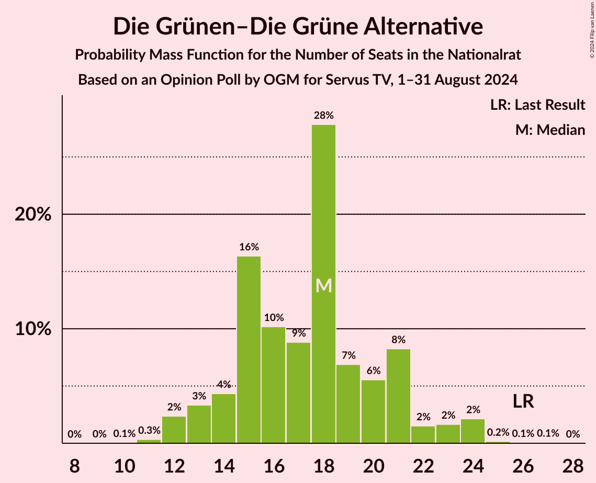
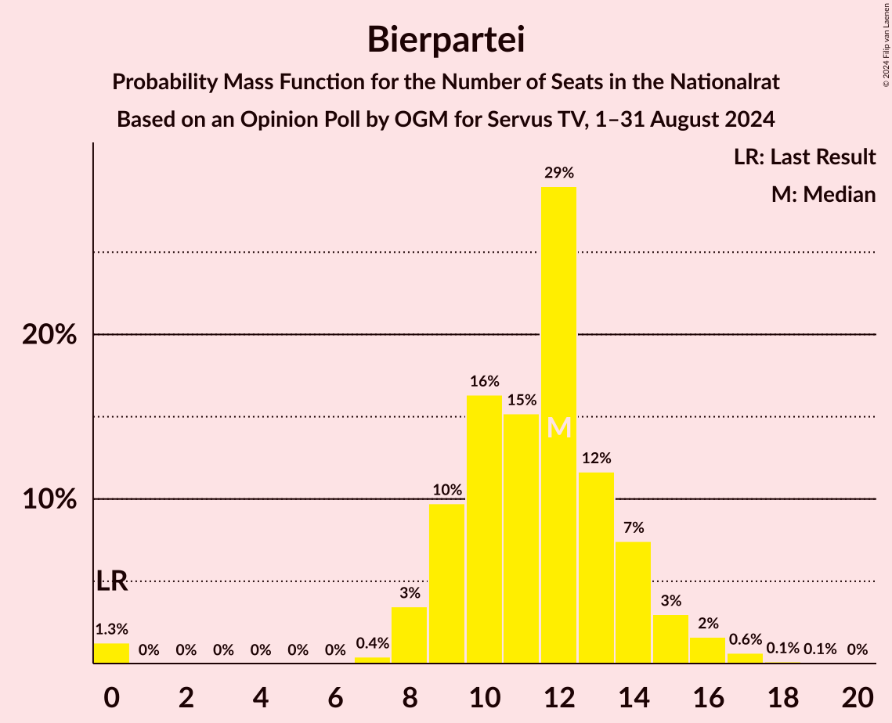

# Opinion Poll by OGM for Servus TV, 1–31 August 2024

<a href="#voting-intentions">Voting Intentions</a> | <a href="#seats">Seats</a> | <a href="#coalitions">Coalitions</a> | <a href="#technical-information">Technical Information</a>

## Voting Intentions

### Confidence Intervals

| Party | Last Result | Poll Result | 80% Confidence Interval | 90% Confidence Interval | 95% Confidence Interval | 99% Confidence Interval |
|:-----:|:-----------:|:-----------:|:-----------------------:|:-----------------------:|:-----------------------:|:-----------------------:|
| Freiheitliche Partei Österreichs | 16.2% | 27.0% | 24.6–29.6% |23.9–30.3% |23.3–31.0% |22.2–32.2% |
| Österreichische Volkspartei | 37.5% | 22.9% | 20.7–25.4% |20.1–26.1% |19.5–26.7% |18.5–28.0% |
| Sozialdemokratische Partei Österreichs | 21.2% | 21.0% | 18.8–23.4% |18.2–24.1% |17.7–24.7% |16.7–25.9% |
| Die Grünen–Die Grüne Alternative | 13.9% | 9.1% | 7.6–10.9% |7.2–11.4% |6.9–11.8% |6.2–12.8% |
| NEOS–Das Neue Österreich und Liberales Forum | 8.1% | 9.1% | 7.6–10.9% |7.2–11.4% |6.9–11.8% |6.2–12.8% |
| Bierpartei | 0.0% | 6.0% | 4.8–7.5% |4.5–8.0% |4.2–8.4% |3.7–9.2% |
| Kommunistische Partei Österreichs | 0.7% | 3.1% | 2.3–4.3% |2.1–4.6% |1.9–5.0% |1.6–5.6% |
| Liste Madeleine Petrovic | 0.0% | 1.0% | 0.6–1.8% |0.5–2.0% |0.4–2.2% |0.3–2.7% |
| Wandel | 0.0% | 1.0% | 0.6–1.8% |0.5–2.0% |0.4–2.2% |0.3–2.7% |

*Note:* The poll result column reflects the actual value used in the calculations. Published results may vary slightly, and in addition be rounded to fewer digits.

## Seats

### Confidence Intervals

| Party | Last Result | Median | 80% Confidence Interval | 90% Confidence Interval | 95% Confidence Interval | 99% Confidence Interval |
|:-----:|:-----------:|:------:|:-----------------------:|:-----------------------:|:-----------------------:|:-----------------------:|
| <a href="#freiheitliche-partei-österreichs">Freiheitliche Partei Österreichs</a> | 31 | 52 | 47–56 |46–58 |45–59 |42–63 |
| <a href="#österreichische-volkspartei">Österreichische Volkspartei</a> | 71 | 43 | 39–46 |39–48 |38–51 |36–54 |
| <a href="#sozialdemokratische-partei-österreichs">Sozialdemokratische Partei Österreichs</a> | 40 | 40 | 36–45 |35–45 |34–47 |32–49 |
| <a href="#die-grünen–die-grüne-alternative">Die Grünen–Die Grüne Alternative</a> | 26 | 18 | 15–20 |14–21 |12–24 |12–24 |
| <a href="#neos–das-neue-österreich-und-liberales-forum">NEOS–Das Neue Österreich und Liberales Forum</a> | 15 | 18 | 15–20 |15–20 |14–21 |12–24 |
| <a href="#bierpartei">Bierpartei</a> | 0 | 12 | 9–14 |8–15 |8–15 |0–17 |
| <a href="#kommunistische-partei-österreichs">Kommunistische Partei Österreichs</a> | 0 | 0 | 0–7 |0–8 |0–9 |0–10 |
| <a href="#liste-madeleine-petrovic">Liste Madeleine Petrovic</a> | 0 | 0 | 0 |0 |0 |0 |
| <a href="#wandel">Wandel</a> | 0 | 0 | 0 |0 |0 |0 |

### Freiheitliche Partei Österreichs

*For a full overview of the results for this party, see the [Freiheitliche Partei Österreichs](party-freiheitlicheparteiösterreichs.html) page.*

| Number of Seats | Probability | Accumulated | Special Marks |
|:---------------:|:-----------:|:-----------:|:-------------:|
| 31 | 0% | 100% | Last Result |
| 32 | 0% | 100% |  |
| 33 | 0% | 100% |  |
| 34 | 0% | 100% |  |
| 35 | 0% | 100% |  |
| 36 | 0% | 100% |  |
| 37 | 0% | 100% |  |
| 38 | 0% | 100% |  |
| 39 | 0% | 100% |  |
| 40 | 0.1% | 100% |  |
| 41 | 0.3% | 99.9% |  |
| 42 | 0.2% | 99.6% |  |
| 43 | 0.2% | 99.4% |  |
| 44 | 0.6% | 99.2% |  |
| 45 | 1.3% | 98.6% |  |
| 46 | 5% | 97% |  |
| 47 | 10% | 93% |  |
| 48 | 2% | 83% |  |
| 49 | 3% | 80% |  |
| 50 | 3% | 77% |  |
| 51 | 6% | 74% |  |
| 52 | 25% | 68% | Median |
| 53 | 16% | 43% |  |
| 54 | 9% | 27% |  |
| 55 | 5% | 17% |  |
| 56 | 5% | 12% |  |
| 57 | 1.1% | 8% |  |
| 58 | 3% | 7% |  |
| 59 | 1.0% | 3% |  |
| 60 | 1.3% | 2% |  |
| 61 | 0.1% | 0.9% |  |
| 62 | 0.2% | 0.8% |  |
| 63 | 0.6% | 0.7% |  |
| 64 | 0% | 0.1% |  |
| 65 | 0% | 0% |  |

### Österreichische Volkspartei

*For a full overview of the results for this party, see the [Österreichische Volkspartei](party-österreichischevolkspartei.html) page.*

| Number of Seats | Probability | Accumulated | Special Marks |
|:---------------:|:-----------:|:-----------:|:-------------:|
| 32 | 0% | 100% |  |
| 33 | 0.1% | 99.9% |  |
| 34 | 0.1% | 99.9% |  |
| 35 | 0.3% | 99.8% |  |
| 36 | 0.2% | 99.5% |  |
| 37 | 1.2% | 99.3% |  |
| 38 | 2% | 98% |  |
| 39 | 6% | 96% |  |
| 40 | 5% | 90% |  |
| 41 | 7% | 85% |  |
| 42 | 26% | 79% |  |
| 43 | 5% | 53% | Median |
| 44 | 17% | 48% |  |
| 45 | 16% | 31% |  |
| 46 | 6% | 15% |  |
| 47 | 3% | 9% |  |
| 48 | 1.4% | 6% |  |
| 49 | 1.1% | 5% |  |
| 50 | 0.6% | 4% |  |
| 51 | 0.7% | 3% |  |
| 52 | 1.5% | 2% |  |
| 53 | 0.2% | 1.0% |  |
| 54 | 0.6% | 0.8% |  |
| 55 | 0.1% | 0.2% |  |
| 56 | 0% | 0.1% |  |
| 57 | 0% | 0% |  |
| 58 | 0% | 0% |  |
| 59 | 0% | 0% |  |
| 60 | 0% | 0% |  |
| 61 | 0% | 0% |  |
| 62 | 0% | 0% |  |
| 63 | 0% | 0% |  |
| 64 | 0% | 0% |  |
| 65 | 0% | 0% |  |
| 66 | 0% | 0% |  |
| 67 | 0% | 0% |  |
| 68 | 0% | 0% |  |
| 69 | 0% | 0% |  |
| 70 | 0% | 0% |  |
| 71 | 0% | 0% | Last Result |

### Sozialdemokratische Partei Österreichs

*For a full overview of the results for this party, see the [Sozialdemokratische Partei Österreichs](party-sozialdemokratischeparteiösterreichs.html) page.*

| Number of Seats | Probability | Accumulated | Special Marks |
|:---------------:|:-----------:|:-----------:|:-------------:|
| 29 | 0% | 100% |  |
| 30 | 0% | 99.9% |  |
| 31 | 0.1% | 99.9% |  |
| 32 | 2% | 99.8% |  |
| 33 | 0.6% | 98% |  |
| 34 | 1.1% | 98% |  |
| 35 | 5% | 96% |  |
| 36 | 5% | 91% |  |
| 37 | 10% | 86% |  |
| 38 | 4% | 77% |  |
| 39 | 5% | 73% |  |
| 40 | 22% | 68% | Last Result, Median |
| 41 | 17% | 47% |  |
| 42 | 4% | 30% |  |
| 43 | 4% | 26% |  |
| 44 | 8% | 22% |  |
| 45 | 11% | 14% |  |
| 46 | 0.8% | 3% |  |
| 47 | 0.6% | 3% |  |
| 48 | 1.2% | 2% |  |
| 49 | 0.5% | 0.8% |  |
| 50 | 0.2% | 0.4% |  |
| 51 | 0% | 0.2% |  |
| 52 | 0.1% | 0.1% |  |
| 53 | 0% | 0% |  |

### Die Grünen–Die Grüne Alternative

*For a full overview of the results for this party, see the [Die Grünen–Die Grüne Alternative](party-diegrünen–diegrünealternative.html) page.*

| Number of Seats | Probability | Accumulated | Special Marks |
|:---------------:|:-----------:|:-----------:|:-------------:|
| 10 | 0% | 100% |  |
| 11 | 0.2% | 99.9% |  |
| 12 | 3% | 99.8% |  |
| 13 | 1.2% | 97% |  |
| 14 | 2% | 96% |  |
| 15 | 22% | 94% |  |
| 16 | 7% | 72% |  |
| 17 | 9% | 65% |  |
| 18 | 37% | 56% | Median |
| 19 | 3% | 19% |  |
| 20 | 7% | 17% |  |
| 21 | 5% | 10% |  |
| 22 | 1.2% | 5% |  |
| 23 | 0.6% | 4% |  |
| 24 | 3% | 3% |  |
| 25 | 0.1% | 0.2% |  |
| 26 | 0.1% | 0.1% | Last Result |
| 27 | 0.1% | 0.1% |  |
| 28 | 0% | 0% |  |

### NEOS–Das Neue Österreich und Liberales Forum

*For a full overview of the results for this party, see the [NEOS–Das Neue Österreich und Liberales Forum](party-neos–dasneueösterreichundliberalesforum.html) page.*

| Number of Seats | Probability | Accumulated | Special Marks |
|:---------------:|:-----------:|:-----------:|:-------------:|
| 10 | 0.1% | 100% |  |
| 11 | 0.3% | 99.9% |  |
| 12 | 0.3% | 99.6% |  |
| 13 | 0.9% | 99.3% |  |
| 14 | 2% | 98% |  |
| 15 | 9% | 97% | Last Result |
| 16 | 8% | 87% |  |
| 17 | 26% | 79% |  |
| 18 | 18% | 53% | Median |
| 19 | 24% | 35% |  |
| 20 | 7% | 10% |  |
| 21 | 2% | 4% |  |
| 22 | 0.6% | 2% |  |
| 23 | 0.4% | 1.1% |  |
| 24 | 0.2% | 0.7% |  |
| 25 | 0.4% | 0.5% |  |
| 26 | 0.1% | 0.1% |  |
| 27 | 0% | 0.1% |  |
| 28 | 0% | 0% |  |

### Bierpartei

*For a full overview of the results for this party, see the [Bierpartei](party-bierpartei.html) page.*

| Number of Seats | Probability | Accumulated | Special Marks |
|:---------------:|:-----------:|:-----------:|:-------------:|
| 0 | 1.0% | 100% | Last Result |
| 1 | 0% | 99.0% |  |
| 2 | 0% | 99.0% |  |
| 3 | 0% | 99.0% |  |
| 4 | 0% | 99.0% |  |
| 5 | 0% | 99.0% |  |
| 6 | 0% | 99.0% |  |
| 7 | 0.1% | 99.0% |  |
| 8 | 4% | 98.8% |  |
| 9 | 11% | 95% |  |
| 10 | 13% | 84% |  |
| 11 | 15% | 71% |  |
| 12 | 37% | 56% | Median |
| 13 | 6% | 20% |  |
| 14 | 7% | 13% |  |
| 15 | 4% | 6% |  |
| 16 | 2% | 2% |  |
| 17 | 0.4% | 0.5% |  |
| 18 | 0.1% | 0.2% |  |
| 19 | 0% | 0.1% |  |
| 20 | 0% | 0% |  |

### Kommunistische Partei Österreichs

*For a full overview of the results for this party, see the [Kommunistische Partei Österreichs](party-kommunistischeparteiösterreichs.html) page.*

| Number of Seats | Probability | Accumulated | Special Marks |
|:---------------:|:-----------:|:-----------:|:-------------:|
| 0 | 87% | 100% | Last Result, Median |
| 1 | 0% | 13% |  |
| 2 | 0% | 13% |  |
| 3 | 0% | 13% |  |
| 4 | 0% | 13% |  |
| 5 | 0% | 13% |  |
| 6 | 0% | 13% |  |
| 7 | 6% | 13% |  |
| 8 | 4% | 8% |  |
| 9 | 2% | 3% |  |
| 10 | 1.0% | 1.3% |  |
| 11 | 0.2% | 0.3% |  |
| 12 | 0.1% | 0.1% |  |
| 13 | 0% | 0% |  |

### Liste Madeleine Petrovic

*For a full overview of the results for this party, see the [Liste Madeleine Petrovic](party-listemadeleinepetrovic.html) page.*

| Number of Seats | Probability | Accumulated | Special Marks |
|:---------------:|:-----------:|:-----------:|:-------------:|
| 0 | 100% | 100% | Last Result, Median |

### Wandel

*For a full overview of the results for this party, see the [Wandel](party-wandel.html) page.*

| Number of Seats | Probability | Accumulated | Special Marks |
|:---------------:|:-----------:|:-----------:|:-------------:|
| 0 | 100% | 100% | Last Result, Median |

## Coalitions

### Confidence Intervals

| Coalition | Last Result | Median | Majority? | 80% Confidence Interval | 90% Confidence Interval | 95% Confidence Interval | 99% Confidence Interval |
|:---------:|:-----------:|:------:|:---------:|:-----------------------:|:-----------------------:|:-----------------------:|:-----------------------:|
| Freiheitliche Partei Österreichs – Österreichische Volkspartei | 102 | 94 | 81% | 91–100 | 88–101 | 87–103 | 85–107 |
| Freiheitliche Partei Österreichs – Sozialdemokratische Partei Österreichs | 71 | 92 | 68% | 87–98 | 84–98 | 83–99 | 81–102 |
| Österreichische Volkspartei – Sozialdemokratische Partei Österreichs | 111 | 82 | 2% | 79–89 | 77–90 | 76–91 | 73–94 |
| Österreichische Volkspartei – Die Grünen–Die Grüne Alternative – NEOS–Das Neue Österreich und Liberales Forum | 112 | 78 | 0.2% | 75–82 | 74–84 | 72–88 | 69–90 |
| Sozialdemokratische Partei Österreichs – Die Grünen–Die Grüne Alternative – NEOS–Das Neue Österreich und Liberales Forum | 81 | 76 | 0% | 70–81 | 67–82 | 66–83 | 65–87 |
| Österreichische Volkspartei – NEOS–Das Neue Österreich und Liberales Forum | 86 | 61 | 0% | 58–64 | 56–66 | 55–70 | 52–72 |
| Österreichische Volkspartei – Die Grünen–Die Grüne Alternative | 97 | 60 | 0% | 57–65 | 56–67 | 55–69 | 52–71 |
| Sozialdemokratische Partei Österreichs – Die Grünen–Die Grüne Alternative | 66 | 58 | 0% | 53–63 | 50–65 | 50–66 | 48–69 |
| Österreichische Volkspartei | 71 | 43 | 0% | 39–46 | 39–48 | 38–51 | 36–54 |
| Sozialdemokratische Partei Österreichs | 40 | 40 | 0% | 36–45 | 35–45 | 34–47 | 32–49 |

### Freiheitliche Partei Österreichs – Österreichische Volkspartei

| Number of Seats | Probability | Accumulated | Special Marks |
|:---------------:|:-----------:|:-----------:|:-------------:|
| 81 | 0.1% | 100% |  |
| 82 | 0.1% | 99.8% |  |
| 83 | 0.1% | 99.8% |  |
| 84 | 0.1% | 99.7% |  |
| 85 | 0.4% | 99.5% |  |
| 86 | 1.3% | 99.2% |  |
| 87 | 0.6% | 98% |  |
| 88 | 2% | 97% |  |
| 89 | 2% | 95% |  |
| 90 | 3% | 93% |  |
| 91 | 9% | 90% |  |
| 92 | 3% | 81% | Majority |
| 93 | 8% | 78% |  |
| 94 | 23% | 70% |  |
| 95 | 4% | 46% | Median |
| 96 | 5% | 42% |  |
| 97 | 5% | 37% |  |
| 98 | 12% | 32% |  |
| 99 | 3% | 20% |  |
| 100 | 7% | 16% |  |
| 101 | 5% | 9% |  |
| 102 | 0.9% | 4% | Last Result |
| 103 | 1.3% | 3% |  |
| 104 | 0.7% | 2% |  |
| 105 | 0.4% | 1.3% |  |
| 106 | 0.4% | 0.9% |  |
| 107 | 0.1% | 0.5% |  |
| 108 | 0.1% | 0.5% |  |
| 109 | 0.3% | 0.4% |  |
| 110 | 0% | 0.1% |  |
| 111 | 0% | 0% |  |

### Freiheitliche Partei Österreichs – Sozialdemokratische Partei Österreichs

| Number of Seats | Probability | Accumulated | Special Marks |
|:---------------:|:-----------:|:-----------:|:-------------:|
| 71 | 0% | 100% | Last Result |
| 72 | 0% | 100% |  |
| 73 | 0% | 100% |  |
| 74 | 0% | 100% |  |
| 75 | 0% | 100% |  |
| 76 | 0% | 100% |  |
| 77 | 0% | 100% |  |
| 78 | 0% | 100% |  |
| 79 | 0.1% | 99.9% |  |
| 80 | 0.2% | 99.8% |  |
| 81 | 0.3% | 99.6% |  |
| 82 | 0.7% | 99.3% |  |
| 83 | 2% | 98.6% |  |
| 84 | 2% | 97% |  |
| 85 | 2% | 94% |  |
| 86 | 2% | 93% |  |
| 87 | 2% | 91% |  |
| 88 | 7% | 89% |  |
| 89 | 3% | 82% |  |
| 90 | 6% | 80% |  |
| 91 | 6% | 74% |  |
| 92 | 25% | 68% | Median, Majority |
| 93 | 7% | 43% |  |
| 94 | 12% | 36% |  |
| 95 | 3% | 23% |  |
| 96 | 3% | 21% |  |
| 97 | 6% | 18% |  |
| 98 | 9% | 12% |  |
| 99 | 1.4% | 3% |  |
| 100 | 0.8% | 2% |  |
| 101 | 0.4% | 1.3% |  |
| 102 | 0.4% | 0.9% |  |
| 103 | 0.2% | 0.4% |  |
| 104 | 0.1% | 0.3% |  |
| 105 | 0.1% | 0.2% |  |
| 106 | 0.1% | 0.1% |  |
| 107 | 0% | 0% |  |

### Österreichische Volkspartei – Sozialdemokratische Partei Österreichs

| Number of Seats | Probability | Accumulated | Special Marks |
|:---------------:|:-----------:|:-----------:|:-------------:|
| 71 | 0.1% | 100% |  |
| 72 | 0.2% | 99.9% |  |
| 73 | 0.2% | 99.6% |  |
| 74 | 0.2% | 99.5% |  |
| 75 | 0.4% | 99.3% |  |
| 76 | 3% | 98.9% |  |
| 77 | 0.9% | 96% |  |
| 78 | 4% | 95% |  |
| 79 | 5% | 90% |  |
| 80 | 2% | 86% |  |
| 81 | 10% | 84% |  |
| 82 | 25% | 74% |  |
| 83 | 2% | 49% | Median |
| 84 | 5% | 47% |  |
| 85 | 3% | 42% |  |
| 86 | 20% | 39% |  |
| 87 | 2% | 19% |  |
| 88 | 3% | 17% |  |
| 89 | 6% | 13% |  |
| 90 | 3% | 7% |  |
| 91 | 2% | 4% |  |
| 92 | 0.4% | 2% | Majority |
| 93 | 0.4% | 1.1% |  |
| 94 | 0.3% | 0.7% |  |
| 95 | 0% | 0.3% |  |
| 96 | 0.1% | 0.3% |  |
| 97 | 0.1% | 0.2% |  |
| 98 | 0% | 0.1% |  |
| 99 | 0% | 0% |  |
| 100 | 0% | 0% |  |
| 101 | 0% | 0% |  |
| 102 | 0% | 0% |  |
| 103 | 0% | 0% |  |
| 104 | 0% | 0% |  |
| 105 | 0% | 0% |  |
| 106 | 0% | 0% |  |
| 107 | 0% | 0% |  |
| 108 | 0% | 0% |  |
| 109 | 0% | 0% |  |
| 110 | 0% | 0% |  |
| 111 | 0% | 0% | Last Result |

### Österreichische Volkspartei – Die Grünen–Die Grüne Alternative – NEOS–Das Neue Österreich und Liberales Forum

| Number of Seats | Probability | Accumulated | Special Marks |
|:---------------:|:-----------:|:-----------:|:-------------:|
| 65 | 0.1% | 100% |  |
| 66 | 0.1% | 99.9% |  |
| 67 | 0.1% | 99.8% |  |
| 68 | 0.2% | 99.8% |  |
| 69 | 0.1% | 99.5% |  |
| 70 | 1.0% | 99.4% |  |
| 71 | 0.9% | 98% |  |
| 72 | 1.2% | 98% |  |
| 73 | 0.8% | 96% |  |
| 74 | 5% | 95% |  |
| 75 | 9% | 90% |  |
| 76 | 5% | 81% |  |
| 77 | 20% | 77% |  |
| 78 | 7% | 56% |  |
| 79 | 24% | 49% | Median |
| 80 | 8% | 26% |  |
| 81 | 4% | 17% |  |
| 82 | 6% | 13% |  |
| 83 | 2% | 8% |  |
| 84 | 0.9% | 5% |  |
| 85 | 0.6% | 5% |  |
| 86 | 0.5% | 4% |  |
| 87 | 0.9% | 3% |  |
| 88 | 1.2% | 3% |  |
| 89 | 0.8% | 1.4% |  |
| 90 | 0.4% | 0.7% |  |
| 91 | 0.1% | 0.3% |  |
| 92 | 0.2% | 0.2% | Majority |
| 93 | 0% | 0% |  |
| 94 | 0% | 0% |  |
| 95 | 0% | 0% |  |
| 96 | 0% | 0% |  |
| 97 | 0% | 0% |  |
| 98 | 0% | 0% |  |
| 99 | 0% | 0% |  |
| 100 | 0% | 0% |  |
| 101 | 0% | 0% |  |
| 102 | 0% | 0% |  |
| 103 | 0% | 0% |  |
| 104 | 0% | 0% |  |
| 105 | 0% | 0% |  |
| 106 | 0% | 0% |  |
| 107 | 0% | 0% |  |
| 108 | 0% | 0% |  |
| 109 | 0% | 0% |  |
| 110 | 0% | 0% |  |
| 111 | 0% | 0% |  |
| 112 | 0% | 0% | Last Result |

### Sozialdemokratische Partei Österreichs – Die Grünen–Die Grüne Alternative – NEOS–Das Neue Österreich und Liberales Forum

| Number of Seats | Probability | Accumulated | Special Marks |
|:---------------:|:-----------:|:-----------:|:-------------:|
| 62 | 0.1% | 100% |  |
| 63 | 0.2% | 99.9% |  |
| 64 | 0.1% | 99.7% |  |
| 65 | 0.4% | 99.7% |  |
| 66 | 4% | 99.3% |  |
| 67 | 2% | 96% |  |
| 68 | 0.8% | 94% |  |
| 69 | 3% | 93% |  |
| 70 | 2% | 90% |  |
| 71 | 4% | 88% |  |
| 72 | 8% | 84% |  |
| 73 | 14% | 76% |  |
| 74 | 4% | 62% |  |
| 75 | 6% | 58% |  |
| 76 | 2% | 52% | Median |
| 77 | 24% | 50% |  |
| 78 | 2% | 25% |  |
| 79 | 5% | 23% |  |
| 80 | 4% | 19% |  |
| 81 | 9% | 15% | Last Result |
| 82 | 3% | 6% |  |
| 83 | 1.3% | 3% |  |
| 84 | 0.7% | 2% |  |
| 85 | 0.8% | 1.3% |  |
| 86 | 0% | 0.6% |  |
| 87 | 0.4% | 0.5% |  |
| 88 | 0.1% | 0.1% |  |
| 89 | 0% | 0.1% |  |
| 90 | 0% | 0% |  |

### Österreichische Volkspartei – NEOS–Das Neue Österreich und Liberales Forum

| Number of Seats | Probability | Accumulated | Special Marks |
|:---------------:|:-----------:|:-----------:|:-------------:|
| 49 | 0% | 100% |  |
| 50 | 0.1% | 99.9% |  |
| 51 | 0.3% | 99.8% |  |
| 52 | 0.3% | 99.6% |  |
| 53 | 0.5% | 99.3% |  |
| 54 | 1.3% | 98.8% |  |
| 55 | 2% | 98% |  |
| 56 | 3% | 96% |  |
| 57 | 3% | 93% |  |
| 58 | 9% | 90% |  |
| 59 | 10% | 82% |  |
| 60 | 7% | 71% |  |
| 61 | 24% | 64% | Median |
| 62 | 25% | 41% |  |
| 63 | 4% | 16% |  |
| 64 | 2% | 11% |  |
| 65 | 3% | 9% |  |
| 66 | 1.1% | 6% |  |
| 67 | 0.7% | 5% |  |
| 68 | 0.4% | 4% |  |
| 69 | 0.7% | 3% |  |
| 70 | 0.6% | 3% |  |
| 71 | 1.3% | 2% |  |
| 72 | 0.6% | 0.8% |  |
| 73 | 0.1% | 0.2% |  |
| 74 | 0.1% | 0.1% |  |
| 75 | 0% | 0% |  |
| 76 | 0% | 0% |  |
| 77 | 0% | 0% |  |
| 78 | 0% | 0% |  |
| 79 | 0% | 0% |  |
| 80 | 0% | 0% |  |
| 81 | 0% | 0% |  |
| 82 | 0% | 0% |  |
| 83 | 0% | 0% |  |
| 84 | 0% | 0% |  |
| 85 | 0% | 0% |  |
| 86 | 0% | 0% | Last Result |

### Österreichische Volkspartei – Die Grünen–Die Grüne Alternative

| Number of Seats | Probability | Accumulated | Special Marks |
|:---------------:|:-----------:|:-----------:|:-------------:|
| 48 | 0% | 100% |  |
| 49 | 0% | 99.9% |  |
| 50 | 0.1% | 99.9% |  |
| 51 | 0.3% | 99.9% |  |
| 52 | 0.2% | 99.5% |  |
| 53 | 0.5% | 99.4% |  |
| 54 | 1.2% | 98.8% |  |
| 55 | 2% | 98% |  |
| 56 | 4% | 96% |  |
| 57 | 9% | 92% |  |
| 58 | 7% | 83% |  |
| 59 | 4% | 76% |  |
| 60 | 34% | 73% |  |
| 61 | 8% | 38% | Median |
| 62 | 11% | 30% |  |
| 63 | 2% | 20% |  |
| 64 | 6% | 18% |  |
| 65 | 3% | 12% |  |
| 66 | 2% | 9% |  |
| 67 | 3% | 8% |  |
| 68 | 0.5% | 5% |  |
| 69 | 3% | 4% |  |
| 70 | 0.3% | 2% |  |
| 71 | 0.8% | 1.2% |  |
| 72 | 0.3% | 0.5% |  |
| 73 | 0.1% | 0.2% |  |
| 74 | 0.1% | 0.1% |  |
| 75 | 0% | 0.1% |  |
| 76 | 0% | 0% |  |
| 77 | 0% | 0% |  |
| 78 | 0% | 0% |  |
| 79 | 0% | 0% |  |
| 80 | 0% | 0% |  |
| 81 | 0% | 0% |  |
| 82 | 0% | 0% |  |
| 83 | 0% | 0% |  |
| 84 | 0% | 0% |  |
| 85 | 0% | 0% |  |
| 86 | 0% | 0% |  |
| 87 | 0% | 0% |  |
| 88 | 0% | 0% |  |
| 89 | 0% | 0% |  |
| 90 | 0% | 0% |  |
| 91 | 0% | 0% |  |
| 92 | 0% | 0% | Majority |
| 93 | 0% | 0% |  |
| 94 | 0% | 0% |  |
| 95 | 0% | 0% |  |
| 96 | 0% | 0% |  |
| 97 | 0% | 0% | Last Result |

### Sozialdemokratische Partei Österreichs – Die Grünen–Die Grüne Alternative

| Number of Seats | Probability | Accumulated | Special Marks |
|:---------------:|:-----------:|:-----------:|:-------------:|
| 45 | 0.1% | 100% |  |
| 46 | 0% | 99.9% |  |
| 47 | 0.2% | 99.8% |  |
| 48 | 0.8% | 99.6% |  |
| 49 | 0.2% | 98.8% |  |
| 50 | 4% | 98.5% |  |
| 51 | 2% | 94% |  |
| 52 | 1.3% | 93% |  |
| 53 | 6% | 91% |  |
| 54 | 5% | 86% |  |
| 55 | 5% | 81% |  |
| 56 | 14% | 76% |  |
| 57 | 7% | 62% |  |
| 58 | 22% | 55% | Median |
| 59 | 4% | 33% |  |
| 60 | 4% | 29% |  |
| 61 | 5% | 25% |  |
| 62 | 8% | 20% |  |
| 63 | 6% | 12% |  |
| 64 | 0.6% | 7% |  |
| 65 | 3% | 6% |  |
| 66 | 1.4% | 3% | Last Result |
| 67 | 0.3% | 1.2% |  |
| 68 | 0.3% | 0.9% |  |
| 69 | 0.4% | 0.5% |  |
| 70 | 0% | 0.1% |  |
| 71 | 0% | 0.1% |  |
| 72 | 0% | 0% |  |

### Österreichische Volkspartei

| Number of Seats | Probability | Accumulated | Special Marks |
|:---------------:|:-----------:|:-----------:|:-------------:|
| 32 | 0% | 100% |  |
| 33 | 0.1% | 99.9% |  |
| 34 | 0.1% | 99.9% |  |
| 35 | 0.3% | 99.8% |  |
| 36 | 0.2% | 99.5% |  |
| 37 | 1.2% | 99.3% |  |
| 38 | 2% | 98% |  |
| 39 | 6% | 96% |  |
| 40 | 5% | 90% |  |
| 41 | 7% | 85% |  |
| 42 | 26% | 79% |  |
| 43 | 5% | 53% | Median |
| 44 | 17% | 48% |  |
| 45 | 16% | 31% |  |
| 46 | 6% | 15% |  |
| 47 | 3% | 9% |  |
| 48 | 1.4% | 6% |  |
| 49 | 1.1% | 5% |  |
| 50 | 0.6% | 4% |  |
| 51 | 0.7% | 3% |  |
| 52 | 1.5% | 2% |  |
| 53 | 0.2% | 1.0% |  |
| 54 | 0.6% | 0.8% |  |
| 55 | 0.1% | 0.2% |  |
| 56 | 0% | 0.1% |  |
| 57 | 0% | 0% |  |
| 58 | 0% | 0% |  |
| 59 | 0% | 0% |  |
| 60 | 0% | 0% |  |
| 61 | 0% | 0% |  |
| 62 | 0% | 0% |  |
| 63 | 0% | 0% |  |
| 64 | 0% | 0% |  |
| 65 | 0% | 0% |  |
| 66 | 0% | 0% |  |
| 67 | 0% | 0% |  |
| 68 | 0% | 0% |  |
| 69 | 0% | 0% |  |
| 70 | 0% | 0% |  |
| 71 | 0% | 0% | Last Result |

### Sozialdemokratische Partei Österreichs

| Number of Seats | Probability | Accumulated | Special Marks |
|:---------------:|:-----------:|:-----------:|:-------------:|
| 29 | 0% | 100% |  |
| 30 | 0% | 99.9% |  |
| 31 | 0.1% | 99.9% |  |
| 32 | 2% | 99.8% |  |
| 33 | 0.6% | 98% |  |
| 34 | 1.1% | 98% |  |
| 35 | 5% | 96% |  |
| 36 | 5% | 91% |  |
| 37 | 10% | 86% |  |
| 38 | 4% | 77% |  |
| 39 | 5% | 73% |  |
| 40 | 22% | 68% | Last Result, Median |
| 41 | 17% | 47% |  |
| 42 | 4% | 30% |  |
| 43 | 4% | 26% |  |
| 44 | 8% | 22% |  |
| 45 | 11% | 14% |  |
| 46 | 0.8% | 3% |  |
| 47 | 0.6% | 3% |  |
| 48 | 1.2% | 2% |  |
| 49 | 0.5% | 0.8% |  |
| 50 | 0.2% | 0.4% |  |
| 51 | 0% | 0.2% |  |
| 52 | 0.1% | 0.1% |  |
| 53 | 0% | 0% |  |

## Technical Information

### Opinion Poll

+ **Polling firm:** OGM
+ **Commissioner(s):** Servus TV
+ **Fieldwork period:** 1–31 August 2024

### Calculations

+ **Sample size:** 519
+ **Simulations done:** 1,048,576
+ **Error estimate:** 3.26%

