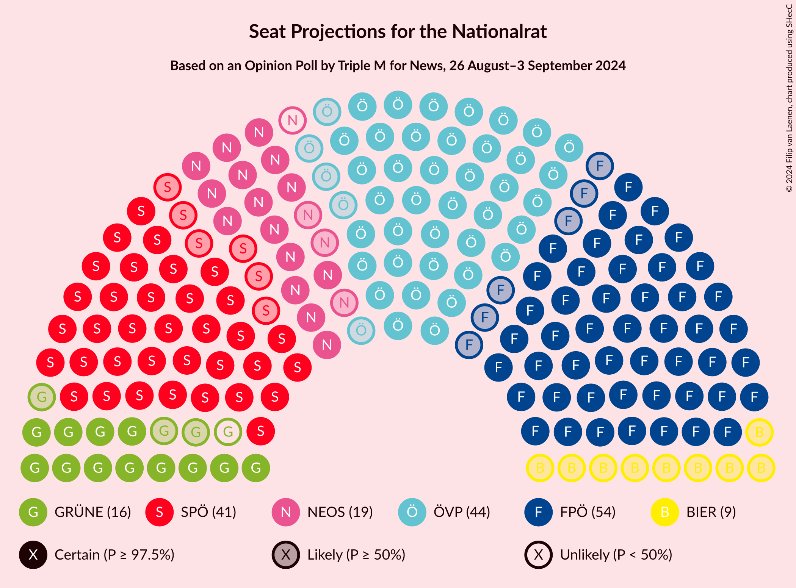
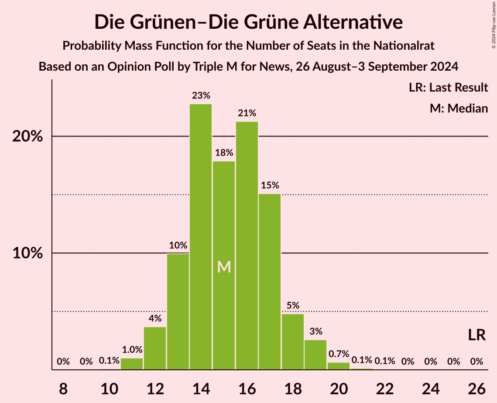
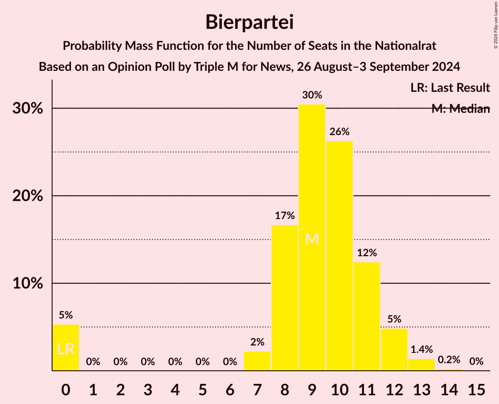
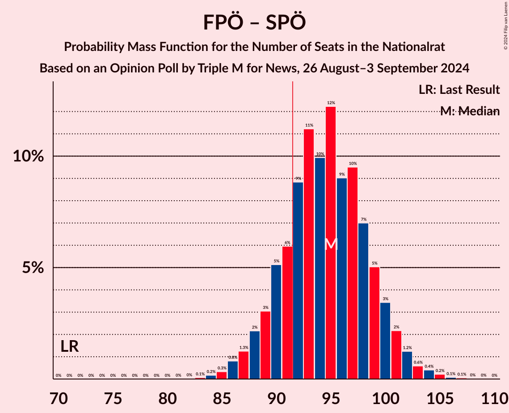
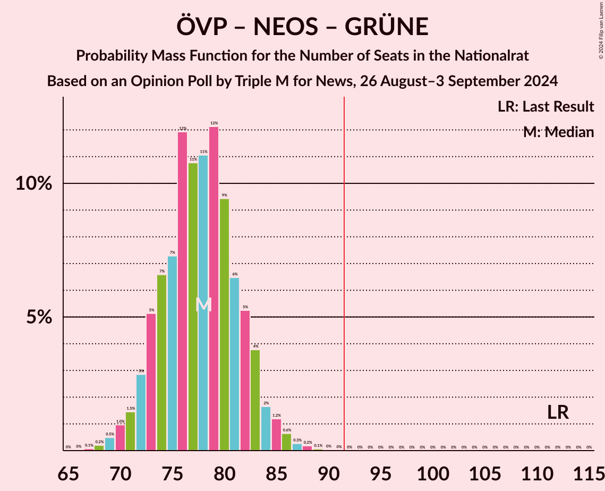
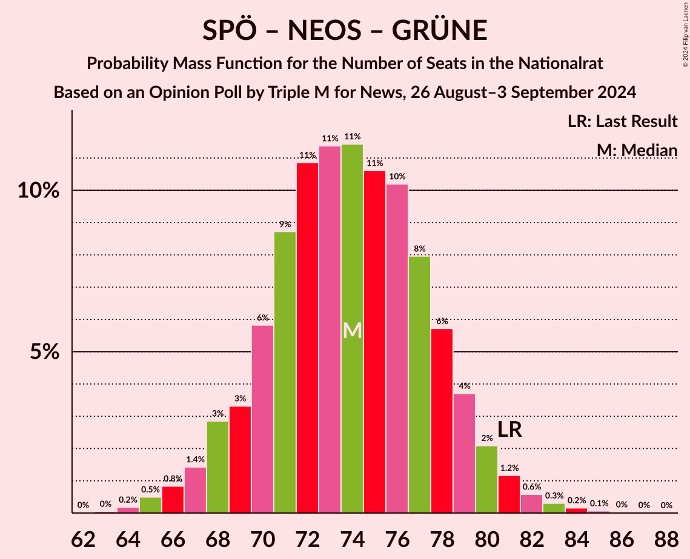
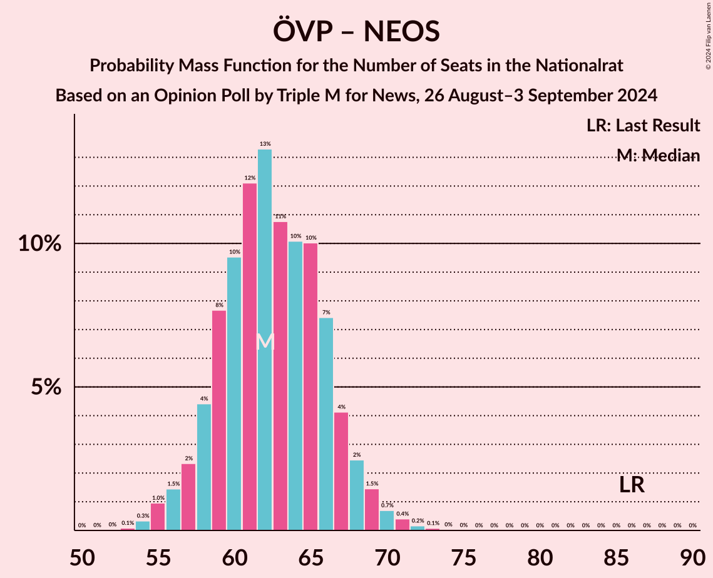
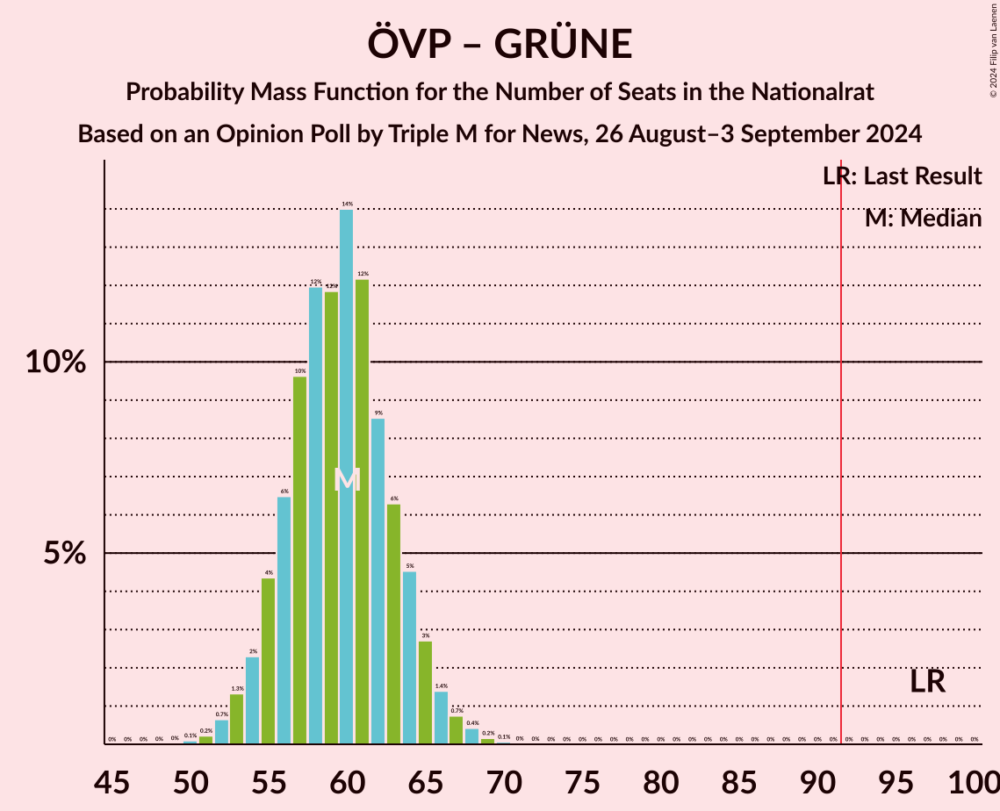
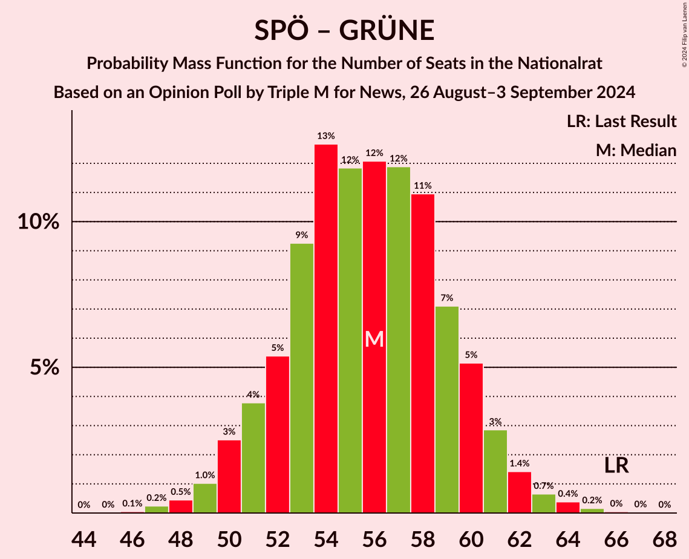

# Opinion Poll by Triple M for News, 26 August–3 September 2024

<a href="#voting-intentions">Voting Intentions</a> | <a href="#seats">Seats</a> | <a href="#coalitions">Coalitions</a> | <a href="#technical-information">Technical Information</a>

## Voting Intentions

### Confidence Intervals

| Party | Last Result | Poll Result | 80% Confidence Interval | 90% Confidence Interval | 95% Confidence Interval | 99% Confidence Interval |
|:-----:|:-----------:|:-----------:|:-----------------------:|:-----------------------:|:-----------------------:|:-----------------------:|
| Freiheitliche Partei Österreichs | 16.2% | 28.0% | 26.2–29.9% |25.7–30.4% |25.3–30.9% |24.5–31.8% |
| Österreichische Volkspartei | 37.5% | 23.0% | 21.4–24.8% |20.9–25.3% |20.5–25.7% |19.7–26.6% |
| Sozialdemokratische Partei Österreichs | 21.2% | 21.0% | 19.4–22.7% |19.0–23.2% |18.6–23.6% |17.8–24.5% |
| NEOS–Das Neue Österreich und Liberales Forum | 8.1% | 9.5% | 8.4–10.8% |8.1–11.2% |7.8–11.5% |7.3–12.1% |
| Die Grünen–Die Grüne Alternative | 13.9% | 8.0% | 7.0–9.2% |6.7–9.6% |6.5–9.9% |6.0–10.5% |
| Bierpartei | 0.0% | 5.0% | 4.2–6.0% |4.0–6.3% |3.8–6.5% |3.5–7.1% |
| Kommunistische Partei Österreichs | 0.7% | 3.5% | 2.9–4.4% |2.7–4.6% |2.5–4.8% |2.2–5.3% |

*Note:* The poll result column reflects the actual value used in the calculations. Published results may vary slightly, and in addition be rounded to fewer digits.

## Seats

### Confidence Intervals

| Party | Last Result | Median | 80% Confidence Interval | 90% Confidence Interval | 95% Confidence Interval | 99% Confidence Interval |
|:-----:|:-----------:|:------:|:-----------------------:|:-----------------------:|:-----------------------:|:-----------------------:|
| <a href="#freiheitliche-partei-österreichs">Freiheitliche Partei Österreichs</a> | 31 | 54 | 50–58 |49–59 |48–60 |47–62 |
| <a href="#österreichische-volkspartei">Österreichische Volkspartei</a> | 71 | 44 | 41–48 |40–49 |39–50 |38–52 |
| <a href="#sozialdemokratische-partei-österreichs">Sozialdemokratische Partei Österreichs</a> | 40 | 41 | 37–44 |36–45 |36–46 |34–47 |
| <a href="#neos–das-neue-österreich-und-liberales-forum">NEOS–Das Neue Österreich und Liberales Forum</a> | 15 | 18 | 16–21 |15–21 |15–22 |14–23 |
| <a href="#die-grünen–die-grüne-alternative">Die Grünen–Die Grüne Alternative</a> | 26 | 15 | 13–17 |13–18 |12–19 |11–20 |
| <a href="#bierpartei">Bierpartei</a> | 0 | 9 | 8–11 |0–12 |0–12 |0–13 |
| <a href="#kommunistische-partei-österreichs">Kommunistische Partei Österreichs</a> | 0 | 0 | 0–8 |0–8 |0–9 |0–10 |

### Freiheitliche Partei Österreichs

*For a full overview of the results for this party, see the [Freiheitliche Partei Österreichs](party-freiheitlicheparteiösterreichs.html) page.*

| Number of Seats | Probability | Accumulated | Special Marks |
|:---------------:|:-----------:|:-----------:|:-------------:|
| 31 | 0% | 100% | Last Result |
| 32 | 0% | 100% |  |
| 33 | 0% | 100% |  |
| 34 | 0% | 100% |  |
| 35 | 0% | 100% |  |
| 36 | 0% | 100% |  |
| 37 | 0% | 100% |  |
| 38 | 0% | 100% |  |
| 39 | 0% | 100% |  |
| 40 | 0% | 100% |  |
| 41 | 0% | 100% |  |
| 42 | 0% | 100% |  |
| 43 | 0% | 100% |  |
| 44 | 0% | 100% |  |
| 45 | 0.1% | 100% |  |
| 46 | 0.3% | 99.9% |  |
| 47 | 0.7% | 99.5% |  |
| 48 | 1.4% | 98.8% |  |
| 49 | 3% | 97% |  |
| 50 | 7% | 95% |  |
| 51 | 8% | 88% |  |
| 52 | 12% | 80% |  |
| 53 | 12% | 68% |  |
| 54 | 13% | 56% | Median |
| 55 | 13% | 43% |  |
| 56 | 10% | 30% |  |
| 57 | 7% | 20% |  |
| 58 | 5% | 13% |  |
| 59 | 4% | 7% |  |
| 60 | 2% | 3% |  |
| 61 | 0.7% | 2% |  |
| 62 | 0.6% | 0.9% |  |
| 63 | 0.2% | 0.3% |  |
| 64 | 0.1% | 0.1% |  |
| 65 | 0% | 0% |  |

### Österreichische Volkspartei

*For a full overview of the results for this party, see the [Österreichische Volkspartei](party-österreichischevolkspartei.html) page.*

| Number of Seats | Probability | Accumulated | Special Marks |
|:---------------:|:-----------:|:-----------:|:-------------:|
| 36 | 0.1% | 100% |  |
| 37 | 0.3% | 99.9% |  |
| 38 | 0.9% | 99.5% |  |
| 39 | 2% | 98.6% |  |
| 40 | 3% | 97% |  |
| 41 | 7% | 93% |  |
| 42 | 13% | 87% |  |
| 43 | 13% | 73% |  |
| 44 | 15% | 60% | Median |
| 45 | 12% | 46% |  |
| 46 | 12% | 34% |  |
| 47 | 10% | 22% |  |
| 48 | 6% | 12% |  |
| 49 | 2% | 5% |  |
| 50 | 2% | 3% |  |
| 51 | 0.9% | 1.5% |  |
| 52 | 0.4% | 0.6% |  |
| 53 | 0.2% | 0.2% |  |
| 54 | 0% | 0.1% |  |
| 55 | 0% | 0% |  |
| 56 | 0% | 0% |  |
| 57 | 0% | 0% |  |
| 58 | 0% | 0% |  |
| 59 | 0% | 0% |  |
| 60 | 0% | 0% |  |
| 61 | 0% | 0% |  |
| 62 | 0% | 0% |  |
| 63 | 0% | 0% |  |
| 64 | 0% | 0% |  |
| 65 | 0% | 0% |  |
| 66 | 0% | 0% |  |
| 67 | 0% | 0% |  |
| 68 | 0% | 0% |  |
| 69 | 0% | 0% |  |
| 70 | 0% | 0% |  |
| 71 | 0% | 0% | Last Result |

### Sozialdemokratische Partei Österreichs

*For a full overview of the results for this party, see the [Sozialdemokratische Partei Österreichs](party-sozialdemokratischeparteiösterreichs.html) page.*

| Number of Seats | Probability | Accumulated | Special Marks |
|:---------------:|:-----------:|:-----------:|:-------------:|
| 32 | 0.1% | 100% |  |
| 33 | 0.2% | 99.9% |  |
| 34 | 0.5% | 99.7% |  |
| 35 | 2% | 99.2% |  |
| 36 | 5% | 98% |  |
| 37 | 8% | 93% |  |
| 38 | 8% | 86% |  |
| 39 | 10% | 77% |  |
| 40 | 13% | 68% | Last Result |
| 41 | 17% | 55% | Median |
| 42 | 16% | 38% |  |
| 43 | 11% | 22% |  |
| 44 | 5% | 11% |  |
| 45 | 3% | 6% |  |
| 46 | 2% | 3% |  |
| 47 | 1.0% | 1.4% |  |
| 48 | 0.2% | 0.4% |  |
| 49 | 0.1% | 0.2% |  |
| 50 | 0.1% | 0.1% |  |
| 51 | 0% | 0% |  |

### NEOS–Das Neue Österreich und Liberales Forum

*For a full overview of the results for this party, see the [NEOS–Das Neue Österreich und Liberales Forum](party-neos–dasneueösterreichundliberalesforum.html) page.*

| Number of Seats | Probability | Accumulated | Special Marks |
|:---------------:|:-----------:|:-----------:|:-------------:|
| 13 | 0.3% | 100% |  |
| 14 | 2% | 99.7% |  |
| 15 | 5% | 98% | Last Result |
| 16 | 11% | 93% |  |
| 17 | 19% | 81% |  |
| 18 | 21% | 63% | Median |
| 19 | 20% | 42% |  |
| 20 | 12% | 22% |  |
| 21 | 6% | 10% |  |
| 22 | 2% | 4% |  |
| 23 | 1.0% | 1.4% |  |
| 24 | 0.3% | 0.4% |  |
| 25 | 0.1% | 0.1% |  |
| 26 | 0% | 0% |  |

### Die Grünen–Die Grüne Alternative

*For a full overview of the results for this party, see the [Die Grünen–Die Grüne Alternative](party-diegrünen–diegrünealternative.html) page.*

| Number of Seats | Probability | Accumulated | Special Marks |
|:---------------:|:-----------:|:-----------:|:-------------:|
| 10 | 0.1% | 100% |  |
| 11 | 1.0% | 99.9% |  |
| 12 | 4% | 98.9% |  |
| 13 | 9% | 95% |  |
| 14 | 22% | 87% |  |
| 15 | 21% | 65% | Median |
| 16 | 22% | 44% |  |
| 17 | 15% | 22% |  |
| 18 | 3% | 7% |  |
| 19 | 3% | 4% |  |
| 20 | 0.8% | 1.0% |  |
| 21 | 0.1% | 0.2% |  |
| 22 | 0.1% | 0.1% |  |
| 23 | 0% | 0% |  |
| 24 | 0% | 0% |  |
| 25 | 0% | 0% |  |
| 26 | 0% | 0% | Last Result |

### Bierpartei

*For a full overview of the results for this party, see the [Bierpartei](party-bierpartei.html) page.*

| Number of Seats | Probability | Accumulated | Special Marks |
|:---------------:|:-----------:|:-----------:|:-------------:|
| 0 | 5% | 100% | Last Result |
| 1 | 0% | 95% |  |
| 2 | 0% | 95% |  |
| 3 | 0% | 95% |  |
| 4 | 0% | 95% |  |
| 5 | 0% | 95% |  |
| 6 | 0% | 95% |  |
| 7 | 2% | 95% |  |
| 8 | 17% | 92% |  |
| 9 | 29% | 76% | Median |
| 10 | 27% | 46% |  |
| 11 | 13% | 20% |  |
| 12 | 5% | 6% |  |
| 13 | 1.5% | 2% |  |
| 14 | 0.2% | 0.3% |  |
| 15 | 0% | 0% |  |

### Kommunistische Partei Österreichs

*For a full overview of the results for this party, see the [Kommunistische Partei Österreichs](party-kommunistischeparteiösterreichs.html) page.*

| Number of Seats | Probability | Accumulated | Special Marks |
|:---------------:|:-----------:|:-----------:|:-------------:|
| 0 | 79% | 100% | Last Result, Median |
| 1 | 0% | 21% |  |
| 2 | 0% | 21% |  |
| 3 | 0% | 21% |  |
| 4 | 0% | 21% |  |
| 5 | 0% | 21% |  |
| 6 | 0% | 21% |  |
| 7 | 6% | 21% |  |
| 8 | 12% | 15% |  |
| 9 | 3% | 3% |  |
| 10 | 0.5% | 0.5% |  |
| 11 | 0.1% | 0.1% |  |
| 12 | 0% | 0% |  |

## Coalitions

### Confidence Intervals

| Coalition | Last Result | Median | Majority? | 80% Confidence Interval | 90% Confidence Interval | 95% Confidence Interval | 99% Confidence Interval |
|:---------:|:-----------:|:------:|:---------:|:-----------------------:|:-----------------------:|:-----------------------:|:-----------------------:|
| Freiheitliche Partei Österreichs – Österreichische Volkspartei | 102 | 98 | 97% | 94–103 | 92–104 | 91–106 | 89–109 |
| Freiheitliche Partei Österreichs – Sozialdemokratische Partei Österreichs | 71 | 95 | 82% | 90–99 | 89–100 | 87–102 | 85–104 |
| Österreichische Volkspartei – Sozialdemokratische Partei Österreichs | 111 | 85 | 2% | 80–89 | 79–90 | 78–91 | 76–94 |
| Österreichische Volkspartei – NEOS–Das Neue Österreich und Liberales Forum – Die Grünen–Die Grüne Alternative | 112 | 78 | 0% | 73–82 | 72–83 | 71–85 | 69–87 |
| Sozialdemokratische Partei Österreichs – NEOS–Das Neue Österreich und Liberales Forum – Die Grünen–Die Grüne Alternative | 81 | 74 | 0% | 70–78 | 68–79 | 67–80 | 65–83 |
| Österreichische Volkspartei – NEOS–Das Neue Österreich und Liberales Forum | 86 | 62 | 0% | 59–66 | 58–67 | 56–69 | 55–71 |
| Österreichische Volkspartei – Die Grünen–Die Grüne Alternative | 97 | 60 | 0% | 56–63 | 55–65 | 54–66 | 52–68 |
| Sozialdemokratische Partei Österreichs – Die Grünen–Die Grüne Alternative | 66 | 56 | 0% | 52–59 | 51–61 | 50–62 | 48–64 |
| Österreichische Volkspartei | 71 | 44 | 0% | 41–48 | 40–49 | 39–50 | 38–52 |
| Sozialdemokratische Partei Österreichs | 40 | 41 | 0% | 37–44 | 36–45 | 36–46 | 34–47 |

### Freiheitliche Partei Österreichs – Österreichische Volkspartei

| Number of Seats | Probability | Accumulated | Special Marks |
|:---------------:|:-----------:|:-----------:|:-------------:|
| 87 | 0.1% | 100% |  |
| 88 | 0.2% | 99.9% |  |
| 89 | 0.4% | 99.7% |  |
| 90 | 0.9% | 99.3% |  |
| 91 | 1.2% | 98% |  |
| 92 | 2% | 97% | Majority |
| 93 | 4% | 95% |  |
| 94 | 5% | 91% |  |
| 95 | 7% | 86% |  |
| 96 | 8% | 79% |  |
| 97 | 11% | 70% |  |
| 98 | 11% | 59% | Median |
| 99 | 12% | 48% |  |
| 100 | 9% | 36% |  |
| 101 | 8% | 27% |  |
| 102 | 6% | 19% | Last Result |
| 103 | 5% | 13% |  |
| 104 | 3% | 8% |  |
| 105 | 2% | 5% |  |
| 106 | 1.2% | 3% |  |
| 107 | 0.8% | 2% |  |
| 108 | 0.3% | 0.8% |  |
| 109 | 0.2% | 0.5% |  |
| 110 | 0.2% | 0.3% |  |
| 111 | 0% | 0.1% |  |
| 112 | 0% | 0% |  |

### Freiheitliche Partei Österreichs – Sozialdemokratische Partei Österreichs

| Number of Seats | Probability | Accumulated | Special Marks |
|:---------------:|:-----------:|:-----------:|:-------------:|
| 71 | 0% | 100% | Last Result |
| 72 | 0% | 100% |  |
| 73 | 0% | 100% |  |
| 74 | 0% | 100% |  |
| 75 | 0% | 100% |  |
| 76 | 0% | 100% |  |
| 77 | 0% | 100% |  |
| 78 | 0% | 100% |  |
| 79 | 0% | 100% |  |
| 80 | 0% | 100% |  |
| 81 | 0% | 100% |  |
| 82 | 0% | 100% |  |
| 83 | 0.1% | 100% |  |
| 84 | 0.1% | 99.9% |  |
| 85 | 0.4% | 99.7% |  |
| 86 | 0.9% | 99.4% |  |
| 87 | 1.5% | 98.5% |  |
| 88 | 2% | 97% |  |
| 89 | 3% | 95% |  |
| 90 | 5% | 92% |  |
| 91 | 6% | 88% |  |
| 92 | 10% | 82% | Majority |
| 93 | 12% | 72% |  |
| 94 | 9% | 61% |  |
| 95 | 11% | 51% | Median |
| 96 | 10% | 40% |  |
| 97 | 10% | 30% |  |
| 98 | 7% | 20% |  |
| 99 | 4% | 13% |  |
| 100 | 4% | 9% |  |
| 101 | 2% | 5% |  |
| 102 | 1.3% | 3% |  |
| 103 | 0.6% | 1.4% |  |
| 104 | 0.4% | 0.8% |  |
| 105 | 0.2% | 0.4% |  |
| 106 | 0.1% | 0.1% |  |
| 107 | 0.1% | 0.1% |  |
| 108 | 0% | 0% |  |

### Österreichische Volkspartei – Sozialdemokratische Partei Österreichs

| Number of Seats | Probability | Accumulated | Special Marks |
|:---------------:|:-----------:|:-----------:|:-------------:|
| 74 | 0.1% | 100% |  |
| 75 | 0.2% | 99.9% |  |
| 76 | 0.5% | 99.7% |  |
| 77 | 1.0% | 99.2% |  |
| 78 | 1.5% | 98% |  |
| 79 | 3% | 97% |  |
| 80 | 4% | 94% |  |
| 81 | 6% | 90% |  |
| 82 | 8% | 84% |  |
| 83 | 11% | 76% |  |
| 84 | 9% | 65% |  |
| 85 | 12% | 56% | Median |
| 86 | 12% | 44% |  |
| 87 | 8% | 31% |  |
| 88 | 8% | 24% |  |
| 89 | 7% | 16% |  |
| 90 | 4% | 9% |  |
| 91 | 3% | 4% |  |
| 92 | 0.9% | 2% | Majority |
| 93 | 0.4% | 0.9% |  |
| 94 | 0.2% | 0.6% |  |
| 95 | 0.1% | 0.4% |  |
| 96 | 0.1% | 0.2% |  |
| 97 | 0.1% | 0.2% |  |
| 98 | 0% | 0.1% |  |
| 99 | 0% | 0% |  |
| 100 | 0% | 0% |  |
| 101 | 0% | 0% |  |
| 102 | 0% | 0% |  |
| 103 | 0% | 0% |  |
| 104 | 0% | 0% |  |
| 105 | 0% | 0% |  |
| 106 | 0% | 0% |  |
| 107 | 0% | 0% |  |
| 108 | 0% | 0% |  |
| 109 | 0% | 0% |  |
| 110 | 0% | 0% |  |
| 111 | 0% | 0% | Last Result |

### Österreichische Volkspartei – NEOS–Das Neue Österreich und Liberales Forum – Die Grünen–Die Grüne Alternative

| Number of Seats | Probability | Accumulated | Special Marks |
|:---------------:|:-----------:|:-----------:|:-------------:|
| 67 | 0.1% | 100% |  |
| 68 | 0.1% | 99.9% |  |
| 69 | 0.4% | 99.7% |  |
| 70 | 0.7% | 99.3% |  |
| 71 | 1.4% | 98.6% |  |
| 72 | 2% | 97% |  |
| 73 | 6% | 95% |  |
| 74 | 7% | 88% |  |
| 75 | 7% | 81% |  |
| 76 | 12% | 74% |  |
| 77 | 9% | 63% | Median |
| 78 | 12% | 54% |  |
| 79 | 12% | 42% |  |
| 80 | 12% | 30% |  |
| 81 | 6% | 18% |  |
| 82 | 5% | 12% |  |
| 83 | 3% | 7% |  |
| 84 | 1.4% | 4% |  |
| 85 | 1.3% | 3% |  |
| 86 | 0.8% | 1.5% |  |
| 87 | 0.3% | 0.7% |  |
| 88 | 0.2% | 0.3% |  |
| 89 | 0.1% | 0.1% |  |
| 90 | 0% | 0.1% |  |
| 91 | 0% | 0% |  |
| 92 | 0% | 0% | Majority |
| 93 | 0% | 0% |  |
| 94 | 0% | 0% |  |
| 95 | 0% | 0% |  |
| 96 | 0% | 0% |  |
| 97 | 0% | 0% |  |
| 98 | 0% | 0% |  |
| 99 | 0% | 0% |  |
| 100 | 0% | 0% |  |
| 101 | 0% | 0% |  |
| 102 | 0% | 0% |  |
| 103 | 0% | 0% |  |
| 104 | 0% | 0% |  |
| 105 | 0% | 0% |  |
| 106 | 0% | 0% |  |
| 107 | 0% | 0% |  |
| 108 | 0% | 0% |  |
| 109 | 0% | 0% |  |
| 110 | 0% | 0% |  |
| 111 | 0% | 0% |  |
| 112 | 0% | 0% | Last Result |

### Sozialdemokratische Partei Österreichs – NEOS–Das Neue Österreich und Liberales Forum – Die Grünen–Die Grüne Alternative

| Number of Seats | Probability | Accumulated | Special Marks |
|:---------------:|:-----------:|:-----------:|:-------------:|
| 63 | 0.1% | 100% |  |
| 64 | 0.2% | 99.9% |  |
| 65 | 0.5% | 99.7% |  |
| 66 | 0.8% | 99.2% |  |
| 67 | 1.3% | 98% |  |
| 68 | 3% | 97% |  |
| 69 | 4% | 94% |  |
| 70 | 5% | 91% |  |
| 71 | 9% | 86% |  |
| 72 | 9% | 76% |  |
| 73 | 11% | 67% |  |
| 74 | 12% | 56% | Median |
| 75 | 10% | 44% |  |
| 76 | 10% | 33% |  |
| 77 | 10% | 23% |  |
| 78 | 6% | 14% |  |
| 79 | 3% | 8% |  |
| 80 | 2% | 4% |  |
| 81 | 0.9% | 2% | Last Result |
| 82 | 0.6% | 1.2% |  |
| 83 | 0.3% | 0.6% |  |
| 84 | 0.2% | 0.3% |  |
| 85 | 0.1% | 0.1% |  |
| 86 | 0% | 0% |  |

### Österreichische Volkspartei – NEOS–Das Neue Österreich und Liberales Forum

| Number of Seats | Probability | Accumulated | Special Marks |
|:---------------:|:-----------:|:-----------:|:-------------:|
| 53 | 0.1% | 100% |  |
| 54 | 0.3% | 99.9% |  |
| 55 | 0.8% | 99.6% |  |
| 56 | 1.3% | 98.7% |  |
| 57 | 2% | 97% |  |
| 58 | 5% | 95% |  |
| 59 | 9% | 91% |  |
| 60 | 11% | 82% |  |
| 61 | 10% | 71% |  |
| 62 | 12% | 61% | Median |
| 63 | 10% | 49% |  |
| 64 | 12% | 39% |  |
| 65 | 10% | 27% |  |
| 66 | 8% | 17% |  |
| 67 | 4% | 9% |  |
| 68 | 2% | 5% |  |
| 69 | 1.3% | 3% |  |
| 70 | 0.8% | 2% |  |
| 71 | 0.5% | 0.8% |  |
| 72 | 0.2% | 0.3% |  |
| 73 | 0.1% | 0.1% |  |
| 74 | 0% | 0% |  |
| 75 | 0% | 0% |  |
| 76 | 0% | 0% |  |
| 77 | 0% | 0% |  |
| 78 | 0% | 0% |  |
| 79 | 0% | 0% |  |
| 80 | 0% | 0% |  |
| 81 | 0% | 0% |  |
| 82 | 0% | 0% |  |
| 83 | 0% | 0% |  |
| 84 | 0% | 0% |  |
| 85 | 0% | 0% |  |
| 86 | 0% | 0% | Last Result |

### Österreichische Volkspartei – Die Grünen–Die Grüne Alternative

| Number of Seats | Probability | Accumulated | Special Marks |
|:---------------:|:-----------:|:-----------:|:-------------:|
| 50 | 0.1% | 100% |  |
| 51 | 0.2% | 99.9% |  |
| 52 | 0.6% | 99.6% |  |
| 53 | 1.0% | 99.0% |  |
| 54 | 2% | 98% |  |
| 55 | 5% | 96% |  |
| 56 | 6% | 91% |  |
| 57 | 11% | 85% |  |
| 58 | 11% | 74% |  |
| 59 | 13% | 63% | Median |
| 60 | 13% | 51% |  |
| 61 | 12% | 37% |  |
| 62 | 9% | 26% |  |
| 63 | 8% | 17% |  |
| 64 | 4% | 9% |  |
| 65 | 2% | 5% |  |
| 66 | 1.5% | 3% |  |
| 67 | 0.9% | 2% |  |
| 68 | 0.5% | 0.7% |  |
| 69 | 0.2% | 0.3% |  |
| 70 | 0.1% | 0.1% |  |
| 71 | 0% | 0% |  |
| 72 | 0% | 0% |  |
| 73 | 0% | 0% |  |
| 74 | 0% | 0% |  |
| 75 | 0% | 0% |  |
| 76 | 0% | 0% |  |
| 77 | 0% | 0% |  |
| 78 | 0% | 0% |  |
| 79 | 0% | 0% |  |
| 80 | 0% | 0% |  |
| 81 | 0% | 0% |  |
| 82 | 0% | 0% |  |
| 83 | 0% | 0% |  |
| 84 | 0% | 0% |  |
| 85 | 0% | 0% |  |
| 86 | 0% | 0% |  |
| 87 | 0% | 0% |  |
| 88 | 0% | 0% |  |
| 89 | 0% | 0% |  |
| 90 | 0% | 0% |  |
| 91 | 0% | 0% |  |
| 92 | 0% | 0% | Majority |
| 93 | 0% | 0% |  |
| 94 | 0% | 0% |  |
| 95 | 0% | 0% |  |
| 96 | 0% | 0% |  |
| 97 | 0% | 0% | Last Result |

### Sozialdemokratische Partei Österreichs – Die Grünen–Die Grüne Alternative

| Number of Seats | Probability | Accumulated | Special Marks |
|:---------------:|:-----------:|:-----------:|:-------------:|
| 46 | 0% | 100% |  |
| 47 | 0.3% | 99.9% |  |
| 48 | 0.6% | 99.7% |  |
| 49 | 0.8% | 99.1% |  |
| 50 | 2% | 98% |  |
| 51 | 4% | 96% |  |
| 52 | 6% | 92% |  |
| 53 | 7% | 86% |  |
| 54 | 13% | 79% |  |
| 55 | 14% | 67% |  |
| 56 | 12% | 53% | Median |
| 57 | 10% | 41% |  |
| 58 | 13% | 31% |  |
| 59 | 8% | 18% |  |
| 60 | 4% | 10% |  |
| 61 | 2% | 5% |  |
| 62 | 2% | 3% |  |
| 63 | 0.7% | 1.3% |  |
| 64 | 0.3% | 0.6% |  |
| 65 | 0.2% | 0.3% |  |
| 66 | 0% | 0.1% | Last Result |
| 67 | 0% | 0% |  |

### Österreichische Volkspartei

| Number of Seats | Probability | Accumulated | Special Marks |
|:---------------:|:-----------:|:-----------:|:-------------:|
| 36 | 0.1% | 100% |  |
| 37 | 0.3% | 99.9% |  |
| 38 | 0.9% | 99.5% |  |
| 39 | 2% | 98.6% |  |
| 40 | 3% | 97% |  |
| 41 | 7% | 93% |  |
| 42 | 13% | 87% |  |
| 43 | 13% | 73% |  |
| 44 | 15% | 60% | Median |
| 45 | 12% | 46% |  |
| 46 | 12% | 34% |  |
| 47 | 10% | 22% |  |
| 48 | 6% | 12% |  |
| 49 | 2% | 5% |  |
| 50 | 2% | 3% |  |
| 51 | 0.9% | 1.5% |  |
| 52 | 0.4% | 0.6% |  |
| 53 | 0.2% | 0.2% |  |
| 54 | 0% | 0.1% |  |
| 55 | 0% | 0% |  |
| 56 | 0% | 0% |  |
| 57 | 0% | 0% |  |
| 58 | 0% | 0% |  |
| 59 | 0% | 0% |  |
| 60 | 0% | 0% |  |
| 61 | 0% | 0% |  |
| 62 | 0% | 0% |  |
| 63 | 0% | 0% |  |
| 64 | 0% | 0% |  |
| 65 | 0% | 0% |  |
| 66 | 0% | 0% |  |
| 67 | 0% | 0% |  |
| 68 | 0% | 0% |  |
| 69 | 0% | 0% |  |
| 70 | 0% | 0% |  |
| 71 | 0% | 0% | Last Result |

### Sozialdemokratische Partei Österreichs

| Number of Seats | Probability | Accumulated | Special Marks |
|:---------------:|:-----------:|:-----------:|:-------------:|
| 32 | 0.1% | 100% |  |
| 33 | 0.2% | 99.9% |  |
| 34 | 0.5% | 99.7% |  |
| 35 | 2% | 99.2% |  |
| 36 | 5% | 98% |  |
| 37 | 8% | 93% |  |
| 38 | 8% | 86% |  |
| 39 | 10% | 77% |  |
| 40 | 13% | 68% | Last Result |
| 41 | 17% | 55% | Median |
| 42 | 16% | 38% |  |
| 43 | 11% | 22% |  |
| 44 | 5% | 11% |  |
| 45 | 3% | 6% |  |
| 46 | 2% | 3% |  |
| 47 | 1.0% | 1.4% |  |
| 48 | 0.2% | 0.4% |  |
| 49 | 0.1% | 0.2% |  |
| 50 | 0.1% | 0.1% |  |
| 51 | 0% | 0% |  |

## Technical Information

### Opinion Poll

+ **Polling firm:** Triple M
+ **Commissioner(s):** News
+ **Fieldwork period:** 26 August–3 September 2024

### Calculations

+ **Sample size:** 1000
+ **Simulations done:** 1,048,576
+ **Error estimate:** 0.73%

