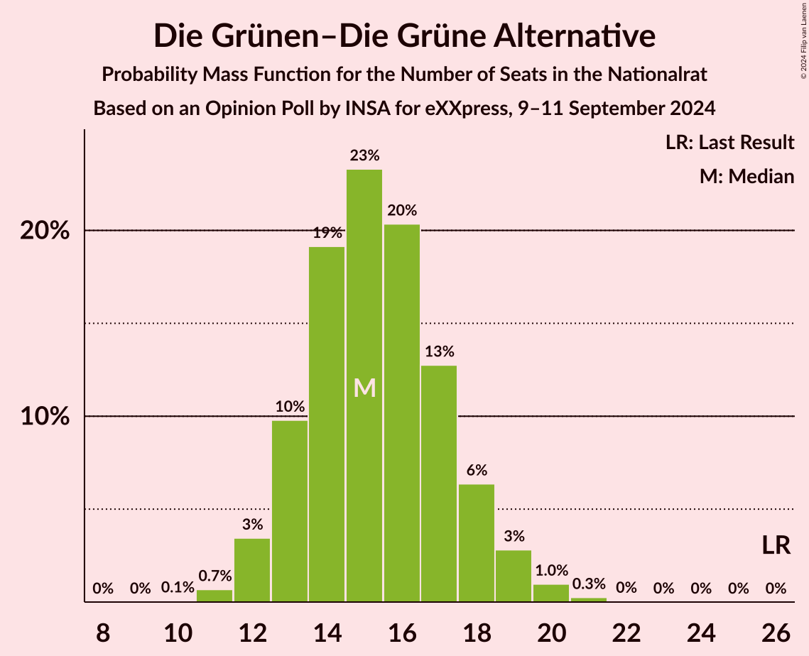
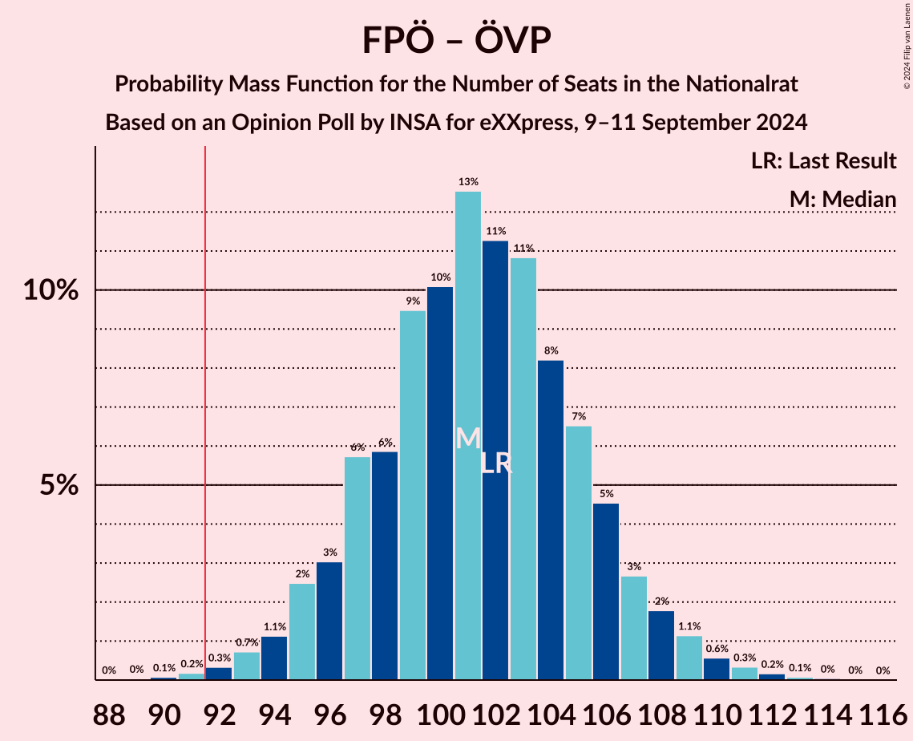
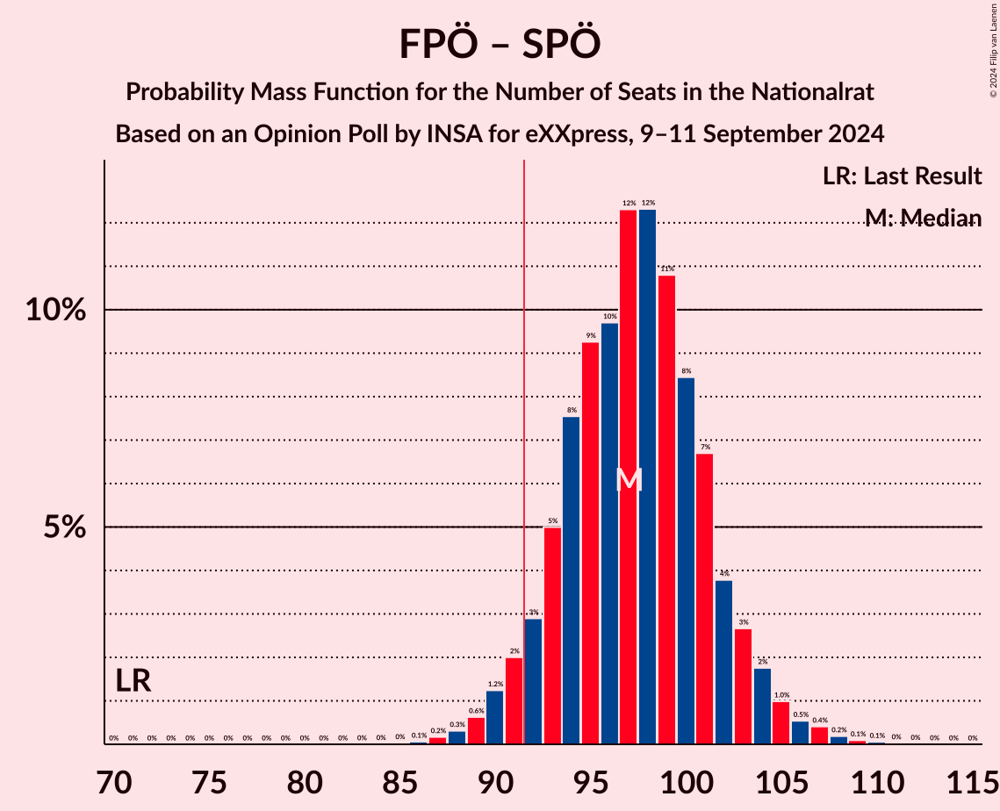
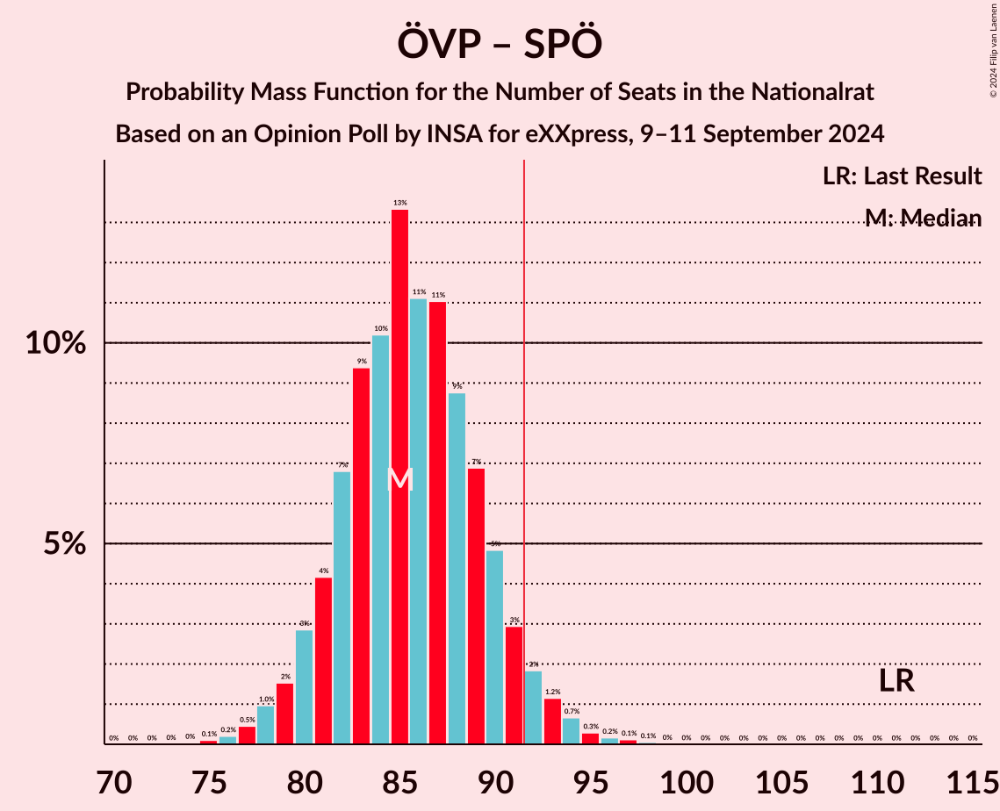
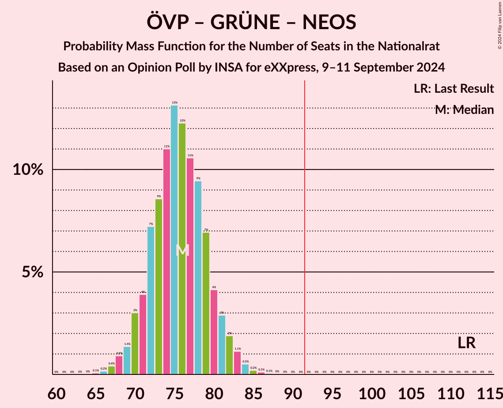
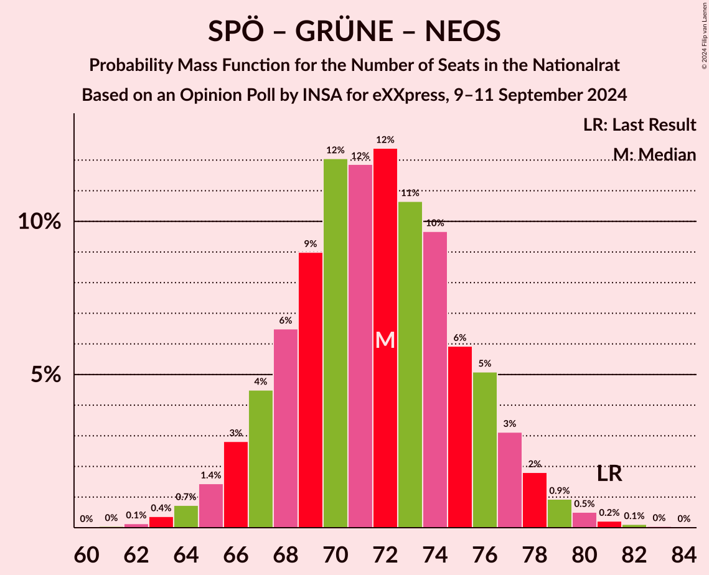
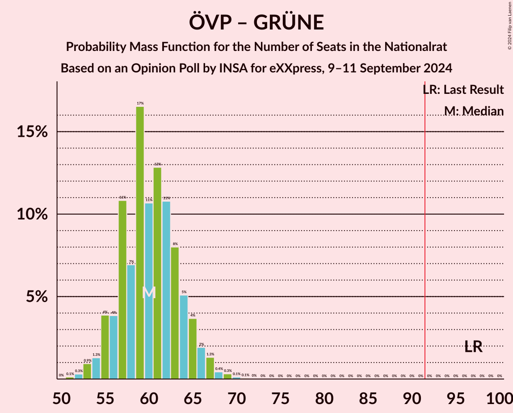
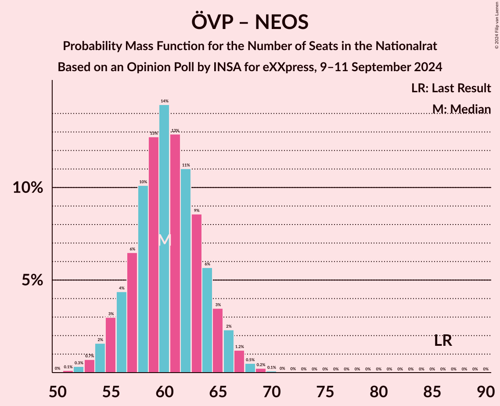
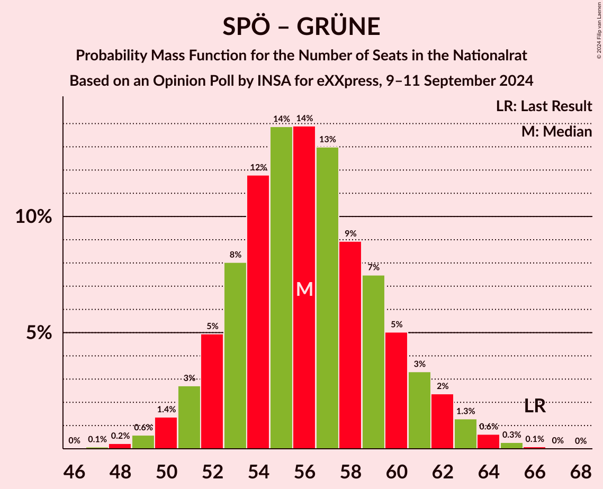

# Opinion Poll by INSA for eXXpress, 9–11 September 2024

<a href="#voting-intentions">Voting Intentions</a> | <a href="#seats">Seats</a> | <a href="#coalitions">Coalitions</a> | <a href="#technical-information">Technical Information</a>

## Voting Intentions

### Confidence Intervals

| Party | Last Result | Poll Result | 80% Confidence Interval | 90% Confidence Interval | 95% Confidence Interval | 99% Confidence Interval |
|:-----:|:-----------:|:-----------:|:-----------------------:|:-----------------------:|:-----------------------:|:-----------------------:|
| Freiheitliche Partei Österreichs | 16.2% | 29.0% | 27.2–30.9% |26.7–31.4% |26.3–31.9% |25.4–32.8% |
| Österreichische Volkspartei | 37.5% | 23.0% | 21.4–24.8% |20.9–25.3% |20.5–25.7% |19.7–26.6% |
| Sozialdemokratische Partei Österreichs | 21.2% | 21.0% | 19.4–22.7% |19.0–23.2% |18.6–23.6% |17.8–24.5% |
| Die Grünen–Die Grüne Alternative | 13.9% | 8.0% | 7.0–9.2% |6.7–9.6% |6.5–9.9% |6.0–10.5% |
| NEOS–Das Neue Österreich und Liberales Forum | 8.1% | 8.0% | 7.0–9.2% |6.7–9.6% |6.5–9.9% |6.0–10.5% |
| Bierpartei | 0.0% | 5.0% | 4.2–6.0% |4.0–6.3% |3.8–6.5% |3.5–7.1% |
| Kommunistische Partei Österreichs | 0.7% | 3.0% | 2.4–3.8% |2.2–4.1% |2.1–4.3% |1.9–4.7% |

*Note:* The poll result column reflects the actual value used in the calculations. Published results may vary slightly, and in addition be rounded to fewer digits.

## Seats

### Confidence Intervals

| Party | Last Result | Median | 80% Confidence Interval | 90% Confidence Interval | 95% Confidence Interval | 99% Confidence Interval |
|:-----:|:-----------:|:------:|:-----------------------:|:-----------------------:|:-----------------------:|:-----------------------:|
| <a href="#freiheitliche-partei-österreichs">Freiheitliche Partei Österreichs</a> | 31 | 56 | 53–60 |52–62 |51–63 |49–64 |
| <a href="#österreichische-volkspartei">Österreichische Volkspartei</a> | 71 | 45 | 41–48 |40–49 |40–50 |38–52 |
| <a href="#sozialdemokratische-partei-österreichs">Sozialdemokratische Partei Österreichs</a> | 40 | 41 | 38–44 |37–45 |36–46 |34–48 |
| <a href="#die-grünen–die-grüne-alternative">Die Grünen–Die Grüne Alternative</a> | 26 | 15 | 13–18 |13–18 |12–19 |11–20 |
| <a href="#neos–das-neue-österreich-und-liberales-forum">NEOS–Das Neue Österreich und Liberales Forum</a> | 15 | 15 | 13–18 |13–18 |12–19 |11–20 |
| <a href="#bierpartei">Bierpartei</a> | 0 | 10 | 8–11 |0–12 |0–12 |0–13 |
| <a href="#kommunistische-partei-österreichs">Kommunistische Partei Österreichs</a> | 0 | 0 | 0 |0–7 |0–8 |0–8 |

### Freiheitliche Partei Österreichs

*For a full overview of the results for this party, see the [Freiheitliche Partei Österreichs](party-freiheitlicheparteiösterreichs.html) page.*

| Number of Seats | Probability | Accumulated | Special Marks |
|:---------------:|:-----------:|:-----------:|:-------------:|
| 31 | 0% | 100% | Last Result |
| 32 | 0% | 100% |  |
| 33 | 0% | 100% |  |
| 34 | 0% | 100% |  |
| 35 | 0% | 100% |  |
| 36 | 0% | 100% |  |
| 37 | 0% | 100% |  |
| 38 | 0% | 100% |  |
| 39 | 0% | 100% |  |
| 40 | 0% | 100% |  |
| 41 | 0% | 100% |  |
| 42 | 0% | 100% |  |
| 43 | 0% | 100% |  |
| 44 | 0% | 100% |  |
| 45 | 0% | 100% |  |
| 46 | 0% | 100% |  |
| 47 | 0.1% | 100% |  |
| 48 | 0.2% | 99.9% |  |
| 49 | 0.5% | 99.8% |  |
| 50 | 1.0% | 99.2% |  |
| 51 | 2% | 98% |  |
| 52 | 4% | 96% |  |
| 53 | 7% | 92% |  |
| 54 | 8% | 85% |  |
| 55 | 12% | 77% |  |
| 56 | 16% | 65% | Median |
| 57 | 12% | 50% |  |
| 58 | 11% | 38% |  |
| 59 | 10% | 27% |  |
| 60 | 8% | 17% |  |
| 61 | 4% | 9% |  |
| 62 | 3% | 5% |  |
| 63 | 2% | 3% |  |
| 64 | 0.6% | 1.1% |  |
| 65 | 0.3% | 0.5% |  |
| 66 | 0.1% | 0.2% |  |
| 67 | 0.1% | 0.1% |  |
| 68 | 0% | 0% |  |

### Österreichische Volkspartei

*For a full overview of the results for this party, see the [Österreichische Volkspartei](party-österreichischevolkspartei.html) page.*

| Number of Seats | Probability | Accumulated | Special Marks |
|:---------------:|:-----------:|:-----------:|:-------------:|
| 36 | 0.1% | 100% |  |
| 37 | 0.2% | 99.9% |  |
| 38 | 0.6% | 99.7% |  |
| 39 | 2% | 99.2% |  |
| 40 | 3% | 98% |  |
| 41 | 5% | 95% |  |
| 42 | 10% | 90% |  |
| 43 | 12% | 80% |  |
| 44 | 15% | 68% |  |
| 45 | 14% | 53% | Median |
| 46 | 14% | 40% |  |
| 47 | 11% | 26% |  |
| 48 | 7% | 15% |  |
| 49 | 4% | 9% |  |
| 50 | 3% | 5% |  |
| 51 | 1.1% | 2% |  |
| 52 | 0.5% | 0.8% |  |
| 53 | 0.2% | 0.4% |  |
| 54 | 0.1% | 0.1% |  |
| 55 | 0% | 0% |  |
| 56 | 0% | 0% |  |
| 57 | 0% | 0% |  |
| 58 | 0% | 0% |  |
| 59 | 0% | 0% |  |
| 60 | 0% | 0% |  |
| 61 | 0% | 0% |  |
| 62 | 0% | 0% |  |
| 63 | 0% | 0% |  |
| 64 | 0% | 0% |  |
| 65 | 0% | 0% |  |
| 66 | 0% | 0% |  |
| 67 | 0% | 0% |  |
| 68 | 0% | 0% |  |
| 69 | 0% | 0% |  |
| 70 | 0% | 0% |  |
| 71 | 0% | 0% | Last Result |

### Sozialdemokratische Partei Österreichs

*For a full overview of the results for this party, see the [Sozialdemokratische Partei Österreichs](party-sozialdemokratischeparteiösterreichs.html) page.*

| Number of Seats | Probability | Accumulated | Special Marks |
|:---------------:|:-----------:|:-----------:|:-------------:|
| 33 | 0.1% | 100% |  |
| 34 | 0.4% | 99.8% |  |
| 35 | 1.1% | 99.4% |  |
| 36 | 3% | 98% |  |
| 37 | 5% | 95% |  |
| 38 | 9% | 90% |  |
| 39 | 13% | 81% |  |
| 40 | 15% | 69% | Last Result |
| 41 | 14% | 54% | Median |
| 42 | 16% | 40% |  |
| 43 | 9% | 24% |  |
| 44 | 7% | 16% |  |
| 45 | 4% | 8% |  |
| 46 | 2% | 4% |  |
| 47 | 1.2% | 2% |  |
| 48 | 0.5% | 0.8% |  |
| 49 | 0.1% | 0.2% |  |
| 50 | 0.1% | 0.1% |  |
| 51 | 0% | 0% |  |

### Die Grünen–Die Grüne Alternative

*For a full overview of the results for this party, see the [Die Grünen–Die Grüne Alternative](party-diegrünen–diegrünealternative.html) page.*

| Number of Seats | Probability | Accumulated | Special Marks |
|:---------------:|:-----------:|:-----------:|:-------------:|
| 10 | 0.1% | 100% |  |
| 11 | 0.7% | 99.9% |  |
| 12 | 4% | 99.2% |  |
| 13 | 9% | 96% |  |
| 14 | 19% | 86% |  |
| 15 | 26% | 67% | Median |
| 16 | 19% | 42% |  |
| 17 | 12% | 23% |  |
| 18 | 7% | 11% |  |
| 19 | 3% | 4% |  |
| 20 | 0.9% | 1.2% |  |
| 21 | 0.3% | 0.3% |  |
| 22 | 0.1% | 0.1% |  |
| 23 | 0% | 0% |  |
| 24 | 0% | 0% |  |
| 25 | 0% | 0% |  |
| 26 | 0% | 0% | Last Result |

### NEOS–Das Neue Österreich und Liberales Forum

*For a full overview of the results for this party, see the [NEOS–Das Neue Österreich und Liberales Forum](party-neos–dasneueösterreichundliberalesforum.html) page.*

| Number of Seats | Probability | Accumulated | Special Marks |
|:---------------:|:-----------:|:-----------:|:-------------:|
| 10 | 0.1% | 100% |  |
| 11 | 0.7% | 99.9% |  |
| 12 | 3% | 99.2% |  |
| 13 | 9% | 96% |  |
| 14 | 16% | 87% |  |
| 15 | 23% | 72% | Last Result, Median |
| 16 | 22% | 49% |  |
| 17 | 16% | 27% |  |
| 18 | 8% | 11% |  |
| 19 | 3% | 4% |  |
| 20 | 0.8% | 1.1% |  |
| 21 | 0.2% | 0.3% |  |
| 22 | 0% | 0.1% |  |
| 23 | 0% | 0% |  |

### Bierpartei

*For a full overview of the results for this party, see the [Bierpartei](party-bierpartei.html) page.*

| Number of Seats | Probability | Accumulated | Special Marks |
|:---------------:|:-----------:|:-----------:|:-------------:|
| 0 | 6% | 100% | Last Result |
| 1 | 0% | 94% |  |
| 2 | 0% | 94% |  |
| 3 | 0% | 94% |  |
| 4 | 0% | 94% |  |
| 5 | 0% | 94% |  |
| 6 | 0% | 94% |  |
| 7 | 0.8% | 94% |  |
| 8 | 14% | 93% |  |
| 9 | 25% | 80% |  |
| 10 | 31% | 55% | Median |
| 11 | 18% | 24% |  |
| 12 | 5% | 6% |  |
| 13 | 1.2% | 2% |  |
| 14 | 0.3% | 0.4% |  |
| 15 | 0.1% | 0.1% |  |
| 16 | 0% | 0% |  |

### Kommunistische Partei Österreichs

*For a full overview of the results for this party, see the [Kommunistische Partei Österreichs](party-kommunistischeparteiösterreichs.html) page.*

| Number of Seats | Probability | Accumulated | Special Marks |
|:---------------:|:-----------:|:-----------:|:-------------:|
| 0 | 95% | 100% | Last Result, Median |
| 1 | 0% | 5% |  |
| 2 | 0% | 5% |  |
| 3 | 0% | 5% |  |
| 4 | 0% | 5% |  |
| 5 | 0% | 5% |  |
| 6 | 0% | 5% |  |
| 7 | 2% | 5% |  |
| 8 | 3% | 3% |  |
| 9 | 0.4% | 0.5% |  |
| 10 | 0% | 0% |  |

## Coalitions

### Confidence Intervals

| Coalition | Last Result | Median | Majority? | 80% Confidence Interval | 90% Confidence Interval | 95% Confidence Interval | 99% Confidence Interval |
|:---------:|:-----------:|:------:|:---------:|:-----------------------:|:-----------------------:|:-----------------------:|:-----------------------:|
| Freiheitliche Partei Österreichs – Österreichische Volkspartei | 102 | 101 | 99.7% | 97–106 | 96–107 | 95–109 | 92–111 |
| Freiheitliche Partei Österreichs – Sozialdemokratische Partei Österreichs | 71 | 98 | 95% | 93–102 | 92–103 | 91–104 | 88–107 |
| Österreichische Volkspartei – Sozialdemokratische Partei Österreichs | 111 | 86 | 5% | 82–90 | 80–91 | 79–93 | 77–95 |
| Österreichische Volkspartei – Die Grünen–Die Grüne Alternative – NEOS–Das Neue Österreich und Liberales Forum | 112 | 75 | 0% | 72–80 | 70–81 | 69–82 | 67–84 |
| Sozialdemokratische Partei Österreichs – Die Grünen–Die Grüne Alternative – NEOS–Das Neue Österreich und Liberales Forum | 81 | 71 | 0% | 67–76 | 66–77 | 65–78 | 63–80 |
| Österreichische Volkspartei – Die Grünen–Die Grüne Alternative | 97 | 60 | 0% | 56–64 | 55–65 | 54–66 | 52–69 |
| Österreichische Volkspartei – NEOS–Das Neue Österreich und Liberales Forum | 86 | 60 | 0% | 57–64 | 55–65 | 54–66 | 52–68 |
| Sozialdemokratische Partei Österreichs – Die Grünen–Die Grüne Alternative | 66 | 56 | 0% | 52–60 | 51–62 | 51–62 | 49–64 |
| Österreichische Volkspartei | 71 | 45 | 0% | 41–48 | 40–49 | 40–50 | 38–52 |
| Sozialdemokratische Partei Österreichs | 40 | 41 | 0% | 38–44 | 37–45 | 36–46 | 34–48 |

### Freiheitliche Partei Österreichs – Österreichische Volkspartei

| Number of Seats | Probability | Accumulated | Special Marks |
|:---------------:|:-----------:|:-----------:|:-------------:|
| 89 | 0% | 100% |  |
| 90 | 0.1% | 99.9% |  |
| 91 | 0.2% | 99.9% |  |
| 92 | 0.3% | 99.7% | Majority |
| 93 | 0.7% | 99.4% |  |
| 94 | 1.2% | 98.7% |  |
| 95 | 3% | 98% |  |
| 96 | 3% | 95% |  |
| 97 | 5% | 92% |  |
| 98 | 6% | 87% |  |
| 99 | 10% | 80% |  |
| 100 | 9% | 71% |  |
| 101 | 12% | 62% | Median |
| 102 | 11% | 49% | Last Result |
| 103 | 12% | 38% |  |
| 104 | 8% | 26% |  |
| 105 | 7% | 19% |  |
| 106 | 4% | 12% |  |
| 107 | 3% | 7% |  |
| 108 | 2% | 4% |  |
| 109 | 1.2% | 3% |  |
| 110 | 0.7% | 1.4% |  |
| 111 | 0.4% | 0.7% |  |
| 112 | 0.2% | 0.3% |  |
| 113 | 0.1% | 0.2% |  |
| 114 | 0.1% | 0.1% |  |
| 115 | 0% | 0% |  |

### Freiheitliche Partei Österreichs – Sozialdemokratische Partei Österreichs

| Number of Seats | Probability | Accumulated | Special Marks |
|:---------------:|:-----------:|:-----------:|:-------------:|
| 71 | 0% | 100% | Last Result |
| 72 | 0% | 100% |  |
| 73 | 0% | 100% |  |
| 74 | 0% | 100% |  |
| 75 | 0% | 100% |  |
| 76 | 0% | 100% |  |
| 77 | 0% | 100% |  |
| 78 | 0% | 100% |  |
| 79 | 0% | 100% |  |
| 80 | 0% | 100% |  |
| 81 | 0% | 100% |  |
| 82 | 0% | 100% |  |
| 83 | 0% | 100% |  |
| 84 | 0% | 100% |  |
| 85 | 0% | 100% |  |
| 86 | 0.1% | 100% |  |
| 87 | 0.2% | 99.9% |  |
| 88 | 0.3% | 99.7% |  |
| 89 | 0.6% | 99.4% |  |
| 90 | 1.2% | 98.8% |  |
| 91 | 2% | 98% |  |
| 92 | 3% | 95% | Majority |
| 93 | 5% | 93% |  |
| 94 | 8% | 87% |  |
| 95 | 7% | 79% |  |
| 96 | 9% | 72% |  |
| 97 | 13% | 63% | Median |
| 98 | 14% | 50% |  |
| 99 | 10% | 36% |  |
| 100 | 9% | 27% |  |
| 101 | 7% | 18% |  |
| 102 | 4% | 11% |  |
| 103 | 3% | 7% |  |
| 104 | 2% | 4% |  |
| 105 | 1.1% | 2% |  |
| 106 | 0.5% | 1.3% |  |
| 107 | 0.5% | 0.8% |  |
| 108 | 0.2% | 0.3% |  |
| 109 | 0.1% | 0.2% |  |
| 110 | 0% | 0.1% |  |
| 111 | 0% | 0.1% |  |
| 112 | 0% | 0% |  |

### Österreichische Volkspartei – Sozialdemokratische Partei Österreichs

| Number of Seats | Probability | Accumulated | Special Marks |
|:---------------:|:-----------:|:-----------:|:-------------:|
| 74 | 0% | 100% |  |
| 75 | 0.1% | 99.9% |  |
| 76 | 0.2% | 99.8% |  |
| 77 | 0.5% | 99.6% |  |
| 78 | 1.0% | 99.2% |  |
| 79 | 1.4% | 98% |  |
| 80 | 3% | 97% |  |
| 81 | 4% | 94% |  |
| 82 | 8% | 90% |  |
| 83 | 9% | 82% |  |
| 84 | 10% | 73% |  |
| 85 | 13% | 64% |  |
| 86 | 12% | 51% | Median |
| 87 | 11% | 38% |  |
| 88 | 8% | 27% |  |
| 89 | 7% | 19% |  |
| 90 | 5% | 12% |  |
| 91 | 3% | 8% |  |
| 92 | 2% | 5% | Majority |
| 93 | 1.1% | 3% |  |
| 94 | 0.8% | 1.5% |  |
| 95 | 0.3% | 0.6% |  |
| 96 | 0.1% | 0.3% |  |
| 97 | 0.1% | 0.2% |  |
| 98 | 0.1% | 0.1% |  |
| 99 | 0% | 0% |  |
| 100 | 0% | 0% |  |
| 101 | 0% | 0% |  |
| 102 | 0% | 0% |  |
| 103 | 0% | 0% |  |
| 104 | 0% | 0% |  |
| 105 | 0% | 0% |  |
| 106 | 0% | 0% |  |
| 107 | 0% | 0% |  |
| 108 | 0% | 0% |  |
| 109 | 0% | 0% |  |
| 110 | 0% | 0% |  |
| 111 | 0% | 0% | Last Result |

### Österreichische Volkspartei – Die Grünen–Die Grüne Alternative – NEOS–Das Neue Österreich und Liberales Forum

| Number of Seats | Probability | Accumulated | Special Marks |
|:---------------:|:-----------:|:-----------:|:-------------:|
| 65 | 0.1% | 100% |  |
| 66 | 0.2% | 99.9% |  |
| 67 | 0.4% | 99.7% |  |
| 68 | 0.9% | 99.3% |  |
| 69 | 1.3% | 98% |  |
| 70 | 3% | 97% |  |
| 71 | 4% | 94% |  |
| 72 | 7% | 90% |  |
| 73 | 9% | 83% |  |
| 74 | 11% | 74% |  |
| 75 | 13% | 63% | Median |
| 76 | 12% | 50% |  |
| 77 | 10% | 37% |  |
| 78 | 8% | 27% |  |
| 79 | 8% | 19% |  |
| 80 | 4% | 11% |  |
| 81 | 3% | 7% |  |
| 82 | 2% | 4% |  |
| 83 | 1.2% | 2% |  |
| 84 | 0.5% | 0.9% |  |
| 85 | 0.2% | 0.4% |  |
| 86 | 0.1% | 0.2% |  |
| 87 | 0% | 0.1% |  |
| 88 | 0% | 0.1% |  |
| 89 | 0% | 0% |  |
| 90 | 0% | 0% |  |
| 91 | 0% | 0% |  |
| 92 | 0% | 0% | Majority |
| 93 | 0% | 0% |  |
| 94 | 0% | 0% |  |
| 95 | 0% | 0% |  |
| 96 | 0% | 0% |  |
| 97 | 0% | 0% |  |
| 98 | 0% | 0% |  |
| 99 | 0% | 0% |  |
| 100 | 0% | 0% |  |
| 101 | 0% | 0% |  |
| 102 | 0% | 0% |  |
| 103 | 0% | 0% |  |
| 104 | 0% | 0% |  |
| 105 | 0% | 0% |  |
| 106 | 0% | 0% |  |
| 107 | 0% | 0% |  |
| 108 | 0% | 0% |  |
| 109 | 0% | 0% |  |
| 110 | 0% | 0% |  |
| 111 | 0% | 0% |  |
| 112 | 0% | 0% | Last Result |

### Sozialdemokratische Partei Österreichs – Die Grünen–Die Grüne Alternative – NEOS–Das Neue Österreich und Liberales Forum

| Number of Seats | Probability | Accumulated | Special Marks |
|:---------------:|:-----------:|:-----------:|:-------------:|
| 61 | 0% | 100% |  |
| 62 | 0.1% | 99.9% |  |
| 63 | 0.4% | 99.8% |  |
| 64 | 0.8% | 99.4% |  |
| 65 | 1.4% | 98.7% |  |
| 66 | 3% | 97% |  |
| 67 | 5% | 95% |  |
| 68 | 7% | 90% |  |
| 69 | 10% | 83% |  |
| 70 | 11% | 73% |  |
| 71 | 13% | 62% | Median |
| 72 | 11% | 50% |  |
| 73 | 12% | 39% |  |
| 74 | 9% | 26% |  |
| 75 | 6% | 18% |  |
| 76 | 5% | 12% |  |
| 77 | 3% | 7% |  |
| 78 | 2% | 4% |  |
| 79 | 1.0% | 2% |  |
| 80 | 0.6% | 0.9% |  |
| 81 | 0.2% | 0.4% | Last Result |
| 82 | 0.1% | 0.2% |  |
| 83 | 0.1% | 0.1% |  |
| 84 | 0% | 0% |  |

### Österreichische Volkspartei – Die Grünen–Die Grüne Alternative

| Number of Seats | Probability | Accumulated | Special Marks |
|:---------------:|:-----------:|:-----------:|:-------------:|
| 50 | 0.1% | 100% |  |
| 51 | 0.1% | 99.9% |  |
| 52 | 0.3% | 99.8% |  |
| 53 | 0.9% | 99.5% |  |
| 54 | 1.4% | 98.6% |  |
| 55 | 4% | 97% |  |
| 56 | 4% | 93% |  |
| 57 | 11% | 90% |  |
| 58 | 7% | 79% |  |
| 59 | 18% | 72% |  |
| 60 | 8% | 54% | Median |
| 61 | 15% | 45% |  |
| 62 | 9% | 30% |  |
| 63 | 9% | 22% |  |
| 64 | 5% | 13% |  |
| 65 | 4% | 8% |  |
| 66 | 2% | 4% |  |
| 67 | 1.5% | 2% |  |
| 68 | 0.4% | 1.0% |  |
| 69 | 0.4% | 0.6% |  |
| 70 | 0.1% | 0.2% |  |
| 71 | 0.1% | 0.1% |  |
| 72 | 0% | 0% |  |
| 73 | 0% | 0% |  |
| 74 | 0% | 0% |  |
| 75 | 0% | 0% |  |
| 76 | 0% | 0% |  |
| 77 | 0% | 0% |  |
| 78 | 0% | 0% |  |
| 79 | 0% | 0% |  |
| 80 | 0% | 0% |  |
| 81 | 0% | 0% |  |
| 82 | 0% | 0% |  |
| 83 | 0% | 0% |  |
| 84 | 0% | 0% |  |
| 85 | 0% | 0% |  |
| 86 | 0% | 0% |  |
| 87 | 0% | 0% |  |
| 88 | 0% | 0% |  |
| 89 | 0% | 0% |  |
| 90 | 0% | 0% |  |
| 91 | 0% | 0% |  |
| 92 | 0% | 0% | Majority |
| 93 | 0% | 0% |  |
| 94 | 0% | 0% |  |
| 95 | 0% | 0% |  |
| 96 | 0% | 0% |  |
| 97 | 0% | 0% | Last Result |

### Österreichische Volkspartei – NEOS–Das Neue Österreich und Liberales Forum

| Number of Seats | Probability | Accumulated | Special Marks |
|:---------------:|:-----------:|:-----------:|:-------------:|
| 50 | 0% | 100% |  |
| 51 | 0.1% | 99.9% |  |
| 52 | 0.3% | 99.8% |  |
| 53 | 0.8% | 99.5% |  |
| 54 | 2% | 98.7% |  |
| 55 | 3% | 97% |  |
| 56 | 4% | 94% |  |
| 57 | 7% | 90% |  |
| 58 | 10% | 83% |  |
| 59 | 13% | 73% |  |
| 60 | 14% | 60% | Median |
| 61 | 13% | 46% |  |
| 62 | 10% | 32% |  |
| 63 | 8% | 23% |  |
| 64 | 6% | 14% |  |
| 65 | 4% | 9% |  |
| 66 | 2% | 5% |  |
| 67 | 1.3% | 2% |  |
| 68 | 0.5% | 0.9% |  |
| 69 | 0.2% | 0.4% |  |
| 70 | 0.1% | 0.1% |  |
| 71 | 0% | 0% |  |
| 72 | 0% | 0% |  |
| 73 | 0% | 0% |  |
| 74 | 0% | 0% |  |
| 75 | 0% | 0% |  |
| 76 | 0% | 0% |  |
| 77 | 0% | 0% |  |
| 78 | 0% | 0% |  |
| 79 | 0% | 0% |  |
| 80 | 0% | 0% |  |
| 81 | 0% | 0% |  |
| 82 | 0% | 0% |  |
| 83 | 0% | 0% |  |
| 84 | 0% | 0% |  |
| 85 | 0% | 0% |  |
| 86 | 0% | 0% | Last Result |

### Sozialdemokratische Partei Österreichs – Die Grünen–Die Grüne Alternative

| Number of Seats | Probability | Accumulated | Special Marks |
|:---------------:|:-----------:|:-----------:|:-------------:|
| 47 | 0.1% | 100% |  |
| 48 | 0.2% | 99.9% |  |
| 49 | 0.6% | 99.7% |  |
| 50 | 1.5% | 99.0% |  |
| 51 | 3% | 98% |  |
| 52 | 5% | 95% |  |
| 53 | 8% | 89% |  |
| 54 | 13% | 82% |  |
| 55 | 13% | 69% |  |
| 56 | 13% | 56% | Median |
| 57 | 12% | 42% |  |
| 58 | 9% | 30% |  |
| 59 | 8% | 21% |  |
| 60 | 5% | 13% |  |
| 61 | 3% | 8% |  |
| 62 | 3% | 5% |  |
| 63 | 1.4% | 2% |  |
| 64 | 0.6% | 1.0% |  |
| 65 | 0.2% | 0.4% |  |
| 66 | 0.1% | 0.1% | Last Result |
| 67 | 0% | 0% |  |

### Österreichische Volkspartei

| Number of Seats | Probability | Accumulated | Special Marks |
|:---------------:|:-----------:|:-----------:|:-------------:|
| 36 | 0.1% | 100% |  |
| 37 | 0.2% | 99.9% |  |
| 38 | 0.6% | 99.7% |  |
| 39 | 2% | 99.2% |  |
| 40 | 3% | 98% |  |
| 41 | 5% | 95% |  |
| 42 | 10% | 90% |  |
| 43 | 12% | 80% |  |
| 44 | 15% | 68% |  |
| 45 | 14% | 53% | Median |
| 46 | 14% | 40% |  |
| 47 | 11% | 26% |  |
| 48 | 7% | 15% |  |
| 49 | 4% | 9% |  |
| 50 | 3% | 5% |  |
| 51 | 1.1% | 2% |  |
| 52 | 0.5% | 0.8% |  |
| 53 | 0.2% | 0.4% |  |
| 54 | 0.1% | 0.1% |  |
| 55 | 0% | 0% |  |
| 56 | 0% | 0% |  |
| 57 | 0% | 0% |  |
| 58 | 0% | 0% |  |
| 59 | 0% | 0% |  |
| 60 | 0% | 0% |  |
| 61 | 0% | 0% |  |
| 62 | 0% | 0% |  |
| 63 | 0% | 0% |  |
| 64 | 0% | 0% |  |
| 65 | 0% | 0% |  |
| 66 | 0% | 0% |  |
| 67 | 0% | 0% |  |
| 68 | 0% | 0% |  |
| 69 | 0% | 0% |  |
| 70 | 0% | 0% |  |
| 71 | 0% | 0% | Last Result |

### Sozialdemokratische Partei Österreichs

| Number of Seats | Probability | Accumulated | Special Marks |
|:---------------:|:-----------:|:-----------:|:-------------:|
| 33 | 0.1% | 100% |  |
| 34 | 0.4% | 99.8% |  |
| 35 | 1.1% | 99.4% |  |
| 36 | 3% | 98% |  |
| 37 | 5% | 95% |  |
| 38 | 9% | 90% |  |
| 39 | 13% | 81% |  |
| 40 | 15% | 69% | Last Result |
| 41 | 14% | 54% | Median |
| 42 | 16% | 40% |  |
| 43 | 9% | 24% |  |
| 44 | 7% | 16% |  |
| 45 | 4% | 8% |  |
| 46 | 2% | 4% |  |
| 47 | 1.2% | 2% |  |
| 48 | 0.5% | 0.8% |  |
| 49 | 0.1% | 0.2% |  |
| 50 | 0.1% | 0.1% |  |
| 51 | 0% | 0% |  |

## Technical Information

### Opinion Poll

+ **Polling firm:** INSA
+ **Commissioner(s):** eXXpress
+ **Fieldwork period:** 9–11 September 2024

### Calculations

+ **Sample size:** 1000
+ **Simulations done:** 1,048,576
+ **Error estimate:** 0.56%

