# Opinion Poll by Unique Research for Heute, 5–11 September 2024

<a href="#voting-intentions">Voting Intentions</a> | <a href="#seats">Seats</a> | <a href="#coalitions">Coalitions</a> | <a href="#technical-information">Technical Information</a>

## Voting Intentions

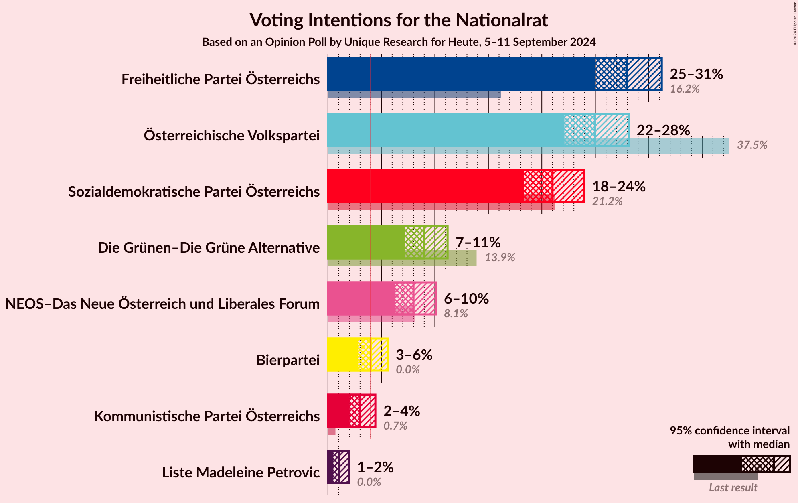

### Confidence Intervals

| Party | Last Result | Poll Result | 80% Confidence Interval | 90% Confidence Interval | 95% Confidence Interval | 99% Confidence Interval |
|:-----:|:-----------:|:-----------:|:-----------------------:|:-----------------------:|:-----------------------:|:-----------------------:|
| Freiheitliche Partei Österreichs | 16.2% | 28.0% | 26.0–30.1% |25.5–30.7% |25.0–31.2% |24.1–32.3% |
| Österreichische Volkspartei | 37.5% | 25.0% | 23.1–27.0% |22.6–27.6% |22.1–28.1% |21.2–29.1% |
| Sozialdemokratische Partei Österreichs | 21.2% | 21.0% | 19.2–22.9% |18.7–23.5% |18.3–24.0% |17.5–24.9% |
| Die Grünen–Die Grüne Alternative | 13.9% | 9.0% | 7.8–10.4% |7.5–10.8% |7.2–11.2% |6.7–11.9% |
| NEOS–Das Neue Österreich und Liberales Forum | 8.1% | 8.0% | 6.9–9.4% |6.6–9.8% |6.3–10.1% |5.8–10.8% |
| Bierpartei | 0.0% | 4.0% | 3.2–5.0% |3.0–5.3% |2.9–5.6% |2.5–6.1% |
| Kommunistische Partei Österreichs | 0.7% | 3.0% | 2.3–3.9% |2.2–4.2% |2.0–4.4% |1.8–4.9% |
| Liste Madeleine Petrovic | 0.0% | 1.0% | 0.7–1.6% |0.6–1.8% |0.5–2.0% |0.4–2.3% |

*Note:* The poll result column reflects the actual value used in the calculations. Published results may vary slightly, and in addition be rounded to fewer digits.

## Seats

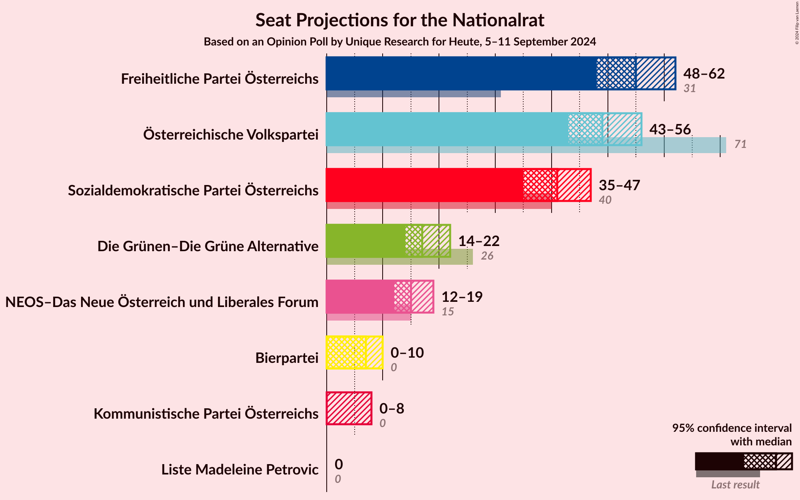

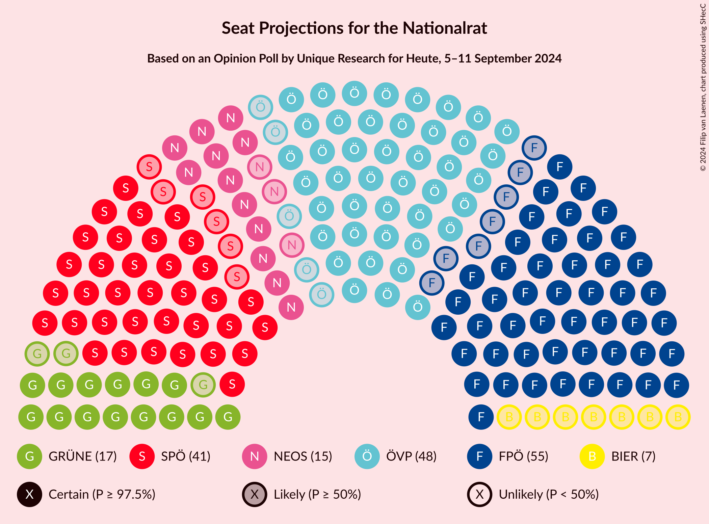

### Confidence Intervals

| Party | Last Result | Median | 80% Confidence Interval | 90% Confidence Interval | 95% Confidence Interval | 99% Confidence Interval |
|:-----:|:-----------:|:------:|:-----------------------:|:-----------------------:|:-----------------------:|:-----------------------:|
| <a href="#freiheitliche-partei-österreichs">Freiheitliche Partei Österreichs</a> | 31 | 55 | 51–59 |49–61 |48–62 |46–64 |
| <a href="#österreichische-volkspartei">Österreichische Volkspartei</a> | 71 | 49 | 45–53 |44–54 |43–56 |41–58 |
| <a href="#sozialdemokratische-partei-österreichs">Sozialdemokratische Partei Österreichs</a> | 40 | 41 | 37–45 |36–46 |35–47 |34–49 |
| <a href="#die-grünen–die-grüne-alternative">Die Grünen–Die Grüne Alternative</a> | 26 | 17 | 15–20 |14–21 |14–22 |13–23 |
| <a href="#neos–das-neue-österreich-und-liberales-forum">NEOS–Das Neue Österreich und Liberales Forum</a> | 15 | 15 | 13–18 |12–19 |12–19 |11–21 |
| <a href="#bierpartei">Bierpartei</a> | 0 | 7 | 0–9 |0–10 |0–10 |0–11 |
| <a href="#kommunistische-partei-österreichs">Kommunistische Partei Österreichs</a> | 0 | 0 | 0 |0–8 |0–8 |0–9 |
| <a href="#liste-madeleine-petrovic">Liste Madeleine Petrovic</a> | 0 | 0 | 0 |0 |0 |0 |

### Freiheitliche Partei Österreichs

*For a full overview of the results for this party, see the [Freiheitliche Partei Österreichs](party-freiheitlicheparteiösterreichs.html) page.*

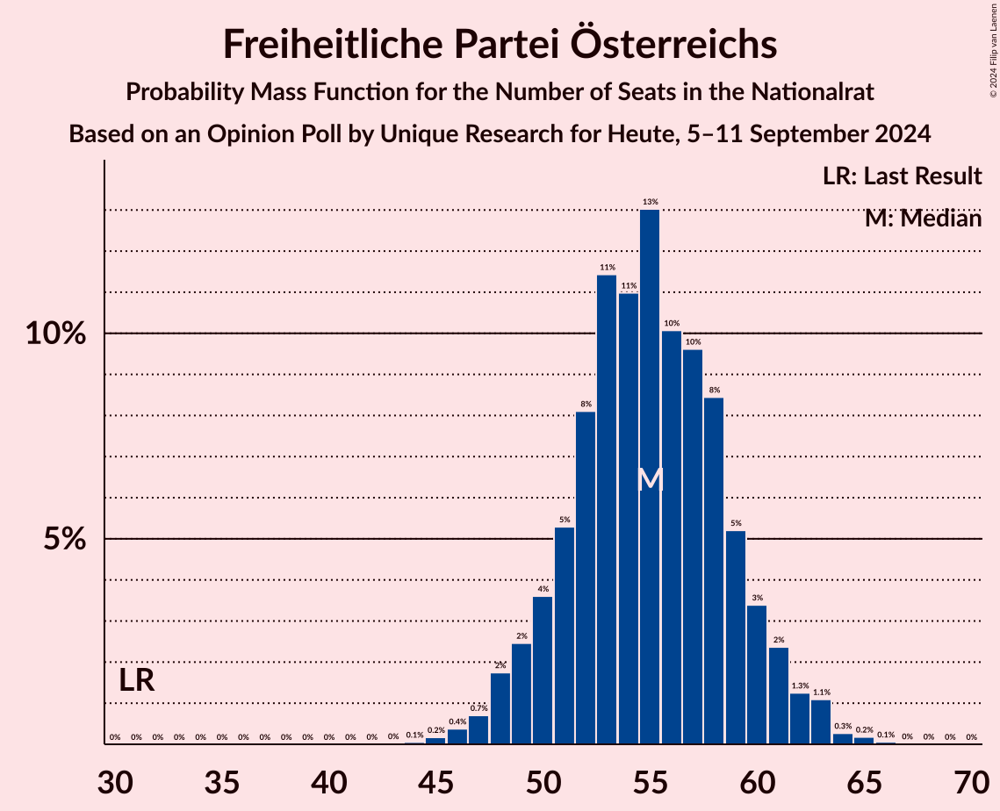

| Number of Seats | Probability | Accumulated | Special Marks |
|:---------------:|:-----------:|:-----------:|:-------------:|
| 31 | 0% | 100% | Last Result |
| 32 | 0% | 100% |  |
| 33 | 0% | 100% |  |
| 34 | 0% | 100% |  |
| 35 | 0% | 100% |  |
| 36 | 0% | 100% |  |
| 37 | 0% | 100% |  |
| 38 | 0% | 100% |  |
| 39 | 0% | 100% |  |
| 40 | 0% | 100% |  |
| 41 | 0% | 100% |  |
| 42 | 0% | 100% |  |
| 43 | 0% | 100% |  |
| 44 | 0.1% | 100% |  |
| 45 | 0.2% | 99.9% |  |
| 46 | 0.4% | 99.8% |  |
| 47 | 0.7% | 99.4% |  |
| 48 | 2% | 98.7% |  |
| 49 | 2% | 97% |  |
| 50 | 4% | 94% |  |
| 51 | 5% | 91% |  |
| 52 | 8% | 86% |  |
| 53 | 11% | 77% |  |
| 54 | 11% | 66% |  |
| 55 | 13% | 55% | Median |
| 56 | 10% | 42% |  |
| 57 | 10% | 32% |  |
| 58 | 8% | 22% |  |
| 59 | 5% | 14% |  |
| 60 | 3% | 9% |  |
| 61 | 2% | 5% |  |
| 62 | 1.3% | 3% |  |
| 63 | 1.1% | 2% |  |
| 64 | 0.3% | 0.5% |  |
| 65 | 0.2% | 0.3% |  |
| 66 | 0.1% | 0.1% |  |
| 67 | 0% | 0% |  |

### Österreichische Volkspartei

*For a full overview of the results for this party, see the [Österreichische Volkspartei](party-österreichischevolkspartei.html) page.*

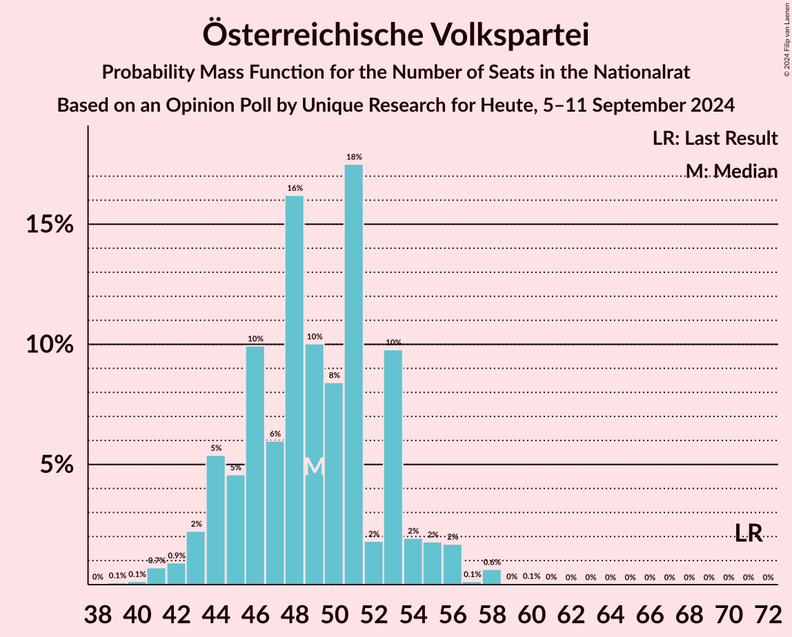

| Number of Seats | Probability | Accumulated | Special Marks |
|:---------------:|:-----------:|:-----------:|:-------------:|
| 39 | 0.1% | 100% |  |
| 40 | 0.1% | 99.9% |  |
| 41 | 0.7% | 99.8% |  |
| 42 | 0.9% | 99.0% |  |
| 43 | 2% | 98% |  |
| 44 | 5% | 96% |  |
| 45 | 5% | 91% |  |
| 46 | 10% | 86% |  |
| 47 | 6% | 76% |  |
| 48 | 16% | 70% |  |
| 49 | 10% | 54% | Median |
| 50 | 8% | 44% |  |
| 51 | 18% | 35% |  |
| 52 | 2% | 18% |  |
| 53 | 10% | 16% |  |
| 54 | 2% | 6% |  |
| 55 | 2% | 4% |  |
| 56 | 2% | 3% |  |
| 57 | 0.1% | 0.9% |  |
| 58 | 0.6% | 0.8% |  |
| 59 | 0% | 0.1% |  |
| 60 | 0.1% | 0.1% |  |
| 61 | 0% | 0% |  |
| 62 | 0% | 0% |  |
| 63 | 0% | 0% |  |
| 64 | 0% | 0% |  |
| 65 | 0% | 0% |  |
| 66 | 0% | 0% |  |
| 67 | 0% | 0% |  |
| 68 | 0% | 0% |  |
| 69 | 0% | 0% |  |
| 70 | 0% | 0% |  |
| 71 | 0% | 0% | Last Result |

### Sozialdemokratische Partei Österreichs

*For a full overview of the results for this party, see the [Sozialdemokratische Partei Österreichs](party-sozialdemokratischeparteiösterreichs.html) page.*

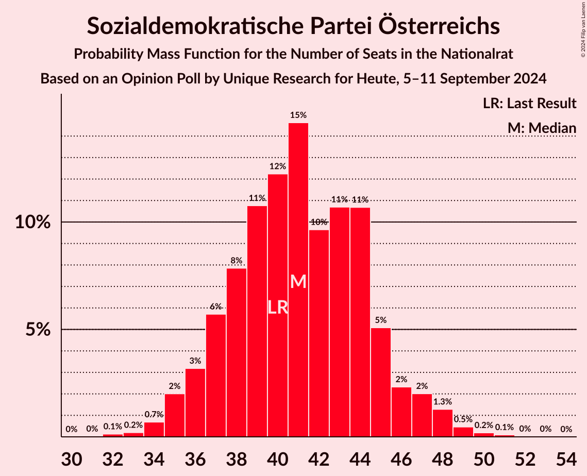

| Number of Seats | Probability | Accumulated | Special Marks |
|:---------------:|:-----------:|:-----------:|:-------------:|
| 32 | 0.1% | 100% |  |
| 33 | 0.2% | 99.8% |  |
| 34 | 0.7% | 99.6% |  |
| 35 | 2% | 98.9% |  |
| 36 | 3% | 97% |  |
| 37 | 6% | 94% |  |
| 38 | 8% | 88% |  |
| 39 | 11% | 80% |  |
| 40 | 12% | 69% | Last Result |
| 41 | 15% | 57% | Median |
| 42 | 10% | 43% |  |
| 43 | 11% | 33% |  |
| 44 | 11% | 22% |  |
| 45 | 5% | 12% |  |
| 46 | 2% | 6% |  |
| 47 | 2% | 4% |  |
| 48 | 1.3% | 2% |  |
| 49 | 0.5% | 0.8% |  |
| 50 | 0.2% | 0.3% |  |
| 51 | 0.1% | 0.1% |  |
| 52 | 0% | 0.1% |  |
| 53 | 0% | 0% |  |

### Die Grünen–Die Grüne Alternative

*For a full overview of the results for this party, see the [Die Grünen–Die Grüne Alternative](party-diegrünen–diegrünealternative.html) page.*

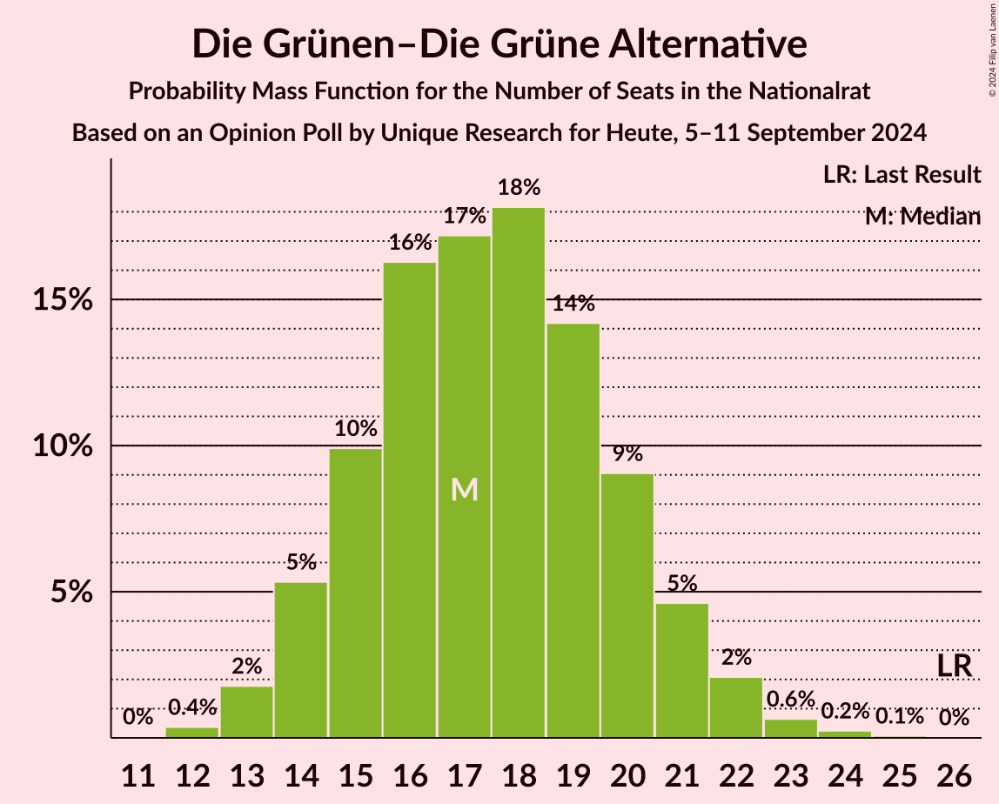

| Number of Seats | Probability | Accumulated | Special Marks |
|:---------------:|:-----------:|:-----------:|:-------------:|
| 12 | 0.4% | 100% |  |
| 13 | 2% | 99.6% |  |
| 14 | 5% | 98% |  |
| 15 | 10% | 92% |  |
| 16 | 16% | 83% |  |
| 17 | 17% | 66% | Median |
| 18 | 18% | 49% |  |
| 19 | 14% | 31% |  |
| 20 | 9% | 17% |  |
| 21 | 5% | 8% |  |
| 22 | 2% | 3% |  |
| 23 | 0.6% | 1.0% |  |
| 24 | 0.2% | 0.3% |  |
| 25 | 0.1% | 0.1% |  |
| 26 | 0% | 0% | Last Result |

### NEOS–Das Neue Österreich und Liberales Forum

*For a full overview of the results for this party, see the [NEOS–Das Neue Österreich und Liberales Forum](party-neos–dasneueösterreichundliberalesforum.html) page.*

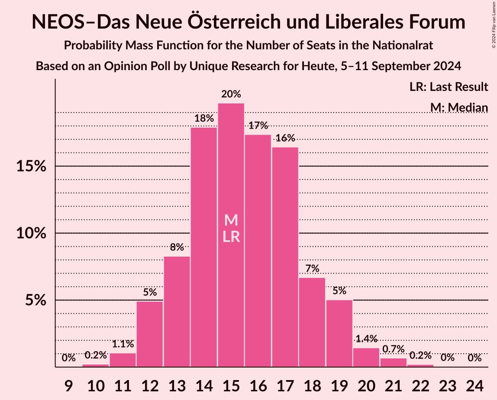

| Number of Seats | Probability | Accumulated | Special Marks |
|:---------------:|:-----------:|:-----------:|:-------------:|
| 10 | 0.2% | 100% |  |
| 11 | 1.1% | 99.8% |  |
| 12 | 5% | 98.7% |  |
| 13 | 8% | 94% |  |
| 14 | 18% | 86% |  |
| 15 | 20% | 68% | Last Result, Median |
| 16 | 17% | 48% |  |
| 17 | 16% | 31% |  |
| 18 | 7% | 14% |  |
| 19 | 5% | 7% |  |
| 20 | 1.4% | 2% |  |
| 21 | 0.7% | 0.9% |  |
| 22 | 0.2% | 0.3% |  |
| 23 | 0% | 0.1% |  |
| 24 | 0% | 0% |  |

### Bierpartei

*For a full overview of the results for this party, see the [Bierpartei](party-bierpartei.html) page.*

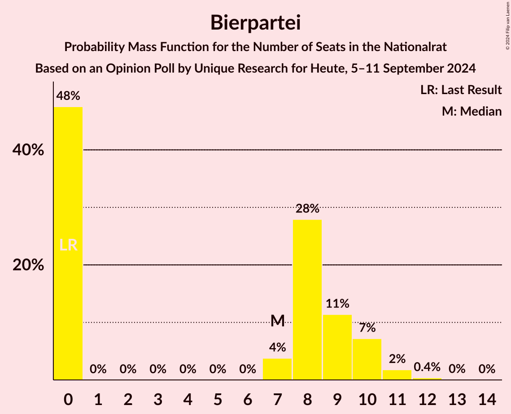

| Number of Seats | Probability | Accumulated | Special Marks |
|:---------------:|:-----------:|:-----------:|:-------------:|
| 0 | 48% | 100% | Last Result |
| 1 | 0% | 52% |  |
| 2 | 0% | 52% |  |
| 3 | 0% | 52% |  |
| 4 | 0% | 52% |  |
| 5 | 0% | 52% |  |
| 6 | 0% | 52% |  |
| 7 | 4% | 52% | Median |
| 8 | 28% | 49% |  |
| 9 | 11% | 21% |  |
| 10 | 7% | 9% |  |
| 11 | 2% | 2% |  |
| 12 | 0.4% | 0.4% |  |
| 13 | 0% | 0.1% |  |
| 14 | 0% | 0% |  |

### Kommunistische Partei Österreichs

*For a full overview of the results for this party, see the [Kommunistische Partei Österreichs](party-kommunistischeparteiösterreichs.html) page.*

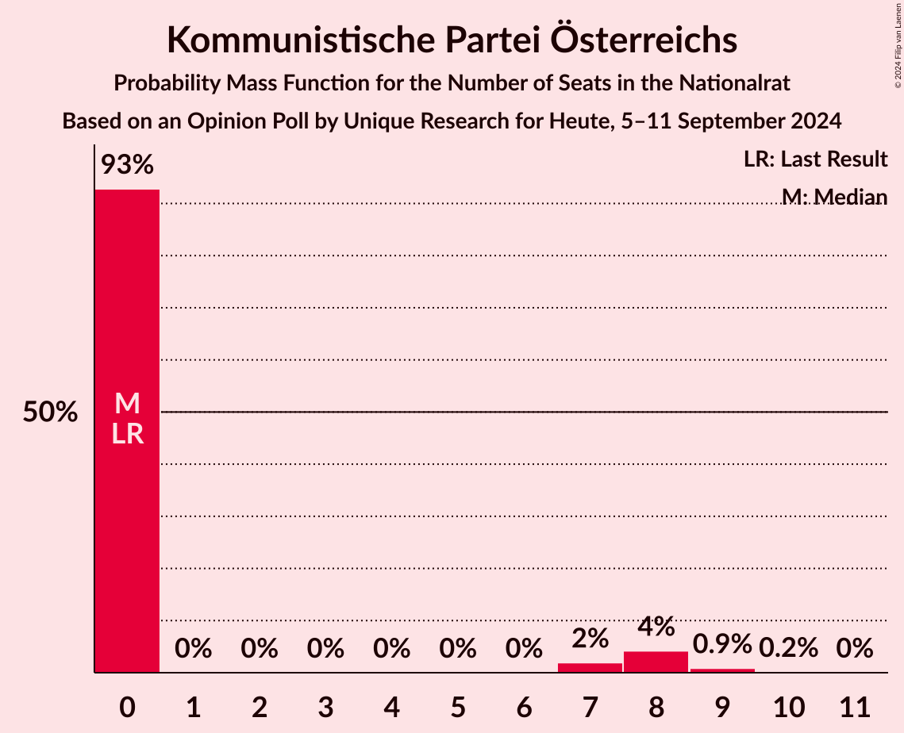

| Number of Seats | Probability | Accumulated | Special Marks |
|:---------------:|:-----------:|:-----------:|:-------------:|
| 0 | 93% | 100% | Last Result, Median |
| 1 | 0% | 7% |  |
| 2 | 0% | 7% |  |
| 3 | 0% | 7% |  |
| 4 | 0% | 7% |  |
| 5 | 0% | 7% |  |
| 6 | 0% | 7% |  |
| 7 | 2% | 7% |  |
| 8 | 4% | 5% |  |
| 9 | 0.9% | 1.0% |  |
| 10 | 0.2% | 0.2% |  |
| 11 | 0% | 0% |  |

### Liste Madeleine Petrovic

*For a full overview of the results for this party, see the [Liste Madeleine Petrovic](party-listemadeleinepetrovic.html) page.*

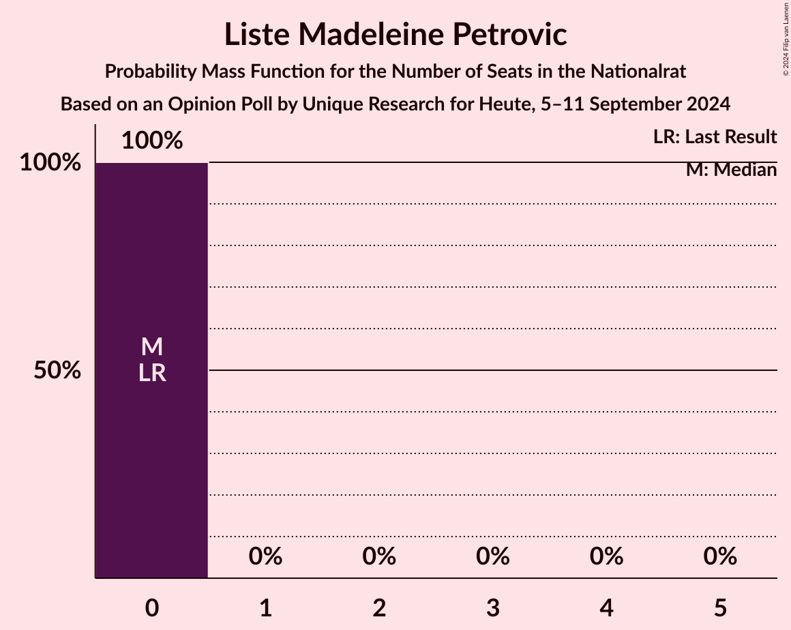

| Number of Seats | Probability | Accumulated | Special Marks |
|:---------------:|:-----------:|:-----------:|:-------------:|
| 0 | 100% | 100% | Last Result, Median |

## Coalitions

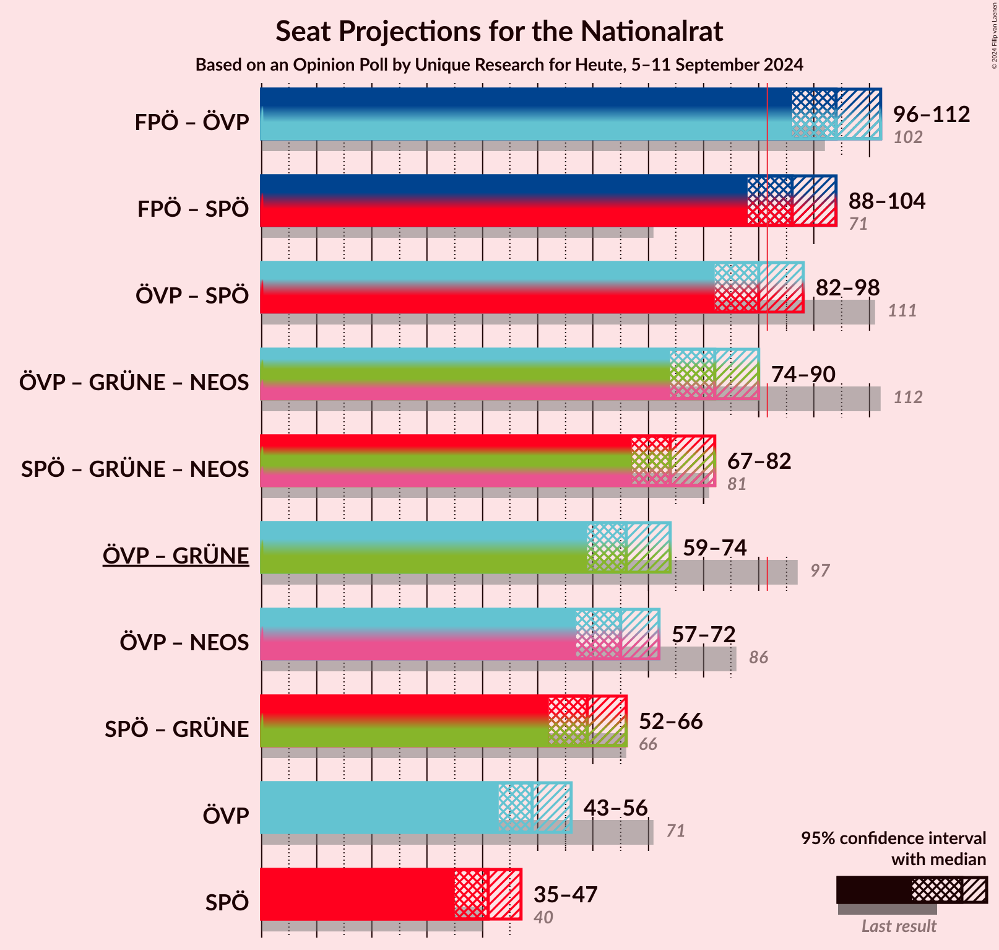

### Confidence Intervals

| Coalition | Last Result | Median | Majority? | 80% Confidence Interval | 90% Confidence Interval | 95% Confidence Interval | 99% Confidence Interval |
|:---------:|:-----------:|:------:|:---------:|:-----------------------:|:-----------------------:|:-----------------------:|:-----------------------:|
| Freiheitliche Partei Österreichs – Österreichische Volkspartei | 102 | 104 | 99.8% | 99–109 | 97–111 | 96–112 | 93–114 |
| Freiheitliche Partei Österreichs – Sozialdemokratische Partei Österreichs | 71 | 96 | 86% | 91–101 | 89–103 | 88–104 | 85–107 |
| Österreichische Volkspartei – Sozialdemokratische Partei Österreichs | 111 | 90 | 37% | 85–95 | 83–97 | 82–98 | 80–101 |
| Österreichische Volkspartei – Die Grünen–Die Grüne Alternative – NEOS–Das Neue Österreich und Liberales Forum | 112 | 82 | 0.7% | 77–87 | 75–89 | 74–90 | 72–92 |
| Sozialdemokratische Partei Österreichs – Die Grünen–Die Grüne Alternative – NEOS–Das Neue Österreich und Liberales Forum | 81 | 74 | 0% | 69–79 | 68–80 | 67–82 | 64–84 |
| Österreichische Volkspartei – Die Grünen–Die Grüne Alternative | 97 | 66 | 0% | 62–71 | 60–73 | 59–74 | 57–76 |
| Österreichische Volkspartei – NEOS–Das Neue Österreich und Liberales Forum | 86 | 65 | 0% | 60–69 | 58–70 | 57–72 | 55–75 |
| Sozialdemokratische Partei Österreichs – Die Grünen–Die Grüne Alternative | 66 | 59 | 0% | 54–63 | 53–64 | 52–66 | 50–68 |
| Österreichische Volkspartei | 71 | 49 | 0% | 45–53 | 44–54 | 43–56 | 41–58 |
| Sozialdemokratische Partei Österreichs | 40 | 41 | 0% | 37–45 | 36–46 | 35–47 | 34–49 |

### Freiheitliche Partei Österreichs – Österreichische Volkspartei

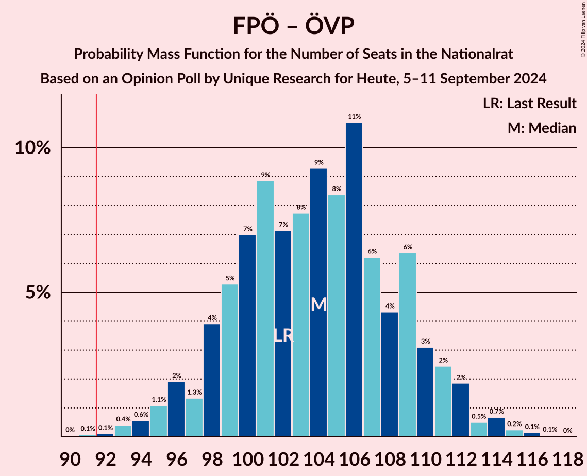

| Number of Seats | Probability | Accumulated | Special Marks |
|:---------------:|:-----------:|:-----------:|:-------------:|
| 90 | 0% | 100% |  |
| 91 | 0.1% | 99.9% |  |
| 92 | 0.1% | 99.8% | Majority |
| 93 | 0.4% | 99.7% |  |
| 94 | 0.6% | 99.3% |  |
| 95 | 1.1% | 98.8% |  |
| 96 | 2% | 98% |  |
| 97 | 1.3% | 96% |  |
| 98 | 4% | 94% |  |
| 99 | 5% | 91% |  |
| 100 | 7% | 85% |  |
| 101 | 9% | 78% |  |
| 102 | 7% | 69% | Last Result |
| 103 | 8% | 62% |  |
| 104 | 9% | 54% | Median |
| 105 | 8% | 45% |  |
| 106 | 11% | 37% |  |
| 107 | 6% | 26% |  |
| 108 | 4% | 20% |  |
| 109 | 6% | 15% |  |
| 110 | 3% | 9% |  |
| 111 | 2% | 6% |  |
| 112 | 2% | 4% |  |
| 113 | 0.5% | 2% |  |
| 114 | 0.7% | 1.1% |  |
| 115 | 0.2% | 0.5% |  |
| 116 | 0.1% | 0.2% |  |
| 117 | 0.1% | 0.1% |  |
| 118 | 0% | 0% |  |

### Freiheitliche Partei Österreichs – Sozialdemokratische Partei Österreichs

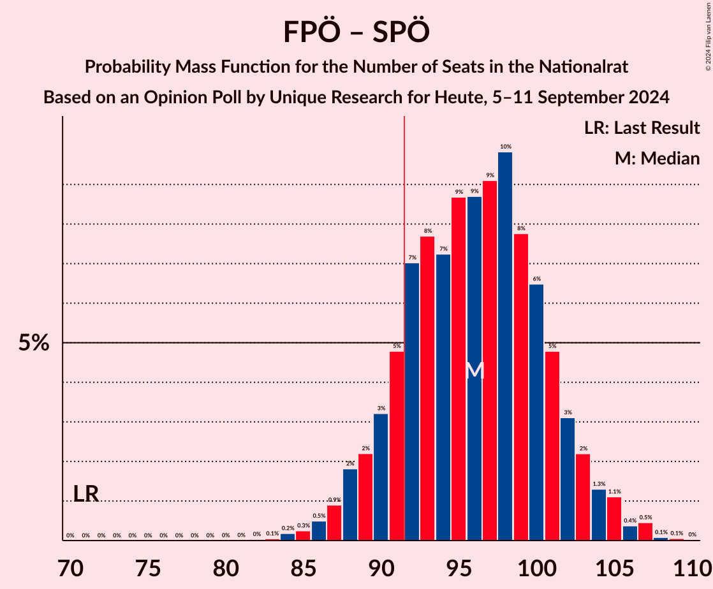

| Number of Seats | Probability | Accumulated | Special Marks |
|:---------------:|:-----------:|:-----------:|:-------------:|
| 71 | 0% | 100% | Last Result |
| 72 | 0% | 100% |  |
| 73 | 0% | 100% |  |
| 74 | 0% | 100% |  |
| 75 | 0% | 100% |  |
| 76 | 0% | 100% |  |
| 77 | 0% | 100% |  |
| 78 | 0% | 100% |  |
| 79 | 0% | 100% |  |
| 80 | 0% | 100% |  |
| 81 | 0% | 100% |  |
| 82 | 0% | 100% |  |
| 83 | 0.1% | 99.9% |  |
| 84 | 0.2% | 99.9% |  |
| 85 | 0.3% | 99.7% |  |
| 86 | 0.5% | 99.5% |  |
| 87 | 0.9% | 99.0% |  |
| 88 | 2% | 98% |  |
| 89 | 2% | 96% |  |
| 90 | 3% | 94% |  |
| 91 | 5% | 91% |  |
| 92 | 7% | 86% | Majority |
| 93 | 8% | 79% |  |
| 94 | 7% | 71% |  |
| 95 | 9% | 64% |  |
| 96 | 9% | 55% | Median |
| 97 | 9% | 47% |  |
| 98 | 10% | 38% |  |
| 99 | 8% | 28% |  |
| 100 | 6% | 20% |  |
| 101 | 5% | 14% |  |
| 102 | 3% | 9% |  |
| 103 | 2% | 6% |  |
| 104 | 1.3% | 3% |  |
| 105 | 1.1% | 2% |  |
| 106 | 0.4% | 1.0% |  |
| 107 | 0.5% | 0.6% |  |
| 108 | 0.1% | 0.2% |  |
| 109 | 0.1% | 0.1% |  |
| 110 | 0% | 0% |  |

### Österreichische Volkspartei – Sozialdemokratische Partei Österreichs

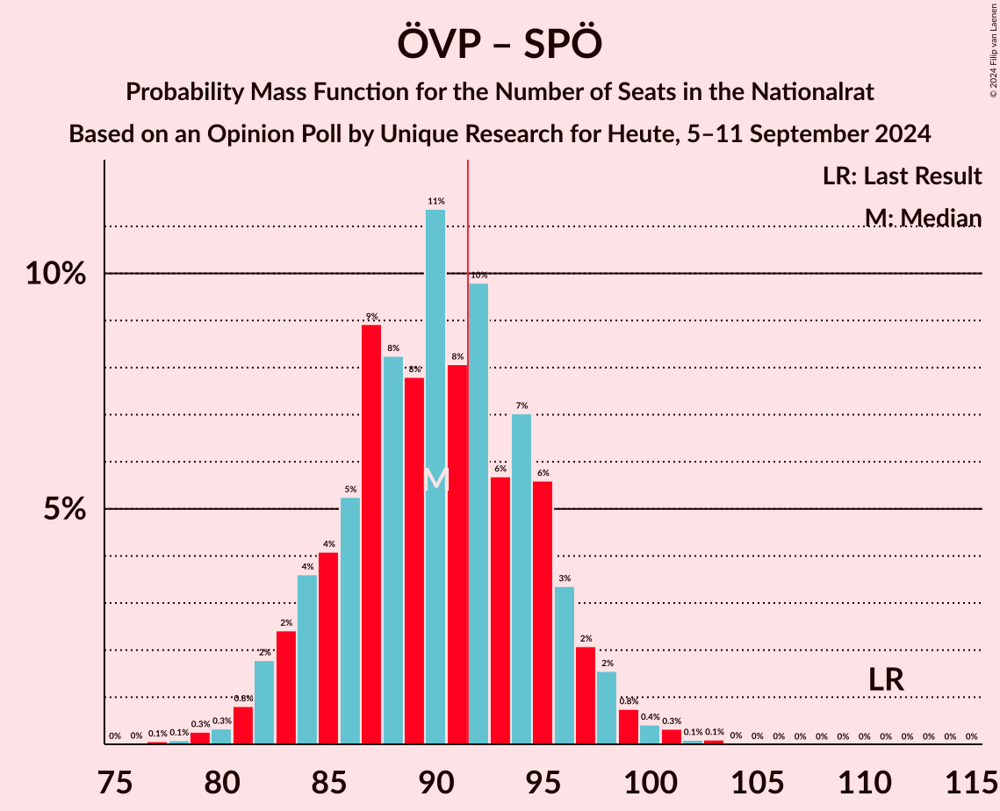

| Number of Seats | Probability | Accumulated | Special Marks |
|:---------------:|:-----------:|:-----------:|:-------------:|
| 77 | 0.1% | 100% |  |
| 78 | 0.1% | 99.9% |  |
| 79 | 0.3% | 99.8% |  |
| 80 | 0.3% | 99.6% |  |
| 81 | 0.8% | 99.2% |  |
| 82 | 2% | 98% |  |
| 83 | 2% | 97% |  |
| 84 | 4% | 94% |  |
| 85 | 4% | 91% |  |
| 86 | 5% | 87% |  |
| 87 | 9% | 81% |  |
| 88 | 8% | 72% |  |
| 89 | 8% | 64% |  |
| 90 | 11% | 56% | Median |
| 91 | 8% | 45% |  |
| 92 | 10% | 37% | Majority |
| 93 | 6% | 27% |  |
| 94 | 7% | 21% |  |
| 95 | 6% | 14% |  |
| 96 | 3% | 9% |  |
| 97 | 2% | 5% |  |
| 98 | 2% | 3% |  |
| 99 | 0.8% | 2% |  |
| 100 | 0.4% | 1.0% |  |
| 101 | 0.3% | 0.6% |  |
| 102 | 0.1% | 0.2% |  |
| 103 | 0.1% | 0.1% |  |
| 104 | 0% | 0% |  |
| 105 | 0% | 0% |  |
| 106 | 0% | 0% |  |
| 107 | 0% | 0% |  |
| 108 | 0% | 0% |  |
| 109 | 0% | 0% |  |
| 110 | 0% | 0% |  |
| 111 | 0% | 0% | Last Result |

### Österreichische Volkspartei – Die Grünen–Die Grüne Alternative – NEOS–Das Neue Österreich und Liberales Forum

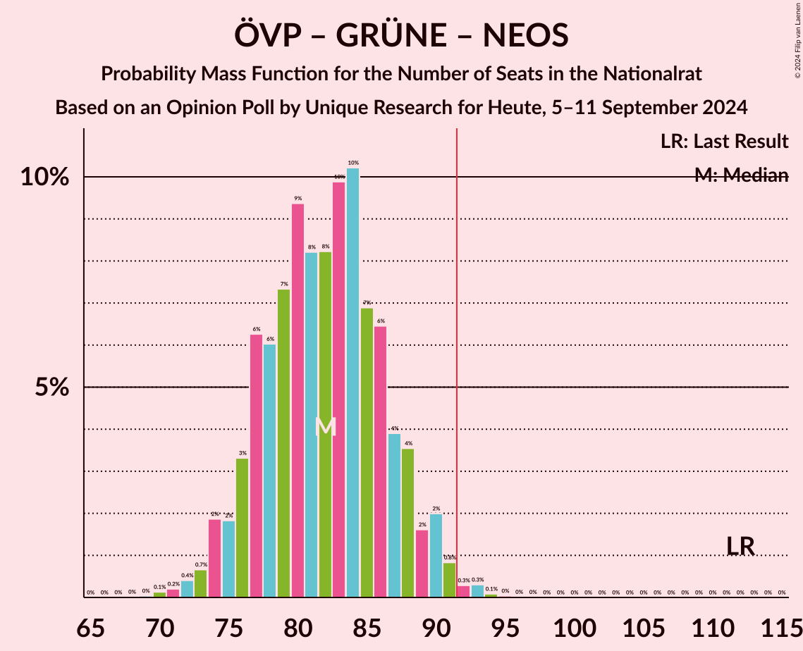

| Number of Seats | Probability | Accumulated | Special Marks |
|:---------------:|:-----------:|:-----------:|:-------------:|
| 69 | 0% | 100% |  |
| 70 | 0.1% | 99.9% |  |
| 71 | 0.2% | 99.8% |  |
| 72 | 0.4% | 99.6% |  |
| 73 | 0.7% | 99.2% |  |
| 74 | 2% | 98.5% |  |
| 75 | 2% | 97% |  |
| 76 | 3% | 95% |  |
| 77 | 6% | 92% |  |
| 78 | 6% | 85% |  |
| 79 | 7% | 79% |  |
| 80 | 9% | 72% |  |
| 81 | 8% | 63% | Median |
| 82 | 8% | 54% |  |
| 83 | 10% | 46% |  |
| 84 | 10% | 36% |  |
| 85 | 7% | 26% |  |
| 86 | 6% | 19% |  |
| 87 | 4% | 13% |  |
| 88 | 4% | 9% |  |
| 89 | 2% | 5% |  |
| 90 | 2% | 4% |  |
| 91 | 0.8% | 2% |  |
| 92 | 0.3% | 0.7% | Majority |
| 93 | 0.3% | 0.5% |  |
| 94 | 0.1% | 0.2% |  |
| 95 | 0% | 0.1% |  |
| 96 | 0% | 0% |  |
| 97 | 0% | 0% |  |
| 98 | 0% | 0% |  |
| 99 | 0% | 0% |  |
| 100 | 0% | 0% |  |
| 101 | 0% | 0% |  |
| 102 | 0% | 0% |  |
| 103 | 0% | 0% |  |
| 104 | 0% | 0% |  |
| 105 | 0% | 0% |  |
| 106 | 0% | 0% |  |
| 107 | 0% | 0% |  |
| 108 | 0% | 0% |  |
| 109 | 0% | 0% |  |
| 110 | 0% | 0% |  |
| 111 | 0% | 0% |  |
| 112 | 0% | 0% | Last Result |

### Sozialdemokratische Partei Österreichs – Die Grünen–Die Grüne Alternative – NEOS–Das Neue Österreich und Liberales Forum

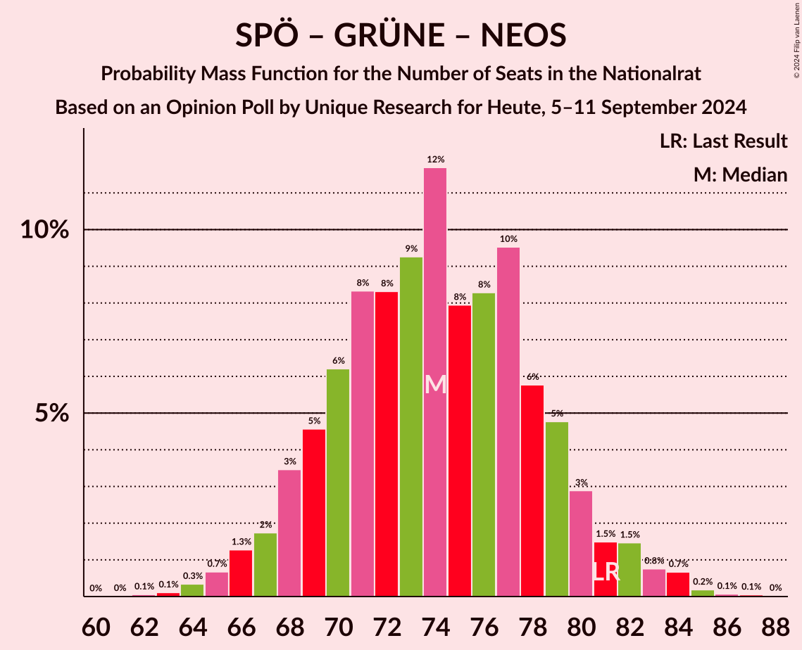

| Number of Seats | Probability | Accumulated | Special Marks |
|:---------------:|:-----------:|:-----------:|:-------------:|
| 62 | 0.1% | 100% |  |
| 63 | 0.1% | 99.9% |  |
| 64 | 0.3% | 99.8% |  |
| 65 | 0.7% | 99.5% |  |
| 66 | 1.3% | 98.8% |  |
| 67 | 2% | 98% |  |
| 68 | 3% | 96% |  |
| 69 | 5% | 92% |  |
| 70 | 6% | 88% |  |
| 71 | 8% | 82% |  |
| 72 | 8% | 73% |  |
| 73 | 9% | 65% | Median |
| 74 | 12% | 56% |  |
| 75 | 8% | 44% |  |
| 76 | 8% | 36% |  |
| 77 | 10% | 28% |  |
| 78 | 6% | 18% |  |
| 79 | 5% | 12% |  |
| 80 | 3% | 8% |  |
| 81 | 1.5% | 5% | Last Result |
| 82 | 1.5% | 3% |  |
| 83 | 0.8% | 2% |  |
| 84 | 0.7% | 1.0% |  |
| 85 | 0.2% | 0.3% |  |
| 86 | 0.1% | 0.1% |  |
| 87 | 0.1% | 0.1% |  |
| 88 | 0% | 0% |  |

### Österreichische Volkspartei – Die Grünen–Die Grüne Alternative

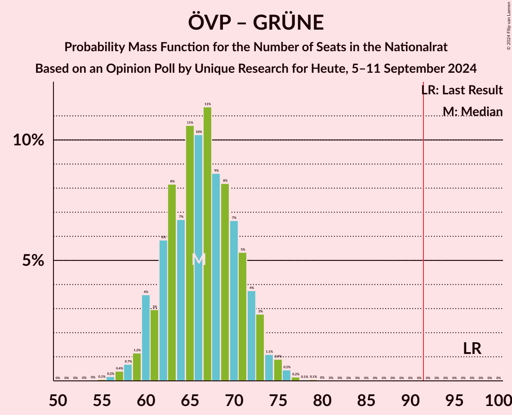

| Number of Seats | Probability | Accumulated | Special Marks |
|:---------------:|:-----------:|:-----------:|:-------------:|
| 55 | 0.1% | 100% |  |
| 56 | 0.2% | 99.9% |  |
| 57 | 0.4% | 99.7% |  |
| 58 | 0.7% | 99.3% |  |
| 59 | 1.2% | 98.6% |  |
| 60 | 4% | 97% |  |
| 61 | 3% | 94% |  |
| 62 | 6% | 91% |  |
| 63 | 8% | 85% |  |
| 64 | 7% | 77% |  |
| 65 | 11% | 70% |  |
| 66 | 10% | 60% | Median |
| 67 | 11% | 49% |  |
| 68 | 9% | 38% |  |
| 69 | 8% | 29% |  |
| 70 | 7% | 21% |  |
| 71 | 5% | 15% |  |
| 72 | 4% | 9% |  |
| 73 | 3% | 6% |  |
| 74 | 1.1% | 3% |  |
| 75 | 0.9% | 2% |  |
| 76 | 0.5% | 0.7% |  |
| 77 | 0.2% | 0.3% |  |
| 78 | 0.1% | 0.1% |  |
| 79 | 0.1% | 0.1% |  |
| 80 | 0% | 0% |  |
| 81 | 0% | 0% |  |
| 82 | 0% | 0% |  |
| 83 | 0% | 0% |  |
| 84 | 0% | 0% |  |
| 85 | 0% | 0% |  |
| 86 | 0% | 0% |  |
| 87 | 0% | 0% |  |
| 88 | 0% | 0% |  |
| 89 | 0% | 0% |  |
| 90 | 0% | 0% |  |
| 91 | 0% | 0% |  |
| 92 | 0% | 0% | Majority |
| 93 | 0% | 0% |  |
| 94 | 0% | 0% |  |
| 95 | 0% | 0% |  |
| 96 | 0% | 0% |  |
| 97 | 0% | 0% | Last Result |

### Österreichische Volkspartei – NEOS–Das Neue Österreich und Liberales Forum

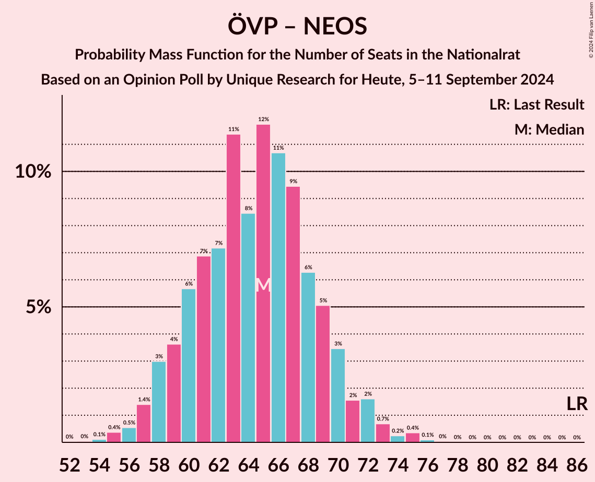

| Number of Seats | Probability | Accumulated | Special Marks |
|:---------------:|:-----------:|:-----------:|:-------------:|
| 53 | 0% | 100% |  |
| 54 | 0.1% | 99.9% |  |
| 55 | 0.4% | 99.8% |  |
| 56 | 0.5% | 99.4% |  |
| 57 | 1.4% | 98.9% |  |
| 58 | 3% | 97% |  |
| 59 | 4% | 94% |  |
| 60 | 6% | 91% |  |
| 61 | 7% | 85% |  |
| 62 | 7% | 78% |  |
| 63 | 11% | 71% |  |
| 64 | 8% | 60% | Median |
| 65 | 12% | 51% |  |
| 66 | 11% | 40% |  |
| 67 | 9% | 29% |  |
| 68 | 6% | 19% |  |
| 69 | 5% | 13% |  |
| 70 | 3% | 8% |  |
| 71 | 2% | 5% |  |
| 72 | 2% | 3% |  |
| 73 | 0.7% | 1.4% |  |
| 74 | 0.2% | 0.8% |  |
| 75 | 0.4% | 0.5% |  |
| 76 | 0.1% | 0.2% |  |
| 77 | 0% | 0.1% |  |
| 78 | 0% | 0% |  |
| 79 | 0% | 0% |  |
| 80 | 0% | 0% |  |
| 81 | 0% | 0% |  |
| 82 | 0% | 0% |  |
| 83 | 0% | 0% |  |
| 84 | 0% | 0% |  |
| 85 | 0% | 0% |  |
| 86 | 0% | 0% | Last Result |

### Sozialdemokratische Partei Österreichs – Die Grünen–Die Grüne Alternative

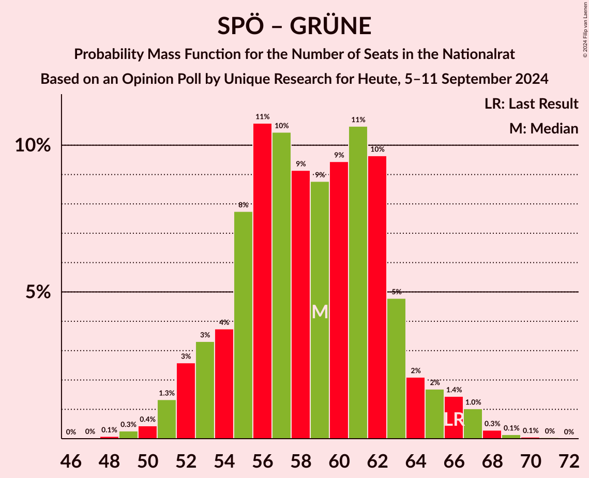

| Number of Seats | Probability | Accumulated | Special Marks |
|:---------------:|:-----------:|:-----------:|:-------------:|
| 48 | 0.1% | 100% |  |
| 49 | 0.3% | 99.9% |  |
| 50 | 0.4% | 99.6% |  |
| 51 | 1.3% | 99.2% |  |
| 52 | 3% | 98% |  |
| 53 | 3% | 95% |  |
| 54 | 4% | 92% |  |
| 55 | 8% | 88% |  |
| 56 | 11% | 80% |  |
| 57 | 10% | 70% |  |
| 58 | 9% | 59% | Median |
| 59 | 9% | 50% |  |
| 60 | 9% | 41% |  |
| 61 | 11% | 32% |  |
| 62 | 10% | 21% |  |
| 63 | 5% | 12% |  |
| 64 | 2% | 7% |  |
| 65 | 2% | 5% |  |
| 66 | 1.4% | 3% | Last Result |
| 67 | 1.0% | 2% |  |
| 68 | 0.3% | 0.6% |  |
| 69 | 0.1% | 0.3% |  |
| 70 | 0.1% | 0.1% |  |
| 71 | 0% | 0.1% |  |
| 72 | 0% | 0% |  |

### Österreichische Volkspartei

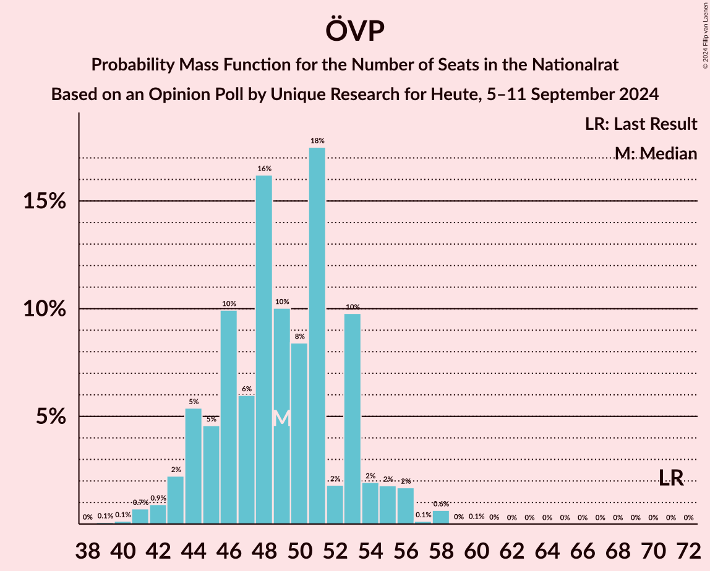

| Number of Seats | Probability | Accumulated | Special Marks |
|:---------------:|:-----------:|:-----------:|:-------------:|
| 39 | 0.1% | 100% |  |
| 40 | 0.1% | 99.9% |  |
| 41 | 0.7% | 99.8% |  |
| 42 | 0.9% | 99.0% |  |
| 43 | 2% | 98% |  |
| 44 | 5% | 96% |  |
| 45 | 5% | 91% |  |
| 46 | 10% | 86% |  |
| 47 | 6% | 76% |  |
| 48 | 16% | 70% |  |
| 49 | 10% | 54% | Median |
| 50 | 8% | 44% |  |
| 51 | 18% | 35% |  |
| 52 | 2% | 18% |  |
| 53 | 10% | 16% |  |
| 54 | 2% | 6% |  |
| 55 | 2% | 4% |  |
| 56 | 2% | 3% |  |
| 57 | 0.1% | 0.9% |  |
| 58 | 0.6% | 0.8% |  |
| 59 | 0% | 0.1% |  |
| 60 | 0.1% | 0.1% |  |
| 61 | 0% | 0% |  |
| 62 | 0% | 0% |  |
| 63 | 0% | 0% |  |
| 64 | 0% | 0% |  |
| 65 | 0% | 0% |  |
| 66 | 0% | 0% |  |
| 67 | 0% | 0% |  |
| 68 | 0% | 0% |  |
| 69 | 0% | 0% |  |
| 70 | 0% | 0% |  |
| 71 | 0% | 0% | Last Result |

### Sozialdemokratische Partei Österreichs

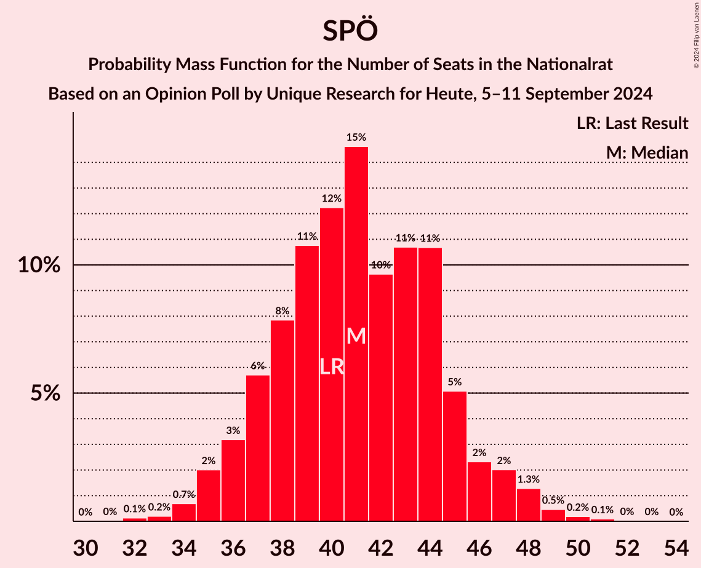

| Number of Seats | Probability | Accumulated | Special Marks |
|:---------------:|:-----------:|:-----------:|:-------------:|
| 32 | 0.1% | 100% |  |
| 33 | 0.2% | 99.8% |  |
| 34 | 0.7% | 99.6% |  |
| 35 | 2% | 98.9% |  |
| 36 | 3% | 97% |  |
| 37 | 6% | 94% |  |
| 38 | 8% | 88% |  |
| 39 | 11% | 80% |  |
| 40 | 12% | 69% | Last Result |
| 41 | 15% | 57% | Median |
| 42 | 10% | 43% |  |
| 43 | 11% | 33% |  |
| 44 | 11% | 22% |  |
| 45 | 5% | 12% |  |
| 46 | 2% | 6% |  |
| 47 | 2% | 4% |  |
| 48 | 1.3% | 2% |  |
| 49 | 0.5% | 0.8% |  |
| 50 | 0.2% | 0.3% |  |
| 51 | 0.1% | 0.1% |  |
| 52 | 0% | 0.1% |  |
| 53 | 0% | 0% |  |

## Technical Information

### Opinion Poll

+ **Polling firm:** Unique Research
+ **Commissioner(s):** Heute
+ **Fieldwork period:** 5–11 September 2024

### Calculations

+ **Sample size:** 800
+ **Simulations done:** 2,097,152
+ **Error estimate:** 1.13%

