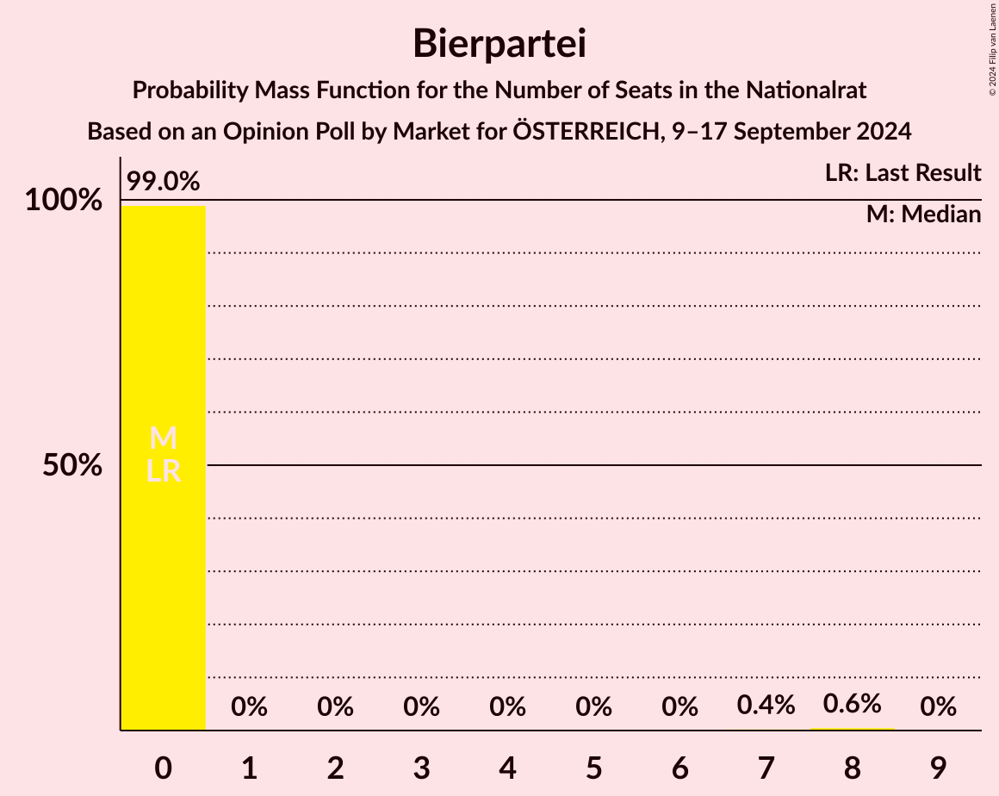
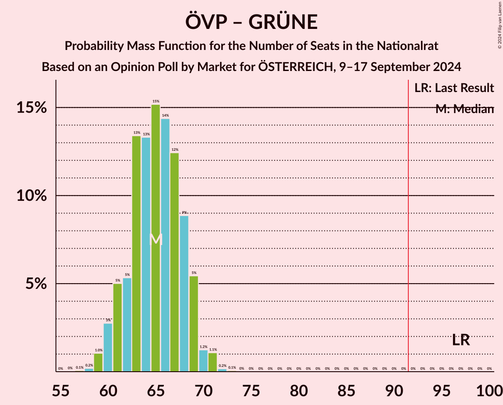

# Opinion Poll by Market for ÖSTERREICH, 9–17 September 2024

<a href="#voting-intentions">Voting Intentions</a> | <a href="#seats">Seats</a> | <a href="#coalitions">Coalitions</a> | <a href="#technical-information">Technical Information</a>

## Voting Intentions

### Confidence Intervals

| Party | Last Result | Poll Result | 80% Confidence Interval | 90% Confidence Interval | 95% Confidence Interval | 99% Confidence Interval |
|:-----:|:-----------:|:-----------:|:-----------------------:|:-----------------------:|:-----------------------:|:-----------------------:|
| Freiheitliche Partei Österreichs | 16.2% | 27.0% | 25.7–28.3% |25.3–28.6% |25.0–28.9% |24.5–29.6% |
| Österreichische Volkspartei | 37.5% | 25.0% | 23.7–26.2% |23.4–26.6% |23.1–26.9% |22.5–27.5% |
| Sozialdemokratische Partei Österreichs | 21.2% | 20.0% | 18.8–21.1% |18.5–21.5% |18.2–21.8% |17.7–22.3% |
| NEOS–Das Neue Österreich und Liberales Forum | 8.1% | 11.0% | 10.1–11.9% |9.9–12.2% |9.6–12.4% |9.3–12.9% |
| Die Grünen–Die Grüne Alternative | 13.9% | 8.0% | 7.3–8.8% |7.1–9.1% |6.9–9.3% |6.6–9.7% |
| Kommunistische Partei Österreichs | 0.7% | 4.0% | 3.5–4.6% |3.3–4.8% |3.2–5.0% |3.0–5.3% |
| Bierpartei | 0.0% | 3.0% | 2.6–3.6% |2.4–3.7% |2.3–3.9% |2.1–4.1% |
| Wandel | 0.0% | 1.0% | 0.8–1.4% |0.7–1.5% |0.6–1.5% |0.5–1.7% |
| Liste Madeleine Petrovic | 0.0% | 0.2% | 0.2–0.5% |0.1–0.5% |0.1–0.6% |0.1–0.7% |

*Note:* The poll result column reflects the actual value used in the calculations. Published results may vary slightly, and in addition be rounded to fewer digits.

## Seats

### Confidence Intervals

| Party | Last Result | Median | 80% Confidence Interval | 90% Confidence Interval | 95% Confidence Interval | 99% Confidence Interval |
|:-----:|:-----------:|:------:|:-----------------------:|:-----------------------:|:-----------------------:|:-----------------------:|
| <a href="#freiheitliche-partei-österreichs">Freiheitliche Partei Österreichs</a> | 31 | 53 | 50–57 |50–57 |49–58 |48–59 |
| <a href="#österreichische-volkspartei">Österreichische Volkspartei</a> | 71 | 49 | 47–52 |45–53 |45–54 |44–55 |
| <a href="#sozialdemokratische-partei-österreichs">Sozialdemokratische Partei Österreichs</a> | 40 | 39 | 37–42 |36–43 |36–43 |34–44 |
| <a href="#neos–das-neue-österreich-und-liberales-forum">NEOS–Das Neue Österreich und Liberales Forum</a> | 15 | 21 | 20–23 |19–24 |18–24 |18–25 |
| <a href="#die-grünen–die-grüne-alternative">Die Grünen–Die Grüne Alternative</a> | 26 | 16 | 14–17 |14–18 |13–18 |12–19 |
| <a href="#kommunistische-partei-österreichs">Kommunistische Partei Österreichs</a> | 0 | 0 | 0–9 |0–9 |0–9 |0–10 |
| <a href="#bierpartei">Bierpartei</a> | 0 | 0 | 0 |0 |0 |0–8 |
| <a href="#wandel">Wandel</a> | 0 | 0 | 0 |0 |0 |0 |
| <a href="#liste-madeleine-petrovic">Liste Madeleine Petrovic</a> | 0 | 0 | 0 |0 |0 |0 |

### Freiheitliche Partei Österreichs

*For a full overview of the results for this party, see the [Freiheitliche Partei Österreichs](party-freiheitlicheparteiösterreichs.html) page.*

| Number of Seats | Probability | Accumulated | Special Marks |
|:---------------:|:-----------:|:-----------:|:-------------:|
| 31 | 0% | 100% | Last Result |
| 32 | 0% | 100% |  |
| 33 | 0% | 100% |  |
| 34 | 0% | 100% |  |
| 35 | 0% | 100% |  |
| 36 | 0% | 100% |  |
| 37 | 0% | 100% |  |
| 38 | 0% | 100% |  |
| 39 | 0% | 100% |  |
| 40 | 0% | 100% |  |
| 41 | 0% | 100% |  |
| 42 | 0% | 100% |  |
| 43 | 0% | 100% |  |
| 44 | 0% | 100% |  |
| 45 | 0% | 100% |  |
| 46 | 0.1% | 100% |  |
| 47 | 0.4% | 99.9% |  |
| 48 | 1.2% | 99.5% |  |
| 49 | 3% | 98% |  |
| 50 | 11% | 96% |  |
| 51 | 11% | 85% |  |
| 52 | 11% | 74% |  |
| 53 | 14% | 63% | Median |
| 54 | 16% | 48% |  |
| 55 | 9% | 33% |  |
| 56 | 14% | 24% |  |
| 57 | 7% | 11% |  |
| 58 | 3% | 4% |  |
| 59 | 0.7% | 0.9% |  |
| 60 | 0.1% | 0.2% |  |
| 61 | 0.1% | 0.1% |  |
| 62 | 0% | 0% |  |

### Österreichische Volkspartei

*For a full overview of the results for this party, see the [Österreichische Volkspartei](party-österreichischevolkspartei.html) page.*

| Number of Seats | Probability | Accumulated | Special Marks |
|:---------------:|:-----------:|:-----------:|:-------------:|
| 43 | 0.3% | 100% |  |
| 44 | 0.8% | 99.7% |  |
| 45 | 4% | 98.9% |  |
| 46 | 5% | 95% |  |
| 47 | 9% | 90% |  |
| 48 | 16% | 81% |  |
| 49 | 16% | 65% | Median |
| 50 | 14% | 50% |  |
| 51 | 18% | 36% |  |
| 52 | 12% | 18% |  |
| 53 | 4% | 6% |  |
| 54 | 2% | 3% |  |
| 55 | 0.7% | 1.0% |  |
| 56 | 0.2% | 0.3% |  |
| 57 | 0.1% | 0.1% |  |
| 58 | 0% | 0% |  |
| 59 | 0% | 0% |  |
| 60 | 0% | 0% |  |
| 61 | 0% | 0% |  |
| 62 | 0% | 0% |  |
| 63 | 0% | 0% |  |
| 64 | 0% | 0% |  |
| 65 | 0% | 0% |  |
| 66 | 0% | 0% |  |
| 67 | 0% | 0% |  |
| 68 | 0% | 0% |  |
| 69 | 0% | 0% |  |
| 70 | 0% | 0% |  |
| 71 | 0% | 0% | Last Result |

### Sozialdemokratische Partei Österreichs

*For a full overview of the results for this party, see the [Sozialdemokratische Partei Österreichs](party-sozialdemokratischeparteiösterreichs.html) page.*

| Number of Seats | Probability | Accumulated | Special Marks |
|:---------------:|:-----------:|:-----------:|:-------------:|
| 33 | 0.1% | 100% |  |
| 34 | 0.5% | 99.9% |  |
| 35 | 2% | 99.4% |  |
| 36 | 5% | 98% |  |
| 37 | 11% | 93% |  |
| 38 | 15% | 83% |  |
| 39 | 18% | 68% | Median |
| 40 | 19% | 50% | Last Result |
| 41 | 15% | 30% |  |
| 42 | 9% | 15% |  |
| 43 | 4% | 6% |  |
| 44 | 1.0% | 1.4% |  |
| 45 | 0.2% | 0.4% |  |
| 46 | 0.1% | 0.1% |  |
| 47 | 0% | 0% |  |

### NEOS–Das Neue Österreich und Liberales Forum

*For a full overview of the results for this party, see the [NEOS–Das Neue Österreich und Liberales Forum](party-neos–dasneueösterreichundliberalesforum.html) page.*

| Number of Seats | Probability | Accumulated | Special Marks |
|:---------------:|:-----------:|:-----------:|:-------------:|
| 15 | 0% | 100% | Last Result |
| 16 | 0% | 100% |  |
| 17 | 0.2% | 100% |  |
| 18 | 2% | 99.8% |  |
| 19 | 5% | 97% |  |
| 20 | 21% | 92% |  |
| 21 | 24% | 70% | Median |
| 22 | 27% | 47% |  |
| 23 | 12% | 20% |  |
| 24 | 6% | 8% |  |
| 25 | 2% | 2% |  |
| 26 | 0.3% | 0.3% |  |
| 27 | 0% | 0.1% |  |
| 28 | 0% | 0% |  |

### Die Grünen–Die Grüne Alternative

*For a full overview of the results for this party, see the [Die Grünen–Die Grüne Alternative](party-diegrünen–diegrünealternative.html) page.*

| Number of Seats | Probability | Accumulated | Special Marks |
|:---------------:|:-----------:|:-----------:|:-------------:|
| 12 | 0.5% | 100% |  |
| 13 | 4% | 99.5% |  |
| 14 | 14% | 96% |  |
| 15 | 29% | 82% |  |
| 16 | 31% | 53% | Median |
| 17 | 16% | 22% |  |
| 18 | 5% | 6% |  |
| 19 | 1.4% | 1.5% |  |
| 20 | 0.1% | 0.1% |  |
| 21 | 0% | 0% |  |
| 22 | 0% | 0% |  |
| 23 | 0% | 0% |  |
| 24 | 0% | 0% |  |
| 25 | 0% | 0% |  |
| 26 | 0% | 0% | Last Result |

### Kommunistische Partei Österreichs

*For a full overview of the results for this party, see the [Kommunistische Partei Österreichs](party-kommunistischeparteiösterreichs.html) page.*

| Number of Seats | Probability | Accumulated | Special Marks |
|:---------------:|:-----------:|:-----------:|:-------------:|
| 0 | 54% | 100% | Last Result, Median |
| 1 | 0% | 46% |  |
| 2 | 0% | 46% |  |
| 3 | 0% | 46% |  |
| 4 | 0% | 46% |  |
| 5 | 0% | 46% |  |
| 6 | 0% | 46% |  |
| 7 | 6% | 46% |  |
| 8 | 30% | 40% |  |
| 9 | 9% | 10% |  |
| 10 | 1.2% | 1.2% |  |
| 11 | 0.1% | 0.1% |  |
| 12 | 0% | 0% |  |

### Bierpartei

*For a full overview of the results for this party, see the [Bierpartei](party-bierpartei.html) page.*

| Number of Seats | Probability | Accumulated | Special Marks |
|:---------------:|:-----------:|:-----------:|:-------------:|
| 0 | 99.0% | 100% | Last Result, Median |
| 1 | 0% | 1.0% |  |
| 2 | 0% | 1.0% |  |
| 3 | 0% | 1.0% |  |
| 4 | 0% | 1.0% |  |
| 5 | 0% | 1.0% |  |
| 6 | 0% | 1.0% |  |
| 7 | 0.4% | 1.0% |  |
| 8 | 0.6% | 0.6% |  |
| 9 | 0% | 0% |  |

### Wandel

*For a full overview of the results for this party, see the [Wandel](party-wandel.html) page.*

| Number of Seats | Probability | Accumulated | Special Marks |
|:---------------:|:-----------:|:-----------:|:-------------:|
| 0 | 100% | 100% | Last Result, Median |

### Liste Madeleine Petrovic

*For a full overview of the results for this party, see the [Liste Madeleine Petrovic](party-listemadeleinepetrovic.html) page.*

| Number of Seats | Probability | Accumulated | Special Marks |
|:---------------:|:-----------:|:-----------:|:-------------:|
| 0 | 100% | 100% | Last Result, Median |

## Coalitions

### Confidence Intervals

| Coalition | Last Result | Median | Majority? | 80% Confidence Interval | 90% Confidence Interval | 95% Confidence Interval | 99% Confidence Interval |
|:---------:|:-----------:|:------:|:---------:|:-----------------------:|:-----------------------:|:-----------------------:|:-----------------------:|
| Freiheitliche Partei Österreichs – Österreichische Volkspartei | 102 | 103 | 100% | 98–107 | 97–108 | 97–108 | 95–110 |
| Freiheitliche Partei Österreichs – Sozialdemokratische Partei Österreichs | 71 | 93 | 64% | 88–97 | 88–97 | 87–98 | 86–100 |
| Österreichische Volkspartei – Sozialdemokratische Partei Österreichs | 111 | 89 | 25% | 85–93 | 84–94 | 83–94 | 81–96 |
| Österreichische Volkspartei – NEOS–Das Neue Österreich und Liberales Forum – Die Grünen–Die Grüne Alternative | 112 | 86 | 2% | 83–90 | 82–91 | 81–91 | 79–93 |
| Sozialdemokratische Partei Österreichs – NEOS–Das Neue Österreich und Liberales Forum – Die Grünen–Die Grüne Alternative | 81 | 76 | 0% | 73–80 | 72–81 | 71–81 | 69–83 |
| Österreichische Volkspartei – NEOS–Das Neue Österreich und Liberales Forum | 86 | 71 | 0% | 67–74 | 67–75 | 66–76 | 64–77 |
| Österreichische Volkspartei – Die Grünen–Die Grüne Alternative | 97 | 65 | 0% | 62–68 | 61–69 | 60–70 | 59–71 |
| Sozialdemokratische Partei Österreichs – Die Grünen–Die Grüne Alternative | 66 | 55 | 0% | 52–57 | 51–59 | 50–60 | 49–61 |
| Österreichische Volkspartei | 71 | 49 | 0% | 47–52 | 45–53 | 45–54 | 44–55 |
| Sozialdemokratische Partei Österreichs | 40 | 39 | 0% | 37–42 | 36–43 | 36–43 | 34–44 |

### Freiheitliche Partei Österreichs – Österreichische Volkspartei

| Number of Seats | Probability | Accumulated | Special Marks |
|:---------------:|:-----------:|:-----------:|:-------------:|
| 94 | 0.1% | 100% |  |
| 95 | 0.5% | 99.8% |  |
| 96 | 2% | 99.3% |  |
| 97 | 4% | 98% |  |
| 98 | 4% | 93% |  |
| 99 | 10% | 89% |  |
| 100 | 7% | 79% |  |
| 101 | 6% | 72% |  |
| 102 | 11% | 65% | Last Result, Median |
| 103 | 8% | 54% |  |
| 104 | 7% | 46% |  |
| 105 | 15% | 39% |  |
| 106 | 9% | 23% |  |
| 107 | 9% | 15% |  |
| 108 | 4% | 6% |  |
| 109 | 2% | 2% |  |
| 110 | 0.2% | 0.5% |  |
| 111 | 0.3% | 0.3% |  |
| 112 | 0% | 0% |  |

### Freiheitliche Partei Österreichs – Sozialdemokratische Partei Österreichs

| Number of Seats | Probability | Accumulated | Special Marks |
|:---------------:|:-----------:|:-----------:|:-------------:|
| 71 | 0% | 100% | Last Result |
| 72 | 0% | 100% |  |
| 73 | 0% | 100% |  |
| 74 | 0% | 100% |  |
| 75 | 0% | 100% |  |
| 76 | 0% | 100% |  |
| 77 | 0% | 100% |  |
| 78 | 0% | 100% |  |
| 79 | 0% | 100% |  |
| 80 | 0% | 100% |  |
| 81 | 0% | 100% |  |
| 82 | 0% | 100% |  |
| 83 | 0% | 100% |  |
| 84 | 0.1% | 100% |  |
| 85 | 0.2% | 99.9% |  |
| 86 | 0.7% | 99.6% |  |
| 87 | 2% | 99.0% |  |
| 88 | 8% | 97% |  |
| 89 | 6% | 89% |  |
| 90 | 7% | 82% |  |
| 91 | 11% | 75% |  |
| 92 | 11% | 64% | Median, Majority |
| 93 | 12% | 53% |  |
| 94 | 9% | 42% |  |
| 95 | 11% | 33% |  |
| 96 | 5% | 22% |  |
| 97 | 12% | 16% |  |
| 98 | 3% | 4% |  |
| 99 | 0.5% | 1.2% |  |
| 100 | 0.5% | 0.7% |  |
| 101 | 0.1% | 0.2% |  |
| 102 | 0.1% | 0.1% |  |
| 103 | 0% | 0% |  |

### Österreichische Volkspartei – Sozialdemokratische Partei Österreichs

| Number of Seats | Probability | Accumulated | Special Marks |
|:---------------:|:-----------:|:-----------:|:-------------:|
| 80 | 0.1% | 100% |  |
| 81 | 0.5% | 99.8% |  |
| 82 | 0.8% | 99.4% |  |
| 83 | 3% | 98.5% |  |
| 84 | 3% | 95% |  |
| 85 | 7% | 92% |  |
| 86 | 7% | 85% |  |
| 87 | 13% | 79% |  |
| 88 | 13% | 65% | Median |
| 89 | 13% | 52% |  |
| 90 | 6% | 40% |  |
| 91 | 9% | 33% |  |
| 92 | 12% | 25% | Majority |
| 93 | 5% | 12% |  |
| 94 | 6% | 8% |  |
| 95 | 1.0% | 2% |  |
| 96 | 0.5% | 0.7% |  |
| 97 | 0.1% | 0.1% |  |
| 98 | 0% | 0% |  |
| 99 | 0% | 0% |  |
| 100 | 0% | 0% |  |
| 101 | 0% | 0% |  |
| 102 | 0% | 0% |  |
| 103 | 0% | 0% |  |
| 104 | 0% | 0% |  |
| 105 | 0% | 0% |  |
| 106 | 0% | 0% |  |
| 107 | 0% | 0% |  |
| 108 | 0% | 0% |  |
| 109 | 0% | 0% |  |
| 110 | 0% | 0% |  |
| 111 | 0% | 0% | Last Result |

### Österreichische Volkspartei – NEOS–Das Neue Österreich und Liberales Forum – Die Grünen–Die Grüne Alternative

| Number of Seats | Probability | Accumulated | Special Marks |
|:---------------:|:-----------:|:-----------:|:-------------:|
| 77 | 0.1% | 100% |  |
| 78 | 0.2% | 99.9% |  |
| 79 | 0.6% | 99.7% |  |
| 80 | 0.6% | 99.2% |  |
| 81 | 2% | 98.6% |  |
| 82 | 6% | 96% |  |
| 83 | 7% | 91% |  |
| 84 | 8% | 83% |  |
| 85 | 10% | 76% |  |
| 86 | 17% | 65% | Median |
| 87 | 13% | 48% |  |
| 88 | 13% | 35% |  |
| 89 | 7% | 22% |  |
| 90 | 6% | 15% |  |
| 91 | 6% | 8% |  |
| 92 | 1.2% | 2% | Majority |
| 93 | 0.9% | 1.2% |  |
| 94 | 0.2% | 0.3% |  |
| 95 | 0.1% | 0.1% |  |
| 96 | 0% | 0% |  |
| 97 | 0% | 0% |  |
| 98 | 0% | 0% |  |
| 99 | 0% | 0% |  |
| 100 | 0% | 0% |  |
| 101 | 0% | 0% |  |
| 102 | 0% | 0% |  |
| 103 | 0% | 0% |  |
| 104 | 0% | 0% |  |
| 105 | 0% | 0% |  |
| 106 | 0% | 0% |  |
| 107 | 0% | 0% |  |
| 108 | 0% | 0% |  |
| 109 | 0% | 0% |  |
| 110 | 0% | 0% |  |
| 111 | 0% | 0% |  |
| 112 | 0% | 0% | Last Result |

### Sozialdemokratische Partei Österreichs – NEOS–Das Neue Österreich und Liberales Forum – Die Grünen–Die Grüne Alternative

| Number of Seats | Probability | Accumulated | Special Marks |
|:---------------:|:-----------:|:-----------:|:-------------:|
| 68 | 0.1% | 100% |  |
| 69 | 0.4% | 99.9% |  |
| 70 | 1.3% | 99.4% |  |
| 71 | 3% | 98% |  |
| 72 | 4% | 96% |  |
| 73 | 8% | 92% |  |
| 74 | 8% | 84% |  |
| 75 | 9% | 76% |  |
| 76 | 18% | 67% | Median |
| 77 | 13% | 50% |  |
| 78 | 16% | 36% |  |
| 79 | 8% | 20% |  |
| 80 | 6% | 12% |  |
| 81 | 4% | 6% | Last Result |
| 82 | 0.7% | 2% |  |
| 83 | 1.1% | 1.3% |  |
| 84 | 0.1% | 0.2% |  |
| 85 | 0.1% | 0.1% |  |
| 86 | 0% | 0% |  |

### Österreichische Volkspartei – NEOS–Das Neue Österreich und Liberales Forum

| Number of Seats | Probability | Accumulated | Special Marks |
|:---------------:|:-----------:|:-----------:|:-------------:|
| 63 | 0.2% | 100% |  |
| 64 | 0.5% | 99.8% |  |
| 65 | 1.3% | 99.3% |  |
| 66 | 2% | 98% |  |
| 67 | 7% | 96% |  |
| 68 | 9% | 89% |  |
| 69 | 9% | 80% |  |
| 70 | 14% | 71% | Median |
| 71 | 17% | 57% |  |
| 72 | 14% | 40% |  |
| 73 | 13% | 26% |  |
| 74 | 6% | 13% |  |
| 75 | 3% | 7% |  |
| 76 | 2% | 4% |  |
| 77 | 1.0% | 1.3% |  |
| 78 | 0.2% | 0.3% |  |
| 79 | 0.1% | 0.1% |  |
| 80 | 0% | 0% |  |
| 81 | 0% | 0% |  |
| 82 | 0% | 0% |  |
| 83 | 0% | 0% |  |
| 84 | 0% | 0% |  |
| 85 | 0% | 0% |  |
| 86 | 0% | 0% | Last Result |

### Österreichische Volkspartei – Die Grünen–Die Grüne Alternative

| Number of Seats | Probability | Accumulated | Special Marks |
|:---------------:|:-----------:|:-----------:|:-------------:|
| 57 | 0.1% | 100% |  |
| 58 | 0.2% | 99.9% |  |
| 59 | 1.0% | 99.7% |  |
| 60 | 3% | 98.7% |  |
| 61 | 5% | 96% |  |
| 62 | 5% | 91% |  |
| 63 | 13% | 86% |  |
| 64 | 13% | 72% |  |
| 65 | 15% | 59% | Median |
| 66 | 14% | 44% |  |
| 67 | 12% | 29% |  |
| 68 | 9% | 17% |  |
| 69 | 5% | 8% |  |
| 70 | 1.2% | 3% |  |
| 71 | 1.1% | 1.3% |  |
| 72 | 0.2% | 0.2% |  |
| 73 | 0.1% | 0.1% |  |
| 74 | 0% | 0% |  |
| 75 | 0% | 0% |  |
| 76 | 0% | 0% |  |
| 77 | 0% | 0% |  |
| 78 | 0% | 0% |  |
| 79 | 0% | 0% |  |
| 80 | 0% | 0% |  |
| 81 | 0% | 0% |  |
| 82 | 0% | 0% |  |
| 83 | 0% | 0% |  |
| 84 | 0% | 0% |  |
| 85 | 0% | 0% |  |
| 86 | 0% | 0% |  |
| 87 | 0% | 0% |  |
| 88 | 0% | 0% |  |
| 89 | 0% | 0% |  |
| 90 | 0% | 0% |  |
| 91 | 0% | 0% |  |
| 92 | 0% | 0% | Majority |
| 93 | 0% | 0% |  |
| 94 | 0% | 0% |  |
| 95 | 0% | 0% |  |
| 96 | 0% | 0% |  |
| 97 | 0% | 0% | Last Result |

### Sozialdemokratische Partei Österreichs – Die Grünen–Die Grüne Alternative

| Number of Seats | Probability | Accumulated | Special Marks |
|:---------------:|:-----------:|:-----------:|:-------------:|
| 47 | 0% | 100% |  |
| 48 | 0.1% | 99.9% |  |
| 49 | 0.8% | 99.9% |  |
| 50 | 3% | 99.1% |  |
| 51 | 2% | 96% |  |
| 52 | 6% | 94% |  |
| 53 | 15% | 88% |  |
| 54 | 15% | 73% |  |
| 55 | 9% | 57% | Median |
| 56 | 21% | 49% |  |
| 57 | 19% | 28% |  |
| 58 | 4% | 9% |  |
| 59 | 2% | 5% |  |
| 60 | 2% | 3% |  |
| 61 | 1.0% | 1.1% |  |
| 62 | 0.1% | 0.2% |  |
| 63 | 0.1% | 0.1% |  |
| 64 | 0% | 0% |  |
| 65 | 0% | 0% |  |
| 66 | 0% | 0% | Last Result |

### Österreichische Volkspartei

| Number of Seats | Probability | Accumulated | Special Marks |
|:---------------:|:-----------:|:-----------:|:-------------:|
| 43 | 0.3% | 100% |  |
| 44 | 0.8% | 99.7% |  |
| 45 | 4% | 98.9% |  |
| 46 | 5% | 95% |  |
| 47 | 9% | 90% |  |
| 48 | 16% | 81% |  |
| 49 | 16% | 65% | Median |
| 50 | 14% | 50% |  |
| 51 | 18% | 36% |  |
| 52 | 12% | 18% |  |
| 53 | 4% | 6% |  |
| 54 | 2% | 3% |  |
| 55 | 0.7% | 1.0% |  |
| 56 | 0.2% | 0.3% |  |
| 57 | 0.1% | 0.1% |  |
| 58 | 0% | 0% |  |
| 59 | 0% | 0% |  |
| 60 | 0% | 0% |  |
| 61 | 0% | 0% |  |
| 62 | 0% | 0% |  |
| 63 | 0% | 0% |  |
| 64 | 0% | 0% |  |
| 65 | 0% | 0% |  |
| 66 | 0% | 0% |  |
| 67 | 0% | 0% |  |
| 68 | 0% | 0% |  |
| 69 | 0% | 0% |  |
| 70 | 0% | 0% |  |
| 71 | 0% | 0% | Last Result |

### Sozialdemokratische Partei Österreichs

| Number of Seats | Probability | Accumulated | Special Marks |
|:---------------:|:-----------:|:-----------:|:-------------:|
| 33 | 0.1% | 100% |  |
| 34 | 0.5% | 99.9% |  |
| 35 | 2% | 99.4% |  |
| 36 | 5% | 98% |  |
| 37 | 11% | 93% |  |
| 38 | 15% | 83% |  |
| 39 | 18% | 68% | Median |
| 40 | 19% | 50% | Last Result |
| 41 | 15% | 30% |  |
| 42 | 9% | 15% |  |
| 43 | 4% | 6% |  |
| 44 | 1.0% | 1.4% |  |
| 45 | 0.2% | 0.4% |  |
| 46 | 0.1% | 0.1% |  |
| 47 | 0% | 0% |  |

## Technical Information

### Opinion Poll

+ **Polling firm:** Market
+ **Commissioner(s):** ÖSTERREICH
+ **Fieldwork period:** 9–17 September 2024

### Calculations

+ **Sample size:** 2000
+ **Simulations done:** 2,097,152
+ **Error estimate:** 1.34%

