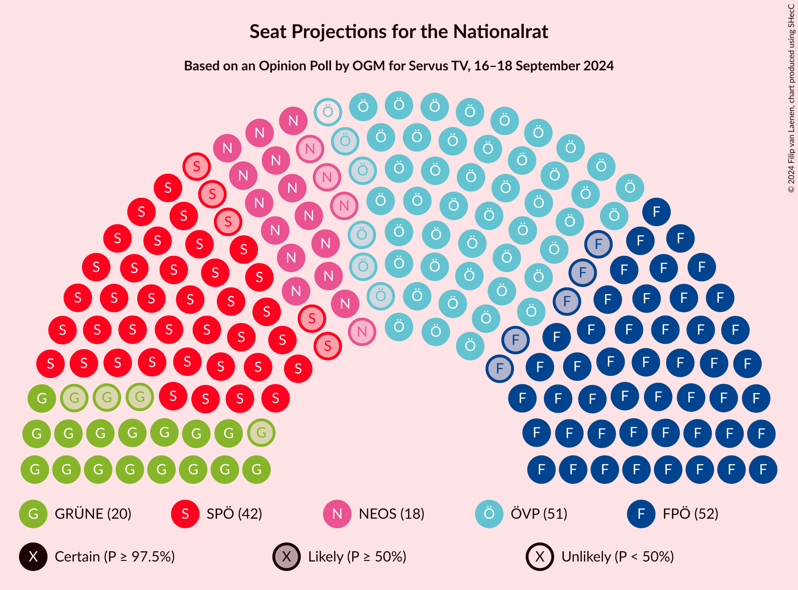
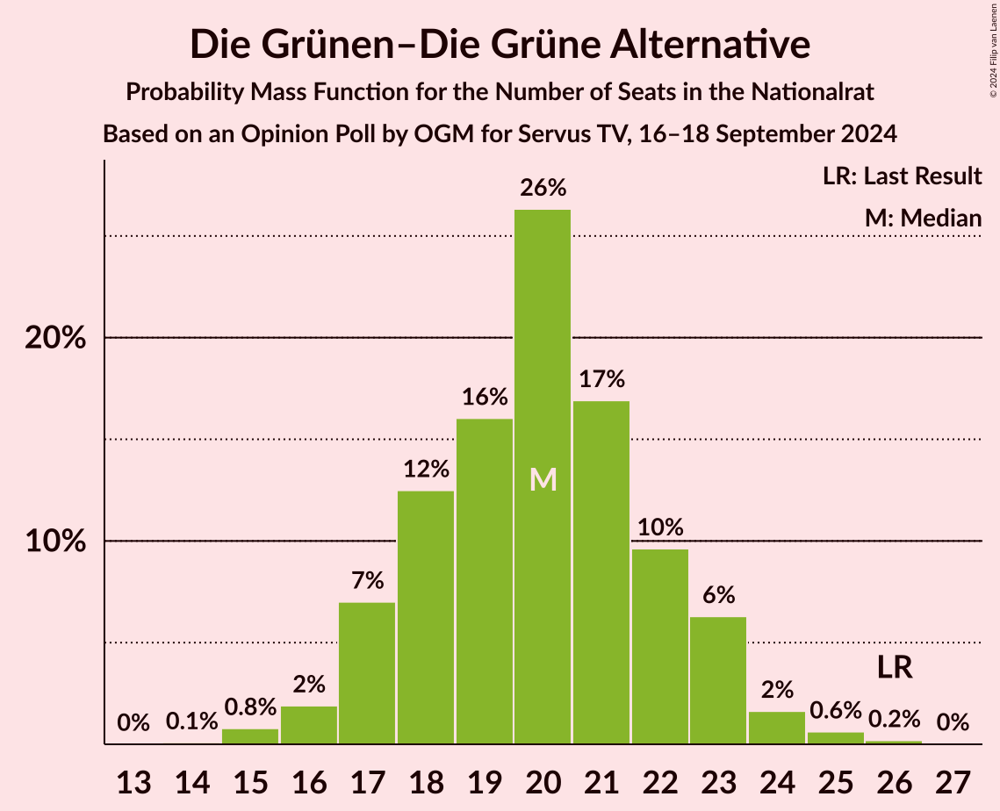
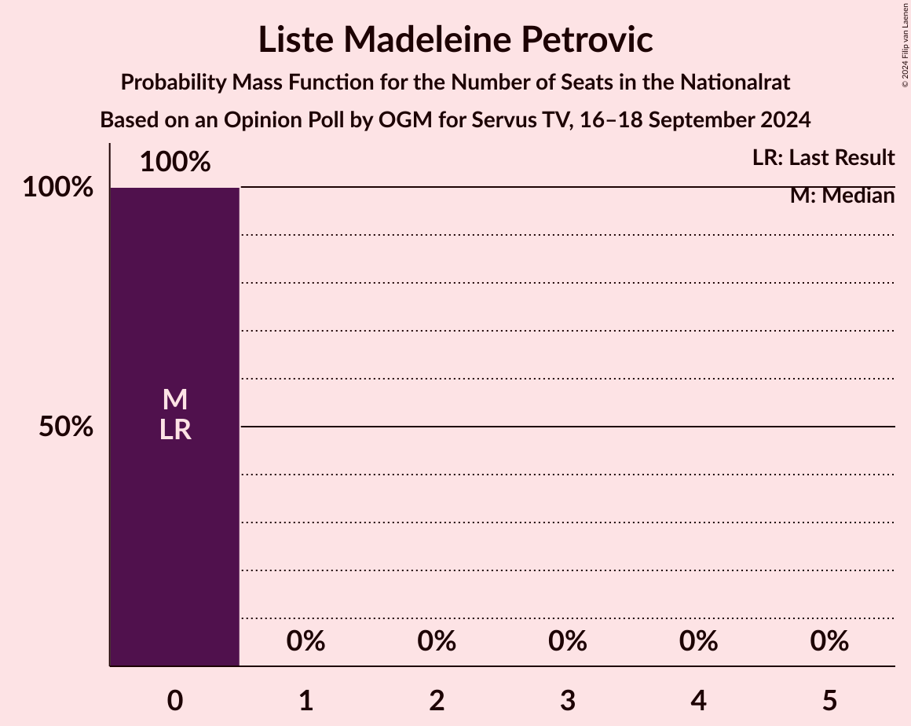

# Opinion Poll by OGM for Servus TV, 16–18 September 2024

<a href="#voting-intentions">Voting Intentions</a> | <a href="#seats">Seats</a> | <a href="#coalitions">Coalitions</a> | <a href="#technical-information">Technical Information</a>

## Voting Intentions

### Confidence Intervals

| Party | Last Result | Poll Result | 80% Confidence Interval | 90% Confidence Interval | 95% Confidence Interval | 99% Confidence Interval |
|:-----:|:-----------:|:-----------:|:-----------------------:|:-----------------------:|:-----------------------:|:-----------------------:|
| Freiheitliche Partei Österreichs | 16.2% | 26.0% | 24.3–27.8% |23.8–28.4% |23.4–28.8% |22.6–29.7% |
| Österreichische Volkspartei | 37.5% | 25.0% | 23.4–26.9% |22.9–27.4% |22.5–27.8% |21.7–28.7% |
| Sozialdemokratische Partei Österreichs | 21.2% | 21.0% | 19.5–22.7% |19.0–23.2% |18.6–23.7% |17.9–24.5% |
| Die Grünen–Die Grüne Alternative | 13.9% | 10.0% | 8.9–11.3% |8.6–11.7% |8.3–12.0% |7.8–12.6% |
| NEOS–Das Neue Österreich und Liberales Forum | 8.1% | 9.0% | 7.9–10.3% |7.7–10.6% |7.4–10.9% |6.9–11.6% |
| Kommunistische Partei Österreichs | 0.7% | 3.0% | 2.4–3.8% |2.3–4.1% |2.1–4.3% |1.9–4.7% |
| Bierpartei | 0.0% | 3.0% | 2.4–3.8% |2.3–4.1% |2.1–4.3% |1.9–4.7% |
| Liste Madeleine Petrovic | 0.0% | 1.0% | 0.7–1.5% |0.6–1.7% |0.5–1.8% |0.4–2.1% |
| Wandel | 0.0% | 1.0% | 0.7–1.5% |0.6–1.7% |0.5–1.8% |0.4–2.1% |

*Note:* The poll result column reflects the actual value used in the calculations. Published results may vary slightly, and in addition be rounded to fewer digits.

## Seats

### Confidence Intervals

| Party | Last Result | Median | 80% Confidence Interval | 90% Confidence Interval | 95% Confidence Interval | 99% Confidence Interval |
|:-----:|:-----------:|:------:|:-----------------------:|:-----------------------:|:-----------------------:|:-----------------------:|
| <a href="#freiheitliche-partei-österreichs">Freiheitliche Partei Österreichs</a> | 31 | 52 | 49–55 |47–57 |47–57 |45–59 |
| <a href="#österreichische-volkspartei">Österreichische Volkspartei</a> | 71 | 50 | 47–54 |46–55 |45–56 |43–58 |
| <a href="#sozialdemokratische-partei-österreichs">Sozialdemokratische Partei Österreichs</a> | 40 | 42 | 39–45 |38–46 |37–47 |36–49 |
| <a href="#die-grünen–die-grüne-alternative">Die Grünen–Die Grüne Alternative</a> | 26 | 20 | 18–22 |17–23 |16–23 |15–25 |
| <a href="#neos–das-neue-österreich-und-liberales-forum">NEOS–Das Neue Österreich und Liberales Forum</a> | 15 | 18 | 16–20 |15–21 |14–22 |14–23 |
| <a href="#kommunistische-partei-österreichs">Kommunistische Partei Österreichs</a> | 0 | 0 | 0 |0–7 |0–8 |0–9 |
| <a href="#bierpartei">Bierpartei</a> | 0 | 0 | 0 |0–8 |0–8 |0–9 |
| <a href="#liste-madeleine-petrovic">Liste Madeleine Petrovic</a> | 0 | 0 | 0 |0 |0 |0 |
| <a href="#wandel">Wandel</a> | 0 | 0 | 0 |0 |0 |0 |

### Freiheitliche Partei Österreichs

*For a full overview of the results for this party, see the [Freiheitliche Partei Österreichs](party-freiheitlicheparteiösterreichs.html) page.*

| Number of Seats | Probability | Accumulated | Special Marks |
|:---------------:|:-----------:|:-----------:|:-------------:|
| 31 | 0% | 100% | Last Result |
| 32 | 0% | 100% |  |
| 33 | 0% | 100% |  |
| 34 | 0% | 100% |  |
| 35 | 0% | 100% |  |
| 36 | 0% | 100% |  |
| 37 | 0% | 100% |  |
| 38 | 0% | 100% |  |
| 39 | 0% | 100% |  |
| 40 | 0% | 100% |  |
| 41 | 0% | 100% |  |
| 42 | 0% | 100% |  |
| 43 | 0.1% | 100% |  |
| 44 | 0.2% | 99.9% |  |
| 45 | 0.4% | 99.7% |  |
| 46 | 1.4% | 99.3% |  |
| 47 | 3% | 98% |  |
| 48 | 4% | 95% |  |
| 49 | 6% | 91% |  |
| 50 | 12% | 85% |  |
| 51 | 10% | 74% |  |
| 52 | 20% | 64% | Median |
| 53 | 13% | 44% |  |
| 54 | 15% | 31% |  |
| 55 | 6% | 16% |  |
| 56 | 3% | 9% |  |
| 57 | 4% | 6% |  |
| 58 | 0.9% | 2% |  |
| 59 | 1.1% | 2% |  |
| 60 | 0.3% | 0.4% |  |
| 61 | 0.1% | 0.2% |  |
| 62 | 0% | 0% |  |

### Österreichische Volkspartei

*For a full overview of the results for this party, see the [Österreichische Volkspartei](party-österreichischevolkspartei.html) page.*

| Number of Seats | Probability | Accumulated | Special Marks |
|:---------------:|:-----------:|:-----------:|:-------------:|
| 41 | 0.1% | 100% |  |
| 42 | 0.2% | 99.9% |  |
| 43 | 0.4% | 99.7% |  |
| 44 | 0.9% | 99.3% |  |
| 45 | 2% | 98% |  |
| 46 | 5% | 96% |  |
| 47 | 8% | 91% |  |
| 48 | 14% | 84% |  |
| 49 | 15% | 70% |  |
| 50 | 11% | 55% | Median |
| 51 | 10% | 45% |  |
| 52 | 12% | 34% |  |
| 53 | 6% | 22% |  |
| 54 | 10% | 16% |  |
| 55 | 3% | 6% |  |
| 56 | 2% | 3% |  |
| 57 | 0.8% | 1.3% |  |
| 58 | 0.4% | 0.5% |  |
| 59 | 0.1% | 0.1% |  |
| 60 | 0% | 0% |  |
| 61 | 0% | 0% |  |
| 62 | 0% | 0% |  |
| 63 | 0% | 0% |  |
| 64 | 0% | 0% |  |
| 65 | 0% | 0% |  |
| 66 | 0% | 0% |  |
| 67 | 0% | 0% |  |
| 68 | 0% | 0% |  |
| 69 | 0% | 0% |  |
| 70 | 0% | 0% |  |
| 71 | 0% | 0% | Last Result |

### Sozialdemokratische Partei Österreichs

*For a full overview of the results for this party, see the [Sozialdemokratische Partei Österreichs](party-sozialdemokratischeparteiösterreichs.html) page.*

| Number of Seats | Probability | Accumulated | Special Marks |
|:---------------:|:-----------:|:-----------:|:-------------:|
| 34 | 0.2% | 100% |  |
| 35 | 0.3% | 99.8% |  |
| 36 | 1.0% | 99.5% |  |
| 37 | 3% | 98.5% |  |
| 38 | 4% | 96% |  |
| 39 | 7% | 92% |  |
| 40 | 9% | 84% | Last Result |
| 41 | 21% | 75% |  |
| 42 | 17% | 54% | Median |
| 43 | 11% | 37% |  |
| 44 | 10% | 26% |  |
| 45 | 9% | 16% |  |
| 46 | 3% | 7% |  |
| 47 | 2% | 4% |  |
| 48 | 0.7% | 2% |  |
| 49 | 1.1% | 1.2% |  |
| 50 | 0.1% | 0.2% |  |
| 51 | 0% | 0.1% |  |
| 52 | 0% | 0% |  |

### Die Grünen–Die Grüne Alternative

*For a full overview of the results for this party, see the [Die Grünen–Die Grüne Alternative](party-diegrünen–diegrünealternative.html) page.*

| Number of Seats | Probability | Accumulated | Special Marks |
|:---------------:|:-----------:|:-----------:|:-------------:|
| 14 | 0.1% | 100% |  |
| 15 | 0.8% | 99.9% |  |
| 16 | 2% | 99.1% |  |
| 17 | 7% | 97% |  |
| 18 | 12% | 90% |  |
| 19 | 16% | 78% |  |
| 20 | 26% | 62% | Median |
| 21 | 17% | 35% |  |
| 22 | 10% | 18% |  |
| 23 | 6% | 9% |  |
| 24 | 2% | 2% |  |
| 25 | 0.6% | 0.9% |  |
| 26 | 0.2% | 0.2% | Last Result |
| 27 | 0% | 0% |  |

### NEOS–Das Neue Österreich und Liberales Forum

*For a full overview of the results for this party, see the [NEOS–Das Neue Österreich und Liberales Forum](party-neos–dasneueösterreichundliberalesforum.html) page.*

| Number of Seats | Probability | Accumulated | Special Marks |
|:---------------:|:-----------:|:-----------:|:-------------:|
| 12 | 0.1% | 100% |  |
| 13 | 0.4% | 99.9% |  |
| 14 | 2% | 99.5% |  |
| 15 | 7% | 97% | Last Result |
| 16 | 17% | 90% |  |
| 17 | 18% | 74% |  |
| 18 | 23% | 56% | Median |
| 19 | 17% | 33% |  |
| 20 | 8% | 16% |  |
| 21 | 5% | 8% |  |
| 22 | 2% | 3% |  |
| 23 | 0.4% | 0.6% |  |
| 24 | 0.1% | 0.2% |  |
| 25 | 0.1% | 0.1% |  |
| 26 | 0% | 0% |  |

### Kommunistische Partei Österreichs

*For a full overview of the results for this party, see the [Kommunistische Partei Österreichs](party-kommunistischeparteiösterreichs.html) page.*

| Number of Seats | Probability | Accumulated | Special Marks |
|:---------------:|:-----------:|:-----------:|:-------------:|
| 0 | 94% | 100% | Last Result, Median |
| 1 | 0% | 6% |  |
| 2 | 0% | 6% |  |
| 3 | 0% | 6% |  |
| 4 | 0% | 6% |  |
| 5 | 0% | 6% |  |
| 6 | 0% | 6% |  |
| 7 | 1.1% | 6% |  |
| 8 | 4% | 5% |  |
| 9 | 0.6% | 0.7% |  |
| 10 | 0.1% | 0.1% |  |
| 11 | 0% | 0% |  |

### Bierpartei

*For a full overview of the results for this party, see the [Bierpartei](party-bierpartei.html) page.*

| Number of Seats | Probability | Accumulated | Special Marks |
|:---------------:|:-----------:|:-----------:|:-------------:|
| 0 | 93% | 100% | Last Result, Median |
| 1 | 0% | 7% |  |
| 2 | 0% | 7% |  |
| 3 | 0% | 7% |  |
| 4 | 0% | 7% |  |
| 5 | 0% | 7% |  |
| 6 | 0% | 7% |  |
| 7 | 0.1% | 7% |  |
| 8 | 6% | 7% |  |
| 9 | 0.7% | 0.7% |  |
| 10 | 0.1% | 0.1% |  |
| 11 | 0% | 0% |  |

### Liste Madeleine Petrovic

*For a full overview of the results for this party, see the [Liste Madeleine Petrovic](party-listemadeleinepetrovic.html) page.*

| Number of Seats | Probability | Accumulated | Special Marks |
|:---------------:|:-----------:|:-----------:|:-------------:|
| 0 | 100% | 100% | Last Result, Median |

### Wandel

*For a full overview of the results for this party, see the [Wandel](party-wandel.html) page.*

| Number of Seats | Probability | Accumulated | Special Marks |
|:---------------:|:-----------:|:-----------:|:-------------:|
| 0 | 100% | 100% | Last Result, Median |

## Coalitions

### Confidence Intervals

| Coalition | Last Result | Median | Majority? | 80% Confidence Interval | 90% Confidence Interval | 95% Confidence Interval | 99% Confidence Interval |
|:---------:|:-----------:|:------:|:---------:|:-----------------------:|:-----------------------:|:-----------------------:|:-----------------------:|
| Freiheitliche Partei Österreichs – Österreichische Volkspartei | 102 | 102 | 99.9% | 98–106 | 97–108 | 96–109 | 93–110 |
| Freiheitliche Partei Österreichs – Sozialdemokratische Partei Österreichs | 71 | 94 | 81% | 90–98 | 89–99 | 87–100 | 85–102 |
| Österreichische Volkspartei – Sozialdemokratische Partei Österreichs | 111 | 93 | 57% | 88–96 | 86–97 | 85–99 | 83–101 |
| Österreichische Volkspartei – Die Grünen–Die Grüne Alternative – NEOS–Das Neue Österreich und Liberales Forum | 112 | 88 | 12% | 84–92 | 83–93 | 81–94 | 79–96 |
| Sozialdemokratische Partei Österreichs – Die Grünen–Die Grüne Alternative – NEOS–Das Neue Österreich und Liberales Forum | 81 | 80 | 0% | 76–84 | 74–85 | 74–86 | 71–88 |
| Österreichische Volkspartei – Die Grünen–Die Grüne Alternative | 97 | 70 | 0% | 66–74 | 65–75 | 64–76 | 62–78 |
| Österreichische Volkspartei – NEOS–Das Neue Österreich und Liberales Forum | 86 | 68 | 0% | 64–71 | 63–73 | 62–74 | 60–76 |
| Sozialdemokratische Partei Österreichs – Die Grünen–Die Grüne Alternative | 66 | 62 | 0% | 58–65 | 57–67 | 56–68 | 54–69 |
| Österreichische Volkspartei | 71 | 50 | 0% | 47–54 | 46–55 | 45–56 | 43–58 |
| Sozialdemokratische Partei Österreichs | 40 | 42 | 0% | 39–45 | 38–46 | 37–47 | 36–49 |

### Freiheitliche Partei Österreichs – Österreichische Volkspartei

| Number of Seats | Probability | Accumulated | Special Marks |
|:---------------:|:-----------:|:-----------:|:-------------:|
| 91 | 0.1% | 100% |  |
| 92 | 0.2% | 99.9% | Majority |
| 93 | 0.5% | 99.7% |  |
| 94 | 0.5% | 99.2% |  |
| 95 | 0.7% | 98.7% |  |
| 96 | 2% | 98% |  |
| 97 | 3% | 96% |  |
| 98 | 5% | 93% |  |
| 99 | 6% | 88% |  |
| 100 | 5% | 82% |  |
| 101 | 20% | 77% |  |
| 102 | 12% | 56% | Last Result, Median |
| 103 | 8% | 45% |  |
| 104 | 7% | 37% |  |
| 105 | 9% | 30% |  |
| 106 | 13% | 21% |  |
| 107 | 3% | 8% |  |
| 108 | 2% | 5% |  |
| 109 | 2% | 3% |  |
| 110 | 0.4% | 0.7% |  |
| 111 | 0.2% | 0.4% |  |
| 112 | 0.1% | 0.2% |  |
| 113 | 0% | 0.1% |  |
| 114 | 0% | 0% |  |

### Freiheitliche Partei Österreichs – Sozialdemokratische Partei Österreichs

| Number of Seats | Probability | Accumulated | Special Marks |
|:---------------:|:-----------:|:-----------:|:-------------:|
| 71 | 0% | 100% | Last Result |
| 72 | 0% | 100% |  |
| 73 | 0% | 100% |  |
| 74 | 0% | 100% |  |
| 75 | 0% | 100% |  |
| 76 | 0% | 100% |  |
| 77 | 0% | 100% |  |
| 78 | 0% | 100% |  |
| 79 | 0% | 100% |  |
| 80 | 0% | 100% |  |
| 81 | 0% | 100% |  |
| 82 | 0% | 100% |  |
| 83 | 0.1% | 100% |  |
| 84 | 0.1% | 99.9% |  |
| 85 | 0.3% | 99.8% |  |
| 86 | 0.6% | 99.5% |  |
| 87 | 2% | 98.8% |  |
| 88 | 2% | 97% |  |
| 89 | 3% | 95% |  |
| 90 | 4% | 92% |  |
| 91 | 7% | 88% |  |
| 92 | 9% | 81% | Majority |
| 93 | 15% | 72% |  |
| 94 | 10% | 57% | Median |
| 95 | 13% | 46% |  |
| 96 | 12% | 33% |  |
| 97 | 8% | 21% |  |
| 98 | 4% | 13% |  |
| 99 | 5% | 9% |  |
| 100 | 1.5% | 4% |  |
| 101 | 1.3% | 2% |  |
| 102 | 0.5% | 0.9% |  |
| 103 | 0.2% | 0.4% |  |
| 104 | 0.1% | 0.2% |  |
| 105 | 0.1% | 0.1% |  |
| 106 | 0% | 0% |  |

### Österreichische Volkspartei – Sozialdemokratische Partei Österreichs

| Number of Seats | Probability | Accumulated | Special Marks |
|:---------------:|:-----------:|:-----------:|:-------------:|
| 80 | 0% | 100% |  |
| 81 | 0% | 99.9% |  |
| 82 | 0.2% | 99.9% |  |
| 83 | 0.3% | 99.7% |  |
| 84 | 0.6% | 99.4% |  |
| 85 | 1.4% | 98.8% |  |
| 86 | 3% | 97% |  |
| 87 | 3% | 95% |  |
| 88 | 4% | 92% |  |
| 89 | 9% | 88% |  |
| 90 | 11% | 79% |  |
| 91 | 11% | 68% |  |
| 92 | 6% | 57% | Median, Majority |
| 93 | 15% | 50% |  |
| 94 | 8% | 35% |  |
| 95 | 15% | 27% |  |
| 96 | 5% | 12% |  |
| 97 | 3% | 7% |  |
| 98 | 2% | 4% |  |
| 99 | 1.0% | 3% |  |
| 100 | 0.9% | 2% |  |
| 101 | 0.4% | 0.6% |  |
| 102 | 0.1% | 0.2% |  |
| 103 | 0% | 0.1% |  |
| 104 | 0% | 0% |  |
| 105 | 0% | 0% |  |
| 106 | 0% | 0% |  |
| 107 | 0% | 0% |  |
| 108 | 0% | 0% |  |
| 109 | 0% | 0% |  |
| 110 | 0% | 0% |  |
| 111 | 0% | 0% | Last Result |

### Österreichische Volkspartei – Die Grünen–Die Grüne Alternative – NEOS–Das Neue Österreich und Liberales Forum

| Number of Seats | Probability | Accumulated | Special Marks |
|:---------------:|:-----------:|:-----------:|:-------------:|
| 77 | 0.1% | 100% |  |
| 78 | 0.3% | 99.9% |  |
| 79 | 0.4% | 99.5% |  |
| 80 | 0.5% | 99.2% |  |
| 81 | 2% | 98.6% |  |
| 82 | 2% | 97% |  |
| 83 | 4% | 95% |  |
| 84 | 7% | 91% |  |
| 85 | 5% | 84% |  |
| 86 | 9% | 79% |  |
| 87 | 13% | 70% |  |
| 88 | 14% | 57% | Median |
| 89 | 10% | 43% |  |
| 90 | 14% | 33% |  |
| 91 | 7% | 19% |  |
| 92 | 6% | 12% | Majority |
| 93 | 3% | 6% |  |
| 94 | 2% | 4% |  |
| 95 | 0.7% | 2% |  |
| 96 | 0.7% | 1.2% |  |
| 97 | 0.4% | 0.5% |  |
| 98 | 0.1% | 0.1% |  |
| 99 | 0% | 0% |  |
| 100 | 0% | 0% |  |
| 101 | 0% | 0% |  |
| 102 | 0% | 0% |  |
| 103 | 0% | 0% |  |
| 104 | 0% | 0% |  |
| 105 | 0% | 0% |  |
| 106 | 0% | 0% |  |
| 107 | 0% | 0% |  |
| 108 | 0% | 0% |  |
| 109 | 0% | 0% |  |
| 110 | 0% | 0% |  |
| 111 | 0% | 0% |  |
| 112 | 0% | 0% | Last Result |

### Sozialdemokratische Partei Österreichs – Die Grünen–Die Grüne Alternative – NEOS–Das Neue Österreich und Liberales Forum

| Number of Seats | Probability | Accumulated | Special Marks |
|:---------------:|:-----------:|:-----------:|:-------------:|
| 68 | 0.1% | 100% |  |
| 69 | 0% | 99.9% |  |
| 70 | 0.1% | 99.9% |  |
| 71 | 0.4% | 99.8% |  |
| 72 | 0.8% | 99.4% |  |
| 73 | 0.8% | 98.5% |  |
| 74 | 4% | 98% |  |
| 75 | 3% | 93% |  |
| 76 | 6% | 91% |  |
| 77 | 14% | 85% |  |
| 78 | 11% | 71% |  |
| 79 | 8% | 60% |  |
| 80 | 8% | 52% | Median |
| 81 | 11% | 44% | Last Result |
| 82 | 19% | 33% |  |
| 83 | 4% | 14% |  |
| 84 | 3% | 10% |  |
| 85 | 4% | 7% |  |
| 86 | 1.3% | 3% |  |
| 87 | 0.6% | 1.4% |  |
| 88 | 0.3% | 0.8% |  |
| 89 | 0.3% | 0.4% |  |
| 90 | 0.1% | 0.1% |  |
| 91 | 0% | 0% |  |

### Österreichische Volkspartei – Die Grünen–Die Grüne Alternative

| Number of Seats | Probability | Accumulated | Special Marks |
|:---------------:|:-----------:|:-----------:|:-------------:|
| 60 | 0.1% | 100% |  |
| 61 | 0.1% | 99.9% |  |
| 62 | 0.7% | 99.7% |  |
| 63 | 0.7% | 99.1% |  |
| 64 | 2% | 98% |  |
| 65 | 2% | 96% |  |
| 66 | 7% | 94% |  |
| 67 | 8% | 87% |  |
| 68 | 9% | 78% |  |
| 69 | 15% | 70% |  |
| 70 | 9% | 55% | Median |
| 71 | 10% | 45% |  |
| 72 | 11% | 35% |  |
| 73 | 6% | 24% |  |
| 74 | 10% | 18% |  |
| 75 | 5% | 8% |  |
| 76 | 1.4% | 3% |  |
| 77 | 1.3% | 2% |  |
| 78 | 0.3% | 0.6% |  |
| 79 | 0.2% | 0.3% |  |
| 80 | 0.1% | 0.1% |  |
| 81 | 0% | 0% |  |
| 82 | 0% | 0% |  |
| 83 | 0% | 0% |  |
| 84 | 0% | 0% |  |
| 85 | 0% | 0% |  |
| 86 | 0% | 0% |  |
| 87 | 0% | 0% |  |
| 88 | 0% | 0% |  |
| 89 | 0% | 0% |  |
| 90 | 0% | 0% |  |
| 91 | 0% | 0% |  |
| 92 | 0% | 0% | Majority |
| 93 | 0% | 0% |  |
| 94 | 0% | 0% |  |
| 95 | 0% | 0% |  |
| 96 | 0% | 0% |  |
| 97 | 0% | 0% | Last Result |

### Österreichische Volkspartei – NEOS–Das Neue Österreich und Liberales Forum

| Number of Seats | Probability | Accumulated | Special Marks |
|:---------------:|:-----------:|:-----------:|:-------------:|
| 58 | 0.1% | 100% |  |
| 59 | 0.2% | 99.9% |  |
| 60 | 0.5% | 99.7% |  |
| 61 | 0.9% | 99.2% |  |
| 62 | 2% | 98% |  |
| 63 | 3% | 96% |  |
| 64 | 4% | 93% |  |
| 65 | 7% | 89% |  |
| 66 | 11% | 82% |  |
| 67 | 15% | 70% |  |
| 68 | 12% | 55% | Median |
| 69 | 10% | 43% |  |
| 70 | 16% | 33% |  |
| 71 | 8% | 17% |  |
| 72 | 4% | 10% |  |
| 73 | 2% | 6% |  |
| 74 | 1.3% | 3% |  |
| 75 | 0.9% | 2% |  |
| 76 | 0.8% | 1.1% |  |
| 77 | 0.2% | 0.3% |  |
| 78 | 0% | 0.1% |  |
| 79 | 0% | 0% |  |
| 80 | 0% | 0% |  |
| 81 | 0% | 0% |  |
| 82 | 0% | 0% |  |
| 83 | 0% | 0% |  |
| 84 | 0% | 0% |  |
| 85 | 0% | 0% |  |
| 86 | 0% | 0% | Last Result |

### Sozialdemokratische Partei Österreichs – Die Grünen–Die Grüne Alternative

| Number of Seats | Probability | Accumulated | Special Marks |
|:---------------:|:-----------:|:-----------:|:-------------:|
| 52 | 0.1% | 100% |  |
| 53 | 0.2% | 99.9% |  |
| 54 | 0.4% | 99.7% |  |
| 55 | 0.8% | 99.3% |  |
| 56 | 2% | 98.5% |  |
| 57 | 4% | 97% |  |
| 58 | 4% | 93% |  |
| 59 | 8% | 88% |  |
| 60 | 11% | 80% |  |
| 61 | 17% | 70% |  |
| 62 | 10% | 53% | Median |
| 63 | 14% | 43% |  |
| 64 | 13% | 29% |  |
| 65 | 7% | 16% |  |
| 66 | 3% | 9% | Last Result |
| 67 | 3% | 6% |  |
| 68 | 2% | 3% |  |
| 69 | 0.7% | 1.2% |  |
| 70 | 0.3% | 0.5% |  |
| 71 | 0.1% | 0.2% |  |
| 72 | 0% | 0.1% |  |
| 73 | 0% | 0% |  |

### Österreichische Volkspartei

| Number of Seats | Probability | Accumulated | Special Marks |
|:---------------:|:-----------:|:-----------:|:-------------:|
| 41 | 0.1% | 100% |  |
| 42 | 0.2% | 99.9% |  |
| 43 | 0.4% | 99.7% |  |
| 44 | 0.9% | 99.3% |  |
| 45 | 2% | 98% |  |
| 46 | 5% | 96% |  |
| 47 | 8% | 91% |  |
| 48 | 14% | 84% |  |
| 49 | 15% | 70% |  |
| 50 | 11% | 55% | Median |
| 51 | 10% | 45% |  |
| 52 | 12% | 34% |  |
| 53 | 6% | 22% |  |
| 54 | 10% | 16% |  |
| 55 | 3% | 6% |  |
| 56 | 2% | 3% |  |
| 57 | 0.8% | 1.3% |  |
| 58 | 0.4% | 0.5% |  |
| 59 | 0.1% | 0.1% |  |
| 60 | 0% | 0% |  |
| 61 | 0% | 0% |  |
| 62 | 0% | 0% |  |
| 63 | 0% | 0% |  |
| 64 | 0% | 0% |  |
| 65 | 0% | 0% |  |
| 66 | 0% | 0% |  |
| 67 | 0% | 0% |  |
| 68 | 0% | 0% |  |
| 69 | 0% | 0% |  |
| 70 | 0% | 0% |  |
| 71 | 0% | 0% | Last Result |

### Sozialdemokratische Partei Österreichs

| Number of Seats | Probability | Accumulated | Special Marks |
|:---------------:|:-----------:|:-----------:|:-------------:|
| 34 | 0.2% | 100% |  |
| 35 | 0.3% | 99.8% |  |
| 36 | 1.0% | 99.5% |  |
| 37 | 3% | 98.5% |  |
| 38 | 4% | 96% |  |
| 39 | 7% | 92% |  |
| 40 | 9% | 84% | Last Result |
| 41 | 21% | 75% |  |
| 42 | 17% | 54% | Median |
| 43 | 11% | 37% |  |
| 44 | 10% | 26% |  |
| 45 | 9% | 16% |  |
| 46 | 3% | 7% |  |
| 47 | 2% | 4% |  |
| 48 | 0.7% | 2% |  |
| 49 | 1.1% | 1.2% |  |
| 50 | 0.1% | 0.2% |  |
| 51 | 0% | 0.1% |  |
| 52 | 0% | 0% |  |

## Technical Information

### Opinion Poll

+ **Polling firm:** OGM
+ **Commissioner(s):** Servus TV
+ **Fieldwork period:** 16–18 September 2024

### Calculations

+ **Sample size:** 1022
+ **Simulations done:** 2,097,152
+ **Error estimate:** 2.35%

