# Opinion Poll by IFDD for ATV, Kronen Zeitung and PULS 24, 19–22 September 2024

<a href="#voting-intentions">Voting Intentions</a> | <a href="#seats">Seats</a> | <a href="#coalitions">Coalitions</a> | <a href="#technical-information">Technical Information</a>

## Voting Intentions

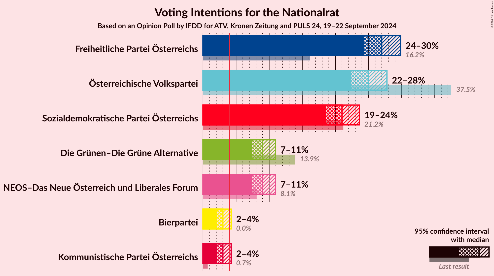

### Confidence Intervals

| Party | Last Result | Poll Result | 80% Confidence Interval | 90% Confidence Interval | 95% Confidence Interval | 99% Confidence Interval |
|:-----:|:-----------:|:-----------:|:-----------------------:|:-----------------------:|:-----------------------:|:-----------------------:|
| Freiheitliche Partei Österreichs | 16.2% | 27.0% | 25.3–28.9% |24.8–29.4% |24.3–29.8% |23.5–30.7% |
| Österreichische Volkspartei | 37.5% | 25.0% | 23.3–26.8% |22.8–27.3% |22.4–27.8% |21.6–28.7% |
| Sozialdemokratische Partei Österreichs | 21.2% | 21.0% | 19.4–22.7% |19.0–23.2% |18.6–23.6% |17.8–24.5% |
| Die Grünen–Die Grüne Alternative | 13.9% | 9.0% | 7.9–10.3% |7.6–10.6% |7.4–10.9% |6.9–11.6% |
| NEOS–Das Neue Österreich und Liberales Forum | 8.1% | 9.0% | 7.9–10.3% |7.6–10.6% |7.4–10.9% |6.9–11.6% |
| Kommunistische Partei Österreichs | 0.7% | 3.0% | 2.4–3.8% |2.2–4.1% |2.1–4.3% |1.9–4.7% |
| Bierpartei | 0.0% | 3.0% | 2.4–3.8% |2.2–4.1% |2.1–4.3% |1.9–4.7% |

*Note:* The poll result column reflects the actual value used in the calculations. Published results may vary slightly, and in addition be rounded to fewer digits.

## Seats

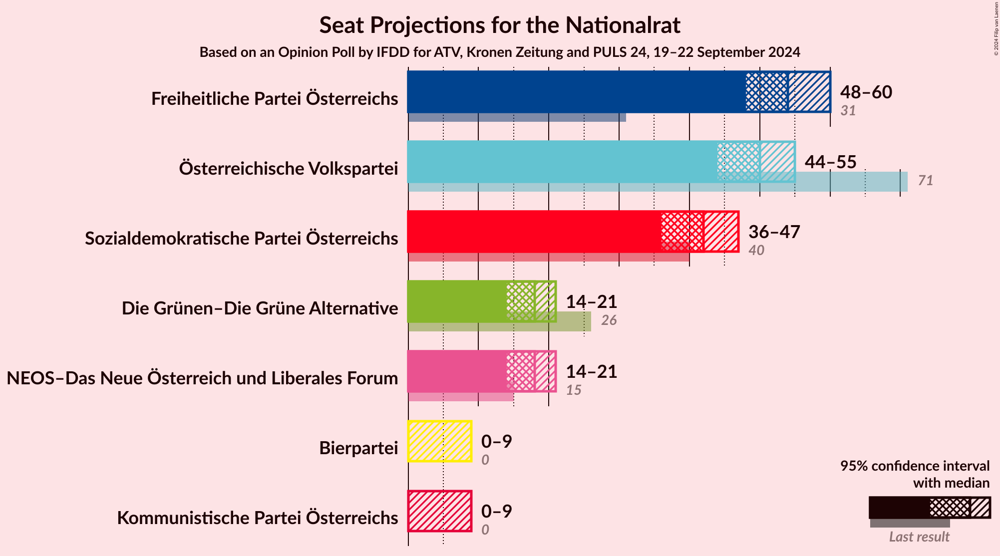

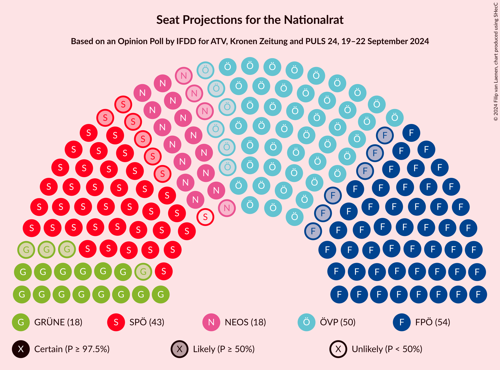

### Confidence Intervals

| Party | Last Result | Median | 80% Confidence Interval | 90% Confidence Interval | 95% Confidence Interval | 99% Confidence Interval |
|:-----:|:-----------:|:------:|:-----------------------:|:-----------------------:|:-----------------------:|:-----------------------:|
| <a href="#freiheitliche-partei-österreichs">Freiheitliche Partei Österreichs</a> | 31 | 54 | 50–58 |49–59 |48–60 |46–61 |
| <a href="#österreichische-volkspartei">Österreichische Volkspartei</a> | 71 | 50 | 46–53 |45–54 |44–55 |42–57 |
| <a href="#sozialdemokratische-partei-österreichs">Sozialdemokratische Partei Österreichs</a> | 40 | 42 | 38–45 |37–46 |36–47 |35–49 |
| <a href="#die-grünen–die-grüne-alternative">Die Grünen–Die Grüne Alternative</a> | 26 | 18 | 15–20 |15–21 |14–21 |13–23 |
| <a href="#neos–das-neue-österreich-und-liberales-forum">NEOS–Das Neue Österreich und Liberales Forum</a> | 15 | 18 | 15–20 |15–21 |14–21 |13–23 |
| <a href="#kommunistische-partei-österreichs">Kommunistische Partei Österreichs</a> | 0 | 0 | 0 |0–8 |0–9 |0–9 |
| <a href="#bierpartei">Bierpartei</a> | 0 | 0 | 0–8 |0–8 |0–9 |0–9 |

### Freiheitliche Partei Österreichs

*For a full overview of the results for this party, see the [Freiheitliche Partei Österreichs](party-freiheitlicheparteiösterreichs.html) page.*

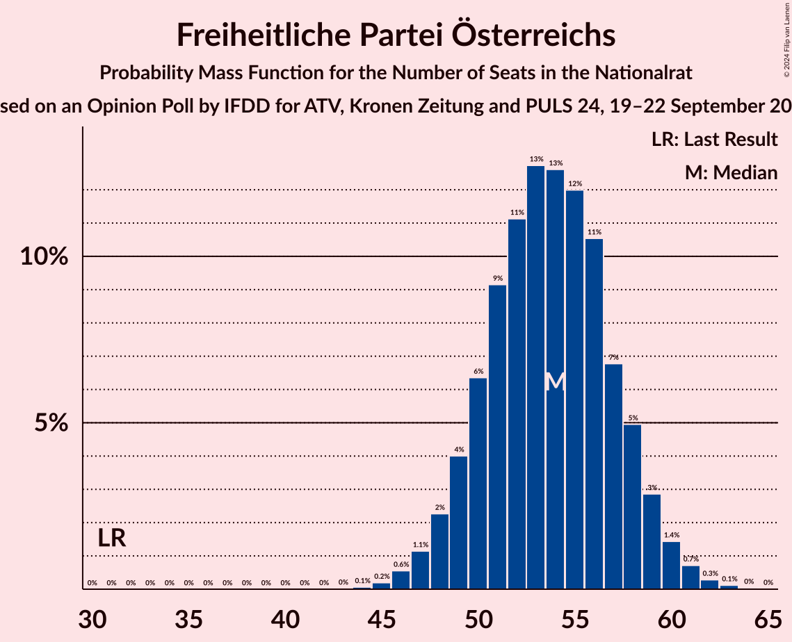

| Number of Seats | Probability | Accumulated | Special Marks |
|:---------------:|:-----------:|:-----------:|:-------------:|
| 31 | 0% | 100% | Last Result |
| 32 | 0% | 100% |  |
| 33 | 0% | 100% |  |
| 34 | 0% | 100% |  |
| 35 | 0% | 100% |  |
| 36 | 0% | 100% |  |
| 37 | 0% | 100% |  |
| 38 | 0% | 100% |  |
| 39 | 0% | 100% |  |
| 40 | 0% | 100% |  |
| 41 | 0% | 100% |  |
| 42 | 0% | 100% |  |
| 43 | 0% | 100% |  |
| 44 | 0.1% | 100% |  |
| 45 | 0.2% | 99.9% |  |
| 46 | 0.6% | 99.7% |  |
| 47 | 1.1% | 99.2% |  |
| 48 | 2% | 98% |  |
| 49 | 4% | 96% |  |
| 50 | 6% | 92% |  |
| 51 | 9% | 85% |  |
| 52 | 11% | 76% |  |
| 53 | 13% | 65% |  |
| 54 | 13% | 52% | Median |
| 55 | 12% | 40% |  |
| 56 | 11% | 28% |  |
| 57 | 7% | 17% |  |
| 58 | 5% | 10% |  |
| 59 | 3% | 5% |  |
| 60 | 1.4% | 3% |  |
| 61 | 0.7% | 1.2% |  |
| 62 | 0.3% | 0.5% |  |
| 63 | 0.1% | 0.2% |  |
| 64 | 0% | 0.1% |  |
| 65 | 0% | 0% |  |

### Österreichische Volkspartei

*For a full overview of the results for this party, see the [Österreichische Volkspartei](party-österreichischevolkspartei.html) page.*

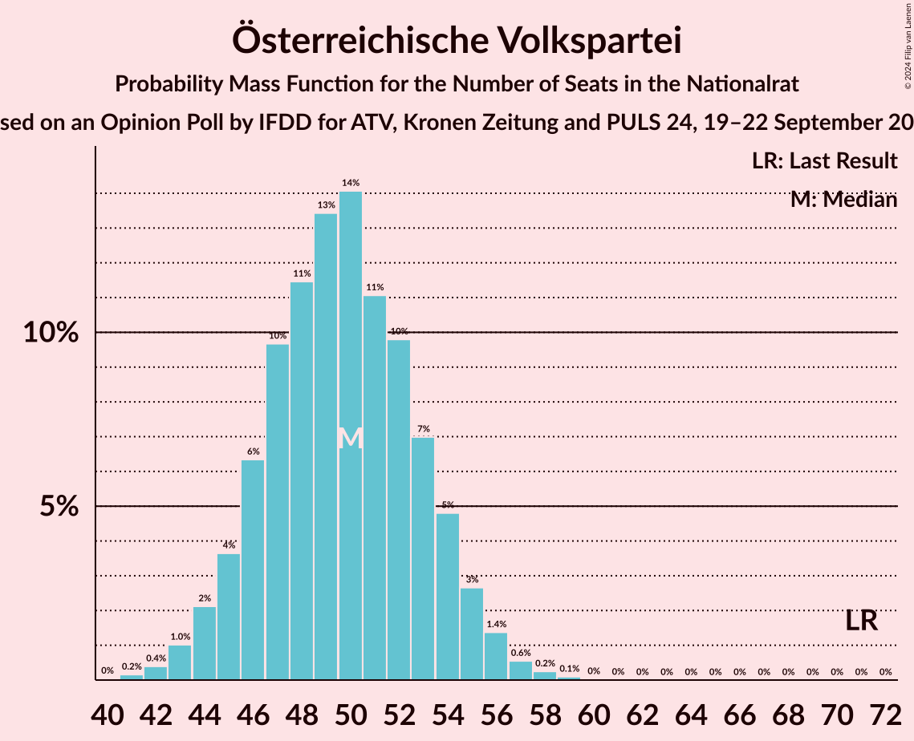

| Number of Seats | Probability | Accumulated | Special Marks |
|:---------------:|:-----------:|:-----------:|:-------------:|
| 40 | 0% | 100% |  |
| 41 | 0.2% | 99.9% |  |
| 42 | 0.4% | 99.8% |  |
| 43 | 1.0% | 99.4% |  |
| 44 | 2% | 98% |  |
| 45 | 4% | 96% |  |
| 46 | 6% | 93% |  |
| 47 | 10% | 86% |  |
| 48 | 11% | 77% |  |
| 49 | 13% | 65% |  |
| 50 | 14% | 52% | Median |
| 51 | 11% | 38% |  |
| 52 | 10% | 27% |  |
| 53 | 7% | 17% |  |
| 54 | 5% | 10% |  |
| 55 | 3% | 5% |  |
| 56 | 1.4% | 2% |  |
| 57 | 0.6% | 0.9% |  |
| 58 | 0.2% | 0.4% |  |
| 59 | 0.1% | 0.1% |  |
| 60 | 0% | 0% |  |
| 61 | 0% | 0% |  |
| 62 | 0% | 0% |  |
| 63 | 0% | 0% |  |
| 64 | 0% | 0% |  |
| 65 | 0% | 0% |  |
| 66 | 0% | 0% |  |
| 67 | 0% | 0% |  |
| 68 | 0% | 0% |  |
| 69 | 0% | 0% |  |
| 70 | 0% | 0% |  |
| 71 | 0% | 0% | Last Result |

### Sozialdemokratische Partei Österreichs

*For a full overview of the results for this party, see the [Sozialdemokratische Partei Österreichs](party-sozialdemokratischeparteiösterreichs.html) page.*

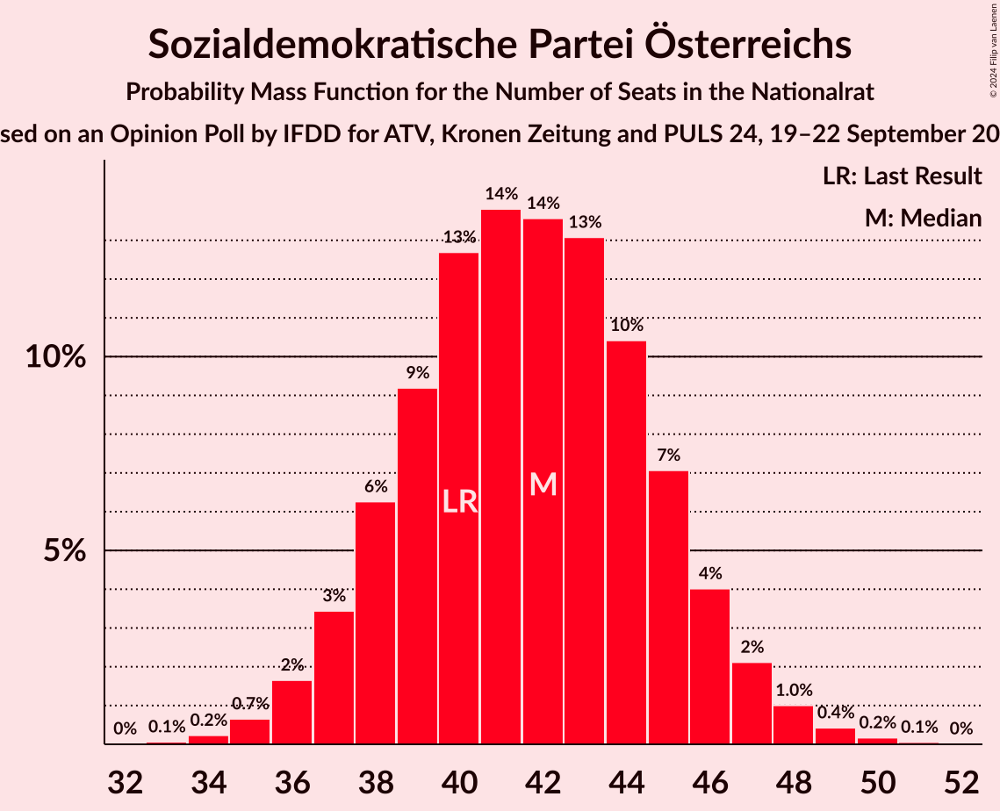

| Number of Seats | Probability | Accumulated | Special Marks |
|:---------------:|:-----------:|:-----------:|:-------------:|
| 33 | 0.1% | 100% |  |
| 34 | 0.2% | 99.9% |  |
| 35 | 0.7% | 99.7% |  |
| 36 | 2% | 99.0% |  |
| 37 | 3% | 97% |  |
| 38 | 6% | 94% |  |
| 39 | 9% | 88% |  |
| 40 | 13% | 78% | Last Result |
| 41 | 14% | 66% |  |
| 42 | 14% | 52% | Median |
| 43 | 13% | 38% |  |
| 44 | 10% | 25% |  |
| 45 | 7% | 15% |  |
| 46 | 4% | 8% |  |
| 47 | 2% | 4% |  |
| 48 | 1.0% | 2% |  |
| 49 | 0.4% | 0.7% |  |
| 50 | 0.2% | 0.2% |  |
| 51 | 0.1% | 0.1% |  |
| 52 | 0% | 0% |  |

### Die Grünen–Die Grüne Alternative

*For a full overview of the results for this party, see the [Die Grünen–Die Grüne Alternative](party-diegrünen–diegrünealternative.html) page.*

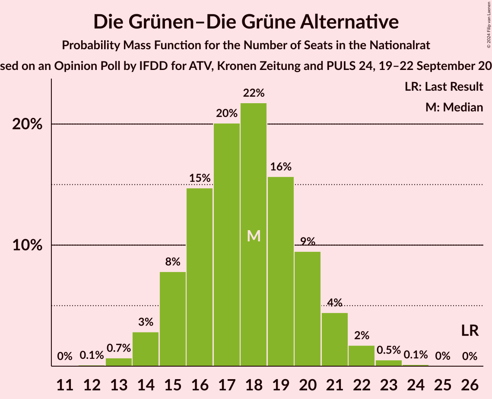

| Number of Seats | Probability | Accumulated | Special Marks |
|:---------------:|:-----------:|:-----------:|:-------------:|
| 12 | 0.1% | 100% |  |
| 13 | 0.7% | 99.9% |  |
| 14 | 3% | 99.2% |  |
| 15 | 8% | 96% |  |
| 16 | 15% | 89% |  |
| 17 | 20% | 74% |  |
| 18 | 22% | 54% | Median |
| 19 | 16% | 32% |  |
| 20 | 9% | 16% |  |
| 21 | 4% | 7% |  |
| 22 | 2% | 2% |  |
| 23 | 0.5% | 0.7% |  |
| 24 | 0.1% | 0.2% |  |
| 25 | 0% | 0% |  |
| 26 | 0% | 0% | Last Result |

### NEOS–Das Neue Österreich und Liberales Forum

*For a full overview of the results for this party, see the [NEOS–Das Neue Österreich und Liberales Forum](party-neos–dasneueösterreichundliberalesforum.html) page.*

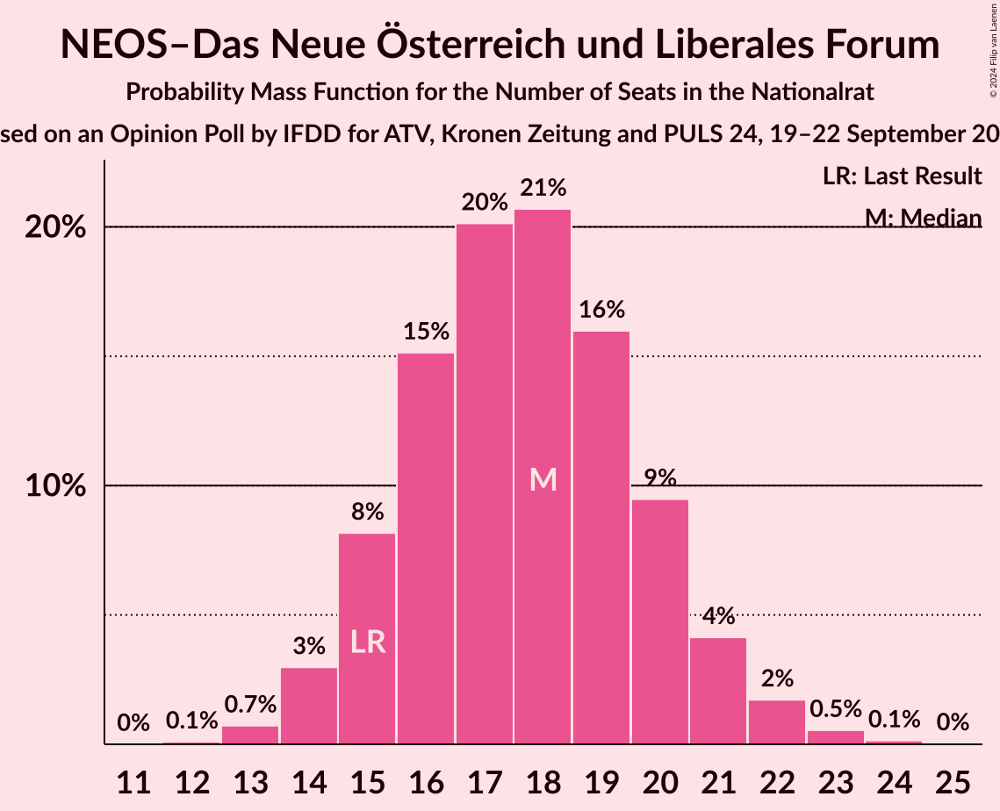

| Number of Seats | Probability | Accumulated | Special Marks |
|:---------------:|:-----------:|:-----------:|:-------------:|
| 12 | 0.1% | 100% |  |
| 13 | 0.7% | 99.9% |  |
| 14 | 3% | 99.2% |  |
| 15 | 8% | 96% | Last Result |
| 16 | 15% | 88% |  |
| 17 | 20% | 73% |  |
| 18 | 21% | 53% | Median |
| 19 | 16% | 32% |  |
| 20 | 9% | 16% |  |
| 21 | 4% | 7% |  |
| 22 | 2% | 2% |  |
| 23 | 0.5% | 0.7% |  |
| 24 | 0.1% | 0.2% |  |
| 25 | 0% | 0% |  |

### Kommunistische Partei Österreichs

*For a full overview of the results for this party, see the [Kommunistische Partei Österreichs](party-kommunistischeparteiösterreichs.html) page.*

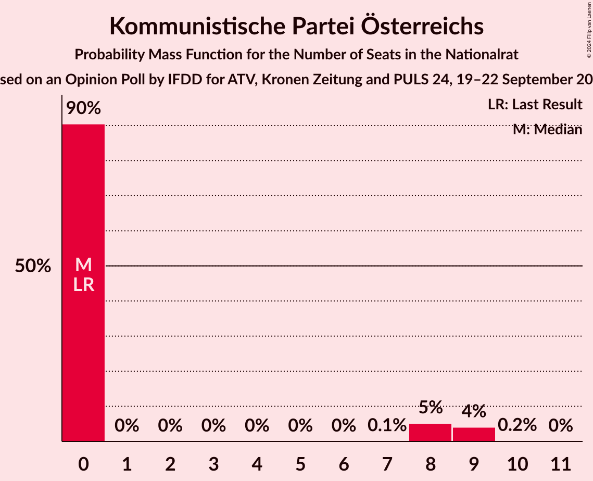

| Number of Seats | Probability | Accumulated | Special Marks |
|:---------------:|:-----------:|:-----------:|:-------------:|
| 0 | 90% | 100% | Last Result, Median |
| 1 | 0% | 10% |  |
| 2 | 0% | 10% |  |
| 3 | 0% | 10% |  |
| 4 | 0% | 10% |  |
| 5 | 0% | 10% |  |
| 6 | 0% | 10% |  |
| 7 | 0.1% | 10% |  |
| 8 | 5% | 9% |  |
| 9 | 4% | 4% |  |
| 10 | 0.2% | 0.2% |  |
| 11 | 0% | 0% |  |

### Bierpartei

*For a full overview of the results for this party, see the [Bierpartei](party-bierpartei.html) page.*

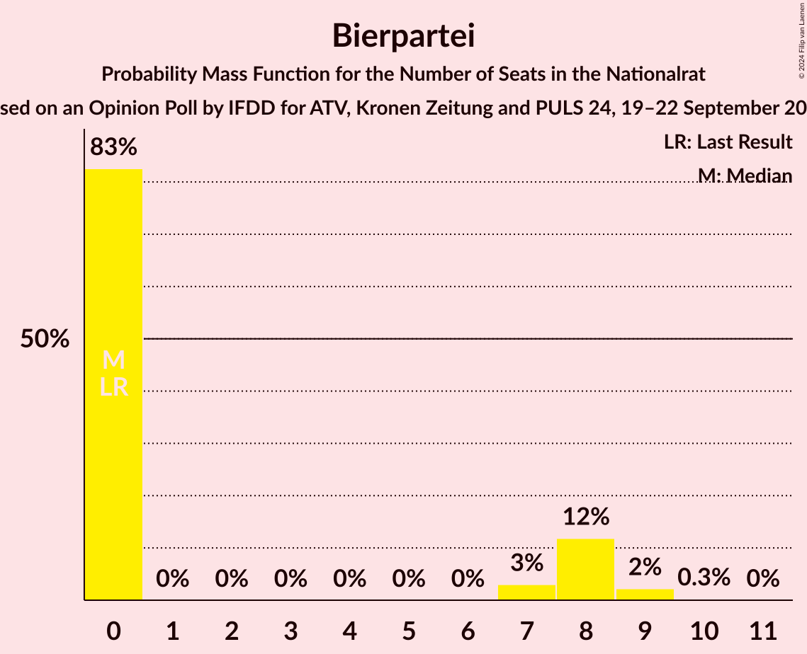

| Number of Seats | Probability | Accumulated | Special Marks |
|:---------------:|:-----------:|:-----------:|:-------------:|
| 0 | 83% | 100% | Last Result, Median |
| 1 | 0% | 17% |  |
| 2 | 0% | 17% |  |
| 3 | 0% | 17% |  |
| 4 | 0% | 17% |  |
| 5 | 0% | 17% |  |
| 6 | 0% | 17% |  |
| 7 | 3% | 17% |  |
| 8 | 12% | 14% |  |
| 9 | 2% | 3% |  |
| 10 | 0.3% | 0.3% |  |
| 11 | 0% | 0% |  |

## Coalitions

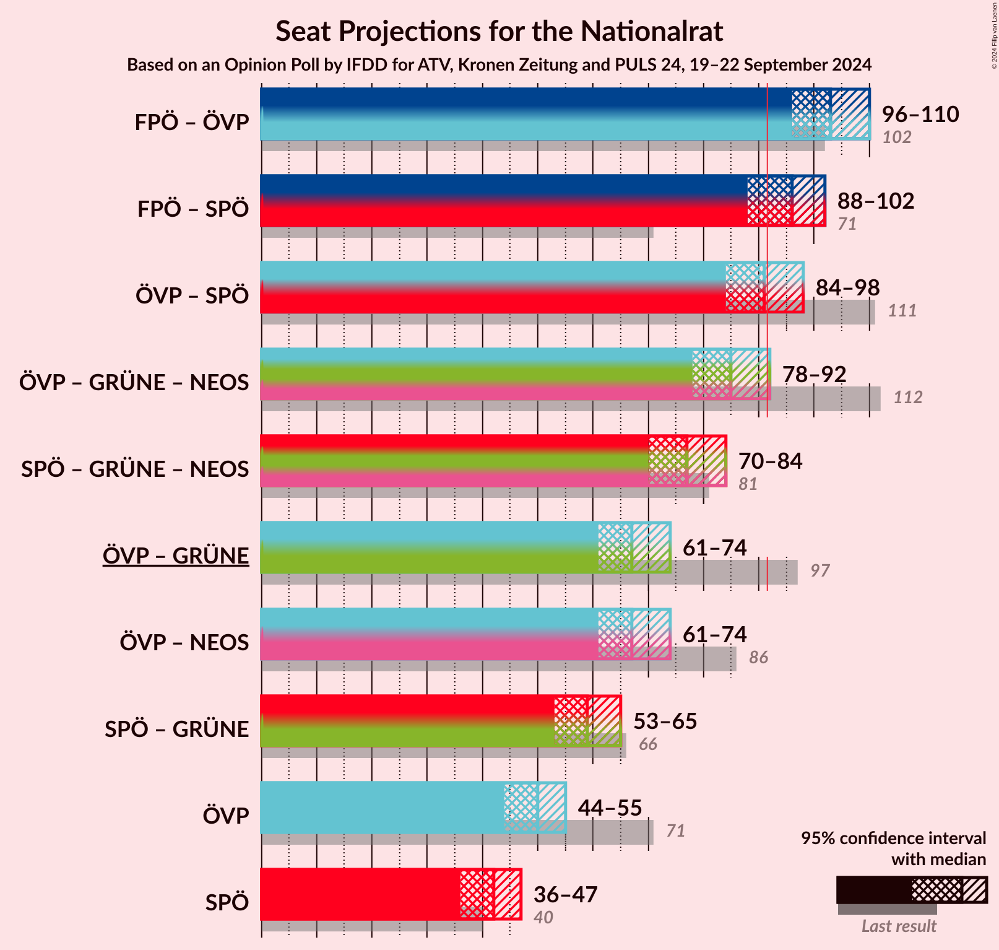

### Confidence Intervals

| Coalition | Last Result | Median | Majority? | 80% Confidence Interval | 90% Confidence Interval | 95% Confidence Interval | 99% Confidence Interval |
|:---------:|:-----------:|:------:|:---------:|:-----------------------:|:-----------------------:|:-----------------------:|:-----------------------:|
| Freiheitliche Partei Österreichs – Österreichische Volkspartei | 102 | 103 | 99.9% | 98–108 | 97–109 | 96–110 | 93–113 |
| Freiheitliche Partei Österreichs – Sozialdemokratische Partei Österreichs | 71 | 96 | 85% | 90–100 | 89–101 | 88–102 | 85–104 |
| Österreichische Volkspartei – Sozialdemokratische Partei Österreichs | 111 | 91 | 49% | 87–96 | 85–97 | 84–98 | 82–100 |
| Österreichische Volkspartei – Die Grünen–Die Grüne Alternative – NEOS–Das Neue Österreich und Liberales Forum | 112 | 85 | 3% | 80–90 | 79–91 | 78–92 | 76–94 |
| Sozialdemokratische Partei Österreichs – Die Grünen–Die Grüne Alternative – NEOS–Das Neue Österreich und Liberales Forum | 81 | 77 | 0% | 73–81 | 71–82 | 70–84 | 68–86 |
| Österreichische Volkspartei – Die Grünen–Die Grüne Alternative | 97 | 67 | 0% | 63–72 | 62–73 | 61–74 | 59–76 |
| Österreichische Volkspartei – NEOS–Das Neue Österreich und Liberales Forum | 86 | 67 | 0% | 63–72 | 62–73 | 61–74 | 59–76 |
| Sozialdemokratische Partei Österreichs – Die Grünen–Die Grüne Alternative | 66 | 59 | 0% | 55–63 | 54–64 | 53–65 | 51–68 |
| Österreichische Volkspartei | 71 | 50 | 0% | 46–53 | 45–54 | 44–55 | 42–57 |
| Sozialdemokratische Partei Österreichs | 40 | 42 | 0% | 38–45 | 37–46 | 36–47 | 35–49 |

### Freiheitliche Partei Österreichs – Österreichische Volkspartei

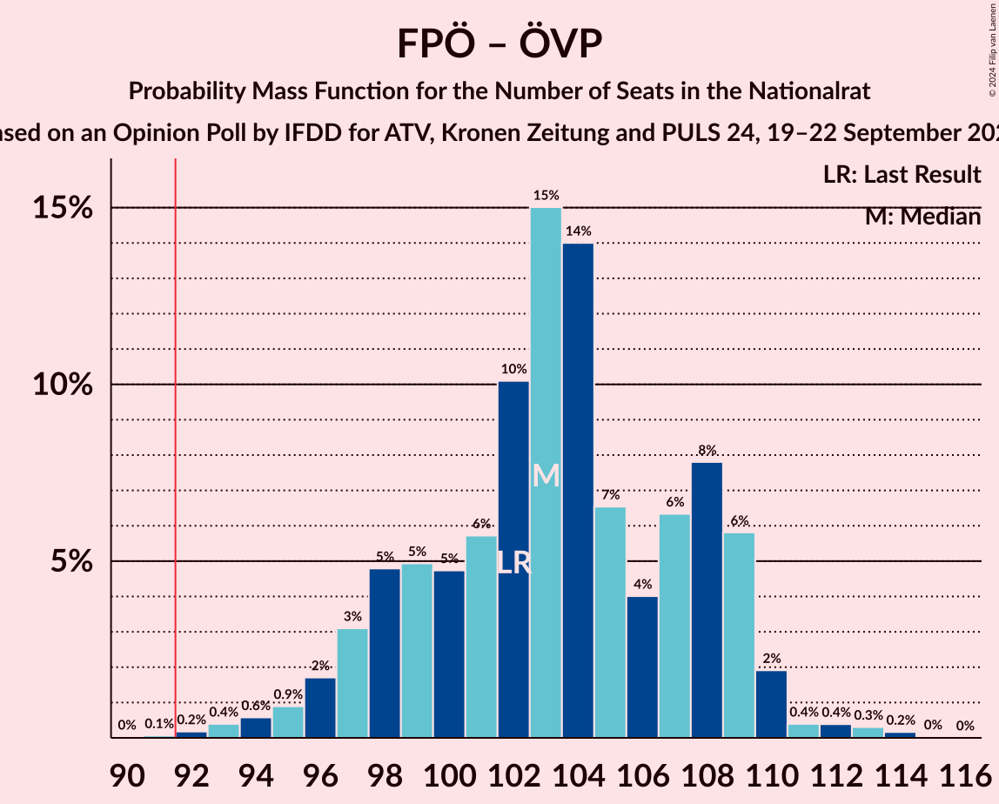

| Number of Seats | Probability | Accumulated | Special Marks |
|:---------------:|:-----------:|:-----------:|:-------------:|
| 91 | 0.1% | 100% |  |
| 92 | 0.2% | 99.9% | Majority |
| 93 | 0.4% | 99.7% |  |
| 94 | 0.6% | 99.3% |  |
| 95 | 0.9% | 98.7% |  |
| 96 | 2% | 98% |  |
| 97 | 3% | 96% |  |
| 98 | 5% | 93% |  |
| 99 | 5% | 88% |  |
| 100 | 5% | 83% |  |
| 101 | 6% | 79% |  |
| 102 | 10% | 73% | Last Result |
| 103 | 15% | 63% |  |
| 104 | 14% | 48% | Median |
| 105 | 7% | 34% |  |
| 106 | 4% | 27% |  |
| 107 | 6% | 23% |  |
| 108 | 8% | 17% |  |
| 109 | 6% | 9% |  |
| 110 | 2% | 3% |  |
| 111 | 0.4% | 1.3% |  |
| 112 | 0.4% | 0.9% |  |
| 113 | 0.3% | 0.5% |  |
| 114 | 0.2% | 0.2% |  |
| 115 | 0% | 0% |  |

### Freiheitliche Partei Österreichs – Sozialdemokratische Partei Österreichs

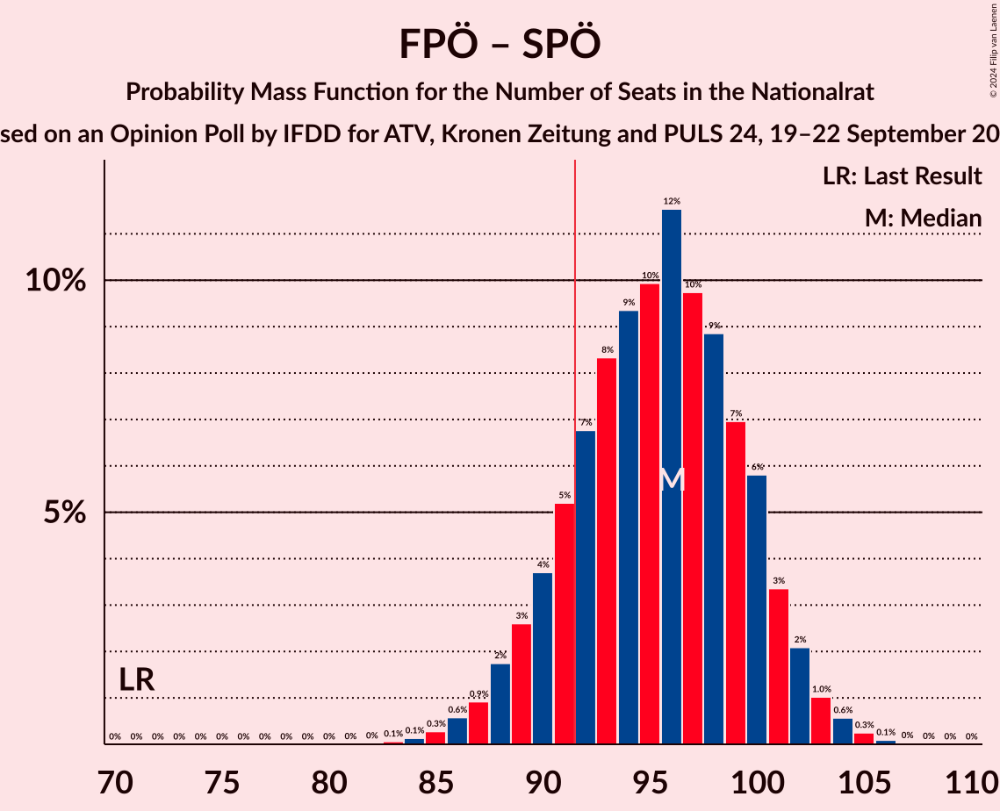

| Number of Seats | Probability | Accumulated | Special Marks |
|:---------------:|:-----------:|:-----------:|:-------------:|
| 71 | 0% | 100% | Last Result |
| 72 | 0% | 100% |  |
| 73 | 0% | 100% |  |
| 74 | 0% | 100% |  |
| 75 | 0% | 100% |  |
| 76 | 0% | 100% |  |
| 77 | 0% | 100% |  |
| 78 | 0% | 100% |  |
| 79 | 0% | 100% |  |
| 80 | 0% | 100% |  |
| 81 | 0% | 100% |  |
| 82 | 0% | 100% |  |
| 83 | 0.1% | 100% |  |
| 84 | 0.1% | 99.9% |  |
| 85 | 0.3% | 99.8% |  |
| 86 | 0.6% | 99.5% |  |
| 87 | 0.9% | 98.9% |  |
| 88 | 2% | 98% |  |
| 89 | 3% | 96% |  |
| 90 | 4% | 94% |  |
| 91 | 5% | 90% |  |
| 92 | 7% | 85% | Majority |
| 93 | 8% | 78% |  |
| 94 | 9% | 70% |  |
| 95 | 10% | 60% |  |
| 96 | 12% | 50% | Median |
| 97 | 10% | 39% |  |
| 98 | 9% | 29% |  |
| 99 | 7% | 20% |  |
| 100 | 6% | 13% |  |
| 101 | 3% | 7% |  |
| 102 | 2% | 4% |  |
| 103 | 1.0% | 2% |  |
| 104 | 0.6% | 1.0% |  |
| 105 | 0.3% | 0.4% |  |
| 106 | 0.1% | 0.1% |  |
| 107 | 0% | 0% |  |

### Österreichische Volkspartei – Sozialdemokratische Partei Österreichs

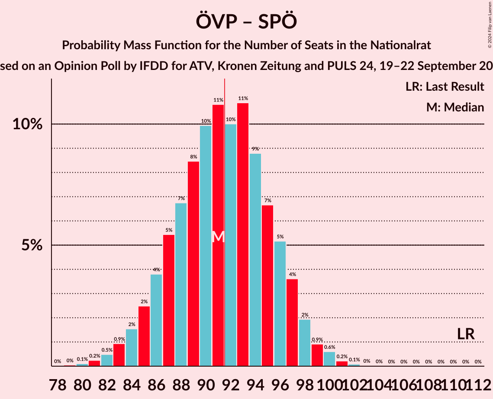

| Number of Seats | Probability | Accumulated | Special Marks |
|:---------------:|:-----------:|:-----------:|:-------------:|
| 79 | 0% | 100% |  |
| 80 | 0.1% | 99.9% |  |
| 81 | 0.2% | 99.8% |  |
| 82 | 0.5% | 99.6% |  |
| 83 | 0.9% | 99.1% |  |
| 84 | 2% | 98% |  |
| 85 | 2% | 97% |  |
| 86 | 4% | 94% |  |
| 87 | 5% | 90% |  |
| 88 | 7% | 85% |  |
| 89 | 8% | 78% |  |
| 90 | 10% | 70% |  |
| 91 | 11% | 60% |  |
| 92 | 10% | 49% | Median, Majority |
| 93 | 11% | 39% |  |
| 94 | 9% | 28% |  |
| 95 | 7% | 19% |  |
| 96 | 5% | 13% |  |
| 97 | 4% | 7% |  |
| 98 | 2% | 4% |  |
| 99 | 0.9% | 2% |  |
| 100 | 0.6% | 0.9% |  |
| 101 | 0.2% | 0.3% |  |
| 102 | 0.1% | 0.1% |  |
| 103 | 0% | 0% |  |
| 104 | 0% | 0% |  |
| 105 | 0% | 0% |  |
| 106 | 0% | 0% |  |
| 107 | 0% | 0% |  |
| 108 | 0% | 0% |  |
| 109 | 0% | 0% |  |
| 110 | 0% | 0% |  |
| 111 | 0% | 0% | Last Result |

### Österreichische Volkspartei – Die Grünen–Die Grüne Alternative – NEOS–Das Neue Österreich und Liberales Forum

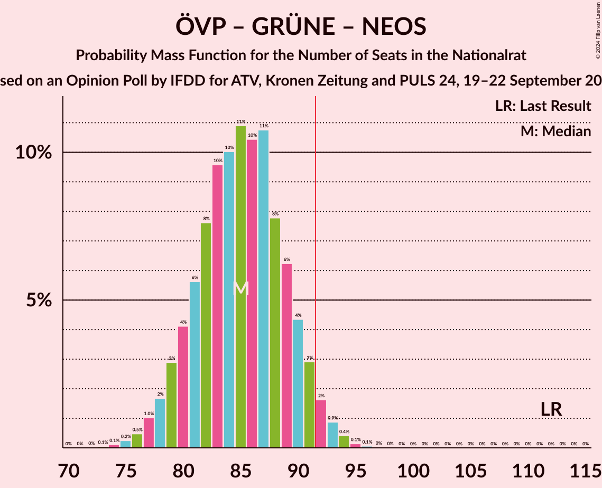

| Number of Seats | Probability | Accumulated | Special Marks |
|:---------------:|:-----------:|:-----------:|:-------------:|
| 73 | 0.1% | 100% |  |
| 74 | 0.1% | 99.9% |  |
| 75 | 0.2% | 99.8% |  |
| 76 | 0.5% | 99.6% |  |
| 77 | 1.0% | 99.1% |  |
| 78 | 2% | 98% |  |
| 79 | 3% | 96% |  |
| 80 | 4% | 93% |  |
| 81 | 6% | 89% |  |
| 82 | 8% | 84% |  |
| 83 | 10% | 76% |  |
| 84 | 10% | 67% |  |
| 85 | 11% | 57% |  |
| 86 | 10% | 46% | Median |
| 87 | 11% | 35% |  |
| 88 | 8% | 24% |  |
| 89 | 6% | 17% |  |
| 90 | 4% | 10% |  |
| 91 | 3% | 6% |  |
| 92 | 2% | 3% | Majority |
| 93 | 0.9% | 2% |  |
| 94 | 0.4% | 0.6% |  |
| 95 | 0.1% | 0.2% |  |
| 96 | 0.1% | 0.1% |  |
| 97 | 0% | 0% |  |
| 98 | 0% | 0% |  |
| 99 | 0% | 0% |  |
| 100 | 0% | 0% |  |
| 101 | 0% | 0% |  |
| 102 | 0% | 0% |  |
| 103 | 0% | 0% |  |
| 104 | 0% | 0% |  |
| 105 | 0% | 0% |  |
| 106 | 0% | 0% |  |
| 107 | 0% | 0% |  |
| 108 | 0% | 0% |  |
| 109 | 0% | 0% |  |
| 110 | 0% | 0% |  |
| 111 | 0% | 0% |  |
| 112 | 0% | 0% | Last Result |

### Sozialdemokratische Partei Österreichs – Die Grünen–Die Grüne Alternative – NEOS–Das Neue Österreich und Liberales Forum

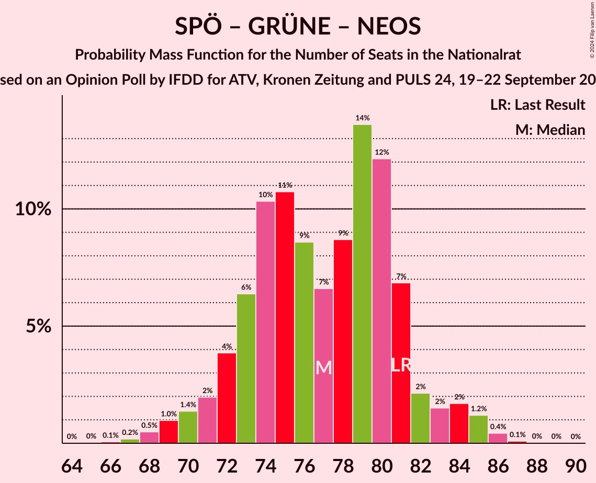

| Number of Seats | Probability | Accumulated | Special Marks |
|:---------------:|:-----------:|:-----------:|:-------------:|
| 66 | 0.1% | 100% |  |
| 67 | 0.2% | 99.9% |  |
| 68 | 0.5% | 99.7% |  |
| 69 | 1.0% | 99.2% |  |
| 70 | 1.4% | 98% |  |
| 71 | 2% | 97% |  |
| 72 | 4% | 95% |  |
| 73 | 6% | 91% |  |
| 74 | 10% | 85% |  |
| 75 | 11% | 74% |  |
| 76 | 9% | 64% |  |
| 77 | 7% | 55% |  |
| 78 | 9% | 48% | Median |
| 79 | 14% | 40% |  |
| 80 | 12% | 26% |  |
| 81 | 7% | 14% | Last Result |
| 82 | 2% | 7% |  |
| 83 | 2% | 5% |  |
| 84 | 2% | 3% |  |
| 85 | 1.2% | 2% |  |
| 86 | 0.4% | 0.6% |  |
| 87 | 0.1% | 0.1% |  |
| 88 | 0% | 0.1% |  |
| 89 | 0% | 0% |  |

### Österreichische Volkspartei – Die Grünen–Die Grüne Alternative

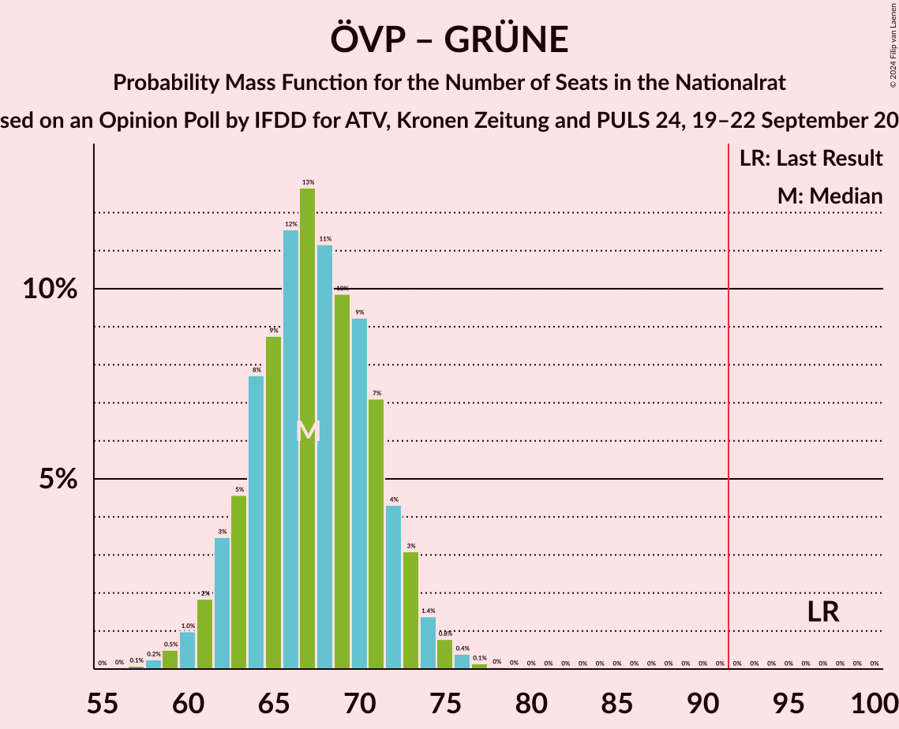

| Number of Seats | Probability | Accumulated | Special Marks |
|:---------------:|:-----------:|:-----------:|:-------------:|
| 57 | 0.1% | 100% |  |
| 58 | 0.2% | 99.9% |  |
| 59 | 0.5% | 99.6% |  |
| 60 | 1.0% | 99.1% |  |
| 61 | 2% | 98% |  |
| 62 | 3% | 96% |  |
| 63 | 5% | 93% |  |
| 64 | 8% | 88% |  |
| 65 | 9% | 81% |  |
| 66 | 12% | 72% |  |
| 67 | 13% | 60% |  |
| 68 | 11% | 48% | Median |
| 69 | 10% | 36% |  |
| 70 | 9% | 27% |  |
| 71 | 7% | 17% |  |
| 72 | 4% | 10% |  |
| 73 | 3% | 6% |  |
| 74 | 1.4% | 3% |  |
| 75 | 0.8% | 1.4% |  |
| 76 | 0.4% | 0.6% |  |
| 77 | 0.1% | 0.2% |  |
| 78 | 0% | 0.1% |  |
| 79 | 0% | 0% |  |
| 80 | 0% | 0% |  |
| 81 | 0% | 0% |  |
| 82 | 0% | 0% |  |
| 83 | 0% | 0% |  |
| 84 | 0% | 0% |  |
| 85 | 0% | 0% |  |
| 86 | 0% | 0% |  |
| 87 | 0% | 0% |  |
| 88 | 0% | 0% |  |
| 89 | 0% | 0% |  |
| 90 | 0% | 0% |  |
| 91 | 0% | 0% |  |
| 92 | 0% | 0% | Majority |
| 93 | 0% | 0% |  |
| 94 | 0% | 0% |  |
| 95 | 0% | 0% |  |
| 96 | 0% | 0% |  |
| 97 | 0% | 0% | Last Result |

### Österreichische Volkspartei – NEOS–Das Neue Österreich und Liberales Forum

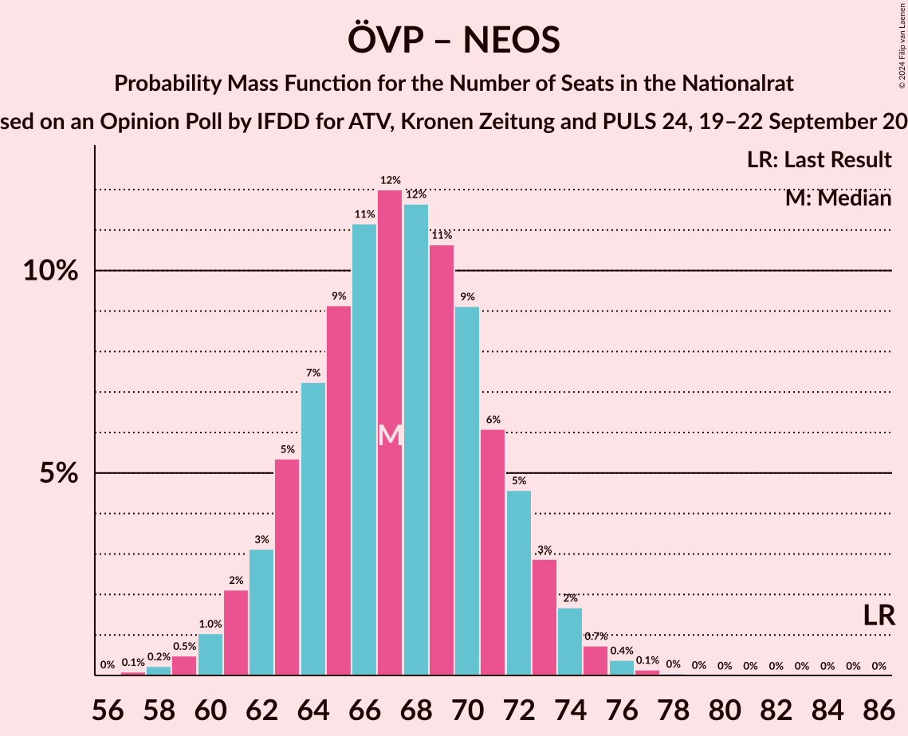

| Number of Seats | Probability | Accumulated | Special Marks |
|:---------------:|:-----------:|:-----------:|:-------------:|
| 57 | 0.1% | 100% |  |
| 58 | 0.2% | 99.9% |  |
| 59 | 0.5% | 99.6% |  |
| 60 | 1.0% | 99.1% |  |
| 61 | 2% | 98% |  |
| 62 | 3% | 96% |  |
| 63 | 5% | 93% |  |
| 64 | 7% | 88% |  |
| 65 | 9% | 80% |  |
| 66 | 11% | 71% |  |
| 67 | 12% | 60% |  |
| 68 | 12% | 48% | Median |
| 69 | 11% | 36% |  |
| 70 | 9% | 26% |  |
| 71 | 6% | 17% |  |
| 72 | 5% | 10% |  |
| 73 | 3% | 6% |  |
| 74 | 2% | 3% |  |
| 75 | 0.7% | 1.3% |  |
| 76 | 0.4% | 0.6% |  |
| 77 | 0.1% | 0.2% |  |
| 78 | 0% | 0.1% |  |
| 79 | 0% | 0% |  |
| 80 | 0% | 0% |  |
| 81 | 0% | 0% |  |
| 82 | 0% | 0% |  |
| 83 | 0% | 0% |  |
| 84 | 0% | 0% |  |
| 85 | 0% | 0% |  |
| 86 | 0% | 0% | Last Result |

### Sozialdemokratische Partei Österreichs – Die Grünen–Die Grüne Alternative

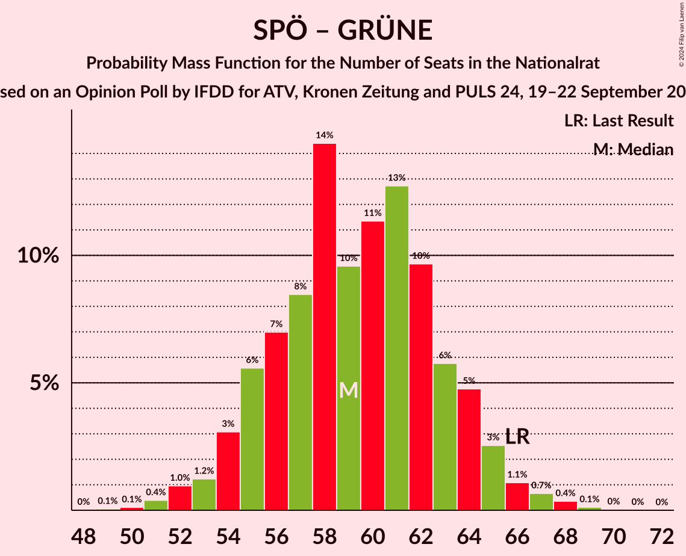

| Number of Seats | Probability | Accumulated | Special Marks |
|:---------------:|:-----------:|:-----------:|:-------------:|
| 49 | 0.1% | 100% |  |
| 50 | 0.1% | 99.9% |  |
| 51 | 0.4% | 99.8% |  |
| 52 | 1.0% | 99.4% |  |
| 53 | 1.2% | 98% |  |
| 54 | 3% | 97% |  |
| 55 | 6% | 94% |  |
| 56 | 7% | 89% |  |
| 57 | 8% | 82% |  |
| 58 | 14% | 73% |  |
| 59 | 10% | 59% |  |
| 60 | 11% | 49% | Median |
| 61 | 13% | 38% |  |
| 62 | 10% | 25% |  |
| 63 | 6% | 15% |  |
| 64 | 5% | 10% |  |
| 65 | 3% | 5% |  |
| 66 | 1.1% | 2% | Last Result |
| 67 | 0.7% | 1.2% |  |
| 68 | 0.4% | 0.5% |  |
| 69 | 0.1% | 0.2% |  |
| 70 | 0% | 0.1% |  |
| 71 | 0% | 0% |  |

### Österreichische Volkspartei

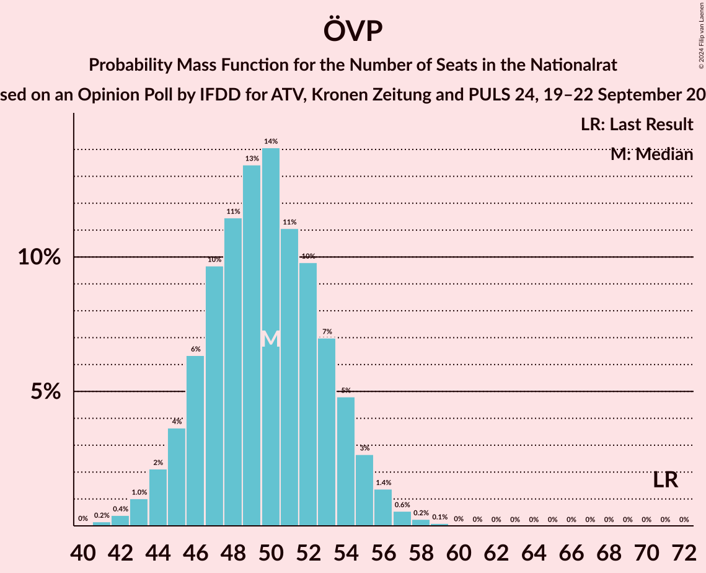

| Number of Seats | Probability | Accumulated | Special Marks |
|:---------------:|:-----------:|:-----------:|:-------------:|
| 40 | 0% | 100% |  |
| 41 | 0.2% | 99.9% |  |
| 42 | 0.4% | 99.8% |  |
| 43 | 1.0% | 99.4% |  |
| 44 | 2% | 98% |  |
| 45 | 4% | 96% |  |
| 46 | 6% | 93% |  |
| 47 | 10% | 86% |  |
| 48 | 11% | 77% |  |
| 49 | 13% | 65% |  |
| 50 | 14% | 52% | Median |
| 51 | 11% | 38% |  |
| 52 | 10% | 27% |  |
| 53 | 7% | 17% |  |
| 54 | 5% | 10% |  |
| 55 | 3% | 5% |  |
| 56 | 1.4% | 2% |  |
| 57 | 0.6% | 0.9% |  |
| 58 | 0.2% | 0.4% |  |
| 59 | 0.1% | 0.1% |  |
| 60 | 0% | 0% |  |
| 61 | 0% | 0% |  |
| 62 | 0% | 0% |  |
| 63 | 0% | 0% |  |
| 64 | 0% | 0% |  |
| 65 | 0% | 0% |  |
| 66 | 0% | 0% |  |
| 67 | 0% | 0% |  |
| 68 | 0% | 0% |  |
| 69 | 0% | 0% |  |
| 70 | 0% | 0% |  |
| 71 | 0% | 0% | Last Result |

### Sozialdemokratische Partei Österreichs

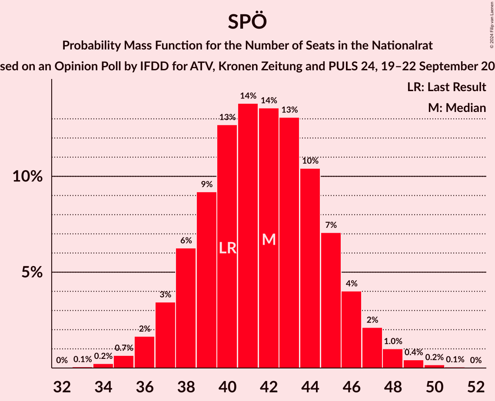

| Number of Seats | Probability | Accumulated | Special Marks |
|:---------------:|:-----------:|:-----------:|:-------------:|
| 33 | 0.1% | 100% |  |
| 34 | 0.2% | 99.9% |  |
| 35 | 0.7% | 99.7% |  |
| 36 | 2% | 99.0% |  |
| 37 | 3% | 97% |  |
| 38 | 6% | 94% |  |
| 39 | 9% | 88% |  |
| 40 | 13% | 78% | Last Result |
| 41 | 14% | 66% |  |
| 42 | 14% | 52% | Median |
| 43 | 13% | 38% |  |
| 44 | 10% | 25% |  |
| 45 | 7% | 15% |  |
| 46 | 4% | 8% |  |
| 47 | 2% | 4% |  |
| 48 | 1.0% | 2% |  |
| 49 | 0.4% | 0.7% |  |
| 50 | 0.2% | 0.2% |  |
| 51 | 0.1% | 0.1% |  |
| 52 | 0% | 0% |  |

## Technical Information

### Opinion Poll

+ **Polling firm:** IFDD
+ **Commissioner(s):** ATV, Kronen Zeitung and PULS 24
+ **Fieldwork period:** 19–22 September 2024

### Calculations

+ **Sample size:** 1000
+ **Simulations done:** 2,097,152
+ **Error estimate:** 0.62%

