# Poll Average

<a href="#voting-intentions">Voting Intentions</a> | <a href="#seats">Seats</a> | <a href="#coalitions">Coalitions</a> | <a href="#technical-information">Technical Information</a>

## Summary

The table below lists the polls on which the average is based. They are the most recent polls (less than 90 days old) registered and analyzed so far.

| Period     | Polling firm/Commissioner(s) | ÖVP | SPÖ | FPÖ | NEOS | JETZT | GRÜNE | G!LT |
|:----------:|:----------------------------:|:--:|:--:|:--:|:--:|:--:|:--:|:--:|
| 15 October 2017 | General Election | 31.5%   62 | 26.9%   52 | 26.0%   51 | 5.3%   10 | 4.4%   8 | 3.8%   0 | 1.0%   0 |
| N/A | Poll Average | 34–41%   63–76 | 18–24%   33–45 | 16–23%   31–43 | 6–12%   11–21 | 0–2%   0 | 9–14%   17–25 | N/A   N/A |
| [5–17 July 2019](2019-07-17-ResearchAffairs.html) | Research Affairs   ÖSTERREICH | 34–40%   68–71 | 19–25%   39–47 | 17–22%   31–41 | 6–9%   11–14 | 1–2%   0 | 10–14%   18–24 | N/A   N/A |
| [8–12 July 2019](2019-07-12-UniqueResearch.html) | Unique Research   profil | 34–40%   63–76 | 17–23%   32–43 | 18–24%   34–45 | 7–11%   13–21 | 1–2%   0 | 9–13%   17–25 | N/A   N/A |
| [8–9 July 2019](2019-07-09-Market.html) | Market   Der Standard | 33–39%   61–74 | 18–24%   34–44 | 17–23%   32–43 | 8–12%   15–23 | 1–2%   0 | 9–13%   17–25 | N/A   N/A |
| [24–28 June 2019](2019-06-28-PeterHajek.html) | Peter Hajek   ATV | 35–41%   65–78 | 17–23%   32–43 | 17–23%   32–43 | 7–11%   13–21 | 1–2%   0 | 9–13%   17–25 | N/A   N/A |
| [31 May–10 June 2019](2019-06-10-SORA.html) | SORA   ORF | 35–41%   67–77 | 19–24%   35–44 | 16–20%   30–38 | 7–10%   12–18 | 1–2%   0 | 10–14%   19–26 | N/A   N/A |
| 15 October 2017 | General Election | 31.5%   62 | 26.9%   52 | 26.0%   51 | 5.3%   10 | 4.4%   8 | 3.8%   0 | 1.0%   0 |

Only polls for which at least the sample size has been published are included in the table above.

**Legend:**
+ **Top half of each row:** Voting intentions (95% confidence interval)
+ **Bottom half of each row:** Seat projections for the Nationalrat (95% confidence interval)
+ **ÖVP:** Österreichische Volkspartei
+ **SPÖ:** Sozialdemokratische Partei Österreichs
+ **FPÖ:** Freiheitliche Partei Österreichs
+ **NEOS:** NEOS–Das Neue Österreich und Liberales Forum
+ **JETZT:** JETZT–Liste Pilz
+ **GRÜNE:** Die Grünen–Die Grüne Alternative
+ **G!LT:** Meine Stimme G!LT
+ **N/A (single party):** Party not included the published results
+ **N/A (entire row):** Calculation for this opinion poll not started yet

## Voting Intentions

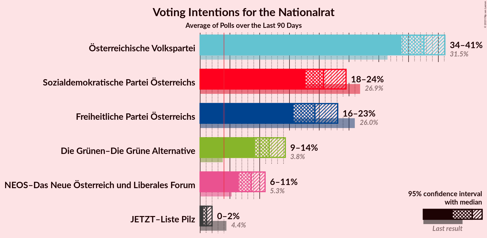

### Confidence Intervals

| Party | Last Result | Median | 80% Confidence Interval | 90% Confidence Interval | 95% Confidence Interval | 99% Confidence Interval |
|:-----:|:-----------:|:------:|:-----------------------:|:-----------------------:|:-----------------------:|:-----------------------:|
| <a href="#österreichische-volkspartei">Österreichische Volkspartei</a> | 31.5% | 37.3% | 35.0–39.5% |34.3–40.2% | 33.7–40.7% | 32.6–41.8% |
| <a href="#sozialdemokratische-partei-österreichs">Sozialdemokratische Partei Österreichs</a> | 26.9% | 20.8% | 18.9–22.8% |18.3–23.4% | 17.9–23.9% | 17.0–24.8% |
| <a href="#freiheitliche-partei-österreichs">Freiheitliche Partei Österreichs</a> | 26.0% | 19.6% | 17.5–21.9% |17.0–22.5% | 16.5–23.1% | 15.8–24.1% |
| <a href="#neos–das-neue-österreich-und-liberales-forum">NEOS–Das Neue Österreich und Liberales Forum</a> | 5.3% | 8.7% | 6.9–10.6% |6.5–11.1% | 6.1–11.5% | 5.6–12.4% |
| <a href="#jetzt–liste-pilz">JETZT–Liste Pilz</a> | 4.4% | 1.1% | 0.7–1.6% |0.6–1.7% | 0.5–1.9% | 0.4–2.2% |
| <a href="#die-grünen–die-grüne-alternative">Die Grünen–Die Grüne Alternative</a> | 3.8% | 11.5% | 10.0–13.0% |9.6–13.4% | 9.2–13.8% | 8.6–14.5% |
| <a href="#meine-stimme-g!lt">Meine Stimme G!LT</a> | 1.0% | N/A | N/A |N/A | N/A | N/A |

### Österreichische Volkspartei

*For a full overview of the results for this party, see the [Österreichische Volkspartei](party-österreichischevolkspartei.html) page.*

| Voting Intentions | Probability | Accumulated | Special Marks |
|:-----------------:|:-----------:|:-----------:|:-------------:|
| 29.5–30.5% | 0% | 100% |  |
| 30.5–31.5% | 0.1% | 100% | Last Result |
| 31.5–32.5% | 0.4% | 99.9% |  |
| 32.5–33.5% | 2% | 99.5% |  |
| 33.5–34.5% | 5% | 98% |  |
| 34.5–35.5% | 10% | 93% |  |
| 35.5–36.5% | 18% | 83% |  |
| 36.5–37.5% | 22% | 66% | Median |
| 37.5–38.5% | 20% | 43% |  |
| 38.5–39.5% | 14% | 23% |  |
| 39.5–40.5% | 7% | 10% |  |
| 40.5–41.5% | 2% | 3% |  |
| 41.5–42.5% | 0.6% | 0.7% |  |
| 42.5–43.5% | 0.1% | 0.1% |  |
| 43.5–44.5% | 0% | 0% |  |

### Sozialdemokratische Partei Österreichs

*For a full overview of the results for this party, see the [Sozialdemokratische Partei Österreichs](party-sozialdemokratischeparteiösterreichs.html) page.*

| Voting Intentions | Probability | Accumulated | Special Marks |
|:-----------------:|:-----------:|:-----------:|:-------------:|
| 14.5–15.5% | 0% | 100% |  |
| 15.5–16.5% | 0.2% | 100% |  |
| 16.5–17.5% | 1.3% | 99.8% |  |
| 17.5–18.5% | 5% | 98.5% |  |
| 18.5–19.5% | 13% | 93% |  |
| 19.5–20.5% | 22% | 80% |  |
| 20.5–21.5% | 25% | 58% | Median |
| 21.5–22.5% | 19% | 33% |  |
| 22.5–23.5% | 9% | 14% |  |
| 23.5–24.5% | 3% | 4% |  |
| 24.5–25.5% | 0.7% | 0.8% |  |
| 25.5–26.5% | 0.1% | 0.1% |  |
| 26.5–27.5% | 0% | 0% | Last Result |

### Freiheitliche Partei Österreichs

*For a full overview of the results for this party, see the [Freiheitliche Partei Österreichs](party-freiheitlicheparteiösterreichs.html) page.*

| Voting Intentions | Probability | Accumulated | Special Marks |
|:-----------------:|:-----------:|:-----------:|:-------------:|
| 13.5–14.5% | 0% | 100% |  |
| 14.5–15.5% | 0.3% | 100% |  |
| 15.5–16.5% | 2% | 99.7% |  |
| 16.5–17.5% | 8% | 97% |  |
| 17.5–18.5% | 16% | 90% |  |
| 18.5–19.5% | 22% | 73% |  |
| 19.5–20.5% | 21% | 51% | Median |
| 20.5–21.5% | 16% | 30% |  |
| 21.5–22.5% | 9% | 14% |  |
| 22.5–23.5% | 3% | 5% |  |
| 23.5–24.5% | 1.0% | 1.2% |  |
| 24.5–25.5% | 0.2% | 0.2% |  |
| 25.5–26.5% | 0% | 0% | Last Result |

### NEOS–Das Neue Österreich und Liberales Forum

*For a full overview of the results for this party, see the [NEOS–Das Neue Österreich und Liberales Forum](party-neos–dasneueösterreichundliberalesforum.html) page.*

| Voting Intentions | Probability | Accumulated | Special Marks |
|:-----------------:|:-----------:|:-----------:|:-------------:|
| 3.5–4.5% | 0% | 100% |  |
| 4.5–5.5% | 0.5% | 100% | Last Result |
| 5.5–6.5% | 6% | 99.5% |  |
| 6.5–7.5% | 16% | 94% |  |
| 7.5–8.5% | 25% | 78% |  |
| 8.5–9.5% | 25% | 53% | Median |
| 9.5–10.5% | 17% | 28% |  |
| 10.5–11.5% | 8% | 10% |  |
| 11.5–12.5% | 2% | 2% |  |
| 12.5–13.5% | 0.3% | 0.3% |  |
| 13.5–14.5% | 0% | 0% |  |

### JETZT–Liste Pilz

*For a full overview of the results for this party, see the [JETZT–Liste Pilz](party-jetzt–listepilz.html) page.*

| Voting Intentions | Probability | Accumulated | Special Marks |
|:-----------------:|:-----------:|:-----------:|:-------------:|
| 0.0–0.5% | 3% | 100% |  |
| 0.5–1.5% | 86% | 97% | Median |
| 1.5–2.5% | 11% | 11% |  |
| 2.5–3.5% | 0.1% | 0.1% |  |
| 3.5–4.5% | 0% | 0% | Last Result |

### Die Grünen–Die Grüne Alternative

*For a full overview of the results for this party, see the [Die Grünen–Die Grüne Alternative](party-diegrünen–diegrünealternative.html) page.*

| Voting Intentions | Probability | Accumulated | Special Marks |
|:-----------------:|:-----------:|:-----------:|:-------------:|
| 3.5–4.5% | 0% | 100% | Last Result |
| 4.5–5.5% | 0% | 100% |  |
| 5.5–6.5% | 0% | 100% |  |
| 6.5–7.5% | 0% | 100% |  |
| 7.5–8.5% | 0.4% | 100% |  |
| 8.5–9.5% | 4% | 99.6% |  |
| 9.5–10.5% | 17% | 95% |  |
| 10.5–11.5% | 31% | 79% | Median |
| 11.5–12.5% | 29% | 48% |  |
| 12.5–13.5% | 15% | 19% |  |
| 13.5–14.5% | 4% | 4% |  |
| 14.5–15.5% | 0.4% | 0.5% |  |
| 15.5–16.5% | 0% | 0% |  |

## Seats

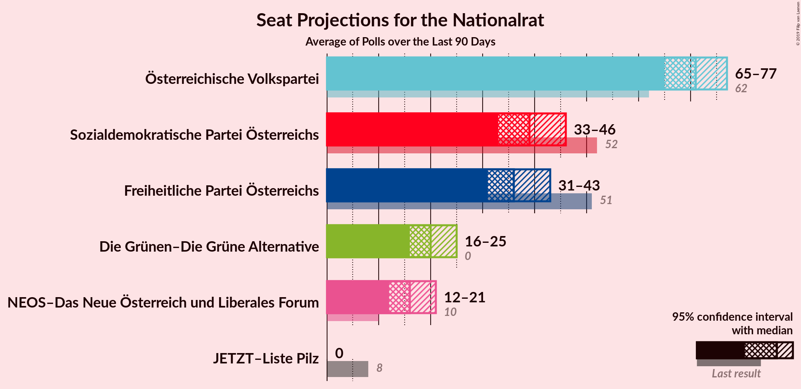

### Confidence Intervals

| Party | Last Result | Median | 80% Confidence Interval | 90% Confidence Interval | 95% Confidence Interval | 99% Confidence Interval |
|:-----:|:-----------:|:------:|:-----------------------:|:-----------------------:|:-----------------------:|:-----------------------:|
| <a href="#österreichische-volkspartei">Österreichische Volkspartei</a> | 62 | 69 | 66–74 |64–75 | 63–76 | 61–79 |
| <a href="#sozialdemokratische-partei-österreichs">Sozialdemokratische Partei Österreichs</a> | 52 | 39 | 35–45 |34–45 | 33–45 | 32–47 |
| <a href="#freiheitliche-partei-österreichs">Freiheitliche Partei Österreichs</a> | 51 | 37 | 33–41 |32–42 | 31–43 | 30–45 |
| <a href="#neos–das-neue-österreich-und-liberales-forum">NEOS–Das Neue Österreich und Liberales Forum</a> | 10 | 16 | 12–19 |11–20 | 11–21 | 11–23 |
| <a href="#jetzt–liste-pilz">JETZT–Liste Pilz</a> | 8 | 0 | 0 |0 | 0 | 0 |
| <a href="#die-grünen–die-grüne-alternative">Die Grünen–Die Grüne Alternative</a> | 0 | 21 | 18–24 |18–24 | 17–25 | 16–27 |
| <a href="#meine-stimme-g!lt">Meine Stimme G!LT</a> | 0 | N/A | N/A |N/A | N/A | N/A |

### Österreichische Volkspartei

*For a full overview of the results for this party, see the [Österreichische Volkspartei](party-österreichischevolkspartei.html) page.*

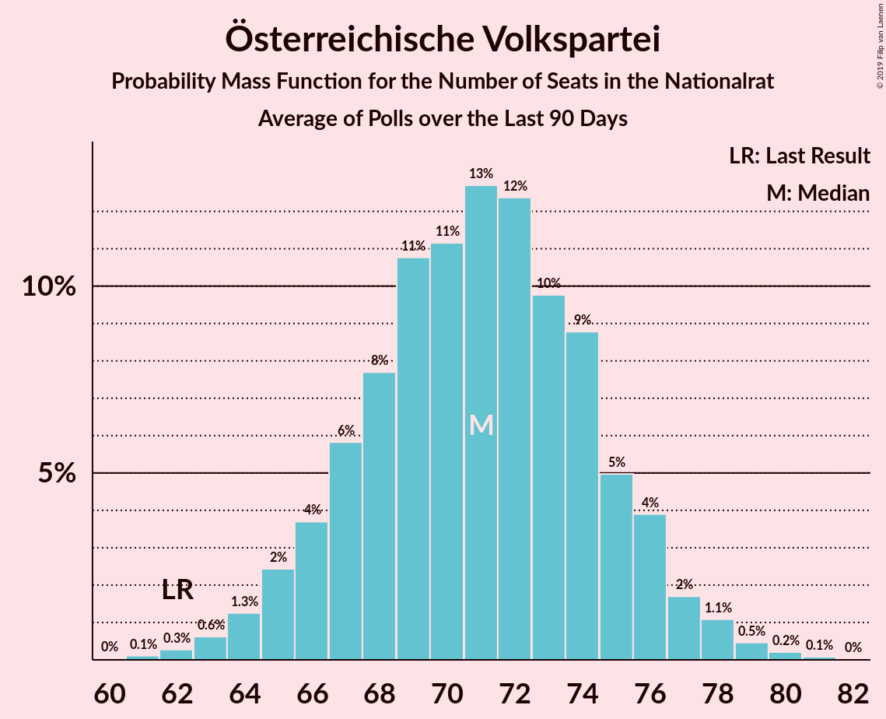

| Number of Seats | Probability | Accumulated | Special Marks |
|:---------------:|:-----------:|:-----------:|:-------------:|
| 59 | 0.1% | 100% |  |
| 60 | 0.2% | 99.9% |  |
| 61 | 0.4% | 99.7% |  |
| 62 | 0.8% | 99.3% | Last Result |
| 63 | 1.5% | 98% |  |
| 64 | 2% | 97% |  |
| 65 | 3% | 95% |  |
| 66 | 4% | 92% |  |
| 67 | 7% | 87% |  |
| 68 | 8% | 81% |  |
| 69 | 23% | 73% | Median |
| 70 | 11% | 50% |  |
| 71 | 10% | 38% |  |
| 72 | 8% | 28% |  |
| 73 | 7% | 20% |  |
| 74 | 6% | 14% |  |
| 75 | 3% | 8% |  |
| 76 | 2% | 5% |  |
| 77 | 1.0% | 2% |  |
| 78 | 0.7% | 1.4% |  |
| 79 | 0.3% | 0.7% |  |
| 80 | 0.2% | 0.3% |  |
| 81 | 0.1% | 0.1% |  |
| 82 | 0% | 0% |  |

### Sozialdemokratische Partei Österreichs

*For a full overview of the results for this party, see the [Sozialdemokratische Partei Österreichs](party-sozialdemokratischeparteiösterreichs.html) page.*

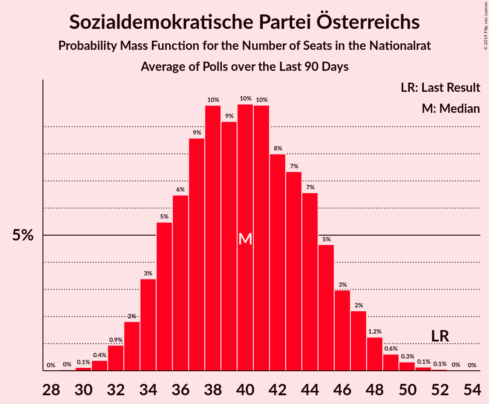

| Number of Seats | Probability | Accumulated | Special Marks |
|:---------------:|:-----------:|:-----------:|:-------------:|
| 30 | 0.1% | 100% |  |
| 31 | 0.3% | 99.9% |  |
| 32 | 0.9% | 99.5% |  |
| 33 | 2% | 98.6% |  |
| 34 | 3% | 97% |  |
| 35 | 6% | 93% |  |
| 36 | 8% | 88% |  |
| 37 | 10% | 80% |  |
| 38 | 12% | 70% |  |
| 39 | 11% | 58% | Median |
| 40 | 18% | 47% |  |
| 41 | 7% | 30% |  |
| 42 | 5% | 22% |  |
| 43 | 5% | 17% |  |
| 44 | 2% | 12% |  |
| 45 | 9% | 10% |  |
| 46 | 0.3% | 1.1% |  |
| 47 | 0.7% | 0.8% |  |
| 48 | 0% | 0.1% |  |
| 49 | 0% | 0% |  |
| 50 | 0% | 0% |  |
| 51 | 0% | 0% |  |
| 52 | 0% | 0% | Last Result |

### Freiheitliche Partei Österreichs

*For a full overview of the results for this party, see the [Freiheitliche Partei Österreichs](party-freiheitlicheparteiösterreichs.html) page.*

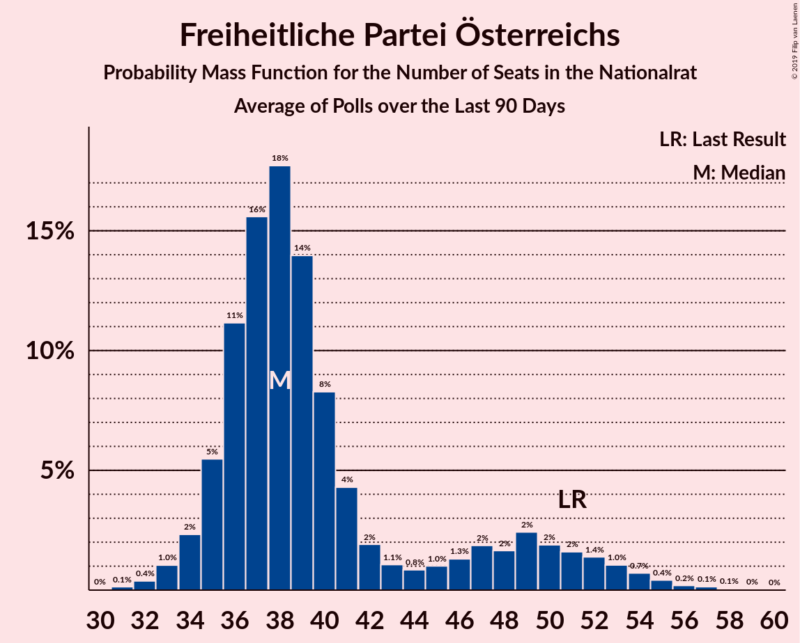

| Number of Seats | Probability | Accumulated | Special Marks |
|:---------------:|:-----------:|:-----------:|:-------------:|
| 28 | 0.1% | 100% |  |
| 29 | 0.3% | 99.9% |  |
| 30 | 0.9% | 99.6% |  |
| 31 | 3% | 98.6% |  |
| 32 | 4% | 96% |  |
| 33 | 5% | 93% |  |
| 34 | 15% | 87% |  |
| 35 | 8% | 72% |  |
| 36 | 9% | 64% |  |
| 37 | 12% | 54% | Median |
| 38 | 16% | 42% |  |
| 39 | 8% | 27% |  |
| 40 | 6% | 18% |  |
| 41 | 6% | 12% |  |
| 42 | 3% | 7% |  |
| 43 | 2% | 3% |  |
| 44 | 0.8% | 2% |  |
| 45 | 0.5% | 0.8% |  |
| 46 | 0.2% | 0.3% |  |
| 47 | 0.1% | 0.1% |  |
| 48 | 0% | 0% |  |
| 49 | 0% | 0% |  |
| 50 | 0% | 0% |  |
| 51 | 0% | 0% | Last Result |

### NEOS–Das Neue Österreich und Liberales Forum

*For a full overview of the results for this party, see the [NEOS–Das Neue Österreich und Liberales Forum](party-neos–dasneueösterreichundliberalesforum.html) page.*

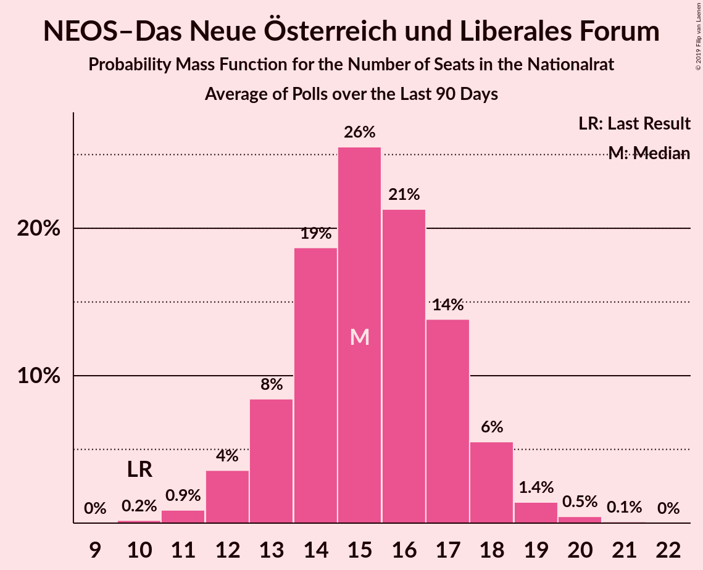

| Number of Seats | Probability | Accumulated | Special Marks |
|:---------------:|:-----------:|:-----------:|:-------------:|
| 10 | 0.2% | 100% | Last Result |
| 11 | 9% | 99.8% |  |
| 12 | 1.4% | 91% |  |
| 13 | 12% | 90% |  |
| 14 | 11% | 77% |  |
| 15 | 12% | 66% |  |
| 16 | 14% | 55% | Median |
| 17 | 13% | 41% |  |
| 18 | 10% | 28% |  |
| 19 | 8% | 17% |  |
| 20 | 5% | 10% |  |
| 21 | 3% | 4% |  |
| 22 | 1.2% | 2% |  |
| 23 | 0.5% | 0.7% |  |
| 24 | 0.2% | 0.2% |  |
| 25 | 0% | 0.1% |  |
| 26 | 0% | 0% |  |

### JETZT–Liste Pilz

*For a full overview of the results for this party, see the [JETZT–Liste Pilz](party-jetzt–listepilz.html) page.*

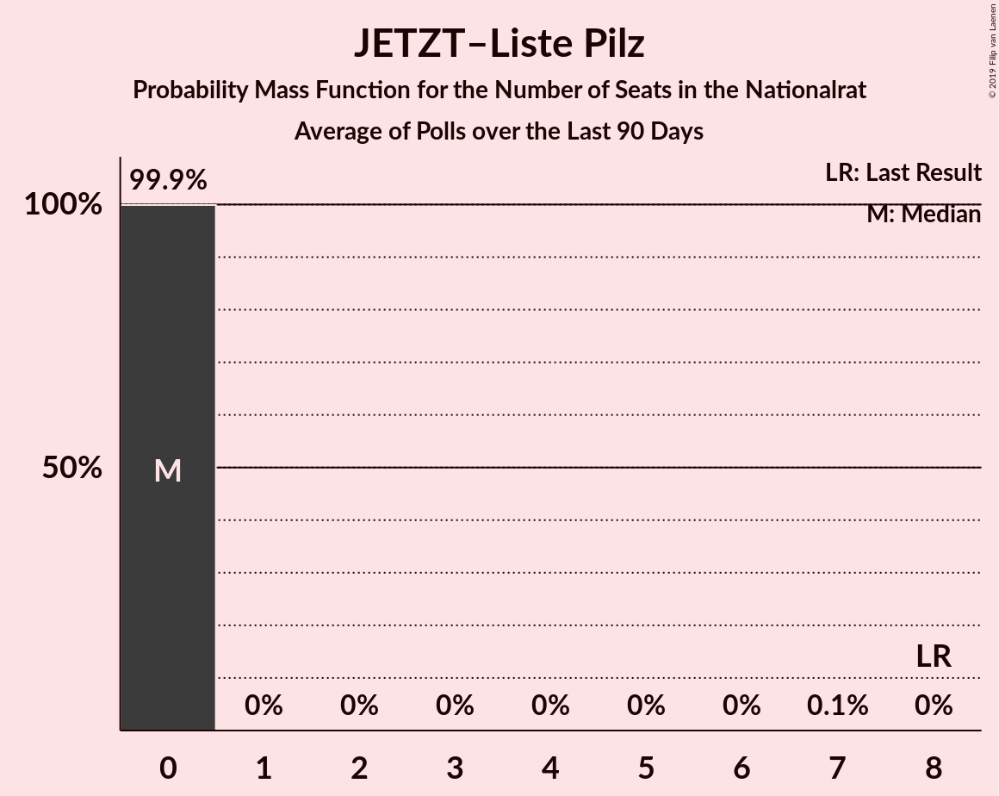

| Number of Seats | Probability | Accumulated | Special Marks |
|:---------------:|:-----------:|:-----------:|:-------------:|
| 0 | 100% | 100% | Median |
| 1 | 0% | 0% |  |
| 2 | 0% | 0% |  |
| 3 | 0% | 0% |  |
| 4 | 0% | 0% |  |
| 5 | 0% | 0% |  |
| 6 | 0% | 0% |  |
| 7 | 0% | 0% |  |
| 8 | 0% | 0% | Last Result |

### Die Grünen–Die Grüne Alternative

*For a full overview of the results for this party, see the [Die Grünen–Die Grüne Alternative](party-diegrünen–diegrünealternative.html) page.*

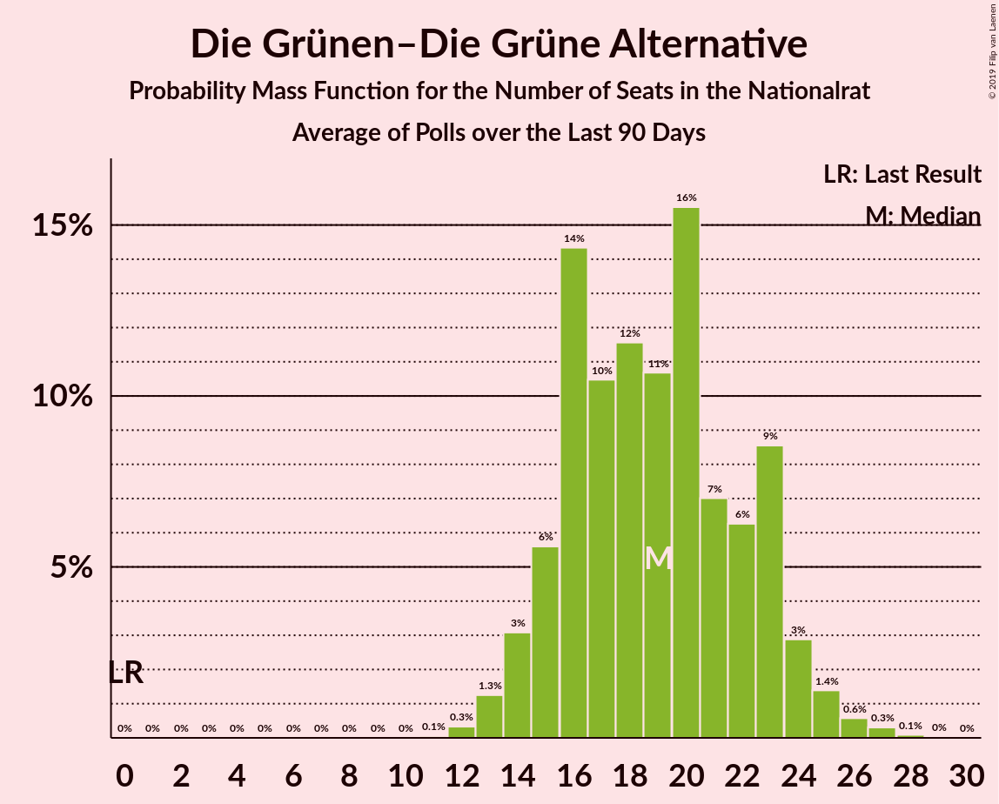

| Number of Seats | Probability | Accumulated | Special Marks |
|:---------------:|:-----------:|:-----------:|:-------------:|
| 0 | 0% | 100% | Last Result |
| 1 | 0% | 100% |  |
| 2 | 0% | 100% |  |
| 3 | 0% | 100% |  |
| 4 | 0% | 100% |  |
| 5 | 0% | 100% |  |
| 6 | 0% | 100% |  |
| 7 | 0% | 100% |  |
| 8 | 0% | 100% |  |
| 9 | 0% | 100% |  |
| 10 | 0% | 100% |  |
| 11 | 0% | 100% |  |
| 12 | 0% | 100% |  |
| 13 | 0% | 100% |  |
| 14 | 0.1% | 100% |  |
| 15 | 0.3% | 99.9% |  |
| 16 | 1.1% | 99.6% |  |
| 17 | 3% | 98.6% |  |
| 18 | 8% | 95% |  |
| 19 | 12% | 88% |  |
| 20 | 13% | 75% |  |
| 21 | 14% | 62% | Median |
| 22 | 12% | 48% |  |
| 23 | 16% | 36% |  |
| 24 | 15% | 20% |  |
| 25 | 3% | 5% |  |
| 26 | 1.4% | 2% |  |
| 27 | 0.4% | 0.6% |  |
| 28 | 0.1% | 0.2% |  |
| 29 | 0% | 0.1% |  |
| 30 | 0% | 0% |  |

## Coalitions

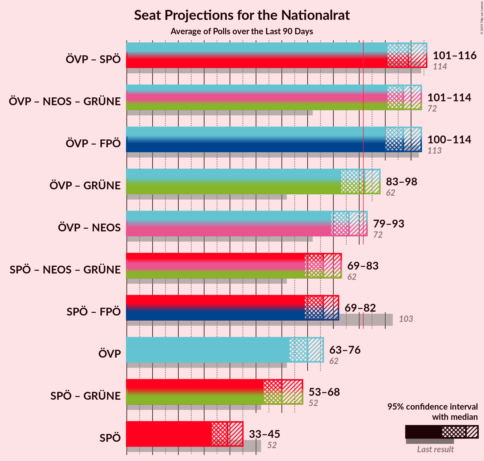

### Confidence Intervals

| Coalition | Last Result | Median | Majority? | 80% Confidence Interval | 90% Confidence Interval | 95% Confidence Interval | 99% Confidence Interval |
|:---------:|:-----------:|:------:|:---------:|:-----------------------:|:-----------------------:|:-----------------------:|:-----------------------:|
| Österreichische Volkspartei – Sozialdemokratische Partei Österreichs | 114 | 109 | 100% | 104–114 | 103–114 | 101–115 | 99–118 |
| Österreichische Volkspartei – NEOS–Das Neue Österreich und Liberales Forum – Die Grünen–Die Grüne Alternative | 72 | 107 | 100% | 103–112 | 102–113 | 101–114 | 99–116 |
| Österreichische Volkspartei – Freiheitliche Partei Österreichs | 113 | 107 | 100% | 103–111 | 101–112 | 100–114 | 98–116 |
| Österreichische Volkspartei – Die Grünen–Die Grüne Alternative | 62 | 92 | 53% | 86–96 | 85–97 | 83–98 | 81–100 |
| Österreichische Volkspartei – NEOS–Das Neue Österreich und Liberales Forum | 72 | 86 | 6% | 80–91 | 80–92 | 80–93 | 78–95 |
| Sozialdemokratische Partei Österreichs – NEOS–Das Neue Österreich und Liberales Forum – Die Grünen–Die Grüne Alternative | 62 | 76 | 0% | 72–80 | 71–82 | 69–83 | 67–85 |
| Sozialdemokratische Partei Österreichs – Freiheitliche Partei Österreichs | 103 | 76 | 0% | 71–80 | 70–81 | 69–82 | 67–84 |
| Österreichische Volkspartei | 62 | 69 | 0% | 66–74 | 64–75 | 63–76 | 61–79 |
| Sozialdemokratische Partei Österreichs | 52 | 39 | 0% | 35–45 | 34–45 | 33–45 | 32–47 |

### Österreichische Volkspartei – Sozialdemokratische Partei Österreichs

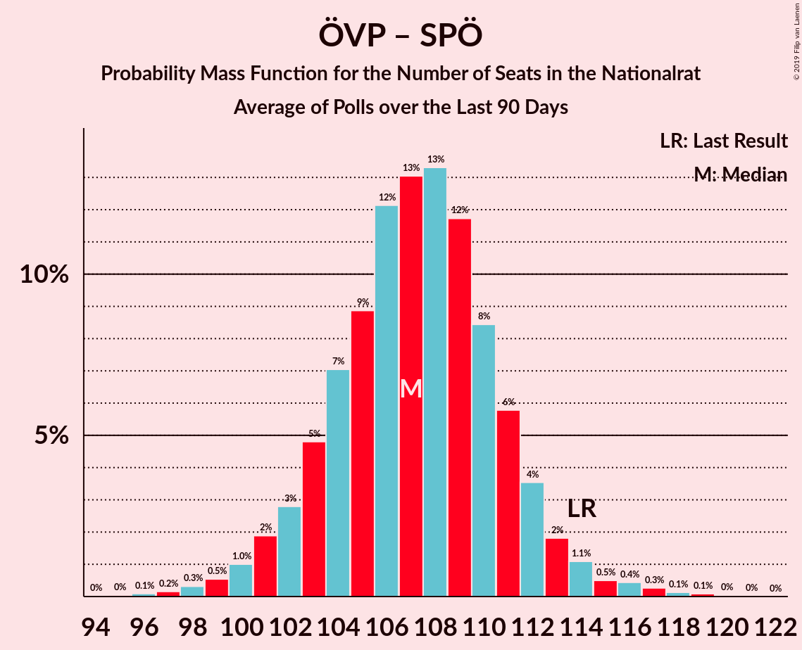

| Number of Seats | Probability | Accumulated | Special Marks |
|:---------------:|:-----------:|:-----------:|:-------------:|
| 97 | 0.1% | 100% |  |
| 98 | 0.2% | 99.9% |  |
| 99 | 0.4% | 99.7% |  |
| 100 | 0.8% | 99.4% |  |
| 101 | 1.3% | 98.6% |  |
| 102 | 2% | 97% |  |
| 103 | 3% | 95% |  |
| 104 | 4% | 92% |  |
| 105 | 6% | 88% |  |
| 106 | 7% | 82% |  |
| 107 | 8% | 75% |  |
| 108 | 8% | 67% | Median |
| 109 | 15% | 59% |  |
| 110 | 8% | 44% |  |
| 111 | 7% | 36% |  |
| 112 | 6% | 29% |  |
| 113 | 5% | 23% |  |
| 114 | 13% | 18% | Last Result |
| 115 | 3% | 5% |  |
| 116 | 1.3% | 2% |  |
| 117 | 0.5% | 1.1% |  |
| 118 | 0.3% | 0.5% |  |
| 119 | 0.2% | 0.3% |  |
| 120 | 0.1% | 0.1% |  |
| 121 | 0% | 0% |  |

### Österreichische Volkspartei – NEOS–Das Neue Österreich und Liberales Forum – Die Grünen–Die Grüne Alternative

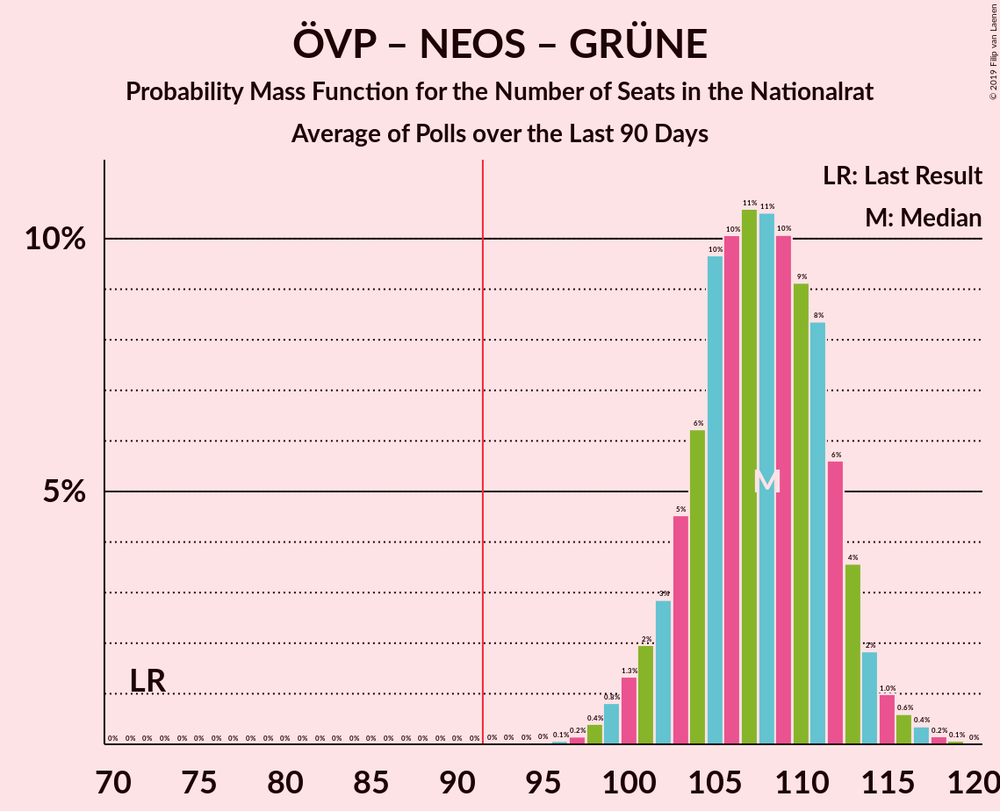

| Number of Seats | Probability | Accumulated | Special Marks |
|:---------------:|:-----------:|:-----------:|:-------------:|
| 72 | 0% | 100% | Last Result |
| 73 | 0% | 100% |  |
| 74 | 0% | 100% |  |
| 75 | 0% | 100% |  |
| 76 | 0% | 100% |  |
| 77 | 0% | 100% |  |
| 78 | 0% | 100% |  |
| 79 | 0% | 100% |  |
| 80 | 0% | 100% |  |
| 81 | 0% | 100% |  |
| 82 | 0% | 100% |  |
| 83 | 0% | 100% |  |
| 84 | 0% | 100% |  |
| 85 | 0% | 100% |  |
| 86 | 0% | 100% |  |
| 87 | 0% | 100% |  |
| 88 | 0% | 100% |  |
| 89 | 0% | 100% |  |
| 90 | 0% | 100% |  |
| 91 | 0% | 100% |  |
| 92 | 0% | 100% | Majority |
| 93 | 0% | 100% |  |
| 94 | 0% | 100% |  |
| 95 | 0% | 100% |  |
| 96 | 0% | 100% |  |
| 97 | 0.1% | 99.9% |  |
| 98 | 0.2% | 99.8% |  |
| 99 | 0.4% | 99.6% |  |
| 100 | 0.8% | 99.3% |  |
| 101 | 1.4% | 98% |  |
| 102 | 3% | 97% |  |
| 103 | 6% | 94% |  |
| 104 | 13% | 88% |  |
| 105 | 14% | 74% |  |
| 106 | 8% | 60% | Median |
| 107 | 9% | 52% |  |
| 108 | 10% | 43% |  |
| 109 | 9% | 33% |  |
| 110 | 8% | 24% |  |
| 111 | 6% | 17% |  |
| 112 | 4% | 10% |  |
| 113 | 3% | 6% |  |
| 114 | 2% | 3% |  |
| 115 | 0.8% | 1.4% |  |
| 116 | 0.4% | 0.6% |  |
| 117 | 0.1% | 0.2% |  |
| 118 | 0.1% | 0.1% |  |
| 119 | 0% | 0% |  |

### Österreichische Volkspartei – Freiheitliche Partei Österreichs

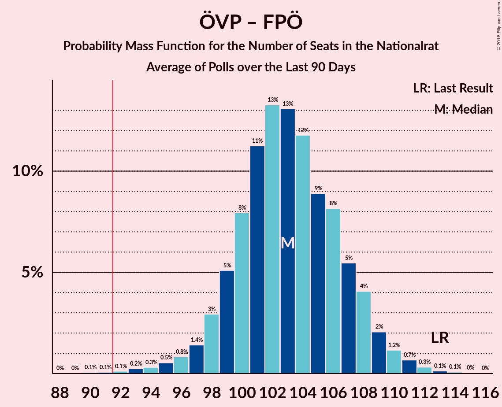

| Number of Seats | Probability | Accumulated | Special Marks |
|:---------------:|:-----------:|:-----------:|:-------------:|
| 95 | 0% | 100% |  |
| 96 | 0.1% | 99.9% |  |
| 97 | 0.2% | 99.9% |  |
| 98 | 0.4% | 99.7% |  |
| 99 | 1.3% | 99.3% |  |
| 100 | 1.3% | 98% |  |
| 101 | 2% | 97% |  |
| 102 | 4% | 94% |  |
| 103 | 13% | 91% |  |
| 104 | 7% | 78% |  |
| 105 | 8% | 71% |  |
| 106 | 8% | 63% | Median |
| 107 | 17% | 55% |  |
| 108 | 10% | 38% |  |
| 109 | 8% | 28% |  |
| 110 | 6% | 20% |  |
| 111 | 6% | 14% |  |
| 112 | 4% | 9% |  |
| 113 | 2% | 5% | Last Result |
| 114 | 1.2% | 3% |  |
| 115 | 0.8% | 1.5% |  |
| 116 | 0.4% | 0.7% |  |
| 117 | 0.2% | 0.3% |  |
| 118 | 0.1% | 0.1% |  |
| 119 | 0% | 0% |  |

### Österreichische Volkspartei – Die Grünen–Die Grüne Alternative

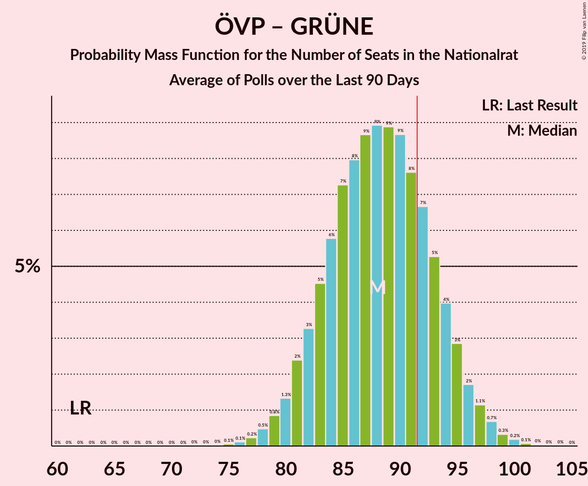

| Number of Seats | Probability | Accumulated | Special Marks |
|:---------------:|:-----------:|:-----------:|:-------------:|
| 62 | 0% | 100% | Last Result |
| 63 | 0% | 100% |  |
| 64 | 0% | 100% |  |
| 65 | 0% | 100% |  |
| 66 | 0% | 100% |  |
| 67 | 0% | 100% |  |
| 68 | 0% | 100% |  |
| 69 | 0% | 100% |  |
| 70 | 0% | 100% |  |
| 71 | 0% | 100% |  |
| 72 | 0% | 100% |  |
| 73 | 0% | 100% |  |
| 74 | 0% | 100% |  |
| 75 | 0% | 100% |  |
| 76 | 0% | 100% |  |
| 77 | 0% | 100% |  |
| 78 | 0% | 100% |  |
| 79 | 0.1% | 100% |  |
| 80 | 0.2% | 99.9% |  |
| 81 | 0.3% | 99.7% |  |
| 82 | 0.7% | 99.4% |  |
| 83 | 1.2% | 98.7% |  |
| 84 | 2% | 97% |  |
| 85 | 3% | 96% |  |
| 86 | 4% | 93% |  |
| 87 | 5% | 89% |  |
| 88 | 6% | 84% |  |
| 89 | 10% | 78% |  |
| 90 | 8% | 68% | Median |
| 91 | 7% | 60% |  |
| 92 | 14% | 53% | Majority |
| 93 | 16% | 38% |  |
| 94 | 7% | 23% |  |
| 95 | 5% | 16% |  |
| 96 | 4% | 11% |  |
| 97 | 3% | 7% |  |
| 98 | 2% | 4% |  |
| 99 | 1.1% | 2% |  |
| 100 | 0.7% | 1.1% |  |
| 101 | 0.3% | 0.5% |  |
| 102 | 0.1% | 0.2% |  |
| 103 | 0% | 0.1% |  |
| 104 | 0% | 0% |  |

### Österreichische Volkspartei – NEOS–Das Neue Österreich und Liberales Forum

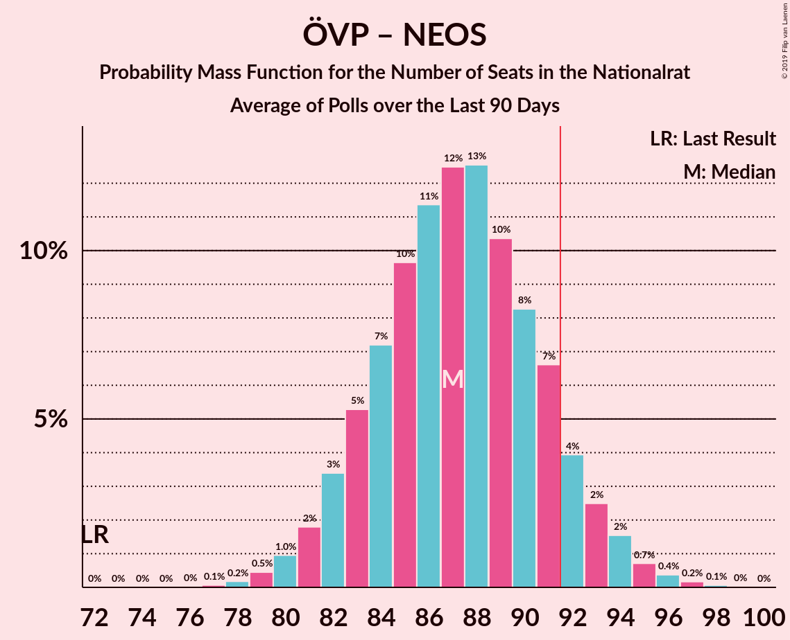

| Number of Seats | Probability | Accumulated | Special Marks |
|:---------------:|:-----------:|:-----------:|:-------------:|
| 72 | 0% | 100% | Last Result |
| 73 | 0% | 100% |  |
| 74 | 0% | 100% |  |
| 75 | 0% | 100% |  |
| 76 | 0.1% | 99.9% |  |
| 77 | 0.2% | 99.9% |  |
| 78 | 0.3% | 99.7% |  |
| 79 | 0.6% | 99.4% |  |
| 80 | 10% | 98.8% |  |
| 81 | 3% | 89% |  |
| 82 | 10% | 86% |  |
| 83 | 6% | 76% |  |
| 84 | 8% | 70% |  |
| 85 | 10% | 62% | Median |
| 86 | 10% | 53% |  |
| 87 | 10% | 43% |  |
| 88 | 9% | 33% |  |
| 89 | 8% | 23% |  |
| 90 | 6% | 16% |  |
| 91 | 4% | 10% |  |
| 92 | 2% | 6% | Majority |
| 93 | 1.4% | 3% |  |
| 94 | 1.0% | 2% |  |
| 95 | 0.4% | 0.7% |  |
| 96 | 0.2% | 0.3% |  |
| 97 | 0.1% | 0.1% |  |
| 98 | 0% | 0% |  |

### Sozialdemokratische Partei Österreichs – NEOS–Das Neue Österreich und Liberales Forum – Die Grünen–Die Grüne Alternative

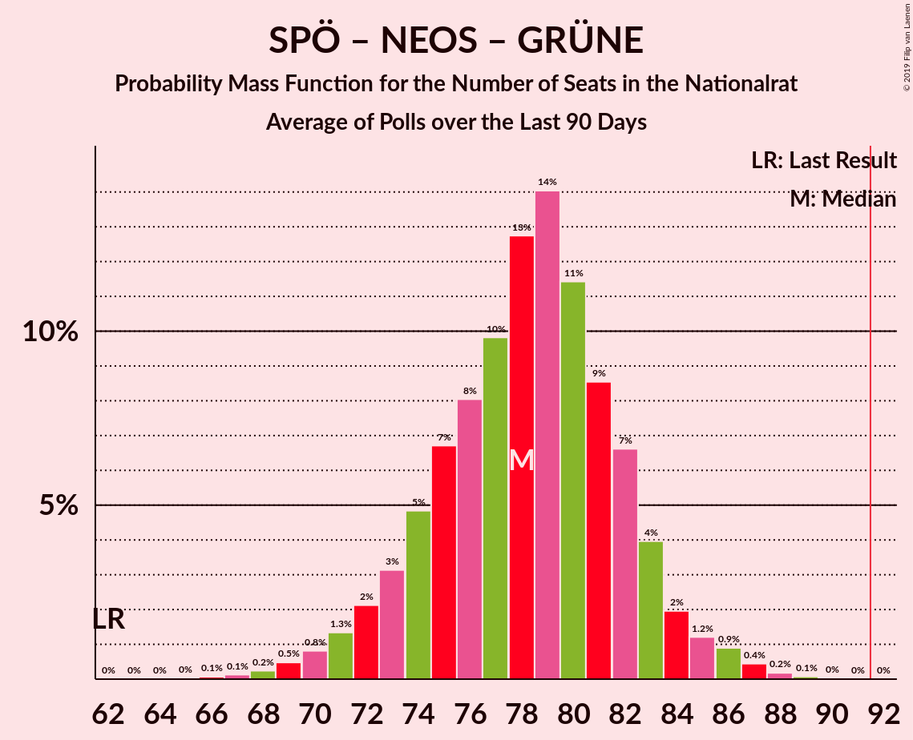

| Number of Seats | Probability | Accumulated | Special Marks |
|:---------------:|:-----------:|:-----------:|:-------------:|
| 62 | 0% | 100% | Last Result |
| 63 | 0% | 100% |  |
| 64 | 0% | 100% |  |
| 65 | 0.1% | 100% |  |
| 66 | 0.2% | 99.9% |  |
| 67 | 0.4% | 99.7% |  |
| 68 | 0.8% | 99.3% |  |
| 69 | 1.2% | 98.5% |  |
| 70 | 2% | 97% |  |
| 71 | 4% | 95% |  |
| 72 | 6% | 91% |  |
| 73 | 6% | 86% |  |
| 74 | 8% | 80% |  |
| 75 | 10% | 72% |  |
| 76 | 17% | 62% | Median |
| 77 | 8% | 45% |  |
| 78 | 8% | 37% |  |
| 79 | 7% | 29% |  |
| 80 | 13% | 22% |  |
| 81 | 4% | 9% |  |
| 82 | 2% | 6% |  |
| 83 | 1.3% | 3% |  |
| 84 | 1.3% | 2% |  |
| 85 | 0.4% | 0.7% |  |
| 86 | 0.2% | 0.3% |  |
| 87 | 0.1% | 0.1% |  |
| 88 | 0% | 0.1% |  |
| 89 | 0% | 0% |  |

### Sozialdemokratische Partei Österreichs – Freiheitliche Partei Österreichs

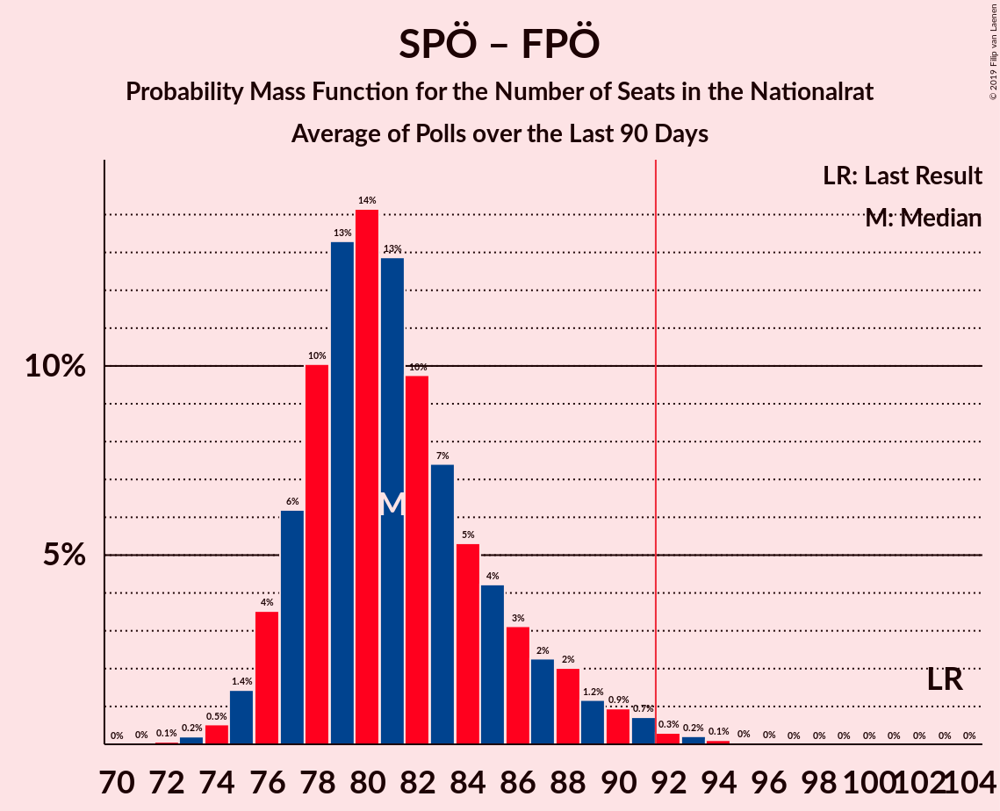

| Number of Seats | Probability | Accumulated | Special Marks |
|:---------------:|:-----------:|:-----------:|:-------------:|
| 65 | 0.1% | 100% |  |
| 66 | 0.1% | 99.9% |  |
| 67 | 0.4% | 99.8% |  |
| 68 | 0.8% | 99.4% |  |
| 69 | 2% | 98.6% |  |
| 70 | 3% | 97% |  |
| 71 | 4% | 94% |  |
| 72 | 6% | 90% |  |
| 73 | 8% | 83% |  |
| 74 | 9% | 76% |  |
| 75 | 10% | 67% |  |
| 76 | 9% | 57% | Median |
| 77 | 8% | 48% |  |
| 78 | 14% | 40% |  |
| 79 | 13% | 26% |  |
| 80 | 6% | 12% |  |
| 81 | 3% | 6% |  |
| 82 | 1.4% | 3% |  |
| 83 | 0.8% | 2% |  |
| 84 | 0.4% | 0.7% |  |
| 85 | 0.2% | 0.4% |  |
| 86 | 0.1% | 0.2% |  |
| 87 | 0% | 0.1% |  |
| 88 | 0% | 0% |  |
| 89 | 0% | 0% |  |
| 90 | 0% | 0% |  |
| 91 | 0% | 0% |  |
| 92 | 0% | 0% | Majority |
| 93 | 0% | 0% |  |
| 94 | 0% | 0% |  |
| 95 | 0% | 0% |  |
| 96 | 0% | 0% |  |
| 97 | 0% | 0% |  |
| 98 | 0% | 0% |  |
| 99 | 0% | 0% |  |
| 100 | 0% | 0% |  |
| 101 | 0% | 0% |  |
| 102 | 0% | 0% |  |
| 103 | 0% | 0% | Last Result |

### Österreichische Volkspartei

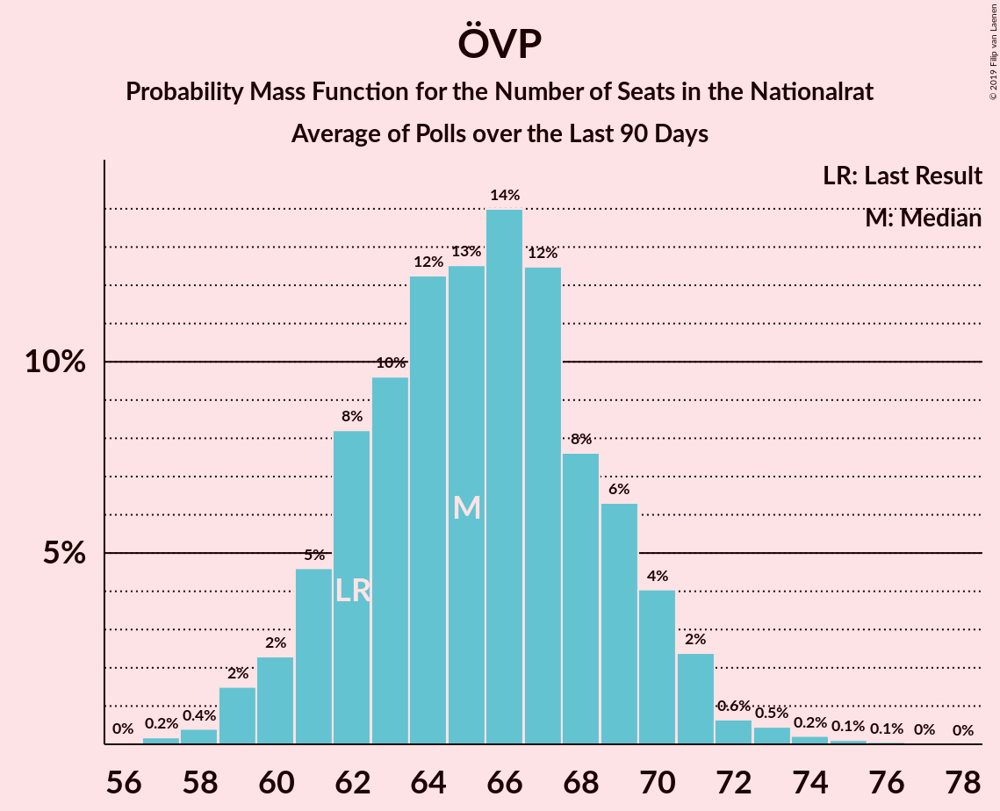

| Number of Seats | Probability | Accumulated | Special Marks |
|:---------------:|:-----------:|:-----------:|:-------------:|
| 59 | 0.1% | 100% |  |
| 60 | 0.2% | 99.9% |  |
| 61 | 0.4% | 99.7% |  |
| 62 | 0.8% | 99.3% | Last Result |
| 63 | 1.5% | 98% |  |
| 64 | 2% | 97% |  |
| 65 | 3% | 95% |  |
| 66 | 4% | 92% |  |
| 67 | 7% | 87% |  |
| 68 | 8% | 81% |  |
| 69 | 23% | 73% | Median |
| 70 | 11% | 50% |  |
| 71 | 10% | 38% |  |
| 72 | 8% | 28% |  |
| 73 | 7% | 20% |  |
| 74 | 6% | 14% |  |
| 75 | 3% | 8% |  |
| 76 | 2% | 5% |  |
| 77 | 1.0% | 2% |  |
| 78 | 0.7% | 1.4% |  |
| 79 | 0.3% | 0.7% |  |
| 80 | 0.2% | 0.3% |  |
| 81 | 0.1% | 0.1% |  |
| 82 | 0% | 0% |  |

### Sozialdemokratische Partei Österreichs

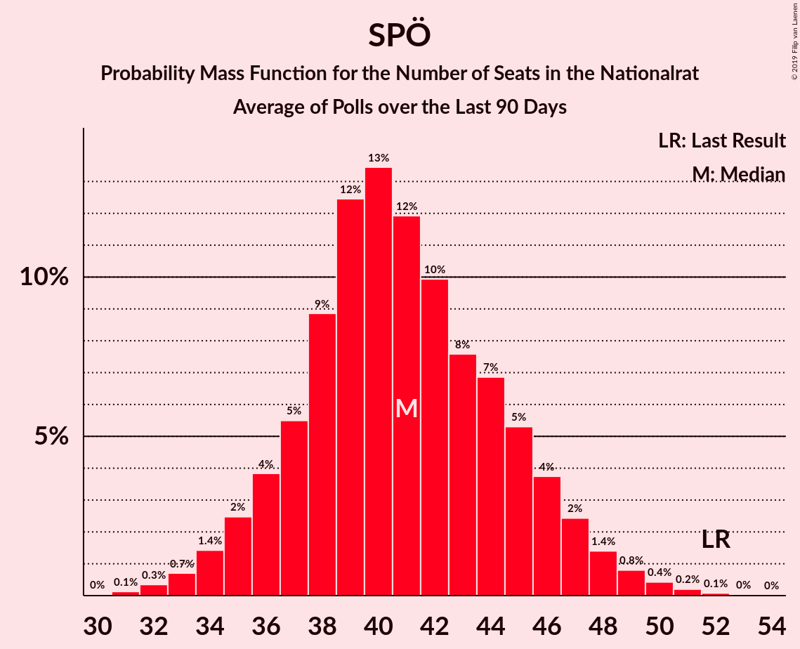

| Number of Seats | Probability | Accumulated | Special Marks |
|:---------------:|:-----------:|:-----------:|:-------------:|
| 30 | 0.1% | 100% |  |
| 31 | 0.3% | 99.9% |  |
| 32 | 0.9% | 99.5% |  |
| 33 | 2% | 98.6% |  |
| 34 | 3% | 97% |  |
| 35 | 6% | 93% |  |
| 36 | 8% | 88% |  |
| 37 | 10% | 80% |  |
| 38 | 12% | 70% |  |
| 39 | 11% | 58% | Median |
| 40 | 18% | 47% |  |
| 41 | 7% | 30% |  |
| 42 | 5% | 22% |  |
| 43 | 5% | 17% |  |
| 44 | 2% | 12% |  |
| 45 | 9% | 10% |  |
| 46 | 0.3% | 1.1% |  |
| 47 | 0.7% | 0.8% |  |
| 48 | 0% | 0.1% |  |
| 49 | 0% | 0% |  |
| 50 | 0% | 0% |  |
| 51 | 0% | 0% |  |
| 52 | 0% | 0% | Last Result |

## Technical Information

+ **Number of polls included in this average:** 5
+ **Lowest number of simulations done in a poll included in this average:** 1,024
+ **Total number of simulations done in the polls included in this average:** 4,195,328
+ **Error estimate:** 2.56%
