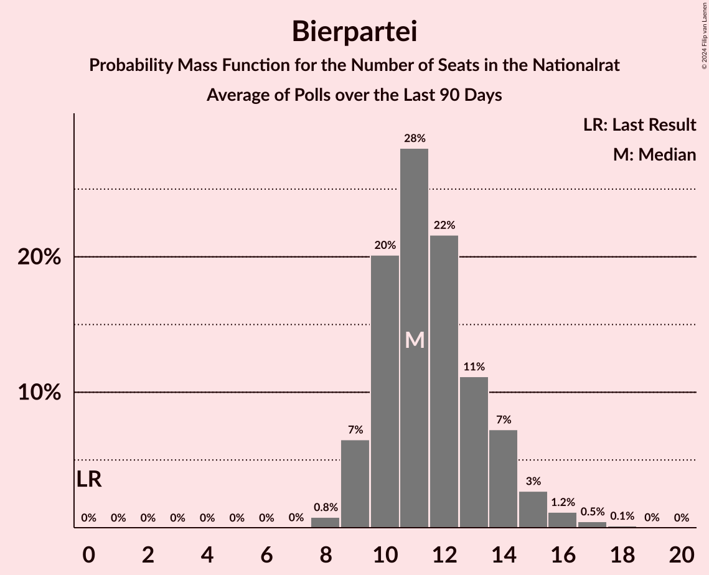
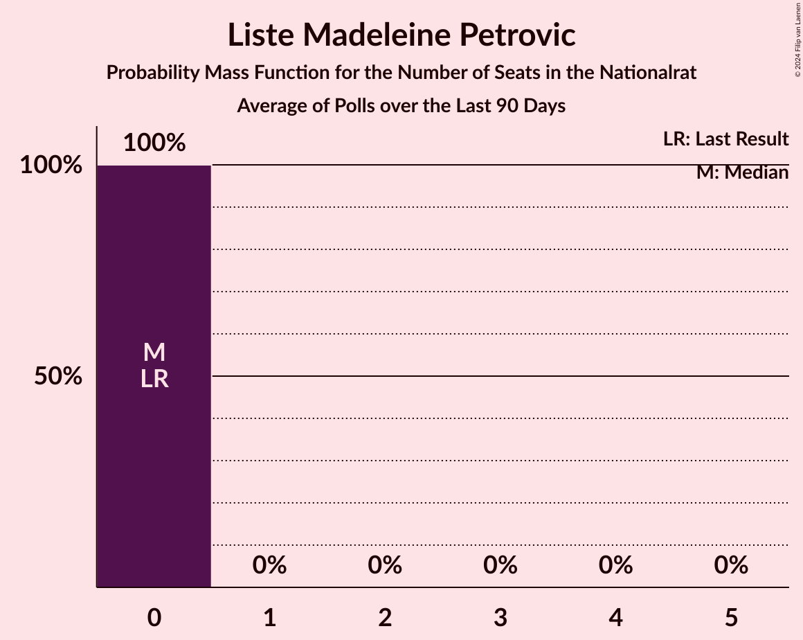
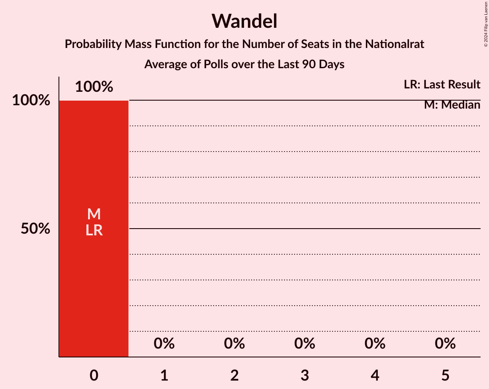

# Poll Average

<a href="#voting-intentions">Voting Intentions</a> | <a href="#seats">Seats</a> | <a href="#coalitions">Coalitions</a> | <a href="#technical-information">Technical Information</a>

## Summary

The table below lists the polls on which the average is based. They are the most recent polls (less than 90 days old) registered and analyzed so far.

| Period     | Polling firm/Commissioner(s) | ÖVP | SPÖ | FPÖ | GRÜNE | NEOS | JETZT | G!LT | KPÖ | HC | BIER | DNA | LMP | KEINE |
|:----------:|:----------------------------:|:--:|:--:|:--:|:--:|:--:|:--:|:--:|:--:|:--:|:--:|:--:|:--:|:--:|
| 29 September 2019 | General Election | 37.5%   71 | 21.2%   40 | 16.2%   31 | 13.9%   26 | 8.1%   15 | 1.9%   0 | 0.0%   0 | 0.7%   0 | 0.0%   0 | 0.0%   0 | 0.0%   0 | 0.0%   0 | 0.0%   0 |
| N/A | Poll Average | 18–27%   34–51 | 19–25%   36–47 | 24–33%   45–63 | 6–11%   12–21 | 7–12%   13–23 | N/A   N/A | N/A   N/A | 2–5%   0–9 | N/A   N/A | 4–8%   8–15 | N/A   N/A | 0–2%   0 | 0–2%   0 |
| [1–31 August 2024](2024-08-31-OGM.html) | OGM   Servus TV | 20–27%   38–51 | 18–25%   34–47 | 23–31%   45–59 | 7–12%   12–24 | 7–12%   14–21 | N/A   N/A | N/A   N/A | 2–5%   0–9 | N/A   N/A | 4–8%   8–15 | N/A   N/A | 0–2%   0 | 0–2%   0 |
| [19–20 August 2024](2024-08-20-Market.html) | Market   ÖSTERREIC | 20–24%   39–46 | 19–23%   37–44 | 27–31%   53–60 | 6–8%   11–15 | 10–12%   18–24 | N/A   N/A | N/A   N/A | 1–3%   0 | N/A   N/A | 4–6%   8–11 | N/A   N/A | 1–2%   0 | 1–2%   0 |
| [5–7 August 2024](2024-08-07-INSA.html) | INSA   eXXpress | 17–22%   32–41 | 19–24%   36–45 | 28–34%   54–65 | 7–11%   14–21 | 6–10%   12–19 | N/A   N/A | N/A   N/A | 1–3%   0 | N/A   N/A | 6–9%   10–17 | N/A   N/A | N/A   N/A | N/A   N/A |
| [25–26 July 2024](2024-07-26-IFDD.html) | IFDD   Radio Content Austria | 22–28%   42–52 | 21–25%   39–48 | 23–29%   44–54 | 7–11%   14–20 | 7–11%   14–20 | N/A   N/A | N/A   N/A | 2–4%   0–7 | N/A   N/A | 4–6%   0–12 | N/A   N/A | N/A   N/A | N/A   N/A |
| [12–21 July 2024](2024-07-21-Spectra.html) | Spectra   Kleine Zeitung, OÖNachrichten and Salzburger Nachrichten | 20–25%   36–47 | 20–25%   37–47 | 24–30%   46–57 | 7–11%   14–20 | 7–11%   13–20 | N/A   N/A | N/A   N/A | 3–5%   0–10 | N/A   N/A | 5–8%   8–14 | N/A   N/A | N/A   N/A | N/A   N/A |
| 29 September 2019 | General Election | 37.5%   71 | 21.2%   40 | 16.2%   31 | 13.9%   26 | 8.1%   15 | 1.9%   0 | 0.0%   0 | 0.7%   0 | 0.0%   0 | 0.0%   0 | 0.0%   0 | 0.0%   0 | 0.0%   0 |

Only polls for which at least the sample size has been published are included in the table above.

**Legend:**
+ **Top half of each row:** Voting intentions (95% confidence interval)
+ **Bottom half of each row:** Seat projections for the Nationalrat (95% confidence interval)
+ **ÖVP:** Österreichische Volkspartei
+ **SPÖ:** Sozialdemokratische Partei Österreichs
+ **FPÖ:** Freiheitliche Partei Österreichs
+ **GRÜNE:** Die Grünen–Die Grüne Alternative
+ **NEOS:** NEOS–Das Neue Österreich und Liberales Forum
+ **JETZT:** JETZT–Liste Pilz
+ **G!LT:** Meine Stimme G!LT
+ **KPÖ:** Kommunistische Partei Österreichs
+ **HC:** Team HC Strache–Allianz für Österreich
+ **BIER:** Bierpartei
+ **DNA:** Demokratisch – Neutral – Authentisch
+ **LMP:** Liste Madeleine Petrovic
+ **KEINE:** Wandel
+ **N/A (single party):** Party not included the published results
+ **N/A (entire row):** Calculation for this opinion poll not started yet

## Voting Intentions

### Confidence Intervals

| Party | Last Result | Median | 80% Confidence Interval | 90% Confidence Interval | 95% Confidence Interval | 99% Confidence Interval |
|:-----:|:-----------:|:------:|:-----------------------:|:-----------------------:|:-----------------------:|:-----------------------:|
| <a href="#österreichische-volkspartei">Österreichische Volkspartei</a> | 37.5% | 22.2% | 19.0–25.3% |18.2–26.1% | 17.6–26.6% | 16.7–27.7% |
| <a href="#sozialdemokratische-partei-österreichs">Sozialdemokratische Partei Österreichs</a> | 21.2% | 21.6% | 19.7–23.7% |19.2–24.3% | 18.7–24.8% | 17.6–25.8% |
| <a href="#freiheitliche-partei-österreichs">Freiheitliche Partei Österreichs</a> | 16.2% | 27.9% | 25.1–31.2% |24.5–32.1% | 23.9–32.7% | 22.9–34.0% |
| <a href="#die-grünen–die-grüne-alternative">Die Grünen–Die Grüne Alternative</a> | 13.9% | 8.8% | 7.0–10.2% |6.6–10.7% | 6.4–11.1% | 6.0–12.0% |
| <a href="#neos–das-neue-österreich-und-liberales-forum">NEOS–Das Neue Österreich und Liberales Forum</a> | 8.1% | 9.2% | 7.6–11.2% |7.2–11.6% | 6.9–11.9% | 6.4–12.6% |
| <a href="#jetzt–liste-pilz">JETZT–Liste Pilz</a> | 1.9% | N/A | N/A |N/A | N/A | N/A |
| <a href="#kommunistische-partei-österreichs">Kommunistische Partei Österreichs</a> | 0.7% | 2.8% | 1.8–4.3% |1.6–4.6% | 1.5–4.9% | 1.3–5.5% |
| <a href="#meine-stimme-g!lt">Meine Stimme G!LT</a> | 0.0% | N/A | N/A |N/A | N/A | N/A |
| <a href="#team-hc-strache–allianz-für-österreich">Team HC Strache–Allianz für Österreich</a> | 0.0% | N/A | N/A |N/A | N/A | N/A |
| <a href="#bierpartei">Bierpartei</a> | 0.0% | 5.7% | 4.6–7.4% |4.4–7.8% | 4.2–8.2% | 3.8–8.9% |
| <a href="#demokratisch-–-neutral-–-authentisch">Demokratisch – Neutral – Authentisch</a> | 0.0% | N/A | N/A |N/A | N/A | N/A |
| <a href="#liste-madeleine-petrovic">Liste Madeleine Petrovic</a> | 0.0% | 1.1% | 0.7–1.6% |0.6–1.8% | 0.5–2.0% | 0.3–2.5% |
| <a href="#wandel">Wandel</a> | 0.0% | 1.1% | 0.7–1.6% |0.6–1.8% | 0.5–2.0% | 0.3–2.5% |

### Österreichische Volkspartei

*For a full overview of the results for this party, see the [Österreichische Volkspartei](party-österreichischevolkspartei.html) page.*

| Voting Intentions | Probability | Accumulated | Special Marks |
|:-----------------:|:-----------:|:-----------:|:-------------:|
| 14.5–15.5% | 0% | 100% |  |
| 15.5–16.5% | 0.3% | 100% |  |
| 16.5–17.5% | 2% | 99.6% |  |
| 17.5–18.5% | 5% | 98% |  |
| 18.5–19.5% | 7% | 93% |  |
| 19.5–20.5% | 9% | 86% |  |
| 20.5–21.5% | 14% | 77% |  |
| 21.5–22.5% | 19% | 63% | Median |
| 22.5–23.5% | 15% | 44% |  |
| 23.5–24.5% | 11% | 28% |  |
| 24.5–25.5% | 9% | 17% |  |
| 25.5–26.5% | 5% | 8% |  |
| 26.5–27.5% | 2% | 3% |  |
| 27.5–28.5% | 0.6% | 0.7% |  |
| 28.5–29.5% | 0.1% | 0.1% |  |
| 29.5–30.5% | 0% | 0% |  |
| 30.5–31.5% | 0% | 0% |  |
| 31.5–32.5% | 0% | 0% |  |
| 32.5–33.5% | 0% | 0% |  |
| 33.5–34.5% | 0% | 0% |  |
| 34.5–35.5% | 0% | 0% |  |
| 35.5–36.5% | 0% | 0% |  |
| 36.5–37.5% | 0% | 0% |  |
| 37.5–38.5% | 0% | 0% | Last Result |

### Sozialdemokratische Partei Österreichs

*For a full overview of the results for this party, see the [Sozialdemokratische Partei Österreichs](party-sozialdemokratischeparteiösterreichs.html) page.*

| Voting Intentions | Probability | Accumulated | Special Marks |
|:-----------------:|:-----------:|:-----------:|:-------------:|
| 14.5–15.5% | 0% | 100% |  |
| 15.5–16.5% | 0.1% | 100% |  |
| 16.5–17.5% | 0.4% | 99.9% |  |
| 17.5–18.5% | 2% | 99.6% |  |
| 18.5–19.5% | 6% | 98% |  |
| 19.5–20.5% | 16% | 92% |  |
| 20.5–21.5% | 26% | 76% | Last Result |
| 21.5–22.5% | 24% | 51% | Median |
| 22.5–23.5% | 16% | 27% |  |
| 23.5–24.5% | 8% | 11% |  |
| 24.5–25.5% | 3% | 3% |  |
| 25.5–26.5% | 0.6% | 0.7% |  |
| 26.5–27.5% | 0.1% | 0.1% |  |
| 27.5–28.5% | 0% | 0% |  |

### Freiheitliche Partei Österreichs

*For a full overview of the results for this party, see the [Freiheitliche Partei Österreichs](party-freiheitlicheparteiösterreichs.html) page.*

| Voting Intentions | Probability | Accumulated | Special Marks |
|:-----------------:|:-----------:|:-----------:|:-------------:|
| 15.5–16.5% | 0% | 100% | Last Result |
| 16.5–17.5% | 0% | 100% |  |
| 17.5–18.5% | 0% | 100% |  |
| 18.5–19.5% | 0% | 100% |  |
| 19.5–20.5% | 0% | 100% |  |
| 20.5–21.5% | 0% | 100% |  |
| 21.5–22.5% | 0.2% | 100% |  |
| 22.5–23.5% | 1.1% | 99.7% |  |
| 23.5–24.5% | 4% | 98.6% |  |
| 24.5–25.5% | 9% | 94% |  |
| 25.5–26.5% | 14% | 85% |  |
| 26.5–27.5% | 15% | 71% |  |
| 27.5–28.5% | 15% | 56% | Median |
| 28.5–29.5% | 15% | 41% |  |
| 29.5–30.5% | 11% | 26% |  |
| 30.5–31.5% | 7% | 15% |  |
| 31.5–32.5% | 5% | 8% |  |
| 32.5–33.5% | 2% | 3% |  |
| 33.5–34.5% | 0.7% | 0.9% |  |
| 34.5–35.5% | 0.2% | 0.2% |  |
| 35.5–36.5% | 0% | 0% |  |

### Die Grünen–Die Grüne Alternative

*For a full overview of the results for this party, see the [Die Grünen–Die Grüne Alternative](party-diegrünen–diegrünealternative.html) page.*

| Voting Intentions | Probability | Accumulated | Special Marks |
|:-----------------:|:-----------:|:-----------:|:-------------:|
| 4.5–5.5% | 0.1% | 100% |  |
| 5.5–6.5% | 4% | 99.9% |  |
| 6.5–7.5% | 16% | 96% |  |
| 7.5–8.5% | 23% | 80% |  |
| 8.5–9.5% | 32% | 57% | Median |
| 9.5–10.5% | 19% | 25% |  |
| 10.5–11.5% | 5% | 6% |  |
| 11.5–12.5% | 0.9% | 1.1% |  |
| 12.5–13.5% | 0.1% | 0.2% |  |
| 13.5–14.5% | 0% | 0% | Last Result |

### NEOS–Das Neue Österreich und Liberales Forum

*For a full overview of the results for this party, see the [NEOS–Das Neue Österreich und Liberales Forum](party-neos–dasneueösterreichundliberalesforum.html) page.*

| Voting Intentions | Probability | Accumulated | Special Marks |
|:-----------------:|:-----------:|:-----------:|:-------------:|
| 4.5–5.5% | 0% | 100% |  |
| 5.5–6.5% | 0.9% | 100% |  |
| 6.5–7.5% | 8% | 99.1% |  |
| 7.5–8.5% | 23% | 91% | Last Result |
| 8.5–9.5% | 28% | 68% | Median |
| 9.5–10.5% | 19% | 40% |  |
| 10.5–11.5% | 15% | 20% |  |
| 11.5–12.5% | 5% | 6% |  |
| 12.5–13.5% | 0.5% | 0.5% |  |
| 13.5–14.5% | 0% | 0% |  |

### Kommunistische Partei Österreichs

*For a full overview of the results for this party, see the [Kommunistische Partei Österreichs](party-kommunistischeparteiösterreichs.html) page.*

| Voting Intentions | Probability | Accumulated | Special Marks |
|:-----------------:|:-----------:|:-----------:|:-------------:|
| 0.0–0.5% | 0% | 100% |  |
| 0.5–1.5% | 3% | 100% | Last Result |
| 1.5–2.5% | 39% | 97% |  |
| 2.5–3.5% | 32% | 58% | Median |
| 3.5–4.5% | 21% | 26% |  |
| 4.5–5.5% | 5% | 6% |  |
| 5.5–6.5% | 0.4% | 0.4% |  |
| 6.5–7.5% | 0% | 0% |  |

### Liste Madeleine Petrovic

*For a full overview of the results for this party, see the [Liste Madeleine Petrovic](party-listemadeleinepetrovic.html) page.*

| Voting Intentions | Probability | Accumulated | Special Marks |
|:-----------------:|:-----------:|:-----------:|:-------------:|
| 0.0–0.5% | 4% | 100% | Last Result |
| 0.5–1.5% | 86% | 96% | Median |
| 1.5–2.5% | 10% | 10% |  |
| 2.5–3.5% | 0.4% | 0.4% |  |
| 3.5–4.5% | 0% | 0% |  |

### Wandel

*For a full overview of the results for this party, see the [Wandel](party-wandel.html) page.*

| Voting Intentions | Probability | Accumulated | Special Marks |
|:-----------------:|:-----------:|:-----------:|:-------------:|
| 0.0–0.5% | 4% | 100% | Last Result |
| 0.5–1.5% | 86% | 96% | Median |
| 1.5–2.5% | 10% | 10% |  |
| 2.5–3.5% | 0.4% | 0.4% |  |
| 3.5–4.5% | 0% | 0% |  |

### Bierpartei

*For a full overview of the results for this party, see the [Bierpartei](party-bierpartei.html) page.*

| Voting Intentions | Probability | Accumulated | Special Marks |
|:-----------------:|:-----------:|:-----------:|:-------------:|
| 0.0–0.5% | 0% | 100% | Last Result |
| 0.5–1.5% | 0% | 100% |  |
| 1.5–2.5% | 0% | 100% |  |
| 2.5–3.5% | 0.2% | 100% |  |
| 3.5–4.5% | 9% | 99.8% |  |
| 4.5–5.5% | 35% | 91% |  |
| 5.5–6.5% | 29% | 56% | Median |
| 6.5–7.5% | 19% | 27% |  |
| 7.5–8.5% | 7% | 8% |  |
| 8.5–9.5% | 1.1% | 1.2% |  |
| 9.5–10.5% | 0.1% | 0.1% |  |
| 10.5–11.5% | 0% | 0% |  |

## Seats

### Confidence Intervals

| Party | Last Result | Median | 80% Confidence Interval | 90% Confidence Interval | 95% Confidence Interval | 99% Confidence Interval |
|:-----:|:-----------:|:------:|:-----------------------:|:-----------------------:|:-----------------------:|:-----------------------:|
| <a href="#österreichische-volkspartei">Österreichische Volkspartei</a> | 71 | 42 | 36–48 |35–49 | 34–51 | 32–53 |
| <a href="#sozialdemokratische-partei-österreichs">Sozialdemokratische Partei Österreichs</a> | 40 | 41 | 38–45 |37–46 | 36–47 | 33–49 |
| <a href="#freiheitliche-partei-österreichs">Freiheitliche Partei Österreichs</a> | 31 | 53 | 47–60 |46–62 | 45–63 | 44–66 |
| <a href="#die-grünen–die-grüne-alternative">Die Grünen–Die Grüne Alternative</a> | 26 | 16 | 13–19 |12–20 | 12–21 | 11–24 |
| <a href="#neos–das-neue-österreich-und-liberales-forum">NEOS–Das Neue Österreich und Liberales Forum</a> | 15 | 17 | 14–21 |14–22 | 13–23 | 12–24 |
| <a href="#jetzt–liste-pilz">JETZT–Liste Pilz</a> | 0 | N/A | N/A |N/A | N/A | N/A |
| <a href="#kommunistische-partei-österreichs">Kommunistische Partei Österreichs</a> | 0 | 0 | 0–7 |0–8 | 0–9 | 0–10 |
| <a href="#meine-stimme-g!lt">Meine Stimme G!LT</a> | 0 | N/A | N/A |N/A | N/A | N/A |
| <a href="#team-hc-strache–allianz-für-österreich">Team HC Strache–Allianz für Österreich</a> | 0 | N/A | N/A |N/A | N/A | N/A |
| <a href="#bierpartei">Bierpartei</a> | 0 | 11 | 8–14 |8–15 | 8–15 | 0–17 |
| <a href="#demokratisch-–-neutral-–-authentisch">Demokratisch – Neutral – Authentisch</a> | 0 | N/A | N/A |N/A | N/A | N/A |
| <a href="#liste-madeleine-petrovic">Liste Madeleine Petrovic</a> | 0 | 0 | 0 |0 | 0 | 0 |
| <a href="#wandel">Wandel</a> | 0 | 0 | 0 |0 | 0 | 0 |

### Österreichische Volkspartei

*For a full overview of the results for this party, see the [Österreichische Volkspartei](party-österreichischevolkspartei.html) page.*

| Number of Seats | Probability | Accumulated | Special Marks |
|:---------------:|:-----------:|:-----------:|:-------------:|
| 30 | 0.1% | 100% |  |
| 31 | 0.2% | 99.9% |  |
| 32 | 0.6% | 99.7% |  |
| 33 | 1.3% | 99.1% |  |
| 34 | 2% | 98% |  |
| 35 | 3% | 96% |  |
| 36 | 4% | 93% |  |
| 37 | 4% | 89% |  |
| 38 | 5% | 85% |  |
| 39 | 6% | 80% |  |
| 40 | 6% | 75% |  |
| 41 | 9% | 69% |  |
| 42 | 13% | 60% | Median |
| 43 | 9% | 47% |  |
| 44 | 9% | 37% |  |
| 45 | 9% | 29% |  |
| 46 | 5% | 20% |  |
| 47 | 4% | 15% |  |
| 48 | 4% | 11% |  |
| 49 | 3% | 8% |  |
| 50 | 2% | 4% |  |
| 51 | 1.3% | 3% |  |
| 52 | 0.8% | 2% |  |
| 53 | 0.3% | 0.7% |  |
| 54 | 0.2% | 0.4% |  |
| 55 | 0.1% | 0.1% |  |
| 56 | 0% | 0% |  |
| 57 | 0% | 0% |  |
| 58 | 0% | 0% |  |
| 59 | 0% | 0% |  |
| 60 | 0% | 0% |  |
| 61 | 0% | 0% |  |
| 62 | 0% | 0% |  |
| 63 | 0% | 0% |  |
| 64 | 0% | 0% |  |
| 65 | 0% | 0% |  |
| 66 | 0% | 0% |  |
| 67 | 0% | 0% |  |
| 68 | 0% | 0% |  |
| 69 | 0% | 0% |  |
| 70 | 0% | 0% |  |
| 71 | 0% | 0% | Last Result |

### Sozialdemokratische Partei Österreichs

*For a full overview of the results for this party, see the [Sozialdemokratische Partei Österreichs](party-sozialdemokratischeparteiösterreichs.html) page.*

| Number of Seats | Probability | Accumulated | Special Marks |
|:---------------:|:-----------:|:-----------:|:-------------:|
| 32 | 0.3% | 100% |  |
| 33 | 0.2% | 99.6% |  |
| 34 | 0.4% | 99.5% |  |
| 35 | 2% | 99.1% |  |
| 36 | 2% | 98% |  |
| 37 | 5% | 95% |  |
| 38 | 7% | 91% |  |
| 39 | 9% | 84% |  |
| 40 | 17% | 75% | Last Result |
| 41 | 15% | 58% | Median |
| 42 | 12% | 43% |  |
| 43 | 10% | 32% |  |
| 44 | 8% | 22% |  |
| 45 | 6% | 14% |  |
| 46 | 4% | 8% |  |
| 47 | 2% | 4% |  |
| 48 | 1.1% | 2% |  |
| 49 | 0.4% | 0.8% |  |
| 50 | 0.2% | 0.4% |  |
| 51 | 0.1% | 0.1% |  |
| 52 | 0% | 0% |  |

### Freiheitliche Partei Österreichs

*For a full overview of the results for this party, see the [Freiheitliche Partei Österreichs](party-freiheitlicheparteiösterreichs.html) page.*

| Number of Seats | Probability | Accumulated | Special Marks |
|:---------------:|:-----------:|:-----------:|:-------------:|
| 31 | 0% | 100% | Last Result |
| 32 | 0% | 100% |  |
| 33 | 0% | 100% |  |
| 34 | 0% | 100% |  |
| 35 | 0% | 100% |  |
| 36 | 0% | 100% |  |
| 37 | 0% | 100% |  |
| 38 | 0% | 100% |  |
| 39 | 0% | 100% |  |
| 40 | 0% | 100% |  |
| 41 | 0.1% | 100% |  |
| 42 | 0.1% | 99.9% |  |
| 43 | 0.3% | 99.8% |  |
| 44 | 0.7% | 99.5% |  |
| 45 | 1.4% | 98.8% |  |
| 46 | 3% | 97% |  |
| 47 | 5% | 95% |  |
| 48 | 5% | 89% |  |
| 49 | 6% | 84% |  |
| 50 | 6% | 78% |  |
| 51 | 6% | 73% |  |
| 52 | 10% | 67% |  |
| 53 | 8% | 57% | Median |
| 54 | 6% | 49% |  |
| 55 | 5% | 43% |  |
| 56 | 8% | 37% |  |
| 57 | 6% | 30% |  |
| 58 | 6% | 23% |  |
| 59 | 5% | 17% |  |
| 60 | 4% | 12% |  |
| 61 | 3% | 8% |  |
| 62 | 2% | 6% |  |
| 63 | 2% | 4% |  |
| 64 | 1.0% | 2% |  |
| 65 | 0.6% | 1.1% |  |
| 66 | 0.3% | 0.5% |  |
| 67 | 0.1% | 0.2% |  |
| 68 | 0.1% | 0.1% |  |
| 69 | 0% | 0% |  |

### Die Grünen–Die Grüne Alternative

*For a full overview of the results for this party, see the [Die Grünen–Die Grüne Alternative](party-diegrünen–diegrünealternative.html) page.*

| Number of Seats | Probability | Accumulated | Special Marks |
|:---------------:|:-----------:|:-----------:|:-------------:|
| 10 | 0.1% | 100% |  |
| 11 | 1.4% | 99.9% |  |
| 12 | 5% | 98.5% |  |
| 13 | 9% | 93% |  |
| 14 | 9% | 85% |  |
| 15 | 14% | 76% |  |
| 16 | 13% | 63% | Median |
| 17 | 16% | 49% |  |
| 18 | 18% | 33% |  |
| 19 | 7% | 15% |  |
| 20 | 5% | 8% |  |
| 21 | 2% | 4% |  |
| 22 | 0.6% | 1.4% |  |
| 23 | 0.2% | 0.8% |  |
| 24 | 0.6% | 0.6% |  |
| 25 | 0% | 0% |  |
| 26 | 0% | 0% | Last Result |

### NEOS–Das Neue Österreich und Liberales Forum

*For a full overview of the results for this party, see the [NEOS–Das Neue Österreich und Liberales Forum](party-neos–dasneueösterreichundliberalesforum.html) page.*

| Number of Seats | Probability | Accumulated | Special Marks |
|:---------------:|:-----------:|:-----------:|:-------------:|
| 11 | 0.2% | 100% |  |
| 12 | 0.9% | 99.7% |  |
| 13 | 3% | 98.8% |  |
| 14 | 7% | 96% |  |
| 15 | 13% | 89% | Last Result |
| 16 | 14% | 77% |  |
| 17 | 17% | 62% | Median |
| 18 | 12% | 46% |  |
| 19 | 11% | 33% |  |
| 20 | 9% | 23% |  |
| 21 | 5% | 14% |  |
| 22 | 4% | 9% |  |
| 23 | 4% | 5% |  |
| 24 | 0.5% | 0.8% |  |
| 25 | 0.2% | 0.3% |  |
| 26 | 0% | 0.1% |  |
| 27 | 0% | 0% |  |

### JETZT–Liste Pilz

*For a full overview of the results for this party, see the [JETZT–Liste Pilz](party-jetzt–listepilz.html) page.*

### Kommunistische Partei Österreichs

*For a full overview of the results for this party, see the [Kommunistische Partei Österreichs](party-kommunistischeparteiösterreichs.html) page.*

| Number of Seats | Probability | Accumulated | Special Marks |
|:---------------:|:-----------:|:-----------:|:-------------:|
| 0 | 86% | 100% | Last Result, Median |
| 1 | 0% | 14% |  |
| 2 | 0% | 14% |  |
| 3 | 0% | 14% |  |
| 4 | 0% | 14% |  |
| 5 | 0% | 14% |  |
| 6 | 0% | 14% |  |
| 7 | 5% | 14% |  |
| 8 | 6% | 9% |  |
| 9 | 2% | 3% |  |
| 10 | 0.7% | 0.9% |  |
| 11 | 0.1% | 0.2% |  |
| 12 | 0% | 0% |  |

### Meine Stimme G!LT

*For a full overview of the results for this party, see the [Meine Stimme G!LT](party-meinestimmeglt.html) page.*

### Team HC Strache–Allianz für Österreich

*For a full overview of the results for this party, see the [Team HC Strache–Allianz für Österreich](party-teamhcstrache–allianzfürösterreich.html) page.*

### Bierpartei

*For a full overview of the results for this party, see the [Bierpartei](party-bierpartei.html) page.*

| Number of Seats | Probability | Accumulated | Special Marks |
|:---------------:|:-----------:|:-----------:|:-------------:|
| 0 | 1.3% | 100% | Last Result |
| 1 | 0% | 98.7% |  |
| 2 | 0% | 98.7% |  |
| 3 | 0% | 98.7% |  |
| 4 | 0% | 98.7% |  |
| 5 | 0% | 98.7% |  |
| 6 | 0% | 98.7% |  |
| 7 | 1.1% | 98.7% |  |
| 8 | 9% | 98% |  |
| 9 | 18% | 89% |  |
| 10 | 19% | 71% |  |
| 11 | 14% | 53% | Median |
| 12 | 18% | 38% |  |
| 13 | 8% | 21% |  |
| 14 | 7% | 13% |  |
| 15 | 4% | 6% |  |
| 16 | 1.3% | 2% |  |
| 17 | 0.6% | 0.7% |  |
| 18 | 0.1% | 0.2% |  |
| 19 | 0% | 0% |  |

### Demokratisch – Neutral – Authentisch

*For a full overview of the results for this party, see the [Demokratisch – Neutral – Authentisch](party-demokratisch–neutral–authentisch.html) page.*

### Liste Madeleine Petrovic

*For a full overview of the results for this party, see the [Liste Madeleine Petrovic](party-listemadeleinepetrovic.html) page.*

| Number of Seats | Probability | Accumulated | Special Marks |
|:---------------:|:-----------:|:-----------:|:-------------:|
| 0 | 100% | 100% | Last Result, Median |

### Wandel

*For a full overview of the results for this party, see the [Wandel](party-wandel.html) page.*

| Number of Seats | Probability | Accumulated | Special Marks |
|:---------------:|:-----------:|:-----------:|:-------------:|
| 0 | 100% | 100% | Last Result, Median |

## Coalitions

### Confidence Intervals

| Coalition | Last Result | Median | Majority? | 80% Confidence Interval | 90% Confidence Interval | 95% Confidence Interval | 99% Confidence Interval |
|:---------:|:-----------:|:------:|:---------:|:-----------------------:|:-----------------------:|:-----------------------:|:-----------------------:|
| Sozialdemokratische Partei Österreichs – Freiheitliche Partei Österreichs | 71 | 95 | 79% | 89–101 | 88–102 | 86–104 | 83–106 |
| Österreichische Volkspartei – Freiheitliche Partei Österreichs | 102 | 96 | 86% | 91–101 | 89–102 | 88–103 | 85–105 |
| Österreichische Volkspartei – Sozialdemokratische Partei Österreichs | 111 | 83 | 9% | 77–91 | 75–93 | 73–94 | 71–97 |
| Österreichische Volkspartei – Die Grünen–Die Grüne Alternative – NEOS–Das Neue Österreich und Liberales Forum | 112 | 77 | 0.1% | 69–82 | 67–84 | 65–85 | 63–89 |
| Sozialdemokratische Partei Österreichs – Die Grünen–Die Grüne Alternative – NEOS–Das Neue Österreich und Liberales Forum | 81 | 75 | 0% | 71–80 | 69–81 | 68–82 | 66–85 |
| Österreichische Volkspartei – Die Grünen–Die Grüne Alternative | 97 | 58 | 0% | 53–65 | 52–67 | 50–68 | 48–71 |
| Österreichische Volkspartei – NEOS–Das Neue Österreich und Liberales Forum | 86 | 61 | 0% | 52–66 | 50–67 | 48–68 | 47–71 |
| Sozialdemokratische Partei Österreichs – Die Grünen–Die Grüne Alternative | 66 | 58 | 0% | 52–63 | 52–64 | 51–65 | 49–67 |
| Österreichische Volkspartei | 71 | 42 | 0% | 36–48 | 35–49 | 34–51 | 32–53 |
| Sozialdemokratische Partei Österreichs | 40 | 41 | 0% | 38–45 | 37–46 | 36–47 | 33–49 |

### Sozialdemokratische Partei Österreichs – Freiheitliche Partei Österreichs

| Number of Seats | Probability | Accumulated | Special Marks |
|:---------------:|:-----------:|:-----------:|:-------------:|
| 71 | 0% | 100% | Last Result |
| 72 | 0% | 100% |  |
| 73 | 0% | 100% |  |
| 74 | 0% | 100% |  |
| 75 | 0% | 100% |  |
| 76 | 0% | 100% |  |
| 77 | 0% | 100% |  |
| 78 | 0% | 100% |  |
| 79 | 0% | 100% |  |
| 80 | 0.1% | 100% |  |
| 81 | 0.1% | 99.9% |  |
| 82 | 0.2% | 99.8% |  |
| 83 | 0.4% | 99.7% |  |
| 84 | 0.6% | 99.2% |  |
| 85 | 0.7% | 98.6% |  |
| 86 | 1.0% | 98% |  |
| 87 | 2% | 97% |  |
| 88 | 3% | 95% |  |
| 89 | 3% | 92% |  |
| 90 | 5% | 88% |  |
| 91 | 5% | 84% |  |
| 92 | 10% | 79% | Majority |
| 93 | 7% | 69% |  |
| 94 | 8% | 62% | Median |
| 95 | 7% | 53% |  |
| 96 | 10% | 46% |  |
| 97 | 7% | 36% |  |
| 98 | 7% | 29% |  |
| 99 | 5% | 22% |  |
| 100 | 5% | 17% |  |
| 101 | 5% | 12% |  |
| 102 | 3% | 7% |  |
| 103 | 1.1% | 4% |  |
| 104 | 0.9% | 3% |  |
| 105 | 1.2% | 2% |  |
| 106 | 0.8% | 1.2% |  |
| 107 | 0.3% | 0.4% |  |
| 108 | 0.1% | 0.1% |  |
| 109 | 0% | 0.1% |  |
| 110 | 0% | 0% |  |

### Österreichische Volkspartei – Freiheitliche Partei Österreichs

| Number of Seats | Probability | Accumulated | Special Marks |
|:---------------:|:-----------:|:-----------:|:-------------:|
| 82 | 0% | 100% |  |
| 83 | 0.1% | 99.9% |  |
| 84 | 0.2% | 99.9% |  |
| 85 | 0.3% | 99.7% |  |
| 86 | 0.6% | 99.4% |  |
| 87 | 0.9% | 98.7% |  |
| 88 | 2% | 98% |  |
| 89 | 2% | 96% |  |
| 90 | 4% | 94% |  |
| 91 | 4% | 91% |  |
| 92 | 4% | 86% | Majority |
| 93 | 7% | 82% |  |
| 94 | 11% | 75% |  |
| 95 | 9% | 64% | Median |
| 96 | 8% | 55% |  |
| 97 | 8% | 47% |  |
| 98 | 12% | 39% |  |
| 99 | 9% | 27% |  |
| 100 | 7% | 18% |  |
| 101 | 5% | 11% |  |
| 102 | 3% | 6% | Last Result |
| 103 | 1.3% | 3% |  |
| 104 | 0.6% | 1.3% |  |
| 105 | 0.3% | 0.6% |  |
| 106 | 0.1% | 0.3% |  |
| 107 | 0% | 0.2% |  |
| 108 | 0% | 0.1% |  |
| 109 | 0.1% | 0.1% |  |
| 110 | 0% | 0% |  |

### Österreichische Volkspartei – Sozialdemokratische Partei Österreichs

| Number of Seats | Probability | Accumulated | Special Marks |
|:---------------:|:-----------:|:-----------:|:-------------:|
| 68 | 0% | 100% |  |
| 69 | 0.1% | 99.9% |  |
| 70 | 0.2% | 99.8% |  |
| 71 | 0.4% | 99.7% |  |
| 72 | 0.7% | 99.3% |  |
| 73 | 1.2% | 98.5% |  |
| 74 | 2% | 97% |  |
| 75 | 2% | 96% |  |
| 76 | 3% | 93% |  |
| 77 | 4% | 90% |  |
| 78 | 5% | 87% |  |
| 79 | 4% | 82% |  |
| 80 | 7% | 78% |  |
| 81 | 8% | 71% |  |
| 82 | 9% | 63% |  |
| 83 | 10% | 54% | Median |
| 84 | 4% | 44% |  |
| 85 | 7% | 40% |  |
| 86 | 7% | 33% |  |
| 87 | 3% | 26% |  |
| 88 | 3% | 23% |  |
| 89 | 4% | 19% |  |
| 90 | 3% | 16% |  |
| 91 | 3% | 12% |  |
| 92 | 3% | 9% | Majority |
| 93 | 2% | 6% |  |
| 94 | 1.5% | 4% |  |
| 95 | 0.8% | 2% |  |
| 96 | 0.5% | 1.3% |  |
| 97 | 0.5% | 0.9% |  |
| 98 | 0.2% | 0.4% |  |
| 99 | 0.1% | 0.2% |  |
| 100 | 0.1% | 0.1% |  |
| 101 | 0% | 0.1% |  |
| 102 | 0% | 0% |  |
| 103 | 0% | 0% |  |
| 104 | 0% | 0% |  |
| 105 | 0% | 0% |  |
| 106 | 0% | 0% |  |
| 107 | 0% | 0% |  |
| 108 | 0% | 0% |  |
| 109 | 0% | 0% |  |
| 110 | 0% | 0% |  |
| 111 | 0% | 0% | Last Result |

### Österreichische Volkspartei – Die Grünen–Die Grüne Alternative – NEOS–Das Neue Österreich und Liberales Forum

| Number of Seats | Probability | Accumulated | Special Marks |
|:---------------:|:-----------:|:-----------:|:-------------:|
| 61 | 0.1% | 100% |  |
| 62 | 0.2% | 99.9% |  |
| 63 | 0.4% | 99.7% |  |
| 64 | 0.8% | 99.3% |  |
| 65 | 1.1% | 98.5% |  |
| 66 | 2% | 97% |  |
| 67 | 2% | 96% |  |
| 68 | 3% | 94% |  |
| 69 | 3% | 91% |  |
| 70 | 4% | 88% |  |
| 71 | 4% | 84% |  |
| 72 | 3% | 80% |  |
| 73 | 4% | 77% |  |
| 74 | 7% | 73% |  |
| 75 | 7% | 66% | Median |
| 76 | 8% | 59% |  |
| 77 | 10% | 51% |  |
| 78 | 8% | 42% |  |
| 79 | 11% | 33% |  |
| 80 | 6% | 22% |  |
| 81 | 4% | 16% |  |
| 82 | 4% | 12% |  |
| 83 | 3% | 8% |  |
| 84 | 2% | 5% |  |
| 85 | 1.2% | 4% |  |
| 86 | 0.7% | 2% |  |
| 87 | 0.7% | 2% |  |
| 88 | 0.4% | 0.9% |  |
| 89 | 0.3% | 0.5% |  |
| 90 | 0.1% | 0.2% |  |
| 91 | 0% | 0.1% |  |
| 92 | 0% | 0.1% | Majority |
| 93 | 0% | 0% |  |
| 94 | 0% | 0% |  |
| 95 | 0% | 0% |  |
| 96 | 0% | 0% |  |
| 97 | 0% | 0% |  |
| 98 | 0% | 0% |  |
| 99 | 0% | 0% |  |
| 100 | 0% | 0% |  |
| 101 | 0% | 0% |  |
| 102 | 0% | 0% |  |
| 103 | 0% | 0% |  |
| 104 | 0% | 0% |  |
| 105 | 0% | 0% |  |
| 106 | 0% | 0% |  |
| 107 | 0% | 0% |  |
| 108 | 0% | 0% |  |
| 109 | 0% | 0% |  |
| 110 | 0% | 0% |  |
| 111 | 0% | 0% |  |
| 112 | 0% | 0% | Last Result |

### Sozialdemokratische Partei Österreichs – Die Grünen–Die Grüne Alternative – NEOS–Das Neue Österreich und Liberales Forum

| Number of Seats | Probability | Accumulated | Special Marks |
|:---------------:|:-----------:|:-----------:|:-------------:|
| 63 | 0% | 100% |  |
| 64 | 0.1% | 99.9% |  |
| 65 | 0.2% | 99.9% |  |
| 66 | 1.0% | 99.7% |  |
| 67 | 0.9% | 98.7% |  |
| 68 | 1.3% | 98% |  |
| 69 | 3% | 97% |  |
| 70 | 3% | 94% |  |
| 71 | 5% | 91% |  |
| 72 | 9% | 86% |  |
| 73 | 11% | 77% |  |
| 74 | 11% | 66% | Median |
| 75 | 11% | 55% |  |
| 76 | 9% | 43% |  |
| 77 | 12% | 34% |  |
| 78 | 7% | 23% |  |
| 79 | 4% | 16% |  |
| 80 | 4% | 11% |  |
| 81 | 4% | 7% | Last Result |
| 82 | 2% | 4% |  |
| 83 | 0.9% | 2% |  |
| 84 | 0.4% | 1.0% |  |
| 85 | 0.3% | 0.6% |  |
| 86 | 0.1% | 0.3% |  |
| 87 | 0.1% | 0.2% |  |
| 88 | 0% | 0% |  |

### Österreichische Volkspartei – Die Grünen–Die Grüne Alternative

| Number of Seats | Probability | Accumulated | Special Marks |
|:---------------:|:-----------:|:-----------:|:-------------:|
| 46 | 0.1% | 100% |  |
| 47 | 0.2% | 99.9% |  |
| 48 | 0.4% | 99.8% |  |
| 49 | 0.7% | 99.4% |  |
| 50 | 1.5% | 98.6% |  |
| 51 | 2% | 97% |  |
| 52 | 4% | 95% |  |
| 53 | 4% | 91% |  |
| 54 | 8% | 87% |  |
| 55 | 9% | 79% |  |
| 56 | 8% | 70% |  |
| 57 | 9% | 62% |  |
| 58 | 7% | 53% | Median |
| 59 | 5% | 46% |  |
| 60 | 10% | 41% |  |
| 61 | 5% | 31% |  |
| 62 | 6% | 26% |  |
| 63 | 3% | 19% |  |
| 64 | 4% | 16% |  |
| 65 | 3% | 12% |  |
| 66 | 3% | 9% |  |
| 67 | 3% | 6% |  |
| 68 | 1.2% | 3% |  |
| 69 | 1.1% | 2% |  |
| 70 | 0.4% | 1.0% |  |
| 71 | 0.4% | 0.6% |  |
| 72 | 0.2% | 0.3% |  |
| 73 | 0% | 0.1% |  |
| 74 | 0% | 0% |  |
| 75 | 0% | 0% |  |
| 76 | 0% | 0% |  |
| 77 | 0% | 0% |  |
| 78 | 0% | 0% |  |
| 79 | 0% | 0% |  |
| 80 | 0% | 0% |  |
| 81 | 0% | 0% |  |
| 82 | 0% | 0% |  |
| 83 | 0% | 0% |  |
| 84 | 0% | 0% |  |
| 85 | 0% | 0% |  |
| 86 | 0% | 0% |  |
| 87 | 0% | 0% |  |
| 88 | 0% | 0% |  |
| 89 | 0% | 0% |  |
| 90 | 0% | 0% |  |
| 91 | 0% | 0% |  |
| 92 | 0% | 0% | Majority |
| 93 | 0% | 0% |  |
| 94 | 0% | 0% |  |
| 95 | 0% | 0% |  |
| 96 | 0% | 0% |  |
| 97 | 0% | 0% | Last Result |

### Österreichische Volkspartei – NEOS–Das Neue Österreich und Liberales Forum

| Number of Seats | Probability | Accumulated | Special Marks |
|:---------------:|:-----------:|:-----------:|:-------------:|
| 44 | 0% | 100% |  |
| 45 | 0.2% | 99.9% |  |
| 46 | 0.3% | 99.8% |  |
| 47 | 0.6% | 99.5% |  |
| 48 | 1.5% | 98.9% |  |
| 49 | 1.3% | 97% |  |
| 50 | 3% | 96% |  |
| 51 | 3% | 93% |  |
| 52 | 3% | 90% |  |
| 53 | 4% | 88% |  |
| 54 | 3% | 84% |  |
| 55 | 3% | 81% |  |
| 56 | 3% | 77% |  |
| 57 | 4% | 74% |  |
| 58 | 5% | 70% |  |
| 59 | 5% | 65% | Median |
| 60 | 5% | 60% |  |
| 61 | 9% | 54% |  |
| 62 | 12% | 45% |  |
| 63 | 9% | 33% |  |
| 64 | 5% | 24% |  |
| 65 | 8% | 19% |  |
| 66 | 5% | 11% |  |
| 67 | 2% | 6% |  |
| 68 | 2% | 4% |  |
| 69 | 0.9% | 2% |  |
| 70 | 0.5% | 1.2% |  |
| 71 | 0.4% | 0.8% |  |
| 72 | 0.2% | 0.3% |  |
| 73 | 0.1% | 0.1% |  |
| 74 | 0% | 0.1% |  |
| 75 | 0% | 0% |  |
| 76 | 0% | 0% |  |
| 77 | 0% | 0% |  |
| 78 | 0% | 0% |  |
| 79 | 0% | 0% |  |
| 80 | 0% | 0% |  |
| 81 | 0% | 0% |  |
| 82 | 0% | 0% |  |
| 83 | 0% | 0% |  |
| 84 | 0% | 0% |  |
| 85 | 0% | 0% |  |
| 86 | 0% | 0% | Last Result |

### Sozialdemokratische Partei Österreichs – Die Grünen–Die Grüne Alternative

| Number of Seats | Probability | Accumulated | Special Marks |
|:---------------:|:-----------:|:-----------:|:-------------:|
| 47 | 0.1% | 100% |  |
| 48 | 0.2% | 99.9% |  |
| 49 | 0.2% | 99.7% |  |
| 50 | 1.5% | 99.5% |  |
| 51 | 3% | 98% |  |
| 52 | 5% | 95% |  |
| 53 | 7% | 90% |  |
| 54 | 6% | 83% |  |
| 55 | 7% | 77% |  |
| 56 | 10% | 70% |  |
| 57 | 9% | 60% | Median |
| 58 | 12% | 51% |  |
| 59 | 8% | 38% |  |
| 60 | 8% | 30% |  |
| 61 | 6% | 22% |  |
| 62 | 6% | 16% |  |
| 63 | 5% | 10% |  |
| 64 | 2% | 5% |  |
| 65 | 2% | 3% |  |
| 66 | 0.8% | 2% | Last Result |
| 67 | 0.3% | 0.7% |  |
| 68 | 0.2% | 0.4% |  |
| 69 | 0.1% | 0.2% |  |
| 70 | 0% | 0.1% |  |
| 71 | 0% | 0% |  |

### Österreichische Volkspartei

| Number of Seats | Probability | Accumulated | Special Marks |
|:---------------:|:-----------:|:-----------:|:-------------:|
| 30 | 0.1% | 100% |  |
| 31 | 0.2% | 99.9% |  |
| 32 | 0.6% | 99.7% |  |
| 33 | 1.3% | 99.1% |  |
| 34 | 2% | 98% |  |
| 35 | 3% | 96% |  |
| 36 | 4% | 93% |  |
| 37 | 4% | 89% |  |
| 38 | 5% | 85% |  |
| 39 | 6% | 80% |  |
| 40 | 6% | 75% |  |
| 41 | 9% | 69% |  |
| 42 | 13% | 60% | Median |
| 43 | 9% | 47% |  |
| 44 | 9% | 37% |  |
| 45 | 9% | 29% |  |
| 46 | 5% | 20% |  |
| 47 | 4% | 15% |  |
| 48 | 4% | 11% |  |
| 49 | 3% | 8% |  |
| 50 | 2% | 4% |  |
| 51 | 1.3% | 3% |  |
| 52 | 0.8% | 2% |  |
| 53 | 0.3% | 0.7% |  |
| 54 | 0.2% | 0.4% |  |
| 55 | 0.1% | 0.1% |  |
| 56 | 0% | 0% |  |
| 57 | 0% | 0% |  |
| 58 | 0% | 0% |  |
| 59 | 0% | 0% |  |
| 60 | 0% | 0% |  |
| 61 | 0% | 0% |  |
| 62 | 0% | 0% |  |
| 63 | 0% | 0% |  |
| 64 | 0% | 0% |  |
| 65 | 0% | 0% |  |
| 66 | 0% | 0% |  |
| 67 | 0% | 0% |  |
| 68 | 0% | 0% |  |
| 69 | 0% | 0% |  |
| 70 | 0% | 0% |  |
| 71 | 0% | 0% | Last Result |

### Sozialdemokratische Partei Österreichs

| Number of Seats | Probability | Accumulated | Special Marks |
|:---------------:|:-----------:|:-----------:|:-------------:|
| 32 | 0.3% | 100% |  |
| 33 | 0.2% | 99.6% |  |
| 34 | 0.4% | 99.5% |  |
| 35 | 2% | 99.1% |  |
| 36 | 2% | 98% |  |
| 37 | 5% | 95% |  |
| 38 | 7% | 91% |  |
| 39 | 9% | 84% |  |
| 40 | 17% | 75% | Last Result |
| 41 | 15% | 58% | Median |
| 42 | 12% | 43% |  |
| 43 | 10% | 32% |  |
| 44 | 8% | 22% |  |
| 45 | 6% | 14% |  |
| 46 | 4% | 8% |  |
| 47 | 2% | 4% |  |
| 48 | 1.1% | 2% |  |
| 49 | 0.4% | 0.8% |  |
| 50 | 0.2% | 0.4% |  |
| 51 | 0.1% | 0.1% |  |
| 52 | 0% | 0% |  |

## Technical Information

+ **Number of polls included in this average:** 5
+ **Lowest number of simulations done in a poll included in this average:** 1,048,576
+ **Total number of simulations done in the polls included in this average:** 5,242,880
+ **Error estimate:** 3.26%
