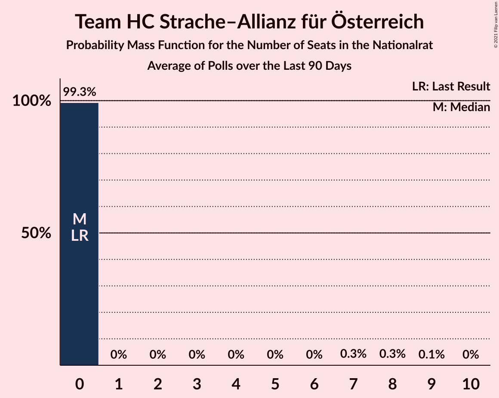

# Poll Average

<a href="#voting-intentions">Voting Intentions</a> | <a href="#seats">Seats</a> | <a href="#coalitions">Coalitions</a> | <a href="#technical-information">Technical Information</a>

## Summary

The table below lists the polls on which the average is based. They are the most recent polls (less than 90 days old) registered and analyzed so far.

| Period     | Polling firm/Commissioner(s) | ÖVP | SPÖ | FPÖ | GRÜNE | NEOS | JETZT | G!LT | HC |
|:----------:|:----------------------------:|:--:|:--:|:--:|:--:|:--:|:--:|:--:|:--:|
| 29 September 2019 | General Election | 37.5%   71 | 21.2%   40 | 16.2%   31 | 13.9%   26 | 8.1%   15 | 1.9%   0 | 0.0%   0 | 0.0%   0 |
| N/A | Poll Average | 33–43%   61–80 | 20–27%   38–50 | 11–20%   20–37 | 9–16%   16–30 | 7–13%   13–23 | N/A   N/A | N/A   N/A | N/A   N/A |
| [8–11 February 2021](2021-02-11-UniqueResearch.html) | Unique Research   profil | N/A   N/A | N/A   N/A | N/A   N/A | N/A   N/A | N/A   N/A | N/A   N/A | N/A   N/A | N/A   N/A |
| [8–11 February 2021](2021-02-11-ResearchAffairs.html) | Research Affairs   ÖSTERREICH | N/A   N/A | N/A   N/A | N/A   N/A | N/A   N/A | N/A   N/A | N/A   N/A | N/A   N/A | N/A   N/A |
| [25 January–1 February 2021](2021-02-01-IFDD.html) | IFDD   Kronen Zeitung | 32–38%   59–72 | 21–27%   39–51 | 15–21%   29–39 | 8–12%   15–23 | 9–13%   17–25 | N/A   N/A | N/A   N/A | N/A   N/A |
| [17–21 December 2020](2020-12-21-Market.html) | Market   Der Standard | 36–42%   67–80 | 20–26%   38–49 | 11–15%   20–29 | 12–17%   22–31 | 7–11%   13–21 | N/A   N/A | N/A   N/A | N/A   N/A |
| [15–17 December 2020](2020-12-17-OGM.html) | OGM   KURIER | 37–44%   69–82 | 20–26%   38–49 | 11–16%   20–29 | 11–16%   20–29 | 7–11%   13–20 | N/A   N/A | N/A   N/A | N/A   N/A |
| 29 September 2019 | General Election | 37.5%   71 | 21.2%   40 | 16.2%   31 | 13.9%   26 | 8.1%   15 | 1.9%   0 | 0.0%   0 | 0.0%   0 |

Only polls for which at least the sample size has been published are included in the table above.

**Legend:**
+ **Top half of each row:** Voting intentions (95% confidence interval)
+ **Bottom half of each row:** Seat projections for the Nationalrat (95% confidence interval)
+ **ÖVP:** Österreichische Volkspartei
+ **SPÖ:** Sozialdemokratische Partei Österreichs
+ **FPÖ:** Freiheitliche Partei Österreichs
+ **GRÜNE:** Die Grünen–Die Grüne Alternative
+ **NEOS:** NEOS–Das Neue Österreich und Liberales Forum
+ **JETZT:** JETZT–Liste Pilz
+ **G!LT:** Meine Stimme G!LT
+ **HC:** Team HC Strache–Allianz für Österreich
+ **N/A (single party):** Party not included the published results
+ **N/A (entire row):** Calculation for this opinion poll not started yet

## Voting Intentions

### Confidence Intervals

| Party | Last Result | Median | 80% Confidence Interval | 90% Confidence Interval | 95% Confidence Interval | 99% Confidence Interval |
|:-----:|:-----------:|:------:|:-----------------------:|:-----------------------:|:-----------------------:|:-----------------------:|
| <a href="#österreichische-volkspartei">Österreichische Volkspartei</a> | 37.5% | 38.4% | 34.1–41.4% |33.3–42.2% | 32.6–42.8% | 31.4–44.0% |
| <a href="#sozialdemokratische-partei-österreichs">Sozialdemokratische Partei Österreichs</a> | 21.2% | 23.4% | 21.4–25.4% |20.9–26.0% | 20.4–26.6% | 19.6–27.6% |
| <a href="#freiheitliche-partei-österreichs">Freiheitliche Partei Österreichs</a> | 16.2% | 13.8% | 11.8–18.8% |11.4–19.5% | 11.0–20.1% | 10.3–21.1% |
| <a href="#die-grünen–die-grüne-alternative">Die Grünen–Die Grüne Alternative</a> | 13.9% | 12.7% | 9.5–14.9% |9.0–15.5% | 8.6–16.0% | 7.9–16.9% |
| <a href="#neos–das-neue-österreich-und-liberales-forum">NEOS–Das Neue Österreich und Liberales Forum</a> | 8.1% | 9.6% | 8.0–11.7% |7.7–12.3% | 7.4–12.7% | 6.8–13.6% |
| <a href="#jetzt–liste-pilz">JETZT–Liste Pilz</a> | 1.9% | N/A | N/A |N/A | N/A | N/A |
| <a href="#meine-stimme-g!lt">Meine Stimme G!LT</a> | 0.0% | N/A | N/A |N/A | N/A | N/A |
| <a href="#team-hc-strache–allianz-für-österreich">Team HC Strache–Allianz für Österreich</a> | 0.0% | N/A | N/A |N/A | N/A | N/A |

### Österreichische Volkspartei

*For a full overview of the results for this party, see the [Österreichische Volkspartei](party-österreichischevolkspartei.html) page.*

| Voting Intentions | Probability | Accumulated | Special Marks |
|:-----------------:|:-----------:|:-----------:|:-------------:|
| 28.5–29.5% | 0% | 100% |  |
| 29.5–30.5% | 0.1% | 100% |  |
| 30.5–31.5% | 0.5% | 99.9% |  |
| 31.5–32.5% | 2% | 99.4% |  |
| 32.5–33.5% | 4% | 98% |  |
| 33.5–34.5% | 7% | 94% |  |
| 34.5–35.5% | 8% | 87% |  |
| 35.5–36.5% | 9% | 79% |  |
| 36.5–37.5% | 10% | 70% |  |
| 37.5–38.5% | 12% | 60% | Last Result, Median |
| 38.5–39.5% | 15% | 48% |  |
| 39.5–40.5% | 14% | 34% |  |
| 40.5–41.5% | 11% | 20% |  |
| 41.5–42.5% | 6% | 9% |  |
| 42.5–43.5% | 2% | 3% |  |
| 43.5–44.5% | 0.7% | 1.0% |  |
| 44.5–45.5% | 0.2% | 0.2% |  |
| 45.5–46.5% | 0% | 0% |  |

### Sozialdemokratische Partei Österreichs

*For a full overview of the results for this party, see the [Sozialdemokratische Partei Österreichs](party-sozialdemokratischeparteiösterreichs.html) page.*

| Voting Intentions | Probability | Accumulated | Special Marks |
|:-----------------:|:-----------:|:-----------:|:-------------:|
| 17.5–18.5% | 0% | 100% |  |
| 18.5–19.5% | 0.5% | 100% |  |
| 19.5–20.5% | 2% | 99.5% |  |
| 20.5–21.5% | 9% | 97% | Last Result |
| 21.5–22.5% | 18% | 88% |  |
| 22.5–23.5% | 24% | 70% | Median |
| 23.5–24.5% | 23% | 46% |  |
| 24.5–25.5% | 14% | 23% |  |
| 25.5–26.5% | 6% | 9% |  |
| 26.5–27.5% | 2% | 3% |  |
| 27.5–28.5% | 0.4% | 0.5% |  |
| 28.5–29.5% | 0.1% | 0.1% |  |
| 29.5–30.5% | 0% | 0% |  |

### Freiheitliche Partei Österreichs

*For a full overview of the results for this party, see the [Freiheitliche Partei Österreichs](party-freiheitlicheparteiösterreichs.html) page.*

| Voting Intentions | Probability | Accumulated | Special Marks |
|:-----------------:|:-----------:|:-----------:|:-------------:|
| 8.5–9.5% | 0% | 100% |  |
| 9.5–10.5% | 0.8% | 100% |  |
| 10.5–11.5% | 6% | 99.1% |  |
| 11.5–12.5% | 16% | 93% |  |
| 12.5–13.5% | 22% | 78% |  |
| 13.5–14.5% | 15% | 56% | Median |
| 14.5–15.5% | 7% | 40% |  |
| 15.5–16.5% | 5% | 34% | Last Result |
| 16.5–17.5% | 8% | 29% |  |
| 17.5–18.5% | 10% | 22% |  |
| 18.5–19.5% | 7% | 12% |  |
| 19.5–20.5% | 3% | 5% |  |
| 20.5–21.5% | 1.0% | 1.3% |  |
| 21.5–22.5% | 0.2% | 0.2% |  |
| 22.5–23.5% | 0% | 0% |  |

### Die Grünen–Die Grüne Alternative

*For a full overview of the results for this party, see the [Die Grünen–Die Grüne Alternative](party-diegrünen–diegrünealternative.html) page.*

| Voting Intentions | Probability | Accumulated | Special Marks |
|:-----------------:|:-----------:|:-----------:|:-------------:|
| 5.5–6.5% | 0% | 100% |  |
| 6.5–7.5% | 0.2% | 100% |  |
| 7.5–8.5% | 2% | 99.8% |  |
| 8.5–9.5% | 8% | 98% |  |
| 9.5–10.5% | 12% | 90% |  |
| 10.5–11.5% | 11% | 77% |  |
| 11.5–12.5% | 13% | 66% |  |
| 12.5–13.5% | 19% | 52% | Median |
| 13.5–14.5% | 18% | 33% | Last Result |
| 14.5–15.5% | 10% | 15% |  |
| 15.5–16.5% | 4% | 5% |  |
| 16.5–17.5% | 0.8% | 0.9% |  |
| 17.5–18.5% | 0.1% | 0.1% |  |
| 18.5–19.5% | 0% | 0% |  |

### NEOS–Das Neue Österreich und Liberales Forum

*For a full overview of the results for this party, see the [NEOS–Das Neue Österreich und Liberales Forum](party-neos–dasneueösterreichundliberalesforum.html) page.*

| Voting Intentions | Probability | Accumulated | Special Marks |
|:-----------------:|:-----------:|:-----------:|:-------------:|
| 4.5–5.5% | 0% | 100% |  |
| 5.5–6.5% | 0.2% | 100% |  |
| 6.5–7.5% | 4% | 99.8% |  |
| 7.5–8.5% | 17% | 96% | Last Result |
| 8.5–9.5% | 28% | 79% |  |
| 9.5–10.5% | 24% | 52% | Median |
| 10.5–11.5% | 16% | 28% |  |
| 11.5–12.5% | 8% | 12% |  |
| 12.5–13.5% | 3% | 3% |  |
| 13.5–14.5% | 0.5% | 0.6% |  |
| 14.5–15.5% | 0.1% | 0.1% |  |
| 15.5–16.5% | 0% | 0% |  |

## Seats

### Confidence Intervals

| Party | Last Result | Median | 80% Confidence Interval | 90% Confidence Interval | 95% Confidence Interval | 99% Confidence Interval |
|:-----:|:-----------:|:------:|:-----------------------:|:-----------------------:|:-----------------------:|:-----------------------:|
| <a href="#österreichische-volkspartei">Österreichische Volkspartei</a> | 71 | 72 | 64–78 |62–79 | 61–80 | 59–82 |
| <a href="#sozialdemokratische-partei-österreichs">Sozialdemokratische Partei Österreichs</a> | 40 | 44 | 40–47 |39–49 | 38–50 | 36–51 |
| <a href="#freiheitliche-partei-österreichs">Freiheitliche Partei Österreichs</a> | 31 | 26 | 22–35 |21–36 | 20–37 | 19–39 |
| <a href="#die-grünen–die-grüne-alternative">Die Grünen–Die Grüne Alternative</a> | 26 | 23 | 17–28 |16–29 | 16–30 | 14–31 |
| <a href="#neos–das-neue-österreich-und-liberales-forum">NEOS–Das Neue Österreich und Liberales Forum</a> | 15 | 18 | 15–22 |14–23 | 13–23 | 12–25 |
| <a href="#jetzt–liste-pilz">JETZT–Liste Pilz</a> | 0 | N/A | N/A |N/A | N/A | N/A |
| <a href="#meine-stimme-g!lt">Meine Stimme G!LT</a> | 0 | N/A | N/A |N/A | N/A | N/A |
| <a href="#team-hc-strache–allianz-für-österreich">Team HC Strache–Allianz für Österreich</a> | 0 | N/A | N/A |N/A | N/A | N/A |

### Österreichische Volkspartei

*For a full overview of the results for this party, see the [Österreichische Volkspartei](party-österreichischevolkspartei.html) page.*

| Number of Seats | Probability | Accumulated | Special Marks |
|:---------------:|:-----------:|:-----------:|:-------------:|
| 56 | 0% | 100% |  |
| 57 | 0.1% | 99.9% |  |
| 58 | 0.2% | 99.8% |  |
| 59 | 0.5% | 99.6% |  |
| 60 | 0.9% | 99.1% |  |
| 61 | 2% | 98% |  |
| 62 | 2% | 97% |  |
| 63 | 3% | 94% |  |
| 64 | 4% | 91% |  |
| 65 | 4% | 88% |  |
| 66 | 5% | 83% |  |
| 67 | 5% | 79% |  |
| 68 | 5% | 74% |  |
| 69 | 5% | 69% |  |
| 70 | 5% | 65% |  |
| 71 | 6% | 59% | Last Result |
| 72 | 7% | 53% | Median |
| 73 | 8% | 46% |  |
| 74 | 8% | 39% |  |
| 75 | 8% | 30% |  |
| 76 | 7% | 23% |  |
| 77 | 6% | 16% |  |
| 78 | 4% | 10% |  |
| 79 | 3% | 7% |  |
| 80 | 2% | 4% |  |
| 81 | 1.0% | 2% |  |
| 82 | 0.6% | 1.0% |  |
| 83 | 0.3% | 0.5% |  |
| 84 | 0.1% | 0.2% |  |
| 85 | 0% | 0.1% |  |
| 86 | 0% | 0% |  |

### Sozialdemokratische Partei Österreichs

*For a full overview of the results for this party, see the [Sozialdemokratische Partei Österreichs](party-sozialdemokratischeparteiösterreichs.html) page.*

| Number of Seats | Probability | Accumulated | Special Marks |
|:---------------:|:-----------:|:-----------:|:-------------:|
| 34 | 0% | 100% |  |
| 35 | 0.1% | 99.9% |  |
| 36 | 0.4% | 99.8% |  |
| 37 | 0.9% | 99.4% |  |
| 38 | 2% | 98% |  |
| 39 | 4% | 96% |  |
| 40 | 7% | 93% | Last Result |
| 41 | 10% | 86% |  |
| 42 | 12% | 76% |  |
| 43 | 14% | 64% |  |
| 44 | 13% | 50% | Median |
| 45 | 11% | 37% |  |
| 46 | 9% | 26% |  |
| 47 | 7% | 17% |  |
| 48 | 4% | 10% |  |
| 49 | 3% | 5% |  |
| 50 | 2% | 3% |  |
| 51 | 0.6% | 1.1% |  |
| 52 | 0.3% | 0.5% |  |
| 53 | 0.1% | 0.2% |  |
| 54 | 0% | 0.1% |  |
| 55 | 0% | 0% |  |

### Freiheitliche Partei Österreichs

*For a full overview of the results for this party, see the [Freiheitliche Partei Österreichs](party-freiheitlicheparteiösterreichs.html) page.*

| Number of Seats | Probability | Accumulated | Special Marks |
|:---------------:|:-----------:|:-----------:|:-------------:|
| 18 | 0.2% | 100% |  |
| 19 | 0.8% | 99.8% |  |
| 20 | 2% | 99.0% |  |
| 21 | 5% | 97% |  |
| 22 | 8% | 92% |  |
| 23 | 11% | 84% |  |
| 24 | 11% | 73% |  |
| 25 | 11% | 62% |  |
| 26 | 8% | 51% | Median |
| 27 | 5% | 43% |  |
| 28 | 3% | 38% |  |
| 29 | 2% | 35% |  |
| 30 | 3% | 32% |  |
| 31 | 3% | 30% | Last Result |
| 32 | 4% | 26% |  |
| 33 | 5% | 22% |  |
| 34 | 5% | 17% |  |
| 35 | 5% | 12% |  |
| 36 | 3% | 7% |  |
| 37 | 2% | 4% |  |
| 38 | 1.3% | 2% |  |
| 39 | 0.6% | 1.0% |  |
| 40 | 0.2% | 0.4% |  |
| 41 | 0.1% | 0.2% |  |
| 42 | 0% | 0.1% |  |
| 43 | 0% | 0% |  |

### Die Grünen–Die Grüne Alternative

*For a full overview of the results for this party, see the [Die Grünen–Die Grüne Alternative](party-diegrünen–diegrünealternative.html) page.*

| Number of Seats | Probability | Accumulated | Special Marks |
|:---------------:|:-----------:|:-----------:|:-------------:|
| 13 | 0.1% | 100% |  |
| 14 | 0.5% | 99.9% |  |
| 15 | 1.0% | 99.4% |  |
| 16 | 4% | 98% |  |
| 17 | 5% | 94% |  |
| 18 | 6% | 90% |  |
| 19 | 8% | 83% |  |
| 20 | 5% | 76% |  |
| 21 | 7% | 71% |  |
| 22 | 6% | 64% |  |
| 23 | 8% | 58% | Median |
| 24 | 11% | 49% |  |
| 25 | 11% | 39% |  |
| 26 | 10% | 28% | Last Result |
| 27 | 8% | 19% |  |
| 28 | 5% | 11% |  |
| 29 | 3% | 6% |  |
| 30 | 2% | 3% |  |
| 31 | 0.7% | 1.1% |  |
| 32 | 0.3% | 0.4% |  |
| 33 | 0.1% | 0.1% |  |
| 34 | 0% | 0% |  |

### NEOS–Das Neue Österreich und Liberales Forum

*For a full overview of the results for this party, see the [NEOS–Das Neue Österreich und Liberales Forum](party-neos–dasneueösterreichundliberalesforum.html) page.*

| Number of Seats | Probability | Accumulated | Special Marks |
|:---------------:|:-----------:|:-----------:|:-------------:|
| 11 | 0.1% | 100% |  |
| 12 | 0.6% | 99.9% |  |
| 13 | 2% | 99.3% |  |
| 14 | 6% | 97% |  |
| 15 | 11% | 91% | Last Result |
| 16 | 14% | 81% |  |
| 17 | 15% | 67% |  |
| 18 | 14% | 52% | Median |
| 19 | 11% | 38% |  |
| 20 | 10% | 27% |  |
| 21 | 7% | 17% |  |
| 22 | 5% | 11% |  |
| 23 | 3% | 6% |  |
| 24 | 1.4% | 2% |  |
| 25 | 0.7% | 1.0% |  |
| 26 | 0.2% | 0.3% |  |
| 27 | 0.1% | 0.1% |  |
| 28 | 0% | 0% |  |

### JETZT–Liste Pilz

*For a full overview of the results for this party, see the [JETZT–Liste Pilz](party-jetzt–listepilz.html) page.*

### Meine Stimme G!LT

*For a full overview of the results for this party, see the [Meine Stimme G!LT](party-meinestimmeglt.html) page.*

### Team HC Strache–Allianz für Österreich

*For a full overview of the results for this party, see the [Team HC Strache–Allianz für Österreich](party-teamhcstrache–allianzfürösterreich.html) page.*

## Coalitions

### Confidence Intervals

| Coalition | Last Result | Median | Majority? | 80% Confidence Interval | 90% Confidence Interval | 95% Confidence Interval | 99% Confidence Interval |
|:---------:|:-----------:|:------:|:---------:|:-----------------------:|:-----------------------:|:-----------------------:|:-----------------------:|
| Österreichische Volkspartei – Sozialdemokratische Partei Österreichs | 111 | 115 | 100% | 109–121 | 107–122 | 106–123 | 103–125 |
| Österreichische Volkspartei – Die Grünen–Die Grüne Alternative – NEOS–Das Neue Österreich und Liberales Forum | 112 | 114 | 100% | 103–119 | 101–120 | 100–121 | 97–123 |
| Österreichische Volkspartei – Freiheitliche Partei Österreichs | 102 | 99 | 98% | 94–103 | 93–104 | 92–105 | 90–107 |
| Österreichische Volkspartei – Die Grünen–Die Grüne Alternative | 97 | 97 | 66% | 82–103 | 81–104 | 79–105 | 77–107 |
| Österreichische Volkspartei – NEOS–Das Neue Österreich und Liberales Forum | 86 | 89 | 29% | 84–94 | 82–96 | 81–97 | 79–99 |
| Sozialdemokratische Partei Österreichs – Die Grünen–Die Grüne Alternative – NEOS–Das Neue Österreich und Liberales Forum | 81 | 84 | 2% | 80–89 | 79–90 | 78–91 | 76–93 |
| Sozialdemokratische Partei Österreichs – Freiheitliche Partei Österreichs | 71 | 69 | 0% | 64–80 | 63–82 | 62–83 | 60–86 |
| Österreichische Volkspartei | 71 | 72 | 0% | 64–78 | 62–79 | 61–80 | 59–82 |
| Sozialdemokratische Partei Österreichs – Die Grünen–Die Grüne Alternative | 66 | 67 | 0% | 61–72 | 60–73 | 59–74 | 57–76 |
| Sozialdemokratische Partei Österreichs | 40 | 44 | 0% | 40–47 | 39–49 | 38–50 | 36–51 |

### Österreichische Volkspartei – Sozialdemokratische Partei Österreichs

| Number of Seats | Probability | Accumulated | Special Marks |
|:---------------:|:-----------:|:-----------:|:-------------:|
| 101 | 0.1% | 100% |  |
| 102 | 0.2% | 99.9% |  |
| 103 | 0.3% | 99.7% |  |
| 104 | 0.6% | 99.4% |  |
| 105 | 1.0% | 98.8% |  |
| 106 | 2% | 98% |  |
| 107 | 2% | 96% |  |
| 108 | 3% | 94% |  |
| 109 | 4% | 91% |  |
| 110 | 5% | 86% |  |
| 111 | 5% | 81% | Last Result |
| 112 | 6% | 76% |  |
| 113 | 7% | 70% |  |
| 114 | 8% | 63% |  |
| 115 | 8% | 56% |  |
| 116 | 8% | 48% | Median |
| 117 | 9% | 40% |  |
| 118 | 8% | 31% |  |
| 119 | 7% | 23% |  |
| 120 | 6% | 16% |  |
| 121 | 4% | 11% |  |
| 122 | 3% | 6% |  |
| 123 | 2% | 4% |  |
| 124 | 0.9% | 2% |  |
| 125 | 0.5% | 0.9% |  |
| 126 | 0.2% | 0.4% |  |
| 127 | 0.1% | 0.1% |  |
| 128 | 0% | 0.1% |  |
| 129 | 0% | 0% |  |

### Österreichische Volkspartei – Die Grünen–Die Grüne Alternative – NEOS–Das Neue Österreich und Liberales Forum

| Number of Seats | Probability | Accumulated | Special Marks |
|:---------------:|:-----------:|:-----------:|:-------------:|
| 95 | 0.1% | 100% |  |
| 96 | 0.2% | 99.9% |  |
| 97 | 0.3% | 99.7% |  |
| 98 | 0.6% | 99.5% |  |
| 99 | 1.0% | 98.9% |  |
| 100 | 2% | 98% |  |
| 101 | 2% | 96% |  |
| 102 | 3% | 94% |  |
| 103 | 3% | 91% |  |
| 104 | 4% | 88% |  |
| 105 | 4% | 83% |  |
| 106 | 4% | 80% |  |
| 107 | 3% | 76% |  |
| 108 | 3% | 72% |  |
| 109 | 3% | 70% |  |
| 110 | 3% | 67% |  |
| 111 | 3% | 64% |  |
| 112 | 4% | 61% | Last Result |
| 113 | 6% | 57% | Median |
| 114 | 7% | 51% |  |
| 115 | 8% | 44% |  |
| 116 | 8% | 37% |  |
| 117 | 8% | 28% |  |
| 118 | 7% | 20% |  |
| 119 | 5% | 13% |  |
| 120 | 4% | 8% |  |
| 121 | 2% | 5% |  |
| 122 | 1.3% | 2% |  |
| 123 | 0.6% | 1.1% |  |
| 124 | 0.3% | 0.5% |  |
| 125 | 0.1% | 0.2% |  |
| 126 | 0% | 0.1% |  |
| 127 | 0% | 0% |  |

### Österreichische Volkspartei – Freiheitliche Partei Österreichs

| Number of Seats | Probability | Accumulated | Special Marks |
|:---------------:|:-----------:|:-----------:|:-------------:|
| 87 | 0% | 100% |  |
| 88 | 0.1% | 99.9% |  |
| 89 | 0.2% | 99.8% |  |
| 90 | 0.6% | 99.6% |  |
| 91 | 1.0% | 99.0% |  |
| 92 | 2% | 98% | Majority |
| 93 | 3% | 96% |  |
| 94 | 5% | 93% |  |
| 95 | 7% | 88% |  |
| 96 | 8% | 82% |  |
| 97 | 10% | 73% |  |
| 98 | 12% | 63% | Median |
| 99 | 12% | 51% |  |
| 100 | 11% | 39% |  |
| 101 | 9% | 29% |  |
| 102 | 7% | 20% | Last Result |
| 103 | 5% | 13% |  |
| 104 | 3% | 7% |  |
| 105 | 2% | 4% |  |
| 106 | 1.1% | 2% |  |
| 107 | 0.6% | 1.0% |  |
| 108 | 0.2% | 0.4% |  |
| 109 | 0.1% | 0.2% |  |
| 110 | 0% | 0.1% |  |
| 111 | 0% | 0% |  |

### Österreichische Volkspartei – Die Grünen–Die Grüne Alternative

| Number of Seats | Probability | Accumulated | Special Marks |
|:---------------:|:-----------:|:-----------:|:-------------:|
| 74 | 0% | 100% |  |
| 75 | 0.1% | 99.9% |  |
| 76 | 0.2% | 99.9% |  |
| 77 | 0.4% | 99.7% |  |
| 78 | 0.8% | 99.3% |  |
| 79 | 1.2% | 98% |  |
| 80 | 2% | 97% |  |
| 81 | 2% | 95% |  |
| 82 | 3% | 93% |  |
| 83 | 4% | 90% |  |
| 84 | 4% | 86% |  |
| 85 | 4% | 82% |  |
| 86 | 4% | 78% |  |
| 87 | 3% | 74% |  |
| 88 | 2% | 72% |  |
| 89 | 1.4% | 70% |  |
| 90 | 1.0% | 68% |  |
| 91 | 0.9% | 67% |  |
| 92 | 1.0% | 66% | Majority |
| 93 | 2% | 65% |  |
| 94 | 2% | 64% |  |
| 95 | 4% | 61% | Median |
| 96 | 5% | 58% |  |
| 97 | 6% | 53% | Last Result |
| 98 | 8% | 47% |  |
| 99 | 8% | 39% |  |
| 100 | 7% | 31% |  |
| 101 | 7% | 24% |  |
| 102 | 6% | 16% |  |
| 103 | 4% | 10% |  |
| 104 | 3% | 6% |  |
| 105 | 2% | 3% |  |
| 106 | 0.9% | 2% |  |
| 107 | 0.5% | 0.9% |  |
| 108 | 0.2% | 0.4% |  |
| 109 | 0.1% | 0.2% |  |
| 110 | 0% | 0.1% |  |
| 111 | 0% | 0% |  |

### Österreichische Volkspartei – NEOS–Das Neue Österreich und Liberales Forum

| Number of Seats | Probability | Accumulated | Special Marks |
|:---------------:|:-----------:|:-----------:|:-------------:|
| 76 | 0% | 100% |  |
| 77 | 0.1% | 99.9% |  |
| 78 | 0.2% | 99.8% |  |
| 79 | 0.5% | 99.6% |  |
| 80 | 0.9% | 99.1% |  |
| 81 | 1.4% | 98% |  |
| 82 | 2% | 97% |  |
| 83 | 3% | 95% |  |
| 84 | 5% | 91% |  |
| 85 | 6% | 87% |  |
| 86 | 7% | 81% | Last Result |
| 87 | 8% | 74% |  |
| 88 | 9% | 66% |  |
| 89 | 10% | 57% |  |
| 90 | 9% | 48% | Median |
| 91 | 9% | 38% |  |
| 92 | 8% | 29% | Majority |
| 93 | 7% | 21% |  |
| 94 | 5% | 14% |  |
| 95 | 4% | 9% |  |
| 96 | 2% | 6% |  |
| 97 | 2% | 3% |  |
| 98 | 0.8% | 2% |  |
| 99 | 0.5% | 0.8% |  |
| 100 | 0.2% | 0.3% |  |
| 101 | 0.1% | 0.1% |  |
| 102 | 0% | 0.1% |  |
| 103 | 0% | 0% |  |

### Sozialdemokratische Partei Österreichs – Die Grünen–Die Grüne Alternative – NEOS–Das Neue Österreich und Liberales Forum

| Number of Seats | Probability | Accumulated | Special Marks |
|:---------------:|:-----------:|:-----------:|:-------------:|
| 73 | 0% | 100% |  |
| 74 | 0.1% | 99.9% |  |
| 75 | 0.2% | 99.8% |  |
| 76 | 0.6% | 99.6% |  |
| 77 | 1.1% | 99.0% |  |
| 78 | 2% | 98% |  |
| 79 | 3% | 96% |  |
| 80 | 5% | 93% |  |
| 81 | 7% | 87% | Last Result |
| 82 | 9% | 80% |  |
| 83 | 11% | 71% |  |
| 84 | 12% | 61% |  |
| 85 | 12% | 49% | Median |
| 86 | 10% | 37% |  |
| 87 | 8% | 27% |  |
| 88 | 7% | 18% |  |
| 89 | 5% | 12% |  |
| 90 | 3% | 7% |  |
| 91 | 2% | 4% |  |
| 92 | 1.0% | 2% | Majority |
| 93 | 0.6% | 1.0% |  |
| 94 | 0.2% | 0.4% |  |
| 95 | 0.1% | 0.2% |  |
| 96 | 0% | 0.1% |  |
| 97 | 0% | 0% |  |

### Sozialdemokratische Partei Österreichs – Freiheitliche Partei Österreichs

| Number of Seats | Probability | Accumulated | Special Marks |
|:---------------:|:-----------:|:-----------:|:-------------:|
| 57 | 0% | 100% |  |
| 58 | 0.1% | 99.9% |  |
| 59 | 0.3% | 99.8% |  |
| 60 | 0.6% | 99.5% |  |
| 61 | 1.3% | 98.9% |  |
| 62 | 2% | 98% |  |
| 63 | 4% | 95% |  |
| 64 | 5% | 92% |  |
| 65 | 7% | 87% |  |
| 66 | 8% | 80% |  |
| 67 | 8% | 72% |  |
| 68 | 8% | 63% |  |
| 69 | 7% | 56% |  |
| 70 | 6% | 49% | Median |
| 71 | 4% | 43% | Last Result |
| 72 | 3% | 39% |  |
| 73 | 3% | 35% |  |
| 74 | 3% | 33% |  |
| 75 | 3% | 30% |  |
| 76 | 3% | 27% |  |
| 77 | 4% | 24% |  |
| 78 | 4% | 20% |  |
| 79 | 4% | 17% |  |
| 80 | 3% | 12% |  |
| 81 | 3% | 9% |  |
| 82 | 2% | 6% |  |
| 83 | 2% | 4% |  |
| 84 | 1.0% | 2% |  |
| 85 | 0.6% | 1.1% |  |
| 86 | 0.3% | 0.5% |  |
| 87 | 0.2% | 0.2% |  |
| 88 | 0.1% | 0.1% |  |
| 89 | 0% | 0% |  |

### Österreichische Volkspartei

| Number of Seats | Probability | Accumulated | Special Marks |
|:---------------:|:-----------:|:-----------:|:-------------:|
| 56 | 0% | 100% |  |
| 57 | 0.1% | 99.9% |  |
| 58 | 0.2% | 99.8% |  |
| 59 | 0.5% | 99.6% |  |
| 60 | 0.9% | 99.1% |  |
| 61 | 2% | 98% |  |
| 62 | 2% | 97% |  |
| 63 | 3% | 94% |  |
| 64 | 4% | 91% |  |
| 65 | 4% | 88% |  |
| 66 | 5% | 83% |  |
| 67 | 5% | 79% |  |
| 68 | 5% | 74% |  |
| 69 | 5% | 69% |  |
| 70 | 5% | 65% |  |
| 71 | 6% | 59% | Last Result |
| 72 | 7% | 53% | Median |
| 73 | 8% | 46% |  |
| 74 | 8% | 39% |  |
| 75 | 8% | 30% |  |
| 76 | 7% | 23% |  |
| 77 | 6% | 16% |  |
| 78 | 4% | 10% |  |
| 79 | 3% | 7% |  |
| 80 | 2% | 4% |  |
| 81 | 1.0% | 2% |  |
| 82 | 0.6% | 1.0% |  |
| 83 | 0.3% | 0.5% |  |
| 84 | 0.1% | 0.2% |  |
| 85 | 0% | 0.1% |  |
| 86 | 0% | 0% |  |

### Sozialdemokratische Partei Österreichs – Die Grünen–Die Grüne Alternative

| Number of Seats | Probability | Accumulated | Special Marks |
|:---------------:|:-----------:|:-----------:|:-------------:|
| 54 | 0% | 100% |  |
| 55 | 0.1% | 99.9% |  |
| 56 | 0.3% | 99.8% |  |
| 57 | 0.6% | 99.6% |  |
| 58 | 1.0% | 99.0% |  |
| 59 | 2% | 98% |  |
| 60 | 3% | 96% |  |
| 61 | 4% | 93% |  |
| 62 | 5% | 89% |  |
| 63 | 7% | 84% |  |
| 64 | 8% | 77% |  |
| 65 | 9% | 69% |  |
| 66 | 9% | 61% | Last Result |
| 67 | 10% | 51% | Median |
| 68 | 10% | 41% |  |
| 69 | 8% | 31% |  |
| 70 | 7% | 23% |  |
| 71 | 6% | 16% |  |
| 72 | 4% | 10% |  |
| 73 | 3% | 6% |  |
| 74 | 2% | 4% |  |
| 75 | 0.9% | 2% |  |
| 76 | 0.5% | 0.9% |  |
| 77 | 0.3% | 0.4% |  |
| 78 | 0.1% | 0.2% |  |
| 79 | 0% | 0.1% |  |
| 80 | 0% | 0% |  |

### Sozialdemokratische Partei Österreichs

| Number of Seats | Probability | Accumulated | Special Marks |
|:---------------:|:-----------:|:-----------:|:-------------:|
| 34 | 0% | 100% |  |
| 35 | 0.1% | 99.9% |  |
| 36 | 0.4% | 99.8% |  |
| 37 | 0.9% | 99.4% |  |
| 38 | 2% | 98% |  |
| 39 | 4% | 96% |  |
| 40 | 7% | 93% | Last Result |
| 41 | 10% | 86% |  |
| 42 | 12% | 76% |  |
| 43 | 14% | 64% |  |
| 44 | 13% | 50% | Median |
| 45 | 11% | 37% |  |
| 46 | 9% | 26% |  |
| 47 | 7% | 17% |  |
| 48 | 4% | 10% |  |
| 49 | 3% | 5% |  |
| 50 | 2% | 3% |  |
| 51 | 0.6% | 1.1% |  |
| 52 | 0.3% | 0.5% |  |
| 53 | 0.1% | 0.2% |  |
| 54 | 0% | 0.1% |  |
| 55 | 0% | 0% |  |

## Technical Information

+ **Number of polls included in this average:** 5
+ **Lowest number of simulations done in a poll included in this average:** 0
+ **Total number of simulations done in the polls included in this average:** 3,145,728
+ **Error estimate:** 0.79%
