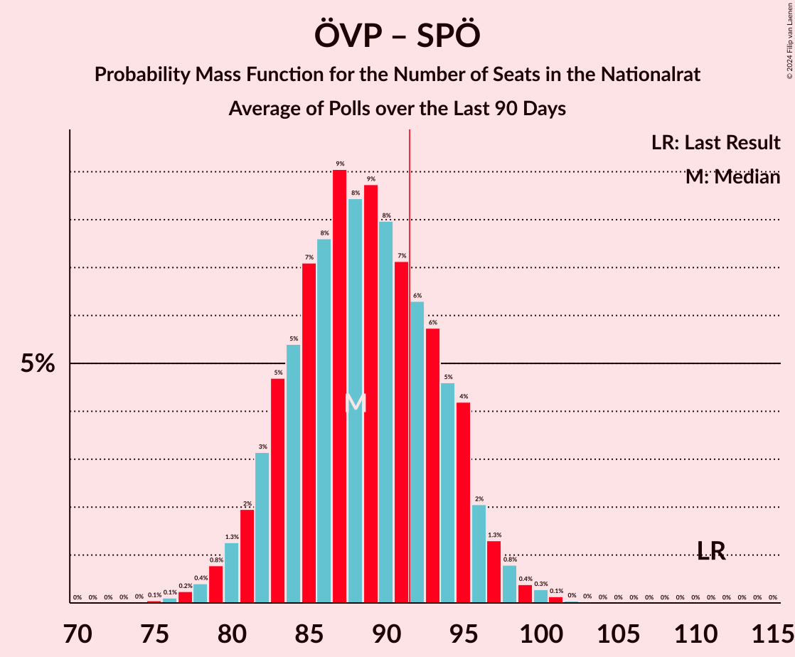

# Poll Average

<a href="#voting-intentions">Voting Intentions</a> | <a href="#seats">Seats</a> | <a href="#coalitions">Coalitions</a> | <a href="#technical-information">Technical Information</a>

## Summary

The table below lists the polls on which the average is based. They are the most recent polls (less than 90 days old) registered and analyzed so far.

| Period     | Polling firm/Commissioner(s) | ÖVP | SPÖ | FPÖ | NEOS | JETZT | GRÜNE | G!LT |
|:----------:|:----------------------------:|:--:|:--:|:--:|:--:|:--:|:--:|:--:|
| 15 October 2017 | General Election | 31.5%   62 | 26.9%   52 | 26.0%   51 | 5.3%   10 | 4.4%   8 | 3.8%   0 | 1.0%   0 |
| N/A | Poll Average | 31–38%   59–72 | 19–25%   36–47 | 17–23%   32–43 | 7–11%   13–21 | 1–3%   0 | 9–14%   17–27 | N/A   N/A |
| [2–13 September 2019](2019-09-13-UniqueResearch.html) | Unique Research   profil | 31–35%   60–67 | 20–24%   39–45 | 18–22%   35–41 | 7–9%   13–17 | 2–3%   0 | 12–14%   22–27 | N/A   N/A |
| [6–13 September 2019](2019-09-13-OGM.html) | OGM   KURIER | N/A   N/A | N/A   N/A | N/A   N/A | N/A   N/A | N/A   N/A | N/A   N/A | N/A   N/A |
| [6–11 September 2019](2019-09-11-ResearchAffairs.html) | Research Affairs   ÖSTERREICH | 31–39%   58–75 | 19–26%   35–49 | 16–23%   30–43 | 7–12%   12–22 | 0–2%   0 | 9–14%   16–26 | N/A   N/A |
| [5–10 September 2019](2019-09-10-Karmasin.html) | Karmasin   PULS 24 | 33–37%   63–70 | 21–24%   39–44 | 18–20%   33–39 | 8–10%   15–19 | 2–3%   0 | 11–13%   20–25 | N/A   N/A |
| [2–4 September 2019](2019-09-04-Market.html) | Market   Der Standard | 31–37%   58–71 | 19–25%   36–47 | 18–24%   34–45 | 7–11%   13–21 | 1–3%   0 | 9–13%   17–25 | N/A   N/A |
| 15 October 2017 | General Election | 31.5%   62 | 26.9%   52 | 26.0%   51 | 5.3%   10 | 4.4%   8 | 3.8%   0 | 1.0%   0 |

Only polls for which at least the sample size has been published are included in the table above.

**Legend:**
+ **Top half of each row:** Voting intentions (95% confidence interval)
+ **Bottom half of each row:** Seat projections for the Nationalrat (95% confidence interval)
+ **ÖVP:** Österreichische Volkspartei
+ **SPÖ:** Sozialdemokratische Partei Österreichs
+ **FPÖ:** Freiheitliche Partei Österreichs
+ **NEOS:** NEOS–Das Neue Österreich und Liberales Forum
+ **JETZT:** JETZT–Liste Pilz
+ **GRÜNE:** Die Grünen–Die Grüne Alternative
+ **G!LT:** Meine Stimme G!LT
+ **N/A (single party):** Party not included the published results
+ **N/A (entire row):** Calculation for this opinion poll not started yet

## Voting Intentions

### Confidence Intervals

| Party | Last Result | Median | 80% Confidence Interval | 90% Confidence Interval | 95% Confidence Interval | 99% Confidence Interval |
|:-----:|:-----------:|:------:|:-----------------------:|:-----------------------:|:-----------------------:|:-----------------------:|
| <a href="#österreichische-volkspartei">Österreichische Volkspartei</a> | 31.5% | 34.3% | 32.2–36.4% |31.6–37.2% | 31.2–37.9% | 30.2–39.5% |
| <a href="#sozialdemokratische-partei-österreichs">Sozialdemokratische Partei Österreichs</a> | 26.9% | 22.0% | 20.5–23.6% |19.9–24.2% | 19.4–24.8% | 18.3–26.1% |
| <a href="#freiheitliche-partei-österreichs">Freiheitliche Partei Österreichs</a> | 26.0% | 19.7% | 18.1–21.7% |17.5–22.5% | 16.9–23.1% | 15.7–24.2% |
| <a href="#neos–das-neue-österreich-und-liberales-forum">NEOS–Das Neue Österreich und Liberales Forum</a> | 5.3% | 8.8% | 7.6–10.1% |7.3–10.6% | 7.1–11.1% | 6.6–12.0% |
| <a href="#jetzt–liste-pilz">JETZT–Liste Pilz</a> | 4.4% | 1.9% | 1.0–2.4% |0.8–2.6% | 0.6–2.8% | 0.4–3.3% |
| <a href="#die-grünen–die-grüne-alternative">Die Grünen–Die Grüne Alternative</a> | 3.8% | 11.9% | 10.1–13.4% |9.5–13.7% | 9.1–14.0% | 8.3–14.7% |
| <a href="#meine-stimme-g!lt">Meine Stimme G!LT</a> | 1.0% | N/A | N/A |N/A | N/A | N/A |

### Österreichische Volkspartei

*For a full overview of the results for this party, see the [Österreichische Volkspartei](party-österreichischevolkspartei.html) page.*

| Voting Intentions | Probability | Accumulated | Special Marks |
|:-----------------:|:-----------:|:-----------:|:-------------:|
| 27.5–28.5% | 0% | 100% |  |
| 28.5–29.5% | 0.1% | 100% |  |
| 29.5–30.5% | 0.7% | 99.8% |  |
| 30.5–31.5% | 3% | 99.1% | Last Result |
| 31.5–32.5% | 11% | 96% |  |
| 32.5–33.5% | 19% | 85% |  |
| 33.5–34.5% | 22% | 66% | Median |
| 34.5–35.5% | 22% | 43% |  |
| 35.5–36.5% | 13% | 22% |  |
| 36.5–37.5% | 5% | 9% |  |
| 37.5–38.5% | 2% | 4% |  |
| 38.5–39.5% | 0.9% | 1.4% |  |
| 39.5–40.5% | 0.3% | 0.5% |  |
| 40.5–41.5% | 0.1% | 0.1% |  |
| 41.5–42.5% | 0% | 0% |  |

### Sozialdemokratische Partei Österreichs

*For a full overview of the results for this party, see the [Sozialdemokratische Partei Österreichs](party-sozialdemokratischeparteiösterreichs.html) page.*

| Voting Intentions | Probability | Accumulated | Special Marks |
|:-----------------:|:-----------:|:-----------:|:-------------:|
| 15.5–16.5% | 0% | 100% |  |
| 16.5–17.5% | 0.1% | 100% |  |
| 17.5–18.5% | 0.6% | 99.9% |  |
| 18.5–19.5% | 2% | 99.2% |  |
| 19.5–20.5% | 7% | 97% |  |
| 20.5–21.5% | 23% | 89% |  |
| 21.5–22.5% | 36% | 67% | Median |
| 22.5–23.5% | 20% | 31% |  |
| 23.5–24.5% | 7% | 10% |  |
| 24.5–25.5% | 2% | 3% |  |
| 25.5–26.5% | 0.8% | 1.0% |  |
| 26.5–27.5% | 0.2% | 0.3% | Last Result |
| 27.5–28.5% | 0% | 0.1% |  |
| 28.5–29.5% | 0% | 0% |  |

### Freiheitliche Partei Österreichs

*For a full overview of the results for this party, see the [Freiheitliche Partei Österreichs](party-freiheitlicheparteiösterreichs.html) page.*

| Voting Intentions | Probability | Accumulated | Special Marks |
|:-----------------:|:-----------:|:-----------:|:-------------:|
| 12.5–13.5% | 0% | 100% |  |
| 13.5–14.5% | 0.1% | 100% |  |
| 14.5–15.5% | 0.3% | 99.9% |  |
| 15.5–16.5% | 1.3% | 99.6% |  |
| 16.5–17.5% | 4% | 98% |  |
| 17.5–18.5% | 13% | 95% |  |
| 18.5–19.5% | 28% | 82% |  |
| 19.5–20.5% | 27% | 54% | Median |
| 20.5–21.5% | 16% | 28% |  |
| 21.5–22.5% | 7% | 12% |  |
| 22.5–23.5% | 3% | 4% |  |
| 23.5–24.5% | 1.0% | 1.3% |  |
| 24.5–25.5% | 0.2% | 0.3% |  |
| 25.5–26.5% | 0% | 0% | Last Result |

### NEOS–Das Neue Österreich und Liberales Forum

*For a full overview of the results for this party, see the [NEOS–Das Neue Österreich und Liberales Forum](party-neos–dasneueösterreichundliberalesforum.html) page.*

| Voting Intentions | Probability | Accumulated | Special Marks |
|:-----------------:|:-----------:|:-----------:|:-------------:|
| 4.5–5.5% | 0% | 100% | Last Result |
| 5.5–6.5% | 0.5% | 100% |  |
| 6.5–7.5% | 8% | 99.5% |  |
| 7.5–8.5% | 32% | 91% |  |
| 8.5–9.5% | 38% | 59% | Median |
| 9.5–10.5% | 15% | 21% |  |
| 10.5–11.5% | 4% | 6% |  |
| 11.5–12.5% | 1.0% | 1.2% |  |
| 12.5–13.5% | 0.2% | 0.2% |  |
| 13.5–14.5% | 0% | 0% |  |

### JETZT–Liste Pilz

*For a full overview of the results for this party, see the [JETZT–Liste Pilz](party-jetzt–listepilz.html) page.*

| Voting Intentions | Probability | Accumulated | Special Marks |
|:-----------------:|:-----------:|:-----------:|:-------------:|
| 0.0–0.5% | 2% | 100% |  |
| 0.5–1.5% | 23% | 98% |  |
| 1.5–2.5% | 68% | 75% | Median |
| 2.5–3.5% | 7% | 7% |  |
| 3.5–4.5% | 0.2% | 0.2% | Last Result |
| 4.5–5.5% | 0% | 0% |  |

### Die Grünen–Die Grüne Alternative

*For a full overview of the results for this party, see the [Die Grünen–Die Grüne Alternative](party-diegrünen–diegrünealternative.html) page.*

| Voting Intentions | Probability | Accumulated | Special Marks |
|:-----------------:|:-----------:|:-----------:|:-------------:|
| 3.5–4.5% | 0% | 100% | Last Result |
| 4.5–5.5% | 0% | 100% |  |
| 5.5–6.5% | 0% | 100% |  |
| 6.5–7.5% | 0.1% | 100% |  |
| 7.5–8.5% | 0.8% | 99.9% |  |
| 8.5–9.5% | 4% | 99.2% |  |
| 9.5–10.5% | 12% | 95% |  |
| 10.5–11.5% | 21% | 83% |  |
| 11.5–12.5% | 32% | 62% | Median |
| 12.5–13.5% | 23% | 30% |  |
| 13.5–14.5% | 7% | 7% |  |
| 14.5–15.5% | 0.6% | 0.7% |  |
| 15.5–16.5% | 0% | 0.1% |  |
| 16.5–17.5% | 0% | 0% |  |

## Seats

### Confidence Intervals

| Party | Last Result | Median | 80% Confidence Interval | 90% Confidence Interval | 95% Confidence Interval | 99% Confidence Interval |
|:-----:|:-----------:|:------:|:-----------------------:|:-----------------------:|:-----------------------:|:-----------------------:|
| <a href="#österreichische-volkspartei">Österreichische Volkspartei</a> | 62 | 65 | 61–69 |60–70 | 59–72 | 57–75 |
| <a href="#sozialdemokratische-partei-österreichs">Sozialdemokratische Partei Österreichs</a> | 52 | 42 | 39–45 |38–46 | 36–47 | 34–49 |
| <a href="#freiheitliche-partei-österreichs">Freiheitliche Partei Österreichs</a> | 51 | 37 | 34–41 |33–42 | 32–43 | 29–46 |
| <a href="#neos–das-neue-österreich-und-liberales-forum">NEOS–Das Neue Österreich und Liberales Forum</a> | 10 | 16 | 14–19 |14–20 | 13–21 | 12–23 |
| <a href="#jetzt–liste-pilz">JETZT–Liste Pilz</a> | 8 | 0 | 0 |0 | 0 | 0 |
| <a href="#die-grünen–die-grüne-alternative">Die Grünen–Die Grüne Alternative</a> | 0 | 22 | 19–25 |18–26 | 17–27 | 15–28 |
| <a href="#meine-stimme-g!lt">Meine Stimme G!LT</a> | 0 | N/A | N/A |N/A | N/A | N/A |

### Österreichische Volkspartei

*For a full overview of the results for this party, see the [Österreichische Volkspartei](party-österreichischevolkspartei.html) page.*

| Number of Seats | Probability | Accumulated | Special Marks |
|:---------------:|:-----------:|:-----------:|:-------------:|
| 54 | 0% | 100% |  |
| 55 | 0.1% | 99.9% |  |
| 56 | 0.2% | 99.9% |  |
| 57 | 0.4% | 99.7% |  |
| 58 | 0.8% | 99.3% |  |
| 59 | 2% | 98% |  |
| 60 | 3% | 97% |  |
| 61 | 6% | 94% |  |
| 62 | 8% | 88% | Last Result |
| 63 | 11% | 80% |  |
| 64 | 12% | 69% |  |
| 65 | 14% | 57% | Median |
| 66 | 12% | 44% |  |
| 67 | 11% | 31% |  |
| 68 | 8% | 20% |  |
| 69 | 5% | 13% |  |
| 70 | 3% | 8% |  |
| 71 | 2% | 5% |  |
| 72 | 1.1% | 3% |  |
| 73 | 0.7% | 2% |  |
| 74 | 0.5% | 1.2% |  |
| 75 | 0.3% | 0.7% |  |
| 76 | 0.2% | 0.4% |  |
| 77 | 0.1% | 0.2% |  |
| 78 | 0.1% | 0.1% |  |
| 79 | 0% | 0.1% |  |
| 80 | 0% | 0% |  |

### Sozialdemokratische Partei Österreichs

*For a full overview of the results for this party, see the [Sozialdemokratische Partei Österreichs](party-sozialdemokratischeparteiösterreichs.html) page.*

| Number of Seats | Probability | Accumulated | Special Marks |
|:---------------:|:-----------:|:-----------:|:-------------:|
| 32 | 0.1% | 100% |  |
| 33 | 0.2% | 99.9% |  |
| 34 | 0.4% | 99.7% |  |
| 35 | 0.7% | 99.4% |  |
| 36 | 1.5% | 98.6% |  |
| 37 | 2% | 97% |  |
| 38 | 4% | 95% |  |
| 39 | 7% | 91% |  |
| 40 | 12% | 84% |  |
| 41 | 18% | 71% |  |
| 42 | 19% | 53% | Median |
| 43 | 14% | 34% |  |
| 44 | 9% | 20% |  |
| 45 | 5% | 11% |  |
| 46 | 3% | 6% |  |
| 47 | 1.4% | 3% |  |
| 48 | 0.8% | 2% |  |
| 49 | 0.5% | 0.9% |  |
| 50 | 0.2% | 0.4% |  |
| 51 | 0.1% | 0.2% |  |
| 52 | 0.1% | 0.1% | Last Result |
| 53 | 0% | 0% |  |

### Freiheitliche Partei Österreichs

*For a full overview of the results for this party, see the [Freiheitliche Partei Österreichs](party-freiheitlicheparteiösterreichs.html) page.*

| Number of Seats | Probability | Accumulated | Special Marks |
|:---------------:|:-----------:|:-----------:|:-------------:|
| 27 | 0.1% | 100% |  |
| 28 | 0.1% | 99.9% |  |
| 29 | 0.3% | 99.8% |  |
| 30 | 0.6% | 99.5% |  |
| 31 | 1.1% | 98.8% |  |
| 32 | 2% | 98% |  |
| 33 | 3% | 96% |  |
| 34 | 6% | 93% |  |
| 35 | 10% | 86% |  |
| 36 | 14% | 76% |  |
| 37 | 15% | 62% | Median |
| 38 | 14% | 47% |  |
| 39 | 12% | 33% |  |
| 40 | 8% | 21% |  |
| 41 | 5% | 13% |  |
| 42 | 3% | 8% |  |
| 43 | 2% | 5% |  |
| 44 | 1.2% | 2% |  |
| 45 | 0.7% | 1.2% |  |
| 46 | 0.3% | 0.5% |  |
| 47 | 0.1% | 0.2% |  |
| 48 | 0.1% | 0.1% |  |
| 49 | 0% | 0% |  |
| 50 | 0% | 0% |  |
| 51 | 0% | 0% | Last Result |

### NEOS–Das Neue Österreich und Liberales Forum

*For a full overview of the results for this party, see the [NEOS–Das Neue Österreich und Liberales Forum](party-neos–dasneueösterreichundliberalesforum.html) page.*

| Number of Seats | Probability | Accumulated | Special Marks |
|:---------------:|:-----------:|:-----------:|:-------------:|
| 10 | 0% | 100% | Last Result |
| 11 | 0.2% | 100% |  |
| 12 | 0.8% | 99.8% |  |
| 13 | 3% | 99.0% |  |
| 14 | 11% | 96% |  |
| 15 | 18% | 85% |  |
| 16 | 22% | 67% | Median |
| 17 | 20% | 45% |  |
| 18 | 13% | 25% |  |
| 19 | 6% | 12% |  |
| 20 | 3% | 6% |  |
| 21 | 2% | 3% |  |
| 22 | 0.7% | 1.3% |  |
| 23 | 0.3% | 0.5% |  |
| 24 | 0.1% | 0.2% |  |
| 25 | 0% | 0.1% |  |
| 26 | 0% | 0% |  |

### JETZT–Liste Pilz

*For a full overview of the results for this party, see the [JETZT–Liste Pilz](party-jetzt–listepilz.html) page.*

| Number of Seats | Probability | Accumulated | Special Marks |
|:---------------:|:-----------:|:-----------:|:-------------:|
| 0 | 100% | 100% | Median |
| 1 | 0% | 0% |  |
| 2 | 0% | 0% |  |
| 3 | 0% | 0% |  |
| 4 | 0% | 0% |  |
| 5 | 0% | 0% |  |
| 6 | 0% | 0% |  |
| 7 | 0% | 0% |  |
| 8 | 0% | 0% | Last Result |

### Die Grünen–Die Grüne Alternative

*For a full overview of the results for this party, see the [Die Grünen–Die Grüne Alternative](party-diegrünen–diegrünealternative.html) page.*

| Number of Seats | Probability | Accumulated | Special Marks |
|:---------------:|:-----------:|:-----------:|:-------------:|
| 0 | 0% | 100% | Last Result |
| 1 | 0% | 100% |  |
| 2 | 0% | 100% |  |
| 3 | 0% | 100% |  |
| 4 | 0% | 100% |  |
| 5 | 0% | 100% |  |
| 6 | 0% | 100% |  |
| 7 | 0% | 100% |  |
| 8 | 0% | 100% |  |
| 9 | 0% | 100% |  |
| 10 | 0% | 100% |  |
| 11 | 0% | 100% |  |
| 12 | 0% | 100% |  |
| 13 | 0% | 100% |  |
| 14 | 0.1% | 100% |  |
| 15 | 0.5% | 99.8% |  |
| 16 | 1.3% | 99.4% |  |
| 17 | 3% | 98% |  |
| 18 | 5% | 95% |  |
| 19 | 7% | 91% |  |
| 20 | 9% | 84% |  |
| 21 | 12% | 75% |  |
| 22 | 16% | 63% | Median |
| 23 | 17% | 47% |  |
| 24 | 13% | 30% |  |
| 25 | 10% | 17% |  |
| 26 | 5% | 8% |  |
| 27 | 2% | 3% |  |
| 28 | 0.5% | 0.7% |  |
| 29 | 0.1% | 0.2% |  |
| 30 | 0% | 0% |  |

## Coalitions

### Confidence Intervals

| Coalition | Last Result | Median | Majority? | 80% Confidence Interval | 90% Confidence Interval | 95% Confidence Interval | 99% Confidence Interval |
|:---------:|:-----------:|:------:|:---------:|:-----------------------:|:-----------------------:|:-----------------------:|:-----------------------:|
| Österreichische Volkspartei – Sozialdemokratische Partei Österreichs | 114 | 107 | 100% | 103–111 | 101–112 | 100–114 | 98–117 |
| Österreichische Volkspartei – NEOS–Das Neue Österreich und Liberales Forum – Die Grünen–Die Grüne Alternative | 72 | 104 | 99.9% | 99–107 | 98–109 | 96–110 | 94–113 |
| Österreichische Volkspartei – Freiheitliche Partei Österreichs | 113 | 102 | 99.8% | 99–107 | 98–108 | 96–109 | 93–112 |
| Österreichische Volkspartei – Die Grünen–Die Grüne Alternative | 62 | 88 | 7% | 83–91 | 81–92 | 80–93 | 77–96 |
| Österreichische Volkspartei – NEOS–Das Neue Österreich und Liberales Forum | 72 | 82 | 0.8% | 77–86 | 76–88 | 75–89 | 73–92 |
| Sozialdemokratische Partei Österreichs – NEOS–Das Neue Österreich und Liberales Forum – Die Grünen–Die Grüne Alternative | 62 | 81 | 0.1% | 76–84 | 74–85 | 73–86 | 70–88 |
| Sozialdemokratische Partei Österreichs – Freiheitliche Partei Österreichs | 103 | 79 | 0% | 75–83 | 74–85 | 72–86 | 69–88 |
| Österreichische Volkspartei | 62 | 65 | 0% | 61–69 | 60–70 | 59–72 | 57–75 |
| Sozialdemokratische Partei Österreichs – Die Grünen–Die Grüne Alternative | 52 | 64 | 0% | 59–68 | 58–69 | 56–70 | 54–71 |
| Sozialdemokratische Partei Österreichs | 52 | 42 | 0% | 39–45 | 38–46 | 36–47 | 34–49 |

### Österreichische Volkspartei – Sozialdemokratische Partei Österreichs

| Number of Seats | Probability | Accumulated | Special Marks |
|:---------------:|:-----------:|:-----------:|:-------------:|
| 95 | 0.1% | 100% |  |
| 96 | 0.1% | 99.9% |  |
| 97 | 0.2% | 99.8% |  |
| 98 | 0.4% | 99.6% |  |
| 99 | 0.7% | 99.2% |  |
| 100 | 1.3% | 98% |  |
| 101 | 2% | 97% |  |
| 102 | 4% | 95% |  |
| 103 | 6% | 91% |  |
| 104 | 9% | 86% |  |
| 105 | 11% | 77% |  |
| 106 | 13% | 66% |  |
| 107 | 13% | 53% | Median |
| 108 | 13% | 40% |  |
| 109 | 10% | 27% |  |
| 110 | 6% | 17% |  |
| 111 | 4% | 11% |  |
| 112 | 3% | 7% |  |
| 113 | 2% | 4% |  |
| 114 | 1.1% | 3% | Last Result |
| 115 | 0.6% | 2% |  |
| 116 | 0.5% | 1.2% |  |
| 117 | 0.3% | 0.6% |  |
| 118 | 0.2% | 0.4% |  |
| 119 | 0.1% | 0.2% |  |
| 120 | 0% | 0.1% |  |
| 121 | 0% | 0% |  |

### Österreichische Volkspartei – NEOS–Das Neue Österreich und Liberales Forum – Die Grünen–Die Grüne Alternative

| Number of Seats | Probability | Accumulated | Special Marks |
|:---------------:|:-----------:|:-----------:|:-------------:|
| 72 | 0% | 100% | Last Result |
| 73 | 0% | 100% |  |
| 74 | 0% | 100% |  |
| 75 | 0% | 100% |  |
| 76 | 0% | 100% |  |
| 77 | 0% | 100% |  |
| 78 | 0% | 100% |  |
| 79 | 0% | 100% |  |
| 80 | 0% | 100% |  |
| 81 | 0% | 100% |  |
| 82 | 0% | 100% |  |
| 83 | 0% | 100% |  |
| 84 | 0% | 100% |  |
| 85 | 0% | 100% |  |
| 86 | 0% | 100% |  |
| 87 | 0% | 100% |  |
| 88 | 0% | 100% |  |
| 89 | 0% | 100% |  |
| 90 | 0% | 100% |  |
| 91 | 0% | 100% |  |
| 92 | 0.1% | 99.9% | Majority |
| 93 | 0.2% | 99.8% |  |
| 94 | 0.4% | 99.6% |  |
| 95 | 0.6% | 99.2% |  |
| 96 | 1.2% | 98.6% |  |
| 97 | 2% | 97% |  |
| 98 | 3% | 96% |  |
| 99 | 4% | 93% |  |
| 100 | 6% | 89% |  |
| 101 | 8% | 84% |  |
| 102 | 10% | 75% |  |
| 103 | 11% | 65% | Median |
| 104 | 13% | 54% |  |
| 105 | 12% | 41% |  |
| 106 | 11% | 28% |  |
| 107 | 8% | 18% |  |
| 108 | 4% | 10% |  |
| 109 | 3% | 6% |  |
| 110 | 1.0% | 3% |  |
| 111 | 1.0% | 2% |  |
| 112 | 0.4% | 1.2% |  |
| 113 | 0.3% | 0.8% |  |
| 114 | 0.2% | 0.4% |  |
| 115 | 0.1% | 0.2% |  |
| 116 | 0.1% | 0.1% |  |
| 117 | 0% | 0% |  |

### Österreichische Volkspartei – Freiheitliche Partei Österreichs

| Number of Seats | Probability | Accumulated | Special Marks |
|:---------------:|:-----------:|:-----------:|:-------------:|
| 89 | 0% | 100% |  |
| 90 | 0.1% | 99.9% |  |
| 91 | 0.1% | 99.9% |  |
| 92 | 0.1% | 99.8% | Majority |
| 93 | 0.3% | 99.6% |  |
| 94 | 0.4% | 99.3% |  |
| 95 | 0.7% | 99.0% |  |
| 96 | 1.1% | 98% |  |
| 97 | 2% | 97% |  |
| 98 | 3% | 95% |  |
| 99 | 6% | 92% |  |
| 100 | 10% | 86% |  |
| 101 | 14% | 76% |  |
| 102 | 15% | 62% | Median |
| 103 | 14% | 47% |  |
| 104 | 10% | 32% |  |
| 105 | 7% | 23% |  |
| 106 | 5% | 16% |  |
| 107 | 4% | 11% |  |
| 108 | 3% | 7% |  |
| 109 | 2% | 4% |  |
| 110 | 1.1% | 2% |  |
| 111 | 0.6% | 1.3% |  |
| 112 | 0.3% | 0.7% |  |
| 113 | 0.2% | 0.3% | Last Result |
| 114 | 0.1% | 0.2% |  |
| 115 | 0% | 0.1% |  |
| 116 | 0% | 0% |  |

### Österreichische Volkspartei – Die Grünen–Die Grüne Alternative

| Number of Seats | Probability | Accumulated | Special Marks |
|:---------------:|:-----------:|:-----------:|:-------------:|
| 62 | 0% | 100% | Last Result |
| 63 | 0% | 100% |  |
| 64 | 0% | 100% |  |
| 65 | 0% | 100% |  |
| 66 | 0% | 100% |  |
| 67 | 0% | 100% |  |
| 68 | 0% | 100% |  |
| 69 | 0% | 100% |  |
| 70 | 0% | 100% |  |
| 71 | 0% | 100% |  |
| 72 | 0% | 100% |  |
| 73 | 0% | 100% |  |
| 74 | 0% | 100% |  |
| 75 | 0.1% | 99.9% |  |
| 76 | 0.2% | 99.8% |  |
| 77 | 0.4% | 99.7% |  |
| 78 | 0.6% | 99.3% |  |
| 79 | 1.0% | 98.7% |  |
| 80 | 2% | 98% |  |
| 81 | 2% | 96% |  |
| 82 | 3% | 94% |  |
| 83 | 4% | 90% |  |
| 84 | 5% | 86% |  |
| 85 | 7% | 81% |  |
| 86 | 10% | 74% |  |
| 87 | 13% | 64% | Median |
| 88 | 14% | 51% |  |
| 89 | 14% | 37% |  |
| 90 | 10% | 24% |  |
| 91 | 6% | 13% |  |
| 92 | 3% | 7% | Majority |
| 93 | 2% | 4% |  |
| 94 | 0.7% | 2% |  |
| 95 | 0.6% | 1.3% |  |
| 96 | 0.3% | 0.7% |  |
| 97 | 0.2% | 0.4% |  |
| 98 | 0.1% | 0.2% |  |
| 99 | 0.1% | 0.1% |  |
| 100 | 0% | 0% |  |

### Österreichische Volkspartei – NEOS–Das Neue Österreich und Liberales Forum

| Number of Seats | Probability | Accumulated | Special Marks |
|:---------------:|:-----------:|:-----------:|:-------------:|
| 70 | 0% | 100% |  |
| 71 | 0.1% | 99.9% |  |
| 72 | 0.2% | 99.9% | Last Result |
| 73 | 0.4% | 99.7% |  |
| 74 | 1.0% | 99.3% |  |
| 75 | 2% | 98% |  |
| 76 | 4% | 96% |  |
| 77 | 6% | 92% |  |
| 78 | 8% | 86% |  |
| 79 | 9% | 78% |  |
| 80 | 9% | 69% |  |
| 81 | 10% | 60% | Median |
| 82 | 11% | 50% |  |
| 83 | 10% | 39% |  |
| 84 | 10% | 29% |  |
| 85 | 7% | 19% |  |
| 86 | 5% | 12% |  |
| 87 | 3% | 8% |  |
| 88 | 2% | 5% |  |
| 89 | 1.2% | 3% |  |
| 90 | 0.8% | 2% |  |
| 91 | 0.6% | 1.4% |  |
| 92 | 0.3% | 0.8% | Majority |
| 93 | 0.2% | 0.5% |  |
| 94 | 0.1% | 0.3% |  |
| 95 | 0.1% | 0.1% |  |
| 96 | 0% | 0.1% |  |
| 97 | 0% | 0% |  |

### Sozialdemokratische Partei Österreichs – NEOS–Das Neue Österreich und Liberales Forum – Die Grünen–Die Grüne Alternative

| Number of Seats | Probability | Accumulated | Special Marks |
|:---------------:|:-----------:|:-----------:|:-------------:|
| 62 | 0% | 100% | Last Result |
| 63 | 0% | 100% |  |
| 64 | 0% | 100% |  |
| 65 | 0% | 100% |  |
| 66 | 0% | 100% |  |
| 67 | 0% | 100% |  |
| 68 | 0.1% | 99.9% |  |
| 69 | 0.2% | 99.8% |  |
| 70 | 0.3% | 99.6% |  |
| 71 | 0.6% | 99.3% |  |
| 72 | 0.9% | 98.8% |  |
| 73 | 1.4% | 98% |  |
| 74 | 2% | 96% |  |
| 75 | 3% | 94% |  |
| 76 | 4% | 91% |  |
| 77 | 5% | 87% |  |
| 78 | 7% | 82% |  |
| 79 | 10% | 75% |  |
| 80 | 14% | 65% | Median |
| 81 | 15% | 50% |  |
| 82 | 14% | 35% |  |
| 83 | 10% | 21% |  |
| 84 | 6% | 12% |  |
| 85 | 3% | 6% |  |
| 86 | 1.3% | 3% |  |
| 87 | 0.6% | 2% |  |
| 88 | 0.4% | 0.9% |  |
| 89 | 0.2% | 0.5% |  |
| 90 | 0.1% | 0.3% |  |
| 91 | 0.1% | 0.1% |  |
| 92 | 0% | 0.1% | Majority |
| 93 | 0% | 0% |  |

### Sozialdemokratische Partei Österreichs – Freiheitliche Partei Österreichs

| Number of Seats | Probability | Accumulated | Special Marks |
|:---------------:|:-----------:|:-----------:|:-------------:|
| 65 | 0% | 100% |  |
| 66 | 0.1% | 99.9% |  |
| 67 | 0.1% | 99.9% |  |
| 68 | 0.2% | 99.8% |  |
| 69 | 0.4% | 99.6% |  |
| 70 | 0.6% | 99.1% |  |
| 71 | 0.7% | 98.6% |  |
| 72 | 1.3% | 98% |  |
| 73 | 1.4% | 97% |  |
| 74 | 3% | 95% |  |
| 75 | 5% | 92% |  |
| 76 | 8% | 88% |  |
| 77 | 11% | 79% |  |
| 78 | 12% | 69% |  |
| 79 | 13% | 57% | Median |
| 80 | 11% | 43% |  |
| 81 | 10% | 32% |  |
| 82 | 8% | 22% |  |
| 83 | 5% | 14% |  |
| 84 | 4% | 9% |  |
| 85 | 2% | 5% |  |
| 86 | 1.3% | 3% |  |
| 87 | 0.9% | 2% |  |
| 88 | 0.4% | 0.9% |  |
| 89 | 0.3% | 0.5% |  |
| 90 | 0.1% | 0.2% |  |
| 91 | 0.1% | 0.1% |  |
| 92 | 0% | 0% | Majority |
| 93 | 0% | 0% |  |
| 94 | 0% | 0% |  |
| 95 | 0% | 0% |  |
| 96 | 0% | 0% |  |
| 97 | 0% | 0% |  |
| 98 | 0% | 0% |  |
| 99 | 0% | 0% |  |
| 100 | 0% | 0% |  |
| 101 | 0% | 0% |  |
| 102 | 0% | 0% |  |
| 103 | 0% | 0% | Last Result |

### Österreichische Volkspartei

| Number of Seats | Probability | Accumulated | Special Marks |
|:---------------:|:-----------:|:-----------:|:-------------:|
| 54 | 0% | 100% |  |
| 55 | 0.1% | 99.9% |  |
| 56 | 0.2% | 99.9% |  |
| 57 | 0.4% | 99.7% |  |
| 58 | 0.8% | 99.3% |  |
| 59 | 2% | 98% |  |
| 60 | 3% | 97% |  |
| 61 | 6% | 94% |  |
| 62 | 8% | 88% | Last Result |
| 63 | 11% | 80% |  |
| 64 | 12% | 69% |  |
| 65 | 14% | 57% | Median |
| 66 | 12% | 44% |  |
| 67 | 11% | 31% |  |
| 68 | 8% | 20% |  |
| 69 | 5% | 13% |  |
| 70 | 3% | 8% |  |
| 71 | 2% | 5% |  |
| 72 | 1.1% | 3% |  |
| 73 | 0.7% | 2% |  |
| 74 | 0.5% | 1.2% |  |
| 75 | 0.3% | 0.7% |  |
| 76 | 0.2% | 0.4% |  |
| 77 | 0.1% | 0.2% |  |
| 78 | 0.1% | 0.1% |  |
| 79 | 0% | 0.1% |  |
| 80 | 0% | 0% |  |

### Sozialdemokratische Partei Österreichs – Die Grünen–Die Grüne Alternative

| Number of Seats | Probability | Accumulated | Special Marks |
|:---------------:|:-----------:|:-----------:|:-------------:|
| 51 | 0.1% | 100% |  |
| 52 | 0.1% | 99.9% | Last Result |
| 53 | 0.3% | 99.8% |  |
| 54 | 0.4% | 99.6% |  |
| 55 | 0.7% | 99.1% |  |
| 56 | 1.3% | 98% |  |
| 57 | 2% | 97% |  |
| 58 | 3% | 95% |  |
| 59 | 4% | 93% |  |
| 60 | 5% | 89% |  |
| 61 | 6% | 84% |  |
| 62 | 9% | 77% |  |
| 63 | 11% | 68% |  |
| 64 | 12% | 57% | Median |
| 65 | 13% | 45% |  |
| 66 | 11% | 32% |  |
| 67 | 9% | 21% |  |
| 68 | 6% | 12% |  |
| 69 | 3% | 6% |  |
| 70 | 2% | 3% |  |
| 71 | 0.6% | 1.1% |  |
| 72 | 0.3% | 0.5% |  |
| 73 | 0.1% | 0.2% |  |
| 74 | 0% | 0.1% |  |
| 75 | 0% | 0% |  |

### Sozialdemokratische Partei Österreichs

| Number of Seats | Probability | Accumulated | Special Marks |
|:---------------:|:-----------:|:-----------:|:-------------:|
| 32 | 0.1% | 100% |  |
| 33 | 0.2% | 99.9% |  |
| 34 | 0.4% | 99.7% |  |
| 35 | 0.7% | 99.4% |  |
| 36 | 1.5% | 98.6% |  |
| 37 | 2% | 97% |  |
| 38 | 4% | 95% |  |
| 39 | 7% | 91% |  |
| 40 | 12% | 84% |  |
| 41 | 18% | 71% |  |
| 42 | 19% | 53% | Median |
| 43 | 14% | 34% |  |
| 44 | 9% | 20% |  |
| 45 | 5% | 11% |  |
| 46 | 3% | 6% |  |
| 47 | 1.4% | 3% |  |
| 48 | 0.8% | 2% |  |
| 49 | 0.5% | 0.9% |  |
| 50 | 0.2% | 0.4% |  |
| 51 | 0.1% | 0.2% |  |
| 52 | 0.1% | 0.1% | Last Result |
| 53 | 0% | 0% |  |

## Technical Information

+ **Number of polls included in this average:** 5
+ **Lowest number of simulations done in a poll included in this average:** 0
+ **Total number of simulations done in the polls included in this average:** 4,194,304
+ **Error estimate:** 0.99%
