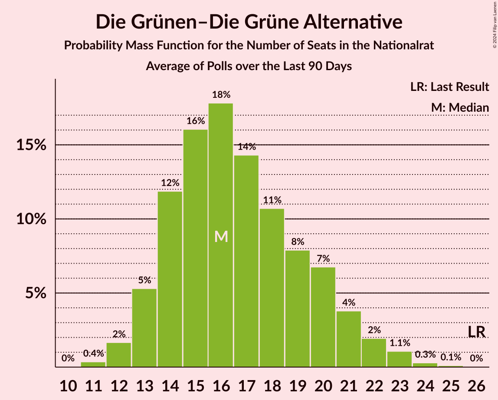

# Poll Average

<a href="#voting-intentions">Voting Intentions</a> | <a href="#seats">Seats</a> | <a href="#coalitions">Coalitions</a> | <a href="#technical-information">Technical Information</a>

## Summary

The table below lists the polls on which the average is based. They are the most recent polls (less than 90 days old) registered and analyzed so far.

| Period     | Polling firm/Commissioner(s) | ÖVP | SPÖ | FPÖ | GRÜNE | NEOS | JETZT | G!LT | HC |
|:----------:|:----------------------------:|:--:|:--:|:--:|:--:|:--:|:--:|:--:|:--:|
| 29 September 2019 | General Election | 37.5%   71 | 21.2%   40 | 16.2%   31 | 13.9%   26 | 8.1%   15 | 1.9%   0 | 0.0%   0 | 0.0%   0 |
| N/A | Poll Average | 29–38%   55–71 | 18–28%   34–52 | 15–21%   28–39 | 9–15%   17–27 | 9–14%   17–26 | N/A   N/A | N/A   N/A | N/A   N/A |
| [20–22 July 2021](2021-07-22-ResearchAffairs.html) | Research Affairs   ÖSTERREICH | 31–39%   57–73 | 17–24%   31–44 | 15–22%   27–40 | 9–15%   17–28 | 8–14%   15–26 | N/A   N/A | N/A   N/A | N/A   N/A |
| [15–21 July 2021](2021-07-21-IFDD.html) | IFDD   PULS 24 | 32–38%   59–71 | 19–25%   35–46 | 16–22%   30–40 | 9–13%   16–24 | 10–14%   18–26 | N/A   N/A | N/A   N/A | N/A   N/A |
| [5–8 July 2021](2021-07-08-UniqueResearch.html) | Unique Research   profil | 31–37%   58–71 | 19–25%   36–47 | 15–20%   27–37 | 10–14%   18–27 | 10–14%   18–27 | N/A   N/A | N/A   N/A | N/A   N/A |
| [29–30 June 2021](2021-06-30-Market.html) | Market   Der Standard | 28–34%   52–64 | 23–29%   43–54 | 15–20%   27–37 | 11–16%   20–29 | 9–13%   16–25 | N/A   N/A | N/A   N/A | N/A   N/A |
| [21–24 June 2021](2021-06-24-PeterHajek.html) | Peter Hajek | 31–37%   58–70 | 20–26%   38–49 | 15–21%   29–39 | 9–13%   17–25 | 10–14%   18–27 | N/A   N/A | N/A   N/A | N/A   N/A |
| [22–24 June 2021](2021-06-24-OGM.html) | OGM   KURIER | 30–36%   56–68 | 22–28%   41–53 | 15–21%   29–39 | 9–13%   16–25 | 9–13%   17–25 | N/A   N/A | N/A   N/A | N/A   N/A |
| 29 September 2019 | General Election | 37.5%   71 | 21.2%   40 | 16.2%   31 | 13.9%   26 | 8.1%   15 | 1.9%   0 | 0.0%   0 | 0.0%   0 |

Only polls for which at least the sample size has been published are included in the table above.

**Legend:**
+ **Top half of each row:** Voting intentions (95% confidence interval)
+ **Bottom half of each row:** Seat projections for the Nationalrat (95% confidence interval)
+ **ÖVP:** Österreichische Volkspartei
+ **SPÖ:** Sozialdemokratische Partei Österreichs
+ **FPÖ:** Freiheitliche Partei Österreichs
+ **GRÜNE:** Die Grünen–Die Grüne Alternative
+ **NEOS:** NEOS–Das Neue Österreich und Liberales Forum
+ **JETZT:** JETZT–Liste Pilz
+ **G!LT:** Meine Stimme G!LT
+ **HC:** Team HC Strache–Allianz für Österreich
+ **N/A (single party):** Party not included the published results
+ **N/A (entire row):** Calculation for this opinion poll not started yet

## Voting Intentions

### Confidence Intervals

| Party | Last Result | Median | 80% Confidence Interval | 90% Confidence Interval | 95% Confidence Interval | 99% Confidence Interval |
|:-----:|:-----------:|:------:|:-----------------------:|:-----------------------:|:-----------------------:|:-----------------------:|
| <a href="#österreichische-volkspartei">Österreichische Volkspartei</a> | 37.5% | 33.8% | 30.8–36.5% |29.9–37.3% | 29.2–37.9% | 28.0–39.3% |
| <a href="#sozialdemokratische-partei-österreichs">Sozialdemokratische Partei Österreichs</a> | 21.2% | 23.0% | 19.9–26.4% |19.0–27.2% | 18.3–27.9% | 16.9–29.1% |
| <a href="#freiheitliche-partei-österreichs">Freiheitliche Partei Österreichs</a> | 16.2% | 17.9% | 15.9–20.0% |15.4–20.6% | 15.0–21.1% | 14.1–22.2% |
| <a href="#die-grünen–die-grüne-alternative">Die Grünen–Die Grüne Alternative</a> | 13.9% | 11.7% | 10.0–13.6% |9.6–14.2% | 9.2–14.7% | 8.6–15.7% |
| <a href="#neos–das-neue-österreich-und-liberales-forum">NEOS–Das Neue Österreich und Liberales Forum</a> | 8.1% | 11.6% | 9.9–13.2% |9.5–13.7% | 9.1–14.2% | 8.4–15.0% |
| <a href="#jetzt–liste-pilz">JETZT–Liste Pilz</a> | 1.9% | N/A | N/A |N/A | N/A | N/A |
| <a href="#meine-stimme-g!lt">Meine Stimme G!LT</a> | 0.0% | N/A | N/A |N/A | N/A | N/A |
| <a href="#team-hc-strache–allianz-für-österreich">Team HC Strache–Allianz für Österreich</a> | 0.0% | N/A | N/A |N/A | N/A | N/A |

### Österreichische Volkspartei

*For a full overview of the results for this party, see the [Österreichische Volkspartei](party-österreichischevolkspartei.html) page.*

| Voting Intentions | Probability | Accumulated | Special Marks |
|:-----------------:|:-----------:|:-----------:|:-------------:|
| 25.5–26.5% | 0% | 100% |  |
| 26.5–27.5% | 0.2% | 100% |  |
| 27.5–28.5% | 0.8% | 99.8% |  |
| 28.5–29.5% | 2% | 98.9% |  |
| 29.5–30.5% | 5% | 96% |  |
| 30.5–31.5% | 9% | 92% |  |
| 31.5–32.5% | 13% | 83% |  |
| 32.5–33.5% | 16% | 70% |  |
| 33.5–34.5% | 18% | 54% | Median |
| 34.5–35.5% | 15% | 36% |  |
| 35.5–36.5% | 11% | 20% |  |
| 36.5–37.5% | 6% | 9% |  |
| 37.5–38.5% | 2% | 4% | Last Result |
| 38.5–39.5% | 0.9% | 1.3% |  |
| 39.5–40.5% | 0.3% | 0.4% |  |
| 40.5–41.5% | 0.1% | 0.1% |  |
| 41.5–42.5% | 0% | 0% |  |

### Sozialdemokratische Partei Österreichs

*For a full overview of the results for this party, see the [Sozialdemokratische Partei Österreichs](party-sozialdemokratischeparteiösterreichs.html) page.*

| Voting Intentions | Probability | Accumulated | Special Marks |
|:-----------------:|:-----------:|:-----------:|:-------------:|
| 14.5–15.5% | 0% | 100% |  |
| 15.5–16.5% | 0.2% | 99.9% |  |
| 16.5–17.5% | 0.8% | 99.7% |  |
| 17.5–18.5% | 2% | 98.9% |  |
| 18.5–19.5% | 4% | 97% |  |
| 19.5–20.5% | 8% | 92% |  |
| 20.5–21.5% | 12% | 84% | Last Result |
| 21.5–22.5% | 15% | 72% |  |
| 22.5–23.5% | 15% | 56% | Median |
| 23.5–24.5% | 13% | 42% |  |
| 24.5–25.5% | 11% | 29% |  |
| 25.5–26.5% | 9% | 18% |  |
| 26.5–27.5% | 5% | 9% |  |
| 27.5–28.5% | 2% | 4% |  |
| 28.5–29.5% | 0.8% | 1.1% |  |
| 29.5–30.5% | 0.2% | 0.2% |  |
| 30.5–31.5% | 0% | 0% |  |

### Freiheitliche Partei Österreichs

*For a full overview of the results for this party, see the [Freiheitliche Partei Österreichs](party-freiheitlicheparteiösterreichs.html) page.*

| Voting Intentions | Probability | Accumulated | Special Marks |
|:-----------------:|:-----------:|:-----------:|:-------------:|
| 11.5–12.5% | 0% | 100% |  |
| 12.5–13.5% | 0.1% | 100% |  |
| 13.5–14.5% | 1.1% | 99.9% |  |
| 14.5–15.5% | 5% | 98.8% |  |
| 15.5–16.5% | 14% | 94% | Last Result |
| 16.5–17.5% | 22% | 80% |  |
| 17.5–18.5% | 25% | 58% | Median |
| 18.5–19.5% | 19% | 34% |  |
| 19.5–20.5% | 10% | 15% |  |
| 20.5–21.5% | 4% | 5% |  |
| 21.5–22.5% | 1.1% | 1.4% |  |
| 22.5–23.5% | 0.2% | 0.3% |  |
| 23.5–24.5% | 0% | 0% |  |
| 24.5–25.5% | 0% | 0% |  |

### Die Grünen–Die Grüne Alternative

*For a full overview of the results for this party, see the [Die Grünen–Die Grüne Alternative](party-diegrünen–diegrünealternative.html) page.*

| Voting Intentions | Probability | Accumulated | Special Marks |
|:-----------------:|:-----------:|:-----------:|:-------------:|
| 6.5–7.5% | 0% | 100% |  |
| 7.5–8.5% | 0.4% | 100% |  |
| 8.5–9.5% | 4% | 99.6% |  |
| 9.5–10.5% | 15% | 95% |  |
| 10.5–11.5% | 27% | 80% |  |
| 11.5–12.5% | 25% | 53% | Median |
| 12.5–13.5% | 17% | 28% |  |
| 13.5–14.5% | 8% | 11% | Last Result |
| 14.5–15.5% | 3% | 3% |  |
| 15.5–16.5% | 0.6% | 0.6% |  |
| 16.5–17.5% | 0.1% | 0.1% |  |
| 17.5–18.5% | 0% | 0% |  |

### NEOS–Das Neue Österreich und Liberales Forum

*For a full overview of the results for this party, see the [NEOS–Das Neue Österreich und Liberales Forum](party-neos–dasneueösterreichundliberalesforum.html) page.*

| Voting Intentions | Probability | Accumulated | Special Marks |
|:-----------------:|:-----------:|:-----------:|:-------------:|
| 6.5–7.5% | 0.1% | 100% |  |
| 7.5–8.5% | 0.7% | 99.9% | Last Result |
| 8.5–9.5% | 5% | 99.3% |  |
| 9.5–10.5% | 16% | 95% |  |
| 10.5–11.5% | 29% | 79% |  |
| 11.5–12.5% | 28% | 50% | Median |
| 12.5–13.5% | 16% | 23% |  |
| 13.5–14.5% | 5% | 7% |  |
| 14.5–15.5% | 1.1% | 1.2% |  |
| 15.5–16.5% | 0.1% | 0.2% |  |
| 16.5–17.5% | 0% | 0% |  |

## Seats

### Confidence Intervals

| Party | Last Result | Median | 80% Confidence Interval | 90% Confidence Interval | 95% Confidence Interval | 99% Confidence Interval |
|:-----:|:-----------:|:------:|:-----------------------:|:-----------------------:|:-----------------------:|:-----------------------:|
| <a href="#österreichische-volkspartei">Österreichische Volkspartei</a> | 71 | 63 | 57–68 |56–69 | 55–71 | 52–73 |
| <a href="#sozialdemokratische-partei-österreichs">Sozialdemokratische Partei Österreichs</a> | 40 | 43 | 37–49 |35–51 | 34–52 | 31–54 |
| <a href="#freiheitliche-partei-österreichs">Freiheitliche Partei Österreichs</a> | 31 | 33 | 30–37 |29–38 | 28–39 | 26–41 |
| <a href="#die-grünen–die-grüne-alternative">Die Grünen–Die Grüne Alternative</a> | 26 | 21 | 18–25 |18–26 | 17–27 | 16–29 |
| <a href="#neos–das-neue-österreich-und-liberales-forum">NEOS–Das Neue Österreich und Liberales Forum</a> | 15 | 21 | 18–24 |17–25 | 17–26 | 15–28 |
| <a href="#jetzt–liste-pilz">JETZT–Liste Pilz</a> | 0 | N/A | N/A |N/A | N/A | N/A |
| <a href="#meine-stimme-g!lt">Meine Stimme G!LT</a> | 0 | N/A | N/A |N/A | N/A | N/A |
| <a href="#team-hc-strache–allianz-für-österreich">Team HC Strache–Allianz für Österreich</a> | 0 | N/A | N/A |N/A | N/A | N/A |

### Österreichische Volkspartei

*For a full overview of the results for this party, see the [Österreichische Volkspartei](party-österreichischevolkspartei.html) page.*

| Number of Seats | Probability | Accumulated | Special Marks |
|:---------------:|:-----------:|:-----------:|:-------------:|
| 50 | 0.1% | 100% |  |
| 51 | 0.2% | 99.9% |  |
| 52 | 0.3% | 99.8% |  |
| 53 | 0.6% | 99.4% |  |
| 54 | 1.1% | 98.8% |  |
| 55 | 2% | 98% |  |
| 56 | 2% | 96% |  |
| 57 | 3% | 93% |  |
| 58 | 5% | 90% |  |
| 59 | 6% | 85% |  |
| 60 | 7% | 79% |  |
| 61 | 8% | 72% |  |
| 62 | 9% | 64% |  |
| 63 | 10% | 55% | Median |
| 64 | 10% | 45% |  |
| 65 | 9% | 36% |  |
| 66 | 8% | 27% |  |
| 67 | 6% | 19% |  |
| 68 | 5% | 13% |  |
| 69 | 3% | 8% |  |
| 70 | 2% | 5% |  |
| 71 | 1.3% | 3% | Last Result |
| 72 | 0.7% | 2% |  |
| 73 | 0.4% | 0.9% |  |
| 74 | 0.2% | 0.5% |  |
| 75 | 0.1% | 0.3% |  |
| 76 | 0.1% | 0.1% |  |
| 77 | 0% | 0.1% |  |
| 78 | 0% | 0% |  |

### Sozialdemokratische Partei Österreichs

*For a full overview of the results for this party, see the [Sozialdemokratische Partei Österreichs](party-sozialdemokratischeparteiösterreichs.html) page.*

| Number of Seats | Probability | Accumulated | Special Marks |
|:---------------:|:-----------:|:-----------:|:-------------:|
| 28 | 0% | 100% |  |
| 29 | 0.1% | 99.9% |  |
| 30 | 0.2% | 99.8% |  |
| 31 | 0.4% | 99.6% |  |
| 32 | 0.7% | 99.3% |  |
| 33 | 1.1% | 98.6% |  |
| 34 | 1.5% | 98% |  |
| 35 | 2% | 96% |  |
| 36 | 3% | 94% |  |
| 37 | 4% | 91% |  |
| 38 | 5% | 87% |  |
| 39 | 6% | 82% |  |
| 40 | 7% | 76% | Last Result |
| 41 | 8% | 68% |  |
| 42 | 8% | 61% |  |
| 43 | 8% | 52% | Median |
| 44 | 7% | 44% |  |
| 45 | 7% | 37% |  |
| 46 | 6% | 31% |  |
| 47 | 6% | 24% |  |
| 48 | 5% | 19% |  |
| 49 | 4% | 14% |  |
| 50 | 3% | 10% |  |
| 51 | 3% | 6% |  |
| 52 | 2% | 4% |  |
| 53 | 1.0% | 2% |  |
| 54 | 0.5% | 0.9% |  |
| 55 | 0.2% | 0.4% |  |
| 56 | 0.1% | 0.2% |  |
| 57 | 0% | 0.1% |  |
| 58 | 0% | 0% |  |

### Freiheitliche Partei Österreichs

*For a full overview of the results for this party, see the [Freiheitliche Partei Österreichs](party-freiheitlicheparteiösterreichs.html) page.*

| Number of Seats | Probability | Accumulated | Special Marks |
|:---------------:|:-----------:|:-----------:|:-------------:|
| 24 | 0% | 100% |  |
| 25 | 0.2% | 99.9% |  |
| 26 | 0.5% | 99.8% |  |
| 27 | 1.3% | 99.2% |  |
| 28 | 3% | 98% |  |
| 29 | 5% | 95% |  |
| 30 | 8% | 90% |  |
| 31 | 11% | 82% | Last Result |
| 32 | 13% | 72% |  |
| 33 | 13% | 59% | Median |
| 34 | 13% | 45% |  |
| 35 | 11% | 33% |  |
| 36 | 8% | 22% |  |
| 37 | 6% | 13% |  |
| 38 | 4% | 8% |  |
| 39 | 2% | 4% |  |
| 40 | 1.0% | 2% |  |
| 41 | 0.5% | 0.9% |  |
| 42 | 0.2% | 0.4% |  |
| 43 | 0.1% | 0.2% |  |
| 44 | 0% | 0.1% |  |
| 45 | 0% | 0% |  |

### Die Grünen–Die Grüne Alternative

*For a full overview of the results for this party, see the [Die Grünen–Die Grüne Alternative](party-diegrünen–diegrünealternative.html) page.*

| Number of Seats | Probability | Accumulated | Special Marks |
|:---------------:|:-----------:|:-----------:|:-------------:|
| 14 | 0.1% | 100% |  |
| 15 | 0.3% | 99.9% |  |
| 16 | 1.2% | 99.6% |  |
| 17 | 3% | 98% |  |
| 18 | 7% | 95% |  |
| 19 | 11% | 88% |  |
| 20 | 14% | 78% |  |
| 21 | 15% | 64% | Median |
| 22 | 14% | 50% |  |
| 23 | 12% | 36% |  |
| 24 | 9% | 24% |  |
| 25 | 6% | 15% |  |
| 26 | 4% | 9% | Last Result |
| 27 | 2% | 4% |  |
| 28 | 1.1% | 2% |  |
| 29 | 0.6% | 0.9% |  |
| 30 | 0.2% | 0.3% |  |
| 31 | 0.1% | 0.1% |  |
| 32 | 0% | 0% |  |

### NEOS–Das Neue Österreich und Liberales Forum

*For a full overview of the results for this party, see the [NEOS–Das Neue Österreich und Liberales Forum](party-neos–dasneueösterreichundliberalesforum.html) page.*

| Number of Seats | Probability | Accumulated | Special Marks |
|:---------------:|:-----------:|:-----------:|:-------------:|
| 14 | 0.2% | 100% |  |
| 15 | 0.5% | 99.8% | Last Result |
| 16 | 1.1% | 99.3% |  |
| 17 | 4% | 98% |  |
| 18 | 9% | 94% |  |
| 19 | 7% | 85% |  |
| 20 | 11% | 78% |  |
| 21 | 21% | 66% | Median |
| 22 | 16% | 46% |  |
| 23 | 11% | 30% |  |
| 24 | 11% | 19% |  |
| 25 | 4% | 9% |  |
| 26 | 2% | 5% |  |
| 27 | 2% | 2% |  |
| 28 | 0.3% | 0.5% |  |
| 29 | 0.1% | 0.2% |  |
| 30 | 0.1% | 0.1% |  |
| 31 | 0% | 0% |  |

### JETZT–Liste Pilz

*For a full overview of the results for this party, see the [JETZT–Liste Pilz](party-jetzt–listepilz.html) page.*

### Meine Stimme G!LT

*For a full overview of the results for this party, see the [Meine Stimme G!LT](party-meinestimmeglt.html) page.*

### Team HC Strache–Allianz für Österreich

*For a full overview of the results for this party, see the [Team HC Strache–Allianz für Österreich](party-teamhcstrache–allianzfürösterreich.html) page.*

## Coalitions

### Confidence Intervals

| Coalition | Last Result | Median | Majority? | 80% Confidence Interval | 90% Confidence Interval | 95% Confidence Interval | 99% Confidence Interval |
|:---------:|:-----------:|:------:|:---------:|:-----------------------:|:-----------------------:|:-----------------------:|:-----------------------:|
| Österreichische Volkspartei – Die Grünen–Die Grüne Alternative – NEOS–Das Neue Österreich und Liberales Forum | 112 | 106 | 100% | 100–111 | 99–113 | 98–114 | 95–117 |
| Österreichische Volkspartei – Sozialdemokratische Partei Österreichs | 111 | 106 | 99.8% | 101–111 | 99–112 | 97–113 | 93–115 |
| Österreichische Volkspartei – Freiheitliche Partei Österreichs | 102 | 96 | 82% | 90–102 | 88–104 | 86–105 | 83–108 |
| Sozialdemokratische Partei Österreichs – Die Grünen–Die Grüne Alternative – NEOS–Das Neue Österreich und Liberales Forum | 81 | 86 | 16% | 79–93 | 77–95 | 75–97 | 71–99 |
| Österreichische Volkspartei – Die Grünen–Die Grüne Alternative | 97 | 84 | 5% | 80–90 | 78–91 | 77–93 | 75–96 |
| Österreichische Volkspartei – NEOS–Das Neue Österreich und Liberales Forum | 86 | 84 | 5% | 78–90 | 76–91 | 75–93 | 72–95 |
| Sozialdemokratische Partei Österreichs – Freiheitliche Partei Österreichs | 71 | 76 | 0% | 70–82 | 68–84 | 66–85 | 63–87 |
| Sozialdemokratische Partei Österreichs – Die Grünen–Die Grüne Alternative | 66 | 64 | 0% | 58–73 | 56–75 | 55–76 | 52–79 |
| Österreichische Volkspartei | 71 | 63 | 0% | 57–68 | 56–69 | 55–71 | 52–73 |
| Sozialdemokratische Partei Österreichs | 40 | 43 | 0% | 37–49 | 35–51 | 34–52 | 31–54 |

### Österreichische Volkspartei – Die Grünen–Die Grüne Alternative – NEOS–Das Neue Österreich und Liberales Forum

| Number of Seats | Probability | Accumulated | Special Marks |
|:---------------:|:-----------:|:-----------:|:-------------:|
| 93 | 0.1% | 100% |  |
| 94 | 0.2% | 99.9% |  |
| 95 | 0.3% | 99.7% |  |
| 96 | 0.6% | 99.4% |  |
| 97 | 1.2% | 98.8% |  |
| 98 | 2% | 98% |  |
| 99 | 3% | 96% |  |
| 100 | 4% | 93% |  |
| 101 | 6% | 89% |  |
| 102 | 6% | 84% |  |
| 103 | 8% | 78% |  |
| 104 | 8% | 70% |  |
| 105 | 9% | 62% | Median |
| 106 | 9% | 53% |  |
| 107 | 9% | 44% |  |
| 108 | 8% | 35% |  |
| 109 | 7% | 27% |  |
| 110 | 6% | 20% |  |
| 111 | 5% | 14% |  |
| 112 | 3% | 10% | Last Result |
| 113 | 2% | 6% |  |
| 114 | 2% | 4% |  |
| 115 | 1.0% | 2% |  |
| 116 | 0.6% | 1.3% |  |
| 117 | 0.3% | 0.7% |  |
| 118 | 0.2% | 0.4% |  |
| 119 | 0.1% | 0.2% |  |
| 120 | 0% | 0.1% |  |
| 121 | 0% | 0% |  |

### Österreichische Volkspartei – Sozialdemokratische Partei Österreichs

| Number of Seats | Probability | Accumulated | Special Marks |
|:---------------:|:-----------:|:-----------:|:-------------:|
| 90 | 0% | 100% |  |
| 91 | 0.1% | 99.9% |  |
| 92 | 0.1% | 99.8% | Majority |
| 93 | 0.2% | 99.7% |  |
| 94 | 0.4% | 99.5% |  |
| 95 | 0.5% | 99.1% |  |
| 96 | 0.8% | 98.6% |  |
| 97 | 1.1% | 98% |  |
| 98 | 1.5% | 97% |  |
| 99 | 2% | 95% |  |
| 100 | 3% | 93% |  |
| 101 | 4% | 90% |  |
| 102 | 5% | 86% |  |
| 103 | 7% | 81% |  |
| 104 | 8% | 74% |  |
| 105 | 10% | 66% |  |
| 106 | 10% | 56% | Median |
| 107 | 10% | 46% |  |
| 108 | 10% | 35% |  |
| 109 | 8% | 26% |  |
| 110 | 6% | 18% |  |
| 111 | 5% | 12% | Last Result |
| 112 | 3% | 7% |  |
| 113 | 2% | 4% |  |
| 114 | 1.1% | 2% |  |
| 115 | 0.5% | 1.0% |  |
| 116 | 0.3% | 0.4% |  |
| 117 | 0.1% | 0.2% |  |
| 118 | 0% | 0.1% |  |
| 119 | 0% | 0% |  |

### Österreichische Volkspartei – Freiheitliche Partei Österreichs

| Number of Seats | Probability | Accumulated | Special Marks |
|:---------------:|:-----------:|:-----------:|:-------------:|
| 81 | 0.1% | 100% |  |
| 82 | 0.1% | 99.9% |  |
| 83 | 0.3% | 99.8% |  |
| 84 | 0.5% | 99.5% |  |
| 85 | 0.8% | 99.0% |  |
| 86 | 1.2% | 98% |  |
| 87 | 2% | 97% |  |
| 88 | 2% | 95% |  |
| 89 | 3% | 93% |  |
| 90 | 3% | 90% |  |
| 91 | 4% | 87% |  |
| 92 | 5% | 82% | Majority |
| 93 | 6% | 78% |  |
| 94 | 7% | 72% |  |
| 95 | 7% | 65% |  |
| 96 | 8% | 57% | Median |
| 97 | 9% | 49% |  |
| 98 | 8% | 40% |  |
| 99 | 8% | 32% |  |
| 100 | 6% | 25% |  |
| 101 | 5% | 18% |  |
| 102 | 4% | 13% | Last Result |
| 103 | 3% | 9% |  |
| 104 | 2% | 6% |  |
| 105 | 1.4% | 3% |  |
| 106 | 0.9% | 2% |  |
| 107 | 0.5% | 1.2% |  |
| 108 | 0.3% | 0.7% |  |
| 109 | 0.2% | 0.4% |  |
| 110 | 0.1% | 0.2% |  |
| 111 | 0% | 0.1% |  |
| 112 | 0% | 0% |  |

### Sozialdemokratische Partei Österreichs – Die Grünen–Die Grüne Alternative – NEOS–Das Neue Österreich und Liberales Forum

| Number of Seats | Probability | Accumulated | Special Marks |
|:---------------:|:-----------:|:-----------:|:-------------:|
| 68 | 0.1% | 100% |  |
| 69 | 0.1% | 99.9% |  |
| 70 | 0.2% | 99.8% |  |
| 71 | 0.3% | 99.6% |  |
| 72 | 0.4% | 99.4% |  |
| 73 | 0.6% | 99.0% |  |
| 74 | 0.8% | 98% |  |
| 75 | 1.1% | 98% |  |
| 76 | 1.4% | 96% |  |
| 77 | 2% | 95% |  |
| 78 | 2% | 93% |  |
| 79 | 3% | 91% |  |
| 80 | 4% | 88% |  |
| 81 | 5% | 84% | Last Result |
| 82 | 6% | 80% |  |
| 83 | 6% | 74% |  |
| 84 | 7% | 68% |  |
| 85 | 8% | 60% | Median |
| 86 | 8% | 53% |  |
| 87 | 7% | 45% |  |
| 88 | 7% | 38% |  |
| 89 | 6% | 31% |  |
| 90 | 5% | 25% |  |
| 91 | 4% | 20% |  |
| 92 | 4% | 16% | Majority |
| 93 | 3% | 12% |  |
| 94 | 3% | 9% |  |
| 95 | 2% | 7% |  |
| 96 | 2% | 4% |  |
| 97 | 1.2% | 3% |  |
| 98 | 0.8% | 2% |  |
| 99 | 0.5% | 1.0% |  |
| 100 | 0.2% | 0.5% |  |
| 101 | 0.1% | 0.2% |  |
| 102 | 0.1% | 0.1% |  |
| 103 | 0% | 0% |  |

### Österreichische Volkspartei – Die Grünen–Die Grüne Alternative

| Number of Seats | Probability | Accumulated | Special Marks |
|:---------------:|:-----------:|:-----------:|:-------------:|
| 72 | 0% | 100% |  |
| 73 | 0.1% | 99.9% |  |
| 74 | 0.2% | 99.8% |  |
| 75 | 0.5% | 99.6% |  |
| 76 | 0.9% | 99.1% |  |
| 77 | 2% | 98% |  |
| 78 | 3% | 97% |  |
| 79 | 4% | 94% |  |
| 80 | 6% | 90% |  |
| 81 | 7% | 84% |  |
| 82 | 9% | 77% |  |
| 83 | 9% | 69% |  |
| 84 | 10% | 59% | Median |
| 85 | 10% | 49% |  |
| 86 | 9% | 39% |  |
| 87 | 8% | 30% |  |
| 88 | 6% | 22% |  |
| 89 | 5% | 16% |  |
| 90 | 4% | 11% |  |
| 91 | 3% | 7% |  |
| 92 | 2% | 5% | Majority |
| 93 | 1.2% | 3% |  |
| 94 | 0.7% | 2% |  |
| 95 | 0.4% | 1.1% |  |
| 96 | 0.3% | 0.6% |  |
| 97 | 0.2% | 0.4% | Last Result |
| 98 | 0.1% | 0.2% |  |
| 99 | 0.1% | 0.1% |  |
| 100 | 0% | 0.1% |  |
| 101 | 0% | 0% |  |

### Österreichische Volkspartei – NEOS–Das Neue Österreich und Liberales Forum

| Number of Seats | Probability | Accumulated | Special Marks |
|:---------------:|:-----------:|:-----------:|:-------------:|
| 70 | 0.1% | 100% |  |
| 71 | 0.2% | 99.9% |  |
| 72 | 0.3% | 99.7% |  |
| 73 | 0.6% | 99.4% |  |
| 74 | 1.0% | 98.8% |  |
| 75 | 1.5% | 98% |  |
| 76 | 2% | 96% |  |
| 77 | 3% | 94% |  |
| 78 | 4% | 91% |  |
| 79 | 4% | 88% |  |
| 80 | 5% | 83% |  |
| 81 | 6% | 78% |  |
| 82 | 7% | 72% |  |
| 83 | 8% | 66% |  |
| 84 | 8% | 58% | Median |
| 85 | 8% | 50% |  |
| 86 | 9% | 42% | Last Result |
| 87 | 8% | 33% |  |
| 88 | 7% | 25% |  |
| 89 | 6% | 18% |  |
| 90 | 4% | 12% |  |
| 91 | 3% | 8% |  |
| 92 | 2% | 5% | Majority |
| 93 | 1.3% | 3% |  |
| 94 | 0.7% | 2% |  |
| 95 | 0.4% | 0.8% |  |
| 96 | 0.2% | 0.4% |  |
| 97 | 0.1% | 0.2% |  |
| 98 | 0.1% | 0.1% |  |
| 99 | 0% | 0% |  |

### Sozialdemokratische Partei Österreichs – Freiheitliche Partei Österreichs

| Number of Seats | Probability | Accumulated | Special Marks |
|:---------------:|:-----------:|:-----------:|:-------------:|
| 59 | 0% | 100% |  |
| 60 | 0.1% | 99.9% |  |
| 61 | 0.1% | 99.9% |  |
| 62 | 0.2% | 99.8% |  |
| 63 | 0.3% | 99.5% |  |
| 64 | 0.5% | 99.2% |  |
| 65 | 0.8% | 98.7% |  |
| 66 | 1.1% | 98% |  |
| 67 | 2% | 97% |  |
| 68 | 2% | 95% |  |
| 69 | 3% | 93% |  |
| 70 | 3% | 91% |  |
| 71 | 4% | 87% | Last Result |
| 72 | 5% | 83% |  |
| 73 | 6% | 77% |  |
| 74 | 7% | 71% |  |
| 75 | 8% | 65% |  |
| 76 | 8% | 57% | Median |
| 77 | 8% | 49% |  |
| 78 | 8% | 41% |  |
| 79 | 7% | 33% |  |
| 80 | 7% | 26% |  |
| 81 | 5% | 19% |  |
| 82 | 5% | 14% |  |
| 83 | 3% | 9% |  |
| 84 | 3% | 6% |  |
| 85 | 1.4% | 3% |  |
| 86 | 1.0% | 2% |  |
| 87 | 0.5% | 1.0% |  |
| 88 | 0.3% | 0.5% |  |
| 89 | 0.1% | 0.2% |  |
| 90 | 0.1% | 0.1% |  |
| 91 | 0% | 0% |  |

### Sozialdemokratische Partei Österreichs – Die Grünen–Die Grüne Alternative

| Number of Seats | Probability | Accumulated | Special Marks |
|:---------------:|:-----------:|:-----------:|:-------------:|
| 48 | 0% | 100% |  |
| 49 | 0.1% | 99.9% |  |
| 50 | 0.1% | 99.9% |  |
| 51 | 0.2% | 99.8% |  |
| 52 | 0.4% | 99.5% |  |
| 53 | 0.6% | 99.1% |  |
| 54 | 1.0% | 98.5% |  |
| 55 | 1.4% | 98% |  |
| 56 | 2% | 96% |  |
| 57 | 3% | 94% |  |
| 58 | 4% | 91% |  |
| 59 | 5% | 87% |  |
| 60 | 6% | 82% |  |
| 61 | 7% | 76% |  |
| 62 | 8% | 69% |  |
| 63 | 8% | 62% |  |
| 64 | 8% | 54% | Median |
| 65 | 7% | 47% |  |
| 66 | 6% | 40% | Last Result |
| 67 | 5% | 33% |  |
| 68 | 5% | 28% |  |
| 69 | 4% | 23% |  |
| 70 | 3% | 20% |  |
| 71 | 3% | 16% |  |
| 72 | 3% | 13% |  |
| 73 | 3% | 10% |  |
| 74 | 2% | 8% |  |
| 75 | 2% | 5% |  |
| 76 | 1.3% | 4% |  |
| 77 | 1.0% | 2% |  |
| 78 | 0.6% | 1.3% |  |
| 79 | 0.4% | 0.7% |  |
| 80 | 0.2% | 0.4% |  |
| 81 | 0.1% | 0.2% |  |
| 82 | 0% | 0.1% |  |
| 83 | 0% | 0% |  |

### Österreichische Volkspartei

| Number of Seats | Probability | Accumulated | Special Marks |
|:---------------:|:-----------:|:-----------:|:-------------:|
| 50 | 0.1% | 100% |  |
| 51 | 0.2% | 99.9% |  |
| 52 | 0.3% | 99.8% |  |
| 53 | 0.6% | 99.4% |  |
| 54 | 1.1% | 98.8% |  |
| 55 | 2% | 98% |  |
| 56 | 2% | 96% |  |
| 57 | 3% | 93% |  |
| 58 | 5% | 90% |  |
| 59 | 6% | 85% |  |
| 60 | 7% | 79% |  |
| 61 | 8% | 72% |  |
| 62 | 9% | 64% |  |
| 63 | 10% | 55% | Median |
| 64 | 10% | 45% |  |
| 65 | 9% | 36% |  |
| 66 | 8% | 27% |  |
| 67 | 6% | 19% |  |
| 68 | 5% | 13% |  |
| 69 | 3% | 8% |  |
| 70 | 2% | 5% |  |
| 71 | 1.3% | 3% | Last Result |
| 72 | 0.7% | 2% |  |
| 73 | 0.4% | 0.9% |  |
| 74 | 0.2% | 0.5% |  |
| 75 | 0.1% | 0.3% |  |
| 76 | 0.1% | 0.1% |  |
| 77 | 0% | 0.1% |  |
| 78 | 0% | 0% |  |

### Sozialdemokratische Partei Österreichs

| Number of Seats | Probability | Accumulated | Special Marks |
|:---------------:|:-----------:|:-----------:|:-------------:|
| 28 | 0% | 100% |  |
| 29 | 0.1% | 99.9% |  |
| 30 | 0.2% | 99.8% |  |
| 31 | 0.4% | 99.6% |  |
| 32 | 0.7% | 99.3% |  |
| 33 | 1.1% | 98.6% |  |
| 34 | 1.5% | 98% |  |
| 35 | 2% | 96% |  |
| 36 | 3% | 94% |  |
| 37 | 4% | 91% |  |
| 38 | 5% | 87% |  |
| 39 | 6% | 82% |  |
| 40 | 7% | 76% | Last Result |
| 41 | 8% | 68% |  |
| 42 | 8% | 61% |  |
| 43 | 8% | 52% | Median |
| 44 | 7% | 44% |  |
| 45 | 7% | 37% |  |
| 46 | 6% | 31% |  |
| 47 | 6% | 24% |  |
| 48 | 5% | 19% |  |
| 49 | 4% | 14% |  |
| 50 | 3% | 10% |  |
| 51 | 3% | 6% |  |
| 52 | 2% | 4% |  |
| 53 | 1.0% | 2% |  |
| 54 | 0.5% | 0.9% |  |
| 55 | 0.2% | 0.4% |  |
| 56 | 0.1% | 0.2% |  |
| 57 | 0% | 0.1% |  |
| 58 | 0% | 0% |  |

## Technical Information

+ **Number of polls included in this average:** 6
+ **Lowest number of simulations done in a poll included in this average:** 1,048,576
+ **Total number of simulations done in the polls included in this average:** 6,291,456
+ **Error estimate:** 1.13%
