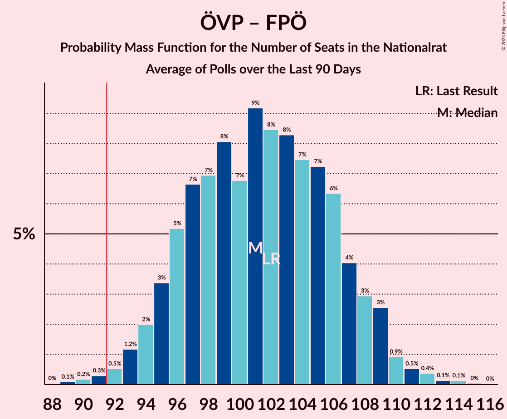

# Poll Average

<a href="#voting-intentions">Voting Intentions</a> | <a href="#seats">Seats</a> | <a href="#coalitions">Coalitions</a> | <a href="#technical-information">Technical Information</a>

## Summary

The table below lists the polls on which the average is based. They are the most recent polls (less than 90 days old) registered and analyzed so far.

| Period     | Polling firm/Commissioner(s) | ÖVP | SPÖ | FPÖ | GRÜNE | NEOS | JETZT | G!LT |
|:----------:|:----------------------------:|:--:|:--:|:--:|:--:|:--:|:--:|:--:|
| 29 September 2019 | General Election | 37.5%   71 | 21.2%   40 | 16.2%   31 | 13.9%   26 | 8.1%   15 | 1.9%   0 | 0.0%   0 |
| N/A | Poll Average | 36–40%   69–75 | 19–22%   35–41 | 14–16%   26–31 | 14–16%   26–31 | 8–10%   15–19 | N/A   N/A | N/A   N/A |
| [9–13 December 2019](2019-12-13-UniqueResearch.html) | Unique Research   profil | N/A   N/A | N/A   N/A | N/A   N/A | N/A   N/A | N/A   N/A | N/A   N/A | N/A   N/A |
| [6–12 December 2019](2019-12-12-ResearchAffairs.html) | Research Affairs   ÖSTERREICH | N/A   N/A | N/A   N/A | N/A   N/A | N/A   N/A | N/A   N/A | N/A   N/A | N/A   N/A |
| [29 November–4 December 2019](2019-12-04-Market.html) | Market   Der Standard | N/A   N/A | N/A   N/A | N/A   N/A | N/A   N/A | N/A   N/A | N/A   N/A | N/A   N/A |
| [8–13 November 2019](2019-11-13-Karmasin.html) | Karmasin | 36–40%   69–75 | 19–21%   35–41 | 14–16%   26–31 | 14–16%   26–31 | 8–10%   15–19 | N/A   N/A | N/A   N/A |
| 29 September 2019 | General Election | 37.5%   71 | 21.2%   40 | 16.2%   31 | 13.9%   26 | 8.1%   15 | 1.9%   0 | 0.0%   0 |

Only polls for which at least the sample size has been published are included in the table above.

**Legend:**
+ **Top half of each row:** Voting intentions (95% confidence interval)
+ **Bottom half of each row:** Seat projections for the Nationalrat (95% confidence interval)
+ **ÖVP:** Österreichische Volkspartei
+ **SPÖ:** Sozialdemokratische Partei Österreichs
+ **FPÖ:** Freiheitliche Partei Österreichs
+ **GRÜNE:** Die Grünen–Die Grüne Alternative
+ **NEOS:** NEOS–Das Neue Österreich und Liberales Forum
+ **JETZT:** JETZT–Liste Pilz
+ **G!LT:** Meine Stimme G!LT
+ **N/A (single party):** Party not included the published results
+ **N/A (entire row):** Calculation for this opinion poll not started yet

## Voting Intentions

### Confidence Intervals

| Party | Last Result | Median | 80% Confidence Interval | 90% Confidence Interval | 95% Confidence Interval | 99% Confidence Interval |
|:-----:|:-----------:|:------:|:-----------------------:|:-----------------------:|:-----------------------:|:-----------------------:|
| <a href="#österreichische-volkspartei">Österreichische Volkspartei</a> | 37.5% | 38.0% | 36.9–39.1% |36.6–39.5% | 36.3–39.8% | 35.7–40.3% |
| <a href="#sozialdemokratische-partei-österreichs">Sozialdemokratische Partei Österreichs</a> | 21.2% | 20.0% | 19.1–21.0% |18.8–21.2% | 18.6–21.5% | 18.2–21.9% |
| <a href="#freiheitliche-partei-österreichs">Freiheitliche Partei Österreichs</a> | 16.2% | 15.0% | 14.2–15.9% |14.0–16.1% | 13.8–16.3% | 13.4–16.7% |
| <a href="#die-grünen–die-grüne-alternative">Die Grünen–Die Grüne Alternative</a> | 13.9% | 15.0% | 14.2–15.9% |14.0–16.1% | 13.8–16.3% | 13.4–16.7% |
| <a href="#neos–das-neue-österreich-und-liberales-forum">NEOS–Das Neue Österreich und Liberales Forum</a> | 8.1% | 9.0% | 8.4–9.7% |8.2–9.9% | 8.0–10.1% | 7.7–10.4% |
| <a href="#jetzt–liste-pilz">JETZT–Liste Pilz</a> | 1.9% | N/A | N/A |N/A | N/A | N/A |
| <a href="#meine-stimme-g!lt">Meine Stimme G!LT</a> | 0.0% | N/A | N/A |N/A | N/A | N/A |

### Österreichische Volkspartei

*For a full overview of the results for this party, see the [Österreichische Volkspartei](party-österreichischevolkspartei.html) page.*

| Voting Intentions | Probability | Accumulated | Special Marks |
|:-----------------:|:-----------:|:-----------:|:-------------:|
| 33.5–34.5% | 0% | 100% |  |
| 34.5–35.5% | 0.2% | 100% |  |
| 35.5–36.5% | 5% | 99.7% |  |
| 36.5–37.5% | 26% | 95% |  |
| 37.5–38.5% | 42% | 69% | Last Result, Median |
| 38.5–39.5% | 23% | 27% |  |
| 39.5–40.5% | 4% | 4% |  |
| 40.5–41.5% | 0.2% | 0.2% |  |
| 41.5–42.5% | 0% | 0% |  |

### Sozialdemokratische Partei Österreichs

*For a full overview of the results for this party, see the [Sozialdemokratische Partei Österreichs](party-sozialdemokratischeparteiösterreichs.html) page.*

| Voting Intentions | Probability | Accumulated | Special Marks |
|:-----------------:|:-----------:|:-----------:|:-------------:|
| 16.5–17.5% | 0% | 100% |  |
| 17.5–18.5% | 2% | 100% |  |
| 18.5–19.5% | 24% | 98% |  |
| 19.5–20.5% | 50% | 74% | Median |
| 20.5–21.5% | 22% | 23% | Last Result |
| 21.5–22.5% | 2% | 2% |  |
| 22.5–23.5% | 0% | 0% |  |

### Freiheitliche Partei Österreichs

*For a full overview of the results for this party, see the [Freiheitliche Partei Österreichs](party-freiheitlicheparteiösterreichs.html) page.*

| Voting Intentions | Probability | Accumulated | Special Marks |
|:-----------------:|:-----------:|:-----------:|:-------------:|
| 11.5–12.5% | 0% | 100% |  |
| 12.5–13.5% | 1.0% | 100% |  |
| 13.5–14.5% | 23% | 99.0% |  |
| 14.5–15.5% | 55% | 76% | Median |
| 15.5–16.5% | 20% | 21% | Last Result |
| 16.5–17.5% | 1.1% | 1.1% |  |
| 17.5–18.5% | 0% | 0% |  |

### Die Grünen–Die Grüne Alternative

*For a full overview of the results for this party, see the [Die Grünen–Die Grüne Alternative](party-diegrünen–diegrünealternative.html) page.*

| Voting Intentions | Probability | Accumulated | Special Marks |
|:-----------------:|:-----------:|:-----------:|:-------------:|
| 11.5–12.5% | 0% | 100% |  |
| 12.5–13.5% | 1.0% | 100% |  |
| 13.5–14.5% | 23% | 99.0% | Last Result |
| 14.5–15.5% | 55% | 76% | Median |
| 15.5–16.5% | 20% | 21% |  |
| 16.5–17.5% | 1.1% | 1.1% |  |
| 17.5–18.5% | 0% | 0% |  |

### NEOS–Das Neue Österreich und Liberales Forum

*For a full overview of the results for this party, see the [NEOS–Das Neue Österreich und Liberales Forum](party-neos–dasneueösterreichundliberalesforum.html) page.*

| Voting Intentions | Probability | Accumulated | Special Marks |
|:-----------------:|:-----------:|:-----------:|:-------------:|
| 5.5–6.5% | 0% | 100% |  |
| 6.5–7.5% | 0.1% | 100% |  |
| 7.5–8.5% | 18% | 99.9% | Last Result |
| 8.5–9.5% | 66% | 82% | Median |
| 9.5–10.5% | 15% | 16% |  |
| 10.5–11.5% | 0.3% | 0.3% |  |
| 11.5–12.5% | 0% | 0% |  |

## Seats

### Confidence Intervals

| Party | Last Result | Median | 80% Confidence Interval | 90% Confidence Interval | 95% Confidence Interval | 99% Confidence Interval |
|:-----:|:-----------:|:------:|:-----------------------:|:-----------------------:|:-----------------------:|:-----------------------:|
| <a href="#österreichische-volkspartei">Österreichische Volkspartei</a> | 71 | 72 | 70–74 |69–75 | 69–75 | 68–76 |
| <a href="#sozialdemokratische-partei-österreichs">Sozialdemokratische Partei Österreichs</a> | 40 | 38 | 36–40 |36–40 | 35–41 | 34–41 |
| <a href="#freiheitliche-partei-österreichs">Freiheitliche Partei Österreichs</a> | 31 | 28 | 27–30 |26–30 | 26–31 | 25–31 |
| <a href="#die-grünen–die-grüne-alternative">Die Grünen–Die Grüne Alternative</a> | 26 | 28 | 27–30 |26–30 | 26–31 | 25–31 |
| <a href="#neos–das-neue-österreich-und-liberales-forum">NEOS–Das Neue Österreich und Liberales Forum</a> | 15 | 17 | 15–18 |15–18 | 15–19 | 14–19 |
| <a href="#jetzt–liste-pilz">JETZT–Liste Pilz</a> | 0 | N/A | N/A |N/A | N/A | N/A |
| <a href="#meine-stimme-g!lt">Meine Stimme G!LT</a> | 0 | N/A | N/A |N/A | N/A | N/A |

### Österreichische Volkspartei

*For a full overview of the results for this party, see the [Österreichische Volkspartei](party-österreichischevolkspartei.html) page.*

| Number of Seats | Probability | Accumulated | Special Marks |
|:---------------:|:-----------:|:-----------:|:-------------:|
| 66 | 0% | 100% |  |
| 67 | 0.3% | 99.9% |  |
| 68 | 1.3% | 99.7% |  |
| 69 | 5% | 98% |  |
| 70 | 10% | 94% |  |
| 71 | 18% | 83% | Last Result |
| 72 | 23% | 66% | Median |
| 73 | 23% | 43% |  |
| 74 | 13% | 20% |  |
| 75 | 5% | 7% |  |
| 76 | 2% | 2% |  |
| 77 | 0.4% | 0.4% |  |
| 78 | 0.1% | 0.1% |  |
| 79 | 0% | 0% |  |

### Sozialdemokratische Partei Österreichs

*For a full overview of the results for this party, see the [Sozialdemokratische Partei Österreichs](party-sozialdemokratischeparteiösterreichs.html) page.*

| Number of Seats | Probability | Accumulated | Special Marks |
|:---------------:|:-----------:|:-----------:|:-------------:|
| 33 | 0.1% | 100% |  |
| 34 | 0.8% | 99.9% |  |
| 35 | 4% | 99.1% |  |
| 36 | 13% | 95% |  |
| 37 | 25% | 82% |  |
| 38 | 26% | 57% | Median |
| 39 | 20% | 31% |  |
| 40 | 7% | 10% | Last Result |
| 41 | 2% | 3% |  |
| 42 | 0.4% | 0.5% |  |
| 43 | 0% | 0% |  |

### Freiheitliche Partei Österreichs

*For a full overview of the results for this party, see the [Freiheitliche Partei Österreichs](party-freiheitlicheparteiösterreichs.html) page.*

| Number of Seats | Probability | Accumulated | Special Marks |
|:---------------:|:-----------:|:-----------:|:-------------:|
| 24 | 0.1% | 100% |  |
| 25 | 1.1% | 99.9% |  |
| 26 | 7% | 98.8% |  |
| 27 | 20% | 91% |  |
| 28 | 32% | 71% | Median |
| 29 | 23% | 39% |  |
| 30 | 11% | 15% |  |
| 31 | 3% | 4% | Last Result |
| 32 | 0.5% | 0.5% |  |
| 33 | 0% | 0% |  |

### Die Grünen–Die Grüne Alternative

*For a full overview of the results for this party, see the [Die Grünen–Die Grüne Alternative](party-diegrünen–diegrünealternative.html) page.*

| Number of Seats | Probability | Accumulated | Special Marks |
|:---------------:|:-----------:|:-----------:|:-------------:|
| 24 | 0.1% | 100% |  |
| 25 | 1.2% | 99.9% |  |
| 26 | 8% | 98.7% | Last Result |
| 27 | 21% | 91% |  |
| 28 | 33% | 70% | Median |
| 29 | 24% | 37% |  |
| 30 | 10% | 13% |  |
| 31 | 3% | 3% |  |
| 32 | 0.4% | 0.4% |  |
| 33 | 0% | 0% |  |

### NEOS–Das Neue Österreich und Liberales Forum

*For a full overview of the results for this party, see the [NEOS–Das Neue Österreich und Liberales Forum](party-neos–dasneueösterreichundliberalesforum.html) page.*

| Number of Seats | Probability | Accumulated | Special Marks |
|:---------------:|:-----------:|:-----------:|:-------------:|
| 14 | 0.9% | 100% |  |
| 15 | 10% | 99.1% | Last Result |
| 16 | 31% | 89% |  |
| 17 | 35% | 58% | Median |
| 18 | 20% | 23% |  |
| 19 | 4% | 4% |  |
| 20 | 0.4% | 0.4% |  |
| 21 | 0% | 0% |  |

## Coalitions

### Confidence Intervals

| Coalition | Last Result | Median | Majority? | 80% Confidence Interval | 90% Confidence Interval | 95% Confidence Interval | 99% Confidence Interval |
|:---------:|:-----------:|:------:|:---------:|:-----------------------:|:-----------------------:|:-----------------------:|:-----------------------:|
| Österreichische Volkspartei – Die Grünen–Die Grüne Alternative – NEOS–Das Neue Österreich und Liberales Forum | 112 | 117 | 100% | 115–119 | 114–120 | 114–120 | 113–121 |
| Österreichische Volkspartei – Sozialdemokratische Partei Österreichs | 111 | 110 | 100% | 108–112 | 107–113 | 106–113 | 105–114 |
| Österreichische Volkspartei – Die Grünen–Die Grüne Alternative | 97 | 100 | 100% | 98–102 | 97–103 | 97–104 | 96–105 |
| Österreichische Volkspartei – Freiheitliche Partei Österreichs | 102 | 100 | 100% | 98–102 | 97–103 | 97–104 | 96–105 |
| Österreichische Volkspartei – NEOS–Das Neue Österreich und Liberales Forum | 86 | 89 | 6% | 87–91 | 86–92 | 85–92 | 84–93 |
| Sozialdemokratische Partei Österreichs – Die Grünen–Die Grüne Alternative – NEOS–Das Neue Österreich und Liberales Forum | 81 | 83 | 0% | 81–85 | 80–86 | 79–86 | 78–87 |
| Österreichische Volkspartei | 71 | 72 | 0% | 70–74 | 69–75 | 69–75 | 68–76 |
| Sozialdemokratische Partei Österreichs – Die Grünen–Die Grüne Alternative | 66 | 66 | 0% | 64–68 | 63–69 | 63–69 | 62–70 |
| Sozialdemokratische Partei Österreichs – Freiheitliche Partei Österreichs | 71 | 66 | 0% | 64–68 | 63–69 | 63–69 | 62–70 |
| Sozialdemokratische Partei Österreichs | 40 | 38 | 0% | 36–40 | 36–40 | 35–41 | 34–41 |

### Österreichische Volkspartei – Die Grünen–Die Grüne Alternative – NEOS–Das Neue Österreich und Liberales Forum

| Number of Seats | Probability | Accumulated | Special Marks |
|:---------------:|:-----------:|:-----------:|:-------------:|
| 111 | 0.1% | 100% |  |
| 112 | 0.4% | 99.9% | Last Result |
| 113 | 2% | 99.5% |  |
| 114 | 5% | 98% |  |
| 115 | 11% | 93% |  |
| 116 | 19% | 83% |  |
| 117 | 24% | 63% | Median |
| 118 | 22% | 39% |  |
| 119 | 10% | 17% |  |
| 120 | 5% | 7% |  |
| 121 | 1.4% | 2% |  |
| 122 | 0.3% | 0.4% |  |
| 123 | 0% | 0% |  |

### Österreichische Volkspartei – Sozialdemokratische Partei Österreichs

| Number of Seats | Probability | Accumulated | Special Marks |
|:---------------:|:-----------:|:-----------:|:-------------:|
| 104 | 0.1% | 100% |  |
| 105 | 0.4% | 99.9% |  |
| 106 | 2% | 99.4% |  |
| 107 | 6% | 97% |  |
| 108 | 13% | 92% |  |
| 109 | 14% | 78% |  |
| 110 | 30% | 64% | Median |
| 111 | 16% | 34% | Last Result |
| 112 | 13% | 18% |  |
| 113 | 3% | 5% |  |
| 114 | 2% | 2% |  |
| 115 | 0.1% | 0.2% |  |
| 116 | 0.1% | 0.1% |  |
| 117 | 0% | 0% |  |

### Österreichische Volkspartei – Die Grünen–Die Grüne Alternative

| Number of Seats | Probability | Accumulated | Special Marks |
|:---------------:|:-----------:|:-----------:|:-------------:|
| 94 | 0% | 100% |  |
| 95 | 0.3% | 99.9% |  |
| 96 | 1.3% | 99.6% |  |
| 97 | 4% | 98% | Last Result |
| 98 | 10% | 94% |  |
| 99 | 16% | 84% |  |
| 100 | 23% | 68% | Median |
| 101 | 19% | 45% |  |
| 102 | 16% | 25% |  |
| 103 | 6% | 9% |  |
| 104 | 2% | 3% |  |
| 105 | 0.6% | 0.8% |  |
| 106 | 0.1% | 0.2% |  |
| 107 | 0% | 0% |  |

### Österreichische Volkspartei – Freiheitliche Partei Österreichs

| Number of Seats | Probability | Accumulated | Special Marks |
|:---------------:|:-----------:|:-----------:|:-------------:|
| 94 | 0.1% | 100% |  |
| 95 | 0.3% | 99.9% |  |
| 96 | 1.3% | 99.6% |  |
| 97 | 4% | 98% |  |
| 98 | 8% | 94% |  |
| 99 | 16% | 86% |  |
| 100 | 21% | 70% | Median |
| 101 | 25% | 49% |  |
| 102 | 16% | 24% | Last Result |
| 103 | 6% | 8% |  |
| 104 | 2% | 3% |  |
| 105 | 0.5% | 0.6% |  |
| 106 | 0.1% | 0.2% |  |
| 107 | 0% | 0% |  |

### Österreichische Volkspartei – NEOS–Das Neue Österreich und Liberales Forum

| Number of Seats | Probability | Accumulated | Special Marks |
|:---------------:|:-----------:|:-----------:|:-------------:|
| 83 | 0.1% | 100% |  |
| 84 | 0.6% | 99.9% |  |
| 85 | 2% | 99.3% |  |
| 86 | 6% | 97% | Last Result |
| 87 | 12% | 91% |  |
| 88 | 19% | 79% |  |
| 89 | 23% | 60% | Median |
| 90 | 20% | 37% |  |
| 91 | 10% | 16% |  |
| 92 | 5% | 6% | Majority |
| 93 | 1.5% | 2% |  |
| 94 | 0.3% | 0.4% |  |
| 95 | 0.1% | 0.1% |  |
| 96 | 0% | 0% |  |

### Sozialdemokratische Partei Österreichs – Die Grünen–Die Grüne Alternative – NEOS–Das Neue Österreich und Liberales Forum

| Number of Seats | Probability | Accumulated | Special Marks |
|:---------------:|:-----------:|:-----------:|:-------------:|
| 77 | 0.1% | 100% |  |
| 78 | 0.5% | 99.8% |  |
| 79 | 2% | 99.3% |  |
| 80 | 6% | 97% |  |
| 81 | 16% | 92% | Last Result |
| 82 | 25% | 76% |  |
| 83 | 21% | 51% | Median |
| 84 | 16% | 30% |  |
| 85 | 8% | 14% |  |
| 86 | 4% | 6% |  |
| 87 | 1.2% | 2% |  |
| 88 | 0.3% | 0.3% |  |
| 89 | 0% | 0% |  |

### Österreichische Volkspartei

| Number of Seats | Probability | Accumulated | Special Marks |
|:---------------:|:-----------:|:-----------:|:-------------:|
| 66 | 0% | 100% |  |
| 67 | 0.3% | 99.9% |  |
| 68 | 1.3% | 99.7% |  |
| 69 | 5% | 98% |  |
| 70 | 10% | 94% |  |
| 71 | 18% | 83% | Last Result |
| 72 | 23% | 66% | Median |
| 73 | 23% | 43% |  |
| 74 | 13% | 20% |  |
| 75 | 5% | 7% |  |
| 76 | 2% | 2% |  |
| 77 | 0.4% | 0.4% |  |
| 78 | 0.1% | 0.1% |  |
| 79 | 0% | 0% |  |

### Sozialdemokratische Partei Österreichs – Die Grünen–Die Grüne Alternative

| Number of Seats | Probability | Accumulated | Special Marks |
|:---------------:|:-----------:|:-----------:|:-------------:|
| 60 | 0% | 100% |  |
| 61 | 0.3% | 99.9% |  |
| 62 | 2% | 99.7% |  |
| 63 | 5% | 98% |  |
| 64 | 13% | 93% |  |
| 65 | 20% | 80% |  |
| 66 | 25% | 60% | Last Result, Median |
| 67 | 18% | 35% |  |
| 68 | 11% | 17% |  |
| 69 | 4% | 6% |  |
| 70 | 1.5% | 2% |  |
| 71 | 0.3% | 0.3% |  |
| 72 | 0% | 0.1% |  |
| 73 | 0% | 0% |  |

### Sozialdemokratische Partei Österreichs – Freiheitliche Partei Österreichs

| Number of Seats | Probability | Accumulated | Special Marks |
|:---------------:|:-----------:|:-----------:|:-------------:|
| 60 | 0.1% | 100% |  |
| 61 | 0.3% | 99.9% |  |
| 62 | 1.4% | 99.6% |  |
| 63 | 5% | 98% |  |
| 64 | 10% | 93% |  |
| 65 | 22% | 83% |  |
| 66 | 24% | 60% | Median |
| 67 | 19% | 37% |  |
| 68 | 11% | 17% |  |
| 69 | 5% | 7% |  |
| 70 | 2% | 2% |  |
| 71 | 0.3% | 0.4% | Last Result |
| 72 | 0% | 0.1% |  |
| 73 | 0% | 0% |  |

### Sozialdemokratische Partei Österreichs

| Number of Seats | Probability | Accumulated | Special Marks |
|:---------------:|:-----------:|:-----------:|:-------------:|
| 33 | 0.1% | 100% |  |
| 34 | 0.8% | 99.9% |  |
| 35 | 4% | 99.1% |  |
| 36 | 13% | 95% |  |
| 37 | 25% | 82% |  |
| 38 | 26% | 57% | Median |
| 39 | 20% | 31% |  |
| 40 | 7% | 10% | Last Result |
| 41 | 2% | 3% |  |
| 42 | 0.4% | 0.5% |  |
| 43 | 0% | 0% |  |

## Technical Information

+ **Number of polls included in this average:** 4
+ **Lowest number of simulations done in a poll included in this average:** 0
+ **Total number of simulations done in the polls included in this average:** 131,072
+ **Error estimate:** 0.55%
