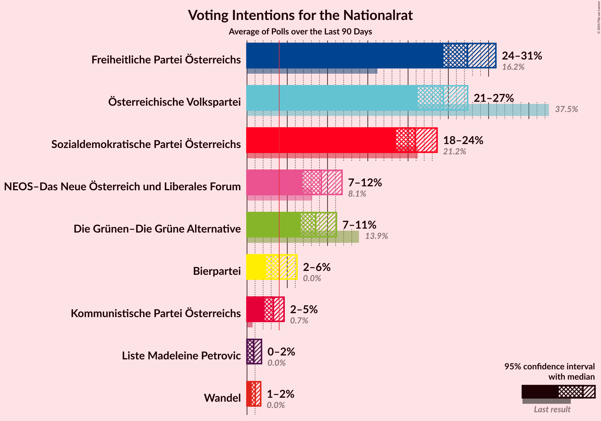
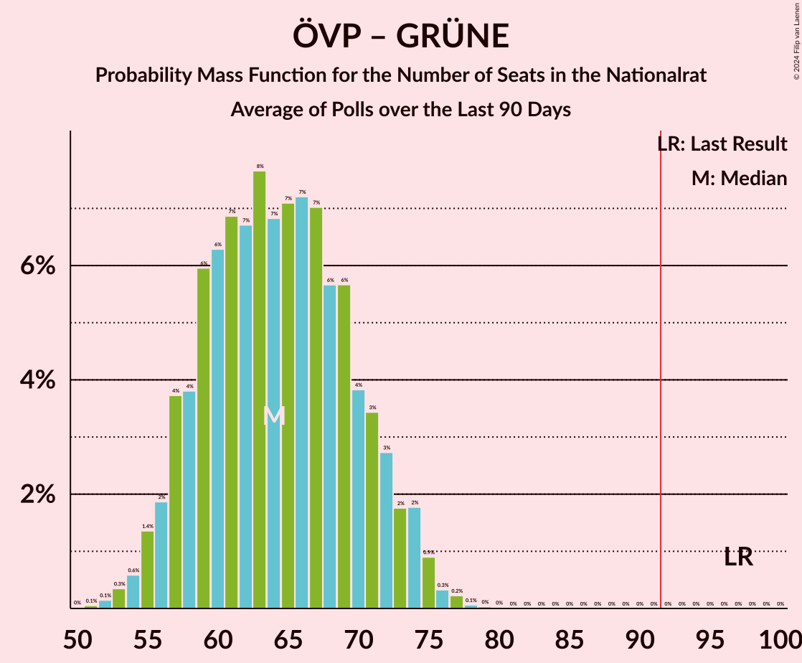

# Poll Average

<a href="#voting-intentions">Voting Intentions</a> | <a href="#seats">Seats</a> | <a href="#coalitions">Coalitions</a> | <a href="#technical-information">Technical Information</a>

## Summary

The table below lists the polls on which the average is based. They are the most recent polls (less than 90 days old) registered and analyzed so far.

| Period     | Polling firm/Commissioner(s) | ÖVP | SPÖ | FPÖ | GRÜNE | NEOS | JETZT | G!LT | HC |
|:----------:|:----------------------------:|:--:|:--:|:--:|:--:|:--:|:--:|:--:|:--:|
| 29 September 2019 | General Election | 37.5%   71 | 21.2%   40 | 16.2%   31 | 13.9%   26 | 8.1%   15 | 1.9%   0 | 0.0%   0 | 0.0%   0 |
| N/A | Poll Average | 37–44%   69–85 | 18–25%   35–47 | 8–15%   15–28 | 10–17%   19–32 | 7–12%   13–23 | N/A   N/A | N/A   N/A | 3–6%   0–11 |
| [20–22 October 2020](2020-10-22-ResearchAffairs.html) | Research Affairs | 37–45%   69–87 | 18–25%   33–47 | 8–13%   14–24 | 9–15%   17–29 | 8–13%   14–24 | N/A   N/A | N/A   N/A | 3–6%   0–11 |
| [20–22 October 2020](2020-10-22-OGM.html) | OGM | 38–42%   71–80 | 21–25%   39–47 | 10–13%   18–23 | 14–18%   27–33 | 7–9%   12–17 | N/A   N/A | N/A   N/A | N/A   N/A |
| [12–16 October 2020](2020-10-16-UniqueResearch.html) | Unique Research | 37–43%   69–82 | 19–25%   36–47 | 11–16%   20–29 | 11–16%   20–29 | 7–11%   13–21 | N/A   N/A | N/A   N/A | N/A   N/A |
| 29 September 2019 | General Election | 37.5%   71 | 21.2%   40 | 16.2%   31 | 13.9%   26 | 8.1%   15 | 1.9%   0 | 0.0%   0 | 0.0%   0 |

Only polls for which at least the sample size has been published are included in the table above.

**Legend:**
+ **Top half of each row:** Voting intentions (95% confidence interval)
+ **Bottom half of each row:** Seat projections for the Nationalrat (95% confidence interval)
+ **ÖVP:** Österreichische Volkspartei
+ **SPÖ:** Sozialdemokratische Partei Österreichs
+ **FPÖ:** Freiheitliche Partei Österreichs
+ **GRÜNE:** Die Grünen–Die Grüne Alternative
+ **NEOS:** NEOS–Das Neue Österreich und Liberales Forum
+ **JETZT:** JETZT–Liste Pilz
+ **G!LT:** Meine Stimme G!LT
+ **HC:** Team HC Strache–Allianz für Österreich
+ **N/A (single party):** Party not included the published results
+ **N/A (entire row):** Calculation for this opinion poll not started yet

## Voting Intentions

### Confidence Intervals

| Party | Last Result | Median | 80% Confidence Interval | 90% Confidence Interval | 95% Confidence Interval | 99% Confidence Interval |
|:-----:|:-----------:|:------:|:-----------------------:|:-----------------------:|:-----------------------:|:-----------------------:|
| <a href="#österreichische-volkspartei">Österreichische Volkspartei</a> | 37.5% | 40.2% | 38.2–42.7% |37.5–43.5% | 37.0–44.3% | 35.8–45.9% |
| <a href="#sozialdemokratische-partei-österreichs">Sozialdemokratische Partei Österreichs</a> | 21.2% | 22.2% | 19.8–24.1% |19.1–24.6% | 18.5–25.0% | 17.3–25.9% |
| <a href="#freiheitliche-partei-österreichs">Freiheitliche Partei Österreichs</a> | 16.2% | 11.3% | 9.4–13.7% |8.8–14.4% | 8.3–14.9% | 7.4–15.8% |
| <a href="#die-grünen–die-grüne-alternative">Die Grünen–Die Grüne Alternative</a> | 13.9% | 13.6% | 11.2–16.5% |10.6–17.0% | 10.1–17.4% | 9.2–18.1% |
| <a href="#neos–das-neue-österreich-und-liberales-forum">NEOS–Das Neue Österreich und Liberales Forum</a> | 8.1% | 8.9% | 7.6–11.0% |7.3–11.6% | 7.0–12.2% | 6.6–13.3% |
| <a href="#jetzt–liste-pilz">JETZT–Liste Pilz</a> | 1.9% | N/A | N/A |N/A | N/A | N/A |
| <a href="#meine-stimme-g!lt">Meine Stimme G!LT</a> | 0.0% | N/A | N/A |N/A | N/A | N/A |
| <a href="#team-hc-strache–allianz-für-österreich">Team HC Strache–Allianz für Österreich</a> | 0.0% | 4.1% | 3.1–5.4% |2.8–5.8% | 2.6–6.1% | 2.2–6.8% |

### Österreichische Volkspartei

*For a full overview of the results for this party, see the [Österreichische Volkspartei](party-österreichischevolkspartei.html) page.*

| Voting Intentions | Probability | Accumulated | Special Marks |
|:-----------------:|:-----------:|:-----------:|:-------------:|
| 32.5–33.5% | 0% | 100% |  |
| 33.5–34.5% | 0.1% | 100% |  |
| 34.5–35.5% | 0.3% | 99.9% |  |
| 35.5–36.5% | 1.1% | 99.7% |  |
| 36.5–37.5% | 4% | 98.5% |  |
| 37.5–38.5% | 10% | 95% | Last Result |
| 38.5–39.5% | 19% | 85% |  |
| 39.5–40.5% | 24% | 67% | Median |
| 40.5–41.5% | 20% | 43% |  |
| 41.5–42.5% | 12% | 23% |  |
| 42.5–43.5% | 6% | 11% |  |
| 43.5–44.5% | 3% | 5% |  |
| 44.5–45.5% | 1.3% | 2% |  |
| 45.5–46.5% | 0.5% | 0.7% |  |
| 46.5–47.5% | 0.2% | 0.2% |  |
| 47.5–48.5% | 0% | 0.1% |  |
| 48.5–49.5% | 0% | 0% |  |

### Sozialdemokratische Partei Österreichs

*For a full overview of the results for this party, see the [Sozialdemokratische Partei Österreichs](party-sozialdemokratischeparteiösterreichs.html) page.*

| Voting Intentions | Probability | Accumulated | Special Marks |
|:-----------------:|:-----------:|:-----------:|:-------------:|
| 14.5–15.5% | 0% | 100% |  |
| 15.5–16.5% | 0.1% | 100% |  |
| 16.5–17.5% | 0.6% | 99.9% |  |
| 17.5–18.5% | 2% | 99.3% |  |
| 18.5–19.5% | 5% | 97% |  |
| 19.5–20.5% | 10% | 92% |  |
| 20.5–21.5% | 17% | 82% | Last Result |
| 21.5–22.5% | 23% | 65% | Median |
| 22.5–23.5% | 23% | 41% |  |
| 23.5–24.5% | 13% | 18% |  |
| 24.5–25.5% | 4% | 5% |  |
| 25.5–26.5% | 0.8% | 0.9% |  |
| 26.5–27.5% | 0.1% | 0.1% |  |
| 27.5–28.5% | 0% | 0% |  |

### Freiheitliche Partei Österreichs

*For a full overview of the results for this party, see the [Freiheitliche Partei Österreichs](party-freiheitlicheparteiösterreichs.html) page.*

| Voting Intentions | Probability | Accumulated | Special Marks |
|:-----------------:|:-----------:|:-----------:|:-------------:|
| 5.5–6.5% | 0% | 100% |  |
| 6.5–7.5% | 0.6% | 100% |  |
| 7.5–8.5% | 3% | 99.4% |  |
| 8.5–9.5% | 8% | 96% |  |
| 9.5–10.5% | 18% | 88% |  |
| 10.5–11.5% | 26% | 70% | Median |
| 11.5–12.5% | 19% | 44% |  |
| 12.5–13.5% | 13% | 25% |  |
| 13.5–14.5% | 8% | 12% |  |
| 14.5–15.5% | 3% | 4% |  |
| 15.5–16.5% | 0.7% | 0.8% | Last Result |
| 16.5–17.5% | 0.1% | 0.1% |  |
| 17.5–18.5% | 0% | 0% |  |

### Die Grünen–Die Grüne Alternative

*For a full overview of the results for this party, see the [Die Grünen–Die Grüne Alternative](party-diegrünen–diegrünealternative.html) page.*

| Voting Intentions | Probability | Accumulated | Special Marks |
|:-----------------:|:-----------:|:-----------:|:-------------:|
| 6.5–7.5% | 0% | 100% |  |
| 7.5–8.5% | 0.1% | 100% |  |
| 8.5–9.5% | 0.9% | 99.9% |  |
| 9.5–10.5% | 4% | 99.0% |  |
| 10.5–11.5% | 10% | 95% |  |
| 11.5–12.5% | 17% | 85% |  |
| 12.5–13.5% | 18% | 69% |  |
| 13.5–14.5% | 13% | 51% | Last Result, Median |
| 14.5–15.5% | 12% | 38% |  |
| 15.5–16.5% | 15% | 25% |  |
| 16.5–17.5% | 8% | 10% |  |
| 17.5–18.5% | 2% | 2% |  |
| 18.5–19.5% | 0.1% | 0.1% |  |
| 19.5–20.5% | 0% | 0% |  |

### NEOS–Das Neue Österreich und Liberales Forum

*For a full overview of the results for this party, see the [NEOS–Das Neue Österreich und Liberales Forum](party-neos–dasneueösterreichundliberalesforum.html) page.*

| Voting Intentions | Probability | Accumulated | Special Marks |
|:-----------------:|:-----------:|:-----------:|:-------------:|
| 4.5–5.5% | 0% | 100% |  |
| 5.5–6.5% | 0.4% | 100% |  |
| 6.5–7.5% | 9% | 99.6% |  |
| 7.5–8.5% | 29% | 90% | Last Result |
| 8.5–9.5% | 27% | 61% | Median |
| 9.5–10.5% | 18% | 34% |  |
| 10.5–11.5% | 10% | 15% |  |
| 11.5–12.5% | 4% | 5% |  |
| 12.5–13.5% | 1.2% | 2% |  |
| 13.5–14.5% | 0.3% | 0.3% |  |
| 14.5–15.5% | 0% | 0.1% |  |
| 15.5–16.5% | 0% | 0% |  |

### Team HC Strache–Allianz für Österreich

*For a full overview of the results for this party, see the [Team HC Strache–Allianz für Österreich](party-teamhcstrache–allianzfürösterreich.html) page.*

| Voting Intentions | Probability | Accumulated | Special Marks |
|:-----------------:|:-----------:|:-----------:|:-------------:|
| 0.0–0.5% | 0% | 100% | Last Result |
| 0.5–1.5% | 0% | 100% |  |
| 1.5–2.5% | 2% | 100% |  |
| 2.5–3.5% | 23% | 98% |  |
| 3.5–4.5% | 43% | 75% | Median |
| 4.5–5.5% | 25% | 32% |  |
| 5.5–6.5% | 6% | 7% |  |
| 6.5–7.5% | 0.8% | 0.9% |  |
| 7.5–8.5% | 0.1% | 0.1% |  |
| 8.5–9.5% | 0% | 0% |  |

## Seats

### Confidence Intervals

| Party | Last Result | Median | 80% Confidence Interval | 90% Confidence Interval | 95% Confidence Interval | 99% Confidence Interval |
|:-----:|:-----------:|:------:|:-----------------------:|:-----------------------:|:-----------------------:|:-----------------------:|
| <a href="#österreichische-volkspartei">Österreichische Volkspartei</a> | 71 | 76 | 72–81 |71–83 | 69–85 | 67–88 |
| <a href="#sozialdemokratische-partei-österreichs">Sozialdemokratische Partei Österreichs</a> | 40 | 42 | 37–45 |36–46 | 35–47 | 32–49 |
| <a href="#freiheitliche-partei-österreichs">Freiheitliche Partei Österreichs</a> | 31 | 21 | 17–26 |16–27 | 15–28 | 14–30 |
| <a href="#die-grünen–die-grüne-alternative">Die Grünen–Die Grüne Alternative</a> | 26 | 25 | 21–31 |20–32 | 19–32 | 17–34 |
| <a href="#neos–das-neue-österreich-und-liberales-forum">NEOS–Das Neue Österreich und Liberales Forum</a> | 15 | 16 | 14–20 |13–22 | 13–23 | 12–25 |
| <a href="#jetzt–liste-pilz">JETZT–Liste Pilz</a> | 0 | N/A | N/A |N/A | N/A | N/A |
| <a href="#meine-stimme-g!lt">Meine Stimme G!LT</a> | 0 | N/A | N/A |N/A | N/A | N/A |
| <a href="#team-hc-strache–allianz-für-österreich">Team HC Strache–Allianz für Österreich</a> | 0 | 7 | 0–10 |0–10 | 0–11 | 0–12 |

### Österreichische Volkspartei

*For a full overview of the results for this party, see the [Österreichische Volkspartei](party-österreichischevolkspartei.html) page.*

| Number of Seats | Probability | Accumulated | Special Marks |
|:---------------:|:-----------:|:-----------:|:-------------:|
| 64 | 0% | 100% |  |
| 65 | 0.1% | 99.9% |  |
| 66 | 0.2% | 99.9% |  |
| 67 | 0.3% | 99.7% |  |
| 68 | 0.7% | 99.4% |  |
| 69 | 1.2% | 98.7% |  |
| 70 | 2% | 97% |  |
| 71 | 4% | 95% | Last Result |
| 72 | 6% | 91% |  |
| 73 | 9% | 85% |  |
| 74 | 11% | 77% |  |
| 75 | 12% | 66% |  |
| 76 | 12% | 54% | Median |
| 77 | 10% | 42% |  |
| 78 | 8% | 32% |  |
| 79 | 6% | 23% |  |
| 80 | 5% | 17% |  |
| 81 | 3% | 12% |  |
| 82 | 3% | 8% |  |
| 83 | 2% | 6% |  |
| 84 | 1.3% | 4% |  |
| 85 | 0.9% | 3% |  |
| 86 | 0.6% | 2% |  |
| 87 | 0.4% | 1.1% |  |
| 88 | 0.3% | 0.6% |  |
| 89 | 0.2% | 0.4% |  |
| 90 | 0.1% | 0.2% |  |
| 91 | 0.1% | 0.1% |  |
| 92 | 0% | 0.1% | Majority |
| 93 | 0% | 0% |  |

### Sozialdemokratische Partei Österreichs

*For a full overview of the results for this party, see the [Sozialdemokratische Partei Österreichs](party-sozialdemokratischeparteiösterreichs.html) page.*

| Number of Seats | Probability | Accumulated | Special Marks |
|:---------------:|:-----------:|:-----------:|:-------------:|
| 30 | 0.1% | 100% |  |
| 31 | 0.1% | 99.9% |  |
| 32 | 0.3% | 99.8% |  |
| 33 | 0.6% | 99.4% |  |
| 34 | 1.2% | 98.9% |  |
| 35 | 2% | 98% |  |
| 36 | 3% | 96% |  |
| 37 | 5% | 93% |  |
| 38 | 6% | 88% |  |
| 39 | 7% | 82% |  |
| 40 | 12% | 75% | Last Result |
| 41 | 12% | 64% |  |
| 42 | 12% | 52% | Median |
| 43 | 15% | 40% |  |
| 44 | 10% | 25% |  |
| 45 | 7% | 15% |  |
| 46 | 5% | 8% |  |
| 47 | 2% | 4% |  |
| 48 | 0.9% | 2% |  |
| 49 | 0.4% | 0.7% |  |
| 50 | 0.2% | 0.3% |  |
| 51 | 0.1% | 0.1% |  |
| 52 | 0% | 0% |  |

### Freiheitliche Partei Österreichs

*For a full overview of the results for this party, see the [Freiheitliche Partei Österreichs](party-freiheitlicheparteiösterreichs.html) page.*

| Number of Seats | Probability | Accumulated | Special Marks |
|:---------------:|:-----------:|:-----------:|:-------------:|
| 12 | 0.1% | 100% |  |
| 13 | 0.3% | 99.9% |  |
| 14 | 0.9% | 99.6% |  |
| 15 | 1.5% | 98.7% |  |
| 16 | 4% | 97% |  |
| 17 | 4% | 94% |  |
| 18 | 8% | 89% |  |
| 19 | 11% | 81% |  |
| 20 | 14% | 70% |  |
| 21 | 14% | 56% | Median |
| 22 | 10% | 42% |  |
| 23 | 9% | 32% |  |
| 24 | 7% | 24% |  |
| 25 | 6% | 17% |  |
| 26 | 5% | 11% |  |
| 27 | 3% | 6% |  |
| 28 | 2% | 3% |  |
| 29 | 0.8% | 1.3% |  |
| 30 | 0.3% | 0.5% |  |
| 31 | 0.1% | 0.2% | Last Result |
| 32 | 0% | 0.1% |  |
| 33 | 0% | 0% |  |

### Die Grünen–Die Grüne Alternative

*For a full overview of the results for this party, see the [Die Grünen–Die Grüne Alternative](party-diegrünen–diegrünealternative.html) page.*

| Number of Seats | Probability | Accumulated | Special Marks |
|:---------------:|:-----------:|:-----------:|:-------------:|
| 15 | 0.1% | 100% |  |
| 16 | 0.2% | 99.9% |  |
| 17 | 0.6% | 99.7% |  |
| 18 | 1.2% | 99.1% |  |
| 19 | 2% | 98% |  |
| 20 | 4% | 95% |  |
| 21 | 6% | 91% |  |
| 22 | 8% | 85% |  |
| 23 | 10% | 77% |  |
| 24 | 10% | 68% |  |
| 25 | 9% | 57% | Median |
| 26 | 7% | 49% | Last Result |
| 27 | 6% | 42% |  |
| 28 | 7% | 35% |  |
| 29 | 8% | 28% |  |
| 30 | 8% | 20% |  |
| 31 | 6% | 12% |  |
| 32 | 4% | 6% |  |
| 33 | 2% | 2% |  |
| 34 | 0.5% | 0.6% |  |
| 35 | 0.1% | 0.1% |  |
| 36 | 0% | 0% |  |

### NEOS–Das Neue Österreich und Liberales Forum

*For a full overview of the results for this party, see the [NEOS–Das Neue Österreich und Liberales Forum](party-neos–dasneueösterreichundliberalesforum.html) page.*

| Number of Seats | Probability | Accumulated | Special Marks |
|:---------------:|:-----------:|:-----------:|:-------------:|
| 11 | 0.2% | 100% |  |
| 12 | 1.3% | 99.8% |  |
| 13 | 6% | 98.5% |  |
| 14 | 12% | 93% |  |
| 15 | 16% | 81% | Last Result |
| 16 | 15% | 65% | Median |
| 17 | 14% | 49% |  |
| 18 | 11% | 35% |  |
| 19 | 8% | 25% |  |
| 20 | 7% | 16% |  |
| 21 | 4% | 10% |  |
| 22 | 3% | 6% |  |
| 23 | 2% | 3% |  |
| 24 | 0.7% | 1.5% |  |
| 25 | 0.5% | 0.8% |  |
| 26 | 0.2% | 0.3% |  |
| 27 | 0.1% | 0.1% |  |
| 28 | 0% | 0.1% |  |
| 29 | 0% | 0% |  |

### JETZT–Liste Pilz

*For a full overview of the results for this party, see the [JETZT–Liste Pilz](party-jetzt–listepilz.html) page.*

### Meine Stimme G!LT

*For a full overview of the results for this party, see the [Meine Stimme G!LT](party-meinestimmeglt.html) page.*

### Team HC Strache–Allianz für Österreich

*For a full overview of the results for this party, see the [Team HC Strache–Allianz für Österreich](party-teamhcstrache–allianzfürösterreich.html) page.*

| Number of Seats | Probability | Accumulated | Special Marks |
|:---------------:|:-----------:|:-----------:|:-------------:|
| 0 | 46% | 100% | Last Result |
| 1 | 0% | 54% |  |
| 2 | 0% | 54% |  |
| 3 | 0% | 54% |  |
| 4 | 0% | 54% |  |
| 5 | 0% | 54% |  |
| 6 | 0% | 54% |  |
| 7 | 10% | 54% | Median |
| 8 | 20% | 44% |  |
| 9 | 13% | 24% |  |
| 10 | 7% | 11% |  |
| 11 | 3% | 4% |  |
| 12 | 1.0% | 1.4% |  |
| 13 | 0.3% | 0.4% |  |
| 14 | 0.1% | 0.1% |  |
| 15 | 0% | 0% |  |

## Coalitions

### Confidence Intervals

| Coalition | Last Result | Median | Majority? | 80% Confidence Interval | 90% Confidence Interval | 95% Confidence Interval | 99% Confidence Interval |
|:---------:|:-----------:|:------:|:---------:|:-----------------------:|:-----------------------:|:-----------------------:|:-----------------------:|
| Österreichische Volkspartei – Die Grünen–Die Grüne Alternative – NEOS–Das Neue Österreich und Liberales Forum | 112 | 119 | 100% | 114–123 | 112–125 | 111–127 | 108–130 |
| Österreichische Volkspartei – Sozialdemokratische Partei Österreichs | 111 | 118 | 100% | 113–122 | 111–123 | 110–125 | 107–128 |
| Österreichische Volkspartei – Die Grünen–Die Grüne Alternative | 97 | 102 | 98.8% | 96–107 | 94–108 | 93–109 | 90–111 |
| Österreichische Volkspartei – Freiheitliche Partei Österreichs | 102 | 97 | 94% | 92–103 | 91–104 | 90–106 | 87–108 |
| Österreichische Volkspartei – NEOS–Das Neue Österreich und Liberales Forum | 86 | 92 | 57% | 88–100 | 87–102 | 86–104 | 84–107 |
| Sozialdemokratische Partei Österreichs – Die Grünen–Die Grüne Alternative – NEOS–Das Neue Österreich und Liberales Forum | 81 | 84 | 2% | 78–89 | 76–90 | 75–91 | 72–93 |
| Österreichische Volkspartei | 71 | 76 | 0.1% | 72–81 | 71–83 | 69–85 | 67–88 |
| Sozialdemokratische Partei Österreichs – Die Grünen–Die Grüne Alternative | 66 | 67 | 0% | 60–74 | 58–75 | 56–76 | 54–78 |
| Sozialdemokratische Partei Österreichs – Freiheitliche Partei Österreichs | 71 | 63 | 0% | 56–68 | 54–69 | 53–70 | 50–73 |
| Sozialdemokratische Partei Österreichs | 40 | 42 | 0% | 37–45 | 36–46 | 35–47 | 32–49 |

### Österreichische Volkspartei – Die Grünen–Die Grüne Alternative – NEOS–Das Neue Österreich und Liberales Forum

| Number of Seats | Probability | Accumulated | Special Marks |
|:---------------:|:-----------:|:-----------:|:-------------:|
| 105 | 0% | 100% |  |
| 106 | 0.1% | 99.9% |  |
| 107 | 0.2% | 99.8% |  |
| 108 | 0.4% | 99.6% |  |
| 109 | 0.5% | 99.2% |  |
| 110 | 1.1% | 98.7% |  |
| 111 | 2% | 98% |  |
| 112 | 2% | 96% | Last Result |
| 113 | 3% | 94% |  |
| 114 | 5% | 91% |  |
| 115 | 5% | 86% |  |
| 116 | 8% | 81% |  |
| 117 | 10% | 73% | Median |
| 118 | 10% | 63% |  |
| 119 | 12% | 53% |  |
| 120 | 11% | 41% |  |
| 121 | 9% | 30% |  |
| 122 | 7% | 21% |  |
| 123 | 5% | 14% |  |
| 124 | 3% | 9% |  |
| 125 | 2% | 6% |  |
| 126 | 1.3% | 4% |  |
| 127 | 1.3% | 3% |  |
| 128 | 0.5% | 2% |  |
| 129 | 0.5% | 1.1% |  |
| 130 | 0.3% | 0.7% |  |
| 131 | 0.1% | 0.4% |  |
| 132 | 0.1% | 0.2% |  |
| 133 | 0% | 0.1% |  |
| 134 | 0% | 0% |  |

### Österreichische Volkspartei – Sozialdemokratische Partei Österreichs

| Number of Seats | Probability | Accumulated | Special Marks |
|:---------------:|:-----------:|:-----------:|:-------------:|
| 104 | 0.1% | 100% |  |
| 105 | 0.1% | 99.9% |  |
| 106 | 0.2% | 99.8% |  |
| 107 | 0.3% | 99.6% |  |
| 108 | 0.6% | 99.3% |  |
| 109 | 1.0% | 98.7% |  |
| 110 | 1.3% | 98% |  |
| 111 | 2% | 96% | Last Result |
| 112 | 3% | 95% |  |
| 113 | 4% | 91% |  |
| 114 | 6% | 87% |  |
| 115 | 8% | 81% |  |
| 116 | 10% | 73% |  |
| 117 | 11% | 63% |  |
| 118 | 13% | 52% | Median |
| 119 | 12% | 39% |  |
| 120 | 9% | 28% |  |
| 121 | 7% | 19% |  |
| 122 | 4% | 12% |  |
| 123 | 3% | 8% |  |
| 124 | 2% | 5% |  |
| 125 | 1.1% | 3% |  |
| 126 | 0.8% | 2% |  |
| 127 | 0.5% | 1.2% |  |
| 128 | 0.3% | 0.7% |  |
| 129 | 0.2% | 0.4% |  |
| 130 | 0.1% | 0.2% |  |
| 131 | 0.1% | 0.1% |  |
| 132 | 0% | 0.1% |  |
| 133 | 0% | 0% |  |

### Österreichische Volkspartei – Die Grünen–Die Grüne Alternative

| Number of Seats | Probability | Accumulated | Special Marks |
|:---------------:|:-----------:|:-----------:|:-------------:|
| 87 | 0% | 100% |  |
| 88 | 0.1% | 99.9% |  |
| 89 | 0.2% | 99.8% |  |
| 90 | 0.3% | 99.6% |  |
| 91 | 0.5% | 99.3% |  |
| 92 | 0.9% | 98.8% | Majority |
| 93 | 1.4% | 98% |  |
| 94 | 2% | 97% |  |
| 95 | 3% | 94% |  |
| 96 | 4% | 92% |  |
| 97 | 5% | 88% | Last Result |
| 98 | 6% | 83% |  |
| 99 | 7% | 77% |  |
| 100 | 7% | 71% |  |
| 101 | 8% | 64% | Median |
| 102 | 8% | 56% |  |
| 103 | 9% | 48% |  |
| 104 | 10% | 39% |  |
| 105 | 9% | 29% |  |
| 106 | 7% | 20% |  |
| 107 | 5% | 13% |  |
| 108 | 4% | 7% |  |
| 109 | 2% | 4% |  |
| 110 | 1.0% | 2% |  |
| 111 | 0.5% | 1.0% |  |
| 112 | 0.2% | 0.5% |  |
| 113 | 0.1% | 0.2% |  |
| 114 | 0.1% | 0.1% |  |
| 115 | 0% | 0.1% |  |
| 116 | 0% | 0% |  |

### Österreichische Volkspartei – Freiheitliche Partei Österreichs

| Number of Seats | Probability | Accumulated | Special Marks |
|:---------------:|:-----------:|:-----------:|:-------------:|
| 83 | 0% | 100% |  |
| 84 | 0.1% | 99.9% |  |
| 85 | 0.1% | 99.9% |  |
| 86 | 0.2% | 99.8% |  |
| 87 | 0.4% | 99.5% |  |
| 88 | 0.5% | 99.1% |  |
| 89 | 0.9% | 98.6% |  |
| 90 | 2% | 98% |  |
| 91 | 2% | 96% |  |
| 92 | 4% | 94% | Majority |
| 93 | 6% | 90% |  |
| 94 | 8% | 84% |  |
| 95 | 9% | 76% |  |
| 96 | 10% | 66% |  |
| 97 | 10% | 56% | Median |
| 98 | 9% | 46% |  |
| 99 | 8% | 37% |  |
| 100 | 7% | 29% |  |
| 101 | 6% | 22% |  |
| 102 | 5% | 16% | Last Result |
| 103 | 4% | 11% |  |
| 104 | 3% | 7% |  |
| 105 | 2% | 5% |  |
| 106 | 1.2% | 3% |  |
| 107 | 0.7% | 2% |  |
| 108 | 0.4% | 0.8% |  |
| 109 | 0.2% | 0.4% |  |
| 110 | 0.1% | 0.2% |  |
| 111 | 0% | 0.1% |  |
| 112 | 0% | 0% |  |

### Österreichische Volkspartei – NEOS–Das Neue Österreich und Liberales Forum

| Number of Seats | Probability | Accumulated | Special Marks |
|:---------------:|:-----------:|:-----------:|:-------------:|
| 81 | 0% | 100% |  |
| 82 | 0.1% | 99.9% |  |
| 83 | 0.2% | 99.9% |  |
| 84 | 0.6% | 99.6% |  |
| 85 | 1.2% | 99.0% |  |
| 86 | 2% | 98% | Last Result |
| 87 | 4% | 95% |  |
| 88 | 6% | 91% |  |
| 89 | 8% | 85% |  |
| 90 | 10% | 76% |  |
| 91 | 10% | 67% |  |
| 92 | 9% | 57% | Median, Majority |
| 93 | 8% | 48% |  |
| 94 | 7% | 39% |  |
| 95 | 6% | 32% |  |
| 96 | 5% | 26% |  |
| 97 | 4% | 21% |  |
| 98 | 4% | 17% |  |
| 99 | 3% | 13% |  |
| 100 | 3% | 10% |  |
| 101 | 2% | 7% |  |
| 102 | 1.4% | 5% |  |
| 103 | 1.3% | 4% |  |
| 104 | 0.8% | 3% |  |
| 105 | 0.7% | 2% |  |
| 106 | 0.4% | 1.2% |  |
| 107 | 0.4% | 0.8% |  |
| 108 | 0.1% | 0.4% |  |
| 109 | 0.1% | 0.3% |  |
| 110 | 0.1% | 0.1% |  |
| 111 | 0% | 0.1% |  |
| 112 | 0% | 0% |  |

### Sozialdemokratische Partei Österreichs – Die Grünen–Die Grüne Alternative – NEOS–Das Neue Österreich und Liberales Forum

| Number of Seats | Probability | Accumulated | Special Marks |
|:---------------:|:-----------:|:-----------:|:-------------:|
| 68 | 0% | 100% |  |
| 69 | 0.1% | 99.9% |  |
| 70 | 0.1% | 99.9% |  |
| 71 | 0.2% | 99.8% |  |
| 72 | 0.4% | 99.5% |  |
| 73 | 0.6% | 99.2% |  |
| 74 | 1.0% | 98.5% |  |
| 75 | 1.4% | 98% |  |
| 76 | 2% | 96% |  |
| 77 | 3% | 94% |  |
| 78 | 4% | 91% |  |
| 79 | 4% | 87% |  |
| 80 | 6% | 83% |  |
| 81 | 6% | 77% | Last Result |
| 82 | 7% | 71% |  |
| 83 | 7% | 64% | Median |
| 84 | 8% | 56% |  |
| 85 | 8% | 49% |  |
| 86 | 9% | 40% |  |
| 87 | 9% | 32% |  |
| 88 | 8% | 23% |  |
| 89 | 6% | 15% |  |
| 90 | 4% | 9% |  |
| 91 | 3% | 5% |  |
| 92 | 1.3% | 2% | Majority |
| 93 | 0.5% | 0.9% |  |
| 94 | 0.2% | 0.4% |  |
| 95 | 0.1% | 0.1% |  |
| 96 | 0% | 0.1% |  |
| 97 | 0% | 0% |  |

### Österreichische Volkspartei

| Number of Seats | Probability | Accumulated | Special Marks |
|:---------------:|:-----------:|:-----------:|:-------------:|
| 64 | 0% | 100% |  |
| 65 | 0.1% | 99.9% |  |
| 66 | 0.2% | 99.9% |  |
| 67 | 0.3% | 99.7% |  |
| 68 | 0.7% | 99.4% |  |
| 69 | 1.2% | 98.7% |  |
| 70 | 2% | 97% |  |
| 71 | 4% | 95% | Last Result |
| 72 | 6% | 91% |  |
| 73 | 9% | 85% |  |
| 74 | 11% | 77% |  |
| 75 | 12% | 66% |  |
| 76 | 12% | 54% | Median |
| 77 | 10% | 42% |  |
| 78 | 8% | 32% |  |
| 79 | 6% | 23% |  |
| 80 | 5% | 17% |  |
| 81 | 3% | 12% |  |
| 82 | 3% | 8% |  |
| 83 | 2% | 6% |  |
| 84 | 1.3% | 4% |  |
| 85 | 0.9% | 3% |  |
| 86 | 0.6% | 2% |  |
| 87 | 0.4% | 1.1% |  |
| 88 | 0.3% | 0.6% |  |
| 89 | 0.2% | 0.4% |  |
| 90 | 0.1% | 0.2% |  |
| 91 | 0.1% | 0.1% |  |
| 92 | 0% | 0.1% | Majority |
| 93 | 0% | 0% |  |

### Sozialdemokratische Partei Österreichs – Die Grünen–Die Grüne Alternative

| Number of Seats | Probability | Accumulated | Special Marks |
|:---------------:|:-----------:|:-----------:|:-------------:|
| 51 | 0.1% | 100% |  |
| 52 | 0.1% | 99.9% |  |
| 53 | 0.2% | 99.7% |  |
| 54 | 0.4% | 99.5% |  |
| 55 | 0.7% | 99.2% |  |
| 56 | 1.0% | 98% |  |
| 57 | 2% | 97% |  |
| 58 | 2% | 96% |  |
| 59 | 3% | 94% |  |
| 60 | 4% | 91% |  |
| 61 | 5% | 88% |  |
| 62 | 5% | 83% |  |
| 63 | 6% | 78% |  |
| 64 | 7% | 72% |  |
| 65 | 6% | 65% |  |
| 66 | 6% | 59% | Last Result |
| 67 | 6% | 53% | Median |
| 68 | 5% | 47% |  |
| 69 | 5% | 42% |  |
| 70 | 6% | 37% |  |
| 71 | 6% | 32% |  |
| 72 | 6% | 26% |  |
| 73 | 6% | 20% |  |
| 74 | 5% | 14% |  |
| 75 | 4% | 8% |  |
| 76 | 2% | 4% |  |
| 77 | 1.1% | 2% |  |
| 78 | 0.4% | 0.7% |  |
| 79 | 0.2% | 0.2% |  |
| 80 | 0.1% | 0.1% |  |
| 81 | 0% | 0% |  |

### Sozialdemokratische Partei Österreichs – Freiheitliche Partei Österreichs

| Number of Seats | Probability | Accumulated | Special Marks |
|:---------------:|:-----------:|:-----------:|:-------------:|
| 47 | 0.1% | 100% |  |
| 48 | 0.1% | 99.9% |  |
| 49 | 0.2% | 99.8% |  |
| 50 | 0.3% | 99.6% |  |
| 51 | 0.6% | 99.3% |  |
| 52 | 1.0% | 98.8% |  |
| 53 | 1.1% | 98% |  |
| 54 | 2% | 97% |  |
| 55 | 2% | 95% |  |
| 56 | 3% | 93% |  |
| 57 | 3% | 90% |  |
| 58 | 3% | 87% |  |
| 59 | 5% | 83% |  |
| 60 | 6% | 79% |  |
| 61 | 8% | 73% |  |
| 62 | 9% | 65% |  |
| 63 | 11% | 56% | Median |
| 64 | 11% | 45% |  |
| 65 | 9% | 34% |  |
| 66 | 8% | 26% |  |
| 67 | 6% | 17% |  |
| 68 | 4% | 11% |  |
| 69 | 3% | 8% |  |
| 70 | 2% | 4% |  |
| 71 | 1.0% | 2% | Last Result |
| 72 | 0.7% | 1.4% |  |
| 73 | 0.4% | 0.7% |  |
| 74 | 0.1% | 0.3% |  |
| 75 | 0.1% | 0.1% |  |
| 76 | 0% | 0.1% |  |
| 77 | 0% | 0% |  |

### Sozialdemokratische Partei Österreichs

| Number of Seats | Probability | Accumulated | Special Marks |
|:---------------:|:-----------:|:-----------:|:-------------:|
| 30 | 0.1% | 100% |  |
| 31 | 0.1% | 99.9% |  |
| 32 | 0.3% | 99.8% |  |
| 33 | 0.6% | 99.4% |  |
| 34 | 1.2% | 98.9% |  |
| 35 | 2% | 98% |  |
| 36 | 3% | 96% |  |
| 37 | 5% | 93% |  |
| 38 | 6% | 88% |  |
| 39 | 7% | 82% |  |
| 40 | 12% | 75% | Last Result |
| 41 | 12% | 64% |  |
| 42 | 12% | 52% | Median |
| 43 | 15% | 40% |  |
| 44 | 10% | 25% |  |
| 45 | 7% | 15% |  |
| 46 | 5% | 8% |  |
| 47 | 2% | 4% |  |
| 48 | 0.9% | 2% |  |
| 49 | 0.4% | 0.7% |  |
| 50 | 0.2% | 0.3% |  |
| 51 | 0.1% | 0.1% |  |
| 52 | 0% | 0% |  |

## Technical Information

+ **Number of polls included in this average:** 3
+ **Lowest number of simulations done in a poll included in this average:** 1,048,576
+ **Total number of simulations done in the polls included in this average:** 3,145,728
+ **Error estimate:** 0.79%
