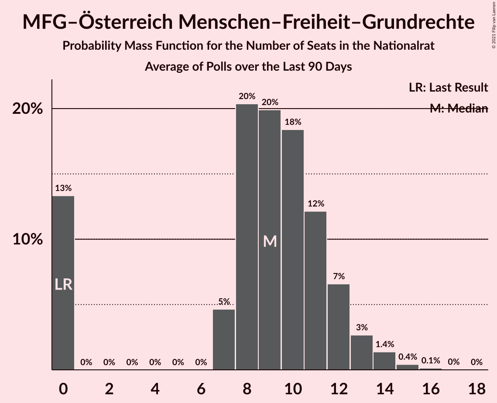

# Poll Average

<a href="#voting-intentions">Voting Intentions</a> | <a href="#seats">Seats</a> | <a href="#coalitions">Coalitions</a> | <a href="#technical-information">Technical Information</a>

## Summary

The table below lists the polls on which the average is based. They are the most recent polls (less than 90 days old) registered and analyzed so far.

| Period     | Polling firm/Commissioner(s) | ÖVP | SPÖ | FPÖ | GRÜNE | NEOS | JETZT | G!LT | HC | MFG | KPÖ |
|:----------:|:----------------------------:|:--:|:--:|:--:|:--:|:--:|:--:|:--:|:--:|:--:|:--:|
| 29 September 2019 | General Election | 37.5%   71 | 21.2%   40 | 16.2%   31 | 13.9%   26 | 8.1%   15 | 1.9%   0 | 0.0%   0 | 0.0%   0 | 0.0%   0 | 0.7%   0 |
| N/A | Poll Average | 24–38%   44–71 | 19–27%   35–51 | 13–23%   25–43 | 9–14%   16–25 | 8–14%   14–27 | N/A   N/A | N/A   N/A | N/A   N/A | 3–7%   0–13 | 3–6%   0–11 |
| [12–15 October 2021](2021-10-15-OGM.html) | OGM   KURIER | 24–29%   43–53 | 22–27%   40–49 | 19–23%   34–43 | 10–14%   19–25 | 10–14%   18–26 | N/A   N/A | N/A   N/A | N/A   N/A | N/A   N/A | N/A   N/A |
| [11–12 October 2021](2021-10-12-Market.html) | Market   Der Standard | 24–30%   45–57 | 22–28%   41–53 | 18–24%   34–45 | 9–13%   17–25 | 11–16%   20–29 | N/A   N/A | N/A   N/A | N/A   N/A | N/A   N/A | N/A   N/A |
| [7–11 October 2021](2021-10-11-IFDD.html) | IFDD | 24–28%   44–52 | 23–27%   42–50 | 19–23%   35–42 | 10–13%   17–23 | 10–13%   19–21 | N/A   N/A | N/A   N/A | N/A   N/A | N/A   N/A | N/A   N/A |
| [28–30 September 2021](2021-09-30-ResearchAffairs.html) | Research Affairs   ÖSTERREICH | 30–38%   56–73 | 19–26%   35–49 | 12–18%   23–35 | 8–13%   14–24 | 7–12%   13–22 | N/A   N/A | N/A   N/A | N/A   N/A | 3–7%   0–13 | 3–6%   0–11 |
| [2–5 August 2021](2021-08-05-UniqueResearch.html) | Unique Research   profil | 32–38%   59–72 | 18–24%   34–45 | 16–22%   30–41 | 10–14%   18–27 | 9–13%   17–25 | N/A   N/A | N/A   N/A | N/A   N/A | N/A   N/A | N/A   N/A |
| 29 September 2019 | General Election | 37.5%   71 | 21.2%   40 | 16.2%   31 | 13.9%   26 | 8.1%   15 | 1.9%   0 | 0.0%   0 | 0.0%   0 | 0.0%   0 | 0.7%   0 |

Only polls for which at least the sample size has been published are included in the table above.

**Legend:**
+ **Top half of each row:** Voting intentions (95% confidence interval)
+ **Bottom half of each row:** Seat projections for the Nationalrat (95% confidence interval)
+ **ÖVP:** Österreichische Volkspartei
+ **SPÖ:** Sozialdemokratische Partei Österreichs
+ **FPÖ:** Freiheitliche Partei Österreichs
+ **GRÜNE:** Die Grünen–Die Grüne Alternative
+ **NEOS:** NEOS–Das Neue Österreich und Liberales Forum
+ **JETZT:** JETZT–Liste Pilz
+ **G!LT:** Meine Stimme G!LT
+ **HC:** Team HC Strache–Allianz für Österreich
+ **MFG:** MFG–Österreich Menschen–Freiheit–Grundrechte
+ **KPÖ:** Kommunistische Partei Österreichs
+ **N/A (single party):** Party not included the published results
+ **N/A (entire row):** Calculation for this opinion poll not started yet

## Voting Intentions

### Confidence Intervals

| Party | Last Result | Median | 80% Confidence Interval | 90% Confidence Interval | 95% Confidence Interval | 99% Confidence Interval |
|:-----:|:-----------:|:------:|:-----------------------:|:-----------------------:|:-----------------------:|:-----------------------:|
| <a href="#österreichische-volkspartei">Österreichische Volkspartei</a> | 37.5% | 27.7% | 25.0–35.9% |24.5–36.8% | 24.1–37.5% | 23.2–38.9% |
| <a href="#sozialdemokratische-partei-österreichs">Sozialdemokratische Partei Österreichs</a> | 21.2% | 23.7% | 20.4–26.1% |19.6–26.7% | 19.0–27.2% | 18.0–28.2% |
| <a href="#freiheitliche-partei-österreichs">Freiheitliche Partei Österreichs</a> | 16.2% | 20.2% | 15.1–22.2% |14.1–22.8% | 13.3–23.2% | 12.2–24.2% |
| <a href="#die-grünen–die-grüne-alternative">Die Grünen–Die Grüne Alternative</a> | 13.9% | 11.3% | 9.7–12.9% |9.1–13.4% | 8.6–13.8% | 7.8–14.6% |
| <a href="#neos–das-neue-österreich-und-liberales-forum">NEOS–Das Neue Österreich und Liberales Forum</a> | 8.1% | 11.3% | 9.1–13.4% |8.3–14.0% | 7.8–14.5% | 6.9–15.5% |
| <a href="#jetzt–liste-pilz">JETZT–Liste Pilz</a> | 1.9% | N/A | N/A |N/A | N/A | N/A |
| <a href="#kommunistische-partei-österreichs">Kommunistische Partei Österreichs</a> | 0.7% | 4.1% | 3.0–5.3% |2.8–5.7% | 2.6–6.0% | 2.2–6.7% |
| <a href="#meine-stimme-g!lt">Meine Stimme G!LT</a> | 0.0% | N/A | N/A |N/A | N/A | N/A |
| <a href="#team-hc-strache–allianz-für-österreich">Team HC Strache–Allianz für Österreich</a> | 0.0% | N/A | N/A |N/A | N/A | N/A |
| <a href="#mfg–österreich-menschen–freiheit–grundrechte">MFG–Österreich Menschen–Freiheit–Grundrechte</a> | 0.0% | 5.1% | 3.9–6.4% |3.6–6.8% | 3.4–7.2% | 2.9–8.0% |

### Österreichische Volkspartei

*For a full overview of the results for this party, see the [Österreichische Volkspartei](party-österreichischevolkspartei.html) page.*

| Voting Intentions | Probability | Accumulated | Special Marks |
|:-----------------:|:-----------:|:-----------:|:-------------:|
| 20.5–21.5% | 0% | 100% |  |
| 21.5–22.5% | 0.1% | 100% |  |
| 22.5–23.5% | 0.9% | 99.9% |  |
| 23.5–24.5% | 4% | 99.1% |  |
| 24.5–25.5% | 12% | 95% |  |
| 25.5–26.5% | 17% | 83% |  |
| 26.5–27.5% | 14% | 66% |  |
| 27.5–28.5% | 7% | 52% | Median |
| 28.5–29.5% | 3% | 44% |  |
| 29.5–30.5% | 2% | 41% |  |
| 30.5–31.5% | 2% | 39% |  |
| 31.5–32.5% | 4% | 37% |  |
| 32.5–33.5% | 6% | 34% |  |
| 33.5–34.5% | 8% | 28% |  |
| 34.5–35.5% | 8% | 20% |  |
| 35.5–36.5% | 6% | 12% |  |
| 36.5–37.5% | 4% | 6% |  |
| 37.5–38.5% | 2% | 2% | Last Result |
| 38.5–39.5% | 0.6% | 0.7% |  |
| 39.5–40.5% | 0.1% | 0.2% |  |
| 40.5–41.5% | 0% | 0% |  |

### Sozialdemokratische Partei Österreichs

*For a full overview of the results for this party, see the [Sozialdemokratische Partei Österreichs](party-sozialdemokratischeparteiösterreichs.html) page.*

| Voting Intentions | Probability | Accumulated | Special Marks |
|:-----------------:|:-----------:|:-----------:|:-------------:|
| 15.5–16.5% | 0% | 100% |  |
| 16.5–17.5% | 0.2% | 100% |  |
| 17.5–18.5% | 1.0% | 99.8% |  |
| 18.5–19.5% | 3% | 98.8% |  |
| 19.5–20.5% | 7% | 95% |  |
| 20.5–21.5% | 10% | 89% | Last Result |
| 21.5–22.5% | 11% | 79% |  |
| 22.5–23.5% | 14% | 67% |  |
| 23.5–24.5% | 18% | 53% | Median |
| 24.5–25.5% | 18% | 35% |  |
| 25.5–26.5% | 11% | 17% |  |
| 26.5–27.5% | 4% | 6% |  |
| 27.5–28.5% | 1.2% | 1.5% |  |
| 28.5–29.5% | 0.2% | 0.3% |  |
| 29.5–30.5% | 0% | 0% |  |
| 30.5–31.5% | 0% | 0% |  |

### Freiheitliche Partei Österreichs

*For a full overview of the results for this party, see the [Freiheitliche Partei Österreichs](party-freiheitlicheparteiösterreichs.html) page.*

| Voting Intentions | Probability | Accumulated | Special Marks |
|:-----------------:|:-----------:|:-----------:|:-------------:|
| 9.5–10.5% | 0% | 100% |  |
| 10.5–11.5% | 0.1% | 100% |  |
| 11.5–12.5% | 0.7% | 99.8% |  |
| 12.5–13.5% | 2% | 99.1% |  |
| 13.5–14.5% | 4% | 97% |  |
| 14.5–15.5% | 5% | 93% |  |
| 15.5–16.5% | 5% | 88% | Last Result |
| 16.5–17.5% | 5% | 83% |  |
| 17.5–18.5% | 7% | 79% |  |
| 18.5–19.5% | 11% | 72% |  |
| 19.5–20.5% | 18% | 61% | Median |
| 20.5–21.5% | 22% | 42% |  |
| 21.5–22.5% | 14% | 21% |  |
| 22.5–23.5% | 5% | 7% |  |
| 23.5–24.5% | 1.3% | 2% |  |
| 24.5–25.5% | 0.2% | 0.2% |  |
| 25.5–26.5% | 0% | 0% |  |

### Die Grünen–Die Grüne Alternative

*For a full overview of the results for this party, see the [Die Grünen–Die Grüne Alternative](party-diegrünen–diegrünealternative.html) page.*

| Voting Intentions | Probability | Accumulated | Special Marks |
|:-----------------:|:-----------:|:-----------:|:-------------:|
| 5.5–6.5% | 0% | 100% |  |
| 6.5–7.5% | 0.3% | 100% |  |
| 7.5–8.5% | 2% | 99.7% |  |
| 8.5–9.5% | 7% | 98% |  |
| 9.5–10.5% | 18% | 91% |  |
| 10.5–11.5% | 31% | 73% | Median |
| 11.5–12.5% | 26% | 42% |  |
| 12.5–13.5% | 12% | 16% |  |
| 13.5–14.5% | 3% | 4% | Last Result |
| 14.5–15.5% | 0.5% | 0.6% |  |
| 15.5–16.5% | 0.1% | 0.1% |  |
| 16.5–17.5% | 0% | 0% |  |

### NEOS–Das Neue Österreich und Liberales Forum

*For a full overview of the results for this party, see the [NEOS–Das Neue Österreich und Liberales Forum](party-neos–dasneueösterreichundliberalesforum.html) page.*

| Voting Intentions | Probability | Accumulated | Special Marks |
|:-----------------:|:-----------:|:-----------:|:-------------:|
| 4.5–5.5% | 0% | 100% |  |
| 5.5–6.5% | 0.2% | 100% |  |
| 6.5–7.5% | 1.5% | 99.8% |  |
| 7.5–8.5% | 4% | 98% | Last Result |
| 8.5–9.5% | 8% | 94% |  |
| 9.5–10.5% | 16% | 86% |  |
| 10.5–11.5% | 25% | 70% | Median |
| 11.5–12.5% | 23% | 45% |  |
| 12.5–13.5% | 14% | 22% |  |
| 13.5–14.5% | 6% | 8% |  |
| 14.5–15.5% | 2% | 2% |  |
| 15.5–16.5% | 0.4% | 0.5% |  |
| 16.5–17.5% | 0.1% | 0.1% |  |
| 17.5–18.5% | 0% | 0% |  |

### Kommunistische Partei Österreichs

*For a full overview of the results for this party, see the [Kommunistische Partei Österreichs](party-kommunistischeparteiösterreichs.html) page.*

| Voting Intentions | Probability | Accumulated | Special Marks |
|:-----------------:|:-----------:|:-----------:|:-------------:|
| 0.5–1.5% | 0% | 100% | Last Result |
| 1.5–2.5% | 2% | 100% |  |
| 2.5–3.5% | 24% | 98% |  |
| 3.5–4.5% | 44% | 73% | Median |
| 4.5–5.5% | 23% | 30% |  |
| 5.5–6.5% | 6% | 6% |  |
| 6.5–7.5% | 0.7% | 0.8% |  |
| 7.5–8.5% | 0.1% | 0.1% |  |
| 8.5–9.5% | 0% | 0% |  |

### MFG–Österreich Menschen–Freiheit–Grundrechte

*For a full overview of the results for this party, see the [MFG–Österreich Menschen–Freiheit–Grundrechte](party-mfg–österreichmenschen–freiheit–grundrechte.html) page.*

| Voting Intentions | Probability | Accumulated | Special Marks |
|:-----------------:|:-----------:|:-----------:|:-------------:|
| 0.0–0.5% | 0% | 100% | Last Result |
| 0.5–1.5% | 0% | 100% |  |
| 1.5–2.5% | 0.1% | 100% |  |
| 2.5–3.5% | 4% | 99.9% |  |
| 3.5–4.5% | 25% | 96% |  |
| 4.5–5.5% | 39% | 70% | Median |
| 5.5–6.5% | 23% | 31% |  |
| 6.5–7.5% | 7% | 8% |  |
| 7.5–8.5% | 1.1% | 1.2% |  |
| 8.5–9.5% | 0.1% | 0.1% |  |
| 9.5–10.5% | 0% | 0% |  |

## Seats

### Confidence Intervals

| Party | Last Result | Median | 80% Confidence Interval | 90% Confidence Interval | 95% Confidence Interval | 99% Confidence Interval |
|:-----:|:-----------:|:------:|:-----------------------:|:-----------------------:|:-----------------------:|:-----------------------:|
| <a href="#österreichische-volkspartei">Österreichische Volkspartei</a> | 71 | 52 | 46–67 |45–69 | 44–71 | 43–74 |
| <a href="#sozialdemokratische-partei-österreichs">Sozialdemokratische Partei Österreichs</a> | 40 | 44 | 38–48 |37–50 | 35–51 | 33–53 |
| <a href="#freiheitliche-partei-österreichs">Freiheitliche Partei Österreichs</a> | 31 | 37 | 28–41 |26–42 | 25–43 | 23–45 |
| <a href="#die-grünen–die-grüne-alternative">Die Grünen–Die Grüne Alternative</a> | 26 | 21 | 18–24 |17–25 | 16–25 | 14–27 |
| <a href="#neos–das-neue-österreich-und-liberales-forum">NEOS–Das Neue Österreich und Liberales Forum</a> | 15 | 21 | 17–25 |15–26 | 14–27 | 13–29 |
| <a href="#jetzt–liste-pilz">JETZT–Liste Pilz</a> | 0 | N/A | N/A |N/A | N/A | N/A |
| <a href="#kommunistische-partei-österreichs">Kommunistische Partei Österreichs</a> | 0 | 7 | 0–9 |0–10 | 0–11 | 0–12 |
| <a href="#meine-stimme-g!lt">Meine Stimme G!LT</a> | 0 | N/A | N/A |N/A | N/A | N/A |
| <a href="#team-hc-strache–allianz-für-österreich">Team HC Strache–Allianz für Österreich</a> | 0 | N/A | N/A |N/A | N/A | N/A |
| <a href="#mfg–österreich-menschen–freiheit–grundrechte">MFG–Österreich Menschen–Freiheit–Grundrechte</a> | 0 | 9 | 0–12 |0–12 | 0–13 | 0–15 |

### Österreichische Volkspartei

*For a full overview of the results for this party, see the [Österreichische Volkspartei](party-österreichischevolkspartei.html) page.*

| Number of Seats | Probability | Accumulated | Special Marks |
|:---------------:|:-----------:|:-----------:|:-------------:|
| 41 | 0.1% | 100% |  |
| 42 | 0.3% | 99.9% |  |
| 43 | 0.8% | 99.6% |  |
| 44 | 2% | 98.8% |  |
| 45 | 4% | 97% |  |
| 46 | 6% | 93% |  |
| 47 | 8% | 87% |  |
| 48 | 9% | 79% |  |
| 49 | 8% | 70% |  |
| 50 | 7% | 62% |  |
| 51 | 5% | 55% |  |
| 52 | 4% | 50% | Median |
| 53 | 3% | 47% |  |
| 54 | 2% | 44% |  |
| 55 | 1.3% | 42% |  |
| 56 | 1.0% | 41% |  |
| 57 | 0.8% | 40% |  |
| 58 | 1.0% | 39% |  |
| 59 | 1.2% | 38% |  |
| 60 | 2% | 37% |  |
| 61 | 2% | 35% |  |
| 62 | 3% | 33% |  |
| 63 | 4% | 30% |  |
| 64 | 4% | 26% |  |
| 65 | 4% | 22% |  |
| 66 | 4% | 18% |  |
| 67 | 3% | 13% |  |
| 68 | 3% | 10% |  |
| 69 | 2% | 7% |  |
| 70 | 2% | 5% |  |
| 71 | 1.2% | 3% | Last Result |
| 72 | 0.7% | 2% |  |
| 73 | 0.4% | 1.0% |  |
| 74 | 0.2% | 0.6% |  |
| 75 | 0.2% | 0.3% |  |
| 76 | 0.1% | 0.2% |  |
| 77 | 0% | 0.1% |  |
| 78 | 0% | 0% |  |

### Sozialdemokratische Partei Österreichs

*For a full overview of the results for this party, see the [Sozialdemokratische Partei Österreichs](party-sozialdemokratischeparteiösterreichs.html) page.*

| Number of Seats | Probability | Accumulated | Special Marks |
|:---------------:|:-----------:|:-----------:|:-------------:|
| 31 | 0% | 100% |  |
| 32 | 0.1% | 99.9% |  |
| 33 | 0.4% | 99.8% |  |
| 34 | 0.7% | 99.4% |  |
| 35 | 1.4% | 98.8% |  |
| 36 | 2% | 97% |  |
| 37 | 3% | 95% |  |
| 38 | 4% | 92% |  |
| 39 | 5% | 88% |  |
| 40 | 6% | 83% | Last Result |
| 41 | 6% | 77% |  |
| 42 | 7% | 70% |  |
| 43 | 9% | 63% |  |
| 44 | 10% | 55% | Median |
| 45 | 11% | 45% |  |
| 46 | 10% | 34% |  |
| 47 | 8% | 24% |  |
| 48 | 6% | 16% |  |
| 49 | 4% | 10% |  |
| 50 | 3% | 6% |  |
| 51 | 1.4% | 3% |  |
| 52 | 0.8% | 2% |  |
| 53 | 0.4% | 0.8% |  |
| 54 | 0.2% | 0.4% |  |
| 55 | 0.1% | 0.1% |  |
| 56 | 0% | 0.1% |  |
| 57 | 0% | 0% |  |

### Freiheitliche Partei Österreichs

*For a full overview of the results for this party, see the [Freiheitliche Partei Österreichs](party-freiheitlicheparteiösterreichs.html) page.*

| Number of Seats | Probability | Accumulated | Special Marks |
|:---------------:|:-----------:|:-----------:|:-------------:|
| 20 | 0% | 100% |  |
| 21 | 0.1% | 99.9% |  |
| 22 | 0.3% | 99.8% |  |
| 23 | 0.5% | 99.5% |  |
| 24 | 1.0% | 99.0% |  |
| 25 | 2% | 98% |  |
| 26 | 2% | 96% |  |
| 27 | 2% | 94% |  |
| 28 | 3% | 92% |  |
| 29 | 3% | 89% |  |
| 30 | 2% | 86% |  |
| 31 | 2% | 84% | Last Result |
| 32 | 3% | 82% |  |
| 33 | 3% | 79% |  |
| 34 | 4% | 76% |  |
| 35 | 6% | 72% |  |
| 36 | 8% | 66% |  |
| 37 | 11% | 58% | Median |
| 38 | 12% | 47% |  |
| 39 | 11% | 35% |  |
| 40 | 9% | 24% |  |
| 41 | 6% | 15% |  |
| 42 | 4% | 8% |  |
| 43 | 2% | 4% |  |
| 44 | 1.1% | 2% |  |
| 45 | 0.5% | 0.9% |  |
| 46 | 0.2% | 0.4% |  |
| 47 | 0.1% | 0.1% |  |
| 48 | 0% | 0.1% |  |
| 49 | 0% | 0% |  |

### Die Grünen–Die Grüne Alternative

*For a full overview of the results for this party, see the [Die Grünen–Die Grüne Alternative](party-diegrünen–diegrünealternative.html) page.*

| Number of Seats | Probability | Accumulated | Special Marks |
|:---------------:|:-----------:|:-----------:|:-------------:|
| 12 | 0% | 100% |  |
| 13 | 0.2% | 99.9% |  |
| 14 | 0.4% | 99.8% |  |
| 15 | 1.3% | 99.3% |  |
| 16 | 2% | 98% |  |
| 17 | 5% | 96% |  |
| 18 | 8% | 91% |  |
| 19 | 13% | 83% |  |
| 20 | 18% | 70% |  |
| 21 | 17% | 53% | Median |
| 22 | 14% | 36% |  |
| 23 | 10% | 22% |  |
| 24 | 6% | 12% |  |
| 25 | 3% | 6% |  |
| 26 | 2% | 2% | Last Result |
| 27 | 0.6% | 0.9% |  |
| 28 | 0.2% | 0.3% |  |
| 29 | 0.1% | 0.1% |  |
| 30 | 0% | 0% |  |

### NEOS–Das Neue Österreich und Liberales Forum

*For a full overview of the results for this party, see the [NEOS–Das Neue Österreich und Liberales Forum](party-neos–dasneueösterreichundliberalesforum.html) page.*

| Number of Seats | Probability | Accumulated | Special Marks |
|:---------------:|:-----------:|:-----------:|:-------------:|
| 11 | 0.1% | 100% |  |
| 12 | 0.3% | 99.9% |  |
| 13 | 0.9% | 99.5% |  |
| 14 | 2% | 98.7% |  |
| 15 | 3% | 97% | Last Result |
| 16 | 4% | 95% |  |
| 17 | 4% | 91% |  |
| 18 | 5% | 86% |  |
| 19 | 7% | 81% |  |
| 20 | 19% | 74% |  |
| 21 | 21% | 55% | Median |
| 22 | 7% | 35% |  |
| 23 | 10% | 28% |  |
| 24 | 7% | 18% |  |
| 25 | 4% | 11% |  |
| 26 | 3% | 7% |  |
| 27 | 2% | 4% |  |
| 28 | 1.0% | 2% |  |
| 29 | 0.5% | 0.8% |  |
| 30 | 0.2% | 0.3% |  |
| 31 | 0.1% | 0.1% |  |
| 32 | 0% | 0% |  |

### JETZT–Liste Pilz

*For a full overview of the results for this party, see the [JETZT–Liste Pilz](party-jetzt–listepilz.html) page.*

### Kommunistische Partei Österreichs

*For a full overview of the results for this party, see the [Kommunistische Partei Österreichs](party-kommunistischeparteiösterreichs.html) page.*

| Number of Seats | Probability | Accumulated | Special Marks |
|:---------------:|:-----------:|:-----------:|:-------------:|
| 0 | 48% | 100% | Last Result |
| 1 | 0% | 52% |  |
| 2 | 0% | 52% |  |
| 3 | 0% | 52% |  |
| 4 | 0% | 52% |  |
| 5 | 0% | 52% |  |
| 6 | 0% | 52% |  |
| 7 | 10% | 52% | Median |
| 8 | 20% | 42% |  |
| 9 | 13% | 22% |  |
| 10 | 6% | 9% |  |
| 11 | 2% | 3% |  |
| 12 | 0.9% | 1.2% |  |
| 13 | 0.2% | 0.3% |  |
| 14 | 0.1% | 0.1% |  |
| 15 | 0% | 0% |  |

### Meine Stimme G!LT

*For a full overview of the results for this party, see the [Meine Stimme G!LT](party-meinestimmeglt.html) page.*

### Team HC Strache–Allianz für Österreich

*For a full overview of the results for this party, see the [Team HC Strache–Allianz für Österreich](party-teamhcstrache–allianzfürösterreich.html) page.*

### MFG–Österreich Menschen–Freiheit–Grundrechte

*For a full overview of the results for this party, see the [MFG–Österreich Menschen–Freiheit–Grundrechte](party-mfg–österreichmenschen–freiheit–grundrechte.html) page.*

| Number of Seats | Probability | Accumulated | Special Marks |
|:---------------:|:-----------:|:-----------:|:-------------:|
| 0 | 13% | 100% | Last Result |
| 1 | 0% | 87% |  |
| 2 | 0% | 87% |  |
| 3 | 0% | 87% |  |
| 4 | 0% | 87% |  |
| 5 | 0% | 87% |  |
| 6 | 0% | 87% |  |
| 7 | 5% | 87% |  |
| 8 | 20% | 82% |  |
| 9 | 20% | 62% | Median |
| 10 | 18% | 42% |  |
| 11 | 12% | 23% |  |
| 12 | 7% | 11% |  |
| 13 | 3% | 5% |  |
| 14 | 1.4% | 2% |  |
| 15 | 0.4% | 0.6% |  |
| 16 | 0.1% | 0.2% |  |
| 17 | 0% | 0% |  |

## Coalitions

### Confidence Intervals

| Coalition | Last Result | Median | Majority? | 80% Confidence Interval | 90% Confidence Interval | 95% Confidence Interval | 99% Confidence Interval |
|:---------:|:-----------:|:------:|:---------:|:-----------------------:|:-----------------------:|:-----------------------:|:-----------------------:|
| Österreichische Volkspartei – Sozialdemokratische Partei Österreichs | 111 | 98 | 87% | 91–108 | 90–110 | 88–112 | 86–116 |
| Österreichische Volkspartei – Die Grünen–Die Grüne Alternative – NEOS–Das Neue Österreich und Liberales Forum | 112 | 95 | 68% | 87–109 | 86–111 | 85–112 | 83–115 |
| Österreichische Volkspartei – Freiheitliche Partei Österreichs | 102 | 90 | 40% | 84–101 | 83–103 | 82–105 | 80–108 |
| Sozialdemokratische Partei Österreichs – Die Grünen–Die Grüne Alternative – NEOS–Das Neue Österreich und Liberales Forum | 81 | 86 | 13% | 77–93 | 74–95 | 72–96 | 69–99 |
| Österreichische Volkspartei – Die Grünen–Die Grüne Alternative | 97 | 73 | 4% | 66–89 | 65–91 | 65–92 | 63–95 |
| Sozialdemokratische Partei Österreichs – Freiheitliche Partei Österreichs | 71 | 82 | 2% | 69–88 | 67–89 | 65–91 | 61–93 |
| Österreichische Volkspartei – NEOS–Das Neue Österreich und Liberales Forum | 86 | 75 | 1.3% | 67–87 | 66–89 | 65–90 | 63–93 |
| Sozialdemokratische Partei Österreichs – Die Grünen–Die Grüne Alternative | 66 | 65 | 0% | 58–69 | 57–71 | 55–72 | 52–74 |
| Österreichische Volkspartei | 71 | 52 | 0% | 46–67 | 45–69 | 44–71 | 43–74 |
| Sozialdemokratische Partei Österreichs | 40 | 44 | 0% | 38–48 | 37–50 | 35–51 | 33–53 |

### Österreichische Volkspartei – Sozialdemokratische Partei Österreichs

| Number of Seats | Probability | Accumulated | Special Marks |
|:---------------:|:-----------:|:-----------:|:-------------:|
| 84 | 0% | 100% |  |
| 85 | 0.1% | 99.9% |  |
| 86 | 0.3% | 99.8% |  |
| 87 | 0.7% | 99.5% |  |
| 88 | 1.3% | 98.8% |  |
| 89 | 2% | 97% |  |
| 90 | 4% | 95% |  |
| 91 | 5% | 92% |  |
| 92 | 6% | 87% | Majority |
| 93 | 7% | 81% |  |
| 94 | 7% | 74% |  |
| 95 | 6% | 68% |  |
| 96 | 5% | 61% | Median |
| 97 | 5% | 56% |  |
| 98 | 4% | 52% |  |
| 99 | 4% | 48% |  |
| 100 | 3% | 43% |  |
| 101 | 4% | 40% |  |
| 102 | 4% | 36% |  |
| 103 | 4% | 32% |  |
| 104 | 4% | 27% |  |
| 105 | 4% | 23% |  |
| 106 | 4% | 19% |  |
| 107 | 3% | 15% |  |
| 108 | 3% | 11% |  |
| 109 | 2% | 9% |  |
| 110 | 2% | 6% |  |
| 111 | 1.2% | 4% | Last Result |
| 112 | 0.9% | 3% |  |
| 113 | 0.9% | 2% |  |
| 114 | 0.4% | 1.4% |  |
| 115 | 0.3% | 1.0% |  |
| 116 | 0.3% | 0.8% |  |
| 117 | 0.2% | 0.5% |  |
| 118 | 0.1% | 0.3% |  |
| 119 | 0.1% | 0.2% |  |
| 120 | 0% | 0.1% |  |
| 121 | 0% | 0.1% |  |
| 122 | 0% | 0% |  |

### Österreichische Volkspartei – Die Grünen–Die Grüne Alternative – NEOS–Das Neue Österreich und Liberales Forum

| Number of Seats | Probability | Accumulated | Special Marks |
|:---------------:|:-----------:|:-----------:|:-------------:|
| 81 | 0% | 100% |  |
| 82 | 0.1% | 99.9% |  |
| 83 | 0.4% | 99.8% |  |
| 84 | 0.9% | 99.4% |  |
| 85 | 2% | 98% |  |
| 86 | 3% | 97% |  |
| 87 | 4% | 94% |  |
| 88 | 5% | 90% |  |
| 89 | 5% | 85% |  |
| 90 | 6% | 79% |  |
| 91 | 5% | 74% |  |
| 92 | 5% | 68% | Majority |
| 93 | 5% | 63% |  |
| 94 | 4% | 58% | Median |
| 95 | 5% | 54% |  |
| 96 | 4% | 49% |  |
| 97 | 4% | 45% |  |
| 98 | 4% | 41% |  |
| 99 | 3% | 37% |  |
| 100 | 3% | 34% |  |
| 101 | 2% | 31% |  |
| 102 | 2% | 29% |  |
| 103 | 3% | 27% |  |
| 104 | 2% | 24% |  |
| 105 | 2% | 22% |  |
| 106 | 3% | 19% |  |
| 107 | 3% | 17% |  |
| 108 | 3% | 14% |  |
| 109 | 3% | 11% |  |
| 110 | 3% | 8% |  |
| 111 | 2% | 5% |  |
| 112 | 2% | 4% | Last Result |
| 113 | 0.9% | 2% |  |
| 114 | 0.6% | 1.2% |  |
| 115 | 0.3% | 0.6% |  |
| 116 | 0.1% | 0.3% |  |
| 117 | 0.1% | 0.2% |  |
| 118 | 0% | 0.1% |  |
| 119 | 0% | 0% |  |

### Österreichische Volkspartei – Freiheitliche Partei Österreichs

| Number of Seats | Probability | Accumulated | Special Marks |
|:---------------:|:-----------:|:-----------:|:-------------:|
| 78 | 0.1% | 100% |  |
| 79 | 0.2% | 99.9% |  |
| 80 | 0.4% | 99.8% |  |
| 81 | 0.9% | 99.4% |  |
| 82 | 2% | 98.5% |  |
| 83 | 3% | 97% |  |
| 84 | 5% | 93% |  |
| 85 | 7% | 88% |  |
| 86 | 8% | 81% |  |
| 87 | 8% | 74% |  |
| 88 | 7% | 66% |  |
| 89 | 7% | 58% | Median |
| 90 | 6% | 51% |  |
| 91 | 6% | 45% |  |
| 92 | 4% | 40% | Majority |
| 93 | 3% | 35% |  |
| 94 | 3% | 32% |  |
| 95 | 3% | 29% |  |
| 96 | 3% | 26% |  |
| 97 | 3% | 23% |  |
| 98 | 3% | 21% |  |
| 99 | 2% | 18% |  |
| 100 | 3% | 15% |  |
| 101 | 3% | 13% |  |
| 102 | 3% | 10% | Last Result |
| 103 | 2% | 7% |  |
| 104 | 2% | 5% |  |
| 105 | 1.2% | 3% |  |
| 106 | 0.8% | 2% |  |
| 107 | 0.5% | 1.0% |  |
| 108 | 0.3% | 0.5% |  |
| 109 | 0.1% | 0.2% |  |
| 110 | 0.1% | 0.1% |  |
| 111 | 0% | 0% |  |

### Sozialdemokratische Partei Österreichs – Die Grünen–Die Grüne Alternative – NEOS–Das Neue Österreich und Liberales Forum

| Number of Seats | Probability | Accumulated | Special Marks |
|:---------------:|:-----------:|:-----------:|:-------------:|
| 65 | 0% | 100% |  |
| 66 | 0.1% | 99.9% |  |
| 67 | 0.1% | 99.9% |  |
| 68 | 0.2% | 99.8% |  |
| 69 | 0.3% | 99.6% |  |
| 70 | 0.6% | 99.3% |  |
| 71 | 0.6% | 98.7% |  |
| 72 | 0.9% | 98% |  |
| 73 | 1.5% | 97% |  |
| 74 | 2% | 96% |  |
| 75 | 2% | 94% |  |
| 76 | 2% | 93% |  |
| 77 | 2% | 90% |  |
| 78 | 2% | 88% |  |
| 79 | 3% | 86% |  |
| 80 | 4% | 83% |  |
| 81 | 4% | 79% | Last Result |
| 82 | 5% | 75% |  |
| 83 | 5% | 70% |  |
| 84 | 6% | 65% |  |
| 85 | 7% | 58% |  |
| 86 | 8% | 51% | Median |
| 87 | 8% | 44% |  |
| 88 | 7% | 36% |  |
| 89 | 6% | 29% |  |
| 90 | 5% | 23% |  |
| 91 | 4% | 18% |  |
| 92 | 3% | 13% | Majority |
| 93 | 3% | 10% |  |
| 94 | 2% | 7% |  |
| 95 | 2% | 5% |  |
| 96 | 1.4% | 3% |  |
| 97 | 0.8% | 2% |  |
| 98 | 0.6% | 1.1% |  |
| 99 | 0.3% | 0.6% |  |
| 100 | 0.2% | 0.3% |  |
| 101 | 0.1% | 0.1% |  |
| 102 | 0% | 0.1% |  |
| 103 | 0% | 0% |  |

### Österreichische Volkspartei – Die Grünen–Die Grüne Alternative

| Number of Seats | Probability | Accumulated | Special Marks |
|:---------------:|:-----------:|:-----------:|:-------------:|
| 61 | 0.1% | 100% |  |
| 62 | 0.2% | 99.9% |  |
| 63 | 0.6% | 99.7% |  |
| 64 | 1.5% | 99.0% |  |
| 65 | 3% | 98% |  |
| 66 | 5% | 95% |  |
| 67 | 6% | 90% |  |
| 68 | 8% | 84% |  |
| 69 | 8% | 76% |  |
| 70 | 7% | 68% |  |
| 71 | 6% | 61% |  |
| 72 | 5% | 55% |  |
| 73 | 4% | 51% | Median |
| 74 | 3% | 47% |  |
| 75 | 2% | 44% |  |
| 76 | 2% | 42% |  |
| 77 | 1.4% | 40% |  |
| 78 | 1.4% | 39% |  |
| 79 | 2% | 37% |  |
| 80 | 2% | 36% |  |
| 81 | 2% | 34% |  |
| 82 | 2% | 32% |  |
| 83 | 2% | 30% |  |
| 84 | 3% | 28% |  |
| 85 | 3% | 25% |  |
| 86 | 4% | 22% |  |
| 87 | 4% | 18% |  |
| 88 | 3% | 15% |  |
| 89 | 3% | 11% |  |
| 90 | 3% | 8% |  |
| 91 | 2% | 6% |  |
| 92 | 1.5% | 4% | Majority |
| 93 | 1.0% | 2% |  |
| 94 | 0.6% | 1.3% |  |
| 95 | 0.3% | 0.7% |  |
| 96 | 0.2% | 0.4% |  |
| 97 | 0.1% | 0.2% | Last Result |
| 98 | 0.1% | 0.1% |  |
| 99 | 0% | 0% |  |

### Sozialdemokratische Partei Österreichs – Freiheitliche Partei Österreichs

| Number of Seats | Probability | Accumulated | Special Marks |
|:---------------:|:-----------:|:-----------:|:-------------:|
| 58 | 0% | 100% |  |
| 59 | 0.1% | 99.9% |  |
| 60 | 0.2% | 99.8% |  |
| 61 | 0.2% | 99.7% |  |
| 62 | 0.5% | 99.4% |  |
| 63 | 0.6% | 99.0% |  |
| 64 | 0.7% | 98% |  |
| 65 | 1.1% | 98% |  |
| 66 | 1.5% | 97% |  |
| 67 | 2% | 95% |  |
| 68 | 2% | 93% |  |
| 69 | 2% | 91% |  |
| 70 | 3% | 89% |  |
| 71 | 3% | 87% | Last Result |
| 72 | 3% | 84% |  |
| 73 | 4% | 81% |  |
| 74 | 3% | 77% |  |
| 75 | 3% | 74% |  |
| 76 | 3% | 70% |  |
| 77 | 3% | 67% |  |
| 78 | 3% | 64% |  |
| 79 | 3% | 61% |  |
| 80 | 4% | 59% |  |
| 81 | 5% | 55% | Median |
| 82 | 6% | 50% |  |
| 83 | 7% | 44% |  |
| 84 | 8% | 37% |  |
| 85 | 7% | 30% |  |
| 86 | 6% | 22% |  |
| 87 | 5% | 16% |  |
| 88 | 4% | 11% |  |
| 89 | 3% | 7% |  |
| 90 | 2% | 5% |  |
| 91 | 1.2% | 3% |  |
| 92 | 0.7% | 2% | Majority |
| 93 | 0.4% | 0.9% |  |
| 94 | 0.2% | 0.4% |  |
| 95 | 0.1% | 0.2% |  |
| 96 | 0.1% | 0.1% |  |
| 97 | 0% | 0% |  |

### Österreichische Volkspartei – NEOS–Das Neue Österreich und Liberales Forum

| Number of Seats | Probability | Accumulated | Special Marks |
|:---------------:|:-----------:|:-----------:|:-------------:|
| 61 | 0% | 100% |  |
| 62 | 0.1% | 99.9% |  |
| 63 | 0.3% | 99.8% |  |
| 64 | 0.9% | 99.5% |  |
| 65 | 2% | 98.6% |  |
| 66 | 3% | 97% |  |
| 67 | 5% | 93% |  |
| 68 | 7% | 88% |  |
| 69 | 7% | 81% |  |
| 70 | 6% | 74% |  |
| 71 | 5% | 68% |  |
| 72 | 5% | 63% |  |
| 73 | 4% | 58% | Median |
| 74 | 4% | 55% |  |
| 75 | 3% | 51% |  |
| 76 | 3% | 48% |  |
| 77 | 3% | 44% |  |
| 78 | 3% | 41% |  |
| 79 | 3% | 38% |  |
| 80 | 3% | 35% |  |
| 81 | 3% | 31% |  |
| 82 | 3% | 28% |  |
| 83 | 3% | 25% |  |
| 84 | 3% | 22% |  |
| 85 | 3% | 19% |  |
| 86 | 4% | 15% | Last Result |
| 87 | 3% | 12% |  |
| 88 | 3% | 9% |  |
| 89 | 2% | 6% |  |
| 90 | 2% | 4% |  |
| 91 | 0.9% | 2% |  |
| 92 | 0.6% | 1.3% | Majority |
| 93 | 0.4% | 0.7% |  |
| 94 | 0.2% | 0.4% |  |
| 95 | 0.1% | 0.2% |  |
| 96 | 0% | 0.1% |  |
| 97 | 0% | 0.1% |  |
| 98 | 0% | 0% |  |

### Sozialdemokratische Partei Österreichs – Die Grünen–Die Grüne Alternative

| Number of Seats | Probability | Accumulated | Special Marks |
|:---------------:|:-----------:|:-----------:|:-------------:|
| 49 | 0% | 100% |  |
| 50 | 0.1% | 99.9% |  |
| 51 | 0.1% | 99.8% |  |
| 52 | 0.3% | 99.7% |  |
| 53 | 0.5% | 99.4% |  |
| 54 | 0.7% | 98.9% |  |
| 55 | 1.3% | 98% |  |
| 56 | 2% | 97% |  |
| 57 | 3% | 95% |  |
| 58 | 3% | 92% |  |
| 59 | 4% | 90% |  |
| 60 | 4% | 86% |  |
| 61 | 6% | 82% |  |
| 62 | 6% | 76% |  |
| 63 | 8% | 70% |  |
| 64 | 10% | 62% |  |
| 65 | 10% | 52% | Median |
| 66 | 11% | 42% | Last Result |
| 67 | 9% | 31% |  |
| 68 | 7% | 22% |  |
| 69 | 5% | 14% |  |
| 70 | 4% | 9% |  |
| 71 | 2% | 5% |  |
| 72 | 1.4% | 3% |  |
| 73 | 0.8% | 2% |  |
| 74 | 0.5% | 0.9% |  |
| 75 | 0.2% | 0.4% |  |
| 76 | 0.1% | 0.2% |  |
| 77 | 0.1% | 0.1% |  |
| 78 | 0% | 0% |  |

### Österreichische Volkspartei

| Number of Seats | Probability | Accumulated | Special Marks |
|:---------------:|:-----------:|:-----------:|:-------------:|
| 41 | 0.1% | 100% |  |
| 42 | 0.3% | 99.9% |  |
| 43 | 0.8% | 99.6% |  |
| 44 | 2% | 98.8% |  |
| 45 | 4% | 97% |  |
| 46 | 6% | 93% |  |
| 47 | 8% | 87% |  |
| 48 | 9% | 79% |  |
| 49 | 8% | 70% |  |
| 50 | 7% | 62% |  |
| 51 | 5% | 55% |  |
| 52 | 4% | 50% | Median |
| 53 | 3% | 47% |  |
| 54 | 2% | 44% |  |
| 55 | 1.3% | 42% |  |
| 56 | 1.0% | 41% |  |
| 57 | 0.8% | 40% |  |
| 58 | 1.0% | 39% |  |
| 59 | 1.2% | 38% |  |
| 60 | 2% | 37% |  |
| 61 | 2% | 35% |  |
| 62 | 3% | 33% |  |
| 63 | 4% | 30% |  |
| 64 | 4% | 26% |  |
| 65 | 4% | 22% |  |
| 66 | 4% | 18% |  |
| 67 | 3% | 13% |  |
| 68 | 3% | 10% |  |
| 69 | 2% | 7% |  |
| 70 | 2% | 5% |  |
| 71 | 1.2% | 3% | Last Result |
| 72 | 0.7% | 2% |  |
| 73 | 0.4% | 1.0% |  |
| 74 | 0.2% | 0.6% |  |
| 75 | 0.2% | 0.3% |  |
| 76 | 0.1% | 0.2% |  |
| 77 | 0% | 0.1% |  |
| 78 | 0% | 0% |  |

### Sozialdemokratische Partei Österreichs

| Number of Seats | Probability | Accumulated | Special Marks |
|:---------------:|:-----------:|:-----------:|:-------------:|
| 31 | 0% | 100% |  |
| 32 | 0.1% | 99.9% |  |
| 33 | 0.4% | 99.8% |  |
| 34 | 0.7% | 99.4% |  |
| 35 | 1.4% | 98.8% |  |
| 36 | 2% | 97% |  |
| 37 | 3% | 95% |  |
| 38 | 4% | 92% |  |
| 39 | 5% | 88% |  |
| 40 | 6% | 83% | Last Result |
| 41 | 6% | 77% |  |
| 42 | 7% | 70% |  |
| 43 | 9% | 63% |  |
| 44 | 10% | 55% | Median |
| 45 | 11% | 45% |  |
| 46 | 10% | 34% |  |
| 47 | 8% | 24% |  |
| 48 | 6% | 16% |  |
| 49 | 4% | 10% |  |
| 50 | 3% | 6% |  |
| 51 | 1.4% | 3% |  |
| 52 | 0.8% | 2% |  |
| 53 | 0.4% | 0.8% |  |
| 54 | 0.2% | 0.4% |  |
| 55 | 0.1% | 0.1% |  |
| 56 | 0% | 0.1% |  |
| 57 | 0% | 0% |  |

## Technical Information

+ **Number of polls included in this average:** 5
+ **Lowest number of simulations done in a poll included in this average:** 1,048,576
+ **Total number of simulations done in the polls included in this average:** 5,242,880
+ **Error estimate:** 2.03%
