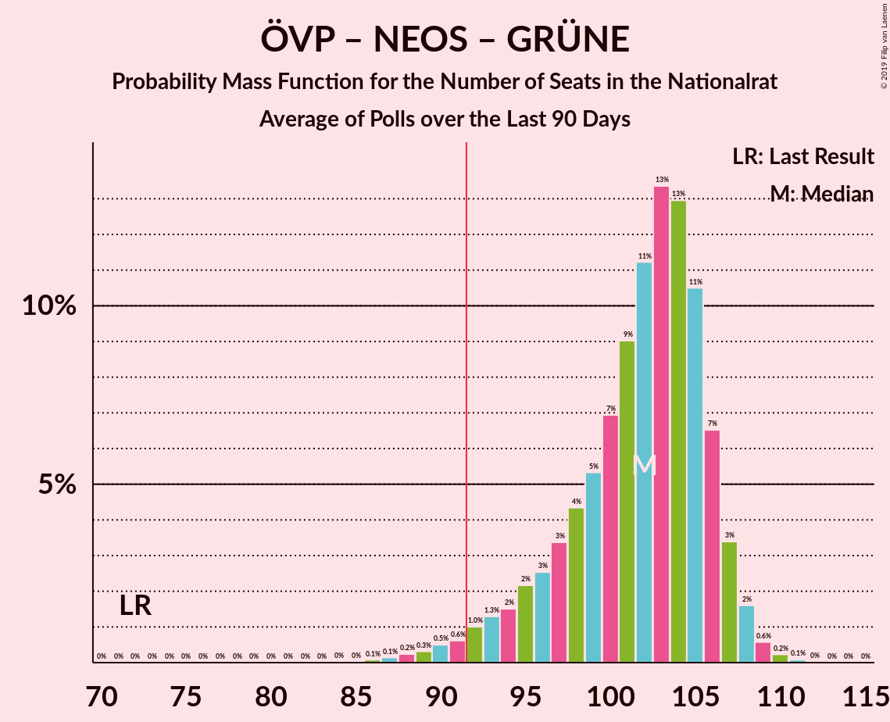

# Poll Average

<a href="#voting-intentions">Voting Intentions</a> | <a href="#seats">Seats</a> | <a href="#coalitions">Coalitions</a> | <a href="#technical-information">Technical Information</a>

## Summary

The table below lists the polls on which the average is based. They are the most recent polls (less than 90 days old) registered and analyzed so far.

| Period     | Polling firm/Commissioner(s) | ÖVP | SPÖ | FPÖ | NEOS | JETZT | GRÜNE | G!LT |
|:----------:|:----------------------------:|:--:|:--:|:--:|:--:|:--:|:--:|:--:|
| 15 October 2017 | General Election | 31.5%   62 | 26.9%   52 | 26.0%   51 | 5.3%   10 | 4.4%   8 | 3.8%   0 | 1.0%   0 |
| N/A | Poll Average | 32–40%   60–76 | 18–25%   33–47 | 17–23%   32–43 | 6–12%   12–21 | 1–3%   0 | 9–14%   16–26 | N/A   N/A |
| [19–22 August 2019](2019-08-22-UniqueResearch.html) | Unique Research   profil | 33–39%   62–74 | 17–23%   33–43 | 17–23%   33–43 | 7–11%   13–21 | 1–2%   0 | 10–14%   19–27 | N/A   N/A |
| [16–21 August 2019](2019-08-21-ResearchAffairs.html) | Research Affairs   ÖSTERREICH | 31–39%   58–75 | 18–25%   33–47 | 16–23%   30–43 | 6–11%   11–20 | 1–4%   0 | 9–14%   16–27 | N/A   N/A |
| [8–12 August 2019](2019-08-12-OGM.html) | OGM   KURIER | 32–38%   60–73 | 20–26%   38–49 | 17–23%   33–43 | 6–10%   12–19 | 1–3%   0 | 9–13%   17–25 | N/A   N/A |
| [2–5 August 2019](2019-08-05-Market.html) | Market   Der Standard | 32–38%   60–73 | 19–25%   36–47 | 17–23%   33–43 | 8–12%   15–23 | 1–2%   0 | 8–12%   15–23 | N/A   N/A |
| [24–28 June 2019](2019-06-28-PeterHajek.html) | Peter Hajek   ATV | 35–41%   65–78 | 17–23%   32–43 | 17–23%   32–43 | 7–11%   13–21 | 1–2%   0 | 9–13%   17–25 | N/A   N/A |
| 15 October 2017 | General Election | 31.5%   62 | 26.9%   52 | 26.0%   51 | 5.3%   10 | 4.4%   8 | 3.8%   0 | 1.0%   0 |

Only polls for which at least the sample size has been published are included in the table above.

**Legend:**
+ **Top half of each row:** Voting intentions (95% confidence interval)
+ **Bottom half of each row:** Seat projections for the Nationalrat (95% confidence interval)
+ **ÖVP:** Österreichische Volkspartei
+ **SPÖ:** Sozialdemokratische Partei Österreichs
+ **FPÖ:** Freiheitliche Partei Österreichs
+ **NEOS:** NEOS–Das Neue Österreich und Liberales Forum
+ **JETZT:** JETZT–Liste Pilz
+ **GRÜNE:** Die Grünen–Die Grüne Alternative
+ **G!LT:** Meine Stimme G!LT
+ **N/A (single party):** Party not included the published results
+ **N/A (entire row):** Calculation for this opinion poll not started yet

## Voting Intentions

### Confidence Intervals

| Party | Last Result | Median | 80% Confidence Interval | 90% Confidence Interval | 95% Confidence Interval | 99% Confidence Interval |
|:-----:|:-----------:|:------:|:-----------------------:|:-----------------------:|:-----------------------:|:-----------------------:|
| <a href="#österreichische-volkspartei">Österreichische Volkspartei</a> | 31.5% | 35.8% | 33.2–38.6% |32.5–39.5% | 31.9–40.2% | 30.7–41.5% |
| <a href="#sozialdemokratische-partei-österreichs">Sozialdemokratische Partei Österreichs</a> | 26.9% | 21.2% | 18.8–23.8% |18.3–24.5% | 17.8–25.1% | 16.8–26.2% |
| <a href="#freiheitliche-partei-österreichs">Freiheitliche Partei Österreichs</a> | 26.0% | 19.9% | 17.9–21.8% |17.4–22.4% | 16.8–22.9% | 15.8–23.8% |
| <a href="#neos–das-neue-österreich-und-liberales-forum">NEOS–Das Neue Österreich und Liberales Forum</a> | 5.3% | 8.9% | 7.3–10.6% |6.8–11.1% | 6.5–11.5% | 5.8–12.4% |
| <a href="#jetzt–liste-pilz">JETZT–Liste Pilz</a> | 4.4% | 1.3% | 0.8–2.3% |0.6–2.6% | 0.6–2.9% | 0.4–3.6% |
| <a href="#die-grünen–die-grüne-alternative">Die Grünen–Die Grüne Alternative</a> | 3.8% | 11.1% | 9.4–12.9% |9.0–13.4% | 8.6–13.8% | 8.0–14.8% |
| <a href="#meine-stimme-g!lt">Meine Stimme G!LT</a> | 1.0% | N/A | N/A |N/A | N/A | N/A |

### Österreichische Volkspartei

*For a full overview of the results for this party, see the [Österreichische Volkspartei](party-österreichischevolkspartei.html) page.*

| Voting Intentions | Probability | Accumulated | Special Marks |
|:-----------------:|:-----------:|:-----------:|:-------------:|
| 27.5–28.5% | 0% | 100% |  |
| 28.5–29.5% | 0.1% | 100% |  |
| 29.5–30.5% | 0.3% | 99.9% |  |
| 30.5–31.5% | 1.3% | 99.6% | Last Result |
| 31.5–32.5% | 4% | 98% |  |
| 32.5–33.5% | 8% | 95% |  |
| 33.5–34.5% | 14% | 86% |  |
| 34.5–35.5% | 18% | 72% |  |
| 35.5–36.5% | 18% | 54% | Median |
| 36.5–37.5% | 15% | 36% |  |
| 37.5–38.5% | 10% | 21% |  |
| 38.5–39.5% | 6% | 11% |  |
| 39.5–40.5% | 3% | 5% |  |
| 40.5–41.5% | 1.2% | 2% |  |
| 41.5–42.5% | 0.4% | 0.5% |  |
| 42.5–43.5% | 0.1% | 0.1% |  |
| 43.5–44.5% | 0% | 0% |  |

### Sozialdemokratische Partei Österreichs

*For a full overview of the results for this party, see the [Sozialdemokratische Partei Österreichs](party-sozialdemokratischeparteiösterreichs.html) page.*

| Voting Intentions | Probability | Accumulated | Special Marks |
|:-----------------:|:-----------:|:-----------:|:-------------:|
| 14.5–15.5% | 0% | 100% |  |
| 15.5–16.5% | 0.2% | 100% |  |
| 16.5–17.5% | 1.5% | 99.7% |  |
| 17.5–18.5% | 5% | 98% |  |
| 18.5–19.5% | 12% | 93% |  |
| 19.5–20.5% | 18% | 81% |  |
| 20.5–21.5% | 20% | 63% | Median |
| 21.5–22.5% | 18% | 44% |  |
| 22.5–23.5% | 13% | 26% |  |
| 23.5–24.5% | 8% | 13% |  |
| 24.5–25.5% | 3% | 5% |  |
| 25.5–26.5% | 1.1% | 1.4% |  |
| 26.5–27.5% | 0.3% | 0.3% | Last Result |
| 27.5–28.5% | 0% | 0% |  |
| 28.5–29.5% | 0% | 0% |  |

### Freiheitliche Partei Österreichs

*For a full overview of the results for this party, see the [Freiheitliche Partei Österreichs](party-freiheitlicheparteiösterreichs.html) page.*

| Voting Intentions | Probability | Accumulated | Special Marks |
|:-----------------:|:-----------:|:-----------:|:-------------:|
| 13.5–14.5% | 0% | 100% |  |
| 14.5–15.5% | 0.3% | 99.9% |  |
| 15.5–16.5% | 1.3% | 99.6% |  |
| 16.5–17.5% | 5% | 98% |  |
| 17.5–18.5% | 12% | 94% |  |
| 18.5–19.5% | 22% | 81% |  |
| 19.5–20.5% | 26% | 59% | Median |
| 20.5–21.5% | 20% | 33% |  |
| 21.5–22.5% | 10% | 13% |  |
| 22.5–23.5% | 3% | 4% |  |
| 23.5–24.5% | 0.7% | 0.8% |  |
| 24.5–25.5% | 0.1% | 0.1% |  |
| 25.5–26.5% | 0% | 0% | Last Result |

### NEOS–Das Neue Österreich und Liberales Forum

*For a full overview of the results for this party, see the [NEOS–Das Neue Österreich und Liberales Forum](party-neos–dasneueösterreichundliberalesforum.html) page.*

| Voting Intentions | Probability | Accumulated | Special Marks |
|:-----------------:|:-----------:|:-----------:|:-------------:|
| 3.5–4.5% | 0% | 100% |  |
| 4.5–5.5% | 0.2% | 100% | Last Result |
| 5.5–6.5% | 3% | 99.8% |  |
| 6.5–7.5% | 12% | 97% |  |
| 7.5–8.5% | 26% | 85% |  |
| 8.5–9.5% | 29% | 60% | Median |
| 9.5–10.5% | 20% | 30% |  |
| 10.5–11.5% | 8% | 11% |  |
| 11.5–12.5% | 2% | 2% |  |
| 12.5–13.5% | 0.3% | 0.3% |  |
| 13.5–14.5% | 0% | 0% |  |

### JETZT–Liste Pilz

*For a full overview of the results for this party, see the [JETZT–Liste Pilz](party-jetzt–listepilz.html) page.*

| Voting Intentions | Probability | Accumulated | Special Marks |
|:-----------------:|:-----------:|:-----------:|:-------------:|
| 0.0–0.5% | 2% | 100% |  |
| 0.5–1.5% | 64% | 98% | Median |
| 1.5–2.5% | 28% | 34% |  |
| 2.5–3.5% | 5% | 6% |  |
| 3.5–4.5% | 0.5% | 0.6% | Last Result |
| 4.5–5.5% | 0% | 0% |  |

### Die Grünen–Die Grüne Alternative

*For a full overview of the results for this party, see the [Die Grünen–Die Grüne Alternative](party-diegrünen–diegrünealternative.html) page.*

| Voting Intentions | Probability | Accumulated | Special Marks |
|:-----------------:|:-----------:|:-----------:|:-------------:|
| 3.5–4.5% | 0% | 100% | Last Result |
| 4.5–5.5% | 0% | 100% |  |
| 5.5–6.5% | 0% | 100% |  |
| 6.5–7.5% | 0.1% | 100% |  |
| 7.5–8.5% | 2% | 99.9% |  |
| 8.5–9.5% | 10% | 98% |  |
| 9.5–10.5% | 23% | 88% |  |
| 10.5–11.5% | 29% | 66% | Median |
| 11.5–12.5% | 22% | 36% |  |
| 12.5–13.5% | 10% | 14% |  |
| 13.5–14.5% | 3% | 4% |  |
| 14.5–15.5% | 0.6% | 0.7% |  |
| 15.5–16.5% | 0.1% | 0.1% |  |
| 16.5–17.5% | 0% | 0% |  |

## Seats

### Confidence Intervals

| Party | Last Result | Median | 80% Confidence Interval | 90% Confidence Interval | 95% Confidence Interval | 99% Confidence Interval |
|:-----:|:-----------:|:------:|:-----------------------:|:-----------------------:|:-----------------------:|:-----------------------:|
| <a href="#österreichische-volkspartei">Österreichische Volkspartei</a> | 62 | 68 | 63–73 |61–74 | 60–76 | 58–78 |
| <a href="#sozialdemokratische-partei-österreichs">Sozialdemokratische Partei Österreichs</a> | 52 | 40 | 35–45 |34–46 | 33–47 | 31–50 |
| <a href="#freiheitliche-partei-österreichs">Freiheitliche Partei Österreichs</a> | 51 | 37 | 34–41 |32–42 | 32–43 | 29–45 |
| <a href="#neos–das-neue-österreich-und-liberales-forum">NEOS–Das Neue Österreich und Liberales Forum</a> | 10 | 16 | 13–20 |13–21 | 12–21 | 11–23 |
| <a href="#jetzt–liste-pilz">JETZT–Liste Pilz</a> | 8 | 0 | 0 |0 | 0 | 0 |
| <a href="#die-grünen–die-grüne-alternative">Die Grünen–Die Grüne Alternative</a> | 0 | 21 | 17–24 |17–25 | 16–26 | 15–28 |
| <a href="#meine-stimme-g!lt">Meine Stimme G!LT</a> | 0 | N/A | N/A |N/A | N/A | N/A |

### Österreichische Volkspartei

*For a full overview of the results for this party, see the [Österreichische Volkspartei](party-österreichischevolkspartei.html) page.*

| Number of Seats | Probability | Accumulated | Special Marks |
|:---------------:|:-----------:|:-----------:|:-------------:|
| 55 | 0% | 100% |  |
| 56 | 0.1% | 99.9% |  |
| 57 | 0.2% | 99.8% |  |
| 58 | 0.4% | 99.6% |  |
| 59 | 0.8% | 99.2% |  |
| 60 | 1.4% | 98% |  |
| 61 | 2% | 97% |  |
| 62 | 4% | 95% | Last Result |
| 63 | 5% | 91% |  |
| 64 | 7% | 86% |  |
| 65 | 9% | 79% |  |
| 66 | 9% | 71% |  |
| 67 | 10% | 61% |  |
| 68 | 10% | 51% | Median |
| 69 | 9% | 41% |  |
| 70 | 8% | 32% |  |
| 71 | 7% | 24% |  |
| 72 | 5% | 17% |  |
| 73 | 4% | 12% |  |
| 74 | 3% | 8% |  |
| 75 | 2% | 4% |  |
| 76 | 1.4% | 3% |  |
| 77 | 0.5% | 1.3% |  |
| 78 | 0.4% | 0.8% |  |
| 79 | 0.2% | 0.3% |  |
| 80 | 0.1% | 0.2% |  |
| 81 | 0% | 0.1% |  |
| 82 | 0% | 0% |  |

### Sozialdemokratische Partei Österreichs

*For a full overview of the results for this party, see the [Sozialdemokratische Partei Österreichs](party-sozialdemokratischeparteiösterreichs.html) page.*

| Number of Seats | Probability | Accumulated | Special Marks |
|:---------------:|:-----------:|:-----------:|:-------------:|
| 29 | 0% | 100% |  |
| 30 | 0.1% | 99.9% |  |
| 31 | 0.3% | 99.8% |  |
| 32 | 0.9% | 99.5% |  |
| 33 | 2% | 98.6% |  |
| 34 | 3% | 97% |  |
| 35 | 5% | 94% |  |
| 36 | 7% | 89% |  |
| 37 | 8% | 82% |  |
| 38 | 10% | 74% |  |
| 39 | 10% | 64% |  |
| 40 | 10% | 54% | Median |
| 41 | 9% | 44% |  |
| 42 | 9% | 34% |  |
| 43 | 8% | 26% |  |
| 44 | 6% | 18% |  |
| 45 | 5% | 12% |  |
| 46 | 3% | 8% |  |
| 47 | 2% | 4% |  |
| 48 | 1.2% | 2% |  |
| 49 | 0.6% | 1.2% |  |
| 50 | 0.3% | 0.5% |  |
| 51 | 0.1% | 0.2% |  |
| 52 | 0.1% | 0.1% | Last Result |
| 53 | 0% | 0% |  |

### Freiheitliche Partei Österreichs

*For a full overview of the results for this party, see the [Freiheitliche Partei Österreichs](party-freiheitlicheparteiösterreichs.html) page.*

| Number of Seats | Probability | Accumulated | Special Marks |
|:---------------:|:-----------:|:-----------:|:-------------:|
| 27 | 0% | 100% |  |
| 28 | 0.1% | 99.9% |  |
| 29 | 0.3% | 99.8% |  |
| 30 | 0.6% | 99.5% |  |
| 31 | 1.3% | 98.9% |  |
| 32 | 3% | 98% |  |
| 33 | 4% | 95% |  |
| 34 | 7% | 91% |  |
| 35 | 10% | 84% |  |
| 36 | 13% | 74% |  |
| 37 | 14% | 61% | Median |
| 38 | 13% | 47% |  |
| 39 | 12% | 34% |  |
| 40 | 9% | 22% |  |
| 41 | 6% | 13% |  |
| 42 | 4% | 7% |  |
| 43 | 2% | 4% |  |
| 44 | 1.0% | 2% |  |
| 45 | 0.5% | 0.7% |  |
| 46 | 0.2% | 0.3% |  |
| 47 | 0.1% | 0.1% |  |
| 48 | 0% | 0% |  |
| 49 | 0% | 0% |  |
| 50 | 0% | 0% |  |
| 51 | 0% | 0% | Last Result |

### NEOS–Das Neue Österreich und Liberales Forum

*For a full overview of the results for this party, see the [NEOS–Das Neue Österreich und Liberales Forum](party-neos–dasneueösterreichundliberalesforum.html) page.*

| Number of Seats | Probability | Accumulated | Special Marks |
|:---------------:|:-----------:|:-----------:|:-------------:|
| 9 | 0.1% | 100% |  |
| 10 | 0.4% | 99.9% | Last Result |
| 11 | 1.2% | 99.5% |  |
| 12 | 3% | 98% |  |
| 13 | 6% | 95% |  |
| 14 | 10% | 89% |  |
| 15 | 15% | 78% |  |
| 16 | 16% | 63% | Median |
| 17 | 16% | 47% |  |
| 18 | 11% | 32% |  |
| 19 | 9% | 21% |  |
| 20 | 6% | 11% |  |
| 21 | 3% | 5% |  |
| 22 | 2% | 2% |  |
| 23 | 0.6% | 0.9% |  |
| 24 | 0.2% | 0.3% |  |
| 25 | 0.1% | 0.1% |  |
| 26 | 0% | 0% |  |

### JETZT–Liste Pilz

*For a full overview of the results for this party, see the [JETZT–Liste Pilz](party-jetzt–listepilz.html) page.*

| Number of Seats | Probability | Accumulated | Special Marks |
|:---------------:|:-----------:|:-----------:|:-------------:|
| 0 | 99.8% | 100% | Median |
| 1 | 0% | 0.2% |  |
| 2 | 0% | 0.2% |  |
| 3 | 0% | 0.2% |  |
| 4 | 0% | 0.2% |  |
| 5 | 0% | 0.2% |  |
| 6 | 0% | 0.2% |  |
| 7 | 0.1% | 0.2% |  |
| 8 | 0.1% | 0.1% | Last Result |
| 9 | 0% | 0% |  |

### Die Grünen–Die Grüne Alternative

*For a full overview of the results for this party, see the [Die Grünen–Die Grüne Alternative](party-diegrünen–diegrünealternative.html) page.*

| Number of Seats | Probability | Accumulated | Special Marks |
|:---------------:|:-----------:|:-----------:|:-------------:|
| 0 | 0% | 100% | Last Result |
| 1 | 0% | 100% |  |
| 2 | 0% | 100% |  |
| 3 | 0% | 100% |  |
| 4 | 0% | 100% |  |
| 5 | 0% | 100% |  |
| 6 | 0% | 100% |  |
| 7 | 0% | 100% |  |
| 8 | 0% | 100% |  |
| 9 | 0% | 100% |  |
| 10 | 0% | 100% |  |
| 11 | 0% | 100% |  |
| 12 | 0% | 100% |  |
| 13 | 0.1% | 100% |  |
| 14 | 0.3% | 99.9% |  |
| 15 | 1.1% | 99.6% |  |
| 16 | 3% | 98.5% |  |
| 17 | 6% | 96% |  |
| 18 | 10% | 90% |  |
| 19 | 14% | 80% |  |
| 20 | 16% | 66% |  |
| 21 | 15% | 50% | Median |
| 22 | 12% | 35% |  |
| 23 | 9% | 23% |  |
| 24 | 7% | 14% |  |
| 25 | 4% | 7% |  |
| 26 | 2% | 3% |  |
| 27 | 0.8% | 1.4% |  |
| 28 | 0.4% | 0.6% |  |
| 29 | 0.1% | 0.2% |  |
| 30 | 0.1% | 0.1% |  |
| 31 | 0% | 0% |  |

## Coalitions

### Confidence Intervals

| Coalition | Last Result | Median | Majority? | 80% Confidence Interval | 90% Confidence Interval | 95% Confidence Interval | 99% Confidence Interval |
|:---------:|:-----------:|:------:|:---------:|:-----------------------:|:-----------------------:|:-----------------------:|:-----------------------:|
| Österreichische Volkspartei – Sozialdemokratische Partei Österreichs | 114 | 108 | 100% | 103–113 | 101–114 | 100–115 | 97–117 |
| Österreichische Volkspartei – NEOS–Das Neue Österreich und Liberales Forum – Die Grünen–Die Grüne Alternative | 72 | 105 | 99.8% | 99–111 | 97–112 | 96–113 | 93–115 |
| Österreichische Volkspartei – Freiheitliche Partei Österreichs | 113 | 105 | 99.8% | 100–110 | 98–112 | 96–113 | 93–115 |
| Österreichische Volkspartei – Die Grünen–Die Grüne Alternative | 62 | 88 | 24% | 83–94 | 81–95 | 80–97 | 77–99 |
| Österreichische Volkspartei – NEOS–Das Neue Österreich und Liberales Forum | 72 | 84 | 4% | 78–90 | 77–91 | 75–92 | 72–95 |
| Sozialdemokratische Partei Österreichs – Freiheitliche Partei Österreichs | 103 | 77 | 0% | 72–83 | 70–85 | 69–86 | 67–88 |
| Sozialdemokratische Partei Österreichs – NEOS–Das Neue Österreich und Liberales Forum – Die Grünen–Die Grüne Alternative | 62 | 77 | 0% | 72–82 | 70–83 | 69–85 | 67–87 |
| Österreichische Volkspartei | 62 | 68 | 0% | 63–73 | 61–74 | 60–76 | 58–78 |
| Sozialdemokratische Partei Österreichs – Die Grünen–Die Grüne Alternative | 52 | 61 | 0% | 56–66 | 54–67 | 53–69 | 51–71 |
| Sozialdemokratische Partei Österreichs | 52 | 40 | 0% | 35–45 | 34–46 | 33–47 | 31–50 |

### Österreichische Volkspartei – Sozialdemokratische Partei Österreichs

| Number of Seats | Probability | Accumulated | Special Marks |
|:---------------:|:-----------:|:-----------:|:-------------:|
| 93 | 0% | 100% |  |
| 94 | 0.1% | 99.9% |  |
| 95 | 0.1% | 99.9% |  |
| 96 | 0.2% | 99.8% |  |
| 97 | 0.3% | 99.6% |  |
| 98 | 0.6% | 99.3% |  |
| 99 | 0.9% | 98.7% |  |
| 100 | 1.5% | 98% |  |
| 101 | 2% | 96% |  |
| 102 | 3% | 94% |  |
| 103 | 5% | 91% |  |
| 104 | 6% | 86% |  |
| 105 | 8% | 80% |  |
| 106 | 9% | 72% |  |
| 107 | 10% | 63% |  |
| 108 | 10% | 53% | Median |
| 109 | 10% | 43% |  |
| 110 | 9% | 33% |  |
| 111 | 8% | 24% |  |
| 112 | 6% | 16% |  |
| 113 | 4% | 10% |  |
| 114 | 3% | 6% | Last Result |
| 115 | 2% | 4% |  |
| 116 | 0.9% | 2% |  |
| 117 | 0.5% | 1.0% |  |
| 118 | 0.2% | 0.4% |  |
| 119 | 0.1% | 0.2% |  |
| 120 | 0.1% | 0.1% |  |
| 121 | 0% | 0% |  |

### Österreichische Volkspartei – NEOS–Das Neue Österreich und Liberales Forum – Die Grünen–Die Grüne Alternative

| Number of Seats | Probability | Accumulated | Special Marks |
|:---------------:|:-----------:|:-----------:|:-------------:|
| 72 | 0% | 100% | Last Result |
| 73 | 0% | 100% |  |
| 74 | 0% | 100% |  |
| 75 | 0% | 100% |  |
| 76 | 0% | 100% |  |
| 77 | 0% | 100% |  |
| 78 | 0% | 100% |  |
| 79 | 0% | 100% |  |
| 80 | 0% | 100% |  |
| 81 | 0% | 100% |  |
| 82 | 0% | 100% |  |
| 83 | 0% | 100% |  |
| 84 | 0% | 100% |  |
| 85 | 0% | 100% |  |
| 86 | 0% | 100% |  |
| 87 | 0% | 100% |  |
| 88 | 0% | 100% |  |
| 89 | 0% | 100% |  |
| 90 | 0% | 99.9% |  |
| 91 | 0.1% | 99.9% |  |
| 92 | 0.2% | 99.8% | Majority |
| 93 | 0.3% | 99.6% |  |
| 94 | 0.6% | 99.3% |  |
| 95 | 0.9% | 98.7% |  |
| 96 | 1.2% | 98% |  |
| 97 | 2% | 97% |  |
| 98 | 3% | 95% |  |
| 99 | 4% | 92% |  |
| 100 | 5% | 88% |  |
| 101 | 6% | 82% |  |
| 102 | 7% | 76% |  |
| 103 | 7% | 69% |  |
| 104 | 8% | 62% |  |
| 105 | 9% | 54% | Median |
| 106 | 8% | 44% |  |
| 107 | 7% | 36% |  |
| 108 | 7% | 29% |  |
| 109 | 6% | 21% |  |
| 110 | 5% | 15% |  |
| 111 | 4% | 10% |  |
| 112 | 2% | 6% |  |
| 113 | 2% | 4% |  |
| 114 | 1.0% | 2% |  |
| 115 | 0.5% | 1.0% |  |
| 116 | 0.3% | 0.5% |  |
| 117 | 0.1% | 0.2% |  |
| 118 | 0% | 0.1% |  |
| 119 | 0% | 0% |  |

### Österreichische Volkspartei – Freiheitliche Partei Österreichs

| Number of Seats | Probability | Accumulated | Special Marks |
|:---------------:|:-----------:|:-----------:|:-------------:|
| 90 | 0% | 100% |  |
| 91 | 0.1% | 99.9% |  |
| 92 | 0.1% | 99.8% | Majority |
| 93 | 0.3% | 99.7% |  |
| 94 | 0.4% | 99.4% |  |
| 95 | 0.6% | 99.1% |  |
| 96 | 1.0% | 98% |  |
| 97 | 1.5% | 97% |  |
| 98 | 2% | 96% |  |
| 99 | 3% | 94% |  |
| 100 | 5% | 91% |  |
| 101 | 6% | 86% |  |
| 102 | 7% | 80% |  |
| 103 | 7% | 73% |  |
| 104 | 10% | 66% |  |
| 105 | 10% | 55% | Median |
| 106 | 9% | 45% |  |
| 107 | 8% | 37% |  |
| 108 | 8% | 28% |  |
| 109 | 7% | 20% |  |
| 110 | 5% | 14% |  |
| 111 | 4% | 9% |  |
| 112 | 2% | 6% |  |
| 113 | 2% | 3% | Last Result |
| 114 | 0.8% | 2% |  |
| 115 | 0.5% | 0.9% |  |
| 116 | 0.3% | 0.4% |  |
| 117 | 0.1% | 0.2% |  |
| 118 | 0% | 0.1% |  |
| 119 | 0% | 0% |  |

### Österreichische Volkspartei – Die Grünen–Die Grüne Alternative

| Number of Seats | Probability | Accumulated | Special Marks |
|:---------------:|:-----------:|:-----------:|:-------------:|
| 62 | 0% | 100% | Last Result |
| 63 | 0% | 100% |  |
| 64 | 0% | 100% |  |
| 65 | 0% | 100% |  |
| 66 | 0% | 100% |  |
| 67 | 0% | 100% |  |
| 68 | 0% | 100% |  |
| 69 | 0% | 100% |  |
| 70 | 0% | 100% |  |
| 71 | 0% | 100% |  |
| 72 | 0% | 100% |  |
| 73 | 0% | 100% |  |
| 74 | 0% | 100% |  |
| 75 | 0.1% | 99.9% |  |
| 76 | 0.1% | 99.9% |  |
| 77 | 0.3% | 99.7% |  |
| 78 | 0.5% | 99.5% |  |
| 79 | 0.9% | 98.9% |  |
| 80 | 2% | 98% |  |
| 81 | 2% | 96% |  |
| 82 | 3% | 94% |  |
| 83 | 5% | 91% |  |
| 84 | 6% | 86% |  |
| 85 | 7% | 80% |  |
| 86 | 7% | 73% |  |
| 87 | 8% | 66% |  |
| 88 | 9% | 58% |  |
| 89 | 8% | 49% | Median |
| 90 | 8% | 41% |  |
| 91 | 8% | 32% |  |
| 92 | 7% | 24% | Majority |
| 93 | 5% | 18% |  |
| 94 | 4% | 12% |  |
| 95 | 3% | 8% |  |
| 96 | 2% | 5% |  |
| 97 | 1.3% | 3% |  |
| 98 | 0.8% | 2% |  |
| 99 | 0.4% | 0.8% |  |
| 100 | 0.2% | 0.4% |  |
| 101 | 0.1% | 0.2% |  |
| 102 | 0% | 0.1% |  |
| 103 | 0% | 0% |  |

### Österreichische Volkspartei – NEOS–Das Neue Österreich und Liberales Forum

| Number of Seats | Probability | Accumulated | Special Marks |
|:---------------:|:-----------:|:-----------:|:-------------:|
| 69 | 0% | 100% |  |
| 70 | 0.1% | 99.9% |  |
| 71 | 0.1% | 99.9% |  |
| 72 | 0.2% | 99.7% | Last Result |
| 73 | 0.4% | 99.5% |  |
| 74 | 0.7% | 99.1% |  |
| 75 | 1.1% | 98% |  |
| 76 | 2% | 97% |  |
| 77 | 2% | 96% |  |
| 78 | 3% | 93% |  |
| 79 | 5% | 90% |  |
| 80 | 6% | 85% |  |
| 81 | 6% | 79% |  |
| 82 | 8% | 73% |  |
| 83 | 9% | 66% |  |
| 84 | 9% | 57% | Median |
| 85 | 9% | 48% |  |
| 86 | 8% | 38% |  |
| 87 | 8% | 30% |  |
| 88 | 7% | 23% |  |
| 89 | 5% | 16% |  |
| 90 | 4% | 11% |  |
| 91 | 3% | 7% |  |
| 92 | 2% | 4% | Majority |
| 93 | 1.0% | 2% |  |
| 94 | 0.7% | 1.3% |  |
| 95 | 0.3% | 0.6% |  |
| 96 | 0.1% | 0.3% |  |
| 97 | 0.1% | 0.1% |  |
| 98 | 0% | 0% |  |

### Sozialdemokratische Partei Österreichs – Freiheitliche Partei Österreichs

| Number of Seats | Probability | Accumulated | Special Marks |
|:---------------:|:-----------:|:-----------:|:-------------:|
| 63 | 0% | 100% |  |
| 64 | 0.1% | 99.9% |  |
| 65 | 0.1% | 99.9% |  |
| 66 | 0.2% | 99.8% |  |
| 67 | 0.5% | 99.6% |  |
| 68 | 0.9% | 99.1% |  |
| 69 | 2% | 98% |  |
| 70 | 2% | 97% |  |
| 71 | 3% | 94% |  |
| 72 | 5% | 91% |  |
| 73 | 6% | 87% |  |
| 74 | 8% | 81% |  |
| 75 | 8% | 73% |  |
| 76 | 8% | 65% |  |
| 77 | 8% | 57% | Median |
| 78 | 9% | 48% |  |
| 79 | 8% | 39% |  |
| 80 | 7% | 31% |  |
| 81 | 6% | 24% |  |
| 82 | 5% | 17% |  |
| 83 | 4% | 12% |  |
| 84 | 3% | 8% |  |
| 85 | 2% | 5% |  |
| 86 | 1.4% | 3% |  |
| 87 | 0.7% | 2% |  |
| 88 | 0.4% | 0.8% |  |
| 89 | 0.2% | 0.4% |  |
| 90 | 0.1% | 0.2% |  |
| 91 | 0% | 0.1% |  |
| 92 | 0% | 0% | Majority |
| 93 | 0% | 0% |  |
| 94 | 0% | 0% |  |
| 95 | 0% | 0% |  |
| 96 | 0% | 0% |  |
| 97 | 0% | 0% |  |
| 98 | 0% | 0% |  |
| 99 | 0% | 0% |  |
| 100 | 0% | 0% |  |
| 101 | 0% | 0% |  |
| 102 | 0% | 0% |  |
| 103 | 0% | 0% | Last Result |

### Sozialdemokratische Partei Österreichs – NEOS–Das Neue Österreich und Liberales Forum – Die Grünen–Die Grüne Alternative

| Number of Seats | Probability | Accumulated | Special Marks |
|:---------------:|:-----------:|:-----------:|:-------------:|
| 62 | 0% | 100% | Last Result |
| 63 | 0% | 100% |  |
| 64 | 0.1% | 99.9% |  |
| 65 | 0.1% | 99.9% |  |
| 66 | 0.2% | 99.7% |  |
| 67 | 0.5% | 99.5% |  |
| 68 | 0.8% | 99.0% |  |
| 69 | 1.3% | 98% |  |
| 70 | 2% | 97% |  |
| 71 | 3% | 95% |  |
| 72 | 4% | 92% |  |
| 73 | 6% | 87% |  |
| 74 | 8% | 82% |  |
| 75 | 9% | 74% |  |
| 76 | 9% | 65% |  |
| 77 | 9% | 56% | Median |
| 78 | 10% | 47% |  |
| 79 | 10% | 37% |  |
| 80 | 7% | 27% |  |
| 81 | 6% | 20% |  |
| 82 | 5% | 14% |  |
| 83 | 4% | 8% |  |
| 84 | 2% | 5% |  |
| 85 | 1.2% | 3% |  |
| 86 | 0.9% | 2% |  |
| 87 | 0.4% | 0.7% |  |
| 88 | 0.2% | 0.3% |  |
| 89 | 0.1% | 0.1% |  |
| 90 | 0% | 0.1% |  |
| 91 | 0% | 0% |  |

### Österreichische Volkspartei

| Number of Seats | Probability | Accumulated | Special Marks |
|:---------------:|:-----------:|:-----------:|:-------------:|
| 55 | 0% | 100% |  |
| 56 | 0.1% | 99.9% |  |
| 57 | 0.2% | 99.8% |  |
| 58 | 0.4% | 99.6% |  |
| 59 | 0.8% | 99.2% |  |
| 60 | 1.4% | 98% |  |
| 61 | 2% | 97% |  |
| 62 | 4% | 95% | Last Result |
| 63 | 5% | 91% |  |
| 64 | 7% | 86% |  |
| 65 | 9% | 79% |  |
| 66 | 9% | 71% |  |
| 67 | 10% | 61% |  |
| 68 | 10% | 51% | Median |
| 69 | 9% | 41% |  |
| 70 | 8% | 32% |  |
| 71 | 7% | 24% |  |
| 72 | 5% | 17% |  |
| 73 | 4% | 12% |  |
| 74 | 3% | 8% |  |
| 75 | 2% | 4% |  |
| 76 | 1.4% | 3% |  |
| 77 | 0.5% | 1.3% |  |
| 78 | 0.4% | 0.8% |  |
| 79 | 0.2% | 0.3% |  |
| 80 | 0.1% | 0.2% |  |
| 81 | 0% | 0.1% |  |
| 82 | 0% | 0% |  |

### Sozialdemokratische Partei Österreichs – Die Grünen–Die Grüne Alternative

| Number of Seats | Probability | Accumulated | Special Marks |
|:---------------:|:-----------:|:-----------:|:-------------:|
| 49 | 0.1% | 100% |  |
| 50 | 0.2% | 99.9% |  |
| 51 | 0.4% | 99.7% |  |
| 52 | 0.8% | 99.3% | Last Result |
| 53 | 1.4% | 98.5% |  |
| 54 | 2% | 97% |  |
| 55 | 4% | 95% |  |
| 56 | 5% | 91% |  |
| 57 | 7% | 86% |  |
| 58 | 9% | 78% |  |
| 59 | 9% | 70% |  |
| 60 | 10% | 60% |  |
| 61 | 9% | 50% | Median |
| 62 | 9% | 41% |  |
| 63 | 8% | 31% |  |
| 64 | 7% | 24% |  |
| 65 | 5% | 17% |  |
| 66 | 4% | 11% |  |
| 67 | 3% | 7% |  |
| 68 | 2% | 4% |  |
| 69 | 1.3% | 3% |  |
| 70 | 0.7% | 1.4% |  |
| 71 | 0.3% | 0.7% |  |
| 72 | 0.2% | 0.4% |  |
| 73 | 0.1% | 0.2% |  |
| 74 | 0% | 0.1% |  |
| 75 | 0% | 0% |  |

### Sozialdemokratische Partei Österreichs

| Number of Seats | Probability | Accumulated | Special Marks |
|:---------------:|:-----------:|:-----------:|:-------------:|
| 29 | 0% | 100% |  |
| 30 | 0.1% | 99.9% |  |
| 31 | 0.3% | 99.8% |  |
| 32 | 0.9% | 99.5% |  |
| 33 | 2% | 98.6% |  |
| 34 | 3% | 97% |  |
| 35 | 5% | 94% |  |
| 36 | 7% | 89% |  |
| 37 | 8% | 82% |  |
| 38 | 10% | 74% |  |
| 39 | 10% | 64% |  |
| 40 | 10% | 54% | Median |
| 41 | 9% | 44% |  |
| 42 | 9% | 34% |  |
| 43 | 8% | 26% |  |
| 44 | 6% | 18% |  |
| 45 | 5% | 12% |  |
| 46 | 3% | 8% |  |
| 47 | 2% | 4% |  |
| 48 | 1.2% | 2% |  |
| 49 | 0.6% | 1.2% |  |
| 50 | 0.3% | 0.5% |  |
| 51 | 0.1% | 0.2% |  |
| 52 | 0.1% | 0.1% | Last Result |
| 53 | 0% | 0% |  |

## Technical Information

+ **Number of polls included in this average:** 5
+ **Lowest number of simulations done in a poll included in this average:** 1,048,576
+ **Total number of simulations done in the polls included in this average:** 5,242,880
+ **Error estimate:** 1.01%
