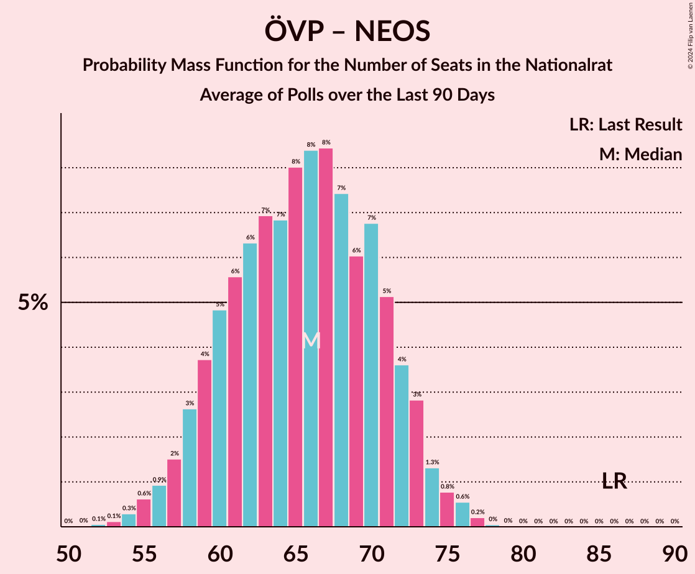

# Poll Average

<a href="#voting-intentions">Voting Intentions</a> | <a href="#seats">Seats</a> | <a href="#coalitions">Coalitions</a> | <a href="#technical-information">Technical Information</a>

## Summary

The table below lists the polls on which the average is based. They are the most recent polls (less than 90 days old) registered and analyzed so far.

| Period     | Polling firm/Commissioner(s) | ÖVP | SPÖ | FPÖ | GRÜNE | NEOS | JETZT | G!LT |
|:----------:|:----------------------------:|:--:|:--:|:--:|:--:|:--:|:--:|:--:|
| 29 September 2019 | General Election | 37.5%   71 | 21.2%   40 | 16.2%   31 | 13.9%   26 | 8.1%   15 | 1.9%   0 | 0.0%   0 |
| N/A | Poll Average | 40–48%   75–89 | 14–23%   26–42 | 10–16%   19–29 | 14–20%   26–37 | 5–10%   9–17 | N/A   N/A | N/A   N/A |
| [9–12 June 2020](2020-06-12-UniqueResearch.html) | Unique Research   profil | 41–47%   76–88 | 15–20%   27–36 | 12–17%   22–30 | 14–19%   25–34 | 6–10%   11–18 | N/A   N/A | N/A   N/A |
| [18–19 May 2020](2020-05-19-Market.html) | Market   Der Standard | 40–46%   74–86 | 19–24%   34–44 | 10–14%   18–26 | 15–19%   27–36 | 5–8%   8–14 | N/A   N/A | N/A   N/A |
| [31 March–2 April 2020](2020-04-02-OGM.html) | OGM | 42–48%   78–91 | 14–19%   25–35 | 10–14%   18–27 | 15–21%   29–39 | 5–9%   10–16 | N/A   N/A | N/A   N/A |
| 29 September 2019 | General Election | 37.5%   71 | 21.2%   40 | 16.2%   31 | 13.9%   26 | 8.1%   15 | 1.9%   0 | 0.0%   0 |

Only polls for which at least the sample size has been published are included in the table above.

**Legend:**
+ **Top half of each row:** Voting intentions (95% confidence interval)
+ **Bottom half of each row:** Seat projections for the Nationalrat (95% confidence interval)
+ **ÖVP:** Österreichische Volkspartei
+ **SPÖ:** Sozialdemokratische Partei Österreichs
+ **FPÖ:** Freiheitliche Partei Österreichs
+ **GRÜNE:** Die Grünen–Die Grüne Alternative
+ **NEOS:** NEOS–Das Neue Österreich und Liberales Forum
+ **JETZT:** JETZT–Liste Pilz
+ **G!LT:** Meine Stimme G!LT
+ **N/A (single party):** Party not included the published results
+ **N/A (entire row):** Calculation for this opinion poll not started yet

## Voting Intentions

### Confidence Intervals

| Party | Last Result | Median | 80% Confidence Interval | 90% Confidence Interval | 95% Confidence Interval | 99% Confidence Interval |
|:-----:|:-----------:|:------:|:-----------------------:|:-----------------------:|:-----------------------:|:-----------------------:|
| <a href="#österreichische-volkspartei">Österreichische Volkspartei</a> | 37.5% | 44.0% | 41.6–46.5% |41.0–47.2% | 40.5–47.8% | 39.4–49.0% |
| <a href="#sozialdemokratische-partei-österreichs">Sozialdemokratische Partei Österreichs</a> | 21.2% | 17.5% | 15.1–21.7% |14.6–22.4% | 14.2–22.9% | 13.3–23.9% |
| <a href="#freiheitliche-partei-österreichs">Freiheitliche Partei Österreichs</a> | 16.2% | 12.6% | 11.0–14.7% |10.5–15.4% | 10.2–15.9% | 9.6–16.8% |
| <a href="#die-grünen–die-grüne-alternative">Die Grünen–Die Grüne Alternative</a> | 13.9% | 17.0% | 15.1–19.0% |14.6–19.6% | 14.2–20.1% | 13.3–21.1% |
| <a href="#neos–das-neue-österreich-und-liberales-forum">NEOS–Das Neue Österreich und Liberales Forum</a> | 8.1% | 7.0% | 5.6–8.7% |5.3–9.2% | 5.0–9.5% | 4.5–10.3% |
| <a href="#jetzt–liste-pilz">JETZT–Liste Pilz</a> | 1.9% | N/A | N/A |N/A | N/A | N/A |
| <a href="#meine-stimme-g!lt">Meine Stimme G!LT</a> | 0.0% | N/A | N/A |N/A | N/A | N/A |

### Österreichische Volkspartei

*For a full overview of the results for this party, see the [Österreichische Volkspartei](party-österreichischevolkspartei.html) page.*

| Voting Intentions | Probability | Accumulated | Special Marks |
|:-----------------:|:-----------:|:-----------:|:-------------:|
| 36.5–37.5% | 0% | 100% |  |
| 37.5–38.5% | 0.1% | 100% | Last Result |
| 38.5–39.5% | 0.5% | 99.9% |  |
| 39.5–40.5% | 2% | 99.4% |  |
| 40.5–41.5% | 6% | 97% |  |
| 41.5–42.5% | 13% | 91% |  |
| 42.5–43.5% | 19% | 78% |  |
| 43.5–44.5% | 21% | 59% | Median |
| 44.5–45.5% | 18% | 38% |  |
| 45.5–46.5% | 11% | 21% |  |
| 46.5–47.5% | 6% | 9% |  |
| 47.5–48.5% | 2% | 3% |  |
| 48.5–49.5% | 0.7% | 0.9% |  |
| 49.5–50.5% | 0.2% | 0.2% |  |
| 50.5–51.5% | 0% | 0% |  |

### Sozialdemokratische Partei Österreichs

*For a full overview of the results for this party, see the [Sozialdemokratische Partei Österreichs](party-sozialdemokratischeparteiösterreichs.html) page.*

| Voting Intentions | Probability | Accumulated | Special Marks |
|:-----------------:|:-----------:|:-----------:|:-------------:|
| 10.5–11.5% | 0% | 100% |  |
| 11.5–12.5% | 0.1% | 100% |  |
| 12.5–13.5% | 0.7% | 99.9% |  |
| 13.5–14.5% | 4% | 99.2% |  |
| 14.5–15.5% | 11% | 95% |  |
| 15.5–16.5% | 18% | 84% |  |
| 16.5–17.5% | 17% | 66% | Median |
| 17.5–18.5% | 11% | 49% |  |
| 18.5–19.5% | 7% | 38% |  |
| 19.5–20.5% | 9% | 31% |  |
| 20.5–21.5% | 10% | 22% | Last Result |
| 21.5–22.5% | 7% | 12% |  |
| 22.5–23.5% | 3% | 4% |  |
| 23.5–24.5% | 0.8% | 1.0% |  |
| 24.5–25.5% | 0.1% | 0.1% |  |
| 25.5–26.5% | 0% | 0% |  |

### Freiheitliche Partei Österreichs

*For a full overview of the results for this party, see the [Freiheitliche Partei Österreichs](party-freiheitlicheparteiösterreichs.html) page.*

| Voting Intentions | Probability | Accumulated | Special Marks |
|:-----------------:|:-----------:|:-----------:|:-------------:|
| 7.5–8.5% | 0% | 100% |  |
| 8.5–9.5% | 0.5% | 100% |  |
| 9.5–10.5% | 5% | 99.5% |  |
| 10.5–11.5% | 17% | 95% |  |
| 11.5–12.5% | 26% | 78% |  |
| 12.5–13.5% | 24% | 52% | Median |
| 13.5–14.5% | 16% | 28% |  |
| 14.5–15.5% | 8% | 12% |  |
| 15.5–16.5% | 3% | 4% | Last Result |
| 16.5–17.5% | 0.7% | 0.8% |  |
| 17.5–18.5% | 0.1% | 0.1% |  |
| 18.5–19.5% | 0% | 0% |  |

### Die Grünen–Die Grüne Alternative

*For a full overview of the results for this party, see the [Die Grünen–Die Grüne Alternative](party-diegrünen–diegrünealternative.html) page.*

| Voting Intentions | Probability | Accumulated | Special Marks |
|:-----------------:|:-----------:|:-----------:|:-------------:|
| 10.5–11.5% | 0% | 100% |  |
| 11.5–12.5% | 0.1% | 100% |  |
| 12.5–13.5% | 0.7% | 99.9% |  |
| 13.5–14.5% | 4% | 99.2% | Last Result |
| 14.5–15.5% | 11% | 95% |  |
| 15.5–16.5% | 21% | 84% |  |
| 16.5–17.5% | 25% | 62% | Median |
| 17.5–18.5% | 20% | 37% |  |
| 18.5–19.5% | 11% | 17% |  |
| 19.5–20.5% | 4% | 5% |  |
| 20.5–21.5% | 1.1% | 1.4% |  |
| 21.5–22.5% | 0.2% | 0.2% |  |
| 22.5–23.5% | 0% | 0% |  |

### NEOS–Das Neue Österreich und Liberales Forum

*For a full overview of the results for this party, see the [NEOS–Das Neue Österreich und Liberales Forum](party-neos–dasneueösterreichundliberalesforum.html) page.*

| Voting Intentions | Probability | Accumulated | Special Marks |
|:-----------------:|:-----------:|:-----------:|:-------------:|
| 2.5–3.5% | 0% | 100% |  |
| 3.5–4.5% | 0.5% | 100% |  |
| 4.5–5.5% | 9% | 99.5% |  |
| 5.5–6.5% | 26% | 91% |  |
| 6.5–7.5% | 30% | 64% | Median |
| 7.5–8.5% | 22% | 35% | Last Result |
| 8.5–9.5% | 10% | 12% |  |
| 9.5–10.5% | 2% | 2% |  |
| 10.5–11.5% | 0.3% | 0.3% |  |
| 11.5–12.5% | 0% | 0% |  |

## Seats

### Confidence Intervals

| Party | Last Result | Median | 80% Confidence Interval | 90% Confidence Interval | 95% Confidence Interval | 99% Confidence Interval |
|:-----:|:-----------:|:------:|:-----------------------:|:-----------------------:|:-----------------------:|:-----------------------:|
| <a href="#österreichische-volkspartei">Österreichische Volkspartei</a> | 71 | 82 | 77–87 |76–88 | 75–89 | 73–92 |
| <a href="#sozialdemokratische-partei-österreichs">Sozialdemokratische Partei Österreichs</a> | 40 | 32 | 28–40 |27–41 | 26–42 | 25–44 |
| <a href="#freiheitliche-partei-österreichs">Freiheitliche Partei Österreichs</a> | 31 | 23 | 20–27 |19–28 | 19–29 | 17–31 |
| <a href="#die-grünen–die-grüne-alternative">Die Grünen–Die Grüne Alternative</a> | 26 | 31 | 28–35 |27–36 | 26–37 | 24–39 |
| <a href="#neos–das-neue-österreich-und-liberales-forum">NEOS–Das Neue Österreich und Liberales Forum</a> | 15 | 13 | 10–16 |9–17 | 9–17 | 8–19 |
| <a href="#jetzt–liste-pilz">JETZT–Liste Pilz</a> | 0 | N/A | N/A |N/A | N/A | N/A |
| <a href="#meine-stimme-g!lt">Meine Stimme G!LT</a> | 0 | N/A | N/A |N/A | N/A | N/A |

### Österreichische Volkspartei

*For a full overview of the results for this party, see the [Österreichische Volkspartei](party-österreichischevolkspartei.html) page.*

| Number of Seats | Probability | Accumulated | Special Marks |
|:---------------:|:-----------:|:-----------:|:-------------:|
| 71 | 0.1% | 100% | Last Result |
| 72 | 0.2% | 99.9% |  |
| 73 | 0.4% | 99.7% |  |
| 74 | 0.8% | 99.3% |  |
| 75 | 2% | 98.5% |  |
| 76 | 3% | 97% |  |
| 77 | 5% | 94% |  |
| 78 | 7% | 89% |  |
| 79 | 9% | 82% |  |
| 80 | 9% | 73% |  |
| 81 | 11% | 64% |  |
| 82 | 10% | 54% | Median |
| 83 | 9% | 44% |  |
| 84 | 9% | 34% |  |
| 85 | 7% | 25% |  |
| 86 | 6% | 18% |  |
| 87 | 5% | 12% |  |
| 88 | 3% | 7% |  |
| 89 | 2% | 4% |  |
| 90 | 1.1% | 2% |  |
| 91 | 0.6% | 1.2% |  |
| 92 | 0.3% | 0.6% | Majority |
| 93 | 0.1% | 0.2% |  |
| 94 | 0.1% | 0.1% |  |
| 95 | 0% | 0% |  |

### Sozialdemokratische Partei Österreichs

*For a full overview of the results for this party, see the [Sozialdemokratische Partei Österreichs](party-sozialdemokratischeparteiösterreichs.html) page.*

| Number of Seats | Probability | Accumulated | Special Marks |
|:---------------:|:-----------:|:-----------:|:-------------:|
| 23 | 0.1% | 100% |  |
| 24 | 0.3% | 99.9% |  |
| 25 | 0.9% | 99.6% |  |
| 26 | 2% | 98.6% |  |
| 27 | 4% | 96% |  |
| 28 | 7% | 92% |  |
| 29 | 9% | 86% |  |
| 30 | 10% | 77% |  |
| 31 | 11% | 67% |  |
| 32 | 8% | 57% | Median |
| 33 | 7% | 48% |  |
| 34 | 5% | 41% |  |
| 35 | 4% | 37% |  |
| 36 | 4% | 33% |  |
| 37 | 5% | 29% |  |
| 38 | 6% | 24% |  |
| 39 | 5% | 18% |  |
| 40 | 5% | 13% | Last Result |
| 41 | 4% | 8% |  |
| 42 | 2% | 5% |  |
| 43 | 1.2% | 2% |  |
| 44 | 0.6% | 1.0% |  |
| 45 | 0.2% | 0.4% |  |
| 46 | 0.1% | 0.1% |  |
| 47 | 0% | 0% |  |

### Freiheitliche Partei Österreichs

*For a full overview of the results for this party, see the [Freiheitliche Partei Österreichs](party-freiheitlicheparteiösterreichs.html) page.*

| Number of Seats | Probability | Accumulated | Special Marks |
|:---------------:|:-----------:|:-----------:|:-------------:|
| 16 | 0.1% | 100% |  |
| 17 | 0.4% | 99.9% |  |
| 18 | 2% | 99.5% |  |
| 19 | 4% | 98% |  |
| 20 | 8% | 94% |  |
| 21 | 12% | 86% |  |
| 22 | 15% | 74% |  |
| 23 | 14% | 59% | Median |
| 24 | 13% | 45% |  |
| 25 | 10% | 32% |  |
| 26 | 9% | 22% |  |
| 27 | 6% | 14% |  |
| 28 | 4% | 8% |  |
| 29 | 2% | 4% |  |
| 30 | 1.2% | 2% |  |
| 31 | 0.5% | 0.8% | Last Result |
| 32 | 0.2% | 0.3% |  |
| 33 | 0.1% | 0.1% |  |
| 34 | 0% | 0% |  |

### Die Grünen–Die Grüne Alternative

*For a full overview of the results for this party, see the [Die Grünen–Die Grüne Alternative](party-diegrünen–diegrünealternative.html) page.*

| Number of Seats | Probability | Accumulated | Special Marks |
|:---------------:|:-----------:|:-----------:|:-------------:|
| 23 | 0.1% | 100% |  |
| 24 | 0.4% | 99.9% |  |
| 25 | 1.1% | 99.5% |  |
| 26 | 3% | 98% | Last Result |
| 27 | 4% | 96% |  |
| 28 | 7% | 92% |  |
| 29 | 10% | 85% |  |
| 30 | 12% | 75% |  |
| 31 | 14% | 63% | Median |
| 32 | 13% | 48% |  |
| 33 | 11% | 36% |  |
| 34 | 9% | 24% |  |
| 35 | 7% | 15% |  |
| 36 | 4% | 9% |  |
| 37 | 2% | 5% |  |
| 38 | 1.3% | 2% |  |
| 39 | 0.6% | 1.1% |  |
| 40 | 0.3% | 0.4% |  |
| 41 | 0.1% | 0.2% |  |
| 42 | 0% | 0.1% |  |
| 43 | 0% | 0% |  |

### NEOS–Das Neue Österreich und Liberales Forum

*For a full overview of the results for this party, see the [NEOS–Das Neue Österreich und Liberales Forum](party-neos–dasneueösterreichundliberalesforum.html) page.*

| Number of Seats | Probability | Accumulated | Special Marks |
|:---------------:|:-----------:|:-----------:|:-------------:|
| 7 | 0.1% | 100% |  |
| 8 | 1.2% | 99.8% |  |
| 9 | 5% | 98.6% |  |
| 10 | 10% | 94% |  |
| 11 | 14% | 84% |  |
| 12 | 17% | 69% |  |
| 13 | 16% | 52% | Median |
| 14 | 12% | 36% |  |
| 15 | 10% | 24% | Last Result |
| 16 | 9% | 14% |  |
| 17 | 4% | 6% |  |
| 18 | 1.1% | 2% |  |
| 19 | 0.4% | 0.7% |  |
| 20 | 0.2% | 0.3% |  |
| 21 | 0.1% | 0.1% |  |
| 22 | 0% | 0% |  |

### JETZT–Liste Pilz

*For a full overview of the results for this party, see the [JETZT–Liste Pilz](party-jetzt–listepilz.html) page.*

### Meine Stimme G!LT

*For a full overview of the results for this party, see the [Meine Stimme G!LT](party-meinestimmeglt.html) page.*

## Coalitions

### Confidence Intervals

| Coalition | Last Result | Median | Majority? | 80% Confidence Interval | 90% Confidence Interval | 95% Confidence Interval | 99% Confidence Interval |
|:---------:|:-----------:|:------:|:---------:|:-----------------------:|:-----------------------:|:-----------------------:|:-----------------------:|
| Österreichische Volkspartei – Die Grünen–Die Grüne Alternative – NEOS–Das Neue Österreich und Liberales Forum | 112 | 126 | 100% | 120–133 | 119–134 | 118–135 | 116–137 |
| Österreichische Volkspartei – Sozialdemokratische Partei Österreichs | 111 | 115 | 100% | 110–120 | 109–122 | 108–123 | 106–125 |
| Österreichische Volkspartei – Die Grünen–Die Grüne Alternative | 97 | 113 | 100% | 108–120 | 107–121 | 106–122 | 104–125 |
| Österreichische Volkspartei – Freiheitliche Partei Österreichs | 102 | 105 | 100% | 100–111 | 99–112 | 98–113 | 95–115 |
| Österreichische Volkspartei – NEOS–Das Neue Österreich und Liberales Forum | 86 | 95 | 76% | 89–100 | 88–102 | 86–103 | 84–105 |
| Österreichische Volkspartei | 71 | 82 | 0.6% | 77–87 | 76–88 | 75–89 | 73–92 |
| Sozialdemokratische Partei Österreichs – Die Grünen–Die Grüne Alternative – NEOS–Das Neue Österreich und Liberales Forum | 81 | 78 | 0% | 72–83 | 71–84 | 70–85 | 68–88 |
| Sozialdemokratische Partei Österreichs – Die Grünen–Die Grüne Alternative | 66 | 64 | 0% | 59–72 | 57–73 | 56–74 | 54–77 |
| Sozialdemokratische Partei Österreichs – Freiheitliche Partei Österreichs | 71 | 57 | 0% | 50–63 | 49–64 | 48–65 | 46–67 |
| Sozialdemokratische Partei Österreichs | 40 | 32 | 0% | 28–40 | 27–41 | 26–42 | 25–44 |

### Österreichische Volkspartei – Die Grünen–Die Grüne Alternative – NEOS–Das Neue Österreich und Liberales Forum

| Number of Seats | Probability | Accumulated | Special Marks |
|:---------------:|:-----------:|:-----------:|:-------------:|
| 112 | 0% | 100% | Last Result |
| 113 | 0% | 100% |  |
| 114 | 0.1% | 100% |  |
| 115 | 0.2% | 99.9% |  |
| 116 | 0.5% | 99.7% |  |
| 117 | 1.0% | 99.2% |  |
| 118 | 2% | 98% |  |
| 119 | 3% | 96% |  |
| 120 | 4% | 94% |  |
| 121 | 6% | 89% |  |
| 122 | 7% | 84% |  |
| 123 | 8% | 77% |  |
| 124 | 7% | 69% |  |
| 125 | 8% | 62% |  |
| 126 | 7% | 54% | Median |
| 127 | 7% | 47% |  |
| 128 | 7% | 40% |  |
| 129 | 7% | 33% |  |
| 130 | 6% | 26% |  |
| 131 | 5% | 20% |  |
| 132 | 5% | 15% |  |
| 133 | 4% | 10% |  |
| 134 | 3% | 6% |  |
| 135 | 2% | 4% |  |
| 136 | 1.1% | 2% |  |
| 137 | 0.6% | 1.0% |  |
| 138 | 0.2% | 0.4% |  |
| 139 | 0.1% | 0.2% |  |
| 140 | 0% | 0.1% |  |
| 141 | 0% | 0% |  |

### Österreichische Volkspartei – Sozialdemokratische Partei Österreichs

| Number of Seats | Probability | Accumulated | Special Marks |
|:---------------:|:-----------:|:-----------:|:-------------:|
| 103 | 0% | 100% |  |
| 104 | 0.1% | 99.9% |  |
| 105 | 0.3% | 99.8% |  |
| 106 | 0.5% | 99.6% |  |
| 107 | 0.9% | 99.0% |  |
| 108 | 2% | 98% |  |
| 109 | 3% | 96% |  |
| 110 | 5% | 93% |  |
| 111 | 5% | 89% | Last Result |
| 112 | 8% | 83% |  |
| 113 | 9% | 75% |  |
| 114 | 9% | 66% | Median |
| 115 | 9% | 58% |  |
| 116 | 10% | 49% |  |
| 117 | 9% | 39% |  |
| 118 | 8% | 30% |  |
| 119 | 7% | 22% |  |
| 120 | 5% | 15% |  |
| 121 | 4% | 10% |  |
| 122 | 3% | 6% |  |
| 123 | 2% | 3% |  |
| 124 | 0.9% | 2% |  |
| 125 | 0.4% | 0.7% |  |
| 126 | 0.2% | 0.3% |  |
| 127 | 0.1% | 0.1% |  |
| 128 | 0% | 0% |  |

### Österreichische Volkspartei – Die Grünen–Die Grüne Alternative

| Number of Seats | Probability | Accumulated | Special Marks |
|:---------------:|:-----------:|:-----------:|:-------------:|
| 97 | 0% | 100% | Last Result |
| 98 | 0% | 100% |  |
| 99 | 0% | 100% |  |
| 100 | 0% | 100% |  |
| 101 | 0% | 100% |  |
| 102 | 0.1% | 99.9% |  |
| 103 | 0.2% | 99.8% |  |
| 104 | 0.5% | 99.6% |  |
| 105 | 1.1% | 99.1% |  |
| 106 | 2% | 98% |  |
| 107 | 4% | 96% |  |
| 108 | 5% | 92% |  |
| 109 | 7% | 87% |  |
| 110 | 9% | 80% |  |
| 111 | 8% | 72% |  |
| 112 | 8% | 64% |  |
| 113 | 8% | 55% | Median |
| 114 | 8% | 47% |  |
| 115 | 6% | 39% |  |
| 116 | 7% | 32% |  |
| 117 | 6% | 25% |  |
| 118 | 5% | 20% |  |
| 119 | 4% | 15% |  |
| 120 | 4% | 11% |  |
| 121 | 3% | 7% |  |
| 122 | 2% | 4% |  |
| 123 | 1.2% | 2% |  |
| 124 | 0.7% | 1.3% |  |
| 125 | 0.4% | 0.7% |  |
| 126 | 0.2% | 0.3% |  |
| 127 | 0.1% | 0.1% |  |
| 128 | 0% | 0% |  |

### Österreichische Volkspartei – Freiheitliche Partei Österreichs

| Number of Seats | Probability | Accumulated | Special Marks |
|:---------------:|:-----------:|:-----------:|:-------------:|
| 93 | 0% | 100% |  |
| 94 | 0.1% | 99.9% |  |
| 95 | 0.3% | 99.8% |  |
| 96 | 0.6% | 99.5% |  |
| 97 | 1.1% | 98.9% |  |
| 98 | 2% | 98% |  |
| 99 | 3% | 96% |  |
| 100 | 5% | 92% |  |
| 101 | 6% | 88% |  |
| 102 | 6% | 82% | Last Result |
| 103 | 8% | 75% |  |
| 104 | 9% | 68% |  |
| 105 | 9% | 58% | Median |
| 106 | 9% | 49% |  |
| 107 | 9% | 40% |  |
| 108 | 8% | 31% |  |
| 109 | 7% | 23% |  |
| 110 | 6% | 16% |  |
| 111 | 4% | 10% |  |
| 112 | 3% | 6% |  |
| 113 | 2% | 4% |  |
| 114 | 1.1% | 2% |  |
| 115 | 0.4% | 0.8% |  |
| 116 | 0.2% | 0.3% |  |
| 117 | 0.1% | 0.1% |  |
| 118 | 0% | 0% |  |

### Österreichische Volkspartei – NEOS–Das Neue Österreich und Liberales Forum

| Number of Seats | Probability | Accumulated | Special Marks |
|:---------------:|:-----------:|:-----------:|:-------------:|
| 82 | 0.1% | 100% |  |
| 83 | 0.1% | 99.9% |  |
| 84 | 0.3% | 99.8% |  |
| 85 | 0.8% | 99.4% |  |
| 86 | 1.3% | 98.7% | Last Result |
| 87 | 2% | 97% |  |
| 88 | 3% | 95% |  |
| 89 | 4% | 92% |  |
| 90 | 5% | 88% |  |
| 91 | 6% | 82% |  |
| 92 | 7% | 76% | Majority |
| 93 | 7% | 69% |  |
| 94 | 9% | 62% |  |
| 95 | 8% | 53% | Median |
| 96 | 8% | 46% |  |
| 97 | 9% | 38% |  |
| 98 | 8% | 28% |  |
| 99 | 6% | 21% |  |
| 100 | 5% | 14% |  |
| 101 | 3% | 9% |  |
| 102 | 3% | 6% |  |
| 103 | 1.3% | 3% |  |
| 104 | 0.7% | 1.5% |  |
| 105 | 0.4% | 0.7% |  |
| 106 | 0.2% | 0.3% |  |
| 107 | 0.1% | 0.1% |  |
| 108 | 0% | 0% |  |

### Österreichische Volkspartei

| Number of Seats | Probability | Accumulated | Special Marks |
|:---------------:|:-----------:|:-----------:|:-------------:|
| 71 | 0.1% | 100% | Last Result |
| 72 | 0.2% | 99.9% |  |
| 73 | 0.4% | 99.7% |  |
| 74 | 0.8% | 99.3% |  |
| 75 | 2% | 98.5% |  |
| 76 | 3% | 97% |  |
| 77 | 5% | 94% |  |
| 78 | 7% | 89% |  |
| 79 | 9% | 82% |  |
| 80 | 9% | 73% |  |
| 81 | 11% | 64% |  |
| 82 | 10% | 54% | Median |
| 83 | 9% | 44% |  |
| 84 | 9% | 34% |  |
| 85 | 7% | 25% |  |
| 86 | 6% | 18% |  |
| 87 | 5% | 12% |  |
| 88 | 3% | 7% |  |
| 89 | 2% | 4% |  |
| 90 | 1.1% | 2% |  |
| 91 | 0.6% | 1.2% |  |
| 92 | 0.3% | 0.6% | Majority |
| 93 | 0.1% | 0.2% |  |
| 94 | 0.1% | 0.1% |  |
| 95 | 0% | 0% |  |

### Sozialdemokratische Partei Österreichs – Die Grünen–Die Grüne Alternative – NEOS–Das Neue Österreich und Liberales Forum

| Number of Seats | Probability | Accumulated | Special Marks |
|:---------------:|:-----------:|:-----------:|:-------------:|
| 66 | 0.1% | 100% |  |
| 67 | 0.2% | 99.9% |  |
| 68 | 0.4% | 99.7% |  |
| 69 | 1.1% | 99.2% |  |
| 70 | 2% | 98% |  |
| 71 | 3% | 96% |  |
| 72 | 4% | 94% |  |
| 73 | 6% | 90% |  |
| 74 | 7% | 84% |  |
| 75 | 8% | 77% |  |
| 76 | 9% | 69% | Median |
| 77 | 9% | 60% |  |
| 78 | 9% | 51% |  |
| 79 | 9% | 42% |  |
| 80 | 8% | 32% |  |
| 81 | 6% | 25% | Last Result |
| 82 | 6% | 18% |  |
| 83 | 5% | 12% |  |
| 84 | 3% | 8% |  |
| 85 | 2% | 4% |  |
| 86 | 1.1% | 2% |  |
| 87 | 0.6% | 1.1% |  |
| 88 | 0.3% | 0.5% |  |
| 89 | 0.1% | 0.2% |  |
| 90 | 0% | 0.1% |  |
| 91 | 0% | 0% |  |

### Sozialdemokratische Partei Österreichs – Die Grünen–Die Grüne Alternative

| Number of Seats | Probability | Accumulated | Special Marks |
|:---------------:|:-----------:|:-----------:|:-------------:|
| 52 | 0.1% | 100% |  |
| 53 | 0.2% | 99.9% |  |
| 54 | 0.4% | 99.7% |  |
| 55 | 0.8% | 99.2% |  |
| 56 | 1.4% | 98% |  |
| 57 | 3% | 97% |  |
| 58 | 4% | 94% |  |
| 59 | 5% | 90% |  |
| 60 | 7% | 85% |  |
| 61 | 7% | 78% |  |
| 62 | 9% | 72% |  |
| 63 | 7% | 63% | Median |
| 64 | 7% | 56% |  |
| 65 | 6% | 49% |  |
| 66 | 5% | 42% | Last Result |
| 67 | 5% | 37% |  |
| 68 | 5% | 31% |  |
| 69 | 5% | 26% |  |
| 70 | 5% | 21% |  |
| 71 | 5% | 16% |  |
| 72 | 4% | 11% |  |
| 73 | 3% | 7% |  |
| 74 | 2% | 4% |  |
| 75 | 1.2% | 2% |  |
| 76 | 0.6% | 1.1% |  |
| 77 | 0.3% | 0.5% |  |
| 78 | 0.1% | 0.2% |  |
| 79 | 0% | 0.1% |  |
| 80 | 0% | 0% |  |

### Sozialdemokratische Partei Österreichs – Freiheitliche Partei Österreichs

| Number of Seats | Probability | Accumulated | Special Marks |
|:---------------:|:-----------:|:-----------:|:-------------:|
| 43 | 0% | 100% |  |
| 44 | 0.1% | 99.9% |  |
| 45 | 0.2% | 99.8% |  |
| 46 | 0.6% | 99.6% |  |
| 47 | 1.1% | 99.0% |  |
| 48 | 2% | 98% |  |
| 49 | 3% | 96% |  |
| 50 | 4% | 94% |  |
| 51 | 5% | 90% |  |
| 52 | 5% | 85% |  |
| 53 | 6% | 80% |  |
| 54 | 7% | 74% |  |
| 55 | 7% | 67% | Median |
| 56 | 7% | 60% |  |
| 57 | 7% | 53% |  |
| 58 | 8% | 46% |  |
| 59 | 7% | 38% |  |
| 60 | 8% | 31% |  |
| 61 | 7% | 23% |  |
| 62 | 6% | 16% |  |
| 63 | 4% | 11% |  |
| 64 | 3% | 6% |  |
| 65 | 2% | 4% |  |
| 66 | 1.0% | 2% |  |
| 67 | 0.5% | 0.8% |  |
| 68 | 0.2% | 0.3% |  |
| 69 | 0.1% | 0.1% |  |
| 70 | 0% | 0% |  |
| 71 | 0% | 0% | Last Result |

### Sozialdemokratische Partei Österreichs

| Number of Seats | Probability | Accumulated | Special Marks |
|:---------------:|:-----------:|:-----------:|:-------------:|
| 23 | 0.1% | 100% |  |
| 24 | 0.3% | 99.9% |  |
| 25 | 0.9% | 99.6% |  |
| 26 | 2% | 98.6% |  |
| 27 | 4% | 96% |  |
| 28 | 7% | 92% |  |
| 29 | 9% | 86% |  |
| 30 | 10% | 77% |  |
| 31 | 11% | 67% |  |
| 32 | 8% | 57% | Median |
| 33 | 7% | 48% |  |
| 34 | 5% | 41% |  |
| 35 | 4% | 37% |  |
| 36 | 4% | 33% |  |
| 37 | 5% | 29% |  |
| 38 | 6% | 24% |  |
| 39 | 5% | 18% |  |
| 40 | 5% | 13% | Last Result |
| 41 | 4% | 8% |  |
| 42 | 2% | 5% |  |
| 43 | 1.2% | 2% |  |
| 44 | 0.6% | 1.0% |  |
| 45 | 0.2% | 0.4% |  |
| 46 | 0.1% | 0.1% |  |
| 47 | 0% | 0% |  |

## Technical Information

+ **Number of polls included in this average:** 3
+ **Lowest number of simulations done in a poll included in this average:** 131,072
+ **Total number of simulations done in the polls included in this average:** 2,228,224
+ **Error estimate:** 1.08%
