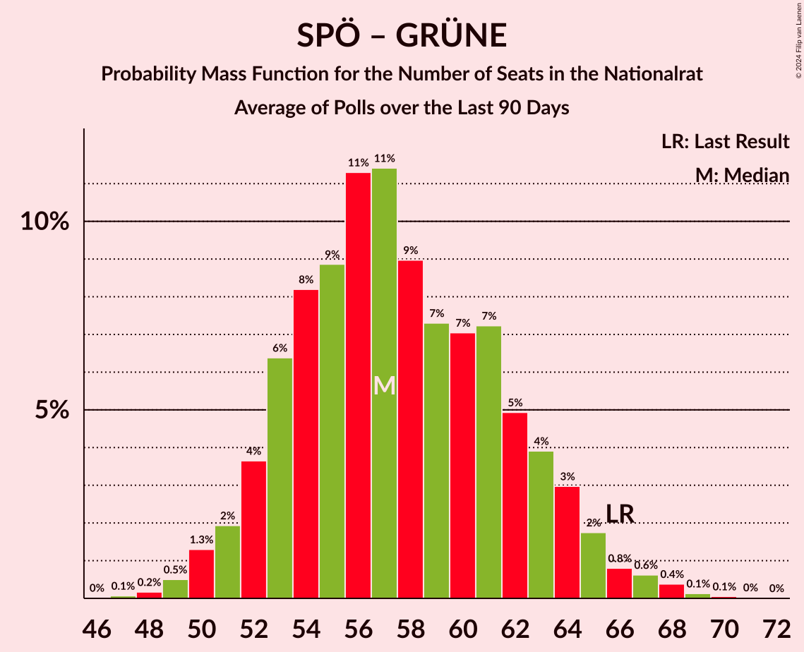

# Poll Average

<a href="#voting-intentions">Voting Intentions</a> | <a href="#seats">Seats</a> | <a href="#coalitions">Coalitions</a> | <a href="#technical-information">Technical Information</a>

## Summary

The table below lists the polls on which the average is based. They are the most recent polls (less than 90 days old) registered and analyzed so far.

| Period     | Polling firm/Commissioner(s) | ÖVP | SPÖ | FPÖ | GRÜNE | NEOS | JETZT | G!LT | HC |
|:----------:|:----------------------------:|:--:|:--:|:--:|:--:|:--:|:--:|:--:|:--:|
| 29 September 2019 | General Election | 37.5%   71 | 21.2%   40 | 16.2%   31 | 13.9%   26 | 8.1%   15 | 1.9%   0 | 0.0%   0 | 0.0%   0 |
| N/A | Poll Average | 38–45%   70–85 | 16–22%   29–41 | 11–17%   20–31 | 12–18%   22–34 | 6–11%   11–20 | N/A   N/A | N/A   N/A | 3–6%   0–11 |
| [25–27 August 2020](2020-08-27-ResearchAffairs.html) | Research Affairs   ÖSTERREICH | 37–45%   69–86 | 16–23%   29–43 | 10–16%   19–30 | 11–17%   21–32 | 6–11%   11–20 | N/A   N/A | N/A   N/A | 3–6%   0–11 |
| [10–13 August 2020](2020-08-13-UniqueResearch.html) | Unique Research   profil | 38–44%   70–82 | 15–21%   28–38 | 13–18%   23–32 | 14–19%   25–34 | 7–11%   13–20 | N/A   N/A | N/A   N/A | N/A   N/A |
| [23–25 June 2020](2020-06-25-OGM.html) | OGM | 39–45%   72–85 | 16–22%   30–41 | 11–16%   20–29 | 14–19%   25–35 | 6–10%   11–18 | N/A   N/A | N/A   N/A | N/A   N/A |
| [5–9 June 2020](2020-06-09-KarmasinResearchIdentity.html) | Karmasin Research & Identity | 39–45%   73–85 | 17–22%   31–41 | 11–15%   21–28 | 13–17%   24–33 | 6–10%   12–18 | N/A   N/A | N/A   N/A | N/A   N/A |
| 29 September 2019 | General Election | 37.5%   71 | 21.2%   40 | 16.2%   31 | 13.9%   26 | 8.1%   15 | 1.9%   0 | 0.0%   0 | 0.0%   0 |

Only polls for which at least the sample size has been published are included in the table above.

**Legend:**
+ **Top half of each row:** Voting intentions (95% confidence interval)
+ **Bottom half of each row:** Seat projections for the Nationalrat (95% confidence interval)
+ **ÖVP:** Österreichische Volkspartei
+ **SPÖ:** Sozialdemokratische Partei Österreichs
+ **FPÖ:** Freiheitliche Partei Österreichs
+ **GRÜNE:** Die Grünen–Die Grüne Alternative
+ **NEOS:** NEOS–Das Neue Österreich und Liberales Forum
+ **JETZT:** JETZT–Liste Pilz
+ **G!LT:** Meine Stimme G!LT
+ **HC:** Team HC Strache–Allianz für Österreich
+ **N/A (single party):** Party not included the published results
+ **N/A (entire row):** Calculation for this opinion poll not started yet

## Voting Intentions

### Confidence Intervals

| Party | Last Result | Median | 80% Confidence Interval | 90% Confidence Interval | 95% Confidence Interval | 99% Confidence Interval |
|:-----:|:-----------:|:------:|:-----------------------:|:-----------------------:|:-----------------------:|:-----------------------:|
| <a href="#österreichische-volkspartei">Österreichische Volkspartei</a> | 37.5% | 41.5% | 39.1–43.9% |38.4–44.5% | 37.7–45.1% | 36.4–46.3% |
| <a href="#sozialdemokratische-partei-österreichs">Sozialdemokratische Partei Österreichs</a> | 21.2% | 18.8% | 16.9–20.8% |16.4–21.4% | 16.0–21.9% | 15.1–23.0% |
| <a href="#freiheitliche-partei-österreichs">Freiheitliche Partei Österreichs</a> | 16.2% | 13.5% | 11.7–15.7% |11.3–16.3% | 10.9–16.8% | 10.1–17.8% |
| <a href="#die-grünen–die-grüne-alternative">Die Grünen–Die Grüne Alternative</a> | 13.9% | 15.4% | 13.3–17.3% |12.7–17.9% | 12.2–18.3% | 11.1–19.3% |
| <a href="#neos–das-neue-österreich-und-liberales-forum">NEOS–Das Neue Österreich und Liberales Forum</a> | 8.1% | 8.3% | 7.0–9.8% |6.6–10.3% | 6.3–10.7% | 5.7–11.5% |
| <a href="#jetzt–liste-pilz">JETZT–Liste Pilz</a> | 1.9% | N/A | N/A |N/A | N/A | N/A |
| <a href="#meine-stimme-g!lt">Meine Stimme G!LT</a> | 0.0% | N/A | N/A |N/A | N/A | N/A |
| <a href="#team-hc-strache–allianz-für-österreich">Team HC Strache–Allianz für Österreich</a> | 0.0% | 4.1% | 3.1–5.4% |2.8–5.8% | 2.6–6.1% | 2.2–6.8% |

### Österreichische Volkspartei

*For a full overview of the results for this party, see the [Österreichische Volkspartei](party-österreichischevolkspartei.html) page.*

| Voting Intentions | Probability | Accumulated | Special Marks |
|:-----------------:|:-----------:|:-----------:|:-------------:|
| 33.5–34.5% | 0% | 100% |  |
| 34.5–35.5% | 0.1% | 100% |  |
| 35.5–36.5% | 0.5% | 99.8% |  |
| 36.5–37.5% | 2% | 99.4% |  |
| 37.5–38.5% | 4% | 98% | Last Result |
| 38.5–39.5% | 9% | 94% |  |
| 39.5–40.5% | 15% | 85% |  |
| 40.5–41.5% | 20% | 70% |  |
| 41.5–42.5% | 21% | 50% | Median |
| 42.5–43.5% | 15% | 29% |  |
| 43.5–44.5% | 9% | 14% |  |
| 44.5–45.5% | 4% | 5% |  |
| 45.5–46.5% | 1.1% | 1.4% |  |
| 46.5–47.5% | 0.3% | 0.3% |  |
| 47.5–48.5% | 0.1% | 0.1% |  |
| 48.5–49.5% | 0% | 0% |  |

### Sozialdemokratische Partei Österreichs

*For a full overview of the results for this party, see the [Sozialdemokratische Partei Österreichs](party-sozialdemokratischeparteiösterreichs.html) page.*

| Voting Intentions | Probability | Accumulated | Special Marks |
|:-----------------:|:-----------:|:-----------:|:-------------:|
| 12.5–13.5% | 0% | 100% |  |
| 13.5–14.5% | 0.1% | 100% |  |
| 14.5–15.5% | 1.1% | 99.8% |  |
| 15.5–16.5% | 5% | 98.8% |  |
| 16.5–17.5% | 13% | 94% |  |
| 17.5–18.5% | 24% | 80% |  |
| 18.5–19.5% | 26% | 57% | Median |
| 19.5–20.5% | 18% | 31% |  |
| 20.5–21.5% | 9% | 13% | Last Result |
| 21.5–22.5% | 3% | 4% |  |
| 22.5–23.5% | 0.8% | 1.0% |  |
| 23.5–24.5% | 0.2% | 0.2% |  |
| 24.5–25.5% | 0% | 0% |  |
| 25.5–26.5% | 0% | 0% |  |

### Freiheitliche Partei Österreichs

*For a full overview of the results for this party, see the [Freiheitliche Partei Österreichs](party-freiheitlicheparteiösterreichs.html) page.*

| Voting Intentions | Probability | Accumulated | Special Marks |
|:-----------------:|:-----------:|:-----------:|:-------------:|
| 7.5–8.5% | 0% | 100% |  |
| 8.5–9.5% | 0.1% | 100% |  |
| 9.5–10.5% | 1.2% | 99.9% |  |
| 10.5–11.5% | 6% | 98.7% |  |
| 11.5–12.5% | 17% | 92% |  |
| 12.5–13.5% | 26% | 75% |  |
| 13.5–14.5% | 23% | 49% | Median |
| 14.5–15.5% | 15% | 26% |  |
| 15.5–16.5% | 8% | 11% | Last Result |
| 16.5–17.5% | 3% | 4% |  |
| 17.5–18.5% | 0.7% | 0.8% |  |
| 18.5–19.5% | 0.1% | 0.1% |  |
| 19.5–20.5% | 0% | 0% |  |

### Die Grünen–Die Grüne Alternative

*For a full overview of the results for this party, see the [Die Grünen–Die Grüne Alternative](party-diegrünen–diegrünealternative.html) page.*

| Voting Intentions | Probability | Accumulated | Special Marks |
|:-----------------:|:-----------:|:-----------:|:-------------:|
| 8.5–9.5% | 0% | 100% |  |
| 9.5–10.5% | 0.2% | 100% |  |
| 10.5–11.5% | 0.9% | 99.8% |  |
| 11.5–12.5% | 3% | 98.9% |  |
| 12.5–13.5% | 8% | 96% |  |
| 13.5–14.5% | 17% | 88% | Last Result |
| 14.5–15.5% | 25% | 71% | Median |
| 15.5–16.5% | 24% | 46% |  |
| 16.5–17.5% | 14% | 22% |  |
| 17.5–18.5% | 6% | 8% |  |
| 18.5–19.5% | 1.5% | 2% |  |
| 19.5–20.5% | 0.3% | 0.3% |  |
| 20.5–21.5% | 0% | 0% |  |

### NEOS–Das Neue Österreich und Liberales Forum

*For a full overview of the results for this party, see the [NEOS–Das Neue Österreich und Liberales Forum](party-neos–dasneueösterreichundliberalesforum.html) page.*

| Voting Intentions | Probability | Accumulated | Special Marks |
|:-----------------:|:-----------:|:-----------:|:-------------:|
| 3.5–4.5% | 0% | 100% |  |
| 4.5–5.5% | 0.3% | 100% |  |
| 5.5–6.5% | 4% | 99.7% |  |
| 6.5–7.5% | 19% | 96% |  |
| 7.5–8.5% | 35% | 76% | Last Result, Median |
| 8.5–9.5% | 27% | 41% |  |
| 9.5–10.5% | 11% | 14% |  |
| 10.5–11.5% | 3% | 3% |  |
| 11.5–12.5% | 0.4% | 0.5% |  |
| 12.5–13.5% | 0% | 0% |  |
| 13.5–14.5% | 0% | 0% |  |

### Team HC Strache–Allianz für Österreich

*For a full overview of the results for this party, see the [Team HC Strache–Allianz für Österreich](party-teamhcstrache–allianzfürösterreich.html) page.*

| Voting Intentions | Probability | Accumulated | Special Marks |
|:-----------------:|:-----------:|:-----------:|:-------------:|
| 0.0–0.5% | 0% | 100% | Last Result |
| 0.5–1.5% | 0% | 100% |  |
| 1.5–2.5% | 2% | 100% |  |
| 2.5–3.5% | 23% | 98% |  |
| 3.5–4.5% | 43% | 75% | Median |
| 4.5–5.5% | 25% | 32% |  |
| 5.5–6.5% | 6% | 7% |  |
| 6.5–7.5% | 0.8% | 0.9% |  |
| 7.5–8.5% | 0.1% | 0.1% |  |
| 8.5–9.5% | 0% | 0% |  |

## Seats

### Confidence Intervals

| Party | Last Result | Median | 80% Confidence Interval | 90% Confidence Interval | 95% Confidence Interval | 99% Confidence Interval |
|:-----:|:-----------:|:------:|:-----------------------:|:-----------------------:|:-----------------------:|:-----------------------:|
| <a href="#österreichische-volkspartei">Österreichische Volkspartei</a> | 71 | 78 | 73–83 |71–84 | 70–85 | 68–87 |
| <a href="#sozialdemokratische-partei-österreichs">Sozialdemokratische Partei Österreichs</a> | 40 | 35 | 31–39 |30–40 | 29–41 | 28–43 |
| <a href="#freiheitliche-partei-österreichs">Freiheitliche Partei Österreichs</a> | 31 | 25 | 22–29 |21–30 | 20–31 | 19–33 |
| <a href="#die-grünen–die-grüne-alternative">Die Grünen–Die Grüne Alternative</a> | 26 | 29 | 25–32 |24–33 | 22–34 | 20–36 |
| <a href="#neos–das-neue-österreich-und-liberales-forum">NEOS–Das Neue Österreich und Liberales Forum</a> | 15 | 15 | 13–18 |12–19 | 11–20 | 10–21 |
| <a href="#jetzt–liste-pilz">JETZT–Liste Pilz</a> | 0 | N/A | N/A |N/A | N/A | N/A |
| <a href="#meine-stimme-g!lt">Meine Stimme G!LT</a> | 0 | N/A | N/A |N/A | N/A | N/A |
| <a href="#team-hc-strache–allianz-für-österreich">Team HC Strache–Allianz für Österreich</a> | 0 | 7 | 0–9 |0–10 | 0–11 | 0–12 |

### Österreichische Volkspartei

*For a full overview of the results for this party, see the [Österreichische Volkspartei](party-österreichischevolkspartei.html) page.*

| Number of Seats | Probability | Accumulated | Special Marks |
|:---------------:|:-----------:|:-----------:|:-------------:|
| 65 | 0.1% | 100% |  |
| 66 | 0.1% | 99.9% |  |
| 67 | 0.2% | 99.8% |  |
| 68 | 0.4% | 99.5% |  |
| 69 | 0.8% | 99.1% |  |
| 70 | 1.3% | 98% |  |
| 71 | 2% | 97% | Last Result |
| 72 | 3% | 95% |  |
| 73 | 5% | 92% |  |
| 74 | 6% | 87% |  |
| 75 | 8% | 81% |  |
| 76 | 9% | 73% |  |
| 77 | 10% | 64% |  |
| 78 | 10% | 54% | Median |
| 79 | 11% | 44% |  |
| 80 | 9% | 33% |  |
| 81 | 8% | 24% |  |
| 82 | 6% | 16% |  |
| 83 | 4% | 10% |  |
| 84 | 3% | 6% |  |
| 85 | 2% | 4% |  |
| 86 | 0.9% | 2% |  |
| 87 | 0.5% | 1.0% |  |
| 88 | 0.2% | 0.5% |  |
| 89 | 0.1% | 0.3% |  |
| 90 | 0.1% | 0.1% |  |
| 91 | 0% | 0.1% |  |
| 92 | 0% | 0% | Majority |

### Sozialdemokratische Partei Österreichs

*For a full overview of the results for this party, see the [Sozialdemokratische Partei Österreichs](party-sozialdemokratischeparteiösterreichs.html) page.*

| Number of Seats | Probability | Accumulated | Special Marks |
|:---------------:|:-----------:|:-----------:|:-------------:|
| 26 | 0.1% | 100% |  |
| 27 | 0.3% | 99.9% |  |
| 28 | 0.7% | 99.6% |  |
| 29 | 2% | 98.9% |  |
| 30 | 3% | 97% |  |
| 31 | 5% | 94% |  |
| 32 | 8% | 89% |  |
| 33 | 11% | 81% |  |
| 34 | 13% | 70% |  |
| 35 | 14% | 57% | Median |
| 36 | 13% | 43% |  |
| 37 | 11% | 30% |  |
| 38 | 8% | 19% |  |
| 39 | 5% | 12% |  |
| 40 | 3% | 6% | Last Result |
| 41 | 2% | 3% |  |
| 42 | 0.9% | 2% |  |
| 43 | 0.5% | 0.9% |  |
| 44 | 0.2% | 0.4% |  |
| 45 | 0.1% | 0.2% |  |
| 46 | 0% | 0.1% |  |
| 47 | 0% | 0% |  |

### Freiheitliche Partei Österreichs

*For a full overview of the results for this party, see the [Freiheitliche Partei Österreichs](party-freiheitlicheparteiösterreichs.html) page.*

| Number of Seats | Probability | Accumulated | Special Marks |
|:---------------:|:-----------:|:-----------:|:-------------:|
| 17 | 0.1% | 100% |  |
| 18 | 0.4% | 99.9% |  |
| 19 | 1.0% | 99.5% |  |
| 20 | 2% | 98% |  |
| 21 | 5% | 96% |  |
| 22 | 8% | 91% |  |
| 23 | 12% | 83% |  |
| 24 | 14% | 71% |  |
| 25 | 15% | 58% | Median |
| 26 | 13% | 43% |  |
| 27 | 10% | 31% |  |
| 28 | 8% | 20% |  |
| 29 | 5% | 12% |  |
| 30 | 4% | 7% |  |
| 31 | 2% | 4% | Last Result |
| 32 | 1.0% | 2% |  |
| 33 | 0.5% | 0.7% |  |
| 34 | 0.2% | 0.3% |  |
| 35 | 0.1% | 0.1% |  |
| 36 | 0% | 0% |  |

### Die Grünen–Die Grüne Alternative

*For a full overview of the results for this party, see the [Die Grünen–Die Grüne Alternative](party-diegrünen–diegrünealternative.html) page.*

| Number of Seats | Probability | Accumulated | Special Marks |
|:---------------:|:-----------:|:-----------:|:-------------:|
| 18 | 0% | 100% |  |
| 19 | 0.1% | 99.9% |  |
| 20 | 0.3% | 99.8% |  |
| 21 | 0.8% | 99.5% |  |
| 22 | 1.3% | 98.7% |  |
| 23 | 2% | 97% |  |
| 24 | 4% | 95% |  |
| 25 | 6% | 91% |  |
| 26 | 9% | 85% | Last Result |
| 27 | 13% | 77% |  |
| 28 | 13% | 64% |  |
| 29 | 14% | 51% | Median |
| 30 | 13% | 37% |  |
| 31 | 10% | 24% |  |
| 32 | 6% | 14% |  |
| 33 | 4% | 8% |  |
| 34 | 2% | 4% |  |
| 35 | 1.0% | 2% |  |
| 36 | 0.4% | 0.6% |  |
| 37 | 0.1% | 0.2% |  |
| 38 | 0% | 0.1% |  |
| 39 | 0% | 0% |  |

### NEOS–Das Neue Österreich und Liberales Forum

*For a full overview of the results for this party, see the [NEOS–Das Neue Österreich und Liberales Forum](party-neos–dasneueösterreichundliberalesforum.html) page.*

| Number of Seats | Probability | Accumulated | Special Marks |
|:---------------:|:-----------:|:-----------:|:-------------:|
| 9 | 0.1% | 100% |  |
| 10 | 0.6% | 99.9% |  |
| 11 | 2% | 99.3% |  |
| 12 | 6% | 97% |  |
| 13 | 11% | 92% |  |
| 14 | 17% | 80% |  |
| 15 | 19% | 63% | Last Result, Median |
| 16 | 17% | 44% |  |
| 17 | 13% | 27% |  |
| 18 | 8% | 14% |  |
| 19 | 4% | 7% |  |
| 20 | 2% | 3% |  |
| 21 | 0.7% | 1.0% |  |
| 22 | 0.2% | 0.3% |  |
| 23 | 0.1% | 0.1% |  |
| 24 | 0% | 0% |  |

### JETZT–Liste Pilz

*For a full overview of the results for this party, see the [JETZT–Liste Pilz](party-jetzt–listepilz.html) page.*

### Meine Stimme G!LT

*For a full overview of the results for this party, see the [Meine Stimme G!LT](party-meinestimmeglt.html) page.*

### Team HC Strache–Allianz für Österreich

*For a full overview of the results for this party, see the [Team HC Strache–Allianz für Österreich](party-teamhcstrache–allianzfürösterreich.html) page.*

| Number of Seats | Probability | Accumulated | Special Marks |
|:---------------:|:-----------:|:-----------:|:-------------:|
| 0 | 45% | 100% | Last Result |
| 1 | 0% | 55% |  |
| 2 | 0% | 55% |  |
| 3 | 0% | 55% |  |
| 4 | 0% | 55% |  |
| 5 | 0% | 55% |  |
| 6 | 0% | 55% |  |
| 7 | 13% | 55% | Median |
| 8 | 19% | 42% |  |
| 9 | 14% | 23% |  |
| 10 | 6% | 10% |  |
| 11 | 2% | 4% |  |
| 12 | 0.9% | 1.2% |  |
| 13 | 0.3% | 0.4% |  |
| 14 | 0.1% | 0.1% |  |
| 15 | 0% | 0% |  |

## Coalitions

### Confidence Intervals

| Coalition | Last Result | Median | Majority? | 80% Confidence Interval | 90% Confidence Interval | 95% Confidence Interval | 99% Confidence Interval |
|:---------:|:-----------:|:------:|:---------:|:-----------------------:|:-----------------------:|:-----------------------:|:-----------------------:|
| Österreichische Volkspartei – Die Grünen–Die Grüne Alternative – NEOS–Das Neue Österreich und Liberales Forum | 112 | 122 | 100% | 116–126 | 114–127 | 112–128 | 109–130 |
| Österreichische Volkspartei – Sozialdemokratische Partei Österreichs | 111 | 113 | 100% | 107–118 | 106–120 | 104–121 | 102–123 |
| Österreichische Volkspartei – Die Grünen–Die Grüne Alternative | 97 | 107 | 99.9% | 101–111 | 99–113 | 97–114 | 94–116 |
| Österreichische Volkspartei – Freiheitliche Partei Österreichs | 102 | 103 | 99.6% | 98–108 | 96–109 | 95–110 | 92–112 |
| Österreichische Volkspartei – NEOS–Das Neue Österreich und Liberales Forum | 86 | 93 | 68% | 88–98 | 87–99 | 85–100 | 83–103 |
| Sozialdemokratische Partei Österreichs – Die Grünen–Die Grüne Alternative – NEOS–Das Neue Österreich und Liberales Forum | 81 | 79 | 0% | 74–83 | 72–85 | 71–86 | 68–88 |
| Österreichische Volkspartei | 71 | 78 | 0% | 73–83 | 71–84 | 70–85 | 68–87 |
| Sozialdemokratische Partei Österreichs – Die Grünen–Die Grüne Alternative | 66 | 64 | 0% | 59–68 | 57–69 | 56–70 | 54–73 |
| Sozialdemokratische Partei Österreichs – Freiheitliche Partei Österreichs | 71 | 60 | 0% | 56–64 | 55–66 | 54–67 | 51–69 |
| Sozialdemokratische Partei Österreichs | 40 | 35 | 0% | 31–39 | 30–40 | 29–41 | 28–43 |

### Österreichische Volkspartei – Die Grünen–Die Grüne Alternative – NEOS–Das Neue Österreich und Liberales Forum

| Number of Seats | Probability | Accumulated | Special Marks |
|:---------------:|:-----------:|:-----------:|:-------------:|
| 105 | 0% | 100% |  |
| 106 | 0.1% | 99.9% |  |
| 107 | 0.1% | 99.9% |  |
| 108 | 0.2% | 99.7% |  |
| 109 | 0.3% | 99.5% |  |
| 110 | 0.5% | 99.2% |  |
| 111 | 0.8% | 98.7% |  |
| 112 | 0.8% | 98% | Last Result |
| 113 | 1.4% | 97% |  |
| 114 | 2% | 96% |  |
| 115 | 2% | 94% |  |
| 116 | 3% | 92% |  |
| 117 | 4% | 89% |  |
| 118 | 5% | 85% |  |
| 119 | 7% | 80% |  |
| 120 | 8% | 73% |  |
| 121 | 9% | 65% |  |
| 122 | 12% | 55% | Median |
| 123 | 11% | 44% |  |
| 124 | 9% | 33% |  |
| 125 | 9% | 24% |  |
| 126 | 6% | 15% |  |
| 127 | 4% | 9% |  |
| 128 | 2% | 5% |  |
| 129 | 1.3% | 2% |  |
| 130 | 0.6% | 1.1% |  |
| 131 | 0.3% | 0.5% |  |
| 132 | 0.1% | 0.2% |  |
| 133 | 0% | 0.1% |  |
| 134 | 0% | 0% |  |

### Österreichische Volkspartei – Sozialdemokratische Partei Österreichs

| Number of Seats | Probability | Accumulated | Special Marks |
|:---------------:|:-----------:|:-----------:|:-------------:|
| 99 | 0.1% | 100% |  |
| 100 | 0.1% | 99.9% |  |
| 101 | 0.2% | 99.8% |  |
| 102 | 0.4% | 99.6% |  |
| 103 | 0.7% | 99.2% |  |
| 104 | 1.4% | 98% |  |
| 105 | 2% | 97% |  |
| 106 | 3% | 95% |  |
| 107 | 4% | 92% |  |
| 108 | 5% | 88% |  |
| 109 | 6% | 84% |  |
| 110 | 7% | 77% |  |
| 111 | 7% | 70% | Last Result |
| 112 | 8% | 63% |  |
| 113 | 9% | 55% | Median |
| 114 | 9% | 46% |  |
| 115 | 9% | 37% |  |
| 116 | 8% | 27% |  |
| 117 | 6% | 20% |  |
| 118 | 5% | 14% |  |
| 119 | 4% | 9% |  |
| 120 | 3% | 5% |  |
| 121 | 1.4% | 3% |  |
| 122 | 0.6% | 1.4% |  |
| 123 | 0.3% | 0.8% |  |
| 124 | 0.2% | 0.4% |  |
| 125 | 0.1% | 0.2% |  |
| 126 | 0.1% | 0.1% |  |
| 127 | 0% | 0% |  |

### Österreichische Volkspartei – Die Grünen–Die Grüne Alternative

| Number of Seats | Probability | Accumulated | Special Marks |
|:---------------:|:-----------:|:-----------:|:-------------:|
| 90 | 0% | 100% |  |
| 91 | 0.1% | 99.9% |  |
| 92 | 0.1% | 99.9% | Majority |
| 93 | 0.2% | 99.8% |  |
| 94 | 0.3% | 99.6% |  |
| 95 | 0.4% | 99.2% |  |
| 96 | 0.8% | 98.8% |  |
| 97 | 1.1% | 98% | Last Result |
| 98 | 1.2% | 97% |  |
| 99 | 2% | 96% |  |
| 100 | 3% | 94% |  |
| 101 | 3% | 91% |  |
| 102 | 5% | 88% |  |
| 103 | 6% | 83% |  |
| 104 | 7% | 76% |  |
| 105 | 9% | 69% |  |
| 106 | 10% | 61% |  |
| 107 | 10% | 51% | Median |
| 108 | 10% | 40% |  |
| 109 | 9% | 31% |  |
| 110 | 7% | 22% |  |
| 111 | 5% | 14% |  |
| 112 | 4% | 9% |  |
| 113 | 2% | 5% |  |
| 114 | 1.4% | 3% |  |
| 115 | 0.7% | 1.3% |  |
| 116 | 0.3% | 0.6% |  |
| 117 | 0.2% | 0.3% |  |
| 118 | 0.1% | 0.1% |  |
| 119 | 0% | 0% |  |

### Österreichische Volkspartei – Freiheitliche Partei Österreichs

| Number of Seats | Probability | Accumulated | Special Marks |
|:---------------:|:-----------:|:-----------:|:-------------:|
| 88 | 0% | 100% |  |
| 89 | 0.1% | 99.9% |  |
| 90 | 0.1% | 99.9% |  |
| 91 | 0.2% | 99.8% |  |
| 92 | 0.3% | 99.6% | Majority |
| 93 | 0.5% | 99.3% |  |
| 94 | 0.8% | 98.8% |  |
| 95 | 1.2% | 98% |  |
| 96 | 2% | 97% |  |
| 97 | 3% | 95% |  |
| 98 | 4% | 92% |  |
| 99 | 6% | 89% |  |
| 100 | 7% | 83% |  |
| 101 | 9% | 76% |  |
| 102 | 10% | 67% | Last Result |
| 103 | 11% | 57% | Median |
| 104 | 11% | 46% |  |
| 105 | 10% | 35% |  |
| 106 | 8% | 25% |  |
| 107 | 6% | 17% |  |
| 108 | 4% | 11% |  |
| 109 | 3% | 6% |  |
| 110 | 2% | 4% |  |
| 111 | 1.0% | 2% |  |
| 112 | 0.5% | 0.9% |  |
| 113 | 0.2% | 0.4% |  |
| 114 | 0.1% | 0.2% |  |
| 115 | 0% | 0.1% |  |
| 116 | 0% | 0% |  |

### Österreichische Volkspartei – NEOS–Das Neue Österreich und Liberales Forum

| Number of Seats | Probability | Accumulated | Special Marks |
|:---------------:|:-----------:|:-----------:|:-------------:|
| 79 | 0% | 100% |  |
| 80 | 0.1% | 99.9% |  |
| 81 | 0.1% | 99.9% |  |
| 82 | 0.2% | 99.7% |  |
| 83 | 0.4% | 99.5% |  |
| 84 | 0.7% | 99.1% |  |
| 85 | 1.1% | 98% |  |
| 86 | 2% | 97% | Last Result |
| 87 | 3% | 96% |  |
| 88 | 4% | 93% |  |
| 89 | 5% | 89% |  |
| 90 | 7% | 83% |  |
| 91 | 9% | 76% |  |
| 92 | 10% | 68% | Majority |
| 93 | 11% | 57% | Median |
| 94 | 11% | 46% |  |
| 95 | 10% | 36% |  |
| 96 | 8% | 26% |  |
| 97 | 6% | 17% |  |
| 98 | 4% | 11% |  |
| 99 | 3% | 7% |  |
| 100 | 2% | 4% |  |
| 101 | 1.0% | 2% |  |
| 102 | 0.5% | 1.1% |  |
| 103 | 0.3% | 0.5% |  |
| 104 | 0.1% | 0.3% |  |
| 105 | 0.1% | 0.1% |  |
| 106 | 0% | 0.1% |  |
| 107 | 0% | 0% |  |

### Sozialdemokratische Partei Österreichs – Die Grünen–Die Grüne Alternative – NEOS–Das Neue Österreich und Liberales Forum

| Number of Seats | Probability | Accumulated | Special Marks |
|:---------------:|:-----------:|:-----------:|:-------------:|
| 64 | 0% | 100% |  |
| 65 | 0.1% | 99.9% |  |
| 66 | 0.1% | 99.9% |  |
| 67 | 0.2% | 99.8% |  |
| 68 | 0.3% | 99.6% |  |
| 69 | 0.5% | 99.3% |  |
| 70 | 0.8% | 98.8% |  |
| 71 | 1.1% | 98% |  |
| 72 | 2% | 97% |  |
| 73 | 3% | 95% |  |
| 74 | 4% | 92% |  |
| 75 | 6% | 88% |  |
| 76 | 7% | 82% |  |
| 77 | 9% | 74% |  |
| 78 | 11% | 65% |  |
| 79 | 11% | 54% | Median |
| 80 | 11% | 43% |  |
| 81 | 10% | 33% | Last Result |
| 82 | 8% | 23% |  |
| 83 | 6% | 15% |  |
| 84 | 4% | 9% |  |
| 85 | 2% | 5% |  |
| 86 | 2% | 3% |  |
| 87 | 0.8% | 2% |  |
| 88 | 0.4% | 0.8% |  |
| 89 | 0.2% | 0.4% |  |
| 90 | 0.1% | 0.2% |  |
| 91 | 0% | 0.1% |  |
| 92 | 0% | 0% | Majority |

### Österreichische Volkspartei

| Number of Seats | Probability | Accumulated | Special Marks |
|:---------------:|:-----------:|:-----------:|:-------------:|
| 65 | 0.1% | 100% |  |
| 66 | 0.1% | 99.9% |  |
| 67 | 0.2% | 99.8% |  |
| 68 | 0.4% | 99.5% |  |
| 69 | 0.8% | 99.1% |  |
| 70 | 1.3% | 98% |  |
| 71 | 2% | 97% | Last Result |
| 72 | 3% | 95% |  |
| 73 | 5% | 92% |  |
| 74 | 6% | 87% |  |
| 75 | 8% | 81% |  |
| 76 | 9% | 73% |  |
| 77 | 10% | 64% |  |
| 78 | 10% | 54% | Median |
| 79 | 11% | 44% |  |
| 80 | 9% | 33% |  |
| 81 | 8% | 24% |  |
| 82 | 6% | 16% |  |
| 83 | 4% | 10% |  |
| 84 | 3% | 6% |  |
| 85 | 2% | 4% |  |
| 86 | 0.9% | 2% |  |
| 87 | 0.5% | 1.0% |  |
| 88 | 0.2% | 0.5% |  |
| 89 | 0.1% | 0.3% |  |
| 90 | 0.1% | 0.1% |  |
| 91 | 0% | 0.1% |  |
| 92 | 0% | 0% | Majority |

### Sozialdemokratische Partei Österreichs – Die Grünen–Die Grüne Alternative

| Number of Seats | Probability | Accumulated | Special Marks |
|:---------------:|:-----------:|:-----------:|:-------------:|
| 50 | 0% | 100% |  |
| 51 | 0.1% | 99.9% |  |
| 52 | 0.1% | 99.9% |  |
| 53 | 0.2% | 99.7% |  |
| 54 | 0.5% | 99.5% |  |
| 55 | 0.7% | 99.0% |  |
| 56 | 1.4% | 98% |  |
| 57 | 2% | 97% |  |
| 58 | 3% | 95% |  |
| 59 | 5% | 92% |  |
| 60 | 6% | 87% |  |
| 61 | 9% | 81% |  |
| 62 | 10% | 72% |  |
| 63 | 11% | 62% |  |
| 64 | 11% | 51% | Median |
| 65 | 10% | 39% |  |
| 66 | 9% | 29% | Last Result |
| 67 | 7% | 20% |  |
| 68 | 5% | 13% |  |
| 69 | 3% | 8% |  |
| 70 | 2% | 5% |  |
| 71 | 1.2% | 2% |  |
| 72 | 0.6% | 1.2% |  |
| 73 | 0.3% | 0.6% |  |
| 74 | 0.2% | 0.3% |  |
| 75 | 0.1% | 0.1% |  |
| 76 | 0% | 0% |  |

### Sozialdemokratische Partei Österreichs – Freiheitliche Partei Österreichs

| Number of Seats | Probability | Accumulated | Special Marks |
|:---------------:|:-----------:|:-----------:|:-------------:|
| 49 | 0.1% | 100% |  |
| 50 | 0.1% | 99.9% |  |
| 51 | 0.3% | 99.7% |  |
| 52 | 0.6% | 99.4% |  |
| 53 | 1.1% | 98.8% |  |
| 54 | 2% | 98% |  |
| 55 | 3% | 96% |  |
| 56 | 5% | 92% |  |
| 57 | 7% | 87% |  |
| 58 | 10% | 79% |  |
| 59 | 11% | 69% |  |
| 60 | 12% | 59% | Median |
| 61 | 12% | 46% |  |
| 62 | 10% | 34% |  |
| 63 | 8% | 24% |  |
| 64 | 6% | 16% |  |
| 65 | 4% | 10% |  |
| 66 | 3% | 6% |  |
| 67 | 2% | 3% |  |
| 68 | 0.8% | 2% |  |
| 69 | 0.5% | 0.9% |  |
| 70 | 0.2% | 0.4% |  |
| 71 | 0.1% | 0.2% | Last Result |
| 72 | 0.1% | 0.1% |  |
| 73 | 0% | 0.1% |  |
| 74 | 0% | 0% |  |

### Sozialdemokratische Partei Österreichs

| Number of Seats | Probability | Accumulated | Special Marks |
|:---------------:|:-----------:|:-----------:|:-------------:|
| 26 | 0.1% | 100% |  |
| 27 | 0.3% | 99.9% |  |
| 28 | 0.7% | 99.6% |  |
| 29 | 2% | 98.9% |  |
| 30 | 3% | 97% |  |
| 31 | 5% | 94% |  |
| 32 | 8% | 89% |  |
| 33 | 11% | 81% |  |
| 34 | 13% | 70% |  |
| 35 | 14% | 57% | Median |
| 36 | 13% | 43% |  |
| 37 | 11% | 30% |  |
| 38 | 8% | 19% |  |
| 39 | 5% | 12% |  |
| 40 | 3% | 6% | Last Result |
| 41 | 2% | 3% |  |
| 42 | 0.9% | 2% |  |
| 43 | 0.5% | 0.9% |  |
| 44 | 0.2% | 0.4% |  |
| 45 | 0.1% | 0.2% |  |
| 46 | 0% | 0.1% |  |
| 47 | 0% | 0% |  |

## Technical Information

+ **Number of polls included in this average:** 4
+ **Lowest number of simulations done in a poll included in this average:** 1,048,576
+ **Total number of simulations done in the polls included in this average:** 4,194,304
+ **Error estimate:** 1.42%
