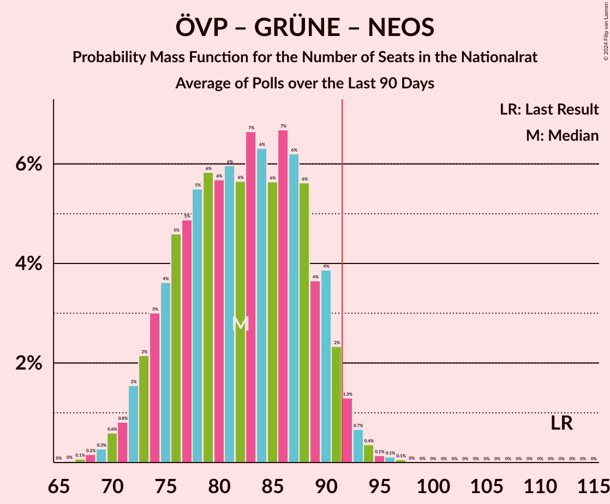

# Poll Average

<a href="#voting-intentions">Voting Intentions</a> | <a href="#seats">Seats</a> | <a href="#coalitions">Coalitions</a> | <a href="#technical-information">Technical Information</a>

## Summary

The table below lists the polls on which the average is based. They are the most recent polls (less than 90 days old) registered and analyzed so far.

| Period     | Polling firm/Commissioner(s) | ÖVP | SPÖ | FPÖ | GRÜNE | NEOS | JETZT | G!LT |
|:----------:|:----------------------------:|:--:|:--:|:--:|:--:|:--:|:--:|:--:|
| 29 September 2019 | General Election | 37.5%   71 | 21.2%   40 | 16.2%   31 | 13.9%   26 | 8.1%   15 | 1.9%   0 | 0.0%   0 |
| N/A | Poll Average | 36–47%   67–88 | 14–20%   25–37 | 10–18%   18–33 | 15–20%   28–38 | 5–11%   10–21 | N/A   N/A | N/A   N/A |
| [3–7 April 2020](2020-04-07-Market.html) | Market   Der Standard | 42–46%   78–86 | 17–21%   32–39 | 10–13%   18–23 | 17–21%   32–39 | 5–7%   9–13 | N/A   N/A | N/A   N/A |
| [31 March–2 April 2020](2020-04-02-OGM.html) | OGM | 42–48%   78–91 | 14–19%   25–35 | 10–14%   18–27 | 15–21%   29–39 | 5–9%   10–16 | N/A   N/A | N/A   N/A |
| [5–11 March 2020](2020-03-11-ResearchAffairs.html) | Research Affairs   ÖSTERREICH | 37–43%   68–81 | 15–20%   28–37 | 10–14%   19–27 | 15–20%   28–37 | 8–11%   14–21 | N/A   N/A | N/A   N/A |
| [10–14 February 2020](2020-02-14-UniqueResearch.html) | Unique Research   profil | 35–41%   64–78 | 13–18%   23–33 | 14–19%   25–35 | 15–20%   27–37 | 8–12%   15–23 | N/A   N/A | N/A   N/A |
| [10–15 January 2020](2020-01-15-KarmasinResearchIdentity.html) | Karmasin Research & Identity | 36–42%   68–80 | 15–19%   28–37 | 13–17%   24–33 | 15–19%   28–37 | 7–11%   14–20 | N/A   N/A | N/A   N/A |
| 29 September 2019 | General Election | 37.5%   71 | 21.2%   40 | 16.2%   31 | 13.9%   26 | 8.1%   15 | 1.9%   0 | 0.0%   0 |

Only polls for which at least the sample size has been published are included in the table above.

**Legend:**
+ **Top half of each row:** Voting intentions (95% confidence interval)
+ **Bottom half of each row:** Seat projections for the Nationalrat (95% confidence interval)
+ **ÖVP:** Österreichische Volkspartei
+ **SPÖ:** Sozialdemokratische Partei Österreichs
+ **FPÖ:** Freiheitliche Partei Österreichs
+ **GRÜNE:** Die Grünen–Die Grüne Alternative
+ **NEOS:** NEOS–Das Neue Österreich und Liberales Forum
+ **JETZT:** JETZT–Liste Pilz
+ **G!LT:** Meine Stimme G!LT
+ **N/A (single party):** Party not included the published results
+ **N/A (entire row):** Calculation for this opinion poll not started yet

## Voting Intentions

### Confidence Intervals

| Party | Last Result | Median | 80% Confidence Interval | 90% Confidence Interval | 95% Confidence Interval | 99% Confidence Interval |
|:-----:|:-----------:|:------:|:-----------------------:|:-----------------------:|:-----------------------:|:-----------------------:|
| <a href="#österreichische-volkspartei">Österreichische Volkspartei</a> | 37.5% | 40.7% | 37.3–45.5% |36.5–46.3% | 35.9–47.1% | 34.7–48.5% |
| <a href="#sozialdemokratische-partei-österreichs">Sozialdemokratische Partei Österreichs</a> | 21.2% | 16.9% | 14.6–19.3% |14.0–19.8% | 13.6–20.2% | 12.7–20.9% |
| <a href="#freiheitliche-partei-österreichs">Freiheitliche Partei Österreichs</a> | 16.2% | 12.9% | 10.7–16.5% |10.3–17.2% | 10.0–17.7% | 9.5–18.8% |
| <a href="#die-grünen–die-grüne-alternative">Die Grünen–Die Grüne Alternative</a> | 13.9% | 17.7% | 15.9–19.6% |15.4–20.1% | 15.0–20.5% | 14.3–21.2% |
| <a href="#neos–das-neue-österreich-und-liberales-forum">NEOS–Das Neue Österreich und Liberales Forum</a> | 8.1% | 8.5% | 5.9–10.5% |5.6–11.0% | 5.4–11.4% | 4.9–12.3% |
| <a href="#jetzt–liste-pilz">JETZT–Liste Pilz</a> | 1.9% | N/A | N/A |N/A | N/A | N/A |
| <a href="#meine-stimme-g!lt">Meine Stimme G!LT</a> | 0.0% | N/A | N/A |N/A | N/A | N/A |

### Österreichische Volkspartei

*For a full overview of the results for this party, see the [Österreichische Volkspartei](party-österreichischevolkspartei.html) page.*

| Voting Intentions | Probability | Accumulated | Special Marks |
|:-----------------:|:-----------:|:-----------:|:-------------:|
| 31.5–32.5% | 0% | 100% |  |
| 32.5–33.5% | 0.1% | 100% |  |
| 33.5–34.5% | 0.3% | 99.9% |  |
| 34.5–35.5% | 1.2% | 99.6% |  |
| 35.5–36.5% | 3% | 98% |  |
| 36.5–37.5% | 7% | 95% |  |
| 37.5–38.5% | 11% | 88% | Last Result |
| 38.5–39.5% | 14% | 76% |  |
| 39.5–40.5% | 12% | 63% |  |
| 40.5–41.5% | 8% | 51% | Median |
| 41.5–42.5% | 6% | 43% |  |
| 42.5–43.5% | 8% | 37% |  |
| 43.5–44.5% | 11% | 29% |  |
| 44.5–45.5% | 9% | 18% |  |
| 45.5–46.5% | 5% | 9% |  |
| 46.5–47.5% | 3% | 4% |  |
| 47.5–48.5% | 1.1% | 2% |  |
| 48.5–49.5% | 0.3% | 0.5% |  |
| 49.5–50.5% | 0.1% | 0.1% |  |
| 50.5–51.5% | 0% | 0% |  |

### Sozialdemokratische Partei Österreichs

*For a full overview of the results for this party, see the [Sozialdemokratische Partei Österreichs](party-sozialdemokratischeparteiösterreichs.html) page.*

| Voting Intentions | Probability | Accumulated | Special Marks |
|:-----------------:|:-----------:|:-----------:|:-------------:|
| 10.5–11.5% | 0% | 100% |  |
| 11.5–12.5% | 0.3% | 100% |  |
| 12.5–13.5% | 2% | 99.6% |  |
| 13.5–14.5% | 7% | 98% |  |
| 14.5–15.5% | 13% | 91% |  |
| 15.5–16.5% | 19% | 77% |  |
| 16.5–17.5% | 20% | 58% | Median |
| 17.5–18.5% | 18% | 38% |  |
| 18.5–19.5% | 13% | 20% |  |
| 19.5–20.5% | 6% | 7% |  |
| 20.5–21.5% | 1.2% | 1.2% | Last Result |
| 21.5–22.5% | 0.1% | 0.1% |  |
| 22.5–23.5% | 0% | 0% |  |

### Freiheitliche Partei Österreichs

*For a full overview of the results for this party, see the [Freiheitliche Partei Österreichs](party-freiheitlicheparteiösterreichs.html) page.*

| Voting Intentions | Probability | Accumulated | Special Marks |
|:-----------------:|:-----------:|:-----------:|:-------------:|
| 7.5–8.5% | 0% | 100% |  |
| 8.5–9.5% | 0.6% | 100% |  |
| 9.5–10.5% | 7% | 99.4% |  |
| 10.5–11.5% | 19% | 92% |  |
| 11.5–12.5% | 18% | 74% |  |
| 12.5–13.5% | 13% | 55% | Median |
| 13.5–14.5% | 11% | 43% |  |
| 14.5–15.5% | 12% | 32% |  |
| 15.5–16.5% | 11% | 20% | Last Result |
| 16.5–17.5% | 6% | 9% |  |
| 17.5–18.5% | 2% | 3% |  |
| 18.5–19.5% | 0.6% | 0.7% |  |
| 19.5–20.5% | 0.1% | 0.1% |  |
| 20.5–21.5% | 0% | 0% |  |

### Die Grünen–Die Grüne Alternative

*For a full overview of the results for this party, see the [Die Grünen–Die Grüne Alternative](party-diegrünen–diegrünealternative.html) page.*

| Voting Intentions | Probability | Accumulated | Special Marks |
|:-----------------:|:-----------:|:-----------:|:-------------:|
| 11.5–12.5% | 0% | 100% |  |
| 12.5–13.5% | 0.1% | 100% |  |
| 13.5–14.5% | 0.9% | 99.9% | Last Result |
| 14.5–15.5% | 5% | 99.1% |  |
| 15.5–16.5% | 15% | 94% |  |
| 16.5–17.5% | 24% | 79% |  |
| 17.5–18.5% | 26% | 55% | Median |
| 18.5–19.5% | 19% | 30% |  |
| 19.5–20.5% | 8% | 10% |  |
| 20.5–21.5% | 2% | 2% |  |
| 21.5–22.5% | 0.2% | 0.2% |  |
| 22.5–23.5% | 0% | 0% |  |

### NEOS–Das Neue Österreich und Liberales Forum

*For a full overview of the results for this party, see the [NEOS–Das Neue Österreich und Liberales Forum](party-neos–dasneueösterreichundliberalesforum.html) page.*

| Voting Intentions | Probability | Accumulated | Special Marks |
|:-----------------:|:-----------:|:-----------:|:-------------:|
| 3.5–4.5% | 0.1% | 100% |  |
| 4.5–5.5% | 4% | 99.9% |  |
| 5.5–6.5% | 18% | 96% |  |
| 6.5–7.5% | 13% | 78% |  |
| 7.5–8.5% | 15% | 65% | Last Result |
| 8.5–9.5% | 23% | 50% | Median |
| 9.5–10.5% | 18% | 27% |  |
| 10.5–11.5% | 7% | 9% |  |
| 11.5–12.5% | 2% | 2% |  |
| 12.5–13.5% | 0.2% | 0.3% |  |
| 13.5–14.5% | 0% | 0% |  |

## Seats

### Confidence Intervals

| Party | Last Result | Median | 80% Confidence Interval | 90% Confidence Interval | 95% Confidence Interval | 99% Confidence Interval |
|:-----:|:-----------:|:------:|:-----------------------:|:-----------------------:|:-----------------------:|:-----------------------:|
| <a href="#österreichische-volkspartei">Österreichische Volkspartei</a> | 71 | 77 | 70–85 |68–87 | 67–88 | 64–91 |
| <a href="#sozialdemokratische-partei-österreichs">Sozialdemokratische Partei Österreichs</a> | 40 | 32 | 27–36 |26–37 | 25–37 | 23–39 |
| <a href="#freiheitliche-partei-österreichs">Freiheitliche Partei Österreichs</a> | 31 | 24 | 20–31 |19–32 | 18–33 | 17–35 |
| <a href="#die-grünen–die-grüne-alternative">Die Grünen–Die Grüne Alternative</a> | 26 | 33 | 29–36 |29–37 | 28–38 | 26–39 |
| <a href="#neos–das-neue-österreich-und-liberales-forum">NEOS–Das Neue Österreich und Liberales Forum</a> | 15 | 16 | 11–19 |10–20 | 10–21 | 9–23 |
| <a href="#jetzt–liste-pilz">JETZT–Liste Pilz</a> | 0 | N/A | N/A |N/A | N/A | N/A |
| <a href="#meine-stimme-g!lt">Meine Stimme G!LT</a> | 0 | N/A | N/A |N/A | N/A | N/A |

### Österreichische Volkspartei

*For a full overview of the results for this party, see the [Österreichische Volkspartei](party-österreichischevolkspartei.html) page.*

| Number of Seats | Probability | Accumulated | Special Marks |
|:---------------:|:-----------:|:-----------:|:-------------:|
| 62 | 0.1% | 100% |  |
| 63 | 0.1% | 99.9% |  |
| 64 | 0.3% | 99.7% |  |
| 65 | 0.6% | 99.4% |  |
| 66 | 1.0% | 98.9% |  |
| 67 | 2% | 98% |  |
| 68 | 2% | 96% |  |
| 69 | 3% | 94% |  |
| 70 | 4% | 91% |  |
| 71 | 5% | 87% | Last Result |
| 72 | 6% | 81% |  |
| 73 | 7% | 75% |  |
| 74 | 7% | 68% |  |
| 75 | 6% | 61% |  |
| 76 | 5% | 55% |  |
| 77 | 5% | 50% | Median |
| 78 | 4% | 46% |  |
| 79 | 4% | 42% |  |
| 80 | 5% | 38% |  |
| 81 | 5% | 33% |  |
| 82 | 6% | 28% |  |
| 83 | 5% | 22% |  |
| 84 | 5% | 17% |  |
| 85 | 4% | 12% |  |
| 86 | 3% | 8% |  |
| 87 | 2% | 6% |  |
| 88 | 1.4% | 3% |  |
| 89 | 0.9% | 2% |  |
| 90 | 0.6% | 1.2% |  |
| 91 | 0.3% | 0.6% |  |
| 92 | 0.2% | 0.3% | Majority |
| 93 | 0.1% | 0.1% |  |
| 94 | 0% | 0.1% |  |
| 95 | 0% | 0% |  |

### Sozialdemokratische Partei Österreichs

*For a full overview of the results for this party, see the [Sozialdemokratische Partei Österreichs](party-sozialdemokratischeparteiösterreichs.html) page.*

| Number of Seats | Probability | Accumulated | Special Marks |
|:---------------:|:-----------:|:-----------:|:-------------:|
| 22 | 0.1% | 100% |  |
| 23 | 0.4% | 99.8% |  |
| 24 | 1.1% | 99.4% |  |
| 25 | 2% | 98% |  |
| 26 | 4% | 96% |  |
| 27 | 5% | 93% |  |
| 28 | 7% | 87% |  |
| 29 | 9% | 80% |  |
| 30 | 10% | 71% |  |
| 31 | 11% | 61% |  |
| 32 | 11% | 50% | Median |
| 33 | 10% | 39% |  |
| 34 | 10% | 29% |  |
| 35 | 8% | 19% |  |
| 36 | 6% | 12% |  |
| 37 | 3% | 5% |  |
| 38 | 1.5% | 2% |  |
| 39 | 0.6% | 0.8% |  |
| 40 | 0.1% | 0.2% | Last Result |
| 41 | 0% | 0% |  |

### Freiheitliche Partei Österreichs

*For a full overview of the results for this party, see the [Freiheitliche Partei Österreichs](party-freiheitlicheparteiösterreichs.html) page.*

| Number of Seats | Probability | Accumulated | Special Marks |
|:---------------:|:-----------:|:-----------:|:-------------:|
| 16 | 0.1% | 100% |  |
| 17 | 0.6% | 99.9% |  |
| 18 | 2% | 99.3% |  |
| 19 | 6% | 97% |  |
| 20 | 10% | 91% |  |
| 21 | 10% | 81% |  |
| 22 | 10% | 71% |  |
| 23 | 8% | 61% |  |
| 24 | 7% | 52% | Median |
| 25 | 6% | 46% |  |
| 26 | 5% | 40% |  |
| 27 | 6% | 35% |  |
| 28 | 7% | 29% |  |
| 29 | 7% | 23% |  |
| 30 | 6% | 16% |  |
| 31 | 4% | 11% | Last Result |
| 32 | 3% | 6% |  |
| 33 | 2% | 4% |  |
| 34 | 1.0% | 2% |  |
| 35 | 0.5% | 0.8% |  |
| 36 | 0.2% | 0.3% |  |
| 37 | 0.1% | 0.1% |  |
| 38 | 0% | 0% |  |

### Die Grünen–Die Grüne Alternative

*For a full overview of the results for this party, see the [Die Grünen–Die Grüne Alternative](party-diegrünen–diegrünealternative.html) page.*

| Number of Seats | Probability | Accumulated | Special Marks |
|:---------------:|:-----------:|:-----------:|:-------------:|
| 25 | 0.1% | 100% |  |
| 26 | 0.4% | 99.8% | Last Result |
| 27 | 1.2% | 99.4% |  |
| 28 | 3% | 98% |  |
| 29 | 5% | 95% |  |
| 30 | 8% | 90% |  |
| 31 | 12% | 82% |  |
| 32 | 14% | 70% |  |
| 33 | 14% | 56% | Median |
| 34 | 14% | 42% |  |
| 35 | 12% | 29% |  |
| 36 | 8% | 17% |  |
| 37 | 5% | 9% |  |
| 38 | 2% | 4% |  |
| 39 | 1.0% | 1.5% |  |
| 40 | 0.3% | 0.5% |  |
| 41 | 0.1% | 0.1% |  |
| 42 | 0% | 0% |  |

### NEOS–Das Neue Österreich und Liberales Forum

*For a full overview of the results for this party, see the [NEOS–Das Neue Österreich und Liberales Forum](party-neos–dasneueösterreichundliberalesforum.html) page.*

| Number of Seats | Probability | Accumulated | Special Marks |
|:---------------:|:-----------:|:-----------:|:-------------:|
| 8 | 0.2% | 100% |  |
| 9 | 2% | 99.8% |  |
| 10 | 7% | 98% |  |
| 11 | 10% | 91% |  |
| 12 | 8% | 81% |  |
| 13 | 6% | 73% |  |
| 14 | 6% | 66% |  |
| 15 | 9% | 60% | Last Result |
| 16 | 11% | 51% | Median |
| 17 | 12% | 40% |  |
| 18 | 11% | 27% |  |
| 19 | 8% | 17% |  |
| 20 | 5% | 9% |  |
| 21 | 2% | 4% |  |
| 22 | 1.1% | 2% |  |
| 23 | 0.4% | 0.6% |  |
| 24 | 0.2% | 0.2% |  |
| 25 | 0% | 0.1% |  |
| 26 | 0% | 0% |  |

### JETZT–Liste Pilz

*For a full overview of the results for this party, see the [JETZT–Liste Pilz](party-jetzt–listepilz.html) page.*

### Meine Stimme G!LT

*For a full overview of the results for this party, see the [Meine Stimme G!LT](party-meinestimmeglt.html) page.*

## Coalitions

### Confidence Intervals

| Coalition | Last Result | Median | Majority? | 80% Confidence Interval | 90% Confidence Interval | 95% Confidence Interval | 99% Confidence Interval |
|:---------:|:-----------:|:------:|:---------:|:-----------------------:|:-----------------------:|:-----------------------:|:-----------------------:|
| Österreichische Volkspartei – Die Grünen–Die Grüne Alternative – NEOS–Das Neue Österreich und Liberales Forum | 112 | 125 | 100% | 119–131 | 117–133 | 116–134 | 113–137 |
| Österreichische Volkspartei – Die Grünen–Die Grüne Alternative | 97 | 109 | 100% | 101–119 | 100–121 | 98–122 | 95–124 |
| Österreichische Volkspartei – Sozialdemokratische Partei Österreichs | 111 | 108 | 99.6% | 99–118 | 97–119 | 95–120 | 92–122 |
| Österreichische Volkspartei – Freiheitliche Partei Österreichs | 102 | 102 | 98.8% | 96–107 | 94–109 | 93–111 | 90–113 |
| Österreichische Volkspartei – NEOS–Das Neue Österreich und Liberales Forum | 86 | 92 | 57% | 87–98 | 86–100 | 84–101 | 82–104 |
| Österreichische Volkspartei | 71 | 77 | 0.3% | 70–85 | 68–87 | 67–88 | 64–91 |
| Sozialdemokratische Partei Österreichs – Die Grünen–Die Grüne Alternative – NEOS–Das Neue Österreich und Liberales Forum | 81 | 80 | 0% | 75–84 | 73–85 | 72–87 | 69–89 |
| Sozialdemokratische Partei Österreichs – Die Grünen–Die Grüne Alternative | 66 | 64 | 0% | 59–71 | 57–72 | 56–73 | 53–74 |
| Sozialdemokratische Partei Österreichs – Freiheitliche Partei Österreichs | 71 | 56 | 0% | 51–61 | 50–63 | 49–64 | 46–66 |
| Sozialdemokratische Partei Österreichs | 40 | 32 | 0% | 27–36 | 26–37 | 25–37 | 23–39 |

### Österreichische Volkspartei – Die Grünen–Die Grüne Alternative – NEOS–Das Neue Österreich und Liberales Forum

| Number of Seats | Probability | Accumulated | Special Marks |
|:---------------:|:-----------:|:-----------:|:-------------:|
| 111 | 0.1% | 100% |  |
| 112 | 0.2% | 99.9% | Last Result |
| 113 | 0.3% | 99.7% |  |
| 114 | 0.5% | 99.4% |  |
| 115 | 0.9% | 98.9% |  |
| 116 | 1.5% | 98% |  |
| 117 | 2% | 97% |  |
| 118 | 3% | 94% |  |
| 119 | 4% | 91% |  |
| 120 | 5% | 87% |  |
| 121 | 6% | 82% |  |
| 122 | 6% | 77% |  |
| 123 | 6% | 70% |  |
| 124 | 7% | 64% |  |
| 125 | 7% | 57% |  |
| 126 | 8% | 50% | Median |
| 127 | 8% | 42% |  |
| 128 | 8% | 34% |  |
| 129 | 7% | 26% |  |
| 130 | 6% | 19% |  |
| 131 | 4% | 14% |  |
| 132 | 3% | 10% |  |
| 133 | 3% | 6% |  |
| 134 | 2% | 4% |  |
| 135 | 1.0% | 2% |  |
| 136 | 0.7% | 1.2% |  |
| 137 | 0.4% | 0.6% |  |
| 138 | 0.1% | 0.2% |  |
| 139 | 0.1% | 0.1% |  |
| 140 | 0% | 0% |  |

### Österreichische Volkspartei – Die Grünen–Die Grüne Alternative

| Number of Seats | Probability | Accumulated | Special Marks |
|:---------------:|:-----------:|:-----------:|:-------------:|
| 92 | 0% | 100% | Majority |
| 93 | 0.1% | 99.9% |  |
| 94 | 0.2% | 99.9% |  |
| 95 | 0.3% | 99.7% |  |
| 96 | 0.5% | 99.4% |  |
| 97 | 0.8% | 99.0% | Last Result |
| 98 | 1.2% | 98% |  |
| 99 | 2% | 97% |  |
| 100 | 2% | 95% |  |
| 101 | 3% | 93% |  |
| 102 | 4% | 89% |  |
| 103 | 5% | 85% |  |
| 104 | 6% | 80% |  |
| 105 | 6% | 75% |  |
| 106 | 6% | 68% |  |
| 107 | 6% | 62% |  |
| 108 | 5% | 57% |  |
| 109 | 4% | 52% |  |
| 110 | 3% | 48% | Median |
| 111 | 2% | 45% |  |
| 112 | 2% | 42% |  |
| 113 | 2% | 40% |  |
| 114 | 3% | 38% |  |
| 115 | 4% | 35% |  |
| 116 | 5% | 31% |  |
| 117 | 6% | 25% |  |
| 118 | 6% | 19% |  |
| 119 | 5% | 13% |  |
| 120 | 3% | 9% |  |
| 121 | 2% | 5% |  |
| 122 | 1.4% | 3% |  |
| 123 | 0.7% | 2% |  |
| 124 | 0.4% | 0.8% |  |
| 125 | 0.2% | 0.4% |  |
| 126 | 0.1% | 0.2% |  |
| 127 | 0% | 0.1% |  |
| 128 | 0% | 0% |  |

### Österreichische Volkspartei – Sozialdemokratische Partei Österreichs

| Number of Seats | Probability | Accumulated | Special Marks |
|:---------------:|:-----------:|:-----------:|:-------------:|
| 89 | 0.1% | 100% |  |
| 90 | 0.1% | 99.9% |  |
| 91 | 0.2% | 99.8% |  |
| 92 | 0.4% | 99.6% | Majority |
| 93 | 0.6% | 99.2% |  |
| 94 | 0.8% | 98.6% |  |
| 95 | 1.1% | 98% |  |
| 96 | 2% | 97% |  |
| 97 | 2% | 95% |  |
| 98 | 2% | 93% |  |
| 99 | 3% | 91% |  |
| 100 | 3% | 89% |  |
| 101 | 3% | 86% |  |
| 102 | 3% | 83% |  |
| 103 | 5% | 79% |  |
| 104 | 6% | 74% |  |
| 105 | 5% | 68% |  |
| 106 | 4% | 63% |  |
| 107 | 5% | 60% |  |
| 108 | 5% | 54% |  |
| 109 | 4% | 49% | Median |
| 110 | 3% | 45% |  |
| 111 | 3% | 42% | Last Result |
| 112 | 4% | 39% |  |
| 113 | 4% | 35% |  |
| 114 | 4% | 31% |  |
| 115 | 5% | 27% |  |
| 116 | 6% | 22% |  |
| 117 | 5% | 16% |  |
| 118 | 4% | 11% |  |
| 119 | 3% | 7% |  |
| 120 | 2% | 3% |  |
| 121 | 0.9% | 1.4% |  |
| 122 | 0.3% | 0.5% |  |
| 123 | 0.1% | 0.2% |  |
| 124 | 0% | 0.1% |  |
| 125 | 0% | 0% |  |

### Österreichische Volkspartei – Freiheitliche Partei Österreichs

| Number of Seats | Probability | Accumulated | Special Marks |
|:---------------:|:-----------:|:-----------:|:-------------:|
| 88 | 0.1% | 100% |  |
| 89 | 0.2% | 99.9% |  |
| 90 | 0.3% | 99.7% |  |
| 91 | 0.6% | 99.4% |  |
| 92 | 1.0% | 98.8% | Majority |
| 93 | 2% | 98% |  |
| 94 | 2% | 96% |  |
| 95 | 3% | 94% |  |
| 96 | 3% | 91% |  |
| 97 | 4% | 88% |  |
| 98 | 6% | 84% |  |
| 99 | 7% | 78% |  |
| 100 | 8% | 71% |  |
| 101 | 9% | 63% | Median |
| 102 | 10% | 54% | Last Result |
| 103 | 9% | 44% |  |
| 104 | 8% | 34% |  |
| 105 | 7% | 26% |  |
| 106 | 5% | 19% |  |
| 107 | 4% | 14% |  |
| 108 | 3% | 10% |  |
| 109 | 3% | 7% |  |
| 110 | 2% | 4% |  |
| 111 | 1.1% | 3% |  |
| 112 | 0.7% | 1.4% |  |
| 113 | 0.4% | 0.8% |  |
| 114 | 0.2% | 0.4% |  |
| 115 | 0.1% | 0.2% |  |
| 116 | 0% | 0.1% |  |
| 117 | 0% | 0% |  |

### Österreichische Volkspartei – NEOS–Das Neue Österreich und Liberales Forum

| Number of Seats | Probability | Accumulated | Special Marks |
|:---------------:|:-----------:|:-----------:|:-------------:|
| 79 | 0% | 100% |  |
| 80 | 0.1% | 99.9% |  |
| 81 | 0.2% | 99.8% |  |
| 82 | 0.4% | 99.6% |  |
| 83 | 0.8% | 99.2% |  |
| 84 | 1.2% | 98% |  |
| 85 | 2% | 97% |  |
| 86 | 3% | 95% | Last Result |
| 87 | 4% | 92% |  |
| 88 | 6% | 88% |  |
| 89 | 7% | 82% |  |
| 90 | 9% | 75% |  |
| 91 | 10% | 66% |  |
| 92 | 10% | 57% | Majority |
| 93 | 10% | 47% | Median |
| 94 | 8% | 37% |  |
| 95 | 7% | 28% |  |
| 96 | 6% | 21% |  |
| 97 | 4% | 16% |  |
| 98 | 3% | 11% |  |
| 99 | 3% | 8% |  |
| 100 | 2% | 5% |  |
| 101 | 1.4% | 3% |  |
| 102 | 0.9% | 2% |  |
| 103 | 0.6% | 1.1% |  |
| 104 | 0.3% | 0.6% |  |
| 105 | 0.2% | 0.3% |  |
| 106 | 0.1% | 0.1% |  |
| 107 | 0% | 0.1% |  |
| 108 | 0% | 0% |  |

### Österreichische Volkspartei

| Number of Seats | Probability | Accumulated | Special Marks |
|:---------------:|:-----------:|:-----------:|:-------------:|
| 62 | 0.1% | 100% |  |
| 63 | 0.1% | 99.9% |  |
| 64 | 0.3% | 99.7% |  |
| 65 | 0.6% | 99.4% |  |
| 66 | 1.0% | 98.9% |  |
| 67 | 2% | 98% |  |
| 68 | 2% | 96% |  |
| 69 | 3% | 94% |  |
| 70 | 4% | 91% |  |
| 71 | 5% | 87% | Last Result |
| 72 | 6% | 81% |  |
| 73 | 7% | 75% |  |
| 74 | 7% | 68% |  |
| 75 | 6% | 61% |  |
| 76 | 5% | 55% |  |
| 77 | 5% | 50% | Median |
| 78 | 4% | 46% |  |
| 79 | 4% | 42% |  |
| 80 | 5% | 38% |  |
| 81 | 5% | 33% |  |
| 82 | 6% | 28% |  |
| 83 | 5% | 22% |  |
| 84 | 5% | 17% |  |
| 85 | 4% | 12% |  |
| 86 | 3% | 8% |  |
| 87 | 2% | 6% |  |
| 88 | 1.4% | 3% |  |
| 89 | 0.9% | 2% |  |
| 90 | 0.6% | 1.2% |  |
| 91 | 0.3% | 0.6% |  |
| 92 | 0.2% | 0.3% | Majority |
| 93 | 0.1% | 0.1% |  |
| 94 | 0% | 0.1% |  |
| 95 | 0% | 0% |  |

### Sozialdemokratische Partei Österreichs – Die Grünen–Die Grüne Alternative – NEOS–Das Neue Österreich und Liberales Forum

| Number of Seats | Probability | Accumulated | Special Marks |
|:---------------:|:-----------:|:-----------:|:-------------:|
| 67 | 0.1% | 100% |  |
| 68 | 0.1% | 99.9% |  |
| 69 | 0.3% | 99.8% |  |
| 70 | 0.5% | 99.5% |  |
| 71 | 1.0% | 98.9% |  |
| 72 | 2% | 98% |  |
| 73 | 3% | 96% |  |
| 74 | 4% | 94% |  |
| 75 | 4% | 90% |  |
| 76 | 6% | 86% |  |
| 77 | 7% | 79% |  |
| 78 | 9% | 72% |  |
| 79 | 10% | 63% |  |
| 80 | 11% | 53% |  |
| 81 | 11% | 42% | Last Result, Median |
| 82 | 9% | 31% |  |
| 83 | 8% | 22% |  |
| 84 | 5% | 14% |  |
| 85 | 4% | 8% |  |
| 86 | 2% | 5% |  |
| 87 | 1.3% | 3% |  |
| 88 | 0.7% | 1.3% |  |
| 89 | 0.3% | 0.6% |  |
| 90 | 0.2% | 0.3% |  |
| 91 | 0.1% | 0.1% |  |
| 92 | 0% | 0% | Majority |

### Sozialdemokratische Partei Österreichs – Die Grünen–Die Grüne Alternative

| Number of Seats | Probability | Accumulated | Special Marks |
|:---------------:|:-----------:|:-----------:|:-------------:|
| 51 | 0.1% | 100% |  |
| 52 | 0.2% | 99.9% |  |
| 53 | 0.3% | 99.7% |  |
| 54 | 0.6% | 99.4% |  |
| 55 | 1.0% | 98.8% |  |
| 56 | 2% | 98% |  |
| 57 | 2% | 96% |  |
| 58 | 3% | 94% |  |
| 59 | 4% | 91% |  |
| 60 | 6% | 86% |  |
| 61 | 7% | 80% |  |
| 62 | 8% | 73% |  |
| 63 | 9% | 65% |  |
| 64 | 9% | 56% |  |
| 65 | 8% | 47% | Median |
| 66 | 7% | 39% | Last Result |
| 67 | 6% | 32% |  |
| 68 | 6% | 26% |  |
| 69 | 5% | 20% |  |
| 70 | 5% | 15% |  |
| 71 | 4% | 10% |  |
| 72 | 3% | 6% |  |
| 73 | 2% | 3% |  |
| 74 | 0.8% | 1.3% |  |
| 75 | 0.3% | 0.5% |  |
| 76 | 0.1% | 0.1% |  |
| 77 | 0% | 0% |  |

### Sozialdemokratische Partei Österreichs – Freiheitliche Partei Österreichs

| Number of Seats | Probability | Accumulated | Special Marks |
|:---------------:|:-----------:|:-----------:|:-------------:|
| 44 | 0.1% | 100% |  |
| 45 | 0.1% | 99.9% |  |
| 46 | 0.4% | 99.8% |  |
| 47 | 0.7% | 99.4% |  |
| 48 | 1.1% | 98.7% |  |
| 49 | 2% | 98% |  |
| 50 | 3% | 96% |  |
| 51 | 4% | 92% |  |
| 52 | 6% | 88% |  |
| 53 | 8% | 82% |  |
| 54 | 9% | 75% |  |
| 55 | 11% | 65% |  |
| 56 | 10% | 54% | Median |
| 57 | 9% | 44% |  |
| 58 | 8% | 35% |  |
| 59 | 7% | 27% |  |
| 60 | 6% | 20% |  |
| 61 | 5% | 14% |  |
| 62 | 3% | 9% |  |
| 63 | 3% | 6% |  |
| 64 | 2% | 3% |  |
| 65 | 1.0% | 2% |  |
| 66 | 0.5% | 0.8% |  |
| 67 | 0.2% | 0.4% |  |
| 68 | 0.1% | 0.2% |  |
| 69 | 0% | 0.1% |  |
| 70 | 0% | 0% |  |
| 71 | 0% | 0% | Last Result |

### Sozialdemokratische Partei Österreichs

| Number of Seats | Probability | Accumulated | Special Marks |
|:---------------:|:-----------:|:-----------:|:-------------:|
| 22 | 0.1% | 100% |  |
| 23 | 0.4% | 99.8% |  |
| 24 | 1.1% | 99.4% |  |
| 25 | 2% | 98% |  |
| 26 | 4% | 96% |  |
| 27 | 5% | 93% |  |
| 28 | 7% | 87% |  |
| 29 | 9% | 80% |  |
| 30 | 10% | 71% |  |
| 31 | 11% | 61% |  |
| 32 | 11% | 50% | Median |
| 33 | 10% | 39% |  |
| 34 | 10% | 29% |  |
| 35 | 8% | 19% |  |
| 36 | 6% | 12% |  |
| 37 | 3% | 5% |  |
| 38 | 1.5% | 2% |  |
| 39 | 0.6% | 0.8% |  |
| 40 | 0.1% | 0.2% | Last Result |
| 41 | 0% | 0% |  |

## Technical Information

+ **Number of polls included in this average:** 5
+ **Lowest number of simulations done in a poll included in this average:** 524,288
+ **Total number of simulations done in the polls included in this average:** 4,718,592
+ **Error estimate:** 1.08%
