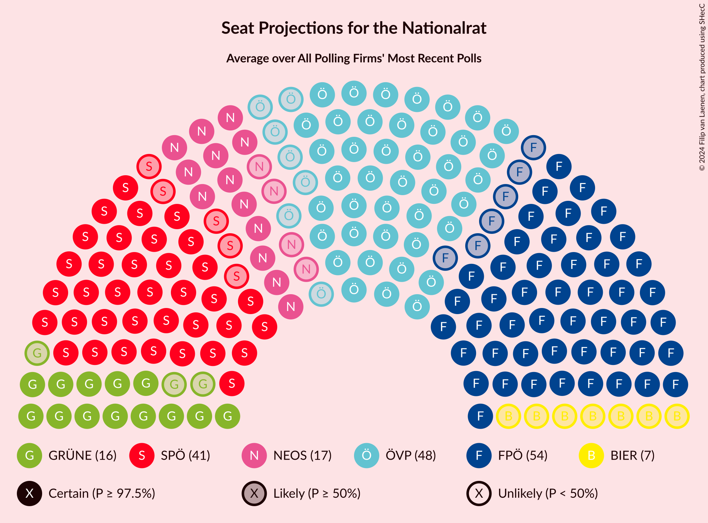

# Overview

The table below lists the most recent polls (less than 90 days old) registered and analyzed so far.

| Period     | Polling firm/Commissioner(s) | ÖVP | SPÖ | FPÖ | GRÜNE | NEOS | JETZT | G!LT |
|:----------:|:----------------------------:|:--:|:--:|:--:|:--:|:--:|:--:|:--:|
| 29 September 2019 | General Election | 37.5%   71 | 21.2%   40 | 16.2%   31 | 13.9%   26 | 8.1%   15 | 1.9%   0 | 0.0%   0 |
| N/A | [Poll Average](average.html) | 41–48%   76–90 | 14–19%   26–36 | 10–16%   19–30 | 14–20%   26–38 | 6–10%   10–18 | N/A   N/A | N/A   N/A |
| [9–12 June 2020](2020-06-12-UniqueResearch.html) | Unique Research   profil | 41–47%   76–88 | 15–20%   27–36 | 12–17%   22–30 | 14–19%   25–34 | 6–10%   11–18 | N/A   N/A | N/A   N/A |
| [18–19 May 2020](2020-05-19-Market.html) | Market   Der Standard | N/A   N/A | N/A   N/A | N/A   N/A | N/A   N/A | N/A   N/A | N/A   N/A | N/A   N/A |
| [31 March–2 April 2020](2020-04-02-OGM.html) | OGM | 42–48%   78–91 | 14–19%   25–35 | 10–14%   18–27 | 15–21%   29–39 | 5–9%   10–16 | N/A   N/A | N/A   N/A |
| 29 September 2019 | General Election | 37.5%   71 | 21.2%   40 | 16.2%   31 | 13.9%   26 | 8.1%   15 | 1.9%   0 | 0.0%   0 |

Only polls for which at least the sample size has been published are included in the table above.

**Legend:**
+ **Top half of each row:** Voting intentions (95% confidence interval)
+ **Bottom half of each row:** Seat projections for the Nationalrat (95% confidence interval)
+ **ÖVP:** Österreichische Volkspartei
+ **SPÖ:** Sozialdemokratische Partei Österreichs
+ **FPÖ:** Freiheitliche Partei Österreichs
+ **GRÜNE:** Die Grünen–Die Grüne Alternative
+ **NEOS:** NEOS–Das Neue Österreich und Liberales Forum
+ **JETZT:** JETZT–Liste Pilz
+ **G!LT:** Meine Stimme G!LT
+ **N/A (single party):** Party not included the published results
+ **N/A (entire row):** Calculation for this opinion poll not started yet

