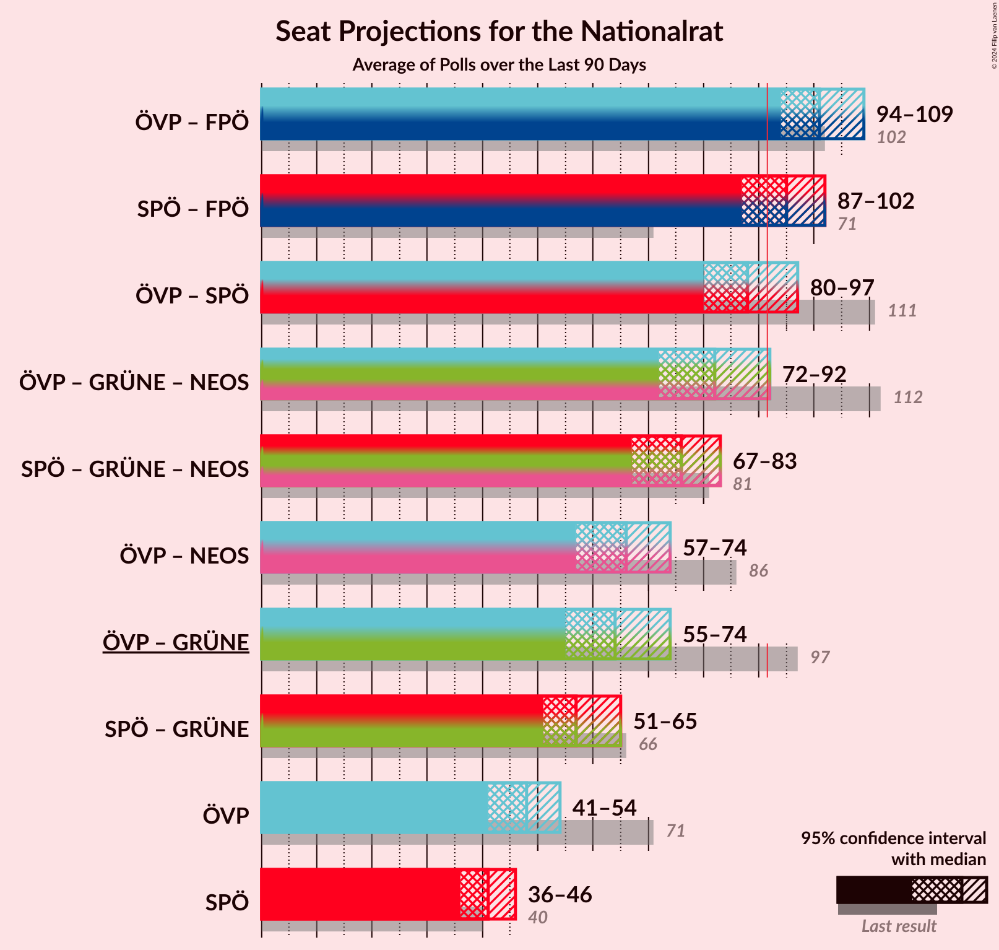

# Overview

The table below lists the most recent polls (less than 90 days old) registered and analyzed so far.

| Period     | Polling firm/Commissioner(s) | ÖVP | SPÖ | FPÖ | GRÜNE | NEOS | JETZT | G!LT | HC |
|:----------:|:----------------------------:|:--:|:--:|:--:|:--:|:--:|:--:|:--:|:--:|
| 29 September 2019 | General Election | 37.5%   71 | 21.2%   40 | 16.2%   31 | 13.9%   26 | 8.1%   15 | 1.9%   0 | 0.0%   0 | 0.0%   0 |
| N/A | [Poll Average](average.html) | 27–38%   50–70 | 20–30%   37–57 | 14–22%   25–41 | 8–14%   15–25 | 9–15%   17–27 | N/A   N/A | N/A   N/A | N/A   N/A |
| [24–30 May 2021](2021-05-30-Market.html) | Market | 26–32%   49–60 | 25–31%   47–58 | 18–23%   33–42 | 8–12%   15–22 | 9–13%   17–24 | N/A   N/A | N/A   N/A | N/A   N/A |
| [25–27 May 2021](2021-05-27-ResearchAffairs.html) | Research Affairs   ÖSTERREICH | 30–38%   55–72 | 20–27%   36–50 | 13–19%   24–36 | 9–14%   15–26 | 9–15%   17–28 | N/A   N/A | N/A   N/A | N/A   N/A |
| [14 May 2021](2021-05-14-DemoxResearch.html) | Demox Research | N/A   N/A | N/A   N/A | N/A   N/A | N/A   N/A | N/A   N/A | N/A   N/A | N/A   N/A | N/A   N/A |
| [10–12 May 2021](2021-05-12-UniqueResearch.html) | Unique Research   profil | N/A   N/A | N/A   N/A | N/A   N/A | N/A   N/A | N/A   N/A | N/A   N/A | N/A   N/A | N/A   N/A |
| [26–29 April 2021](2021-04-29-PeterHajek.html) | Peter Hajek   APA and ATV | N/A   N/A | N/A   N/A | N/A   N/A | N/A   N/A | N/A   N/A | N/A   N/A | N/A   N/A | N/A   N/A |
| 29 September 2019 | General Election | 37.5%   71 | 21.2%   40 | 16.2%   31 | 13.9%   26 | 8.1%   15 | 1.9%   0 | 0.0%   0 | 0.0%   0 |

Only polls for which at least the sample size has been published are included in the table above.

**Legend:**
+ **Top half of each row:** Voting intentions (95% confidence interval)
+ **Bottom half of each row:** Seat projections for the Nationalrat (95% confidence interval)
+ **ÖVP:** Österreichische Volkspartei
+ **SPÖ:** Sozialdemokratische Partei Österreichs
+ **FPÖ:** Freiheitliche Partei Österreichs
+ **GRÜNE:** Die Grünen–Die Grüne Alternative
+ **NEOS:** NEOS–Das Neue Österreich und Liberales Forum
+ **JETZT:** JETZT–Liste Pilz
+ **G!LT:** Meine Stimme G!LT
+ **HC:** Team HC Strache–Allianz für Österreich
+ **N/A (single party):** Party not included the published results
+ **N/A (entire row):** Calculation for this opinion poll not started yet

