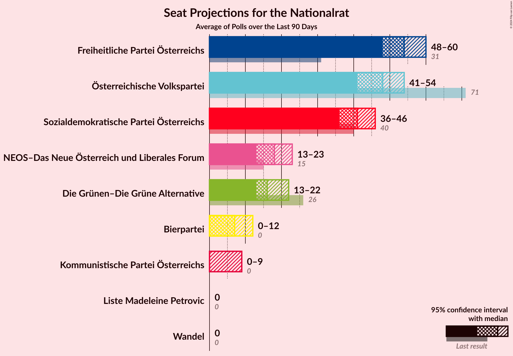

# Overview

The table below lists the most recent polls (less than 90 days old) registered and analyzed so far.

| Period     | Polling firm/Commissioner(s) | ÖVP | SPÖ | FPÖ | GRÜNE | NEOS | JETZT | G!LT | HC |
|:----------:|:----------------------------:|:--:|:--:|:--:|:--:|:--:|:--:|:--:|:--:|
| 29 September 2019 | General Election | 37.5%   71 | 21.2%   40 | 16.2%   31 | 13.9%   26 | 8.1%   15 | 1.9%   0 | 0.0%   0 | 0.0%   0 |
| N/A | [Poll Average](average.html) | 19–25%   34–48 | 25–31%   46–58 | 20–27%   39–53 | 9–13%   16–24 | 8–12%   15–23 | N/A   N/A | N/A   N/A | N/A   N/A |
| [26–28 October 2022](2022-10-28-IFDD.html) | IFDD   PULS 24 | 18–22%   33–41 | 25–30%   45–54 | 23–28%   42–51 | 9–13%   17–23 | 9–13%   17–24 | N/A   N/A | N/A   N/A | N/A   N/A |
| [17–25 October 2022](2022-10-25-Market.html) | Market   ÖSTERREICH | 19–23%   37–44 | 24–28%   46–54 | 24–28%   47–54 | 10–12%   18–24 | 10–12%   18–24 | N/A   N/A | N/A   N/A | N/A   N/A |
| [10–13 October 2022](2022-10-13-UniqueResearch.html) | Unique Research   profil | 20–26%   38–50 | 25–31%   48–59 | 21–27%   40–52 | 9–13%   17–25 | 8–12%   15–23 | N/A   N/A | N/A   N/A | N/A   N/A |
| [4–6 October 2022](2022-10-06-INSA.html) | INSA   eXXpress | 20–25%   37–47 | 25–31%   48–59 | 20–26%   39–49 | 8–12%   15–22 | 7–11%   14–20 | N/A   N/A | N/A   N/A | N/A   N/A |
| [23–28 September 2022](2022-09-28-OGM.html) | OGM   KURIER | 20–25%   37–47 | 25–31%   48–59 | 20–25%   37–47 | 8–12%   15–22 | 8–12%   16–22 | N/A   N/A | N/A   N/A | N/A   N/A |
| 29 September 2019 | General Election | 37.5%   71 | 21.2%   40 | 16.2%   31 | 13.9%   26 | 8.1%   15 | 1.9%   0 | 0.0%   0 | 0.0%   0 |

Only polls for which at least the sample size has been published are included in the table above.

**Legend:**
+ **Top half of each row:** Voting intentions (95% confidence interval)
+ **Bottom half of each row:** Seat projections for the Nationalrat (95% confidence interval)
+ **ÖVP:** Österreichische Volkspartei
+ **SPÖ:** Sozialdemokratische Partei Österreichs
+ **FPÖ:** Freiheitliche Partei Österreichs
+ **GRÜNE:** Die Grünen–Die Grüne Alternative
+ **NEOS:** NEOS–Das Neue Österreich und Liberales Forum
+ **JETZT:** JETZT–Liste Pilz
+ **G!LT:** Meine Stimme G!LT
+ **HC:** Team HC Strache–Allianz für Österreich
+ **N/A (single party):** Party not included the published results
+ **N/A (entire row):** Calculation for this opinion poll not started yet

