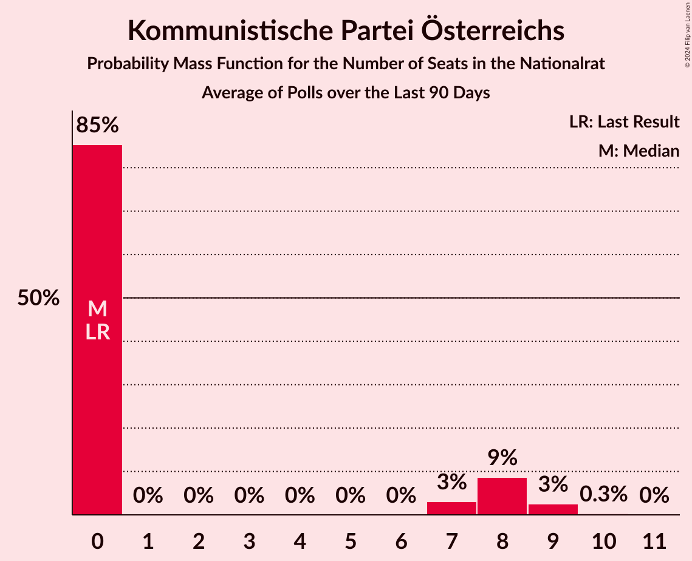

# Kommunistische Partei Österreichs

<a href="#voting-intentions">Voting Intentions</a> | <a href="#seats">Seats</a>

## Voting Intentions

Last result: **0.7%** (General Election of 29 September 2019)

### Confidence Intervals

| Period     | Polling firm/Commissioner(s) | Median | 80% Confidence Interval | 90% Confidence Interval | 95% Confidence Interval | 99% Confidence Interval |
|:----------:|:----------------:|:-----------:|:-----------------------:|:-----------------------:|:-----------------------:|:-----------------------:|
| N/A | [Poll Average](average.html) | 4.1% | 3.0–5.3% | 2.8–5.7% | 2.6–6.0% | 2.2–6.7% |
| [12–15 October 2021](2021-10-15-OGM.html) | OGM   KURIER | 0.0% | N/A | N/A | N/A | N/A |
| [11–12 October 2021](2021-10-12-Market.html) | Market   Der Standard | 0.0% | N/A | N/A | N/A | N/A |
| [7–11 October 2021](2021-10-11-IFDD.html) | IFDD | 0.0% | N/A | N/A | N/A | N/A |
| [28–30 September 2021](2021-09-30-ResearchAffairs.html) | Research Affairs   ÖSTERREICH | 4.0% | 3.0–5.3% | 2.8–5.7% | 2.6–6.0% | 2.2–6.8% |
| [7–9 September 2021](2021-09-09-OGM.html) | OGM   KURIER | 0.0% | N/A | N/A | N/A | N/A |
| [30 August–1 September 2021](2021-09-01-ResearchAffairs.html) | Research Affairs   ÖSTERREICH | 0.0% | N/A | N/A | N/A | N/A |
| [24–26 August 2021](2021-08-26-ResearchAffairs.html) | Research Affairs   ÖSTERREICH | 0.0% | N/A | N/A | N/A | N/A |
| [17–19 August 2021](2021-08-19-ResearchAffairs.html) | Research Affairs   ÖSTERREICH | 0.0% | N/A | N/A | N/A | N/A |
| [10–12 August 2021](2021-08-12-ResearchAffairs.html) | Research Affairs   ÖSTERREICH | 0.0% | N/A | N/A | N/A | N/A |
| [6–11 August 2021](2021-08-11-Market.html) | Market   Der Standard | 0.0% | N/A | N/A | N/A | N/A |
| [2–5 August 2021](2021-08-05-UniqueResearch.html) | Unique Research   profil | 0.0% | N/A | N/A | N/A | N/A |
| [3–5 August 2021](2021-08-05-ResearchAffairs.html) | Research Affairs   ÖSTERREICH | 0.0% | N/A | N/A | N/A | N/A |
| [27–29 July 2021](2021-07-29-ResearchAffairs.html) | Research Affairs   ÖSTERREICH | 0.0% | N/A | N/A | N/A | N/A |
| [20–22 July 2021](2021-07-22-ResearchAffairs.html) | Research Affairs   ÖSTERREICH | 0.0% | N/A | N/A | N/A | N/A |
| [15–21 July 2021](2021-07-21-IFDD.html) | IFDD   PULS 24 | 0.0% | N/A | N/A | N/A | N/A |
| [13–15 July 2021](2021-07-15-ResearchAffairs.html) | Research Affairs   PULS | 0.0% | N/A | N/A | N/A | N/A |
| [5–8 July 2021](2021-07-08-UniqueResearch.html) | Unique Research   profil | 0.0% | N/A | N/A | N/A | N/A |
| [5–8 July 2021](2021-07-08-ResearchAffairs.html) | Research Affairs   ÖSTERREICH | 0.0% | N/A | N/A | N/A | N/A |
| [28 June–2 July 2021](2021-07-02-IFDD.html) | IFDD   PULS 24 | 0.0% | N/A | N/A | N/A | N/A |
| [28 June–1 July 2021](2021-07-01-UniqueResearch.html) | Unique Research   Heute | 0.0% | N/A | N/A | N/A | N/A |
| [28 June–1 July 2021](2021-07-01-ResearchAffairs.html) | Research Affairs   ÖSTERREICH | 0.0% | N/A | N/A | N/A | N/A |
| [29–30 June 2021](2021-06-30-Market.html) | Market   Der Standard | 0.0% | N/A | N/A | N/A | N/A |
| [22–24 June 2021](2021-06-24-ResearchAffairs.html) | Research Affairs   ÖSTERREICH | 0.0% | N/A | N/A | N/A | N/A |
| [21–24 June 2021](2021-06-24-PeterHajek.html) | Peter Hajek | 0.0% | N/A | N/A | N/A | N/A |
| [22–24 June 2021](2021-06-24-OGM.html) | OGM   KURIER | 0.0% | N/A | N/A | N/A | N/A |
| [15–17 June 2021](2021-06-17-ResearchAffairs.html) | Research Affairs   ÖSTERREICH | 0.0% | N/A | N/A | N/A | N/A |
| [10–15 June 2021](2021-06-15-IFDD.html) | IFDD   PULS 24 | 0.0% | N/A | N/A | N/A | N/A |
| [7–10 June 2021](2021-06-10-UniqueResearch.html) | Unique Research   profil | 0.0% | N/A | N/A | N/A | N/A |
| [8–10 June 2021](2021-06-10-ResearchAffairs.html) | Research Affairs   ÖSTERREICH | 0.0% | N/A | N/A | N/A | N/A |
| [8–10 June 2021](2021-06-10-Market.html) | Market   Der Standard | 0.0% | N/A | N/A | N/A | N/A |
| [31 May–2 June 2021](2021-06-02-ResearchAffairs.html) | Research Affairs   ÖSTERREICH | 0.0% | N/A | N/A | N/A | N/A |
| [24–30 May 2021](2021-05-30-Market.html) | Market | 0.0% | N/A | N/A | N/A | N/A |
| [25–27 May 2021](2021-05-27-ResearchAffairs.html) | Research Affairs   ÖSTERREICH | 0.0% | N/A | N/A | N/A | N/A |
| [18–20 May 2021](2021-05-20-ResearchAffairs.html) | Research Affairs   ÖSTERREICH | 0.0% | N/A | N/A | N/A | N/A |
| [14 May 2021](2021-05-14-DemoxResearch.html) | Demox Research | 0.0% | N/A | N/A | N/A | N/A |
| [11–13 May 2021](2021-05-13-ResearchAffairs.html) | Research Affairs   ÖSTERREICH | 0.0% | N/A | N/A | N/A | N/A |
| [10–12 May 2021](2021-05-12-UniqueResearch.html) | Unique Research   profil | 0.0% | N/A | N/A | N/A | N/A |
| [4–6 May 2021](2021-05-06-ResearchAffairs.html) | Research Affairs   ÖSTERREICH | 0.0% | N/A | N/A | N/A | N/A |
| [27–29 April 2021](2021-04-29-ResearchAffairs.html) | Research Affairs   ÖSTERREICH | 0.0% | N/A | N/A | N/A | N/A |
| [26–29 April 2021](2021-04-29-PeterHajek.html) | Peter Hajek   APA and ATV | 0.0% | N/A | N/A | N/A | N/A |
| [20–22 April 2021](2021-04-22-ResearchAffairs.html) | Research Affairs   ÖSTERREICH | 0.0% | N/A | N/A | N/A | N/A |
| [5–8 April 2021](2021-04-08-UniqueResearch.html) | Unique Research   profil | 0.0% | N/A | N/A | N/A | N/A |
| [30 March–1 April 2021](2021-04-01-ResearchAffairs.html) | Research Affairs   ÖSTERREICH | 0.0% | N/A | N/A | N/A | N/A |
| [30 March–1 April 2021](2021-04-01-OGM.html) | OGM   KURIER | 0.0% | N/A | N/A | N/A | N/A |
| [26–30 March 2021](2021-03-30-Market.html) | Market   Der Standard | 0.0% | N/A | N/A | N/A | N/A |
| [23–25 March 2021](2021-03-25-UniqueResearch.html) | Unique Research   Heute | 0.0% | N/A | N/A | N/A | N/A |
| [23–25 March 2021](2021-03-25-ResearchAffairs.html) | Research Affairs   ÖSTERREICH | 0.0% | N/A | N/A | N/A | N/A |
| [15–17 March 2021](2021-03-17-ResearchAffairs.html) | Research Affairs   ÖSTERREICH | 0.0% | N/A | N/A | N/A | N/A |
| [8–11 March 2021](2021-03-11-PeterHajek.html) | Peter Hajek   APA and ATV | 0.0% | N/A | N/A | N/A | N/A |
| [1–4 March 2021](2021-03-04-UniqueResearch.html) | Unique Research   profil | 0.0% | N/A | N/A | N/A | N/A |
| [2–4 March 2021](2021-03-04-ResearchAffairs.html) | Research Affairs   ÖSTERREICH | 0.0% | N/A | N/A | N/A | N/A |
| [15–18 February 2021](2021-02-18-ResearchAffairs.html) | Research Affairs   ÖSTERREICH | 0.0% | N/A | N/A | N/A | N/A |
| [15–17 February 2021](2021-02-17-Market.html) | Market   Der Standard | 0.0% | N/A | N/A | N/A | N/A |
| [8–11 February 2021](2021-02-11-UniqueResearch.html) | Unique Research   profil | 0.0% | N/A | N/A | N/A | N/A |
| [8–11 February 2021](2021-02-11-ResearchAffairs.html) | Research Affairs   ÖSTERREICH | 0.0% | N/A | N/A | N/A | N/A |
| [1–4 February 2021](2021-02-04-ResearchAffairs.html) | Research Affairs   ÖSTERREICH | 0.0% | N/A | N/A | N/A | N/A |
| [25 January–1 February 2021](2021-02-01-IFDD.html) | IFDD   Kronen Zeitung | 0.0% | N/A | N/A | N/A | N/A |
| [11–14 January 2021](2021-01-14-UniqueResearch.html) | Unique Research   profil | 0.0% | N/A | N/A | N/A | N/A |
| [4–7 January 2021](2021-01-07-ResearchAffairs.html) | Research Affairs   ÖSTERREICH | 0.0% | N/A | N/A | N/A | N/A |
| [17–21 December 2020](2020-12-21-Market.html) | Market   Der Standard | 0.0% | N/A | N/A | N/A | N/A |
| [15–17 December 2020](2020-12-17-OGM.html) | OGM   KURIER | 0.0% | N/A | N/A | N/A | N/A |
| [8–12 December 2020](2020-12-12-PeterHajek.html) | Peter Hajek   APA and ATV | 0.0% | N/A | N/A | N/A | N/A |
| [5 December 2020](2020-12-05-UniqueResearch.html) | Unique Research   profil | 0.0% | N/A | N/A | N/A | N/A |
| [30 November–3 December 2020](2020-12-03-ResearchAffairs.html) | Research Affairs   ÖSTERREICH | 0.0% | N/A | N/A | N/A | N/A |
| [30 November–2 December 2020](2020-12-02-Market.html) | Market   Der Standard | 0.0% | N/A | N/A | N/A | N/A |
| [17–19 November 2020](2020-11-19-ResearchAffairs.html) | Research Affairs   ÖSTERREICH | 0.0% | N/A | N/A | N/A | N/A |
| [9–12 November 2020](2020-11-12-ResearchAffairs.html) | Research Affairs   ÖSTERREICH | 0.0% | N/A | N/A | N/A | N/A |
| [5–7 November 2020](2020-11-07-ResearchAffairs.html) | Research Affairs   ÖSTERREICH | 0.0% | N/A | N/A | N/A | N/A |
| [2–6 November 2020](2020-11-06-UniqueResearch.html) | Unique Research | 0.0% | N/A | N/A | N/A | N/A |
| [27–29 October 2020](2020-10-29-ResearchAffairs.html) | Research Affairs | 0.0% | N/A | N/A | N/A | N/A |
| [20–22 October 2020](2020-10-22-ResearchAffairs.html) | Research Affairs | 0.0% | N/A | N/A | N/A | N/A |
| [20–22 October 2020](2020-10-22-OGM.html) | OGM | 0.0% | N/A | N/A | N/A | N/A |
| [12–16 October 2020](2020-10-16-UniqueResearch.html) | Unique Research | 0.0% | N/A | N/A | N/A | N/A |
| [6–8 October 2020](2020-10-08-ResearchAffairs.html) | Research Affairs | 0.0% | N/A | N/A | N/A | N/A |
| [28–30 September 2020](2020-09-30-ResearchAffairs.html) | Research Affairs | 0.0% | N/A | N/A | N/A | N/A |
| [21–24 September 2020](2020-09-24-ResearchAffairs.html) | Research Affairs | 0.0% | N/A | N/A | N/A | N/A |
| [14–18 September 2020](2020-09-18-UniqueResearch.html) | Unique Research | 0.0% | N/A | N/A | N/A | N/A |
| [14–16 September 2020](2020-09-16-ResearchAffairs.html) | Research Affairs | 0.0% | N/A | N/A | N/A | N/A |
| [25–27 August 2020](2020-08-27-ResearchAffairs.html) | Research Affairs   ÖSTERREICH | 0.0% | N/A | N/A | N/A | N/A |
| [17–20 August 2020](2020-08-20-ResearchAffairs.html) | Research Affairs   ÖSTERREICH | 0.0% | N/A | N/A | N/A | N/A |
| [10–13 August 2020](2020-08-13-UniqueResearch.html) | Unique Research   profil | 0.0% | N/A | N/A | N/A | N/A |
| [20–22 July 2020](2020-07-22-ResearchAffairs.html) | Research Affairs   ÖSTERREICH | 0.0% | N/A | N/A | N/A | N/A |
| [13–16 July 2020](2020-07-16-UniqueResearch.html) | Unique Research   profil | 0.0% | N/A | N/A | N/A | N/A |
| [6–9 July 2020](2020-07-09-ResearchAffairs.html) | Research Affairs   ÖSTERREICH | 0.0% | N/A | N/A | N/A | N/A |
| [23–25 June 2020](2020-06-25-OGM.html) | OGM | 0.0% | N/A | N/A | N/A | N/A |
| [9–12 June 2020](2020-06-12-UniqueResearch.html) | Unique Research   profil | 0.0% | N/A | N/A | N/A | N/A |
| [5–10 June 2020](2020-06-10-ResearchAffairs.html) | Research Affairs   ÖSTERREICH | 0.0% | N/A | N/A | N/A | N/A |
| [5–9 June 2020](2020-06-09-KarmasinResearchIdentity.html) | Karmasin Research & Identity | 0.0% | N/A | N/A | N/A | N/A |
| [25–28 May 2020](2020-05-28-ResearchAffairs.html) | Research Affairs   ÖSTERREICH | 0.0% | N/A | N/A | N/A | N/A |
| [21–26 May 2020](2020-05-26-Market.html) | Market   Der Standard | 0.0% | N/A | N/A | N/A | N/A |
| [18–19 May 2020](2020-05-19-Market.html) | Market   Der Standard | 0.0% | N/A | N/A | N/A | N/A |
| [11–14 May 2020](2020-05-14-UniqueResearch.html) | Unique Research   profil | 0.0% | N/A | N/A | N/A | N/A |
| [11–13 May 2020](2020-05-13-Market.html) | Market   Der Standard | 0.0% | N/A | N/A | N/A | N/A |
| [20–22 April 2020](2020-04-22-Market.html) | Market | 0.0% | N/A | N/A | N/A | N/A |
| [13–16 April 2020](2020-04-16-UniqueResearch.html) | Unique Research   profil | 0.0% | N/A | N/A | N/A | N/A |
| [3–7 April 2020](2020-04-07-Market.html) | Market   Der Standard | 0.0% | N/A | N/A | N/A | N/A |
| [31 March–2 April 2020](2020-04-02-OGM.html) | OGM | 0.0% | N/A | N/A | N/A | N/A |
| [24–31 March 2020](2020-03-31-Market.html) | Market   Der Standard | 0.0% | N/A | N/A | N/A | N/A |
| [9–13 March 2020](2020-03-13-UniqueResearch.html) | Unique Research | 0.0% | N/A | N/A | N/A | N/A |
| [11–12 March 2020](2020-03-12-Market.html) | Market   Der Standard | 0.0% | N/A | N/A | N/A | N/A |
| [5–11 March 2020](2020-03-11-ResearchAffairs.html) | Research Affairs   ÖSTERREICH | 0.0% | N/A | N/A | N/A | N/A |
| [24–27 February 2020](2020-02-27-ResearchAffairs.html) | Research Affairs   ÖSTERREICH | 0.0% | N/A | N/A | N/A | N/A |
| [10–14 February 2020](2020-02-14-UniqueResearch.html) | Unique Research   profil | 0.0% | N/A | N/A | N/A | N/A |
| [7–12 February 2020](2020-02-12-ResearchAffairs.html) | Research Affairs | 0.0% | N/A | N/A | N/A | N/A |
| [4–6 February 2020](2020-02-06-Market.html) | Market | 0.0% | N/A | N/A | N/A | N/A |
| [28–31 January 2020](2020-01-31-ResearchAffairs.html) | Research Affairs   ÖSTERREICH | 0.0% | N/A | N/A | N/A | N/A |
| [17–23 January 2020](2020-01-23-ResearchAffairs.html) | Research Affairs | 0.0% | N/A | N/A | N/A | N/A |
| [10–16 January 2020](2020-01-16-ResearchAffairs.html) | Research Affairs   ÖSTERREICH | 0.0% | N/A | N/A | N/A | N/A |
| [10–15 January 2020](2020-01-15-KarmasinResearchIdentity.html) | Karmasin Research & Identity | 0.0% | N/A | N/A | N/A | N/A |
| [6–10 January 2020](2020-01-10-UniqueResearch.html) | Unique Research   profil | 0.0% | N/A | N/A | N/A | N/A |
| [3–9 January 2020](2020-01-09-ResearchAffairs.html) | Research Affairs   ÖSTERREICH | 0.0% | N/A | N/A | N/A | N/A |
| [12–19 December 2019](2019-12-19-ResearchAffairs.html) | Research Affairs   ÖSTERREICH | 0.0% | N/A | N/A | N/A | N/A |
| [16–19 December 2019](2019-12-19-Market.html) | Market   Der Standard | 0.0% | N/A | N/A | N/A | N/A |
| [9–13 December 2019](2019-12-13-UniqueResearch.html) | Unique Research   profil | 0.0% | N/A | N/A | N/A | N/A |
| [6–12 December 2019](2019-12-12-ResearchAffairs.html) | Research Affairs   ÖSTERREICH | 0.0% | N/A | N/A | N/A | N/A |
| [29 November–5 December 2019](2019-12-05-ResearchAffairs.html) | Research Affairs   ÖSTERREICH | 0.0% | N/A | N/A | N/A | N/A |
| [29 November–4 December 2019](2019-12-04-Market.html) | Market   Der Standard | 0.0% | N/A | N/A | N/A | N/A |
| [22–28 November 2019](2019-11-28-ResearchAffairs.html) | Research Affairs   ÖSTERREICH | 0.0% | N/A | N/A | N/A | N/A |
| [15–21 November 2019](2019-11-21-ResearchAffairs.html) | Research Affairs   ÖSTERREICH | 0.0% | N/A | N/A | N/A | N/A |
| [11–15 November 2019](2019-11-15-UniqueResearch.html) | Unique Research   profil | 0.0% | N/A | N/A | N/A | N/A |
| [8–14 November 2019](2019-11-14-ResearchAffairs.html) | Research Affairs   ÖSTERREICH | 0.0% | N/A | N/A | N/A | N/A |
| [8–13 November 2019](2019-11-13-KarmasinResearchIdentity.html) | Karmasin Research & Identity | 0.0% | N/A | N/A | N/A | N/A |
| [2–7 November 2019](2019-11-07-ResearchAffairs.html) | Research Affairs   ÖSTERREICH | 0.0% | N/A | N/A | N/A | N/A |
| [26–31 October 2019](2019-10-31-ResearchAffairs.html) | Research Affairs   ÖSTERREICH | 0.0% | N/A | N/A | N/A | N/A |
| [22–25 October 2019](2019-10-25-ResearchAffairs.html) | Research Affairs   ÖSTERREICH | 0.0% | N/A | N/A | N/A | N/A |
| [14–19 October 2019](2019-10-19-Market.html) | Market   Der Standard | 0.0% | N/A | N/A | N/A | N/A |
| [15–17 October 2019](2019-10-17-Market.html) | Market   Der Standard | 0.0% | N/A | N/A | N/A | N/A |
| [10–16 October 2019](2019-10-16-ResearchAffairs.html) | Research Affairs   ÖSTERREICH | 0.0% | N/A | N/A | N/A | N/A |
| [7–11 October 2019](2019-10-11-UniqueResearch.html) | Unique Research   profil | 0.0% | N/A | N/A | N/A | N/A |

### Probability Mass Function

The following table shows the probability mass function per percentage block of voting intentions for the [poll average](average.html) for Kommunistische Partei Österreichs.

| Voting Intentions | Probability | Accumulated | Special Marks |
|:-----------------:|:-----------:|:-----------:|:-------------:|
| 0.5–1.5% | 0% | 100% | Last Result |
| 1.5–2.5% | 2% | 100% |  |
| 2.5–3.5% | 24% | 98% |  |
| 3.5–4.5% | 44% | 73% | Median |
| 4.5–5.5% | 23% | 30% |  |
| 5.5–6.5% | 6% | 6% |  |
| 6.5–7.5% | 0.7% | 0.8% |  |
| 7.5–8.5% | 0.1% | 0.1% |  |
| 8.5–9.5% | 0% | 0% |  |

## Seats

Last result: **0** seats (General Election of 29 September 2019)

### Confidence Intervals

| Period     | Polling firm/Commissioner(s) | Median | 80% Confidence Interval | 90% Confidence Interval | 95% Confidence Interval | 99% Confidence Interval |
|:----------:|:----------------:|:------:|:-----------------------:|:-----------------------:|:-----------------------:|:-----------------------:|
| N/A | [Poll Average](average.html) | 7 | 0–9 | 0–10 | 0–11 | 0–12 |
| [12–15 October 2021](2021-10-15-OGM.html) | OGM   KURIER |  |  |  |  |  |
| [11–12 October 2021](2021-10-12-Market.html) | Market   Der Standard |  |  |  |  |  |
| [7–11 October 2021](2021-10-11-IFDD.html) | IFDD |  |  |  |  |  |
| [28–30 September 2021](2021-09-30-ResearchAffairs.html) | Research Affairs   ÖSTERREICH | 7 | 0–9 | 0–10 | 0–11 | 0–12 |
| [7–9 September 2021](2021-09-09-OGM.html) | OGM   KURIER |  |  |  |  |  |
| [30 August–1 September 2021](2021-09-01-ResearchAffairs.html) | Research Affairs   ÖSTERREICH |  |  |  |  |  |
| [24–26 August 2021](2021-08-26-ResearchAffairs.html) | Research Affairs   ÖSTERREICH |  |  |  |  |  |
| [17–19 August 2021](2021-08-19-ResearchAffairs.html) | Research Affairs   ÖSTERREICH |  |  |  |  |  |
| [10–12 August 2021](2021-08-12-ResearchAffairs.html) | Research Affairs   ÖSTERREICH |  |  |  |  |  |
| [6–11 August 2021](2021-08-11-Market.html) | Market   Der Standard |  |  |  |  |  |
| [2–5 August 2021](2021-08-05-UniqueResearch.html) | Unique Research   profil |  |  |  |  |  |
| [3–5 August 2021](2021-08-05-ResearchAffairs.html) | Research Affairs   ÖSTERREICH |  |  |  |  |  |
| [27–29 July 2021](2021-07-29-ResearchAffairs.html) | Research Affairs   ÖSTERREICH |  |  |  |  |  |
| [20–22 July 2021](2021-07-22-ResearchAffairs.html) | Research Affairs   ÖSTERREICH |  |  |  |  |  |
| [15–21 July 2021](2021-07-21-IFDD.html) | IFDD   PULS 24 |  |  |  |  |  |
| [13–15 July 2021](2021-07-15-ResearchAffairs.html) | Research Affairs   PULS |  |  |  |  |  |
| [5–8 July 2021](2021-07-08-UniqueResearch.html) | Unique Research   profil |  |  |  |  |  |
| [5–8 July 2021](2021-07-08-ResearchAffairs.html) | Research Affairs   ÖSTERREICH |  |  |  |  |  |
| [28 June–2 July 2021](2021-07-02-IFDD.html) | IFDD   PULS 24 |  |  |  |  |  |
| [28 June–1 July 2021](2021-07-01-UniqueResearch.html) | Unique Research   Heute |  |  |  |  |  |
| [28 June–1 July 2021](2021-07-01-ResearchAffairs.html) | Research Affairs   ÖSTERREICH |  |  |  |  |  |
| [29–30 June 2021](2021-06-30-Market.html) | Market   Der Standard |  |  |  |  |  |
| [22–24 June 2021](2021-06-24-ResearchAffairs.html) | Research Affairs   ÖSTERREICH |  |  |  |  |  |
| [21–24 June 2021](2021-06-24-PeterHajek.html) | Peter Hajek |  |  |  |  |  |
| [22–24 June 2021](2021-06-24-OGM.html) | OGM   KURIER |  |  |  |  |  |
| [15–17 June 2021](2021-06-17-ResearchAffairs.html) | Research Affairs   ÖSTERREICH |  |  |  |  |  |
| [10–15 June 2021](2021-06-15-IFDD.html) | IFDD   PULS 24 |  |  |  |  |  |
| [7–10 June 2021](2021-06-10-UniqueResearch.html) | Unique Research   profil |  |  |  |  |  |
| [8–10 June 2021](2021-06-10-ResearchAffairs.html) | Research Affairs   ÖSTERREICH |  |  |  |  |  |
| [8–10 June 2021](2021-06-10-Market.html) | Market   Der Standard |  |  |  |  |  |
| [31 May–2 June 2021](2021-06-02-ResearchAffairs.html) | Research Affairs   ÖSTERREICH |  |  |  |  |  |
| [24–30 May 2021](2021-05-30-Market.html) | Market |  |  |  |  |  |
| [25–27 May 2021](2021-05-27-ResearchAffairs.html) | Research Affairs   ÖSTERREICH |  |  |  |  |  |
| [18–20 May 2021](2021-05-20-ResearchAffairs.html) | Research Affairs   ÖSTERREICH |  |  |  |  |  |
| [14 May 2021](2021-05-14-DemoxResearch.html) | Demox Research |  |  |  |  |  |
| [11–13 May 2021](2021-05-13-ResearchAffairs.html) | Research Affairs   ÖSTERREICH |  |  |  |  |  |
| [10–12 May 2021](2021-05-12-UniqueResearch.html) | Unique Research   profil |  |  |  |  |  |
| [4–6 May 2021](2021-05-06-ResearchAffairs.html) | Research Affairs   ÖSTERREICH |  |  |  |  |  |
| [27–29 April 2021](2021-04-29-ResearchAffairs.html) | Research Affairs   ÖSTERREICH |  |  |  |  |  |
| [26–29 April 2021](2021-04-29-PeterHajek.html) | Peter Hajek   APA and ATV |  |  |  |  |  |
| [20–22 April 2021](2021-04-22-ResearchAffairs.html) | Research Affairs   ÖSTERREICH |  |  |  |  |  |
| [5–8 April 2021](2021-04-08-UniqueResearch.html) | Unique Research   profil |  |  |  |  |  |
| [30 March–1 April 2021](2021-04-01-ResearchAffairs.html) | Research Affairs   ÖSTERREICH |  |  |  |  |  |
| [30 March–1 April 2021](2021-04-01-OGM.html) | OGM   KURIER |  |  |  |  |  |
| [26–30 March 2021](2021-03-30-Market.html) | Market   Der Standard |  |  |  |  |  |
| [23–25 March 2021](2021-03-25-UniqueResearch.html) | Unique Research   Heute |  |  |  |  |  |
| [23–25 March 2021](2021-03-25-ResearchAffairs.html) | Research Affairs   ÖSTERREICH |  |  |  |  |  |
| [15–17 March 2021](2021-03-17-ResearchAffairs.html) | Research Affairs   ÖSTERREICH |  |  |  |  |  |
| [8–11 March 2021](2021-03-11-PeterHajek.html) | Peter Hajek   APA and ATV |  |  |  |  |  |
| [1–4 March 2021](2021-03-04-UniqueResearch.html) | Unique Research   profil |  |  |  |  |  |
| [2–4 March 2021](2021-03-04-ResearchAffairs.html) | Research Affairs   ÖSTERREICH |  |  |  |  |  |
| [15–18 February 2021](2021-02-18-ResearchAffairs.html) | Research Affairs   ÖSTERREICH |  |  |  |  |  |
| [15–17 February 2021](2021-02-17-Market.html) | Market   Der Standard |  |  |  |  |  |
| [8–11 February 2021](2021-02-11-UniqueResearch.html) | Unique Research   profil |  |  |  |  |  |
| [8–11 February 2021](2021-02-11-ResearchAffairs.html) | Research Affairs   ÖSTERREICH |  |  |  |  |  |
| [1–4 February 2021](2021-02-04-ResearchAffairs.html) | Research Affairs   ÖSTERREICH |  |  |  |  |  |
| [25 January–1 February 2021](2021-02-01-IFDD.html) | IFDD   Kronen Zeitung |  |  |  |  |  |
| [11–14 January 2021](2021-01-14-UniqueResearch.html) | Unique Research   profil |  |  |  |  |  |
| [4–7 January 2021](2021-01-07-ResearchAffairs.html) | Research Affairs   ÖSTERREICH |  |  |  |  |  |
| [17–21 December 2020](2020-12-21-Market.html) | Market   Der Standard |  |  |  |  |  |
| [15–17 December 2020](2020-12-17-OGM.html) | OGM   KURIER |  |  |  |  |  |
| [8–12 December 2020](2020-12-12-PeterHajek.html) | Peter Hajek   APA and ATV |  |  |  |  |  |
| [5 December 2020](2020-12-05-UniqueResearch.html) | Unique Research   profil |  |  |  |  |  |
| [30 November–3 December 2020](2020-12-03-ResearchAffairs.html) | Research Affairs   ÖSTERREICH |  |  |  |  |  |
| [30 November–2 December 2020](2020-12-02-Market.html) | Market   Der Standard |  |  |  |  |  |
| [17–19 November 2020](2020-11-19-ResearchAffairs.html) | Research Affairs   ÖSTERREICH |  |  |  |  |  |
| [9–12 November 2020](2020-11-12-ResearchAffairs.html) | Research Affairs   ÖSTERREICH |  |  |  |  |  |
| [5–7 November 2020](2020-11-07-ResearchAffairs.html) | Research Affairs   ÖSTERREICH |  |  |  |  |  |
| [2–6 November 2020](2020-11-06-UniqueResearch.html) | Unique Research |  |  |  |  |  |
| [27–29 October 2020](2020-10-29-ResearchAffairs.html) | Research Affairs |  |  |  |  |  |
| [20–22 October 2020](2020-10-22-ResearchAffairs.html) | Research Affairs |  |  |  |  |  |
| [20–22 October 2020](2020-10-22-OGM.html) | OGM |  |  |  |  |  |
| [12–16 October 2020](2020-10-16-UniqueResearch.html) | Unique Research |  |  |  |  |  |
| [6–8 October 2020](2020-10-08-ResearchAffairs.html) | Research Affairs |  |  |  |  |  |
| [28–30 September 2020](2020-09-30-ResearchAffairs.html) | Research Affairs |  |  |  |  |  |
| [21–24 September 2020](2020-09-24-ResearchAffairs.html) | Research Affairs |  |  |  |  |  |
| [14–18 September 2020](2020-09-18-UniqueResearch.html) | Unique Research |  |  |  |  |  |
| [14–16 September 2020](2020-09-16-ResearchAffairs.html) | Research Affairs |  |  |  |  |  |
| [25–27 August 2020](2020-08-27-ResearchAffairs.html) | Research Affairs   ÖSTERREICH |  |  |  |  |  |
| [17–20 August 2020](2020-08-20-ResearchAffairs.html) | Research Affairs   ÖSTERREICH |  |  |  |  |  |
| [10–13 August 2020](2020-08-13-UniqueResearch.html) | Unique Research   profil |  |  |  |  |  |
| [20–22 July 2020](2020-07-22-ResearchAffairs.html) | Research Affairs   ÖSTERREICH |  |  |  |  |  |
| [13–16 July 2020](2020-07-16-UniqueResearch.html) | Unique Research   profil |  |  |  |  |  |
| [6–9 July 2020](2020-07-09-ResearchAffairs.html) | Research Affairs   ÖSTERREICH |  |  |  |  |  |
| [23–25 June 2020](2020-06-25-OGM.html) | OGM |  |  |  |  |  |
| [9–12 June 2020](2020-06-12-UniqueResearch.html) | Unique Research   profil |  |  |  |  |  |
| [5–10 June 2020](2020-06-10-ResearchAffairs.html) | Research Affairs   ÖSTERREICH |  |  |  |  |  |
| [5–9 June 2020](2020-06-09-KarmasinResearchIdentity.html) | Karmasin Research & Identity |  |  |  |  |  |
| [25–28 May 2020](2020-05-28-ResearchAffairs.html) | Research Affairs   ÖSTERREICH |  |  |  |  |  |
| [21–26 May 2020](2020-05-26-Market.html) | Market   Der Standard |  |  |  |  |  |
| [18–19 May 2020](2020-05-19-Market.html) | Market   Der Standard |  |  |  |  |  |
| [11–14 May 2020](2020-05-14-UniqueResearch.html) | Unique Research   profil |  |  |  |  |  |
| [11–13 May 2020](2020-05-13-Market.html) | Market   Der Standard |  |  |  |  |  |
| [20–22 April 2020](2020-04-22-Market.html) | Market |  |  |  |  |  |
| [13–16 April 2020](2020-04-16-UniqueResearch.html) | Unique Research   profil |  |  |  |  |  |
| [3–7 April 2020](2020-04-07-Market.html) | Market   Der Standard |  |  |  |  |  |
| [31 March–2 April 2020](2020-04-02-OGM.html) | OGM |  |  |  |  |  |
| [24–31 March 2020](2020-03-31-Market.html) | Market   Der Standard |  |  |  |  |  |
| [9–13 March 2020](2020-03-13-UniqueResearch.html) | Unique Research |  |  |  |  |  |
| [11–12 March 2020](2020-03-12-Market.html) | Market   Der Standard |  |  |  |  |  |
| [5–11 March 2020](2020-03-11-ResearchAffairs.html) | Research Affairs   ÖSTERREICH |  |  |  |  |  |
| [24–27 February 2020](2020-02-27-ResearchAffairs.html) | Research Affairs   ÖSTERREICH |  |  |  |  |  |
| [10–14 February 2020](2020-02-14-UniqueResearch.html) | Unique Research   profil |  |  |  |  |  |
| [7–12 February 2020](2020-02-12-ResearchAffairs.html) | Research Affairs |  |  |  |  |  |
| [4–6 February 2020](2020-02-06-Market.html) | Market |  |  |  |  |  |
| [28–31 January 2020](2020-01-31-ResearchAffairs.html) | Research Affairs   ÖSTERREICH |  |  |  |  |  |
| [17–23 January 2020](2020-01-23-ResearchAffairs.html) | Research Affairs |  |  |  |  |  |
| [10–16 January 2020](2020-01-16-ResearchAffairs.html) | Research Affairs   ÖSTERREICH |  |  |  |  |  |
| [10–15 January 2020](2020-01-15-KarmasinResearchIdentity.html) | Karmasin Research & Identity |  |  |  |  |  |
| [6–10 January 2020](2020-01-10-UniqueResearch.html) | Unique Research   profil |  |  |  |  |  |
| [3–9 January 2020](2020-01-09-ResearchAffairs.html) | Research Affairs   ÖSTERREICH |  |  |  |  |  |
| [12–19 December 2019](2019-12-19-ResearchAffairs.html) | Research Affairs   ÖSTERREICH |  |  |  |  |  |
| [16–19 December 2019](2019-12-19-Market.html) | Market   Der Standard |  |  |  |  |  |
| [9–13 December 2019](2019-12-13-UniqueResearch.html) | Unique Research   profil |  |  |  |  |  |
| [6–12 December 2019](2019-12-12-ResearchAffairs.html) | Research Affairs   ÖSTERREICH |  |  |  |  |  |
| [29 November–5 December 2019](2019-12-05-ResearchAffairs.html) | Research Affairs   ÖSTERREICH |  |  |  |  |  |
| [29 November–4 December 2019](2019-12-04-Market.html) | Market   Der Standard |  |  |  |  |  |
| [22–28 November 2019](2019-11-28-ResearchAffairs.html) | Research Affairs   ÖSTERREICH |  |  |  |  |  |
| [15–21 November 2019](2019-11-21-ResearchAffairs.html) | Research Affairs   ÖSTERREICH |  |  |  |  |  |
| [11–15 November 2019](2019-11-15-UniqueResearch.html) | Unique Research   profil |  |  |  |  |  |
| [8–14 November 2019](2019-11-14-ResearchAffairs.html) | Research Affairs   ÖSTERREICH |  |  |  |  |  |
| [8–13 November 2019](2019-11-13-KarmasinResearchIdentity.html) | Karmasin Research & Identity |  |  |  |  |  |
| [2–7 November 2019](2019-11-07-ResearchAffairs.html) | Research Affairs   ÖSTERREICH |  |  |  |  |  |
| [26–31 October 2019](2019-10-31-ResearchAffairs.html) | Research Affairs   ÖSTERREICH |  |  |  |  |  |
| [22–25 October 2019](2019-10-25-ResearchAffairs.html) | Research Affairs   ÖSTERREICH |  |  |  |  |  |
| [14–19 October 2019](2019-10-19-Market.html) | Market   Der Standard |  |  |  |  |  |
| [15–17 October 2019](2019-10-17-Market.html) | Market   Der Standard |  |  |  |  |  |
| [10–16 October 2019](2019-10-16-ResearchAffairs.html) | Research Affairs   ÖSTERREICH |  |  |  |  |  |
| [7–11 October 2019](2019-10-11-UniqueResearch.html) | Unique Research   profil |  |  |  |  |  |

### Probability Mass Function

The following table shows the probability mass function per seat for the [poll average](average.html) for Kommunistische Partei Österreichs.

| Number of Seats | Probability | Accumulated | Special Marks |
|:---------------:|:-----------:|:-----------:|:-------------:|
| 0 | 48% | 100% | Last Result |
| 1 | 0% | 52% |  |
| 2 | 0% | 52% |  |
| 3 | 0% | 52% |  |
| 4 | 0% | 52% |  |
| 5 | 0% | 52% |  |
| 6 | 0% | 52% |  |
| 7 | 10% | 52% | Median |
| 8 | 20% | 42% |  |
| 9 | 13% | 22% |  |
| 10 | 6% | 9% |  |
| 11 | 2% | 3% |  |
| 12 | 0.9% | 1.2% |  |
| 13 | 0.2% | 0.3% |  |
| 14 | 0.1% | 0.1% |  |
| 15 | 0% | 0% |  |

