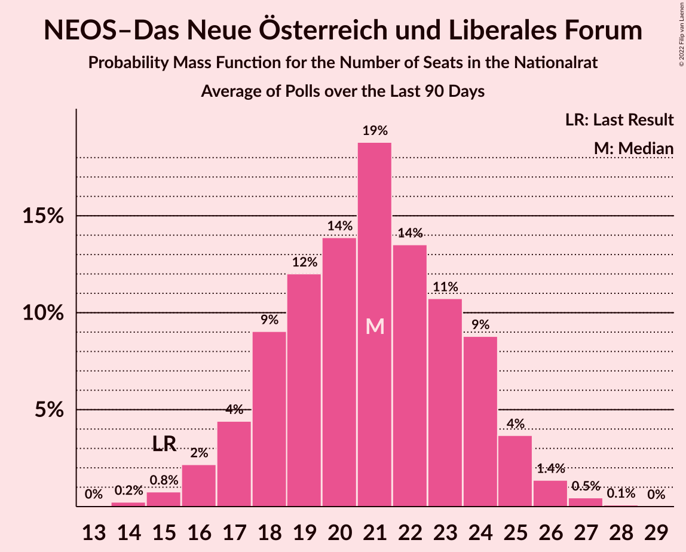

# NEOS–Das Neue Österreich und Liberales Forum

<a href="#voting-intentions">Voting Intentions</a> | <a href="#seats">Seats</a>

## Voting Intentions

Last result: **8.1%** (General Election of 29 September 2019)

### Confidence Intervals

| Period     | Polling firm/Commissioner(s) | Median | 80% Confidence Interval | 90% Confidence Interval | 95% Confidence Interval | 99% Confidence Interval |
|:----------:|:----------------:|:-----------:|:-----------------------:|:-----------------------:|:-----------------------:|:-----------------------:|
| N/A | [Poll Average](average.html) | 9.2% | 7.6–11.1% | 7.2–11.5% | 6.9–11.8% | 6.3–12.4% |
| [19–22 September 2024](2024-09-22-IFDD.html) | IFDD   ATV, Kronen Zeitung and PULS 24 | 9.0% | 7.9–10.3% | 7.6–10.6% | 7.4–10.9% | 6.9–11.6% |
| [16–18 September 2024](2024-09-18-OGM.html) | OGM   Servus TV | 9.0% | 7.9–10.3% | 7.7–10.6% | 7.4–10.9% | 6.9–11.6% |
| [9–17 September 2024](2024-09-17-Market.html) | Market   ÖSTERREICH | 11.0% | 10.1–11.9% | 9.9–12.2% | 9.6–12.4% | 9.3–12.9% |
| [5–11 September 2024](2024-09-11-UniqueResearch.html) | Unique Research   Heute | 8.0% | 6.9–9.4% | 6.6–9.8% | 6.3–10.1% | 5.8–10.8% |
| [9–11 September 2024](2024-09-11-INSA.html) | INSA   eXXpress | 8.0% | 7.0–9.2% | 6.7–9.6% | 6.5–9.9% | 6.0–10.5% |
| [9–10 September 2024](2024-09-10-Market.html) | Market   ÖSTERREICH | 10.0% | N/A | N/A | N/A | N/A |
| [2–9 September 2024](2024-09-09-Spectra.html) | Spectra   Kleine Zeitung, OÖNachrichten and Salzburger Nachrichten | 10.0% | 8.9–11.3% | 8.6–11.7% | 8.3–12.0% | 7.8–12.7% |
| [2–6 September 2024](2024-09-06-IFDD.html) | IFDD   Kronen Zeitung | 9.0% | N/A | N/A | N/A | N/A |
| [28 August–4 September 2024](2024-09-04-UniqueResearch.html) | Unique Research   profil | 9.0% | N/A | N/A | N/A | N/A |
| [2–4 September 2024](2024-09-04-Market.html) | Market   ÖSTERREICH | 10.0% | N/A | N/A | N/A | N/A |
| [26 August–3 September 2024](2024-09-03-TripleM.html) | Triple M   News | 9.5% | 8.4–10.8% | 8.1–11.2% | 7.8–11.5% | 7.3–12.1% |
| [1–31 August 2024](2024-08-31-OGM.html) | OGM   Servus TV | 9.1% | 7.6–10.9% | 7.2–11.4% | 6.9–11.8% | 6.2–12.8% |
| [26–27 August 2024](2024-08-27-Market.html) | Market | 12.0% | 11.1–13.0% | 10.9–13.3% | 10.6–13.5% | 10.2–14.0% |
| [23–26 August 2024](2024-08-26-IFDD.html) | IFDD   Radio Content Austria | 8.0% | 7.0–9.3% | 6.7–9.6% | 6.5–9.9% | 6.0–10.5% |
| [19–22 August 2024](2024-08-22-OGM.html) | OGM   Servus TV | 9.0% | N/A | N/A | N/A | N/A |
| [19–20 August 2024](2024-08-20-Market.html) | Market   ÖSTERREICH | 11.0% | 10.1–11.9% | 9.9–12.2% | 9.7–12.5% | 9.3–12.9% |
| [5–7 August 2024](2024-08-07-INSA.html) | INSA   eXXpress | 8.0% | 7.0–9.2% | 6.7–9.6% | 6.5–9.9% | 6.0–10.5% |
| [5–6 August 2024](2024-08-06-Market.html) | Market   ÖSTERREICH | 10.0% | N/A | N/A | N/A | N/A |
| [22–30 July 2024](2024-07-30-Market.html) | Market   ÖSTERREICH | 10.0% | 9.2–10.9% | 8.9–11.2% | 8.7–11.4% | 8.4–11.9% |
| [25–26 July 2024](2024-07-26-IFDD.html) | IFDD   Radio Content Austria | 9.0% | 8.0–10.2% | 7.7–10.5% | 7.4–10.9% | 7.0–11.4% |
| [15–24 July 2024](2024-07-24-Market.html) | Market   ÖSTERREICH | 10.0% | N/A | N/A | N/A | N/A |
| [12–21 July 2024](2024-07-21-Spectra.html) | Spectra   Kleine Zeitung, OÖNachrichten and Salzburger Nachrichten | 9.0% | 7.9–10.3% | 7.6–10.6% | 7.4–10.9% | 6.9–11.6% |
| [8–12 July 2024](2024-07-12-UniqueResearch.html) | Unique Research   Kronen Zeitung | 9.0% | 7.9–10.3% | 7.6–10.6% | 7.4–10.9% | 6.9–11.6% |
| [8–11 July 2024](2024-07-11-Market.html) | Market   Der Standard | 11.0% | N/A | N/A | N/A | N/A |
| [8–10 July 2024](2024-07-10-Market.html) | Market   ÖSTERREICH | 11.0% | N/A | N/A | N/A | N/A |
| [1–2 July 2024](2024-07-02-Market.html) | Market | 11.0% | N/A | N/A | N/A | N/A |
| [24–26 June 2024](2024-06-26-OGM.html) | OGM   KURIER | 8.0% | 7.0–9.2% | 6.7–9.6% | 6.5–9.8% | 6.1–10.5% |
| [24–25 June 2024](2024-06-25-Market.html) | Market   ÖSTERREICH | 9.0% | N/A | N/A | N/A | N/A |
| [12–19 June 2024](2024-06-19-UniqueResearch.html) | Unique Research   profil | 10.0% | N/A | N/A | N/A | N/A |
| [10–19 June 2024](2024-06-19-Market.html) | Market   ÖSTERREICH | 10.0% | N/A | N/A | N/A | N/A |
| [10–13 June 2024](2024-06-13-UniqueResearch.html) | Unique Research   Heute | 8.0% | N/A | N/A | N/A | N/A |
| [10–11 June 2024](2024-06-11-OGM.html) | OGM   Servus TV | 8.0% | N/A | N/A | N/A | N/A |
| [10–11 June 2024](2024-06-11-Market.html) | Market   ÖSTERREICH | 10.0% | N/A | N/A | N/A | N/A |
| [3–5 June 2024](2024-06-05-INSA.html) | INSA   eXXpress | 8.0% | 7.0–9.2% | 6.7–9.6% | 6.5–9.9% | 6.0–10.5% |
| [3–4 June 2024](2024-06-04-Market.html) | Market   ÖSTERREICH | 11.0% | N/A | N/A | N/A | N/A |
| [24–28 May 2024](2024-05-28-Market.html) | Market   Der Standard | 12.0% | N/A | N/A | N/A | N/A |
| [22–24 May 2024](2024-05-24-IFDD.html) | IFDD   Radio Content Austria | 8.0% | N/A | N/A | N/A | N/A |
| [17–21 May 2024](2024-05-21-Market.html) | Market   ÖSTERREICH | 12.0% | N/A | N/A | N/A | N/A |
| [15–17 May 2024](2024-05-17-IFDD.html) | IFDD | 9.0% | N/A | N/A | N/A | N/A |
| [8–16 May 2024](2024-05-16-PeterHajek.html) | Peter Hajek   ATV and PULS 24 | 8.0% | 7.1–9.1% | 6.8–9.4% | 6.6–9.7% | 6.2–10.2% |
| [14–16 May 2024](2024-05-16-INSA.html) | INSA   eXXpress | 8.0% | N/A | N/A | N/A | N/A |
| [13–14 May 2024](2024-05-14-Market.html) | Market   ÖSTERREICH | 11.0% | N/A | N/A | N/A | N/A |
| [6–8 May 2024](2024-05-08-Market.html) | Market   ÖSTERREICH | 10.0% | N/A | N/A | N/A | N/A |
| [3–7 May 2024](2024-05-07-TripleM.html) | Triple M   News | 8.0% | 6.9–9.4% | 6.6–9.8% | 6.3–10.1% | 5.8–10.8% |
| [1–30 April 2024](2024-04-30-OGM.html) | OGM   Servus TV | 9.1% | N/A | N/A | N/A | N/A |
| [26–29 April 2024](2024-04-29-Market.html) | Market   ÖSTERREICH | 10.0% | N/A | N/A | N/A | N/A |
| [22–25 April 2024](2024-04-25-UniqueResearch.html) | Unique Research   profil | 8.0% | N/A | N/A | N/A | N/A |
| [22–25 April 2024](2024-04-25-Market.html) | Market   Der Standard | 10.0% | N/A | N/A | N/A | N/A |
| [22–24 April 2024](2024-04-24-Market.html) | Market   ÖSTERREICH | 9.0% | N/A | N/A | N/A | N/A |
| [15–17 April 2024](2024-04-17-Market.html) | Market   ÖSTERREICH | 10.0% | N/A | N/A | N/A | N/A |
| [8–10 April 2024](2024-04-10-Market.html) | Market   ÖSTERREICH | 10.0% | N/A | N/A | N/A | N/A |
| [8–10 April 2024](2024-04-10-INSA.html) | INSA   eXXpress | 9.0% | N/A | N/A | N/A | N/A |
| [29 March–3 April 2024](2024-04-03-Market.html) | Market   ÖSTERREICH | 9.0% | N/A | N/A | N/A | N/A |
| [1–31 March 2024](2024-03-31-OGM.html) | OGM   Servus TV | 8.1% | N/A | N/A | N/A | N/A |
| [25–27 March 2024](2024-03-27-Market.html) | Market   ÖSTERREICH | 10.0% | N/A | N/A | N/A | N/A |
| [18–21 March 2024](2024-03-21-UniqueResearch.html) | Unique Research   Heute | 8.0% | N/A | N/A | N/A | N/A |
| [18–20 March 2024](2024-03-20-Market.html) | Market   ÖSTERREICH | 9.0% | N/A | N/A | N/A | N/A |
| [12–15 March 2024](2024-03-15-IFDD.html) | IFDD   NÖN | 8.0% | N/A | N/A | N/A | N/A |
| [12–14 March 2024](2024-03-14-Market.html) | Market   Der Standard | 10.0% | N/A | N/A | N/A | N/A |
| [11–13 March 2024](2024-03-13-Market.html) | Market   ÖSTERREICH | 10.0% | N/A | N/A | N/A | N/A |
| [4–6 March 2024](2024-03-06-Market.html) | Market   ÖSTERREICH | 12.0% | N/A | N/A | N/A | N/A |
| [23 February–5 March 2024](2024-03-05-Ipsos.html) | Ipsos   Euronews | 11.8% | N/A | N/A | N/A | N/A |
| [1–5 March 2024](2024-03-05-INSA.html) | INSA   eXXpress | 8.0% | N/A | N/A | N/A | N/A |
| [26–29 February 2024](2024-02-29-PeterHajek.html) | Peter Hajek   ATV and PULS 24 | 8.0% | N/A | N/A | N/A | N/A |
| [26–28 February 2024](2024-02-28-Market.html) | Market   ÖSTERREICH | 16.0% | N/A | N/A | N/A | N/A |
| [19–21 February 2024](2024-02-21-Market.html) | Market   ÖSTERREICH | 10.0% | N/A | N/A | N/A | N/A |
| [12–14 February 2024](2024-02-14-Market.html) | Market   ÖSTERREICH | 11.0% | N/A | N/A | N/A | N/A |
| [5–7 February 2024](2024-02-07-Market.html) | Market   ÖSTERREICH | 12.0% | N/A | N/A | N/A | N/A |
| [22–31 January 2024](2024-01-31-OGM.html) | OGM | 12.0% | N/A | N/A | N/A | N/A |
| [29–31 January 2024](2024-01-31-Market.html) | Market   ÖSTERREICH | 11.0% | N/A | N/A | N/A | N/A |
| [25–28 January 2024](2024-01-28-IFDD.html) | IFDD   NÖN | 9.0% | N/A | N/A | N/A | N/A |
| [18–24 January 2024](2024-01-24-OGM.html) | OGM   KURIER | 10.0% | N/A | N/A | N/A | N/A |
| [22–24 January 2024](2024-01-24-Market.html) | Market   ÖSTERREICH | 10.0% | N/A | N/A | N/A | N/A |
| [22–24 January 2024](2024-01-24-INSA.html) | INSA   eXXpress | 9.0% | N/A | N/A | N/A | N/A |
| [12–22 January 2024](2024-01-22-TripleM.html) | Triple M   News | 10.0% | N/A | N/A | N/A | N/A |
| [15–17 January 2024](2024-01-17-Market.html) | Market   ÖSTERREICH | 11.0% | N/A | N/A | N/A | N/A |
| [10–12 January 2024](2024-01-12-OGM.html) | OGM | 10.0% | N/A | N/A | N/A | N/A |
| [8–10 January 2024](2024-01-10-Market.html) | Market   ÖSTERREICH | 12.0% | N/A | N/A | N/A | N/A |
| [8–10 January 2024](2024-01-10-INSA.html) | INSA   eXXpress | 9.0% | N/A | N/A | N/A | N/A |
| [20–27 December 2023](2023-12-27-Market.html) | Market   ÖSTERREICH | 11.0% | N/A | N/A | N/A | N/A |
| [18–21 December 2023](2023-12-21-Market.html) | Market   Der Standard | 10.0% | N/A | N/A | N/A | N/A |
| [18–20 December 2023](2023-12-20-Market.html) | Market   ÖSTERREICH | 9.0% | N/A | N/A | N/A | N/A |
| [11–13 December 2023](2023-12-13-Market.html) | Market   ÖSTERREICH | 10.0% | N/A | N/A | N/A | N/A |
| [4–6 December 2023](2023-12-06-Market.html) | Market   ÖSTERREICH | 12.0% | N/A | N/A | N/A | N/A |
| [4–6 December 2023](2023-12-06-INSA.html) | INSA   eXXpress | 10.0% | N/A | N/A | N/A | N/A |
| [22–29 November 2023](2023-11-29-UniqueResearch.html) | Unique Research   ATV, Heute and PULS 24 | 9.0% | N/A | N/A | N/A | N/A |
| [27–29 November 2023](2023-11-29-Market.html) | Market   ÖSTERREICH | 13.0% | N/A | N/A | N/A | N/A |
| [21–23 November 2023](2023-11-23-Market.html) | Market   Der Standard | 11.0% | N/A | N/A | N/A | N/A |
| [20–22 November 2023](2023-11-22-Market.html) | Market   ÖSTERREICH | 10.0% | N/A | N/A | N/A | N/A |
| [13–16 November 2023](2023-11-16-OGM.html) | OGM   KURIER | 9.0% | N/A | N/A | N/A | N/A |
| [13–15 November 2023](2023-11-15-Market.html) | Market   ÖSTERREICH | 10.0% | N/A | N/A | N/A | N/A |
| [6–9 November 2023](2023-11-09-UniqueResearch.html) | Unique Research   profil | 10.0% | N/A | N/A | N/A | N/A |
| [6–8 November 2023](2023-11-08-Market.html) | Market   ÖSTERREICH | 10.0% | N/A | N/A | N/A | N/A |
| [30 October–2 November 2023](2023-11-02-INSA.html) | INSA   eXXpress | 10.0% | N/A | N/A | N/A | N/A |
| [27–30 October 2023](2023-10-30-Market.html) | Market   ÖSTERREICH | 11.0% | N/A | N/A | N/A | N/A |
| [23–25 October 2023](2023-10-25-Market.html) | Market   ÖSTERREICH | 12.0% | N/A | N/A | N/A | N/A |
| [16–19 October 2023](2023-10-19-Market.html) | Market   Der Standard | 10.0% | N/A | N/A | N/A | N/A |
| [16–18 October 2023](2023-10-18-Market.html) | Market   ÖSTERREICH | 11.0% | N/A | N/A | N/A | N/A |
| [9–12 October 2023](2023-10-12-PeterHajek.html) | Peter Hajek   APA and ATV | 9.0% | N/A | N/A | N/A | N/A |
| [9–11 October 2023](2023-10-11-Market.html) | Market   ÖSTERREICH | 10.0% | N/A | N/A | N/A | N/A |
| [2–5 October 2023](2023-10-05-INSA.html) | INSA   eXXpress | 9.0% | N/A | N/A | N/A | N/A |
| [2–4 October 2023](2023-10-04-Market.html) | Market   ÖSTERREICH | 10.0% | N/A | N/A | N/A | N/A |
| [1–4 October 2023](2023-10-04-IFDD.html) | IFDD   APA | 8.0% | N/A | N/A | N/A | N/A |
| [25–27 September 2023](2023-09-27-Market.html) | Market   ÖSTERREICH | 11.0% | N/A | N/A | N/A | N/A |
| [18–20 September 2023](2023-09-20-Market.html) | Market   ÖSTERREICH | 10.0% | N/A | N/A | N/A | N/A |
| [11–14 September 2023](2023-09-14-UniqueResearch.html) | Unique Research   profil | 9.0% | N/A | N/A | N/A | N/A |
| [11–14 September 2023](2023-09-14-OGM.html) | OGM   KURIER | 10.0% | N/A | N/A | N/A | N/A |
| [11–13 September 2023](2023-09-13-Market.html) | Market   ÖSTERREICH | 10.0% | N/A | N/A | N/A | N/A |
| [4–7 September 2023](2023-09-07-INSA.html) | INSA   eXXpress | 10.0% | N/A | N/A | N/A | N/A |
| [4–6 September 2023](2023-09-06-Market.html) | Market   ÖSTERREICH | 8.0% | N/A | N/A | N/A | N/A |
| [29 August–1 September 2023](2023-09-01-IFDD.html) | IFDD | 8.0% | N/A | N/A | N/A | N/A |
| [28–30 August 2023](2023-08-30-Market.html) | Market   ÖSTERREICH | 9.0% | N/A | N/A | N/A | N/A |
| [4–8 August 2023](2023-08-08-Market.html) | Market   Der Standard | 10.1% | N/A | N/A | N/A | N/A |
| [31 July–3 August 2023](2023-08-03-INSA.html) | INSA   eXXpress | 8.0% | N/A | N/A | N/A | N/A |
| [18–20 July 2023](2023-07-20-OGM.html) | OGM   KURIER | 9.0% | N/A | N/A | N/A | N/A |
| [3–12 July 2023](2023-07-12-Market.html) | Market   ÖSTERREICH | 8.0% | N/A | N/A | N/A | N/A |
| [4–6 July 2023](2023-07-06-INSA.html) | INSA   eXXpress | 9.0% | N/A | N/A | N/A | N/A |
| [26 June–5 July 2023](2023-07-05-Market.html) | Market   ÖSTERREICH | 11.0% | N/A | N/A | N/A | N/A |
| [26–29 June 2023](2023-06-29-UniqueResearch.html) | Unique Research   Heute | 8.0% | N/A | N/A | N/A | N/A |
| [19–28 June 2023](2023-06-28-Market.html) | Market   ÖSTERREICH | 13.0% | N/A | N/A | N/A | N/A |
| [19–22 June 2023](2023-06-22-PeterHajek.html) | Peter Hajek   APA, ATV and PULS 24 | 9.0% | N/A | N/A | N/A | N/A |
| [19–22 June 2023](2023-06-22-OGM.html) | OGM   KURIER | 9.0% | N/A | N/A | N/A | N/A |
| [12–21 June 2023](2023-06-21-Market.html) | Market   ÖSTERREICH | 11.0% | N/A | N/A | N/A | N/A |
| [12–15 June 2023](2023-06-15-UniqueResearch.html) | Unique Research   profil | 9.0% | N/A | N/A | N/A | N/A |
| [5–14 June 2023](2023-06-14-Market.html) | Market   ÖSTERREICH | 9.0% | N/A | N/A | N/A | N/A |
| [26 May–7 June 2023](2023-06-07-Market.html) | Market   ÖSTERREICH | 11.0% | N/A | N/A | N/A | N/A |
| [5–7 June 2023](2023-06-07-INSA.html) | INSA   eXXpress | 9.0% | N/A | N/A | N/A | N/A |
| [26–31 May 2023](2023-05-31-Market.html) | Market   ÖSTERREICH | 13.9% | N/A | N/A | N/A | N/A |
| [25–27 May 2023](2023-05-27-IFDD.html) | IFDD   Kronen Zeitung | 9.0% | N/A | N/A | N/A | N/A |
| [22–24 May 2023](2023-05-24-OGM.html) | OGM   Servus TV | 10.0% | N/A | N/A | N/A | N/A |
| [15–24 May 2023](2023-05-24-Market.html) | Market   ÖSTERREICH | 12.0% | N/A | N/A | N/A | N/A |
| [16–18 May 2023](2023-05-18-IFDD.html) | IFDD   Kronen Zeitung | 8.0% | N/A | N/A | N/A | N/A |
| [8–16 May 2023](2023-05-16-Market.html) | Market   ÖSTERREICH | 11.0% | N/A | N/A | N/A | N/A |
| [8–11 May 2023](2023-05-11-UniqueResearch.html) | Unique Research   profil | 9.0% | N/A | N/A | N/A | N/A |
| [28 April–10 May 2023](2023-05-10-Market.html) | Market   ÖSTERREICH | 10.0% | N/A | N/A | N/A | N/A |
| [24 April–4 May 2023](2023-05-04-OGM.html) | OGM   KURIER | 9.0% | N/A | N/A | N/A | N/A |
| [2–4 May 2023](2023-05-04-INSA.html) | INSA   eXXpress | 9.0% | N/A | N/A | N/A | N/A |
| [28 April–3 May 2023](2023-05-03-Market.html) | Market   ÖSTERREICH | 11.0% | N/A | N/A | N/A | N/A |
| [29 April–1 May 2023](2023-05-01-IFDD.html) | IFDD   BVZ | 8.0% | N/A | N/A | N/A | N/A |
| [24–27 April 2023](2023-04-27-PeterHajek.html) | Peter Hajek   APA, ATV and PULS 24 | 9.0% | N/A | N/A | N/A | N/A |
| [24–26 April 2023](2023-04-26-OGM.html) | OGM   Servus TV | 8.0% | N/A | N/A | N/A | N/A |
| [24–26 April 2023](2023-04-26-Market.html) | Market   ÖSTERREICH | 11.0% | N/A | N/A | N/A | N/A |
| [7–19 April 2023](2023-04-19-Market.html) | Market   ÖSTERREICH | 13.0% | N/A | N/A | N/A | N/A |
| [3–12 April 2023](2023-04-12-Market.html) | Market | 14.0% | N/A | N/A | N/A | N/A |
| [3–6 April 2023](2023-04-06-INSA.html) | INSA   eXXpress | 10.0% | N/A | N/A | N/A | N/A |
| [27 March–5 April 2023](2023-04-05-Market.html) | Market | 13.0% | N/A | N/A | N/A | N/A |
| [20–29 March 2023](2023-03-29-Market.html) | Market   ÖSTERREICH | 13.0% | N/A | N/A | N/A | N/A |
| [20–23 March 2023](2023-03-23-UniqueResearch.html) | Unique Research   Heute | 9.0% | N/A | N/A | N/A | N/A |
| [20–23 March 2023](2023-03-23-OGM.html) | OGM   KURIER | 10.0% | N/A | N/A | N/A | N/A |
| [20–23 March 2023](2023-03-23-Market.html) | Market   Der Standard | 11.0% | N/A | N/A | N/A | N/A |
| [20–22 March 2023](2023-03-22-Market.html) | Market   ÖSTERREICH | 11.0% | N/A | N/A | N/A | N/A |
| [13–15 March 2023](2023-03-15-Market.html) | Market   ÖSTERREICH | 12.0% | N/A | N/A | N/A | N/A |
| [6–9 March 2023](2023-03-09-UniqueResearch.html) | Unique Research   profil | 9.0% | N/A | N/A | N/A | N/A |
| [6–9 March 2023](2023-03-09-INSA.html) | INSA   eXXpress | 10.0% | N/A | N/A | N/A | N/A |
| [6–8 March 2023](2023-03-08-Market.html) | Market   ÖSTERREICH | 9.0% | N/A | N/A | N/A | N/A |
| [20–22 February 2023](2023-02-22-Market.html) | Market   ÖSTERREICH | 10.0% | N/A | N/A | N/A | N/A |
| [17–21 February 2023](2023-02-21-Market.html) | Market   Der Standard | 11.0% | N/A | N/A | N/A | N/A |
| [13–16 February 2023](2023-02-16-UniqueResearch.html) | Unique Research   profil | 10.0% | N/A | N/A | N/A | N/A |
| [12–16 February 2023](2023-02-16-OGM.html) | OGM   KURIER | 11.0% | N/A | N/A | N/A | N/A |
| [13–15 February 2023](2023-02-15-Market.html) | Market   ÖSTERREICH | 11.0% | N/A | N/A | N/A | N/A |
| [6–9 February 2023](2023-02-09-INSA.html) | INSA   eXXpress | 11.0% | N/A | N/A | N/A | N/A |
| [6–8 February 2023](2023-02-08-Market.html) | Market   ÖSTERREICH | 11.0% | N/A | N/A | N/A | N/A |
| [30 January–1 February 2023](2023-02-01-Market.html) | Market   ÖSTERREICH | 10.0% | N/A | N/A | N/A | N/A |
| [23–25 January 2023](2023-01-25-Market.html) | Market   ÖSTERREICH | 11.0% | N/A | N/A | N/A | N/A |
| [16–19 January 2023](2023-01-19-UniqueResearch.html) | Unique Research   profil | 9.0% | N/A | N/A | N/A | N/A |
| [16–18 January 2023](2023-01-18-OGM.html) | OGM | 11.0% | N/A | N/A | N/A | N/A |
| [16–18 January 2023](2023-01-18-Market.html) | Market   ÖSTERREICH | 12.0% | N/A | N/A | N/A | N/A |
| [9–11 January 2023](2023-01-11-Market.html) | Market   ÖSTERREICH | 11.0% | N/A | N/A | N/A | N/A |
| [2–5 January 2023](2023-01-05-INSA.html) | INSA   eXXpress | 10.0% | N/A | N/A | N/A | N/A |
| [2–4 January 2023](2023-01-04-Market.html) | Market   ÖSTERREICH | 9.0% | N/A | N/A | N/A | N/A |
| [23–28 December 2022](2022-12-28-Market.html) | Market   ÖSTERREICH | 11.0% | N/A | N/A | N/A | N/A |
| [19–21 December 2022](2022-12-21-Market.html) | Market   ÖSTERREICH | 10.0% | N/A | N/A | N/A | N/A |
| [12–15 December 2022](2022-12-15-PeterHajek.html) | Peter Hajek   APA and ATV | 11.0% | N/A | N/A | N/A | N/A |
| [12–14 December 2022](2022-12-14-Market.html) | Market   ÖSTERREICH | 10.0% | N/A | N/A | N/A | N/A |
| [5–9 December 2022](2022-12-09-INSA.html) | INSA   eXXpress | 8.0% | N/A | N/A | N/A | N/A |
| [2–7 December 2022](2022-12-07-UniqueResearch.html) | Unique Research   profil | 9.9% | N/A | N/A | N/A | N/A |
| [28 November–7 December 2022](2022-12-07-Market.html) | Market   ÖSTERREICH | 10.0% | N/A | N/A | N/A | N/A |
| [3–5 December 2022](2022-12-05-Market.html) | Market   Der Standard | 10.9% | N/A | N/A | N/A | N/A |
| [28–30 November 2022](2022-11-30-Market.html) | Market   ÖSTERREICH | 12.0% | N/A | N/A | N/A | N/A |
| [21–23 November 2022](2022-11-23-Market.html) | Market   ÖSTERREICH | 13.0% | N/A | N/A | N/A | N/A |
| [14–16 November 2022](2022-11-16-Market.html) | Market   ÖSTERREICH | 12.0% | N/A | N/A | N/A | N/A |
| [7–10 November 2022](2022-11-10-UniqueResearch.html) | Unique Research   profil | 10.0% | N/A | N/A | N/A | N/A |
| [8–10 November 2022](2022-11-10-OGM.html) | OGM   KURIER | 10.0% | N/A | N/A | N/A | N/A |
| [7–9 November 2022](2022-11-09-Market.html) | Market   ÖSTERREICH | 12.0% | N/A | N/A | N/A | N/A |
| [2–4 November 2022](2022-11-04-INSA.html) | INSA   eXXpress | 9.0% | N/A | N/A | N/A | N/A |
| [31 October–2 November 2022](2022-11-02-Market.html) | Market   ÖSTERREICH | 12.0% | N/A | N/A | N/A | N/A |
| [26–28 October 2022](2022-10-28-IFDD.html) | IFDD   PULS 24 | 11.0% | N/A | N/A | N/A | N/A |
| [17–25 October 2022](2022-10-25-Market.html) | Market   ÖSTERREICH | 11.0% | N/A | N/A | N/A | N/A |
| [17–19 October 2022](2022-10-19-Market.html) | Market   ÖSTERREICH | 10.0% | N/A | N/A | N/A | N/A |
| [10–14 October 2022](2022-10-14-IFDD.html) | IFDD   PULS 24 | 10.0% | N/A | N/A | N/A | N/A |
| [10–13 October 2022](2022-10-13-UniqueResearch.html) | Unique Research   profil | 10.0% | N/A | N/A | N/A | N/A |
| [10–12 October 2022](2022-10-12-Market.html) | Market   ÖSTERREICH | 10.0% | N/A | N/A | N/A | N/A |
| [4–6 October 2022](2022-10-06-INSA.html) | INSA   eXXpress | 9.0% | N/A | N/A | N/A | N/A |
| [3–5 October 2022](2022-10-05-Market.html) | Market   ÖSTERREICH | 12.0% | N/A | N/A | N/A | N/A |
| [23–28 September 2022](2022-09-28-OGM.html) | OGM   KURIER | 10.0% | N/A | N/A | N/A | N/A |
| [19–27 September 2022](2022-09-27-Market.html) | Market   ÖSTERREICH | 12.0% | N/A | N/A | N/A | N/A |
| [19–20 September 2022](2022-09-20-Market.html) | Market   ÖSTERREICH | 12.0% | N/A | N/A | N/A | N/A |
| [7–15 September 2022](2022-09-15-UniqueResearch.html) | Unique Research   profil | 9.0% | N/A | N/A | N/A | N/A |
| [12–13 September 2022](2022-09-13-Market.html) | Market   ÖSTERREICH | 13.0% | N/A | N/A | N/A | N/A |
| [5–8 September 2022](2022-09-08-INSA.html) | INSA   eXXpress | 10.0% | N/A | N/A | N/A | N/A |
| [5–6 September 2022](2022-09-06-Market.html) | Market   ÖSTERREICH | 13.0% | N/A | N/A | N/A | N/A |
| [29–30 August 2022](2022-08-30-Market.html) | Market   ÖSTERREICH | 11.0% | N/A | N/A | N/A | N/A |
| [22–23 August 2022](2022-08-23-Market.html) | Market   ÖSTERREICH | 13.0% | N/A | N/A | N/A | N/A |
| [10–18 August 2022](2022-08-18-UniqueResearch.html) | Unique Research   profil | 11.0% | N/A | N/A | N/A | N/A |
| [9–17 August 2022](2022-08-17-Market.html) | Market   ÖSTERREICH | 13.0% | N/A | N/A | N/A | N/A |
| [8–11 August 2022](2022-08-11-Market.html) | Market   Der Standard | 11.0% | N/A | N/A | N/A | N/A |
| [8–9 August 2022](2022-08-09-Market.html) | Market   ÖSTERREICH | 11.0% | N/A | N/A | N/A | N/A |
| [1–4 August 2022](2022-08-04-INSA.html) | INSA   eXXpress | 10.0% | N/A | N/A | N/A | N/A |
| [1–2 August 2022](2022-08-02-Market.html) | Market   ÖSTERREICH | 11.0% | N/A | N/A | N/A | N/A |
| [25–27 July 2022](2022-07-27-Market.html) | Market   ÖSTERREICH | 11.0% | N/A | N/A | N/A | N/A |
| [18–20 July 2022](2022-07-20-Market.html) | Market   ÖSTERREICH | 11.0% | N/A | N/A | N/A | N/A |
| [16 July 2022](2022-07-16-INSA.html) | INSA   eXXpress | 10.0% | N/A | N/A | N/A | N/A |
| [10–14 July 2022](2022-07-14-UniqueResearch.html) | Unique Research   profil | 11.0% | N/A | N/A | N/A | N/A |
| [11–13 July 2022](2022-07-13-Market.html) | Market   ÖSTERREICH | 12.0% | N/A | N/A | N/A | N/A |
| [4–6 July 2022](2022-07-06-Market.html) | Market   ÖSTERREICH | 9.0% | N/A | N/A | N/A | N/A |
| [30 June–3 July 2022](2022-07-03-IFDD.html) | IFDD   PULS 24 | 11.0% | N/A | N/A | N/A | N/A |
| [27–30 June 2022](2022-06-30-PeterHajek.html) | Peter Hajek   APA and ATV | 10.0% | N/A | N/A | N/A | N/A |
| [27–28 June 2022](2022-06-28-Market.html) | Market   POLITIK LIVE and ÖSTERREICH | 9.0% | N/A | N/A | N/A | N/A |
| [20–23 June 2022](2022-06-23-UniqueResearch.html) | Unique Research   Heute | 11.0% | N/A | N/A | N/A | N/A |
| [20–23 June 2022](2022-06-23-OGM.html) | OGM   KURIER | 11.0% | N/A | N/A | N/A | N/A |
| [13–21 June 2022](2022-06-21-Market.html) | Market   ÖSTERREICH | 11.0% | N/A | N/A | N/A | N/A |
| [7–14 June 2022](2022-06-14-Market.html) | Market   ÖSTERREICH | 12.0% | N/A | N/A | N/A | N/A |
| [10–14 June 2022](2022-06-14-INSA.html) | INSA   eXXpress | 11.0% | N/A | N/A | N/A | N/A |
| [7–11 June 2022](2022-06-11-IFDD.html) | IFDD   Kronen Zeitung | 11.0% | N/A | N/A | N/A | N/A |
| [7–9 June 2022](2022-06-09-UniqueResearch.html) | Unique Research   profil | 10.0% | N/A | N/A | N/A | N/A |
| [7–8 June 2022](2022-06-08-Market.html) | Market   ÖSTERREICH | 12.0% | N/A | N/A | N/A | N/A |
| [30 May–1 June 2022](2022-06-01-Market.html) | Market   ÖSTERREICH | 13.0% | N/A | N/A | N/A | N/A |
| [23–25 May 2022](2022-05-25-Market.html) | Market   Der Standard | 11.0% | N/A | N/A | N/A | N/A |
| [21–24 May 2022](2022-05-24-Market.html) | Market   ÖSTERREICH | 11.0% | N/A | N/A | N/A | N/A |
| [16–19 May 2022](2022-05-19-Market.html) | Market   POLITIK LIVE and ÖSTERREICH | 11.0% | N/A | N/A | N/A | N/A |
| [9–12 May 2022](2022-05-12-UniqueResearch.html) | Unique Research   profil | 11.0% | N/A | N/A | N/A | N/A |
| [9–11 May 2022](2022-05-11-Market.html) | Market   POLITIK LIVE and ÖSTERREICH | 12.0% | N/A | N/A | N/A | N/A |
| [29 April–5 May 2022](2022-05-05-OGM.html) | OGM   KURIER | 10.0% | N/A | N/A | N/A | N/A |
| [25 April–5 May 2022](2022-05-05-Market.html) | Market   ÖSTERREICH | 11.0% | N/A | N/A | N/A | N/A |
| [25–28 April 2022](2022-04-28-PeterHajek.html) | Peter Hajek   APA and ATV | 9.0% | N/A | N/A | N/A | N/A |
| [22–26 April 2022](2022-04-26-UniqueResearch.html) | Unique Research   Heute | 12.0% | N/A | N/A | N/A | N/A |
| [4–7 April 2022](2022-04-07-UniqueResearch.html) | Unique Research   profil | 9.0% | N/A | N/A | N/A | N/A |
| [21–24 March 2022](2022-03-24-UniqueResearch.html) | Unique Research   Heute | 9.0% | N/A | N/A | N/A | N/A |
| [22–24 March 2022](2022-03-24-OGM.html) | OGM   KURIER | 10.0% | N/A | N/A | N/A | N/A |
| [21–24 March 2022](2022-03-24-IFDD.html) | IFDD   PULS 24 | 10.0% | N/A | N/A | N/A | N/A |
| [3–10 March 2022](2022-03-10-UniqueResearch.html) | Unique Research   profil | 10.0% | N/A | N/A | N/A | N/A |
| [21 February–3 March 2022](2022-03-03-IFDD.html) | IFDD   Kronen Zeitung | 11.0% | N/A | N/A | N/A | N/A |
| [21–24 February 2022](2022-02-24-PeterHajek.html) | Peter Hajek   APA and ATV | 11.0% | N/A | N/A | N/A | N/A |
| [18–22 February 2022](2022-02-22-Market.html) | Market   Der Standard | 12.0% | N/A | N/A | N/A | N/A |
| [7–10 February 2022](2022-02-10-UniqueResearch.html) | Unique Research   profil | 10.0% | N/A | N/A | N/A | N/A |
| [10–13 January 2022](2022-01-13-UniqueResearch.html) | Unique Research   profil | 11.0% | N/A | N/A | N/A | N/A |
| [23–28 December 2021](2021-12-28-Market.html) | Market   Der Standard | 11.0% | N/A | N/A | N/A | N/A |
| [13–16 December 2021](2021-12-16-PeterHajek.html) | Peter Hajek   APA and ATV | 10.0% | N/A | N/A | N/A | N/A |
| [6–9 December 2021](2021-12-09-UniqueResearch.html) | Unique Research   profil | 9.0% | N/A | N/A | N/A | N/A |
| [6–9 December 2021](2021-12-09-Market.html) | Market   Der Standard | 11.0% | N/A | N/A | N/A | N/A |
| [6–9 December 2021](2021-12-09-IFDD.html) | IFDD   PULS 24 | 12.0% | N/A | N/A | N/A | N/A |
| [23–25 November 2021](2021-11-25-OGM.html) | OGM   KURIER | 11.9% | N/A | N/A | N/A | N/A |
| [15–18 November 2021](2021-11-18-UniqueResearch.html) | Unique Research   profil | 10.0% | N/A | N/A | N/A | N/A |
| [8–11 November 2021](2021-11-11-UniqueResearch.html) | Unique Research   Heute | 11.0% | N/A | N/A | N/A | N/A |
| [18–21 October 2021](2021-10-21-PeterHajek.html) | Peter Hajek   APA and ATV | 12.0% | N/A | N/A | N/A | N/A |
| [12–15 October 2021](2021-10-15-UniqueResearch.html) | Unique Research   profil | 11.0% | N/A | N/A | N/A | N/A |
| [12–15 October 2021](2021-10-15-OGM.html) | OGM   KURIER | 12.0% | N/A | N/A | N/A | N/A |
| [11–12 October 2021](2021-10-12-Market.html) | Market   Der Standard | 13.0% | N/A | N/A | N/A | N/A |
| [7–11 October 2021](2021-10-11-IFDD.html) | IFDD | 11.0% | N/A | N/A | N/A | N/A |
| [7–9 September 2021](2021-09-09-OGM.html) | OGM   KURIER | 10.9% | N/A | N/A | N/A | N/A |
| [6–11 August 2021](2021-08-11-Market.html) | Market   Der Standard | 11.1% | N/A | N/A | N/A | N/A |
| [2–5 August 2021](2021-08-05-UniqueResearch.html) | Unique Research   profil | 11.0% | N/A | N/A | N/A | N/A |
| [15–21 July 2021](2021-07-21-IFDD.html) | IFDD   PULS 24 | 12.0% | N/A | N/A | N/A | N/A |
| [5–8 July 2021](2021-07-08-UniqueResearch.html) | Unique Research   profil | 12.0% | N/A | N/A | N/A | N/A |
| [28 June–2 July 2021](2021-07-02-IFDD.html) | IFDD   PULS 24 | 12.0% | N/A | N/A | N/A | N/A |
| [28 June–1 July 2021](2021-07-01-UniqueResearch.html) | Unique Research   Heute | 12.0% | N/A | N/A | N/A | N/A |
| [29–30 June 2021](2021-06-30-Market.html) | Market   Der Standard | 11.0% | N/A | N/A | N/A | N/A |
| [21–24 June 2021](2021-06-24-PeterHajek.html) | Peter Hajek | 12.0% | N/A | N/A | N/A | N/A |
| [22–24 June 2021](2021-06-24-OGM.html) | OGM   KURIER | 11.0% | N/A | N/A | N/A | N/A |
| [10–15 June 2021](2021-06-15-IFDD.html) | IFDD   PULS 24 | 11.0% | N/A | N/A | N/A | N/A |
| [7–10 June 2021](2021-06-10-UniqueResearch.html) | Unique Research   profil | 11.0% | N/A | N/A | N/A | N/A |
| [8–10 June 2021](2021-06-10-Market.html) | Market   Der Standard | 11.1% | N/A | N/A | N/A | N/A |
| [24–30 May 2021](2021-05-30-Market.html) | Market | 11.0% | N/A | N/A | N/A | N/A |
| [14 May 2021](2021-05-14-DemoxResearch.html) | Demox Research | 11.0% | N/A | N/A | N/A | N/A |
| [10–12 May 2021](2021-05-12-UniqueResearch.html) | Unique Research   profil | 10.0% | N/A | N/A | N/A | N/A |
| [26–29 April 2021](2021-04-29-PeterHajek.html) | Peter Hajek   APA and ATV | 9.0% | N/A | N/A | N/A | N/A |
| [5–8 April 2021](2021-04-08-UniqueResearch.html) | Unique Research   profil | 10.0% | N/A | N/A | N/A | N/A |
| [30 March–1 April 2021](2021-04-01-OGM.html) | OGM   KURIER | 10.0% | N/A | N/A | N/A | N/A |
| [26–30 March 2021](2021-03-30-Market.html) | Market   Der Standard | 10.0% | N/A | N/A | N/A | N/A |
| [23–25 March 2021](2021-03-25-UniqueResearch.html) | Unique Research   Heute | 11.0% | N/A | N/A | N/A | N/A |
| [8–11 March 2021](2021-03-11-PeterHajek.html) | Peter Hajek   APA and ATV | 11.0% | N/A | N/A | N/A | N/A |
| [1–4 March 2021](2021-03-04-UniqueResearch.html) | Unique Research   profil | 12.0% | N/A | N/A | N/A | N/A |
| [15–17 February 2021](2021-02-17-Market.html) | Market   Der Standard | 10.0% | N/A | N/A | N/A | N/A |
| [8–11 February 2021](2021-02-11-UniqueResearch.html) | Unique Research   profil | 11.0% | N/A | N/A | N/A | N/A |
| [25 January–1 February 2021](2021-02-01-IFDD.html) | IFDD   Kronen Zeitung | 11.0% | N/A | N/A | N/A | N/A |
| [11–14 January 2021](2021-01-14-UniqueResearch.html) | Unique Research   profil | 10.0% | N/A | N/A | N/A | N/A |
| [17–21 December 2020](2020-12-21-Market.html) | Market   Der Standard | 9.0% | N/A | N/A | N/A | N/A |
| [15–17 December 2020](2020-12-17-OGM.html) | OGM   KURIER | 8.9% | N/A | N/A | N/A | N/A |
| [8–12 December 2020](2020-12-12-PeterHajek.html) | Peter Hajek   APA and ATV | 9.0% | N/A | N/A | N/A | N/A |
| [5 December 2020](2020-12-05-UniqueResearch.html) | Unique Research   profil | 10.0% | N/A | N/A | N/A | N/A |
| [30 November–2 December 2020](2020-12-02-Market.html) | Market   Der Standard | 8.0% | N/A | N/A | N/A | N/A |
| [2–6 November 2020](2020-11-06-UniqueResearch.html) | Unique Research | 10.0% | N/A | N/A | N/A | N/A |
| [20–22 October 2020](2020-10-22-OGM.html) | OGM | 8.0% | N/A | N/A | N/A | N/A |
| [12–16 October 2020](2020-10-16-UniqueResearch.html) | Unique Research | 9.1% | N/A | N/A | N/A | N/A |
| [14–18 September 2020](2020-09-18-UniqueResearch.html) | Unique Research | 8.0% | N/A | N/A | N/A | N/A |
| [10–13 August 2020](2020-08-13-UniqueResearch.html) | Unique Research   profil | 9.1% | N/A | N/A | N/A | N/A |
| [13–16 July 2020](2020-07-16-UniqueResearch.html) | Unique Research   profil | 8.0% | N/A | N/A | N/A | N/A |
| [23–25 June 2020](2020-06-25-OGM.html) | OGM | 8.0% | N/A | N/A | N/A | N/A |
| [9–12 June 2020](2020-06-12-UniqueResearch.html) | Unique Research   profil | 8.0% | N/A | N/A | N/A | N/A |
| [5–9 June 2020](2020-06-09-KarmasinResearchIdentity.html) | Karmasin Research & Identity | 8.0% | N/A | N/A | N/A | N/A |
| [21–26 May 2020](2020-05-26-Market.html) | Market   Der Standard | 7.0% | N/A | N/A | N/A | N/A |
| [18–19 May 2020](2020-05-19-Market.html) | Market   Der Standard | 6.0% | N/A | N/A | N/A | N/A |
| [11–14 May 2020](2020-05-14-UniqueResearch.html) | Unique Research   profil | 6.0% | N/A | N/A | N/A | N/A |
| [11–13 May 2020](2020-05-13-Market.html) | Market   Der Standard | 6.0% | N/A | N/A | N/A | N/A |
| [20–22 April 2020](2020-04-22-Market.html) | Market | 7.0% | N/A | N/A | N/A | N/A |
| [13–16 April 2020](2020-04-16-UniqueResearch.html) | Unique Research   profil | 6.0% | N/A | N/A | N/A | N/A |
| [7–14 April 2020](2020-04-14-PeterHajek.html) | Peter Hajek   ATV | 6.9% | N/A | N/A | N/A | N/A |
| [3–7 April 2020](2020-04-07-Market.html) | Market   Der Standard | 6.0% | N/A | N/A | N/A | N/A |
| [31 March–2 April 2020](2020-04-02-OGM.html) | OGM | 7.0% | N/A | N/A | N/A | N/A |
| [24–31 March 2020](2020-03-31-Market.html) | Market   Der Standard | 7.0% | N/A | N/A | N/A | N/A |
| [9–13 March 2020](2020-03-13-UniqueResearch.html) | Unique Research | 9.0% | N/A | N/A | N/A | N/A |
| [11–12 March 2020](2020-03-12-Market.html) | Market   Der Standard | 9.0% | N/A | N/A | N/A | N/A |
| [10–14 February 2020](2020-02-14-UniqueResearch.html) | Unique Research   profil | 10.0% | N/A | N/A | N/A | N/A |
| [4–6 February 2020](2020-02-06-Market.html) | Market | 9.0% | N/A | N/A | N/A | N/A |
| [27–31 January 2020](2020-01-31-PeterHajek.html) | Peter Hajek   ATV | 9.0% | N/A | N/A | N/A | N/A |
| [10–15 January 2020](2020-01-15-KarmasinResearchIdentity.html) | Karmasin Research & Identity | 9.0% | N/A | N/A | N/A | N/A |
| [6–10 January 2020](2020-01-10-UniqueResearch.html) | Unique Research   profil | 10.0% | N/A | N/A | N/A | N/A |
| [16–19 December 2019](2019-12-19-Market.html) | Market   Der Standard | 10.0% | N/A | N/A | N/A | N/A |
| [9–13 December 2019](2019-12-13-UniqueResearch.html) | Unique Research   profil | 10.0% | N/A | N/A | N/A | N/A |
| [29 November–4 December 2019](2019-12-04-Market.html) | Market   Der Standard | 10.0% | N/A | N/A | N/A | N/A |
| [11–15 November 2019](2019-11-15-UniqueResearch.html) | Unique Research   profil | 9.1% | N/A | N/A | N/A | N/A |
| [8–13 November 2019](2019-11-13-KarmasinResearchIdentity.html) | Karmasin Research & Identity | 9.0% | N/A | N/A | N/A | N/A |
| [14–19 October 2019](2019-10-19-Market.html) | Market   Der Standard | 9.0% | N/A | N/A | N/A | N/A |
| [15–17 October 2019](2019-10-17-Market.html) | Market   Der Standard | 9.0% | N/A | N/A | N/A | N/A |
| [7–11 October 2019](2019-10-11-UniqueResearch.html) | Unique Research   profil | 9.0% | N/A | N/A | N/A | N/A |

### Probability Mass Function

The following table shows the probability mass function per percentage block of voting intentions for the [poll average](average.html) for NEOS–Das Neue Österreich und Liberales Forum.

| Voting Intentions | Probability | Accumulated | Special Marks |
|:-----------------:|:-----------:|:-----------:|:-------------:|
| 4.5–5.5% | 0% | 100% |  |
| 5.5–6.5% | 1.1% | 100% |  |
| 6.5–7.5% | 8% | 98.8% |  |
| 7.5–8.5% | 21% | 91% | Last Result |
| 8.5–9.5% | 28% | 69% | Median |
| 9.5–10.5% | 23% | 41% |  |
| 10.5–11.5% | 14% | 19% |  |
| 11.5–12.5% | 4% | 4% |  |
| 12.5–13.5% | 0.3% | 0.3% |  |
| 13.5–14.5% | 0% | 0% |  |

## Seats

Last result: **15** seats (General Election of 29 September 2019)

### Confidence Intervals

| Period     | Polling firm/Commissioner(s) | Median | 80% Confidence Interval | 90% Confidence Interval | 95% Confidence Interval | 99% Confidence Interval |
|:----------:|:----------------:|:------:|:-----------------------:|:-----------------------:|:-----------------------:|:-----------------------:|
| N/A | [Poll Average](average.html) | 18 | 15–21 | 14–22 | 13–23 | 12–24 |
| [19–22 September 2024](2024-09-22-IFDD.html) | IFDD   ATV, Kronen Zeitung and PULS 24 | 18 | 15–20 | 15–21 | 14–21 | 13–23 |
| [16–18 September 2024](2024-09-18-OGM.html) | OGM   Servus TV | 18 | 16–20 | 15–21 | 14–22 | 14–23 |
| [9–17 September 2024](2024-09-17-Market.html) | Market   ÖSTERREICH | 21 | 20–23 | 19–24 | 18–24 | 18–25 |
| [5–11 September 2024](2024-09-11-UniqueResearch.html) | Unique Research   Heute | 15 | 13–18 | 12–19 | 12–19 | 11–21 |
| [9–11 September 2024](2024-09-11-INSA.html) | INSA   eXXpress | 15 | 13–18 | 13–18 | 12–19 | 11–20 |
| [9–10 September 2024](2024-09-10-Market.html) | Market   ÖSTERREICH |  |  |  |  |  |
| [2–9 September 2024](2024-09-09-Spectra.html) | Spectra   Kleine Zeitung, OÖNachrichten and Salzburger Nachrichten | 19 | 17–22 | 16–22 | 16–23 | 15–24 |
| [2–6 September 2024](2024-09-06-IFDD.html) | IFDD   Kronen Zeitung |  |  |  |  |  |
| [28 August–4 September 2024](2024-09-04-UniqueResearch.html) | Unique Research   profil |  |  |  |  |  |
| [2–4 September 2024](2024-09-04-Market.html) | Market   ÖSTERREICH |  |  |  |  |  |
| [26 August–3 September 2024](2024-09-03-TripleM.html) | Triple M   News | 18 | 16–21 | 15–21 | 15–22 | 14–23 |
| [1–31 August 2024](2024-08-31-OGM.html) | OGM   Servus TV | 18 | 15–20 | 13–22 | 13–22 | 11–24 |
| [26–27 August 2024](2024-08-27-Market.html) | Market | 23 | 22–25 | 21–26 | 21–27 | 20–28 |
| [23–26 August 2024](2024-08-26-IFDD.html) | IFDD   Radio Content Austria | 15 | 13–18 | 12–18 | 12–19 | 11–20 |
| [19–22 August 2024](2024-08-22-OGM.html) | OGM   Servus TV |  |  |  |  |  |
| [19–20 August 2024](2024-08-20-Market.html) | Market   ÖSTERREICH | 21 | 19–23 | 19–23 | 18–24 | 18–25 |
| [5–7 August 2024](2024-08-07-INSA.html) | INSA   eXXpress | 15 | 13–17 | 13–18 | 12–19 | 11–20 |
| [5–6 August 2024](2024-08-06-Market.html) | Market   ÖSTERREICH |  |  |  |  |  |
| [22–30 July 2024](2024-07-30-Market.html) | Market   ÖSTERREICH | 19 | 17–21 | 17–21 | 17–22 | 16–23 |
| [25–26 July 2024](2024-07-26-IFDD.html) | IFDD   Radio Content Austria | 17 | 15–19 | 14–20 | 14–20 | 13–21 |
| [15–24 July 2024](2024-07-24-Market.html) | Market   ÖSTERREICH |  |  |  |  |  |
| [12–21 July 2024](2024-07-21-Spectra.html) | Spectra   Kleine Zeitung, OÖNachrichten and Salzburger Nachrichten | 17 | 15–19 | 14–20 | 13–20 | 13–22 |
| [8–12 July 2024](2024-07-12-UniqueResearch.html) | Unique Research   Kronen Zeitung | 17 | 15–19 | 14–20 | 13–20 | 13–22 |
| [8–11 July 2024](2024-07-11-Market.html) | Market   Der Standard |  |  |  |  |  |
| [8–10 July 2024](2024-07-10-Market.html) | Market   ÖSTERREICH |  |  |  |  |  |
| [1–2 July 2024](2024-07-02-Market.html) | Market |  |  |  |  |  |
| [24–26 June 2024](2024-06-26-OGM.html) | OGM   KURIER | 15 | 13–17 | 13–18 | 12–19 | 11–20 |
| [24–25 June 2024](2024-06-25-Market.html) | Market   ÖSTERREICH |  |  |  |  |  |
| [12–19 June 2024](2024-06-19-UniqueResearch.html) | Unique Research   profil |  |  |  |  |  |
| [10–19 June 2024](2024-06-19-Market.html) | Market   ÖSTERREICH |  |  |  |  |  |
| [10–13 June 2024](2024-06-13-UniqueResearch.html) | Unique Research   Heute |  |  |  |  |  |
| [10–11 June 2024](2024-06-11-OGM.html) | OGM   Servus TV |  |  |  |  |  |
| [10–11 June 2024](2024-06-11-Market.html) | Market   ÖSTERREICH |  |  |  |  |  |
| [3–5 June 2024](2024-06-05-INSA.html) | INSA   eXXpress | 15 | 13–17 | 13–18 | 12–18 | 11–20 |
| [3–4 June 2024](2024-06-04-Market.html) | Market   ÖSTERREICH |  |  |  |  |  |
| [24–28 May 2024](2024-05-28-Market.html) | Market   Der Standard |  |  |  |  |  |
| [22–24 May 2024](2024-05-24-IFDD.html) | IFDD   Radio Content Austria |  |  |  |  |  |
| [17–21 May 2024](2024-05-21-Market.html) | Market   ÖSTERREICH |  |  |  |  |  |
| [15–17 May 2024](2024-05-17-IFDD.html) | IFDD |  |  |  |  |  |
| [8–16 May 2024](2024-05-16-PeterHajek.html) | Peter Hajek   ATV and PULS 24 | 15 | 13–17 | 13–17 | 12–18 | 11–19 |
| [14–16 May 2024](2024-05-16-INSA.html) | INSA   eXXpress |  |  |  |  |  |
| [13–14 May 2024](2024-05-14-Market.html) | Market   ÖSTERREICH |  |  |  |  |  |
| [6–8 May 2024](2024-05-08-Market.html) | Market   ÖSTERREICH |  |  |  |  |  |
| [3–7 May 2024](2024-05-07-TripleM.html) | Triple M   News | 15 | 13–17 | 12–18 | 12–19 | 11–20 |
| [1–30 April 2024](2024-04-30-OGM.html) | OGM   Servus TV |  |  |  |  |  |
| [26–29 April 2024](2024-04-29-Market.html) | Market   ÖSTERREICH |  |  |  |  |  |
| [22–25 April 2024](2024-04-25-UniqueResearch.html) | Unique Research   profil |  |  |  |  |  |
| [22–25 April 2024](2024-04-25-Market.html) | Market   Der Standard |  |  |  |  |  |
| [22–24 April 2024](2024-04-24-Market.html) | Market   ÖSTERREICH |  |  |  |  |  |
| [15–17 April 2024](2024-04-17-Market.html) | Market   ÖSTERREICH |  |  |  |  |  |
| [8–10 April 2024](2024-04-10-Market.html) | Market   ÖSTERREICH |  |  |  |  |  |
| [8–10 April 2024](2024-04-10-INSA.html) | INSA   eXXpress |  |  |  |  |  |
| [29 March–3 April 2024](2024-04-03-Market.html) | Market   ÖSTERREICH |  |  |  |  |  |
| [1–31 March 2024](2024-03-31-OGM.html) | OGM   Servus TV |  |  |  |  |  |
| [25–27 March 2024](2024-03-27-Market.html) | Market   ÖSTERREICH |  |  |  |  |  |
| [18–21 March 2024](2024-03-21-UniqueResearch.html) | Unique Research   Heute |  |  |  |  |  |
| [18–20 March 2024](2024-03-20-Market.html) | Market   ÖSTERREICH |  |  |  |  |  |
| [12–15 March 2024](2024-03-15-IFDD.html) | IFDD   NÖN |  |  |  |  |  |
| [12–14 March 2024](2024-03-14-Market.html) | Market   Der Standard |  |  |  |  |  |
| [11–13 March 2024](2024-03-13-Market.html) | Market   ÖSTERREICH |  |  |  |  |  |
| [4–6 March 2024](2024-03-06-Market.html) | Market   ÖSTERREICH |  |  |  |  |  |
| [23 February–5 March 2024](2024-03-05-Ipsos.html) | Ipsos   Euronews |  |  |  |  |  |
| [1–5 March 2024](2024-03-05-INSA.html) | INSA   eXXpress |  |  |  |  |  |
| [26–29 February 2024](2024-02-29-PeterHajek.html) | Peter Hajek   ATV and PULS 24 |  |  |  |  |  |
| [26–28 February 2024](2024-02-28-Market.html) | Market   ÖSTERREICH |  |  |  |  |  |
| [19–21 February 2024](2024-02-21-Market.html) | Market   ÖSTERREICH |  |  |  |  |  |
| [12–14 February 2024](2024-02-14-Market.html) | Market   ÖSTERREICH |  |  |  |  |  |
| [5–7 February 2024](2024-02-07-Market.html) | Market   ÖSTERREICH |  |  |  |  |  |
| [22–31 January 2024](2024-01-31-OGM.html) | OGM |  |  |  |  |  |
| [29–31 January 2024](2024-01-31-Market.html) | Market   ÖSTERREICH |  |  |  |  |  |
| [25–28 January 2024](2024-01-28-IFDD.html) | IFDD   NÖN |  |  |  |  |  |
| [18–24 January 2024](2024-01-24-OGM.html) | OGM   KURIER |  |  |  |  |  |
| [22–24 January 2024](2024-01-24-Market.html) | Market   ÖSTERREICH |  |  |  |  |  |
| [22–24 January 2024](2024-01-24-INSA.html) | INSA   eXXpress |  |  |  |  |  |
| [12–22 January 2024](2024-01-22-TripleM.html) | Triple M   News |  |  |  |  |  |
| [15–17 January 2024](2024-01-17-Market.html) | Market   ÖSTERREICH |  |  |  |  |  |
| [10–12 January 2024](2024-01-12-OGM.html) | OGM |  |  |  |  |  |
| [8–10 January 2024](2024-01-10-Market.html) | Market   ÖSTERREICH |  |  |  |  |  |
| [8–10 January 2024](2024-01-10-INSA.html) | INSA   eXXpress |  |  |  |  |  |
| [20–27 December 2023](2023-12-27-Market.html) | Market   ÖSTERREICH |  |  |  |  |  |
| [18–21 December 2023](2023-12-21-Market.html) | Market   Der Standard |  |  |  |  |  |
| [18–20 December 2023](2023-12-20-Market.html) | Market   ÖSTERREICH |  |  |  |  |  |
| [11–13 December 2023](2023-12-13-Market.html) | Market   ÖSTERREICH |  |  |  |  |  |
| [4–6 December 2023](2023-12-06-Market.html) | Market   ÖSTERREICH |  |  |  |  |  |
| [4–6 December 2023](2023-12-06-INSA.html) | INSA   eXXpress |  |  |  |  |  |
| [22–29 November 2023](2023-11-29-UniqueResearch.html) | Unique Research   ATV, Heute and PULS 24 |  |  |  |  |  |
| [27–29 November 2023](2023-11-29-Market.html) | Market   ÖSTERREICH |  |  |  |  |  |
| [21–23 November 2023](2023-11-23-Market.html) | Market   Der Standard |  |  |  |  |  |
| [20–22 November 2023](2023-11-22-Market.html) | Market   ÖSTERREICH |  |  |  |  |  |
| [13–16 November 2023](2023-11-16-OGM.html) | OGM   KURIER |  |  |  |  |  |
| [13–15 November 2023](2023-11-15-Market.html) | Market   ÖSTERREICH |  |  |  |  |  |
| [6–9 November 2023](2023-11-09-UniqueResearch.html) | Unique Research   profil |  |  |  |  |  |
| [6–8 November 2023](2023-11-08-Market.html) | Market   ÖSTERREICH |  |  |  |  |  |
| [30 October–2 November 2023](2023-11-02-INSA.html) | INSA   eXXpress |  |  |  |  |  |
| [27–30 October 2023](2023-10-30-Market.html) | Market   ÖSTERREICH |  |  |  |  |  |
| [23–25 October 2023](2023-10-25-Market.html) | Market   ÖSTERREICH |  |  |  |  |  |
| [16–19 October 2023](2023-10-19-Market.html) | Market   Der Standard |  |  |  |  |  |
| [16–18 October 2023](2023-10-18-Market.html) | Market   ÖSTERREICH |  |  |  |  |  |
| [9–12 October 2023](2023-10-12-PeterHajek.html) | Peter Hajek   APA and ATV |  |  |  |  |  |
| [9–11 October 2023](2023-10-11-Market.html) | Market   ÖSTERREICH |  |  |  |  |  |
| [2–5 October 2023](2023-10-05-INSA.html) | INSA   eXXpress |  |  |  |  |  |
| [2–4 October 2023](2023-10-04-Market.html) | Market   ÖSTERREICH |  |  |  |  |  |
| [1–4 October 2023](2023-10-04-IFDD.html) | IFDD   APA |  |  |  |  |  |
| [25–27 September 2023](2023-09-27-Market.html) | Market   ÖSTERREICH |  |  |  |  |  |
| [18–20 September 2023](2023-09-20-Market.html) | Market   ÖSTERREICH |  |  |  |  |  |
| [11–14 September 2023](2023-09-14-UniqueResearch.html) | Unique Research   profil |  |  |  |  |  |
| [11–14 September 2023](2023-09-14-OGM.html) | OGM   KURIER |  |  |  |  |  |
| [11–13 September 2023](2023-09-13-Market.html) | Market   ÖSTERREICH |  |  |  |  |  |
| [4–7 September 2023](2023-09-07-INSA.html) | INSA   eXXpress |  |  |  |  |  |
| [4–6 September 2023](2023-09-06-Market.html) | Market   ÖSTERREICH |  |  |  |  |  |
| [29 August–1 September 2023](2023-09-01-IFDD.html) | IFDD |  |  |  |  |  |
| [28–30 August 2023](2023-08-30-Market.html) | Market   ÖSTERREICH |  |  |  |  |  |
| [4–8 August 2023](2023-08-08-Market.html) | Market   Der Standard |  |  |  |  |  |
| [31 July–3 August 2023](2023-08-03-INSA.html) | INSA   eXXpress |  |  |  |  |  |
| [18–20 July 2023](2023-07-20-OGM.html) | OGM   KURIER |  |  |  |  |  |
| [3–12 July 2023](2023-07-12-Market.html) | Market   ÖSTERREICH |  |  |  |  |  |
| [4–6 July 2023](2023-07-06-INSA.html) | INSA   eXXpress |  |  |  |  |  |
| [26 June–5 July 2023](2023-07-05-Market.html) | Market   ÖSTERREICH |  |  |  |  |  |
| [26–29 June 2023](2023-06-29-UniqueResearch.html) | Unique Research   Heute |  |  |  |  |  |
| [19–28 June 2023](2023-06-28-Market.html) | Market   ÖSTERREICH |  |  |  |  |  |
| [19–22 June 2023](2023-06-22-PeterHajek.html) | Peter Hajek   APA, ATV and PULS 24 |  |  |  |  |  |
| [19–22 June 2023](2023-06-22-OGM.html) | OGM   KURIER |  |  |  |  |  |
| [12–21 June 2023](2023-06-21-Market.html) | Market   ÖSTERREICH |  |  |  |  |  |
| [12–15 June 2023](2023-06-15-UniqueResearch.html) | Unique Research   profil |  |  |  |  |  |
| [5–14 June 2023](2023-06-14-Market.html) | Market   ÖSTERREICH |  |  |  |  |  |
| [26 May–7 June 2023](2023-06-07-Market.html) | Market   ÖSTERREICH |  |  |  |  |  |
| [5–7 June 2023](2023-06-07-INSA.html) | INSA   eXXpress |  |  |  |  |  |
| [26–31 May 2023](2023-05-31-Market.html) | Market   ÖSTERREICH |  |  |  |  |  |
| [25–27 May 2023](2023-05-27-IFDD.html) | IFDD   Kronen Zeitung |  |  |  |  |  |
| [22–24 May 2023](2023-05-24-OGM.html) | OGM   Servus TV |  |  |  |  |  |
| [15–24 May 2023](2023-05-24-Market.html) | Market   ÖSTERREICH |  |  |  |  |  |
| [16–18 May 2023](2023-05-18-IFDD.html) | IFDD   Kronen Zeitung |  |  |  |  |  |
| [8–16 May 2023](2023-05-16-Market.html) | Market   ÖSTERREICH |  |  |  |  |  |
| [8–11 May 2023](2023-05-11-UniqueResearch.html) | Unique Research   profil |  |  |  |  |  |
| [28 April–10 May 2023](2023-05-10-Market.html) | Market   ÖSTERREICH |  |  |  |  |  |
| [24 April–4 May 2023](2023-05-04-OGM.html) | OGM   KURIER |  |  |  |  |  |
| [2–4 May 2023](2023-05-04-INSA.html) | INSA   eXXpress |  |  |  |  |  |
| [28 April–3 May 2023](2023-05-03-Market.html) | Market   ÖSTERREICH |  |  |  |  |  |
| [29 April–1 May 2023](2023-05-01-IFDD.html) | IFDD   BVZ |  |  |  |  |  |
| [24–27 April 2023](2023-04-27-PeterHajek.html) | Peter Hajek   APA, ATV and PULS 24 |  |  |  |  |  |
| [24–26 April 2023](2023-04-26-OGM.html) | OGM   Servus TV |  |  |  |  |  |
| [24–26 April 2023](2023-04-26-Market.html) | Market   ÖSTERREICH |  |  |  |  |  |
| [7–19 April 2023](2023-04-19-Market.html) | Market   ÖSTERREICH |  |  |  |  |  |
| [3–12 April 2023](2023-04-12-Market.html) | Market |  |  |  |  |  |
| [3–6 April 2023](2023-04-06-INSA.html) | INSA   eXXpress |  |  |  |  |  |
| [27 March–5 April 2023](2023-04-05-Market.html) | Market |  |  |  |  |  |
| [20–29 March 2023](2023-03-29-Market.html) | Market   ÖSTERREICH |  |  |  |  |  |
| [20–23 March 2023](2023-03-23-UniqueResearch.html) | Unique Research   Heute |  |  |  |  |  |
| [20–23 March 2023](2023-03-23-OGM.html) | OGM   KURIER |  |  |  |  |  |
| [20–23 March 2023](2023-03-23-Market.html) | Market   Der Standard |  |  |  |  |  |
| [20–22 March 2023](2023-03-22-Market.html) | Market   ÖSTERREICH |  |  |  |  |  |
| [13–15 March 2023](2023-03-15-Market.html) | Market   ÖSTERREICH |  |  |  |  |  |
| [6–9 March 2023](2023-03-09-UniqueResearch.html) | Unique Research   profil |  |  |  |  |  |
| [6–9 March 2023](2023-03-09-INSA.html) | INSA   eXXpress |  |  |  |  |  |
| [6–8 March 2023](2023-03-08-Market.html) | Market   ÖSTERREICH |  |  |  |  |  |
| [20–22 February 2023](2023-02-22-Market.html) | Market   ÖSTERREICH |  |  |  |  |  |
| [17–21 February 2023](2023-02-21-Market.html) | Market   Der Standard |  |  |  |  |  |
| [13–16 February 2023](2023-02-16-UniqueResearch.html) | Unique Research   profil |  |  |  |  |  |
| [12–16 February 2023](2023-02-16-OGM.html) | OGM   KURIER |  |  |  |  |  |
| [13–15 February 2023](2023-02-15-Market.html) | Market   ÖSTERREICH |  |  |  |  |  |
| [6–9 February 2023](2023-02-09-INSA.html) | INSA   eXXpress |  |  |  |  |  |
| [6–8 February 2023](2023-02-08-Market.html) | Market   ÖSTERREICH |  |  |  |  |  |
| [30 January–1 February 2023](2023-02-01-Market.html) | Market   ÖSTERREICH |  |  |  |  |  |
| [23–25 January 2023](2023-01-25-Market.html) | Market   ÖSTERREICH |  |  |  |  |  |
| [16–19 January 2023](2023-01-19-UniqueResearch.html) | Unique Research   profil |  |  |  |  |  |
| [16–18 January 2023](2023-01-18-OGM.html) | OGM |  |  |  |  |  |
| [16–18 January 2023](2023-01-18-Market.html) | Market   ÖSTERREICH |  |  |  |  |  |
| [9–11 January 2023](2023-01-11-Market.html) | Market   ÖSTERREICH |  |  |  |  |  |
| [2–5 January 2023](2023-01-05-INSA.html) | INSA   eXXpress |  |  |  |  |  |
| [2–4 January 2023](2023-01-04-Market.html) | Market   ÖSTERREICH |  |  |  |  |  |
| [23–28 December 2022](2022-12-28-Market.html) | Market   ÖSTERREICH |  |  |  |  |  |
| [19–21 December 2022](2022-12-21-Market.html) | Market   ÖSTERREICH |  |  |  |  |  |
| [12–15 December 2022](2022-12-15-PeterHajek.html) | Peter Hajek   APA and ATV |  |  |  |  |  |
| [12–14 December 2022](2022-12-14-Market.html) | Market   ÖSTERREICH |  |  |  |  |  |
| [5–9 December 2022](2022-12-09-INSA.html) | INSA   eXXpress |  |  |  |  |  |
| [2–7 December 2022](2022-12-07-UniqueResearch.html) | Unique Research   profil |  |  |  |  |  |
| [28 November–7 December 2022](2022-12-07-Market.html) | Market   ÖSTERREICH |  |  |  |  |  |
| [3–5 December 2022](2022-12-05-Market.html) | Market   Der Standard |  |  |  |  |  |
| [28–30 November 2022](2022-11-30-Market.html) | Market   ÖSTERREICH |  |  |  |  |  |
| [21–23 November 2022](2022-11-23-Market.html) | Market   ÖSTERREICH |  |  |  |  |  |
| [14–16 November 2022](2022-11-16-Market.html) | Market   ÖSTERREICH |  |  |  |  |  |
| [7–10 November 2022](2022-11-10-UniqueResearch.html) | Unique Research   profil |  |  |  |  |  |
| [8–10 November 2022](2022-11-10-OGM.html) | OGM   KURIER |  |  |  |  |  |
| [7–9 November 2022](2022-11-09-Market.html) | Market   ÖSTERREICH |  |  |  |  |  |
| [2–4 November 2022](2022-11-04-INSA.html) | INSA   eXXpress |  |  |  |  |  |
| [31 October–2 November 2022](2022-11-02-Market.html) | Market   ÖSTERREICH |  |  |  |  |  |
| [26–28 October 2022](2022-10-28-IFDD.html) | IFDD   PULS 24 |  |  |  |  |  |
| [17–25 October 2022](2022-10-25-Market.html) | Market   ÖSTERREICH |  |  |  |  |  |
| [17–19 October 2022](2022-10-19-Market.html) | Market   ÖSTERREICH |  |  |  |  |  |
| [10–14 October 2022](2022-10-14-IFDD.html) | IFDD   PULS 24 |  |  |  |  |  |
| [10–13 October 2022](2022-10-13-UniqueResearch.html) | Unique Research   profil |  |  |  |  |  |
| [10–12 October 2022](2022-10-12-Market.html) | Market   ÖSTERREICH |  |  |  |  |  |
| [4–6 October 2022](2022-10-06-INSA.html) | INSA   eXXpress |  |  |  |  |  |
| [3–5 October 2022](2022-10-05-Market.html) | Market   ÖSTERREICH |  |  |  |  |  |
| [23–28 September 2022](2022-09-28-OGM.html) | OGM   KURIER |  |  |  |  |  |
| [19–27 September 2022](2022-09-27-Market.html) | Market   ÖSTERREICH |  |  |  |  |  |
| [19–20 September 2022](2022-09-20-Market.html) | Market   ÖSTERREICH |  |  |  |  |  |
| [7–15 September 2022](2022-09-15-UniqueResearch.html) | Unique Research   profil |  |  |  |  |  |
| [12–13 September 2022](2022-09-13-Market.html) | Market   ÖSTERREICH |  |  |  |  |  |
| [5–8 September 2022](2022-09-08-INSA.html) | INSA   eXXpress |  |  |  |  |  |
| [5–6 September 2022](2022-09-06-Market.html) | Market   ÖSTERREICH |  |  |  |  |  |
| [29–30 August 2022](2022-08-30-Market.html) | Market   ÖSTERREICH |  |  |  |  |  |
| [22–23 August 2022](2022-08-23-Market.html) | Market   ÖSTERREICH |  |  |  |  |  |
| [10–18 August 2022](2022-08-18-UniqueResearch.html) | Unique Research   profil |  |  |  |  |  |
| [9–17 August 2022](2022-08-17-Market.html) | Market   ÖSTERREICH |  |  |  |  |  |
| [8–11 August 2022](2022-08-11-Market.html) | Market   Der Standard |  |  |  |  |  |
| [8–9 August 2022](2022-08-09-Market.html) | Market   ÖSTERREICH |  |  |  |  |  |
| [1–4 August 2022](2022-08-04-INSA.html) | INSA   eXXpress |  |  |  |  |  |
| [1–2 August 2022](2022-08-02-Market.html) | Market   ÖSTERREICH |  |  |  |  |  |
| [25–27 July 2022](2022-07-27-Market.html) | Market   ÖSTERREICH |  |  |  |  |  |
| [18–20 July 2022](2022-07-20-Market.html) | Market   ÖSTERREICH |  |  |  |  |  |
| [16 July 2022](2022-07-16-INSA.html) | INSA   eXXpress |  |  |  |  |  |
| [10–14 July 2022](2022-07-14-UniqueResearch.html) | Unique Research   profil |  |  |  |  |  |
| [11–13 July 2022](2022-07-13-Market.html) | Market   ÖSTERREICH |  |  |  |  |  |
| [4–6 July 2022](2022-07-06-Market.html) | Market   ÖSTERREICH |  |  |  |  |  |
| [30 June–3 July 2022](2022-07-03-IFDD.html) | IFDD   PULS 24 |  |  |  |  |  |
| [27–30 June 2022](2022-06-30-PeterHajek.html) | Peter Hajek   APA and ATV |  |  |  |  |  |
| [27–28 June 2022](2022-06-28-Market.html) | Market   POLITIK LIVE and ÖSTERREICH |  |  |  |  |  |
| [20–23 June 2022](2022-06-23-UniqueResearch.html) | Unique Research   Heute |  |  |  |  |  |
| [20–23 June 2022](2022-06-23-OGM.html) | OGM   KURIER |  |  |  |  |  |
| [13–21 June 2022](2022-06-21-Market.html) | Market   ÖSTERREICH |  |  |  |  |  |
| [7–14 June 2022](2022-06-14-Market.html) | Market   ÖSTERREICH |  |  |  |  |  |
| [10–14 June 2022](2022-06-14-INSA.html) | INSA   eXXpress |  |  |  |  |  |
| [7–11 June 2022](2022-06-11-IFDD.html) | IFDD   Kronen Zeitung |  |  |  |  |  |
| [7–9 June 2022](2022-06-09-UniqueResearch.html) | Unique Research   profil |  |  |  |  |  |
| [7–8 June 2022](2022-06-08-Market.html) | Market   ÖSTERREICH |  |  |  |  |  |
| [30 May–1 June 2022](2022-06-01-Market.html) | Market   ÖSTERREICH |  |  |  |  |  |
| [23–25 May 2022](2022-05-25-Market.html) | Market   Der Standard |  |  |  |  |  |
| [21–24 May 2022](2022-05-24-Market.html) | Market   ÖSTERREICH |  |  |  |  |  |
| [16–19 May 2022](2022-05-19-Market.html) | Market   POLITIK LIVE and ÖSTERREICH |  |  |  |  |  |
| [9–12 May 2022](2022-05-12-UniqueResearch.html) | Unique Research   profil |  |  |  |  |  |
| [9–11 May 2022](2022-05-11-Market.html) | Market   POLITIK LIVE and ÖSTERREICH |  |  |  |  |  |
| [29 April–5 May 2022](2022-05-05-OGM.html) | OGM   KURIER |  |  |  |  |  |
| [25 April–5 May 2022](2022-05-05-Market.html) | Market   ÖSTERREICH |  |  |  |  |  |
| [25–28 April 2022](2022-04-28-PeterHajek.html) | Peter Hajek   APA and ATV |  |  |  |  |  |
| [22–26 April 2022](2022-04-26-UniqueResearch.html) | Unique Research   Heute |  |  |  |  |  |
| [4–7 April 2022](2022-04-07-UniqueResearch.html) | Unique Research   profil |  |  |  |  |  |
| [21–24 March 2022](2022-03-24-UniqueResearch.html) | Unique Research   Heute |  |  |  |  |  |
| [22–24 March 2022](2022-03-24-OGM.html) | OGM   KURIER |  |  |  |  |  |
| [21–24 March 2022](2022-03-24-IFDD.html) | IFDD   PULS 24 |  |  |  |  |  |
| [3–10 March 2022](2022-03-10-UniqueResearch.html) | Unique Research   profil |  |  |  |  |  |
| [21 February–3 March 2022](2022-03-03-IFDD.html) | IFDD   Kronen Zeitung |  |  |  |  |  |
| [21–24 February 2022](2022-02-24-PeterHajek.html) | Peter Hajek   APA and ATV |  |  |  |  |  |
| [18–22 February 2022](2022-02-22-Market.html) | Market   Der Standard |  |  |  |  |  |
| [7–10 February 2022](2022-02-10-UniqueResearch.html) | Unique Research   profil |  |  |  |  |  |
| [10–13 January 2022](2022-01-13-UniqueResearch.html) | Unique Research   profil |  |  |  |  |  |
| [23–28 December 2021](2021-12-28-Market.html) | Market   Der Standard |  |  |  |  |  |
| [13–16 December 2021](2021-12-16-PeterHajek.html) | Peter Hajek   APA and ATV |  |  |  |  |  |
| [6–9 December 2021](2021-12-09-UniqueResearch.html) | Unique Research   profil |  |  |  |  |  |
| [6–9 December 2021](2021-12-09-Market.html) | Market   Der Standard |  |  |  |  |  |
| [6–9 December 2021](2021-12-09-IFDD.html) | IFDD   PULS 24 |  |  |  |  |  |
| [23–25 November 2021](2021-11-25-OGM.html) | OGM   KURIER |  |  |  |  |  |
| [15–18 November 2021](2021-11-18-UniqueResearch.html) | Unique Research   profil |  |  |  |  |  |
| [8–11 November 2021](2021-11-11-UniqueResearch.html) | Unique Research   Heute |  |  |  |  |  |
| [18–21 October 2021](2021-10-21-PeterHajek.html) | Peter Hajek   APA and ATV |  |  |  |  |  |
| [12–15 October 2021](2021-10-15-UniqueResearch.html) | Unique Research   profil |  |  |  |  |  |
| [12–15 October 2021](2021-10-15-OGM.html) | OGM   KURIER |  |  |  |  |  |
| [11–12 October 2021](2021-10-12-Market.html) | Market   Der Standard |  |  |  |  |  |
| [7–11 October 2021](2021-10-11-IFDD.html) | IFDD |  |  |  |  |  |
| [7–9 September 2021](2021-09-09-OGM.html) | OGM   KURIER |  |  |  |  |  |
| [6–11 August 2021](2021-08-11-Market.html) | Market   Der Standard |  |  |  |  |  |
| [2–5 August 2021](2021-08-05-UniqueResearch.html) | Unique Research   profil |  |  |  |  |  |
| [15–21 July 2021](2021-07-21-IFDD.html) | IFDD   PULS 24 |  |  |  |  |  |
| [5–8 July 2021](2021-07-08-UniqueResearch.html) | Unique Research   profil |  |  |  |  |  |
| [28 June–2 July 2021](2021-07-02-IFDD.html) | IFDD   PULS 24 |  |  |  |  |  |
| [28 June–1 July 2021](2021-07-01-UniqueResearch.html) | Unique Research   Heute |  |  |  |  |  |
| [29–30 June 2021](2021-06-30-Market.html) | Market   Der Standard |  |  |  |  |  |
| [21–24 June 2021](2021-06-24-PeterHajek.html) | Peter Hajek |  |  |  |  |  |
| [22–24 June 2021](2021-06-24-OGM.html) | OGM   KURIER |  |  |  |  |  |
| [10–15 June 2021](2021-06-15-IFDD.html) | IFDD   PULS 24 |  |  |  |  |  |
| [7–10 June 2021](2021-06-10-UniqueResearch.html) | Unique Research   profil |  |  |  |  |  |
| [8–10 June 2021](2021-06-10-Market.html) | Market   Der Standard |  |  |  |  |  |
| [24–30 May 2021](2021-05-30-Market.html) | Market |  |  |  |  |  |
| [14 May 2021](2021-05-14-DemoxResearch.html) | Demox Research |  |  |  |  |  |
| [10–12 May 2021](2021-05-12-UniqueResearch.html) | Unique Research   profil |  |  |  |  |  |
| [26–29 April 2021](2021-04-29-PeterHajek.html) | Peter Hajek   APA and ATV |  |  |  |  |  |
| [5–8 April 2021](2021-04-08-UniqueResearch.html) | Unique Research   profil |  |  |  |  |  |
| [30 March–1 April 2021](2021-04-01-OGM.html) | OGM   KURIER |  |  |  |  |  |
| [26–30 March 2021](2021-03-30-Market.html) | Market   Der Standard |  |  |  |  |  |
| [23–25 March 2021](2021-03-25-UniqueResearch.html) | Unique Research   Heute |  |  |  |  |  |
| [8–11 March 2021](2021-03-11-PeterHajek.html) | Peter Hajek   APA and ATV |  |  |  |  |  |
| [1–4 March 2021](2021-03-04-UniqueResearch.html) | Unique Research   profil |  |  |  |  |  |
| [15–17 February 2021](2021-02-17-Market.html) | Market   Der Standard |  |  |  |  |  |
| [8–11 February 2021](2021-02-11-UniqueResearch.html) | Unique Research   profil |  |  |  |  |  |
| [25 January–1 February 2021](2021-02-01-IFDD.html) | IFDD   Kronen Zeitung |  |  |  |  |  |
| [11–14 January 2021](2021-01-14-UniqueResearch.html) | Unique Research   profil |  |  |  |  |  |
| [17–21 December 2020](2020-12-21-Market.html) | Market   Der Standard |  |  |  |  |  |
| [15–17 December 2020](2020-12-17-OGM.html) | OGM   KURIER |  |  |  |  |  |
| [8–12 December 2020](2020-12-12-PeterHajek.html) | Peter Hajek   APA and ATV |  |  |  |  |  |
| [5 December 2020](2020-12-05-UniqueResearch.html) | Unique Research   profil |  |  |  |  |  |
| [30 November–2 December 2020](2020-12-02-Market.html) | Market   Der Standard |  |  |  |  |  |
| [2–6 November 2020](2020-11-06-UniqueResearch.html) | Unique Research |  |  |  |  |  |
| [20–22 October 2020](2020-10-22-OGM.html) | OGM |  |  |  |  |  |
| [12–16 October 2020](2020-10-16-UniqueResearch.html) | Unique Research |  |  |  |  |  |
| [14–18 September 2020](2020-09-18-UniqueResearch.html) | Unique Research |  |  |  |  |  |
| [10–13 August 2020](2020-08-13-UniqueResearch.html) | Unique Research   profil |  |  |  |  |  |
| [13–16 July 2020](2020-07-16-UniqueResearch.html) | Unique Research   profil |  |  |  |  |  |
| [23–25 June 2020](2020-06-25-OGM.html) | OGM |  |  |  |  |  |
| [9–12 June 2020](2020-06-12-UniqueResearch.html) | Unique Research   profil |  |  |  |  |  |
| [5–9 June 2020](2020-06-09-KarmasinResearchIdentity.html) | Karmasin Research & Identity |  |  |  |  |  |
| [21–26 May 2020](2020-05-26-Market.html) | Market   Der Standard |  |  |  |  |  |
| [18–19 May 2020](2020-05-19-Market.html) | Market   Der Standard |  |  |  |  |  |
| [11–14 May 2020](2020-05-14-UniqueResearch.html) | Unique Research   profil |  |  |  |  |  |
| [11–13 May 2020](2020-05-13-Market.html) | Market   Der Standard |  |  |  |  |  |
| [20–22 April 2020](2020-04-22-Market.html) | Market |  |  |  |  |  |
| [13–16 April 2020](2020-04-16-UniqueResearch.html) | Unique Research   profil |  |  |  |  |  |
| [7–14 April 2020](2020-04-14-PeterHajek.html) | Peter Hajek   ATV |  |  |  |  |  |
| [3–7 April 2020](2020-04-07-Market.html) | Market   Der Standard |  |  |  |  |  |
| [31 March–2 April 2020](2020-04-02-OGM.html) | OGM |  |  |  |  |  |
| [24–31 March 2020](2020-03-31-Market.html) | Market   Der Standard |  |  |  |  |  |
| [9–13 March 2020](2020-03-13-UniqueResearch.html) | Unique Research |  |  |  |  |  |
| [11–12 March 2020](2020-03-12-Market.html) | Market   Der Standard |  |  |  |  |  |
| [10–14 February 2020](2020-02-14-UniqueResearch.html) | Unique Research   profil |  |  |  |  |  |
| [4–6 February 2020](2020-02-06-Market.html) | Market |  |  |  |  |  |
| [27–31 January 2020](2020-01-31-PeterHajek.html) | Peter Hajek   ATV |  |  |  |  |  |
| [10–15 January 2020](2020-01-15-KarmasinResearchIdentity.html) | Karmasin Research & Identity |  |  |  |  |  |
| [6–10 January 2020](2020-01-10-UniqueResearch.html) | Unique Research   profil |  |  |  |  |  |
| [16–19 December 2019](2019-12-19-Market.html) | Market   Der Standard |  |  |  |  |  |
| [9–13 December 2019](2019-12-13-UniqueResearch.html) | Unique Research   profil |  |  |  |  |  |
| [29 November–4 December 2019](2019-12-04-Market.html) | Market   Der Standard |  |  |  |  |  |
| [11–15 November 2019](2019-11-15-UniqueResearch.html) | Unique Research   profil |  |  |  |  |  |
| [8–13 November 2019](2019-11-13-KarmasinResearchIdentity.html) | Karmasin Research & Identity |  |  |  |  |  |
| [14–19 October 2019](2019-10-19-Market.html) | Market   Der Standard |  |  |  |  |  |
| [15–17 October 2019](2019-10-17-Market.html) | Market   Der Standard |  |  |  |  |  |
| [7–11 October 2019](2019-10-11-UniqueResearch.html) | Unique Research   profil |  |  |  |  |  |

### Probability Mass Function

The following table shows the probability mass function per seat for the [poll average](average.html) for NEOS–Das Neue Österreich und Liberales Forum.

| Number of Seats | Probability | Accumulated | Special Marks |
|:---------------:|:-----------:|:-----------:|:-------------:|
| 11 | 0.2% | 100% |  |
| 12 | 1.1% | 99.7% |  |
| 13 | 3% | 98.6% |  |
| 14 | 6% | 96% |  |
| 15 | 9% | 90% | Last Result |
| 16 | 13% | 81% |  |
| 17 | 14% | 68% |  |
| 18 | 14% | 54% | Median |
| 19 | 12% | 40% |  |
| 20 | 10% | 28% |  |
| 21 | 8% | 17% |  |
| 22 | 6% | 10% |  |
| 23 | 2% | 4% |  |
| 24 | 1.1% | 1.5% |  |
| 25 | 0.3% | 0.4% |  |
| 26 | 0.1% | 0.1% |  |
| 27 | 0% | 0% |  |

